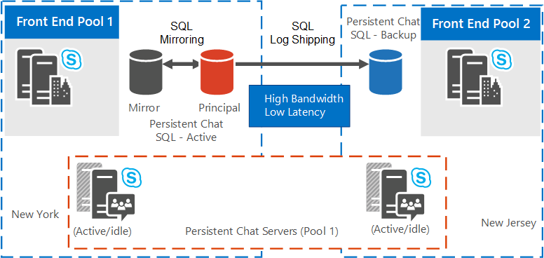

# 为 Skype for business Server 2015 中的持久聊天服务器规划高可用性和灾难恢复
 
**摘要：** 阅读本主题，了解如何在 Skype for business Server 2015 中规划持久聊天服务器的高可用性和灾难恢复。
  
持久聊天服务器的高可用性和灾难恢复需要更多资源，而不是完全操作所需的资源。 
  
> [!NOTE]
> 不支持为持久聊天服务器数据库使用 SQL AlwaysOn 高可用性组。 

> [!NOTE] 
> Skype for business Server 2015 中提供了持久聊天，但 Skype for business Server 2019 不再支持此功能。 团队中提供了相同的功能。 有关详细信息，请参阅[Microsoft 团队升级](/microsoftteams/upgrade-start-here)入门。 如果需要使用持久聊天，您可以选择将需要此功能的用户迁移到团队，或继续使用 Skype for Business Server 2015。 
  
## 资源要求

在为高可用性和灾难恢复配置持久聊天服务器之前，请确保你具有以下其他资源。 
  
- 一个专用数据库实例，位于永久聊天服务器服务的主前端所在的同一物理数据中心。 此数据库将用作主持久聊天数据库的 SQL Server 镜像。 （可选）如果希望自动故障转移到镜像数据库，请指定要用作镜像见证的其他 SQL Server。
    
- 一个位于其他物理数据中心的专用数据库实例。 此数据库将用作主数据中心中数据库的 SQL Server 日志传送辅助数据库。
    
- 一个专用数据库实例用作辅助数据库的 SQL Server 镜像。 （可选）将其他 SQL Server 指定为镜像见证服务器。 它们都必须位于辅助数据库所在的同一物理数据中心。
    
- 如果启用了持久聊天服务器合规性，则需要另外三个专用数据库实例。 其分布与以前为持久聊天数据库所概括的一样。 虽然合规性数据库可能与持久聊天数据库共享相同的 SQL Server 实例，但我们建议使用独立实例进行高可用性和灾难恢复。
    
- 必须为 SQL Server 日志传送事务日志创建和指定文件共享。 运行持久聊天数据库的两个数据中心中的所有 SQL 服务器都必须具有对此文件共享的读/写访问权限。 此共享不会定义为 FileStore 角色的一部分。
    
- 辅助数据库服务器上的文件共享，用作从主服务器文件共享复制的 SQL Server 事务日志的目标文件夹。
    
## 灾难恢复和高可用性解决方案

Skype for Business 服务器支持对后端服务器的多个高可用性模式，包括数据库镜像。 有关详细信息，请参阅[Plan for high availability and disaster recovery in Skype for Business Server 2015](../../plan-your-deployment/high-availability-and-disaster-recovery/high-availability-and-disaster-recovery.md)。 
  
本主题中介绍的持久聊天服务器的灾难恢复解决方案是在永久的持久聊天服务器池中构建的。 这不要求具有扩展的虚拟局域网 (VLAN)。 通过拉伸持久聊天服务器池，可以在拓扑中对一个池进行逻辑配置，但实际将服务器放在两个不同数据中心的池中。 你以相同方式为数据库配置 SQL Server 镜像，并在同一数据中心中部署数据库和镜像。 需要在辅助数据中心中配置一个备份数据库（在灾难恢复期间，用可选镜像来提供高可用性）。 这是在灾难恢复期间用于故障转移的备份数据库。 
  
有关如何配置持久聊天服务器的高可用性和灾难恢复的详细信息，请参阅[在 Skype for Business server 2015 中配置持久聊天服务器的高可用性和灾难恢复](../../deploy/deploy-persistent-chat-server/configure-hadr-for-persistent-chat.md)。 
  
下图显示了如何在两个不同的延伸池拓扑中配置持久聊天服务器池：
  
- 延长的持久聊天服务器池当数据中心位于具有高带宽/低延迟的地域时。
    
- 延长的持久聊天服务器池，在数据中心位于具有低带宽/高延迟的地域时。
    
图1显示了一个持续持续的持久聊天服务器池拓扑，其中数据中心具有高带宽/低延迟的地理位置。 假设以下内容适用于逻辑和物理拓扑：
  
- 逻辑拓扑包含以下组件：
    
  - 跨站点 1 和 2 的持久聊天池，包含服务器 1 到 8。
    
  - 前端服务器池、持久聊天数据库、镜像数据库以及（可选）驻留在站点1上的物理上的见证数据库（不显示在图表中）。 
    
  - 物理驻留在站点 2 上的第二个前端服务器池和一个备份数据库。
    
- 物理拓扑包括站点1和2，如下所示：
    
  - 站点 1 上的持久聊天池，包含服务器 1 到 4，两台活动，两台空闲。
    
  - 站点 5 上的持久聊天池，包含服务器 2 到 8，两台活动，两台空闲。
    
  - 前端服务器池、持久聊天数据库、镜像数据库，以及（可选）站点1上的见证数据库（不显示在图表中）。
    
  - 站点 2 上的一个前端服务器池和一个备份数据库（作为 SQL 日志传送目标）。
    
**数据中心按地理位置分布时的扩展持久聊天服务器池（高带宽/低延迟）**

  
图2显示了一个持续持续的持久聊天服务器池拓扑，其中数据中心具有较低带宽/高延迟的地理位置。
  
- 逻辑拓扑包含以下组件：
    
  - 跨站点 1 和 2 的持久聊天池，包含服务器 1 到 8。
    
  - 前端服务器池、持久聊天数据库、镜像数据库以及（可选）驻留在站点1上的物理上的见证数据库（不显示在图表中）。 
    
  - 物理驻留在站点 2 上的第二个前端服务器池和一个备份数据库。
    
- 物理拓扑包括站点1和2，如下所示：
    
  - 站点 1 上的持久聊天池，包含服务器 1 到 4，全部处于活动状态。
    
  - 站点 2 上的持久聊天池，包含服务器 5 到 8，全部处于空闲状态。
    
  - 前端服务器池、持久聊天数据库、镜像数据库，以及（可选）站点1上的见证数据库（不显示在图表中）。
    
  - 站点 2 上的一个前端服务器池和一个备份数据库（作为 SQL 日志传送目标）。
    
**数据中心按地理位置分布时的扩展持久聊天服务器池（低带宽/高延迟）**

  

