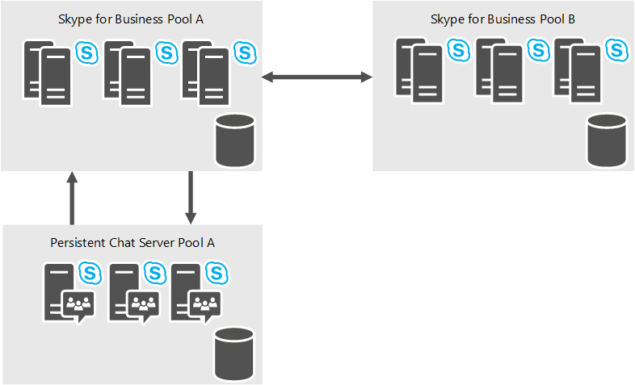

# 规划 Skype for Business Server 2015 中的持久聊天服务器
 
**摘要:** 阅读本主题, 了解如何在 Skype for Business Server 2015 中规划持久聊天服务器。
  
持久聊天服务器是一种可选角色, 允许组织中的多个用户参与不断保持的聊天室对话。 尽管用户可以在聊天会话期间实时通信，每个会话的内容 - 包括文本、链接和文件 - 将持久存在，这意味着用户可以随时查看和搜索所有会话内容。
  
持久聊天服务器可以通过以下方式帮助改善组织内的通信:
  
- 扩大组织内的信息意识和参与度
    
- 支持高效的信息共享 
    
- 改善团队间的通信，包括分散在不同地理位置的跨部门团队
    
- 减少信息过载
    
- 通过有选择地部署持久聊天合规性服务来遵守合规性法规

> [!NOTE] 
> Skype for business Server 2015 中提供了持久聊天, 但 Skype for business Server 2019 不再支持此功能。 团队中提供了相同的功能。 有关详细信息, 请参阅[Microsoft 团队升级](/microsoftteams/upgrade-start-here)入门。 如果需要使用持久聊天, 您可以选择将需要此功能的用户迁移到团队, 或继续使用 Skype for Business Server 2015。 
    
## 持久聊天服务器高级体系结构

下图显示了持久聊天服务器体系结构的高级视图。 
  

  
持久聊天包含前端服务器角色（提供持久聊天服务）以及后端 SQL 数据库组件。 前端和后端组件都包含在专门的持久聊天池中。 托管持久聊天服务器的每台计算机都必须具有访问现有 Skype for Business Server 2015 拓扑的权限。 在此图中, 有一个持久聊天服务器池 (A), 它依赖于 Skype for business 服务器池 A 来向其发送消息。
  
你可以部署一个或多个持久聊天服务器池, 每个池最多可以支持最多四个活动的80K 并发用户。
  
Skype for Business Server 2015 通过用于注册的会话初始协议 (SIP) 和通过 SIP 协议 (XCCOS) 进行的 "可扩展聊天通信" 与持久聊天服务进行通信, 进行聊天。 
  
## 持久聊天服务

下图显示了持久聊天服务器前端服务, 以及这些服务如何与后端数据库组件进行通信。 前端组件包括持久聊天服务和合规性服务。 后端组件包括持久聊天存储和持久聊天合规性存储。
  

  
### 聊天服务

聊天服务（也称作通道服务）是用于持久聊天服务器的核心服务。 聊天服务提供了以下功能：
  
- 接受传入消息
    
- 注册并列出持久聊天室内的联机参与者
    
- 向其他通道订阅者重新传输消息
    
- 实现通道管理、聊天室邀请、搜索和新内容通知的逻辑
    
持久聊天服务使用持久聊天存储来存储和访问聊天室内容和其他系统元数据（授权规则等）。 此服务将上载到聊天室中的文件存储到持久聊天文件存储中。
  
### 合规性服务

如果您的组织规定必须存档持久聊天活动，您可以部署可选的持久聊天合规性服务。 合规性服务用于将聊天内容和事件（比如加入和离开聊天室）存档到持久聊天合规性文件存储中。 合规性服务安装在持久聊天池中的每个持久聊天服务器上。 
  
### Web 服务

在 Skype for business 前端服务器上运行持久聊天 web 服务。 Web 服务依赖于 Internet 信息服务 (IIS)，其被实施为 Web 组件：
  
- 用于文件上载和下载的持久聊天 Web 服务   负责在聊天室中发布和检索文件。
    
- 用于聊天室管理的持久聊天 Web 服务负责为用户提供管理其聊天室和创建新聊天室的能力。
    
## 为您的组织定义要求

如果你决定部署持久聊天服务器, 你需要确定你的组织的业务需求, 然后定义拓扑、基础结构和技术要求以支持你的业务需求。 若要优化部署, 你需要回答以下问题:
  
- 是从早期版本的组聊天服务器还是以前版本的持久聊天服务器迁移还是首次部署持久聊天服务器？
    
- 谁可以使用持久聊天服务器？您指定持久聊天策略以在全局、站点或用户级别确定用户访问权限。
    
- 多少用户将要求访问持久聊天服务器？持久聊天服务器支持 150,000 个已设置用户（由策略启用）以及最多 80,000 个并发用户。一个持久聊天服务器可支持 20,000 个已连接用户，一个持久聊天服务器池可具有最多 4 个活动服务器，以便总共 80,000 个同时连接的用户使用。
    
- 您希望如何控制范围、信息隔离边界和访问？您可以定义 类别 来分隔这些边界，并选择可进入在每种类别中创建的聊天室的用户。
    
- 您希望如何控制可以创建聊天室的人员？ 您可以定义能够创建聊天室的创建者。 创建者可以将其他成员指定为聊天室管理者以对聊天室进行持续管理。
    
- 您希望如何创建聊天室？ 持久聊天服务器提供用于创建和管理会议室的基于 web 的功能。 这可以从 Skype for Business 客户端启动。 你可以选择定义实现你的业务需求和工作流的客户解决方案, 并配置持久聊天服务器以将用户引导到你的自定义解决方案。
    
- 您希望设置哪一类外接程序？ 外接程序将利用 Skype for Business 客户端中的可扩展性窗格来提供与聊天室相关的上下文，从而改进聊天室内体验。 您可以选择可能最有用的常规外接程序（例如，您的公司网站、内部协作文档等）。 聊天室管理员可选择某个注册的外接程序并将该外接程序与其聊天室关联（如果需要）。 
    
- 您具有哪一类高可用性和灾难恢复要求？ 持久聊天服务器支持 SQL Server 镜像和 SQL Server 群集以实现高可用性。 对于灾难恢复, 持久聊天服务器在带有 SQL Server 日志传送的延伸池中支持最多8台服务器 (4 主动和4备用)。 
    
- 是否存在法规要求？ 如果您的公司所在的国家或地区需要在国家/地区保留数据, 则您可能需要将多个持久聊天服务器池部署到特定地理位置。 房间、类别或加载项不会跨越池, 它仅属于一个持久聊天服务器池。 
    
    > [!NOTE]
    > 具有多个持久聊天服务器池不会为你提供更多规模 (你只能在所有持久聊天服务器池中使用80000并发用户)。 支持多个持久聊天服务器池的主要原因是支持法规问题。 
  
## 有关详细信息

有关安装和配置持久聊天服务器的详细信息，请参阅下列主题：
  
- 有关如何部署持久聊天服务器的详细信息, 请参阅[在 Skype For Business server 2015 中部署持久聊天服务器](../../deploy/deploy-persistent-chat-server/deploy-persistent-chat-server.md)。 
    
- 有关如何在持久聊天服务器部署上配置设置的详细信息, 请参阅[在 Skype For Business server 2015 中管理持久聊天服务器](../../manage/persistent-chat/persistent-chat.md)。
    

