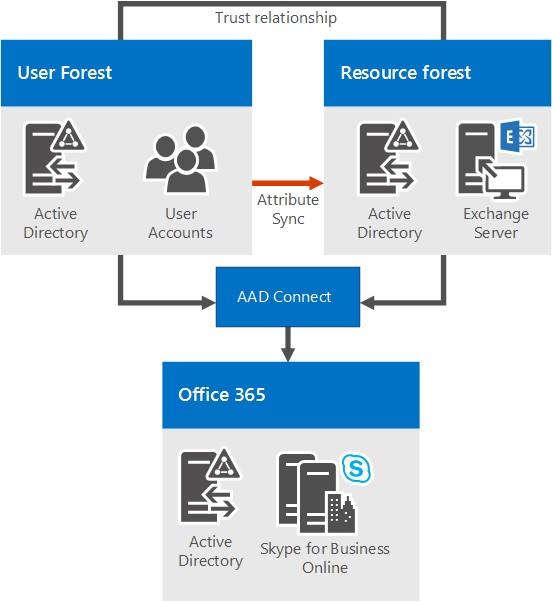

# Skype for business Server 2015 的环境要求
 
**摘要：** 为 Skype for business Server 2015 配置非服务器要求。 在部署（包括 Active Directory、DNS、证书和 Fileshares）之前，您需要配置各种不同的内容。
  
Skype for Business Server 2015 的环境要求是什么？ 我们已将并非直接与服务器相关的所有内容放在本主题中，因此您不必再点击一下。 如果要查找服务器必备组件，可以查看[Skype For Business server 2015 doc 的服务器要求](server-requirements.md)。[网络规划](../../plan-your-deployment/network-requirements/network-requirements.md)也是单独记录的。 否则，我们将在本文中获取以下内容：
  
- [Active Directory](environmental-requirements.md#AD)
  
- [域名系统 (DNS)](environmental-requirements.md#DNS)
  
- [证书](environmental-requirements.md#Certs)
  
- [文件共享](environmental-requirements.md#Fileshare)
  
## Active Directory

虽然服务器和服务的大量配置数据存储在 Skype for Business Server 2015 的中央管理存储中，但仍有一些内容存储在 Active Directory 中：
  
|**Active Directory 对象**|**对象类型**|
|:-----|:-----|
|架构扩展    |用户对象扩展    |
||Lync Server 2013 和 Lync Server 2010 的扩展，以保持与以前支持的版本的向后兼容性。    |
|数据    |用户 SIP URI 和其他用户设置    |
||应用程序的 Contact 对象（如响应组应用程序和会议助理应用程序）。    |
||为了向后兼容而发布的数据。    |
||中央管理存储的服务控制点（SCP）。    |
||Kerberos 身份验证帐户（一个可选的计算机对象）。    |
   
### 适用于域控制器的操作系统

那么，可以使用哪些域控制器操作系统？ 我们有以下列表：

- Windows Server 2019 （您必须拥有 Skype for Business Server 2015 累积更新5或更高版本）
  
- Windows Server 2016
    
- Windows Server 2012 R2
    
- Windows Server 2012
    
- Windows Server 2008 R2
    
- Windows Server 2008
    
现在，将 Skype for business Server 2015 部署到的任何域的域功能级别，并将 Skype for business Server 2015 部署到的任何林的林功能级别必须为以下项之一：

- Windows Server 2019 （您必须拥有 Skype for Business Server 2015 累积更新5或更高版本）
  
- Windows Server 2016
    
- Windows Server 2012 R2
    
- Windows Server 2012
    
- Windows Server 2008 R2
    
- Windows Server 2008
    
- Windows Server 2003
    
在这些环境中是否可以拥有只读的域控制器？ 当然，只要还有可在与 Skype for Business 服务器相同的站点上使用的可写域控制器。
  
现在，了解 Skype for Business Server 2015 不支持单标签域，这一点非常重要。 它们是什么？ 如果您有一个名为 "contoso. 本地" 的根域，这将是完好的。 如果您有一个仅命名为 local 的根域，则不会起作用，因此不支持。 有关这方面的详细信息，请参阅[本知识库文章](https://support.microsoft.com/kb/300684/en-us)。
  
Skype for Business Server 2015 也不支持重命名域。 如果你确实要执行此操作，则需要卸载 Skype for Business Server 2015，执行域重命名，然后重新安装 Skype for Business Server 2015。
  
最后，您可能会使用锁定的 AD DS 环境处理域，这完全正确。 有关如何在部署文档中将 Skype for Business Server 2015 部署到此类环境的详细信息。
  
### AD 拓扑

Skype for Business Server 2015 支持的拓扑为：
  
- 具有单个域的单林
    
- 具有单个树和多个域的单林
    
- 具有多个树和互不连接的命名空间的单林
    
- 中央林拓扑中的多林
    
- 资源林拓扑中的多林
    
- 具有 Exchange Online 的 Skype for Business 资源林拓扑中的多个林
    
- 具有 Skype for Business Online 和 Azure Active Directory Connect 的资源林拓扑中的多个林
    
我们有图示和说明，可帮助您确定您的环境中的拓扑，或者安装 Skype for Business Server 2015 之前可能需要设置的内容。 为简单起见，我们还包括一个键：
  

  
#### 具有单个域的单林

  
它不会比此更简单，它是一个单域林，这是一个常见拓扑。
  
#### 具有单个树和多个域的单林

  
此图再次显示了一个林，但它还具有一个或多个子域（在此特定示例中有三个）。 因此，在其中创建用户的域可能不同于将 Skype for business Server 2015 部署到的域。 为什么要考虑这一点呢？ 请务必记住，在部署 Skype for business Server 前端池时，池中的所有服务器都需要位于单个域中。 你可以通过 Skype for Business Server 对 Windows 通用管理员组的支持进行跨域管理。
  
回到上图中，可以看到一个域中的用户能够从同一个域或来自不同域访问 Skype for Business Server 池，即使这些用户位于子域中也是如此。
  
#### 具有多个树和互不连接的命名空间的单林

  
可能是您有一个类似于此图的拓扑，其中您有一个林，但在该林中是多个域，分别具有单独的 AD 命名空间。 如果是这种情况，则此图是一个很棒的说明，因为我们在三个不同的域中拥有访问 Skype for Business Server 2015 的用户。 实线表示他们在自己的域中访问的是 Skype for Business Server 池，而一条虚线指示他们将转到其他树中的池。
  
正如您所看到的，同一个域中的用户、相同的树，甚至不同的树都可以成功访问池。
  
#### 中央林拓扑中的多林

  
Skype for Business Server 2015 支持在中央林拓扑中配置多个林。 如果你不确定这是什么，拓扑中的中央林将使用其中的对象来表示其他林中的用户，并为林中的任何用户承载用户帐户。
  
这是如何工作的？ 嗯，目录同步产品（如 Forefront Identity Manager 或 FIM）在其所有存在中管理组织的用户帐户。 从林中创建或删除帐户时，该更改将同步到中央林中的相应联系人。
  
显然，如果您的 AD 基础结构就地迁移到此拓扑可能不是很简单，但如果您已经存在，或者仍在规划林基础结构，则可以选择此选项。 您可以将 Skype for Business Server 2015 部署集中在单个林中，用户可以在任何林中搜索、通信和查看其他用户的状态。 将使用同步软件自动处理所有用户联系人更新。
  
#### Skype for Business 资源林拓扑中的多个林

  
此外，还支持资源林拓扑;在这种情况下，林专用于运行服务器应用程序，如 Microsoft Exchange Server 和 Skype for business Server 2015。 此资源林还托管活动用户对象的同步表示形式，但没有启用登录的用户帐户。 因此，资源林是用户对象所驻留的其他林的共享服务环境，它们与资源林之间存在林级信任关系。
  
请注意，Exchange Server 可以部署在与 Skype for Business Server 相同的资源林中，也可以部署在不同的林中。
  
若要在此类型的拓扑中部署 Skype for Business Server 2015，您可以在资源林中为用户林中的每个用户帐户创建一个禁用的用户对象（如果 "Microsoft Exchange Server 已在环境中"，则可能会为您执行此操作）。 然后，您需要目录同步工具（如 Forefront Identity Manager 或 FIM）通过其生命周期管理用户帐户。
  
#### 具有 Exchange Online 的 Skype for Business 资源林拓扑中的多个林

此拓扑类似于[Skype For business 资源林拓扑中的多个林中](environmental-requirements.md#BKMK_multipleforestopology)所述的拓扑。
  
在此拓扑中，有一个或多个用户林，且 Skype for Business Server 部署在专用资源林中。 Exchange Server 可以部署在同一资源林或不同林的本地部署中，并配置为与 Exchange Online 混合使用，否则本地帐户的 Exchange Online 可能会专门提供电子邮件服务。 没有可用于此拓扑的关系图。
  
#### 具有 Skype for Business Online 和 Azure Active Directory Connect 的资源林拓扑中的多个林

  
在此方案中，有多个具有资源林拓扑的本地林。 Active Directory 林之间存在完全信任关系。 Azure Active Directory Connect 工具用于在本地用户林与 Office 365 之间同步帐户。
  
 组织还具有 Office 365，并使用[Azure Active Directory Connect](https://go.microsoft.com/fwlink/p/?LinkId=614836)将其本地帐户与 Office 365 同步。 为 Skype for business 启用的用户是通过 Office 365 和 Skype for Business Online 启用的。 未在本地部署 Skype for Business Server。
  
单一登录身份验证由位于用户林中的 Active Directory 联合身份验证服务场提供。
  
在这种情况下，支持在本地部署 Exchange、Exchange Online、混合 Exchange 解决方案或根本不部署 Exchange。 （图表仅显示本地 Exchange，但还完全支持其他 Exchange 解决方案。）
  
#### 具有混合 Skype for Business 的资源林拓扑中的多个林

在这种情况下，有一个或多个本地用户林，Skype for Business 部署在专用资源林中，并配置为使用 Skype for Business Online 的混合模式。 Exchange Server 可以部署在同一资源林或不同林的本地部署中，并且可以为与 Exchange Online 的混合配置。 或者，电子邮件服务可能仅由 Exchange Online 为本地帐户提供。
  
有关详细信息，请参阅[配置混合 Skype For business 的多林环境](../../skype-for-business-hybrid-solutions/deploy-hybrid-connectivity/configure-a-multi-forest-environment-for-hybrid.md)。
  
## 域名系统 (DNS)

Skype for Business Server 2015 需要 DNS，原因如下：
  
- DNS 使 Skype for Business Server 2015 能够发现内部服务器或池，从而实现服务器到服务器的通信。
    
- DNS 允许客户端计算机发现用于 SIP 事务的前端池或 Standard Edition 服务器。
    
- 它将会议的简单 Url 与托管这些会议的服务器相关联。
    
- DNS 允许外部用户和客户端计算机连接到边缘服务器或 HTTP 反向代理，以用于即时消息（IM）或会议。
    
- 它允许未登录的统一通信（UC）设备发现运行设备更新 web 服务的前端池或 Standard Edition 服务器以获取更新和发送日志。
    
- 使用 DNS，移动客户端可以自动发现 web 服务资源，而无需用户在其设备设置中手动输入 Url。
    
- 并在 DNS 负载平衡中使用。
    
请务必注意，Skype for Business Server 2015 不支持国际化域名（Idn）。
  
此外，请务必记住，DNS 中的任何名称与 Skype for business Server 2015 使用的任何服务器上配置的计算机名称相同。 具体来说，在环境中不能有任何短名称，并且必须具有 "拓扑生成器" 的 Fqdn。
  
这似乎是已加入域的任何计算机的逻辑，但如果您的边缘服务器未加入您的域，则它可能具有一个短名称的默认值，没有域后缀。 请确保在 DNS 或边缘服务器上或者在此情况下的任何 Skype for Business Server 2015 服务器或池上都不是这种情况。
  
且绝对不要使用 Unicode 字符或下划线。 标准字符（即 A-z、a-z、0-9 和连字符）是要由外部 DNS 和公共证书颁发机构支持的字符（需要将 Fqdn 分配给证书中的 SN，别忘了），因此，在 grief 的情况下，你将亲自为自己备了大量的文件。为此，请记住这一点。
  
有关网络的 DNS 要求的进一步阅读，请参阅我们的规划文档的[网络](../../plan-your-deployment/network-requirements/network-requirements.md)部分。
  
## 证书

在部署之前，您可以执行的最重要的操作之一是确保您的证书按顺序排列。 Skype for Business Server 2015 需要一个用于传输层安全性（TLS）和相互传输层安全性（MTLS）连接的公钥基础结构（PKI）。 通常，若要以标准化方式进行安全通信，Skype for Business Server 使用由证书颁发机构（Ca）颁发的证书。
  
以下是 Skype for Business Server 2015 使用证书的一些内容：
  
- 客户端和服务器之间的 TLS 连接
    
- 服务器之间的 MTLS 连接
    
- 联合 usin 合作伙伴的自动 DNS 发现
    
- 远程用户访问即时消息 (IM)
    
- 外部用户对音频/视频（AV）会话、应用程序共享和会议的访问
    
- 与 web 应用程序和 Outlook Web Access （OWA）对话
    
因此，必须进行证书规划。 现在，我们来看看在请求证书时需要注意的一些事项的列表：
  
- 所有服务器证书都必须支持服务器授权（服务器 EKU）。
    
- 所有服务器证书都必须包含一个 CRL 分发点 (CDP)。
    
- 必须使用操作系统支持的签名算法对所有证书进行签名。 Skype for Business Server 2015 支持 SHA-1 和 SHA-1 系列的摘要大小（224、256、384和512），并满足或超过操作系统要求。
    
- 运行 Skype for Business Server 2015 的内部服务器支持自动注册。
    
- Skype for business Server 2015 Edge 服务器不支持自动注册。
    
- 向 Windows Server 2003 CA 提交基于 Web 的证书请求时，必须在运行 Windows Server 2003 SP2 或 Windows XP 的计算机上进行提交。
    
> [!NOTE]
> 尽管 KB922706 为解决使用 Windows Server 2003 证书服务 web 注册的 web 证书的问题提供支持，但不能使用 Windows Server 2008、Windows Vista 或 Windows 7 来请求证书。从 Windows Server 2003 CA。 
  
> [!NOTE]
> 不支持使用 RSASSA-PSS 签名算法，这可能会导致登录和呼叫转发问题，以及其他问题中的错误。 

> [!NOTE]
> Skype for Business Server 2015 不支持 CNG 证书。
  
- 支持的加密密钥长度为1024、2048和4096。 建议使用大于或等于2048的密钥长度。
    
- 默认摘要或哈希签名算法为 RSA。 此外，还支持 ECDH_P256、ECDH_P384 和 ECDH_P521 算法。
    
所以，有很多想法需要考虑，当然，从 CA 请求证书会带来更多舒适的水平。 我们将在下面向您提供一些进一步的指导，以尽可能轻松地进行规划。
  
### 内部服务器的证书

你将需要大多数内部服务器的证书，并且很可能会从内部 CA （位于你的域中的）获取证书。 如果需要，可以从外部 CA （位于 internet 上的 CA）请求这些证书。 如果您想知道应该转到什么公共 CA，可以查看[统一通信证书合作伙伴](/SkypeForBusiness/certification/services-ssl)列表。
  
当 Skype for Business Server 2015 与其他应用程序和服务器（如 Microsoft Exchange Server）通信时，您还需要证书。 显然，这将需要是其他应用程序和服务器可以以受支持的方式使用的证书。 Skype for Business Server 2015 和其他 Microsoft 产品支持用于服务器到服务器身份验证和授权的开放授权（OAuth）协议。 如果你对此感到感兴趣，我们将为 OAuth 和 Skype for business Server 2015 提供其他规划文章。
  
Skype for Business Server 2015 还包括对（无需）使用 SHA-256 加密哈希函数签名的（无需）证书的支持。 若要使用 SHA-256 支持外部访问，外部证书需要由使用 SHA-256 的公共 CA 颁发。
  
为尽量简单地进行处理，我们已将 Standard Edition 服务器、前端池和其他角色的证书要求放在下表中，并将使用虚构的 contoso.com 用于示例（您可能会使用一些东西）。适用于您的环境的其他）。 这些是包含不可导出的私钥的所有标准 web 服务器证书。 需要注意的一些其他事项：
  
- 当您使用证书向导请求证书时，将自动配置服务器增强型密钥用法（EKU）。
    
- 每个证书友好名称在计算机存储中必须是唯一的。
    
- 根据下面的示例名称，如果已在 DNS 中配置 sipinternal.contoso.com 或 sipexternal.contoso.com，则需要将它们添加到证书的使用者备用名称（SAN）。
    
Standard Edition 服务器的证书：
  
|**证书**|**使用者名称/常用名称**|**使用者替代名称**|**示例**|**Comments**|
|:-----|:-----|:-----|:-----|:-----|
|默认值    |池的 FQDN    |服务器池和 FQDN 的 FQDN    如果具有多个 SIP 域并已启用自动客户端配置，则证书向导会检测并添加所有受支持的 SIP 域 FQDN。    如果此池是客户端的自动登录服务器，而且组策略要求执行严格的域名系统 (DNS) 匹配，那么还需要 sip.sipdomain 条目（对应于您拥有的每个 SIP 域）。    |SN = se01;SAN = se01    如果此池是客户端的自动登录服务器，而且组策略要求执行严格的 DNS 匹配，则还需要 SAN=sip.contoso.com; SAN=sip.fabrikam.com。    |在 Standard Edition servers Standard Edition server 上，服务器 FQDN 与池 FQDN 相同。    证书向导会检测您在安装过程中所指定的任何 SIP 域，然后自动将它们添加到使用者替代名称中。    您还可以使用此证书进行服务器到服务器身份验证。    |
|Web 内部    |服务器的 FQDN    |以下各项：    •内部 web FQDN （与服务器的 FQDN 相同）    AND    •满足简单 Url    •电话拨入式简单 URL    •管理员简单 URL    或    •简单 Url 的通配符条目    |SN = se01;SAN = se01;SAN = "contoso .com";SAN = 符合 fabrikam .com;SAN = contoso .com;SAN = .com    使用通配符证书：    SN = se01;SAN = se01;SAN =\*contoso.com    |您不能在拓扑生成器中覆盖内部 web FQDN。    如果您有多个满足简单 Url 的简单 Url，则必须将其全部包含为 SANs。    简单 URL 条目支持通配符条目。    |
|Web 外部    |服务器的 FQDN    |以下各项：    •外部 web FQDN    AND    •电话拨入式简单 URL    •满足每个 SIP 域的简单 Url    或    •简单 Url 的通配符条目    |SN = se01;SAN = webcon01;SAN = "contoso .com";SAN = 符合 fabrikam .com;SAN = "contoso .com"    使用通配符证书：    SN = se01;SAN = webcon01;SAN =\*contoso.com    |如果您有多个满足简单 Url 的简单 Url，则必须将其全部包含为主题替代名称。    简单 URL 条目支持通配符条目。    |
   
前端服务器在前端池中的证书：
  
|**证书**|**使用者名称/常用名称**|**使用者替代名称**|**示例**|**Comments**|
|:-----|:-----|:-----|:-----|:-----|
|默认值    |池的 FQDN    |服务器池和 FQDN 的 FQDN    如果具有多个 SIP 域并已启用自动客户端配置，则证书向导会检测并添加所有受支持的 SIP 域 FQDN。    如果此池是客户端的自动登录服务器，而且组策略要求执行严格的域名系统 (DNS) 匹配，那么还需要 sip.sipdomain 条目（对应于您拥有的每个 SIP 域）。    |SN = eepool;SAN = eepool;SAN = ee01    如果此池是客户端的自动登录服务器，而且组策略要求执行严格的 DNS 匹配，则还需要 SAN=sip.contoso.com; SAN=sip.fabrikam.com。    |证书向导会检测您在安装过程中所指定的任何 SIP 域，然后自动将它们添加到使用者替代名称中。    您还可以使用此证书进行服务器到服务器身份验证。    |
|Web 内部    |池的 FQDN    |以下各项：    •内部 web FQDN （与服务器的 FQDN 不同）    •服务器 FQDN    • Skype for Business 池 FQDN    AND    •满足简单 Url    •电话拨入式简单 URL    •管理员简单 URL    或    •简单 Url 的通配符条目    |SN = ee01;SAN = ee01;SAN = "contoso .com";SAN = 符合 fabrikam .com;SAN = contoso .com;SAN = .com    使用通配符证书：    SN = ee01;SAN = ee01;SAN =\*contoso.com    |如果您有多个满足简单 Url 的简单 Url，则必须将其全部包含为主题替代名称。    简单 URL 条目支持通配符条目。    |
|Web 外部    |池的 FQDN    |以下各项：    •外部 web FQDN    AND    •电话拨入式简单 URL    •管理员简单 URL    或    •简单 Url 的通配符条目    |SN = ee01;SAN = webcon01;SAN = "contoso .com";SAN = 符合 fabrikam .com;SAN = "contoso .com"    使用通配符证书：    SN = ee01;SAN = webcon01;SAN =\*contoso.com    |如果您有多个满足简单 Url 的简单 Url，则必须将其全部包含为主题替代名称。    简单 URL 条目支持通配符条目。    |
   
Director 的证书：
  
|**证书**|**使用者名称/常用名称**|**使用者替代名称**|**示例**|
|:-----|:-----|:-----|:-----|
|默认值    |控制器池    |控制器的 FQDN、控制器池的 FQDN。    如果此池是客户端的自动登录服务器，并且组策略中需要严格的 DNS 匹配，则还需要 sipdomain （针对每个 SIP 域）的条目。    |pool.contoso.com;SAN = dir01    如果此控制器池是客户端的自动登录服务器，而且组策略要求执行严格的 DNS 匹配，那么您还需要 SAN=sip.contoso.com; SAN=sip.fabrikam.com。    |
|Web 内部    |服务器的 FQDN    |以下各项：    •内部 web FQDN （与服务器的 FQDN 相同）    •服务器 FQDN    • Skype for Business 池 FQDN    AND    •满足简单 Url    •电话拨入式简单 URL    •管理员简单 URL    或    •简单 Url 的通配符条目    |SN = dir01;SAN = dir01;SAN = "contoso .com";SAN = 符合 fabrikam .com;SAN = contoso .com;SAN = .com    使用通配符证书：    SN = dir01;SAN = dir01 SAN =\*. contoso.com    |
|Web 外部    |服务器的 FQDN    |以下各项：    •外部 web FQDN    AND    •满足每个 SIP 域的简单 Url    •电话拨入式简单 URL    或    •简单 Url 的通配符条目    |控制器外部 web FQDN 必须不同于前端池或前端服务器。    SN = dir01;SAN = directorwebcon01 SAN = "contoso. .com";SAN = 符合 fabrikam .com;SAN = "contoso .com"    使用通配符证书：    SN = dir01;SAN = directorwebcon01 SAN =\*. contoso.com    |
   
独立中介服务器的证书：
  
|**证书**|**使用者名称/常用名称**|**使用者替代名称**|**示例**|
|:-----|:-----|:-----|:-----|
|默认值    |池的 FQDN    |池的 FQDN    池成员服务器的 FQDN    |SN = medsvr-pool.contoso.net;SAN = medsvr-pool.contoso.net;SAN = medsvr01    |
   
Survivable 分支设备的证书：
  
|**证书**|**使用者名称/常用名称**|**使用者替代名称**|**示例**|
|:-----|:-----|:-----|:-----|
|默认值    |设备的 FQDN    |SIP.\<sipdomain\> （每个 SIP 域仅需要一个条目）    |SN = sba01;SAN = "contoso .com";SAN = sip. .com    |
   
### 持久聊天服务器的证书

安装持久聊天服务器时，将需要与 Skype for business Server 2015 内部服务器所使用的 CA 颁发的证书。 需要为运行持久聊天 Web 服务的每台服务器执行文件上载/下载。 强烈建议您先拥有必需的证书，然后再启动持久聊天安装，如果您的 CA 是外部的，更好地使用，则可能需要一些时间才能发出这些内容。
  
### 外部用户访问的证书（边缘）

Skype for Business Server 2015 支持使用**单个公共证书**访问和 Web 会议边缘外部接口以及 a/V 身份验证服务，这是通过边缘服务器提供的。 你的边缘内部接口通常使用由内部 CA 颁发的专用证书，但如果你愿意，也可以将公共证书用于此证书（如果它来自受信任的 CA）。
  
反向代理（RP）也将使用公共证书，并使用 HTTP （或更精确地说 TLS over HTTP）将来自你的 RP 的通信加密到客户端，并将 RP 加密为内部服务器。
  
### 移动性证书

如果要部署移动性并支持自动发现移动客户端，则需要在您的证书上添加一些其他主题替代名称条目，以支持来自移动客户端的安全连接。
  
哪个证书？ 你将需要在以下证书上自动发现的 SAN 名称：
  
- 控制器池
    
- 前端池
    
- 反向代理
    
我们将在下面列出每个表中的细节。
  
现在，这是一个很好的预规划，但有时您已部署 Skype for Business Server 2015，而不打算部署移动性，并且在您的环境中已经有证书的情况下。 通过内部 CA 重新发起它们通常相当简单，但使用公共 CA 的公共证书可能会更 pricy。
  
如果这是您要查看的内容，并且有很多 SIP 域（这将增加 SAN 的成本），则可以将反向代理配置为对初始自动发现服务请求使用 HTTP，而不是使用 HTTPS （这是默认值配置）。 "规划移动性" 主题包含有关此功能的详细信息。
  
控制器池和前端池证书要求：
  
|**说明**|**SAN 条目**|
|:-----|:-----|
|内部自动发现服务 URL    |SAN = lyncdiscoverinternal.。\<sipdomain\>    |
|外部自动发现服务 URL    |SAN = lyncdiscover.。\<sipdomain\>    |
   
您也可以使用 SAN =\*。\<sipdomain\>
  
反向代理（公用 CA）证书要求：
  
|**说明**|**SAN 条目**|
|:-----|:-----|
|外部自动发现服务 URL    |SAN = lyncdiscover.。\<sipdomain\>    |
   
此 SAN 需要分配给在反向代理上分配给 SSL 侦听器的证书。
  
> [!NOTE]
> 你的反向代理侦听器将拥有适用于你的外部 Web 服务 URL 的 SANs。 如果您部署了 Director （可选），则有些示例为 SAN = skypewebextpool01 和 dirwebexternal.contoso.com。 
  
## 文件共享

Skype for Business Server 2015 可以对所有文件存储使用相同的文件共享。 您需要记住以下几点：
  
- 文件共享需要在直接连接存储（DAS）或存储区域网络（SAN）上，其中包括分布式文件系统（DFS）以及文件存储的独立磁盘冗余阵列（RAID）。 有关适用于 Windows Server 2012 的 DFS 的进一步阅读，请查看[此 DFS 页面](https://technet.microsoft.com/library/jj127250.aspx)。
    
- 我们建议对文件共享使用共享群集。 如果你使用的是，则应群集 Windows Server 2012 或 Windows Server 2012 R2。 Windows Server 2008 R2 也是可接受的。 为什么要获取最新窗口？ 较旧的版本可能不具有启用所有功能的正确权限。 您可以使用群集管理器创建文件共享，并[了解如何在群集文章上创建文件共享](https://support.microsoft.com/help/224967/how-to-create-file-shares-on-a-cluster)将帮助您了解这些详细信息。
    
> [!CAUTION] 
> 您应该知道，不支持使用网络附加存储（NAS）作为文件共享，因此请使用上面列出的选项之一。 
  
