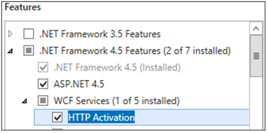

# <a name="server-requirements-for-skype-for-business-server-2015"></a><span data-ttu-id="033d3-104">Skype for business Server 2015 的服务器要求</span><span class="sxs-lookup"><span data-stu-id="033d3-104">Server requirements for Skype for Business Server 2015</span></span>
 
<span data-ttu-id="033d3-105">**摘要：** 使用本主题准备 Skype for business Server 2015 服务器。</span><span class="sxs-lookup"><span data-stu-id="033d3-105">**Summary:** Prepare your Skype for Business Server 2015 servers with this topic.</span></span> <span data-ttu-id="033d3-106">硬件、操作系统、数据库、软件、所有系统要求和建议都可帮助确保成功安装和部署服务器场。</span><span class="sxs-lookup"><span data-stu-id="033d3-106">Hardware, OS, databases, software, all the system requirements and recommendations are here to help ensure a successful install and deployment of your server farm.</span></span>

<span data-ttu-id="033d3-107">如果要查找环境要求（如 Active Directory、DNS 或证书），可以查看[Skype for Business Server 2015 doc 的环境要求](environmental-requirements.md)。</span><span class="sxs-lookup"><span data-stu-id="033d3-107">If you're looking for environmental requirements, such as Active Directory, DNS or certificates, you can check out the [Environmental requirements for Skype for Business Server 2015](environmental-requirements.md) doc.</span></span>
  
<span data-ttu-id="033d3-108">如您所料，开始部署 Skype for Business Server 2015 之前，还需要做一些准备工作。</span><span class="sxs-lookup"><span data-stu-id="033d3-108">As you might expect, there are some preparations to make before you begin deploying Skype for Business Server 2015.</span></span> <span data-ttu-id="033d3-109">本文将指导您规划以下内容：</span><span class="sxs-lookup"><span data-stu-id="033d3-109">This article will walk you through planning for the following:</span></span>
  
- [<span data-ttu-id="033d3-110">Skype for business Server 2015 的硬件</span><span class="sxs-lookup"><span data-stu-id="033d3-110">Hardware for Skype for Business Server 2015</span></span>](server-requirements.md#Hardware)
  
- [<span data-ttu-id="033d3-111">适用于 Skype for business Server 2015 的操作系统</span><span class="sxs-lookup"><span data-stu-id="033d3-111">Operating systems for Skype for Business Server 2015</span></span>](server-requirements.md#OS)
  
- [<span data-ttu-id="033d3-112">将与 Skype for Business Server 2015 配合使用的后端数据库</span><span class="sxs-lookup"><span data-stu-id="033d3-112">Back end databases that will work with Skype for Business Server 2015</span></span>](server-requirements.md#DBs)
  
- [<span data-ttu-id="033d3-113">在 Skype for business Server 2015 部署之前应安装的软件</span><span class="sxs-lookup"><span data-stu-id="033d3-113">Software that should be installed before a Skype for Business Server 2015 deployment</span></span>](server-requirements.md#Software)
  
## <a name="hardware-for-skype-for-business-server-2015"></a><span data-ttu-id="033d3-114">Skype for business Server 2015 的硬件</span><span class="sxs-lookup"><span data-stu-id="033d3-114">Hardware for Skype for Business Server 2015</span></span>
<span data-ttu-id="033d3-115"><a name="Hardware"> </a></span><span class="sxs-lookup"><span data-stu-id="033d3-115"><a name="Hardware"> </a></span></span>

<span data-ttu-id="033d3-116">现在，您已将拓扑关闭（如果没有，您可以查看[Skype for Business Server 2015 主题的拓扑基础知识](../../plan-your-deployment/topology-basics/topology-basics.md)），那就是考虑使用服务器的时间了。</span><span class="sxs-lookup"><span data-stu-id="033d3-116">Now that you have your topology down (and if you don't, you can check out the [Topology Basics for Skype for Business Server 2015](../../plan-your-deployment/topology-basics/topology-basics.md) topic), it's time to think about servers.</span></span> <span data-ttu-id="033d3-117">Skype for Business Server 2015 服务器将需要64位硬件。</span><span class="sxs-lookup"><span data-stu-id="033d3-117">Skype for Business Server 2015 servers will require 64-bit hardware.</span></span> <span data-ttu-id="033d3-118">我们的硬件建议如下。</span><span class="sxs-lookup"><span data-stu-id="033d3-118">Our recommendations for hardware are below.</span></span> <span data-ttu-id="033d3-119">这些不是要求，但它们反映了实现最佳性能所需的要求。</span><span class="sxs-lookup"><span data-stu-id="033d3-119">These aren't requirements, but they reflect the requirements necessary for optimal performance.</span></span> <span data-ttu-id="033d3-120">我们有容量规划文档，它将根据您的环境，帮助您确定是否需要更多。</span><span class="sxs-lookup"><span data-stu-id="033d3-120">We have capacity planning documentation that will help you determine if you need more than this, depending on your circumstances.</span></span>
  
<span data-ttu-id="033d3-121">适用于前端服务器、后端服务器、Standard Edition 服务器和持久聊天服务器的建议硬件：</span><span class="sxs-lookup"><span data-stu-id="033d3-121">Recommended hardware for Front End Servers, Back End Servers, Standard Edition servers, and Persistent Chat Servers:</span></span>
  
|<span data-ttu-id="033d3-122">**硬件组件**</span><span class="sxs-lookup"><span data-stu-id="033d3-122">**Hardware component**</span></span>|<span data-ttu-id="033d3-123">**适合**</span><span class="sxs-lookup"><span data-stu-id="033d3-123">**Recommended**</span></span>|
|:-----|:-----|
|<span data-ttu-id="033d3-124">CPU</span><span class="sxs-lookup"><span data-stu-id="033d3-124">CPU</span></span>  <br/> |<span data-ttu-id="033d3-125">64位双处理器、hex-core、2.26 千兆赫兹（GHz）或更高版本。</span><span class="sxs-lookup"><span data-stu-id="033d3-125">64-bit dual processor, hex-core, 2.26 gigahertz (GHz) or higher.</span></span>  <br/> <span data-ttu-id="033d3-126">Skype for business Server 2015 角色不支持 Intel Itanium 处理器。</span><span class="sxs-lookup"><span data-stu-id="033d3-126">Intel Itanium processors are not supported for Skype for Business Server 2015 roles.</span></span>  <br/> |
|<span data-ttu-id="033d3-127">内存</span><span class="sxs-lookup"><span data-stu-id="033d3-127">Memory</span></span>  <br/> |<span data-ttu-id="033d3-128">32千兆字节（GB）。</span><span class="sxs-lookup"><span data-stu-id="033d3-128">32 gigabytes (GB).</span></span>  <br/> |
|<span data-ttu-id="033d3-129">磁盘</span><span class="sxs-lookup"><span data-stu-id="033d3-129">Disk</span></span>  <br/> |<span data-ttu-id="033d3-130">请</span><span class="sxs-lookup"><span data-stu-id="033d3-130">EITHER:</span></span>  <br/> <span data-ttu-id="033d3-131">•8个或更多 10000 RPM 硬盘，至少有 72 GB 的可用磁盘空间（两个磁盘使用 RAID 1，6个磁盘使用 RAID 10）。</span><span class="sxs-lookup"><span data-stu-id="033d3-131">• 8 or more 10000 RPM hard disk drives with at least 72 GB free disk space (two of the disks using RAID 1 and 6 using RAID 10).</span></span>  <br/> <span data-ttu-id="033d3-132">或</span><span class="sxs-lookup"><span data-stu-id="033d3-132">OR</span></span>  <br/> <span data-ttu-id="033d3-133">•稳定状态驱动器（Ssd）能够为 8 10000 RPM 机械磁盘驱动器提供相同的可用空间和类似的性能。</span><span class="sxs-lookup"><span data-stu-id="033d3-133">• Solid state drives (SSDs) able to provide the same free space and similar performance to 8 10000 RPM mechanical disk drives.</span></span>  <br/> |
|<span data-ttu-id="033d3-134">网络</span><span class="sxs-lookup"><span data-stu-id="033d3-134">Network</span></span>  <br/> |<span data-ttu-id="033d3-135">1个双端口网络适配器，1 Gbps 或更高（2个网络适配器可以使用，但需要使用一个 MAC 地址和一个 IP 地址进行分组）。</span><span class="sxs-lookup"><span data-stu-id="033d3-135">1 dual-port network adapter, 1 Gbps or higher (2 network adapters can be used, but they need to be teamed with a single MAC address and a single IP address).</span></span>  <br/> <span data-ttu-id="033d3-136">前端服务器、后端服务器、Standard Edition 服务器和持久聊天服务器**不**支持双宿主或多宿主配置。</span><span class="sxs-lookup"><span data-stu-id="033d3-136">Dual or multi-homed configurations are **not** supported for Front End Servers, Back End Servers, Standard Edition servers, and Persistent Chat Servers.</span></span> <br/> <span data-ttu-id="033d3-137">只要不向操作系统公开并使用它来监视和管理服务器硬件，您就可以拥有带外管理系统，如 DRAC 或 ILO。</span><span class="sxs-lookup"><span data-stu-id="033d3-137">As long as they are not exposed to the operating system and are being used to monitor and manage server hardware, you can have out of band management systems, such as DRAC or ILO.</span></span> <span data-ttu-id="033d3-138">此方案不构成多穴服务器，并且受支持。</span><span class="sxs-lookup"><span data-stu-id="033d3-138">This scenario doesn't constitute a multi-homed server, and it is supported.</span></span>  <br/> |
   
<span data-ttu-id="033d3-139">适用于边缘服务器、独立中介服务器、视频互操作服务器和控制器的推荐硬件：</span><span class="sxs-lookup"><span data-stu-id="033d3-139">Recommended hardware for Edge Servers, standalone Mediation Servers, Video Interop Servers, and Directors:</span></span>
  
|<span data-ttu-id="033d3-140">**硬件组件**</span><span class="sxs-lookup"><span data-stu-id="033d3-140">**Hardware component**</span></span>|<span data-ttu-id="033d3-141">**适合**</span><span class="sxs-lookup"><span data-stu-id="033d3-141">**Recommended**</span></span>|
|:-----|:-----|
|<span data-ttu-id="033d3-142">CPU</span><span class="sxs-lookup"><span data-stu-id="033d3-142">CPU</span></span>  <br/> |<span data-ttu-id="033d3-143">64位双处理器、四核、2.26 千兆位（GHz）或更高版本。</span><span class="sxs-lookup"><span data-stu-id="033d3-143">64-bit dual processor, quad-core, 2.26 gigahertz (GHz) or higher.</span></span>  <br/> <span data-ttu-id="033d3-144">Skype for business Server 2015 角色不支持 Intel Itanium 处理器。</span><span class="sxs-lookup"><span data-stu-id="033d3-144">Intel Itanium processors are not supported for Skype for Business Server 2015 roles.</span></span>  <br/> |
|<span data-ttu-id="033d3-145">内存</span><span class="sxs-lookup"><span data-stu-id="033d3-145">Memory</span></span>  <br/> |<span data-ttu-id="033d3-146">16 gb。</span><span class="sxs-lookup"><span data-stu-id="033d3-146">16 gigabytes.</span></span>  <br/> |
|<span data-ttu-id="033d3-147">磁盘</span><span class="sxs-lookup"><span data-stu-id="033d3-147">Disk</span></span>  <br/> |<span data-ttu-id="033d3-148">请</span><span class="sxs-lookup"><span data-stu-id="033d3-148">EITHER:</span></span>  <br/> <span data-ttu-id="033d3-149">•4个或更多 10000 RPM 硬盘，至少有 72 GB 的可用磁盘空间（磁盘应采用 2x RAID 1 配置）。</span><span class="sxs-lookup"><span data-stu-id="033d3-149">• 4 or more 10000 RPM hard disk drives with at least 72 GB free disk space (the disks should be in a 2x RAID 1 configuration).</span></span>  <br/> <span data-ttu-id="033d3-150">或</span><span class="sxs-lookup"><span data-stu-id="033d3-150">OR</span></span>  <br/> <span data-ttu-id="033d3-151">•稳定状态驱动器（Ssd）能够为 4 10000 RPM 机械磁盘驱动器提供相同的可用空间和类似的性能。</span><span class="sxs-lookup"><span data-stu-id="033d3-151">• Solid state drives (SSDs) able to provide the same free space and similar performance to 4 10000 RPM mechanical disk drives.</span></span>  <br/> |
|<span data-ttu-id="033d3-152">网络</span><span class="sxs-lookup"><span data-stu-id="033d3-152">Network</span></span>  <br/> |<span data-ttu-id="033d3-153">1个双端口网络适配器，1 Gbps 或更高（2个网络适配器可以使用，但需要使用一个 MAC 地址和一个 IP 地址进行分组）。</span><span class="sxs-lookup"><span data-stu-id="033d3-153">1 dual-port network adapter, 1 Gbps or higher (2 network adapters can be used, but they need to be teamed with a single MAC address and a single IP address).</span></span>  <br/> <span data-ttu-id="033d3-154">视频互操作服务器和控制器**不**支持双宿主或多宿主配置。</span><span class="sxs-lookup"><span data-stu-id="033d3-154">Dual or multi-homed configurations are **not** supported for Video Interop Servers and Directors.</span></span> <br/> <span data-ttu-id="033d3-155">边缘服务器需要两个分别为双端口网络适配器、1 Gbps 或更高（或两个配对的网络适配器）的网络接口（或两个配对的网络适配器），每个端口包含一个 MAC 地址和一个 IP 地址，共有两对。</span><span class="sxs-lookup"><span data-stu-id="033d3-155">Edge servers will require two network interfaces that are dual-port network adapters, 1 Gbps or higher (or two paired network adapters, for a total of four, each pair being teamed with a single MAC address and a single IP address, for a total of two pairs).</span></span>  <br/> <span data-ttu-id="033d3-156">在独立中介服务器上，支持安装额外的网络接口卡（Nic），以允许配置特定的 PSTN IP 地址。</span><span class="sxs-lookup"><span data-stu-id="033d3-156">On standalone Mediation Servers the installation of additional network interface cards (NICs) to allow the configuration of a specific PSTN IP address is supported.</span></span>  <br/> |
   
## <a name="operating-systems-for-skype-for-business-server-2015"></a><span data-ttu-id="033d3-157">适用于 Skype for business Server 2015 的操作系统</span><span class="sxs-lookup"><span data-stu-id="033d3-157">Operating systems for Skype for Business Server 2015</span></span>
<span data-ttu-id="033d3-158"><a name="OS"> </a></span><span class="sxs-lookup"><span data-stu-id="033d3-158"><a name="OS"> </a></span></span>

<span data-ttu-id="033d3-159">硬件准备就绪后，您需要安装操作系统（OS）。</span><span class="sxs-lookup"><span data-stu-id="033d3-159">Once you have the hardware in place, you'll need to install operating systems (OS).</span></span> <span data-ttu-id="033d3-160">这些是将允许您安装和成功使用 Skype for Business Server 2015 的操作系统。</span><span class="sxs-lookup"><span data-stu-id="033d3-160">These are the OS that will allow you to install and successfully use Skype for Business Server 2015.</span></span>
  
|||
|:-----|:-----|
|<span data-ttu-id="033d3-161">Windows Server 2019 （需要 Skype for Business 累积更新9或更高版本）。</span><span class="sxs-lookup"><span data-stu-id="033d3-161">Windows Server 2019 (You need Skype for Business Cumulative Update 9 or later).</span></span> <br/> |<span data-ttu-id="033d3-162">Windows Server 2016 （你需要 Skype for Business 累积更新5或更高版本。</span><span class="sxs-lookup"><span data-stu-id="033d3-162">Windows Server 2016 (You need Skype for Business Cumulative Update 5 or later.</span></span> <span data-ttu-id="033d3-163">有关详细信息，请检查[KB4015888](https://support.microsoft.com/help/4015888/how-to-install-skype-for-business-server-2015-on-windows-server-2016)）</span><span class="sxs-lookup"><span data-stu-id="033d3-163">For more information check [KB4015888](https://support.microsoft.com/help/4015888/how-to-install-skype-for-business-server-2015-on-windows-server-2016))</span></span>  <br/> ||
|<span data-ttu-id="033d3-164">Windows Server 2012 R2 Datacenter OS，安装了所有必需的更新。</span><span class="sxs-lookup"><span data-stu-id="033d3-164">Windows Server 2012 R2 Datacenter OS with all required updates installed.</span></span>  <br/> |<span data-ttu-id="033d3-165">Windows Server 2012 R2 Standard OS，安装了所有必需的更新。</span><span class="sxs-lookup"><span data-stu-id="033d3-165">Windows Server 2012 R2 Standard OS with all required updates installed.</span></span>  <br/> |
|<span data-ttu-id="033d3-166">Windows Server 2012 Datacenter OS，安装了所有必需的更新。</span><span class="sxs-lookup"><span data-stu-id="033d3-166">Windows Server 2012 Datacenter OS with all required updates installed.</span></span>  <br/> |<span data-ttu-id="033d3-167">Windows Server 2012 Standard OS，安装了所有必需的更新。</span><span class="sxs-lookup"><span data-stu-id="033d3-167">Windows Server 2012 Standard OS with all required updates installed.</span></span>  <br/> |
   
<span data-ttu-id="033d3-168">如果不在此列表中，它将无法正常运行，请不要在新安装的 Skype for Business Server 2015 中试用它。</span><span class="sxs-lookup"><span data-stu-id="033d3-168">If it's not on this list, it won't work properly, please don't try it for new installations of Skype for Business Server 2015.</span></span> <span data-ttu-id="033d3-169">请注意，Lync Server 2013 不支持就地升级操作系统。</span><span class="sxs-lookup"><span data-stu-id="033d3-169">Note that  in-place upgrade of the operating system is not supported with Lync Server 2013.</span></span>  <span data-ttu-id="033d3-170">您必须部署单独的池，并将用户迁移到具有不同操作系统的新池。</span><span class="sxs-lookup"><span data-stu-id="033d3-170">You must deploy a separate pool and migrate users to the new pool with a different operating system.</span></span>
  
> [!NOTE]
> <span data-ttu-id="033d3-171">您可能已注意到 Windows Server 2008 R2 不在此列表中。</span><span class="sxs-lookup"><span data-stu-id="033d3-171">You may have noticed Windows Server 2008 R2 isn't on this list.</span></span> <span data-ttu-id="033d3-172">这是因为我们建议将所有新服务器的 Windows Server 2012 R2 用于 SFB。</span><span class="sxs-lookup"><span data-stu-id="033d3-172">That's because we recommend Windows Server 2012 R2 for all new servers to be used for SFB.</span></span> <span data-ttu-id="033d3-173">只有在安装了已安装 Lync Server 2013 的现有服务器，并且您要执行它们的就地升级时，才应使用 Windows Server 2008 R2。</span><span class="sxs-lookup"><span data-stu-id="033d3-173">You should only be using Windows Server 2008 R2 when you have existing servers with Lync Server 2013 already installed, and you're intending to do an in-place upgrade of them.</span></span> <span data-ttu-id="033d3-174">Windows Server 2008 R2 已到达1/13/2015 的主流支持生命周期的结尾，并将在1/14/2020 上到达其支持生命周期的结尾。</span><span class="sxs-lookup"><span data-stu-id="033d3-174">Windows Server 2008 R2 reached the end of the mainstream support lifecycle on 1/13/2015 and will reach the end of its support lifecycle on 1/14/2020.</span></span>
  
<span data-ttu-id="033d3-175">除了最新的 service pack 之外，还需要确保安装了以下与您相关的更新：</span><span class="sxs-lookup"><span data-stu-id="033d3-175">In addition to the latest service pack, you'll want to ensure the following updates are installed where relevant to you:</span></span>
  
- <span data-ttu-id="033d3-176">对于 Windows Server 2012，应在升级之前安装知识库文章2858668。</span><span class="sxs-lookup"><span data-stu-id="033d3-176">For Windows Server 2012, KB article 2858668 should be installed before an upgrade.</span></span> <span data-ttu-id="033d3-177">请在[此处获取](https://support.microsoft.com/kb/2858668/)。</span><span class="sxs-lookup"><span data-stu-id="033d3-177">[Get it here](https://support.microsoft.com/kb/2858668/).</span></span>
    
- <span data-ttu-id="033d3-178">如果你有 Windows Server 2012 R2，请先安装知识库文章2982006，然后再升级。</span><span class="sxs-lookup"><span data-stu-id="033d3-178">If you have Windows Server 2012 R2, please install KB article 2982006 before upgrading.</span></span> <span data-ttu-id="033d3-179">[它位于此处](https://support.microsoft.com/kb/2982006/)。</span><span class="sxs-lookup"><span data-stu-id="033d3-179">[It's found here](https://support.microsoft.com/kb/2982006/).</span></span>
    
- <span data-ttu-id="033d3-180">如果要在 Windows Server 2008 R2 框上升级（请参阅上面的注释），则需要先安装知识库文章2533623。</span><span class="sxs-lookup"><span data-stu-id="033d3-180">If you're upgrading on a Windows Server 2008 R2 box (see the Note above), then you'll want to install KB article 2533623 first.</span></span> <span data-ttu-id="033d3-181">[它位于此链接上](https://support.microsoft.com/kb/2533623/)。</span><span class="sxs-lookup"><span data-stu-id="033d3-181">[It's at this link](https://support.microsoft.com/kb/2533623/).</span></span>
    
## <a name="back-end-databases-that-will-work-with-skype-for-business-server-2015"></a><span data-ttu-id="033d3-182">将与 Skype for Business Server 2015 配合使用的后端数据库</span><span class="sxs-lookup"><span data-stu-id="033d3-182">Back end databases that will work with Skype for Business Server 2015</span></span>
<span data-ttu-id="033d3-183"><a name="DBs"> </a></span><span class="sxs-lookup"><span data-stu-id="033d3-183"><a name="DBs"> </a></span></span>


<span data-ttu-id="033d3-184">安装 Skype for Business Server 2015 Standard Edition 时，将同时自动安装 SQL Server 2014 Express （64位版本）。</span><span class="sxs-lookup"><span data-stu-id="033d3-184">When installing Skype for Business Server 2015 Standard Edition, you'll have SQL Server 2014 Express (64-bit edition) is automatically installed as well.</span></span>
  
<span data-ttu-id="033d3-185">Skype for Business Server 2015 Enterprise Edition 稍微复杂一些，但受支持的列表如下所示（一切都是64位版本，您会注意到，请勿使用32位版本）：</span><span class="sxs-lookup"><span data-stu-id="033d3-185">Skype for Business Server 2015 Enterprise Edition is a little more complicated, but the supported list is below (everything is 64-bit edition, you'll notice, please don't use 32-bit editions):</span></span>
  
||||||
|:-----|:-----|:-----|:-----|:-----|
|<span data-ttu-id="033d3-186">Microsoft SQL Server 2019 企业版（64版），我们建议使用最新的 service pack 运行。</span><span class="sxs-lookup"><span data-stu-id="033d3-186">Microsoft SQL Server 2019 Enterprise (64-bit edition), and we recommend running with the latest service pack.</span></span> <br/> |<span data-ttu-id="033d3-187">Microsoft SQL Server 2017 企业版（64版），我们建议使用最新的 service pack 运行。</span><span class="sxs-lookup"><span data-stu-id="033d3-187">Microsoft SQL Server 2017 Enterprise (64-bit edition), and we recommend running with the latest service pack.</span></span> <br/> |<span data-ttu-id="033d3-188">Microsoft SQL Server 2016 Enterprise （64-bit edition） Service Pack 1 或更高版本，必须运行 Skype for Business 累积更新7或更高版本（[下载 skype For Business 累积更新](https://support.microsoft.com/help/3061064)）。</span><span class="sxs-lookup"><span data-stu-id="033d3-188">Microsoft SQL Server 2016 Enterprise (64-bit edition) with Service Pack 1 or later, and you must run with Skype for Business Cumulative Update 7 or later ([download Skype for Business Cumulative Update](https://support.microsoft.com/help/3061064)).</span></span>  <br/> |<span data-ttu-id="033d3-189">Microsoft SQL Server 2014 Enterprise （64-bit edition），必须运行累积更新6或更高版本（[下载累积更新 6](https://support.microsoft.com/kb/3031047/)）。</span><span class="sxs-lookup"><span data-stu-id="033d3-189">Microsoft SQL Server 2014 Enterprise (64-bit edition), and you must run with Cumulative Update 6 or later ([download Cumulative Update 6](https://support.microsoft.com/kb/3031047/)).</span></span>  <br/> |<span data-ttu-id="033d3-190">Microsoft SQL Server 2012 企业版（64版），我们建议使用最新的 service pack 运行。</span><span class="sxs-lookup"><span data-stu-id="033d3-190">Microsoft SQL Server 2012 Enterprise (64-bit edition), and we recommend running with the latest service pack.</span></span>  <br/> |
|<span data-ttu-id="033d3-191">Microsoft SQL Server 2019 Standard （64-bit edition），我们建议使用最新的 service pack 运行。</span><span class="sxs-lookup"><span data-stu-id="033d3-191">Microsoft SQL Server 2019 Standard (64-bit edition), and we recommend running with the latest service pack.</span></span> <br/> |<span data-ttu-id="033d3-192">Microsoft SQL Server 2017 Standard （64-bit edition），我们建议使用最新的 service pack 运行。</span><span class="sxs-lookup"><span data-stu-id="033d3-192">Microsoft SQL Server 2017 Standard (64-bit edition), and we recommend running with the latest service pack.</span></span> <br/> |<span data-ttu-id="033d3-193">Microsoft SQL Server 2016 Standard （64-bit edition） Service Pack 1 或更高版本，必须运行 Skype for Business 累积更新7或更高版本（[下载 skype For Business 累积更新](https://support.microsoft.com/help/3061064)）。</span><span class="sxs-lookup"><span data-stu-id="033d3-193">Microsoft SQL Server 2016 Standard (64-bit edition) with Service Pack 1 or later, and you must run with Skype for Business Cumulative Update 7 or later ([download Skype for Business Cumulative Update](https://support.microsoft.com/help/3061064)).</span></span>  <br/> |<span data-ttu-id="033d3-194">Microsoft SQL Server 2014 Standard （64-bit edition），必须运行累积更新6或更高版本（[下载累积更新 6](https://support.microsoft.com/kb/3031047/)）。</span><span class="sxs-lookup"><span data-stu-id="033d3-194">Microsoft SQL Server 2014 Standard (64-bit edition), and you must run with Cumulative Update 6 or later ([download Cumulative Update 6](https://support.microsoft.com/kb/3031047/)).</span></span>  <br/> |<span data-ttu-id="033d3-195">Microsoft SQL Server 2012 Standard （64-bit edition），我们建议使用最新的 service pack 运行。</span><span class="sxs-lookup"><span data-stu-id="033d3-195">Microsoft SQL Server 2012 Standard (64-bit edition), and we recommend running with the latest service pack.</span></span>  <br/> |
   
<span data-ttu-id="033d3-196">如果您在此处看不到要使用的 SQL Server 版本，则不能使用它。</span><span class="sxs-lookup"><span data-stu-id="033d3-196">If you don't see the SQL Server edition you want to use listed here, you can't use it.</span></span>
  
- <span data-ttu-id="033d3-197">您还需要为监视服务器角色安装 SQL Server Reporting Services。</span><span class="sxs-lookup"><span data-stu-id="033d3-197">You're also going to need to install SQL Server Reporting Services for the Monitoring Server role.</span></span>
- <span data-ttu-id="033d3-198">对于连接良好的 SQL 后端，与 Skype for Business 前端的连接应是本地的，而不是通过低速链路。</span><span class="sxs-lookup"><span data-stu-id="033d3-198">For a well-connected SQL back end, the connection to the Skype for Business front end should be local, and not across a low speed link.</span></span> 
- <span data-ttu-id="033d3-199">不支持在两个或多个池之间共享 SQL 后端。</span><span class="sxs-lookup"><span data-stu-id="033d3-199">Sharing SQL back ends between two or more pools is not supported.</span></span>

### <a name="microsoft-exchange-storage"></a><span data-ttu-id="033d3-200">Microsoft Exchange 存储</span><span class="sxs-lookup"><span data-stu-id="033d3-200">Microsoft Exchange storage</span></span>
<span data-ttu-id="033d3-201">会议内容文件（如 PowerPoint 演示文稿）将作为附件存档。</span><span class="sxs-lookup"><span data-stu-id="033d3-201">Meeting content files, such as PowerPoint presentations, are archived as attachments.</span></span> <span data-ttu-id="033d3-202">如果要将 Skype for Business 存档数据与 Exchange 合规性数据一起存储，则必须将 Exchange 用于 Exchange 部署，并确保最大存储大小支持会议内容文件的存储。</span><span class="sxs-lookup"><span data-stu-id="033d3-202">If you want to store Skype for Business archive data with Exchange compliance data, you must use Exchange for your Exchange deployment and ensure that the maximum storage size supports storage of the meeting content files.</span></span> <span data-ttu-id="033d3-203">必须先部署 Exchange，然后才能使用 Microsoft Exchange 集成选项部署和启用存档。</span><span class="sxs-lookup"><span data-stu-id="033d3-203">You must deploy Exchange prior to deploying and enabling archiving using the Microsoft Exchange integration option.</span></span> 
    
    If you choose to use Exchange storage, you do not need to deploy separate SQL Server databases for archiving, unless you have Skype for Business users who are not homed on your Exchange servers. If you deploy archiving using the Microsoft Exchange integration option, Skype for Business archive data is stored with Exchange compliance data only for the users who are homed on your Exchange servers. 
  
## <a name="hardware-and-software-requirements-for-archiving-in-skype-for-business-server-2015"></a><span data-ttu-id="033d3-204">Skype for business Server 2015 中的存档的硬件和软件要求</span><span class="sxs-lookup"><span data-stu-id="033d3-204">Hardware and software requirements for archiving in Skype for Business Server 2015</span></span>
  
<span data-ttu-id="033d3-205">存档不是定义的服务器角色，无需安装单独的服务器来进行存档。</span><span class="sxs-lookup"><span data-stu-id="033d3-205">Archiving is not a defined server role, you do not need to install a separate server for archiving.</span></span> <span data-ttu-id="033d3-206">统一数据收集代理在每个企业版前端池和每个 Standard Edition 服务器上自动安装和激活。</span><span class="sxs-lookup"><span data-stu-id="033d3-206">Unified Data Collection Agents are installed and activated automatically on every Enterprise Edition Front End pool and every Standard Edition Server.</span></span> <span data-ttu-id="033d3-207">你将需要使用拓扑生成器启用和发布存档拓扑。</span><span class="sxs-lookup"><span data-stu-id="033d3-207">You will need to enable and publish your archiving topology by using Topology Builder.</span></span>
    
<span data-ttu-id="033d3-208">存档使用 Skype for Business 服务器文件存储来存储会议内容文件的临时存储，因此您无需设置单独的文件存储来进行存档。</span><span class="sxs-lookup"><span data-stu-id="033d3-208">Archiving uses the Skype for Business Server file storage for temporary storage of meeting content files, so you do not set up a separate file store for archiving.</span></span>
    
<span data-ttu-id="033d3-209">Microsoft 消息队列不是必需的。</span><span class="sxs-lookup"><span data-stu-id="033d3-209">Microsoft Message Queuing is not required.</span></span>
    
<span data-ttu-id="033d3-210">你将需要设置用于存档存储的基础结构。</span><span class="sxs-lookup"><span data-stu-id="033d3-210">You will need to set up the infrastructure for archiving storage.</span></span> <span data-ttu-id="033d3-211">这包括使用 SQL Server 选择 "Exchange" 或 "存档存储"。</span><span class="sxs-lookup"><span data-stu-id="033d3-211">This includes choosing either Exchange or Archiving storage using SQL Server.</span></span>   <span data-ttu-id="033d3-212">Skype for business Server 存档基础结构要求与部署 Skype for business Server 的要求相同。</span><span class="sxs-lookup"><span data-stu-id="033d3-212">Skype for Business Server Archiving infrastructure requirements are the same as for deployment of Skype for Business Server.</span></span> <span data-ttu-id="033d3-213">有关详细信息，请参阅[Skype For business 环境的要求](../../plan-your-deployment/requirements-for-your-environment/requirements-for-your-environment.md)。</span><span class="sxs-lookup"><span data-stu-id="033d3-213">For details, see [Requirements for your Skype for Business environment](../../plan-your-deployment/requirements-for-your-environment/requirements-for-your-environment.md).</span></span> 
  
> [!NOTE]
> <span data-ttu-id="033d3-214">若要支持不驻留在 Exchange 服务器上的用户，或者如果您不想使用 Microsoft Exchange 集成选项，则必须使用64位 SQL Server 数据库部署存档存储。</span><span class="sxs-lookup"><span data-stu-id="033d3-214">To support users who are not homed on Exchange servers, or if you do not want to use the Microsoft Exchange integration option, you must deploy archiving storage using a 64-bit SQL Server database.</span></span> 
    
<span data-ttu-id="033d3-215">在部署和启用存档之前，必须设置 SQL Server 平台。</span><span class="sxs-lookup"><span data-stu-id="033d3-215">You must set up the SQL Server platforms prior to deploying and enabling archiving.</span></span> <span data-ttu-id="033d3-216">如果用于发布拓扑的帐户具有适当的管理员权限，则可在发布拓扑时创建存档数据库 (LcsLog)。</span><span class="sxs-lookup"><span data-stu-id="033d3-216">If the account to be used to publish the topology has the appropriate administrator rights and permissions, you can create the Archiving database (LcsLog) when you publish your topology.</span></span> <span data-ttu-id="033d3-217">您还可以在以后创建数据库，包括在安装过程中。</span><span class="sxs-lookup"><span data-stu-id="033d3-217">You can also create the database later, included as part of the installation procedure.</span></span> <span data-ttu-id="033d3-218">有关 SQL Server 的详细信息，请参阅[Sql server 文档](https://go.microsoft.com/fwlink/p/?linkID=129045)。</span><span class="sxs-lookup"><span data-stu-id="033d3-218">For details about SQL Server, see the [SQL Server documentation](https://go.microsoft.com/fwlink/p/?linkID=129045).</span></span>
    
<span data-ttu-id="033d3-219">存档的负载增加可能非常显著。</span><span class="sxs-lookup"><span data-stu-id="033d3-219">The load increase for archiving can be significant.</span></span> <span data-ttu-id="033d3-220">因此，应确保磁盘空间足以满足启用了存档的前端服务器的需要。</span><span class="sxs-lookup"><span data-stu-id="033d3-220">Therefore, you should ensure that disk space is adequate for Front End Servers on which archiving is enabled.</span></span>

### <a name="sql-mirroring-sql-clustering-and-sql-always-on"></a><span data-ttu-id="033d3-221">SQL 镜像、SQL 群集和 SQL Always On</span><span class="sxs-lookup"><span data-stu-id="033d3-221">SQL Mirroring, SQL Clustering, and SQL Always On</span></span>

<span data-ttu-id="033d3-222">您可以将 SQL 镜像或 SQL 群集与 Skype for Business Server 2015 结合使用，这是受支持的。</span><span class="sxs-lookup"><span data-stu-id="033d3-222">You are able to use SQL Mirroring or SQL Clustering with Skype for Business Server 2015, it's supported.</span></span> <span data-ttu-id="033d3-223">通过 Skype for Business Server 拓扑生成器设置 SQL 镜像。</span><span class="sxs-lookup"><span data-stu-id="033d3-223">SQL Mirroring's set up through the Skype for Business Server Topology Builder.</span></span> <span data-ttu-id="033d3-224">如果你打算设置 SQL 群集，则在 SQL Server 中执行此操作。</span><span class="sxs-lookup"><span data-stu-id="033d3-224">If you're intent on setting up SQL Clustering, that's done in SQL Server.</span></span>
  
<span data-ttu-id="033d3-225">请确保您具有 SQL 群集的主动/被动配置，因为这是 what's 支持的。</span><span class="sxs-lookup"><span data-stu-id="033d3-225">Make sure you have an active/passive configuration for SQL Clustering, as that's what's supported.</span></span> <span data-ttu-id="033d3-226">不要与任何其他 SQL 实例共享被动节点。</span><span class="sxs-lookup"><span data-stu-id="033d3-226">Don't share the passive node with any other SQL instance.</span></span>
  
<span data-ttu-id="033d3-227">您可以对故障转移群集使用以下各项：</span><span class="sxs-lookup"><span data-stu-id="033d3-227">You can have the following for failover clustering:</span></span>
  
<span data-ttu-id="033d3-228">双节点：</span><span class="sxs-lookup"><span data-stu-id="033d3-228">Two-node:</span></span>
  
- <span data-ttu-id="033d3-229">Microsoft SQL Server 2019 Standard （64-bit edition），我们建议使用最新的 service pack 运行。</span><span class="sxs-lookup"><span data-stu-id="033d3-229">Microsoft SQL Server 2019 Standard (64-bit edition), and we recommend running with the latest service pack.</span></span>

- <span data-ttu-id="033d3-230">Microsoft SQL Server 2017 Standard （64-bit edition），我们建议使用最新的 service pack 运行。</span><span class="sxs-lookup"><span data-stu-id="033d3-230">Microsoft SQL Server 2017 Standard (64-bit edition), and we recommend running with the latest service pack.</span></span>

- <span data-ttu-id="033d3-231">Microsoft SQL Server 2016 Standard （64-bit edition） Service Pack 1 或更高版本。</span><span class="sxs-lookup"><span data-stu-id="033d3-231">Microsoft SQL Server 2016 Standard (64-bit edition) with Service Pack 1 or later.</span></span> <span data-ttu-id="033d3-232">我们建议使用最新的 service pack 运行。</span><span class="sxs-lookup"><span data-stu-id="033d3-232">We recommend running with the latest service pack.</span></span>

- <span data-ttu-id="033d3-233">Microsoft SQL Server 2014 Standard （64-bit edition），我们建议使用最新的 service pack 运行。</span><span class="sxs-lookup"><span data-stu-id="033d3-233">Microsoft SQL Server 2014 Standard (64-bit edition), and we recommend running with the latest service pack.</span></span>
    
-  <span data-ttu-id="033d3-234">Microsoft SQL Server 2012 Standard （64-bit edition），我们建议使用最新的 service pack 运行。</span><span class="sxs-lookup"><span data-stu-id="033d3-234">Microsoft SQL Server 2012 Standard (64-bit edition), and we recommend running with the latest service pack.</span></span>

<span data-ttu-id="033d3-235">十六节点：</span><span class="sxs-lookup"><span data-stu-id="033d3-235">Sixteen-node:</span></span>

- <span data-ttu-id="033d3-236">Microsoft SQL Server 2019 企业版（64版），我们建议使用最新的 service pack 运行。</span><span class="sxs-lookup"><span data-stu-id="033d3-236">Microsoft SQL Server 2019 Enterprise (64-bit edition), and we recommend running with the latest service pack.</span></span>

- <span data-ttu-id="033d3-237">Microsoft SQL Server 2017 企业版（64版），我们建议使用最新的 service pack 运行。</span><span class="sxs-lookup"><span data-stu-id="033d3-237">Microsoft SQL Server 2017 Enterprise (64-bit edition), and we recommend running with the latest service pack.</span></span>

- <span data-ttu-id="033d3-238">Microsoft SQL Server 2016 Enterprise （64-bit edition） Service Pack 1 或更高版本。</span><span class="sxs-lookup"><span data-stu-id="033d3-238">Microsoft SQL Server 2016 Enterprise (64-bit edition) with Service Pack 1 or later.</span></span> <span data-ttu-id="033d3-239">我们建议使用最新的 service pack 运行。</span><span class="sxs-lookup"><span data-stu-id="033d3-239">We recommend running with the latest service pack.</span></span>
  
- <span data-ttu-id="033d3-240">Microsoft SQL Server 2014 企业版（64版），我们建议使用最新的 service pack 运行。</span><span class="sxs-lookup"><span data-stu-id="033d3-240">Microsoft SQL Server 2014 Enterprise (64-bit edition), and we recommend running with the latest service pack.</span></span>
    
- <span data-ttu-id="033d3-241">Microsoft SQL Server 2012 企业版（64版），我们建议使用最新的 service pack 运行。</span><span class="sxs-lookup"><span data-stu-id="033d3-241">Microsoft SQL Server 2012 Enterprise (64-bit edition), and we recommend running with the latest service pack.</span></span>

> [!IMPORTANT]
> <span data-ttu-id="033d3-242">为了进行升级，我们确实希望你确保在前端服务器上至少安装了 SQL Server 2012 SP1，然后再升级。</span><span class="sxs-lookup"><span data-stu-id="033d3-242">For upgrading, we do want you to ensure that on your Front End Servers you have at least SQL Server 2012 SP1 installed prior to upgrade.</span></span> <span data-ttu-id="033d3-243">如果要立即下载 SP1，下面是指向 SP1 的[链接](https://www.microsoft.com/download/details.aspx?id=35575)。</span><span class="sxs-lookup"><span data-stu-id="033d3-243">[Here's a link](https://www.microsoft.com/download/details.aspx?id=35575) to SP1 if you want to download it right away.</span></span>
  
<span data-ttu-id="033d3-244">如果需要了解有关 SQL 镜像的详细信息，请参阅 Skype for Business Server 2015 主题中的后端服务器高可用性。</span><span class="sxs-lookup"><span data-stu-id="033d3-244">If you need to read up more on SQL Mirroring, we have a Back End Server high availability in Skype for Business Server 2015 topic.</span></span> <span data-ttu-id="033d3-245">为 Skype for business Server 2015 配置 SQL Server 群集具有准备群集的步骤。</span><span class="sxs-lookup"><span data-stu-id="033d3-245">Configure SQL Server clustering for Skype for Business Server 2015 has the steps for getting clustering ready.</span></span> <span data-ttu-id="033d3-246">有关 SQL 的故障转移群集的进一步链接，请参阅[2014](https://technet.microsoft.com/library/hh231721.aspx)、 [2012](https://technet.microsoft.com/library/hh231721%28v=sql.110%29.aspx)和[2008](https://technet.microsoft.com/library/ms189134%28v=sql.105%29.aspx)。</span><span class="sxs-lookup"><span data-stu-id="033d3-246">There are also further links on failover clustering for SQL, for [2014](https://technet.microsoft.com/library/hh231721.aspx), [2012](https://technet.microsoft.com/library/hh231721%28v=sql.110%29.aspx), and [2008](https://technet.microsoft.com/library/ms189134%28v=sql.105%29.aspx).</span></span>
  
> [!NOTE]
> <span data-ttu-id="033d3-247">2015版本的新增支持 SQL Always On。</span><span class="sxs-lookup"><span data-stu-id="033d3-247">New to the 2015 release is support of SQL Always On.</span></span> <span data-ttu-id="033d3-248">它受支持，你可以在[Skype for Business server 2015 主题的后端服务器高可用性](../../plan-your-deployment/high-availability-and-disaster-recovery/back-end-server.md)中了解有关它的详细信息。</span><span class="sxs-lookup"><span data-stu-id="033d3-248">It is supported, and you can read more about it in the [Back End Server high availability in Skype for Business Server 2015](../../plan-your-deployment/high-availability-and-disaster-recovery/back-end-server.md) topic.</span></span>

> [!NOTE]
> <span data-ttu-id="033d3-249">SQL 镜像在 Skype for business Server 2015 中可用，但在 Skype for Business Server 2019 中不再受支持。</span><span class="sxs-lookup"><span data-stu-id="033d3-249">SQL Mirroring is available in Skype for Business Server 2015 but is no longer supported in Skype for Business Server 2019.</span></span> <span data-ttu-id="033d3-250">对于 Skype for Business Server 2019，AlwaysOn 可用性组、AlwaysOn 故障转移群集实例（FCI）和 SQL 故障转移群集方法是首选方法。</span><span class="sxs-lookup"><span data-stu-id="033d3-250">The  AlwaysOn Availability Groups, AlwaysOn Failover Cluster Instances (FCI), and SQL failover clustering methods are preferred with Skype for Business Server 2019.</span></span>  

## <a name="software-that-should-be-installed-before-a-skype-for-business-server-2015-deployment"></a><span data-ttu-id="033d3-251">在 Skype for business Server 2015 部署之前应安装的软件</span><span class="sxs-lookup"><span data-stu-id="033d3-251">Software that should be installed before a Skype for Business Server 2015 deployment</span></span>
<span data-ttu-id="033d3-252"><a name="Software"> </a></span><span class="sxs-lookup"><span data-stu-id="033d3-252"><a name="Software"> </a></span></span>

<span data-ttu-id="033d3-253">您需要为运行 Skype for Business Server 2015 的任何服务器安装或配置一些内容，如下所示。</span><span class="sxs-lookup"><span data-stu-id="033d3-253">There are some things you're going to need to install or configure for any server running Skype for Business Server 2015, and they're listed below.</span></span> <span data-ttu-id="033d3-254">之后是特定服务器角色的其他要求。</span><span class="sxs-lookup"><span data-stu-id="033d3-254">After that are additional requirements for specific server roles.</span></span>
  
> <span data-ttu-id="033d3-255">[注释！]Skype For Business server 2015 不支持 .NET Framework 4.8。</span><span class="sxs-lookup"><span data-stu-id="033d3-255">[NOTE!] Skype For Business server 2015 does not support .NET Framework 4.8.</span></span>
  
 <span data-ttu-id="033d3-256">**所有服务器：**</span><span class="sxs-lookup"><span data-stu-id="033d3-256">**All Servers:**</span></span>
  
|<span data-ttu-id="033d3-257">**软件/角色**</span><span class="sxs-lookup"><span data-stu-id="033d3-257">**Software/Role**</span></span>|<span data-ttu-id="033d3-258">**Details**</span><span class="sxs-lookup"><span data-stu-id="033d3-258">**Details**</span></span>|
|:-----|:-----|
|<span data-ttu-id="033d3-259">Windows PowerShell 3.0</span><span class="sxs-lookup"><span data-stu-id="033d3-259">Windows PowerShell 3.0</span></span>  <br/> |<span data-ttu-id="033d3-260">所有 Skype for Business 服务器服务器都需要安装 Windows PowerShell 3.0。</span><span class="sxs-lookup"><span data-stu-id="033d3-260">All Skype for Business Server servers need Windows PowerShell 3.0 installed.</span></span>  <br/> <span data-ttu-id="033d3-261">•如果您正在执行 Windows Server 2012 或 Windows Server 2012 R2 上的安装，则您已进行设置，因为它已存在。</span><span class="sxs-lookup"><span data-stu-id="033d3-261">• If you're doing the installation on Windows Server 2012 or Windows Server 2012 R2, you're set, because it's already there.</span></span>  <br/> <span data-ttu-id="033d3-262">•如果要在 Windows Server 2008 R2 上执行升级，可以下载[Windows Management Framework 3.0](https://www.microsoft.com/download/details.aspx?id=34595)获取它。</span><span class="sxs-lookup"><span data-stu-id="033d3-262">• If you're doing an upgrade on Windows Server 2008 R2, you can download the [Windows Management Framework 3.0](https://www.microsoft.com/download/details.aspx?id=34595) to get it.</span></span> <br/> <span data-ttu-id="033d3-263">**提示：** 拥有正确的 PowerShell 后，请转到 PowerShell 提示符并键入`$PSVersionTable`，确认它已为6.2.9200.0 或更高版本。</span><span class="sxs-lookup"><span data-stu-id="033d3-263">**Tip:** Once you have the correct PowerShell on there, confirm that it's BuildVersion 6.2.9200.0 or later by going to the PowerShell prompt and typing `$PSVersionTable`.</span></span> <span data-ttu-id="033d3-264">这将显示所需的信息。</span><span class="sxs-lookup"><span data-stu-id="033d3-264">This should bring up the information you need.</span></span>  <br/> |
|<span data-ttu-id="033d3-265">Microsoft .NET Framework</span><span class="sxs-lookup"><span data-stu-id="033d3-265">Microsoft .NET Framework</span></span>  <br/> |<span data-ttu-id="033d3-266">WCF 服务是一种作为 Windows 功能安装的**功能**，在**服务器管理器**下，无需下载。</span><span class="sxs-lookup"><span data-stu-id="033d3-266">WCF services is a **Feature** that's installed as a Windows feature, under **Server Manager**, no downloads needed.</span></span> <br/> <span data-ttu-id="033d3-267">•您需要确保在安装此功能时，或者如果已安装此功能并对其进行检查，也会检查并安装**HTTP 激活**选项，如下所示：</span><span class="sxs-lookup"><span data-stu-id="033d3-267">• You need to make sure, when you install this feature, or if it's already installed and you're checking on it, that the **HTTP Activation** option is also checked and installed, as follows:</span></span> <br/> <span data-ttu-id="033d3-268">如果你还需要安装其他一些提示，以便安装 HTTP 激活，请不要担心。</span><span class="sxs-lookup"><span data-stu-id="033d3-268">Don't worry if you get an additional pop-up saying some other things need to be installed for HTTP Activation to be installed.</span></span> <span data-ttu-id="033d3-269">这是正常的，请单击 "确定" 并继续。</span><span class="sxs-lookup"><span data-stu-id="033d3-269">That's normal, click OK and go ahead.</span></span> <span data-ttu-id="033d3-270">如果你没有看到此弹出窗口，请假设已安装这些内容，然后继续。</span><span class="sxs-lookup"><span data-stu-id="033d3-270">If you don't get this pop-up, then assume those things are already installed, and go ahead.</span></span>  <br/> <span data-ttu-id="033d3-271">安装 Windows Server 2012 R2 或 Windows Server 2016 时，通常会安装 Microsoft .NET Framework。</span><span class="sxs-lookup"><span data-stu-id="033d3-271">Microsoft .NET Framework is usually installed when Windows Server 2012 R2 or Windows Server 2016 are installed.</span></span> <span data-ttu-id="033d3-272">Skype for Business Server 适用于以下 Microsoft .NET Framework 版本：</span><span class="sxs-lookup"><span data-stu-id="033d3-272">Skype for Business Server works with the following Microsoft .NET Framework versions:</span></span>  <br/> <span data-ttu-id="033d3-273">• .NET 3。5</span><span class="sxs-lookup"><span data-stu-id="033d3-273">• .NET 3.5</span></span>  <br/> <span data-ttu-id="033d3-274">• .NET 4。5</span><span class="sxs-lookup"><span data-stu-id="033d3-274">• .NET 4.5</span></span>  <br/> <span data-ttu-id="033d3-275">• .NET 4.6. x</span><span class="sxs-lookup"><span data-stu-id="033d3-275">• .NET 4.6.x</span></span>  <br/> <span data-ttu-id="033d3-276">• .NET 4.7.1 （适用于 Skype for business Server CU 5 或更高版本）</span><span class="sxs-lookup"><span data-stu-id="033d3-276">• .NET 4.7.1 (for Skype for Business Server CU 5 or later releases)</span></span>  <br/> <span data-ttu-id="033d3-277">• .NET 4.7.2 （适用于 Skype for business Server CU 6 或更高版本）</span><span class="sxs-lookup"><span data-stu-id="033d3-277">• .NET 4.7.2 (for Skype for Business Server CU 6 or later releases)</span></span>  <br/>  <span data-ttu-id="033d3-278">• .NET 4.8 （针对 Skype for business Server CU 9 或更高版本）</span><span class="sxs-lookup"><span data-stu-id="033d3-278">• .NET 4.8 (for Skype for Business Server CU 9 or later releases)</span></span> <br/>  <span data-ttu-id="033d3-279">.NET Framework 3.5 在 Windows Server 2008 R2 计算机上可能会默认安装（明确确保在升级之前进行检查），但实际上不是在 Windows Server 2012/Windows Server 2012 R2 服务器上（针对新安装）。</span><span class="sxs-lookup"><span data-stu-id="033d3-279">.NET Framework 3.5 will likely be installed by default on your Windows Server 2008 R2 machine (definitely check to be sure before you upgrade), but it actually won't be on your Windows Server 2012/Windows Server 2012 R2 servers (for new installations).</span></span> <span data-ttu-id="033d3-280">若要将其添加到中，你将需要访问你的安装驱动器或媒体（安装 Windows Server 的位置或安装文件现在所在的位置）。</span><span class="sxs-lookup"><span data-stu-id="033d3-280">To add it in, you'll need access to your installation drive or media (the place your Windows Server was installed from, or where the install files are now).</span></span> <span data-ttu-id="033d3-281">然后，在服务器管理器中将其安装为一项功能，并在系统提示时指向安装媒体（尤其是**\sources\sxs**文件夹），然后继续安装它。</span><span class="sxs-lookup"><span data-stu-id="033d3-281">Then go ahead and install it as a feature from Server Manager, and point to the installation media (specifically the **\sources\sxs** folder) when asked for it, and continue on to install it.</span></span> <br/> |
|<span data-ttu-id="033d3-282">媒体基础</span><span class="sxs-lookup"><span data-stu-id="033d3-282">Media Foundation</span></span>  <br/> |<span data-ttu-id="033d3-283">对于 Windows Server 2016、Windows Server 2012 和 Windows Server 2012 R2，Windows Media Format Runtime 在 Microsoft Media Foundation 中安装。</span><span class="sxs-lookup"><span data-stu-id="033d3-283">For Windows Server 2016, Windows Server 2012 and Windows Server 2012 R2 the Windows Media Format Runtime installs with Microsoft Media Foundation.</span></span>  <br/> <span data-ttu-id="033d3-284">所有前端服务器和用于会议的 Standard Edition 服务器要求 Windows Media Format Runtime 运行 Windows Media 音频（.wma）文件，这些文件是呼叫寄存、公告和响应组应用程序，用于通知和音乐。</span><span class="sxs-lookup"><span data-stu-id="033d3-284">All Front End Servers and Standard Edition servers used for conferencing require Windows Media Format Runtime to run the Windows Media Audio (.wma) files that the Call Park, Announcement, and Response Group applications play for announcements and music.</span></span>  <br/> |
|<span data-ttu-id="033d3-285">Windows Identity Foundation</span><span class="sxs-lookup"><span data-stu-id="033d3-285">Windows Identity Foundation</span></span>  <br/> |<span data-ttu-id="033d3-286">我们需要 Windows Identity Foundation 3.5 以支持 Skype for business Server 2015 的服务器到服务器身份验证方案。</span><span class="sxs-lookup"><span data-stu-id="033d3-286">We need Windows Identity Foundation 3.5 to support server-to-server authentication scenarios for Skype for Business Server 2015.</span></span>  <br/> <span data-ttu-id="033d3-287">•对于 Windows Server 2012 和 Windows Server 2012 R2，无需下载任何内容。</span><span class="sxs-lookup"><span data-stu-id="033d3-287">• For Windows Server 2012 and Windows Server 2012 R2, there's no need to download anything.</span></span> <span data-ttu-id="033d3-288">打开 "**服务器管理器**"，然后转到 "**添加角色和功能向导**"。</span><span class="sxs-lookup"><span data-stu-id="033d3-288">Open **Server Manager**, and go to the **Add Roles and Features Wizard**.</span></span> <span data-ttu-id="033d3-289">**Windows Identity Foundation 3.5**在 "**功能**" 部分下列出。</span><span class="sxs-lookup"><span data-stu-id="033d3-289">**Windows Identity Foundation 3.5** is listed under the **Features** section.</span></span> <span data-ttu-id="033d3-290">如果已被选中，则您是个合适的。</span><span class="sxs-lookup"><span data-stu-id="033d3-290">If it's checked, you're good.</span></span> <span data-ttu-id="033d3-291">否则选择它并单击 "下一步"，进入 "**安装**" 按钮。</span><span class="sxs-lookup"><span data-stu-id="033d3-291">Otherwise select it and click Next to reach the **Install** button.</span></span> <br/> |
|<span data-ttu-id="033d3-292">远程服务器管理工具</span><span class="sxs-lookup"><span data-stu-id="033d3-292">Remote Server Administration Tools</span></span>  <br/> |<span data-ttu-id="033d3-293">角色管理工具： AD DS 和 AD LDS 工具</span><span class="sxs-lookup"><span data-stu-id="033d3-293">Role Administration Tools: AD DS and AD LDS tools</span></span>  <br/> |
   
 <span data-ttu-id="033d3-294">**前端服务器和 Standard Edition server 还需要：**</span><span class="sxs-lookup"><span data-stu-id="033d3-294">**Front End Servers and Standard Edition server also need:**</span></span>
  
|<span data-ttu-id="033d3-295">**软件/角色**</span><span class="sxs-lookup"><span data-stu-id="033d3-295">**Software/Role**</span></span>|<span data-ttu-id="033d3-296">**Details**</span><span class="sxs-lookup"><span data-stu-id="033d3-296">**Details**</span></span>|
|:-----|:-----|
|<span data-ttu-id="033d3-297">Internet Information Services (IIS)</span><span class="sxs-lookup"><span data-stu-id="033d3-297">Internet Information Services (IIS)</span></span>  <br/> |<span data-ttu-id="033d3-298">在所有前端服务器和所有 Standard Edition 服务器上都需要使用 IIS，并选择以下模块：</span><span class="sxs-lookup"><span data-stu-id="033d3-298">IIS is needed on all Front End Servers, as well as all Standard Edition servers, with the following modules selected:</span></span>  <br/> <span data-ttu-id="033d3-299">•常见的 HTTP 功能：默认文档、HTTP 错误、静态内容</span><span class="sxs-lookup"><span data-stu-id="033d3-299">• Common HTTP Features: Default Document, HTTP Errors, Static Content</span></span>  <br/> <span data-ttu-id="033d3-300">•运行状况和诊断： HTTP 日志记录、日志记录工具、跟踪</span><span class="sxs-lookup"><span data-stu-id="033d3-300">• Health and Diagnostics: HTTP Logging, Logging Tools, Tracing</span></span>  <br/> <span data-ttu-id="033d3-301">•性能：静态内容压缩、动态内容压缩</span><span class="sxs-lookup"><span data-stu-id="033d3-301">• Performance: Static Content Compression, Dynamic Content Compression</span></span>  <br/> <span data-ttu-id="033d3-302">•安全性：请求筛选、客户端证书映射身份验证、Windows 身份验证</span><span class="sxs-lookup"><span data-stu-id="033d3-302">• Security: Request Filtering, Client Certificate Mapping Authentication, Windows Authentication</span></span>  <br/> <span data-ttu-id="033d3-303">•应用程序开发： .NET 扩展性3.5、.NET 扩展性4.5、ASP.NET 3.5、ASP.NET 4.5、ISAPI Extension、ISAPI 筛选器</span><span class="sxs-lookup"><span data-stu-id="033d3-303">• Application Development: .NET Extensibility 3.5, .NET Extensibility 4.5, ASP.NET 3.5, ASP.NET 4.5, ISAPI Extensions, ISAPI Filters</span></span>  <br/> <span data-ttu-id="033d3-304">•管理工具： IIS 管理控制台、IIS 管理脚本和工具</span><span class="sxs-lookup"><span data-stu-id="033d3-304">• Management Tools: IIS Management Console, IIS Management Scripts and Tools</span></span>  <br/> <span data-ttu-id="033d3-305">我们还应注意，还需要进行匿名访问，但在您安装 IIS 时，您没有在列表中选择该位置的地方。</span><span class="sxs-lookup"><span data-stu-id="033d3-305">We should also note Anonymous Access is also needed, but you get that when you install IIS, so you don't have a place to select that on the list.</span></span>  <br/> |
|<span data-ttu-id="033d3-306">Windows Media Format Runtime</span><span class="sxs-lookup"><span data-stu-id="033d3-306">Windows Media Format Runtime</span></span>  <br/> | <span data-ttu-id="033d3-307">对于 Windows Server 2016、Windows Server 2012 和 Windows Server 2012 R2，您需要在**服务器管理器**中安装**媒体基础**功能。</span><span class="sxs-lookup"><span data-stu-id="033d3-307">For Windows Server 2016, Windows Server 2012, and Windows Server 2012 R2, you'll need to install the **Media Foundation** feature in **Server Manager**.</span></span> <span data-ttu-id="033d3-308">现在，您实际上可以在没有此安装的情况下启动 Skype for business Server 2015 安装，但在 Skype for Business Server 2015 安装继续之前，系统将提示您安装它，然后重新启动服务器。</span><span class="sxs-lookup"><span data-stu-id="033d3-308">Now, you actually can start your Skype for Business Server 2015 installation without this one, but you'll be prompted to install it, and then reboot the server, before the Skype for Business Server 2015 install continues.</span></span> <span data-ttu-id="033d3-309">在提前执行时更好。</span><span class="sxs-lookup"><span data-stu-id="033d3-309">Better to do it ahead of time.</span></span> <br/> |
|<span data-ttu-id="033d3-310">Silverlight</span><span class="sxs-lookup"><span data-stu-id="033d3-310">Silverlight</span></span>  <br/> |<span data-ttu-id="033d3-311">你可以在[此链接](https://www.microsoft.com/silverlight/)上安装最新版本的 Silverlight。</span><span class="sxs-lookup"><span data-stu-id="033d3-311">You can install the latest version of Silverlight at [this link](https://www.microsoft.com/silverlight/).</span></span>  <br/> |
   
> [!NOTE] 
> <span data-ttu-id="033d3-312">如果使用的是负载平衡器，则可能还需要启用目录浏览。</span><span class="sxs-lookup"><span data-stu-id="033d3-312">You may also need to enable Directory Browsing if you are using a load balancer.</span></span> <span data-ttu-id="033d3-313">否则，空白页将加载负载平衡器可能会考虑故障的情况。</span><span class="sxs-lookup"><span data-stu-id="033d3-313">Otherwise a blank page will load which the load balancer might consider a failure.</span></span> 

<span data-ttu-id="033d3-314">为了帮助您完成此过程，您可以运行以下示例 PowerShell 脚本来自动执行此操作：</span><span class="sxs-lookup"><span data-stu-id="033d3-314">To help you out, here's a sample PowerShell script you can run to automate this:</span></span>

```PowerShell
Add-WindowsFeature NET-Framework-Core, RSAT-ADDS, Windows-Identity-Foundation, Web-Server, Web-Static-Content, Web-Default-Doc, Web-Http-Errors, Web-Dir-Browsing, Web-Asp-Net, Web-Net-Ext, Web-ISAPI-Ext, Web-ISAPI-Filter, Web-Http-Logging, Web-Log-Libraries, Web-Request-Monitor, Web-Http-Tracing, Web-Basic-Auth, Web-Windows-Auth, Web-Client-Auth, Web-Filtering, Web-Stat-Compression, Web-Dyn-Compression, NET-WCF-HTTP-Activation45, Web-Asp-Net45, Web-Mgmt-Tools, Web-Scripting-Tools, Web-Mgmt-Compat, Server-Media-Foundation, BITS, Desktop-Experience, Telnet-Client
```

> [!NOTE] 
> <span data-ttu-id="033d3-315">该命令将按特定顺序查找源文件。</span><span class="sxs-lookup"><span data-stu-id="033d3-315">The command looks for source files in a specific order.</span></span> <span data-ttu-id="033d3-316">如果你处于联机状态，该命令将访问 Windows 更新。</span><span class="sxs-lookup"><span data-stu-id="033d3-316">If you are online, the command accesses Windows Update.</span></span> <span data-ttu-id="033d3-317">但是，如果您处于脱机状态，则需要确保源文件可用于该命令。</span><span class="sxs-lookup"><span data-stu-id="033d3-317">However, if you are offline, you need to make sure the source files are available to the command.</span></span> <span data-ttu-id="033d3-318">有关使用 PowerShell 安装角色和功能的详细信息，请参阅安装[或卸载角色、角色服务或功能](https://technet.microsoft.com/library/hh831809.aspx)在安装必备组件后不会忘记再次运行 Windows Update，即使您使用 PowerShell 命令也是如此。</span><span class="sxs-lookup"><span data-stu-id="033d3-318">For more information about using PowerShell to install roles and features, see [Install or Uninstall Roles, Role Services, or Features](https://technet.microsoft.com/library/hh831809.aspx) Don't forget to run Windows Update again after you install prerequisites, even if you use the PowerShell command.</span></span>

 <span data-ttu-id="033d3-319">**控制器还需要：**</span><span class="sxs-lookup"><span data-stu-id="033d3-319">**Directors also need:**</span></span>
  
<span data-ttu-id="033d3-320">IIS 中，选择以下模块：</span><span class="sxs-lookup"><span data-stu-id="033d3-320">IIS, with the following modules selected:</span></span>
  
- <span data-ttu-id="033d3-321">常见的 HTTP 功能</span><span class="sxs-lookup"><span data-stu-id="033d3-321">Common HTTP Features</span></span>
    
  - <span data-ttu-id="033d3-322">默认文档</span><span class="sxs-lookup"><span data-stu-id="033d3-322">Default Document</span></span>
    
  - <span data-ttu-id="033d3-323">HTTP 错误</span><span class="sxs-lookup"><span data-stu-id="033d3-323">HTTP Errors</span></span>
    
  - <span data-ttu-id="033d3-324">静态内容</span><span class="sxs-lookup"><span data-stu-id="033d3-324">Static Content</span></span>
    
- <span data-ttu-id="033d3-325">运行状况和诊断</span><span class="sxs-lookup"><span data-stu-id="033d3-325">Health and Diagnostics</span></span>
    
  - <span data-ttu-id="033d3-326">HTTP 日志记录</span><span class="sxs-lookup"><span data-stu-id="033d3-326">HTTP Logging</span></span>
    
  - <span data-ttu-id="033d3-327">日志记录工具</span><span class="sxs-lookup"><span data-stu-id="033d3-327">Logging Tools</span></span>
    
  - <span data-ttu-id="033d3-328">追踪</span><span class="sxs-lookup"><span data-stu-id="033d3-328">Tracing</span></span>
    
- <span data-ttu-id="033d3-329">性能</span><span class="sxs-lookup"><span data-stu-id="033d3-329">Performance</span></span>
    
  - <span data-ttu-id="033d3-330">静态内容压缩</span><span class="sxs-lookup"><span data-stu-id="033d3-330">Static Content Compression</span></span>
    
- <span data-ttu-id="033d3-331">安全性</span><span class="sxs-lookup"><span data-stu-id="033d3-331">Security</span></span>
    
  - <span data-ttu-id="033d3-332">请求筛选</span><span class="sxs-lookup"><span data-stu-id="033d3-332">Request Filtering</span></span>
    
  - <span data-ttu-id="033d3-333">客户端证书映射身份验证</span><span class="sxs-lookup"><span data-stu-id="033d3-333">Client Certificate Mapping Authentication</span></span>
    
  - <span data-ttu-id="033d3-334">Windows 身份验证</span><span class="sxs-lookup"><span data-stu-id="033d3-334">Windows Authentication</span></span>
    
- <span data-ttu-id="033d3-335">应用程序开发</span><span class="sxs-lookup"><span data-stu-id="033d3-335">Application Development</span></span>
    
  - <span data-ttu-id="033d3-336">.NET 扩展性3。5</span><span class="sxs-lookup"><span data-stu-id="033d3-336">.NET Extensibility 3.5</span></span>
    
  - <span data-ttu-id="033d3-337">.NET Extensibility 4.5</span><span class="sxs-lookup"><span data-stu-id="033d3-337">.NET Extensibility 4.5</span></span>
    
  - <span data-ttu-id="033d3-338">ASP.NET 3。5</span><span class="sxs-lookup"><span data-stu-id="033d3-338">ASP.NET 3.5</span></span>
    
  - <span data-ttu-id="033d3-339">ASP.NET 4。5</span><span class="sxs-lookup"><span data-stu-id="033d3-339">ASP.NET 4.5</span></span>
    
  - <span data-ttu-id="033d3-340">ISAPI 扩展</span><span class="sxs-lookup"><span data-stu-id="033d3-340">ISAPI Extension</span></span>
    
  - <span data-ttu-id="033d3-341">ISAPI 筛选器</span><span class="sxs-lookup"><span data-stu-id="033d3-341">ISAPI Filters</span></span>
    
<span data-ttu-id="033d3-342">（如果您想知道，它与前端服务器和 Standard Edition 服务器的模块集相同，动态内容压缩和管理工具将被留给。）</span><span class="sxs-lookup"><span data-stu-id="033d3-342">(If you're wondering, it's the same module set as the Front End Servers and Standard Edition servers, with the Dynamic Content Compression and Management Tools left out.)</span></span>
  
<span data-ttu-id="033d3-343">此外，我们还提供了下面的一些 PowerShell 代码：</span><span class="sxs-lookup"><span data-stu-id="033d3-343">And we have some PowerShell code below for this too:</span></span>
  
```PowerShell
Add-WindowsFeature RSAT-ADDS, Web-Server, Web-Static-Content, Web-Default-Doc, Web-Http-Errors, Web-Asp-Net, Web-Net-Ext, Web-ISAPI-Ext, Web-ISAPI-Filter, Web-Http-Logging, Web-Log-Libraries, Web-Request-Monitor, Web-Http-Tracing, Web-Basic-Auth, Web-Windows-Auth, Web-Client-Auth, Web-Filtering, Web-Stat-Compression, NET-WCF-HTTP-Activation45, Web-Asp-Net45, Web-Scripting-Tools, Web-Mgmt-Compat, Desktop-Experience, Telnet-Client
```

 <span data-ttu-id="033d3-344">**持久聊天服务器还需要：**</span><span class="sxs-lookup"><span data-stu-id="033d3-344">**Persistent Chat Servers also need:**</span></span>
  
<span data-ttu-id="033d3-345">消息队列，也称为 MSMQ。</span><span class="sxs-lookup"><span data-stu-id="033d3-345">Message Queuing, which is also called MSMQ.</span></span> <span data-ttu-id="033d3-346">它是一个 Windows Server 组件，您可以在服务器管理器的 "功能" 部分下安装它。</span><span class="sxs-lookup"><span data-stu-id="033d3-346">It's a Windows Server component, and you can install it under the Features section in Server Manager.</span></span> <span data-ttu-id="033d3-347">若要了解有关详细信息，请参阅[安装和管理消息队列](https://technet.microsoft.com/library/cc771474.aspx)。</span><span class="sxs-lookup"><span data-stu-id="033d3-347">If you want to read more about this, check out [Installing and Managing Message Queuing](https://technet.microsoft.com/library/cc771474.aspx).</span></span>
  
 <span data-ttu-id="033d3-348">**上次想法：**</span><span class="sxs-lookup"><span data-stu-id="033d3-348">**Last thoughts:**</span></span>
  
<span data-ttu-id="033d3-349">请勿在上安装任何 Microsoft Internet 安全性和加速（ISA） Server 客户端软件或任何其他 Winsock 分层服务提供程序（LSP）软件（此处包含第三方防火墙或防病毒网络检查软件）任何前端服务器或独立中介服务器。</span><span class="sxs-lookup"><span data-stu-id="033d3-349">Please don't install any Microsoft Internet Security and Acceleration (ISA) Server client software, or any other Winsock Layered Service Providers (LSP) software (any third-party firewalls or anti-virus network inspection software would be included here) on any of your front end servers or standalone mediation servers.</span></span> <span data-ttu-id="033d3-350">安装该软件时，会看到较差的媒体流量性能。</span><span class="sxs-lookup"><span data-stu-id="033d3-350">Poor media traffic performance has been seen when that software's installed.</span></span>
  

