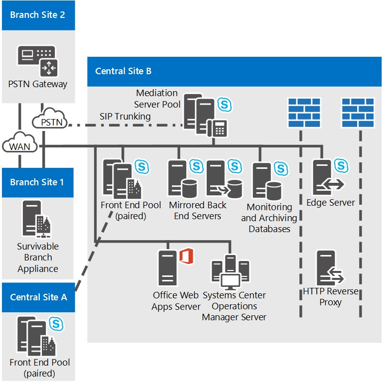

# Skype for Business 服务器的参考拓扑

Skype for business 服务器的参考拓扑，包括为大型、中型和小型组织制定的图表和决策。

最适合你的 Skype for business 服务器拓扑取决于你的组织的规模、要部署的工作负荷以及高可用性与投资成本的首选项。

本节概述了三种示例参考拓扑，包括促成每种拓扑的多种决策背后的推论。

## 小型组织的参考拓扑

小型组织的参考拓扑显示如何通过仅部署三台运行 Skype for Business Server 的服务器来部署强健、高可用的解决方案。

**小型组织的参考拓扑**

- 已**部署的标准版服务器对**此组织在其中心网站拥有4000用户。 他们部署了两个标准版服务器并将它们配对在一起，以实现高可用性和灾难恢复。 Each server homes 2,000 users, but information about all users is synchronized between the two servers. If one goes down, an administrator can fail over those users to be served by the other server, with a minimum of disruption to users. 有关 Skype for Business Server 中的高可用性和灾难恢复功能的详细信息，请参阅 Skype for business[服务器中的计划以获得高可用性和灾难恢复](../../plan-your-deployment/high-availability-and-disaster-recovery/high-availability-and-disaster-recovery.md)。

- **建议部署边缘服务器。** 尽管对于内部 IM、状态和会议来说，部署边缘服务器并非必需，但即便对于小型部署，我们也推荐采用边缘服务器。 你可以部署边缘服务器以向当前组织防火墙外部的用户提供服务，从而最大化 Skype for Business 服务器投资。 其优点包括：

  - 如果您的组织的用户在家里工作或在路上工作，则您的组织的用户可以使用 Skype for Business 服务器功能。

  - 您的用户可以邀请外部用户参加会议。

  - 如果您拥有还使用 Skype for Business Server 的合作伙伴、供应商或客户组织，则可以与该组织建立联盟关系。 然后，您的 Skype for Business 服务器部署将识别该联盟组织的用户，从而更好地协作。

  - 您的用户可以与一些公共 IM 服务的用户交换即时消息。

- **分支站点生存能力。** 此组织正在运行 Skype for Business Server 的企业语音功能的试用计划。 某些用户使用 Skype for Business 服务器作为其唯一的语音解决方案。 其中一些企业语音试验用户位于分支站点。 分支站点没有指向中心网站的可靠广域网（WAN）链接，因此 Survivable 分支装置将部署在此处。 这样一来，如果 WAN 链路出现故障，分支站点上的用户仍然可以发出和接收呼叫（组织内的呼叫和 PSTN 呼叫），继续使用语音邮件功能，并使用双方即时消息 (IM) 进行通信。 当 WAN 链路不可用时，仍然能够对用户进行身份验证。 有关详细信息，请参阅[Plan for Enterprise Voice resiliency in Skype for Business Server](../../plan-your-deployment/enterprise-voice-solution/enterprise-voice-resiliency.md)。

- **Exchange UM 部署。** 此参考拓扑包括 Exchange 统一消息（UM）服务器，该服务器运行 Microsoft Exchange Server，而不是 Skype for Business 服务器。

- **Office Web Apps 服务器。** 我们建议在每个使用 Web 会议的组织内部署一个 Office Web Apps 服务器或 Office Web Apps 服务器场。利用 Office Web Apps 服务器，可以在 Web 会议中演示 PowerPoint 幻灯片。

## 中型组织的参考拓扑

具有高可用性和单个数据中心的参考拓扑是为具有一个中央站点的中小型组织设计的。下图中的具体拓扑用于拥有 20,000 个用户的组织。

**中型组织的参考拓扑**

- **通过添加更多前端服务器来容纳更多用户。** 此图中的具体拓扑包含三台前端服务器，可支持 20,000 个用户。 如果具有一个中央站点和更多用户，则只需将更多前端服务器添加到池中。 每个池最多可支持 80,000 个用户，可包含 12 台前端服务器。

    但是，单站点拓扑可以通过向该站点添加另一个前端池来支持更多的用户。

- **可以添加灾难恢复。** 对于此组织，其 Skype for business 服务器服务的高可用性是必需的功能，但灾难恢复不是。 其部署的前端服务器池可提供高可用性。

    如果需要添加灾难恢复功能，可以考虑建立另一个数据中心并添加另一个前端池，同时将其当前数据中心内的前端池配对。之后，如果发生影响其主池的灾难，则管理员可以将用户故障转移到备份池。

- **已镜像后端服务器**为了为基本用户功能提供更高的可用性，组织已为每个前端池部署了镜像对后端服务器。

- **监控服务器数据库选项。** 此组织已部署监控，以确保企业语音通话质量和 A/V 会议的质量。 在每个前端服务器上部署监控，并且监控数据库将与后端服务器并置。 我们还支持监控数据库在其中位于单独的服务器上的拓扑。

- **边缘服务器高可用性**在此示例具有20000用户的组织中，只需一台边缘服务器就能满足性能要求。 但是，他们已部署了一个部署了两个边缘服务器的池来提供高可用性。

- **分支站点部署选项。** 此拓扑中的组织已将企业语音部署为其语音解决方案。 分支站点1没有指向中心站点的复原广域网（WAN）链接，因此它具有一个 Survivable 分支设备，可用于维护许多 Skype for Business 服务器功能，以防指向中央站点的 WAN 链接断开。 但是，分支站点 2 具有可恢复 WAN 链路，因此只需一个公用电话交换网 (PSTN) 网关。 该处部署的 PSTN 网关支持媒体旁路，因此分支站点 2 上不需要中介服务器。 有关详细信息，请参阅[Plan for Enterprise Voice resiliency in Skype for Business Server](../../plan-your-deployment/enterprise-voice-solution/enterprise-voice-resiliency.md)。

- **DNS 负载平衡。** 前端池和边缘服务器池已经部署了用于 SIP 流量的 DNS 负载平衡。 这样就无需为边缘服务器部署硬件负载平衡器，并可以显著减少为其他池设置和维护硬件负载平衡器的工作量，因为只有 HTTP 流量需要使用硬件负载平衡器。 有关详细信息，请参阅[DNS 负载平衡](../../plan-your-deployment/network-requirements/load-balancing.md#BKMK_DNSLoadBalancing)。

- **Exchange UM 部署。** 此参考拓扑包括 Exchange 统一消息（UM）服务器，该服务器运行 Microsoft Exchange Server，而不是 Skype for Business 服务器。

- **Office Web Apps 服务器。** 我们建议在每个使用 Web 会议的组织内部署一个 Office Web Apps 服务器或 Office Web Apps 服务器场。利用 Office Web Apps 服务器，可以在 Web 会议中演示 PowerPoint 幻灯片。

- **可以添加控制器。** 如果此组织希望增强安全性以抵御拒绝服务攻击，也可以部署控制器池。 Director 是 Skype for Business 服务器中的一种独立的可选服务器角色，它不是家庭用户帐户，也不提供状态或会议服务。 它充当一个内部下一个跃点服务器，边缘服务器将入站 SIP 流量路由到内部服务器。 控制器对入站请求进行预身份验证，并将其重定向到用户的主池或服务器。 控制器进行的预先身份验证允许放弃来自部署中未知的用户帐户的请求。 控制器可帮助将前端服务器与恶意流量（如拒绝服务（DoS）攻击）隔离。 如果网络被此类攻击中的无效外部通信所淹没，则流量将在 Director 处结束。

- **建议使用 System Center Operations Manager。** 我们建议你监视 Skype for business Server 部署的运行状况，以帮助确保最终用户的服务可用性。 您可以将 System Center Operations Manager 管理包用于 Skype for Business，可从 Microsoft 免费下载。 With the Skype for Business Management Pack, you can proactively get real-time alerts when issues occur, run synthetic transactions to test end-to-end Skype for Business functionality, get reports for service availability, and so on. This helps you to proactively respond to issues with your deployment before end-users experience them.

## 大型组织的参考拓扑

具有多个数据中心的大型组织的参考拓扑支持适用于具有多个中央站点的各种规模的组织。下图中的具体拓扑适用于具有 50,000 个用户的组织，其中 20,000 个用户位于中央站点 A，20,000 个用户位于中央站点 B，总共 10,000 个用户位于中央站点 C 和分支站点。该图中显示的拓扑类型可满足具有任意数量用户的组织。

除了由前端服务器池提供的高可用性外，此拓扑还添加了灾难恢复支持。 中央站点 A 和 B 的前端池一起配对。 如果其中一个池不可用，则管理员可将受影响用户的服务转移到位于不受影响的站点上的配对池中。

此拓扑分为多幅图显示，首先是概述，然后是中央站点的详细视图。

**有多个数据中心的大型组织的参考拓扑概述**

**大型组织的参考拓扑：中央站点 A 的详细视图**

**大型组织的参考拓扑：中央站点 B 的详细视图**

**大型组织的参考拓扑：中央站点 C 的详细视图**

- **前端池已配对以启用灾难恢复。** 站点 A 和站点 B 中的前端池相互配对，以提供灾难恢复支持。 如果一个网站上的池出现故障，则管理员可以将该网站中的用户故障转移到其他网站上的配对的前端池，同时对用户的服务中断最少。 Each of these two Front End pools has six servers, which is enough for all 40,000 users in both pools in case of failover. 有关详细信息，请参阅[在 Skype For Business 服务器中规划高可用性和灾难恢复](../../plan-your-deployment/high-availability-and-disaster-recovery/high-availability-and-disaster-recovery.md)。

- **已镜像后端服务器**为了为基本用户功能提供更高的可用性，组织已为每个前端池部署了镜像对后端服务器。 这是一个可选拓扑，你可以选择部署一台后端服务器。 SQL clustering and AlwaysOn Availability groups are also supported. For more information, see [Back End Server high availability in Skype for Business Server](../../plan-your-deployment/high-availability-and-disaster-recovery/back-end-server.md).

- **在分支站点上使用标准版服务器。** This organization considers Site C as a branch site because it has only 600 employees. However, the users there have many A/V conferences among themselves. 如果它是作为分支站点在 Skype for Business 服务器中部署的，则适用于这些会议的媒体将跨广域网（WAN）和已部署前端服务器的中心网站运行。 为避免这种潜在的带宽负载，他们已在此网站上安装了一对标准版服务器，这将主持这些会议。 而且由于已安装了标准版服务器，按定义将 Skype for business 服务器视为一个中心站点，在拓扑生成器和规划工具中，它将被视为此类站点。

    对于此处的性能而言，只有一个标准版服务器是足够的，但组织已将两个和成对的部署在一起，以在一台服务器停机时提供高可用性。

    尽管站点 C 被视为中央站点，但不需要在其上部署边缘服务器。在本例中，站点 C 将使用站点 A 上部署的边缘服务器。

- **监控和存档**此组织已部署监视和存档。 部署监视或存档时，它会在每台前端服务器上运行。 这些功能的数据库可以与后端数据库 collocated，也可以位于单独的服务器上。 此组织已在中央站点 B 中的服务器上找到了这些数据库，与后端服务器分开。此处的数据库从所有网站中的前端服务器接收监控和存档数据。

- **分支站点部署选项。** 此组织实际上具有 50 个以上的分支站点，但明细图中仅显示了其中的两个分支站点。 分支站点1没有指向中心站点的弹性 WAN 链接，因此他们已部署 Survivable 分支设备以提供电话服务，以防指向中央站点的 WAN 链接断开。 而分支站点 2 具有可恢复的 WAN 链路，因此只需一个公用电话交换网 (PSTN) 网关。 这些站点上部署的 PSTN 网关支持媒体旁路功能，因此分支站点 2 上不需要中介服务器。 有关决定在分支站点上安装哪些内容的详细信息，请参阅[Plan for Enterprise Voice resiliency in Skype for Business Server](../../plan-your-deployment/enterprise-voice-solution/enterprise-voice-resiliency.md)。

- **SIP 中继和中介服务器。** 请注意，在中央站点 B 上，中介服务器没有与前端服务器并置。 这是因为对于使用 SIP 中继的站点，建议使用独立的中介服务器。 在其他多数实例中，建议将中介服务器与前端服务器并置。 有关中介服务器拓扑的详细信息，请参阅规划文档中的[Components and Topologies for Mediation Server](https://technet.microsoft.com/library/71397168-36c3-4d21-b8ef-db6a751634ee.aspx)。

- **已部署持久聊天。** 此组织部署了启用持久聊天所需的服务器。 它已部署多台持久聊天前端服务器以在处理池中用户数量的负载的同时提供高可用性。 它还部署了持久聊天的合规性，并且将持久聊天存储和持久聊天合规性存储放置在各台服务器上。 这些存储可进行并置，甚至可与后端服务器并置，但此组织选择将其分隔开以提供更好的性能。

    > [!NOTE]
    > Skype for business Server 2015 中提供了持久聊天，但 Skype for business Server 2019 不再支持此功能。 团队中提供了相同的功能。 有关详细信息，请参阅[Microsoft 团队升级](/microsoftteams/upgrade-start-here)入门。 如果需要使用持久聊天，您可以选择将需要此功能的用户迁移到团队，或继续使用 Skype for Business Server 2015。

- **DNS 负载平衡。** 前端池和边缘服务器池使用 DNS 负载平衡。 这就无需为边缘服务器内部接口部署硬件负载平衡器，并可以显著减少为其他池设置和维护硬件负载平衡器必须花费的时间，因为只有 HTTP 流量需要使用硬件负载平衡器。 有关详细信息，请参阅（.。。/../plan-your-deployment/network-requirements/load-balancing.md#BKMK_DNSLoadBalancing).

- **Exchange UM 部署。** Skype for business 服务器适用于 Exchange 统一消息（UM）和托管 Exchange UM 的本地部署。 中心站点 A 包含 Exchange 统一消息（UM）服务器，该服务器运行 Microsoft Exchange Server，而不是 Skype for Business 服务器。 Skype for Business 服务器的 Exchange UM 功能在前端池上运行。

    中央站点 B 使用托管 Exchange，因此也承载 Exchange UM 服务器功能。

    有关 Exchange UM 的详细信息，请参阅规划文档中的[本地 Exchange 统一消息集成](https://technet.microsoft.com/library/e7c63a71-2d99-4aa9-b649-36c1a431bdf1.aspx)和[托管 Exchange 统一消息集成](https://technet.microsoft.com/library/f4de0165-da3b-499e-98fc-28ddd0db02d5.aspx)。

- **Office Web Apps 服务器。** 我们建议在每个使用 Web 会议的组织内部署一个 Office Web Apps 服务器或 Office Web Apps 服务器场。 你可以在一个网站中部署单个 Office Web Apps 服务器场，该网站提供来自所有网站的流量，或在每个网站中部署。 利用 Office Web Apps 服务器，可以在 Web 会议中演示 PowerPoint 幻灯片。

- **可添加控制器。** 如果此组织希望提高安全性以更好地抵御拒绝服务攻击，还可部署一个控制器池。 Director 是 Skype for Business 服务器中的一种独立的可选服务器角色，它不是家庭用户帐户，也不提供状态或会议服务。 它充当一个内部下一个跃点服务器，边缘服务器将入站 SIP 流量路由到内部服务器。 控制器对入站请求进行预身份验证，并将其重定向到用户的主池或服务器。 控制器进行的预先身份验证允许放弃来自部署中未知的用户帐户的请求。 控制器可帮助将前端服务器与恶意流量（如拒绝服务（DoS）攻击）隔离。 如果网络被此类攻击中的无效外部通信所淹没，则流量将在 Director 处结束。

- **建议使用 System Center Operations Manager。** 我们建议你监视 Skype for business Server 部署的运行状况，以帮助确保最终用户的服务可用性。 您可以将 System Center Operations Manager 管理包用于 Skype for Business，可从 Microsoft 免费下载。 With the Skype for Business Management Pack, you can proactively get real-time alerts when issues occur, run synthetic transactions to test end-to-end Skype for Business functionality, get reports for service availability, and so on. This helps you to proactively respond to issues with your deployment before end-users experience them.

