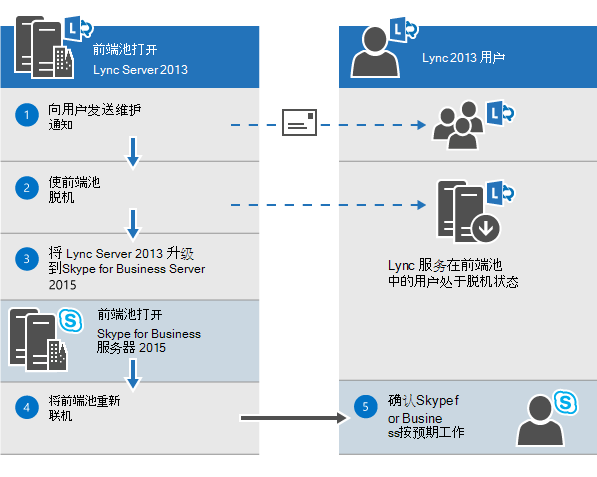
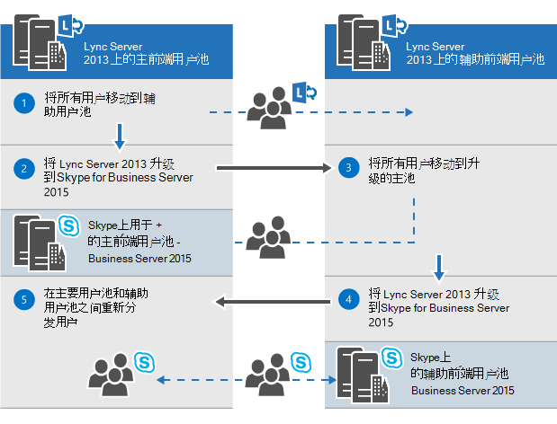
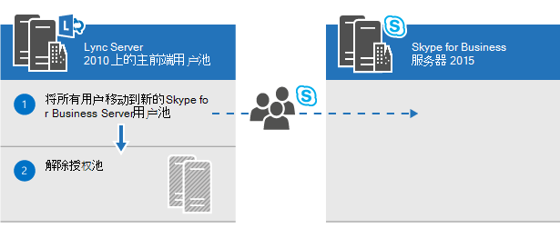

# 计划升级到 Skype for Business Server 2015Plan to upgrade to Skype for Business Server 2015
 
摘要：了解在计划升级到 Skype for Business Server 2015 时应考虑的问题。Summary: Learn about the things you should consider when you plan an upgrade to Skype for Business Server 2015. 从 Microsoft Evaluation Center 下载 Skype for Business Server 2015 的免费试用版 [https://www.microsoft.com/evalcenter/evaluate-skype-for-business-server](https://www.microsoft.com/evalcenter/evaluate-skype-for-business-server) ：。Download a free trial of Skype for Business Server 2015 from the Microsoft Evaluation center at: [https://www.microsoft.com/evalcenter/evaluate-skype-for-business-server](https://www.microsoft.com/evalcenter/evaluate-skype-for-business-server).
  
作为升级到 Skype for Business Server 2015 计划的一部分，请使用本主题了解建议的 Skype for Business Server 2015 升级路径、In-Place 升级的工作方式、受支持的共存方案以及升级过程的外观。As part of your plan to upgrade to Skype for Business Server 2015, use this topic to understand the recommended upgrade paths to Skype for Business Server 2015, how the In-Place Upgrade works, what the supported coexistence scenarios are, and what the upgrade process looks like.

> [!NOTE]
> 就地升级在 Skype for Business Server 2015 中可用，但在 Skype for Business Server 2019 中不再受支持。In-place upgrades were available in Skype for Business Server 2015 but are no longer supported in Skype for Business Server 2019. 支持并行共存，有关详细信息，请参阅迁移到[Skype for Business Server 2019。](../../SfBServer2019/migration/migration-to-skype-for-business-server-2019.md)Side by side coexistance is supported, see [Migration to Skype for Business Server 2019](../../SfBServer2019/migration/migration-to-skype-for-business-server-2019.md) for more information.
  
## Skype for Business Server 2015 的建议升级路径Recommended upgrade paths to Skype for Business Server 2015

 若要从 Lync Server 2013、Lync Server 2010 或 Office Communications Server 2007 R2 升级到 Skype for Business Server 2015，请使用以下升级路径：To upgrade from Lync Server 2013, Lync Server 2010, or Office Communications Server 2007 R2 to Skype for Business Server 2015, use the following upgrade paths:
  
> [!CAUTION]
> In-Place升级会自动将会议目录从 Lync Server 2013 移动到 Skype for Business Server 2015。In-Place Upgrade automatically moves conference directories from Lync Server 2013 to Skype for Business Server 2015. 但是，如果你计划手动移动会议目录，则使用 Skype for Business Server 2015 命令行管理程序非常重要。However, if you plan to manually move conference directories it is very important to use the Skype for Business Server 2015 Management Shell. 如果尝试使用 Lync Server 2013 命令行管理程序将会议目录从 Lync Server 2013 移动到 Skype for Business Server 2015，则可能发生数据丢失。If you try to use the Lync Server 2013 Management Shell to move conference directories from Lync Server 2013 to Skype for Business Server 2015 then data loss can occur. 通常，每当以任何容量使用 Skype for Business Server 2015 时，都应使用 Skype for Business Server 2015 工具集。In general, whenever you are working with Skype for Business Server 2015 in any capacity you should use the Skype for Business Server 2015 tool set.  
  
|**版本****Version**|**推荐****Recommendations**|
|:-----|:-----|
|Lync Server 2013Lync Server 2013    | 若要升级，请使用 Skype for Business Server 拓扑生成器和与池关联的每台In-Place新的"升级"功能。To upgrade, use the Skype for Business Server Topology Builder and the new In-Place Upgrade feature on each of the servers associated with the pool. 有关详细步骤，请参阅[Plan to upgrade from Lync Server 2013 to Skype for Business Server 2015](upgrade.md#BKMK_PlanUpgradeFromLync2013)和 Upgrade to Skype for Business Server [2015。](../deploy/upgrade-to-skype-for-business-server.md)see [Plan to upgrade from Lync Server 2013 to Skype for Business Server 2015](upgrade.md#BKMK_PlanUpgradeFromLync2013) and [Upgrade to Skype for Business Server 2015](../deploy/upgrade-to-skype-for-business-server.md) for detailed steps.   |
|Lync Server 2010 + Lync Server 2013 (双模式) Lync Server 2010 + Lync Server 2013 (dual-mode)    |首先，升级到 Lync Server 2013，然后使用新的 In-Place 升级功能升级到 Skype for Business Server 2015。First, upgrade to Lync Server 2013, and then upgrade to Skype for Business Server 2015 by using the new In-Place Upgrade feature. 但是，如果你的拓扑是主 Lync Server 2010，则还可以将 Lync Server 2013 组件回滚到 Lync Server 2010，然后直接升级到 Skype for Business Server 2015。However, if your topology is primary Lync Server 2010 you can also roll back the Lync Server 2013 components to Lync Server 2010 and then upgrade directly to Skype for Business Server 2015. 在这种情况下，你将不能利用 In-Place 升级，并且将在 Lync Server 2010 和 Skype for Business Server 2015 之间直接共存。In this case you would not be able to take advantage of In-Place Upgrade and would use straight co-existence between Lync Server 2010 and Skype for Business Server 2015. 不支持三元存在，但支持共存。Tri-existence is not supported but co-existence is supported.    |
|Lync Server 2010Lync Server 2010    |启动新的 Skype for Business Server 2015 池，然后将用户迁移到此新池。Bring up a new Skype for Business Server 2015 pool and then migrate users to this new pool. 然后，您可以停用旧的 Lync Server 2010 池。You can then decommission the old Lync Server 2010 pool. 从 Lync Server 2010 升级到 Skype for Business Server 2015 与从 Lync Server 2010 升级到 Lync Server 2013 类似。Upgrading from Lync Server 2010 to Skype for Business Server 2015 is similar to upgrading from Lync Server 2010 to Lync Server 2013. 请参阅[从 Lync Server 2010 迁移到 Lync Server 2013。](/previous-versions/office/lync-server-2013/migration-from-lync-server-2010-to-lync-server-2013)See [Migration from Lync Server 2010 to Lync Server 2013](/previous-versions/office/lync-server-2013/migration-from-lync-server-2010-to-lync-server-2013).    |
|Office Communications Server 2007 R2Office Communications Server 2007 R2    | 选择两个选项之一：Pick one of two options:    设置新的 Skype for Business Server 2015 环境。Set up a new Skype for Business Server 2015 environment.    或者，如果你的硬件和软件满足 Skype for Business Server 2015 的要求，请升级到 Lync Server 2013，然后使用新的 In-Place 升级功能升级到 Skype for Business Server 2015。Or if your hardware and software meet the requirements for Skype for Business Server 2015, upgrade to Lync Server 2013, and then upgrade to Skype for Business Server 2015 by using the new In-Place Upgrade feature. 有关详细信息，请参阅[Server requirements for Skype for Business Server 2015](requirements-for-your-environment/server-requirements.md)和 Migration from Office Communications Server [2007 R2 to Lync Server 2013。](/previous-versions/office/lync-server-2013/migration-from-office-communications-server-2007-r2-to-lync-server-2013)For more information, see [Server requirements for Skype for Business Server 2015](requirements-for-your-environment/server-requirements.md) and [Migration from Office Communications Server 2007 R2 to Lync Server 2013](/previous-versions/office/lync-server-2013/migration-from-office-communications-server-2007-r2-to-lync-server-2013).    |
   
> [!NOTE]
> SQL Server 2014 在 Skype for Business Server 2015 中受支持，但在 Lync Server 2013 中不受支持。SQL Server 2014 is supported in Skype for Business Server 2015 but is not supported in Lync Server 2013. 如果要从 SQL Server 2012 升级到 SQL Server 2014，则必须先使用 In-Place Upgrade 方法将池升级到 Skype for Business Server 2015，如本文档中所述。If you want to upgrade from SQL Server 2012 to SQL Server 2014 then the pool must first be upgraded to Skype for Business Server 2015 using the In-Place Upgrade method as described in this document. 然后，可以从 SQL Server 2012 升级到 SQL Server 2014，请参阅 Upgrade [to SQL Server 2014。](/sql/database-engine/install-windows/upgrade-sql-server?viewFallbackFrom=sql-server-2014)You can then upgrade from SQL Server 2012 to SQL Server 2014, see [Upgrade to SQL Server 2014](/sql/database-engine/install-windows/upgrade-sql-server?viewFallbackFrom=sql-server-2014). 若要了解有关数据库要求的信息，请参阅 [Server requirements for Skype for Business Server 2015](requirements-for-your-environment/server-requirements.md)。To learn more about database requirements, see [Server requirements for Skype for Business Server 2015](requirements-for-your-environment/server-requirements.md). 
  
## 计划从 Lync Server 2013 升级到 Skype for Business Server 2015Plan to upgrade from Lync Server 2013 to Skype for Business Server 2015

可以使用新的"升级"功能将 Lync Server 2013 系统升级到 Skype for Business Server 2015 In-Place升级。You can upgrade Lync Server 2013 systems to Skype for Business Server 2015 using the new In-Place Upgrade feature. 就地升级提供了一键式解决方案，可备份证书、卸载服务器组件、升级本地数据库并安装 Skype for Business Server 2015 角色。In-place upgrade provides a one-click solution that backs up certificates, uninstalls server components, upgrades local databases, and installs the Skype for Business Server 2015 roles. 就地升级旨在保留现有硬件和服务器投资，从而降低部署 Skype for Business Server 2015 的总成本。In-place upgrade seeks to preserve existing hardware and server investments, reducing the overall cost to deploy Skype for Business Server 2015.
  
> [!NOTE]
> In-Place升级允许你在升级到 Skype for Business Server 时使用相同的硬件。In-Place Upgrade allows you to use the same hardware when upgrading to Skype for Business Server. 但是，使用相同的硬件不会转换为相同的性能容量。However, reusing the same hardware does not translate into the same performance capacity. 不应期望 Lync Server 2013 和 Skype for Business Server 2015 的性能负载相同。You should not expect the performance loads for Lync Server 2013 and Skype for Business Server 2015 to be identical. 
  
> [!NOTE]
> In-Place升级不支持 Skype for Business Server 的高可用性或灾难恢复。In-Place upgrade does not support high availability or disaster recovery for Skype for Business Server. 
  
就地升级涉及使 Lync Server 2013 池脱机，并升级到 Skype for Business Server 2015 池。In-place upgrade involves taking the Lync Server 2013 pool offline and upgrading it to a Skype for Business Server 2015 pool. 
  
### 创建In-Place升级计划Create an In-Place Upgrade plan

制定包括：Make a plan that includes:
  
1. 了解当前拓扑。An understanding of your current topology.
    
    > [!NOTE]
    > 请务必先卸载 Lync Server 2013 的 LRS 管理工具，然后再运行 In-Place 升级。Be sure to uninstall LRS Admin tool for Lync Server 2013 before running In-Place Upgrade. Lync Server 2013 的 LRS 管理工具不能与 Skype for Business Server 2015 共存。The LRS Admin Tool for Lync Server 2013 cannot coexist with Skype for Business Server 2015. 运行升级In-Place安装新的 LRS 管理工具。After running In-Place Upgrade install the new LRS Admin tool. 有关详细信息[，请参阅 Microsoft Lync Room System Administrative Web Portal for Skype for Business Server 2015。](https://go.microsoft.com/fwlink/?LinkID=544807)See [Microsoft Lync Room System Administrative Web Portal for Skype for Business Server 2015](https://go.microsoft.com/fwlink/?LinkID=544807) for more details.
  
2. 升级的主池。The primary pool for the upgrade.
    
3. 是升级存档和监控数据库还是创建新数据库。Whether you'll upgrade the Archiving and Monitoring databases or create new ones.
    
4. 将使用In-Place升级方法：脱机或移动用户。The In-Place Upgrade method you'll use: Offline or Move Users. 作为"移动用户"的一部分，您还需要迁移与主池关联的全局会议目录。As part of Move Users you also will need to migrate the global conference directories associated with the primary pool. 
    
5. 针对受影响用户的通信计划。A communication plan for impacted users.
    
6. 备份计划，以防升级失败。A backup plan in case the upgrades fails.
    
升级主池中的任何用户在升级完成之前将不能使用这些服务。Any users that are in the primary pool while it's being upgraded won't be able to use the services until the upgrade is complete. 如果您有一个工作辅助池，则可以通过在升级之前将用户移动到辅助池来避免影响用户。If you have a working secondary pool, you can avoid impacting users by moving them to the secondary pool before the upgrade. 升级后，将用户移回主池。After the upgrade, move the users back to the primary pool.
  
### 就地升级方法In-place upgrade methods

升级有两种In-Place方案：There are two scenarios for In-Place Upgrade: 
  
- Move User 方法，无需用户停机。The Move User method, which requires no downtime for users. 
    
- 脱机方法，该方法需要停机。The Offline method, which requires downtime.
    
建议在维护时段安排脱机方法升级，并通知用户停机时间。We recommend that an Offline method upgrade be scheduled during a maintenance window and users are notified of the downtime.
  
> [!NOTE]
> 在 Lync Server 2013 上升级配对池，并且希望将两个池升级到 Skype for Business Server 2015 时。When upgrading a paired pool on Lync Server 2013 and you want to upgrade both pools to Skype for Business Server 2015. 请确保在升级第一个池后立即升级第二个池。Make sure to upgrade the second pool immediately after upgrading the first pool. 当一个池运行 Lync Server 2013，第二个池运行 Skype for Business Server 2015 时，灾难恢复选项将最小化。When one pool is running Lync Server 2013 and the second pool is running Skype for Business Server 2015 then disaster recovery options are minimized. 例如，如果一个池运行 2013，第二个池运行 2015，并且发生灾难，则可能会遇到数据丢失，因为当配对池的版本不同时，在灾难模式下不支持池故障转移。For example, if one pool is running 2013 and the second is 2015 and there is a disaster then you could experience data loss because pool failover is not supported in disaster mode when paired pools are not the same version. 
  
#### 就地升级 脱机方法In-place upgrade Offline method

如果不想在用户池之间移动用户，请使用此方法。Use this method if you don't want to move users between user pools. 在升级过程中，用户将不能使用 Lync 或 Skype for Business 服务。During the upgrade, users will not be able to use Lync or Skype for Business services. 
  
下图显示了此过程的概述。The following diagram shows an overview of this process.
  

  
> [!NOTE]
> 如果您有配对的池，请不要在升级之前取消配对。If you have paired pools, do not unpair them before the upgrade. 
  
开始升级服务器池后，必须完成整个池的升级。Once you start to upgrade a server pool, you must complete the upgrade of the entire pool. Skype for Business Server 不支持仅升级池的一部分。Skype for Business Server doesn't support having only a portion of the pool upgraded. 
  
#### Move Users (无用户停机时间) Move Users method (no user downtime)

若要使用此方法，您需要在开始升级之前将用户移动到另一个池。To use this method, you move users to another pool before you start the upgrade. 在升级过程中，用户可以使用 Lync 服务。During the upgrade, users can use Lync services. 在将用户移动到升级后的池后，他们可以使用 Skype for Business。After they're moved to the upgraded pool, they can use Skype for Business. 下图显示了此过程的概述。The following diagram shows an overview of this process.
  
> [!IMPORTANT]
> 作为"移动用户"的一部分，您还需要迁移与主池关联的全局会议目录。As part of Move Users you also will need to migrate the global conference directories associated with the primary pool. PSTN 电话拨入式会议仍将 ConferenceID 解析为要升级的池，而不是配对池。PSTN dial-in conferencing will still resolve ConferenceID to the pool being upgraded, instead of the paired pool. 因此，如果仍希望池中安排的 PSTN 会议在升级过程中可访问，则需要移动会议目录。So you need to move Conference Directories, if you still want PSTN conferences scheduled in the pool to be accessible during upgrade. 
  

  
#### 移动用户进行硬件升级Move users for hardware upgrade

 如果你的硬件不满足 [Skype for Business Server 2015](requirements-for-your-environment/server-requirements.md)的服务器要求，请设置一个新的 Skype for Business Server 2015 环境，并移动用户。If your hardware doesn't meet the [Server requirements for Skype for Business Server 2015](requirements-for-your-environment/server-requirements.md), set up a new Skype for Business Server 2015 environment, and move users there. 下图概述了从 Lync Server 2010 升级的过程。The following diagram shows an overview of this process for upgrade from Lync Server 2010. 
  

  
### 就地升级过程In-place upgrade process

 使用以下步骤从 Lync Server 2013 升级到 Skype for Business Server 2015：Upgrade from Lync Server 2013 to Skype for Business Server 2015 using the following steps:
  
1. 在升级之前备份所有数据库。Back up all databases before the upgrade.
    
2. 确保要升级的所有服务都运行状态。Make sure all services that are to be upgraded are in a running state.
    
3. 使用拓扑生成器升级并发布拓扑文件。Upgrade and publish the topology file using the topology builder.
    
4. 停止所有前端服务器上的所有服务。Stop all services on all Front End servers.
    
5. 安装 Skype for Business Server 所需的新必备组件。Install new prerequisites required for Skype for Business Server.
    
6. 在每个前端服务器上，启动"In-Place升级"。On each Front End server, start the In-Place Upgrade.
    
7. 升级完成后，重新启动所有服务。When the upgrade is complete, restart all services.
    
   - 对于前端池，使用命令 Start-CsPool 重新启动服务。For the Front End pool, restart services using the command Start-CsPool.
    
   - 对于非前端服务器，请使用 Start-CSWindowsService。For non-Front End servers, use Start-CSWindowsService.
    
> [!NOTE]
>  如果不想升级现有存档和监控数据库，在升级拓扑之前删除依赖项。If you don't want to upgrade your existing Archiving and Monitoring databases, remove the dependency before you upgrade the topology. 如果要创建新的存档和监控数据库，可以在升级过程中创建新的存档SQL存储并将其与池关联。If you want to create new Archiving and Monitoring databases, during the upgrade, you can create a new SQL store and associate it with the pool. 您可以在 Upgrade to Skype for Business Server[2015](../deploy/upgrade-to-skype-for-business-server.md)主题中查找如何执行这一操作的步骤。You can find the steps on how to do this in the topic,[Upgrade to Skype for Business Server 2015](../deploy/upgrade-to-skype-for-business-server.md). >就地升级不支持 Skype for Business Server 的高可用性或灾难恢复。>  In-place upgrade does not support high availability or disaster recovery for Skype for Business Server. 为避免中断用户服务，请使用 Move Users 方法 [ (无 ](upgrade.md#bkmk_MoveUsersMethod) 用户停机时间) 升级。> 在升级过程中，xds 副本被放置在可用空间最多的磁盘驱动器上的本地共享文件夹中。To avoid interrupting users' services, use the [Move Users method (no user downtime)](upgrade.md#bkmk_MoveUsersMethod) to upgrade.>  During the upgrade process the xds-replica is placed in the local shared folder on the disk drive with the most free space. 如果该磁盘稍后被删除，则可能会遇到诸如服务未启动等问题。If that disk is later removed then you can run into issues such as services not starting.
  
### 升级顺序Upgrade order

将拓扑从内部升级到外部。Upgrade the topology from the inside to the outside. 首先升级所有池，然后升级边缘服务器，最后升级中央管理存储 (CMS) 池。Upgrade all your pools first, then the edge servers, and finally the Central Management Store (CMS) pool. 
  
### Kerberos 身份验证注意事项Kerberos authentication considerations

如果将 Kerberos 身份验证用于 Web 服务，则必须在升级完成后重新分配 Kerberos 帐户并重置In-Place密码。If you use Kerberos authentication for Web Services, you must reassign Kerberos accounts and reset the password after the In-Place Upgrade is complete. 若要了解如何进行此操作，请参阅设置 [Kerberos 身份验证](/previous-versions/office/lync-server-2013/lync-server-2013-setting-up-kerberos-authentication)。To learn how to do this, see [Setting up Kerberos authentication](/previous-versions/office/lync-server-2013/lync-server-2013-setting-up-kerberos-authentication).
  
## 支持与 Lync Server 2013 和 Lync Server 2010 共存Support for coexistence with Lync Server 2013 and Lync Server 2010

可以在与 Lync Server 2013 或 Lync Server 2010 相同的拓扑中运行 Skype for Business Server 2015，但不能在同一拓扑中同时运行这三个拓扑。You can run Skype for Business Server 2015 in the same topology as Lync Server 2013 or Lync Server 2010, but you can't have all three in the same topology.
  
如果在 Lync Server 2010 和 Lync Server 2013 之间共存，建议将整个拓扑升级到 Lync Server 2013，然后使用 In-Place Upgrade 升级到 Skype for Business Server 2015。If you have a co-existence between Lync Server 2010 and Lync Server 2013, it is recommended to upgrade the entire topology to Lync Server 2013, and then upgrade to Skype for Business Server 2015 using the In-Place Upgrade. 有关详细信息，请参阅 Migration [from Lync Server 2010 to Lync Server 2013。](/previous-versions/office/lync-server-2013/migration-from-lync-server-2010-to-lync-server-2013)For more information, see [Migration from Lync Server 2010 to Lync Server 2013](/previous-versions/office/lync-server-2013/migration-from-lync-server-2010-to-lync-server-2013).
  
如果拓扑主要是 Lync Server 2010，则先将 Lync Server 2013 组件回滚到 Lync Server 2010，然后再将拓扑升级到 Skype for Business Server 2015。If your topology is primarily Lync Server 2010, roll back the Lync Server 2013 components to Lync Server 2010 before upgrading the topology to Skype for Business Server 2015. 在这种情况下，您将失去升级In-Place，在 Lync Server 2010 和 Skype for Business Server 2015 之间共存拓扑。In this case, you lose the benefit of the In-Place Upgrade and have a co-existence topology between Lync Server 2010 and Skype for Business Server 2015.
  
下图显示了 Skype for Business Server 2015 与 Lync Server 2013 和 Lync Server 2010 的共存支持。The following diagram shows the coexistence support of Skype for Business Server 2015 with Lync Server 2013 and Lync Server 2010.
  

  
## 使用现有 Survivable Branch Appliance 和 Survivable Branch Server 的升级过程Upgrade process with existing Survivable Branch Appliance and Server

Skype for Business Server 2015 不支持 Survivable Branch Appliance (SBA) 或 Survivable Branch Server (SBS) 的 In-Place 升级。Skype for Business Server 2015 doesn't support an In-Place Upgrade of a Survivable Branch Appliance (SBA) or a Survivable Branch Server (SBS).
  
但是，我们支持 Skype for Business Server 数据中心与 Lync Server 2010 或 Lync Server 2013 SBA/SBS 共存。However, we do support coexistence of Skype for Business Server datacenters with Lync Server 2010 or Lync Server 2013 SBA/SBS. 
  
规划具有关联分支的 Lync Server 2013 前端 (FE) 池的 In-Place 升级时，可以将现有用户留在 Lync Server 2013 SBA/SBS 上。When planning for an In-Place Upgrade of a Lync Server 2013 Front End (FE) pool with an associated branch, you can leave the existing users on the Lync Server 2013 SBA/SBS. 在升级过程中，SBA/SBS 用户将进入恢复能力模式，并且将在升级完成后恢复为正常功能。During the upgrade, the SBA/SBS users will go in resiliency mode and will return to normal functionality after the upgrade has completed. 有关恢复模式期间用户体验的详细信息，请参阅[Branch-site resiliency features in Lync Server 2013。](/previous-versions/office/lync-server-2013/lync-server-2013-branch-site-resiliency-features)For more information about the users' experience during the resiliency mode, please see [Branch-site resiliency features in Lync Server 2013](/previous-versions/office/lync-server-2013/lync-server-2013-branch-site-resiliency-features).
  
将 Lync Server 2010 拓扑迁移到 Skype for Business Server 2015 时，必须将 SBA/SBS 重新添加到拓扑，类似于迁移到 Lync Server 2013。When migrating a Lync Server 2010 topology to Skype for Business Server 2015, the SBA/SBS must re-added to the topology, similar to the migration to Lync Server 2013. 有关所需步骤，请阅读将 [Survivable Branch Appliance 连接到 Lync Server 2013 前端池](/previous-versions/office/lync-server-2013/lync-server-2013-connecting-survivable-branch-appliance-to-lync-server-2013-front-end-pool)。For the required steps, please read [Connecting Survivable Branch Appliance to Lync Server 2013 Front End pool](/previous-versions/office/lync-server-2013/lync-server-2013-connecting-survivable-branch-appliance-to-lync-server-2013-front-end-pool).
  
对于 Lync Server 2010 和 Lync Server 2013 的共存拓扑，首先应符合"支持与 Lync Server 2013 和 Lync Server 2010 共存"部分中的建议。For co-existence topologies of Lync Server 2010 and Lync Server 2013, align first to the recommendations made in the section 'Support for coexistence with Lync Server 2013 and Lync Server 2010'.
  
## 另请参阅See also

[升级到 Skype for Business Server 2015Upgrade to Skype for Business Server 2015](../deploy/upgrade-to-skype-for-business-server.md)
  
[Skype for Business Server 2015 的环境要求Environmental requirements for Skype for Business Server 2015](requirements-for-your-environment/environmental-requirements.md)
  
[Skype for Business Server 2015 的服务器要求Server requirements for Skype for Business Server 2015](requirements-for-your-environment/server-requirements.md)