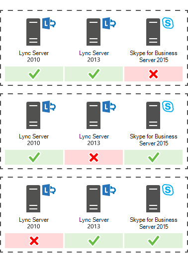

# 计划升级到 Skype for Business Server 2015
 
摘要：了解在规划升级到 2015 Skype for Business Server应考虑的问题。 从 Microsoft 评估中心下载 Skype for Business Server 2015 的免费试用版 [https://www.microsoft.com/evalcenter/evaluate-skype-for-business-server](https://www.microsoft.com/evalcenter/evaluate-skype-for-business-server) ：。
  
作为升级到 Skype for Business Server 2015 计划的一部分，请使用本主题了解到 Skype for Business Server 2015 的建议升级路径、In-Place 升级的工作方式、受支持的共存方案以及升级过程的外观。

> [!NOTE]
> 2015 年 2 月Skype for Business Server就地升级，但在 2019 年 2 月不再Skype for Business Server升级。 支持并行共存，有关详细信息，请参阅迁移到[Skype for Business Server 2019。](../../SfBServer2019/migration/migration-to-skype-for-business-server-2019.md)
  
## 2015 年 10 月Skype for Business Server升级途径

 若要从 Lync Server 2013、Lync Server 2010 或 Office Communications Server 2007 R2 升级到 Skype for Business Server 2015，请使用以下升级路径：
  
> [!CAUTION]
> In-Place升级会自动将会议目录从 Lync Server 2013 Skype for Business Server 2015。 但是，如果您计划手动移动会议目录，则使用 Skype for Business Server 2015 命令行管理程序非常重要。 如果您尝试使用 Lync Server 2013 命令行管理程序将会议目录从 Lync Server 2013 移动到 Skype for Business Server 2015，则可能发生数据丢失。 通常，每当以任何容量使用 Skype for Business Server 2015 时，都应使用 Skype for Business Server 2015 工具集。  
  
|**版本**|**建议**|
|:-----|:-----|
|Lync Server 2013    | 若要升级，请使用Skype for Business Server拓扑生成器和与池关联的每台In-Place新的"升级"功能。 有关详细步骤，请参阅 Plan [to upgrade from Lync Server 2013 to Skype for Business Server 2015](upgrade.md#BKMK_PlanUpgradeFromLync2013)和 Upgrade to Skype for Business Server [2015。](../deploy/upgrade-to-skype-for-business-server.md)   |
|Lync Server 2010 + Lync Server 2013 (双模式)     |首先，升级到 Lync Server 2013，然后使用新的 Skype for Business Server 升级功能升级到 In-Place 2015。 但是，如果您的拓扑是主 Lync Server 2010，则还可以将 Lync Server 2013 组件回滚到 Lync Server 2010，然后直接升级到 Skype for Business Server 2015。 在这种情况下，将无法利用 In-Place 升级，并且将在 Lync Server 2010 和 Skype for Business Server 2015 之间直接共存。 不支持三元存在，但支持共存。    |
|Lync Server 2010    |在 2015 Skype for Business Server新池，然后将用户迁移到此新池。 然后，您可以停用旧的 Lync Server 2010 池。 从 Lync Server 2010 升级到 Skype for Business Server 2015 与从 Lync Server 2010 升级到 Lync Server 2013 类似。 请参阅[从 Lync Server 2010 迁移到 Lync Server 2013。](/previous-versions/office/lync-server-2013/migration-from-lync-server-2010-to-lync-server-2013)    |
|Office Communications Server 2007 R2    | 选择两个选项之一：    设置新的 Skype for Business Server 2015 环境。    或者，如果您的硬件和软件满足 Skype for Business Server 2015 的要求，请升级到 Lync Server 2013，然后使用新的 In-Place 升级功能升级到 Skype for Business Server 2015。 有关详细信息，请参阅[Server requirements for Skype for Business Server 2015](requirements-for-your-environment/server-requirements.md)和 Migration from Office Communications Server [2007 R2 to Lync Server 2013。](/previous-versions/office/lync-server-2013/migration-from-office-communications-server-2007-r2-to-lync-server-2013)    |
   
> [!NOTE]
> SQL Server 2015 Skype for Business Server 2014，但在 Lync Server 2013 中不受支持。 如果要从 SQL Server 2012 升级到 SQL Server 2014，则必须先使用 In-Place Upgrade 方法将池升级到 Skype for Business Server 2015，如本文档中所述。 然后，可以从 SQL Server 2012 升级到 SQL Server 2014，请参阅 Upgrade [to SQL Server 2014。](/sql/database-engine/install-windows/upgrade-sql-server?viewFallbackFrom=sql-server-2014) 若要了解有关数据库要求的信息，请参阅[Server requirements for Skype for Business Server 2015](requirements-for-your-environment/server-requirements.md)。 
  
## 计划从 Lync Server 2013 升级到 Skype for Business Server 2015

您可以使用新的"升级"功能将 Lync Server 2013 系统Skype for Business Server 2015 In-Place 2015。 就地升级提供了一键式解决方案，可备份证书、卸载服务器组件、升级本地数据库并安装 Skype for Business Server 2015 角色。 就地升级旨在保留现有硬件和服务器投资，从而降低在 2015 年 10 月Skype for Business Server总成本。
  
> [!NOTE]
> In-Place升级允许您在升级到 Skype for Business Server 时使用相同的Skype for Business Server。 但是，使用相同的硬件不会转换为相同的性能容量。 您不应期望 Lync Server 2013 和 Skype for Business Server 2015 的性能负载相同。 
  
> [!NOTE]
> In-Place升级不支持高可用性或灾难恢复Skype for Business Server。 
  
就地升级涉及使 Lync Server 2013 池脱机，并升级到 Skype for Business Server 2015 池。 
  
### 创建In-Place升级计划

制定包括：
  
1. 了解当前拓扑。
    
    > [!NOTE]
    > 请确保先卸载 Lync Server 2013 的 LRS 管理工具，然后再运行 In-Place 升级。 Lync Server 2013 的 LRS 管理工具不能与 Skype for Business Server 2015 共存。 运行升级In-Place安装新的 LRS 管理工具。 有关详细信息，[请参阅 Microsoft Lync Room System Administrative Web Portal for Skype for Business Server 2015。](https://go.microsoft.com/fwlink/?LinkID=544807)
  
2. 升级的主池。
    
3. 是升级存档和监控数据库还是创建新数据库。
    
4. 将使用In-Place升级方法："脱机"或"移动用户"。 作为"移动用户"的一部分，您还需要迁移与主池关联的全局会议目录。 
    
5. 针对受影响用户的通信计划。
    
6. 备份计划，以防升级失败。
    
升级主池中的任何用户在升级完成之前将不能使用这些服务。 如果您有一个工作辅助池，则可以通过在升级之前将用户移动到辅助池来避免影响用户。 升级后，将用户移回主池。
  
### 就地升级方法

升级有两种In-Place方案： 
  
- Move User 方法，无需用户停机。 
    
- 脱机方法，该方法需要停机。
    
建议在维护时段计划脱机方法升级，并通知用户停机时间。
  
> [!NOTE]
> 在 Lync Server 2013 上升级配对池时，您希望将两个池升级到 Skype for Business Server 2015。 请确保在升级第一个池后立即升级第二个池。 当一个池运行 Lync Server 2013，第二个池在 2015 Skype for Business Server运行时，灾难恢复选项将最小化。 例如，如果一个池运行 2013，第二个池运行 2015，并且发生灾难，则可能会遇到数据丢失，因为当配对的池不是同一版本时，在灾难模式下不支持池故障转移。 
  
#### 就地升级 脱机方法

如果不想在用户池之间移动用户，请使用此方法。 在升级过程中，用户将不能使用 Lync 或 Skype for Business服务。 
  
下图显示了此过程的概述。
  

  
> [!NOTE]
> 如果你有配对的池，请不要在升级之前取消配对。 
  
开始升级服务器池后，必须完成整个池的升级。 Skype for Business Server不支持仅升级池的一部分。 
  
#### Move Users 方法 (无用户停机时间) 

若要使用此方法，您需要在开始升级之前将用户移动到另一个池。 在升级过程中，用户可以使用 Lync 服务。 在将用户移动到升级后的池后，他们可以使用Skype for Business。 下图显示了此过程的概述。
  
> [!IMPORTANT]
> 作为"移动用户"的一部分，您还需要迁移与主池关联的全局会议目录。 PSTN 电话拨入式会议仍将 ConferenceID 解析为要升级的池，而不是配对池。 因此，如果仍希望池中安排的 PSTN 会议在升级过程中可访问，则需要移动会议目录。 
  

  
#### 移动用户进行硬件升级

 如果你的硬件不满足[Skype for Business Server 2015](requirements-for-your-environment/server-requirements.md)的服务器要求，请设置一个新的 Skype for Business Server 2015 环境，并在那里移动用户。 下图概述了从 Lync Server 2010 升级的过程。 
  

  
### 就地升级过程

 按照以下步骤从 Lync Server 2013 升级到 Skype for Business Server 2015：
  
1. 在升级之前备份所有数据库。
    
2. 确保要升级的所有服务都运行状态。
    
3. 使用拓扑生成器升级并发布拓扑文件。
    
4. 停止所有前端服务器上的所有服务。
    
5. 安装更新所需的新Skype for Business Server。
    
6. 在每个前端服务器上，启动"In-Place升级"。
    
7. 升级完成后，重新启动所有服务。
    
   - 对于前端池，使用命令 Start-CsPool 重新启动服务。
    
   - 对于非前端服务器，请使用 Start-CSWindowsService。
    
> [!NOTE]
>  如果不想升级现有存档和监控数据库，在升级拓扑之前删除依赖项。 如果要创建新的存档和监控数据库，可以在升级过程中创建新的存档SQL存储并将其与池关联。 您可以在 Upgrade[to Skype for Business Server 2015 主题中查找如何操作的步骤](../deploy/upgrade-to-skype-for-business-server.md)。 >就地升级不支持高可用性或灾难恢复Skype for Business Server。 为避免中断用户服务，请使用 Move Users 方法 [ (无 ](upgrade.md#bkmk_MoveUsersMethod) 用户停机时间) 升级。> 在升级过程中，xds 副本被放置在可用空间最多的磁盘驱动器上的本地共享文件夹中。 如果该磁盘稍后被删除，则可能会遇到诸如服务未启动等问题。
  
### 升级顺序

将拓扑从内部升级到外部。 首先升级所有池，然后升级边缘服务器，最后升级中央管理存储 (CMS) 池。 
  
### Kerberos 身份验证注意事项

如果将 Kerberos 身份验证用于 Web 服务，则必须在升级完成后重新分配 Kerberos 帐户并重置In-Place密码。 若要了解如何进行此操作，请参阅设置 [Kerberos 身份验证](/previous-versions/office/lync-server-2013/lync-server-2013-setting-up-kerberos-authentication)。
  
## 支持与 Lync Server 2013 和 Lync Server 2010 共存

您可以在与 Lync Server 2013 或 Lync Server 2010 相同的拓扑中运行 Skype for Business Server 2015，但不能在同一拓扑中同时运行这三个拓扑。
  
如果在 Lync Server 2010 和 Lync Server 2013 之间共存，则建议将整个拓扑升级到 Lync Server 2013，然后使用 In-Place Upgrade 升级到 Skype for Business Server 2015。 有关详细信息，请参阅 Migration [from Lync Server 2010 to Lync Server 2013。](/previous-versions/office/lync-server-2013/migration-from-lync-server-2010-to-lync-server-2013)
  
如果您的拓扑主要是 Lync Server 2010，则先将 Lync Server 2013 组件回滚到 Lync Server 2010，然后再将拓扑升级到 Skype for Business Server 2015。 在这种情况下，您将失去升级In-Place，并拥有 Lync Server 2010 和 Skype for Business Server 2015 之间的共存拓扑。
  
下图显示了 Lync Server 2013 和 Lync Server 2010 Skype for Business Server 2015 的共存支持。
  

  
## 使用现有 Survivable Branch Appliance 和 Survivable Branch Server 的升级过程

Skype for Business Server 2015 不支持 Survivable Branch Appliance (SBA) 或 Survivable Branch Server (SBS) 的 In-Place 升级。
  
但是，我们支持将 Skype for Business Server与 Lync Server 2010 或 Lync Server 2013 SBA/SBS 共存。 
  
规划具有关联分支的 Lync Server 2013 In-Place 前端 (FE) 池的 In-Place 升级时，您可以将现有用户留在 Lync Server 2013 SBA/SBS 上。 在升级过程中，SBA/SBS 用户将进入恢复能力模式，并且将在升级完成后恢复为正常功能。 有关恢复模式期间用户体验的详细信息，请参阅[Branch-site resiliency features in Lync Server 2013。](/previous-versions/office/lync-server-2013/lync-server-2013-branch-site-resiliency-features)
  
将 Lync Server 2010 拓扑迁移到 Skype for Business Server 2015 时，必须将 SBA/SBS 重新添加到拓扑，类似于迁移到 Lync Server 2013。 有关所需步骤，请阅读将 [Survivable Branch Appliance 连接到 Lync Server 2013 前端池](/previous-versions/office/lync-server-2013/lync-server-2013-connecting-survivable-branch-appliance-to-lync-server-2013-front-end-pool)。
  
对于 Lync Server 2010 和 Lync Server 2013 的共存拓扑，首先应符合"支持与 Lync Server 2013 和 Lync Server 2010 共存"部分中的建议。
  
## 另请参阅

[升级到 Skype for Business Server 2015](../deploy/upgrade-to-skype-for-business-server.md)
  
[2015 年 Skype for Business Server 环境要求](requirements-for-your-environment/environmental-requirements.md)
  
[Skype for Business Server 2015 的服务器要求](requirements-for-your-environment/server-requirements.md)