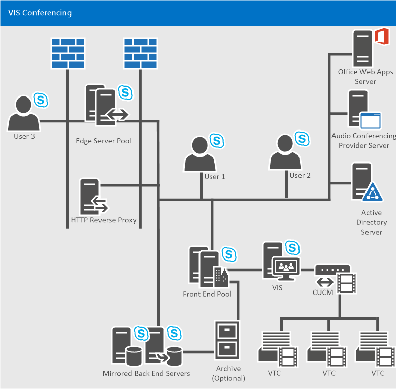

# 在 Skype for Business Server 中规划视频互操作服务器Plan for Video Interop Server in Skype for Business Server
 
**摘要：** 在计划将 Skype for Business Server 与第三方电话会议设备集成时，请查看本主题。**Summary:** Review this topic while planning to integrate Skype for Business Server with third-party teleconferencing devices.
  
Skype for Business Server 现在允许你与某些第三方 VTC (视频电话会议系统) 解决方案。Skype for Business Server now allows you to integrate with certain third-party VTC (Video Teleconferencing System) solutions. 启用此视频会议互操作性的新服务器角色是视频互操作服务器 (VIS) ，当前作为仅可用于本地安装的独立服务器角色实现。The new server role that enables this video conferencing interoperability is the Video Interop Server (VIS), which is currently implemented as a standalone server role available only for on-premises installations. VIS 充当第三方电话会议系统和 Skype for Business Server 部署之间的中介。A VIS acts as an intermediary between a third party teleconference system and a Skype for Business Server deployment. 对于此版本，VIS 侧重于与 Cisco/Tandberg 视频系统的互操作性。For this release, VIS is focused on interoperability with Cisco/Tandberg video systems. 查看本文，确定是否在 Skype for Business Server 安装中使用此功能。Review this article to determine whether to use this feature in your Skype for Business Server installation.
  
## 设备互操作性Device interoperability

使用在 Cisco 统一通信管理器 (CallManager 或 CUCM) 版本 10.5 中注册的 Cisco VTC 和在 CUCM 和 VIS 之间设置的 TCP SIP 中继，对互操作进行测试和支持。Interoperation is tested and supported with Cisco VTCs registering with Cisco Unified Communications Manager (CallManager, or CUCM) version 10.5 and TCP SIP trunks set up between CUCM and the VIS.
  
当前支持的 VTC 包括：The currently supported VTCs are:
  
- Cisco C40Cisco C40
    
- Cisco C60Cisco C60
    
- Cisco C90Cisco C90
    
- Cisco MX200Cisco MX200
    
- Cisco MX300Cisco MX300
    
- Cisco DX80Cisco DX80
    
- Cisco EX60Cisco EX60
    
- Cisco EX90Cisco EX90
    
- Cisco SX20Cisco SX20
    
> [!NOTE]
>  这些系统上需要 Cisco 软件版本 TC7.0.0 或以上版本，才能与 Skype for Business Server 集成以按预期工作。Cisco software release TC7.0.0 or above is required on these systems for integration with Skype for Business Server to work as expected.
  
## SIP 中继SIP trunks

视频互操作服务器在 SIP 中继模式下运行，VTC 继续注册现有 Cisco 基础结构-例如，Cisco Call Manager (CUCM) 。The Video Interop Server functions in SIP trunk mode, where the VTCs continue to register with the existing Cisco infrastructure - for example, Cisco Call Manager (CUCM). 在 CUCM 和 VIS 之间定义视频 SIP 中继，以便可以在两个系统之间路由呼叫。A video SIP trunk is defined between CUCM and the VIS so that calls can be routed between the two systems. 仅支持通过 SIP 中继从 VTC 到 VIS 的呼叫。Only calls over the SIP trunk from the VTC to the VIS are supported. 因此，VTC 可以通过拨打与呼叫自动助理 (关联的电话号码拨入 Skype for Business 会议) 但不能拖放到会议。Thus, VTCs can dial into a Skype for Business conference (by dialing the phone number associated with the Call Automated Attendant), but cannot be dragged and dropped into the conference.
  

  
## 功能Features

此服务器角色提供：This server role provides:
  
- 第三方视频系统和 Skype for Business Server 部署使用的 H.264 格式之间的转换。Conversion between the H.264 formats used by 3rd party video systems and the Skype for Business Server deployment.
    
- 将给定分辨率的单个视频流从 VTC 转换为多个不同分辨率的模拟视频流，以用于 Skype for Business Server 部署。Conversion of a single video stream at a given resolution from a VTC into multiple simulcast streams of different resolutions for use in the Skype for Business Server deployment. 这些流可以发送到 AVMCU，然后发送到 Skype for Business Server 终结点和已请求不同分辨率的其他视频系统。These streams can be sent to the AVMCU and then to Skype for Business Server endpoints and other video systems that have requested different resolutions. 在 Skype for Business A/V 电话会议中涉及第三方视频系统时，也会使用此转换。This conversion is also used when the third party video system is involved in a Skype for Business A/V conference call. 在特定的 VIS 服务器中达到转换代码限制后，对不同分辨率的任何以下请求都只会收到分辨率最低的流。Once the transcoding limit is reached in a particular VIS server, any following requests for different resolutions will only receive a stream with the lowest resolution. 
    
- 支持 CUCM 网关与 Skype for Business Server 视频互操作服务器之间的视频 SIP 中继;VTC 继续注册 Cisco 网关，并通过网关发起对 Skype for Business 部署的呼叫。Support for a video SIP trunk between the CUCM gateway and a Skype for Business Server Video Interop Server; VTCs continue to register with the Cisco gateway, and initiate calls to the Skype for Business deployment through the gateway. 呼叫通过视频 SIP 中继从网关路由到 Skype for Business 视频互操作服务器。Calls are routed from the gateway to the Skype for Business Video Interop Server over the video SIP trunk.
    
- 支持具有受支持视频系统的会议室中的用户从该系统拨号加入打开或关闭的会议。Support for a user in a conference room with a supported video system to dial from that system to join an open or closed conference. 此呼叫将遍历视频 SIP 中继。This call will traverse the video SIP trunk.
    
- 支持会议室中的用户通过受支持的视频系统呼叫 Skype for Business 客户端。Support for a user in a conference room with a supported video system to call a Skype for Business client. 呼叫将遍历 SIP 中继。The call will traverse the SIP trunk.
    
- 支持从 Skype for Business Server 端或支持的 VTC 系统对点到点呼叫和多点呼叫进行呼叫中间控制，包括静音/取消静音音频、暂停/恢复视频、锁定视频以及保持/取消保留呼叫。Support for mid-call control from the Skype for Business Server side or from the supported VTC system for both point to point and multipoint calls including mute/un-mute audio, pause/resume video, lock video, and hold/un-hold call.
    
## 已知限制Known limitations

此服务器角色具有以下限制：This server role has the following limitations:
  
- 不支持通过视频 SIP 中继从 Skype for Business 部署到 VTC 的新呼叫。New calls from the Skype for Business deployment to the VTCs over the video SIP trunk are not supported. .. 这意味着视频 SIP 中继仅支持从 VTC 到 Skype for Business 部署的新呼叫。This means that only new calls from the VTCs into the Skype for Business deployment are supported over the video SIP trunk. 支持的视频系统状态无法通过视频 SIP 中继提供给 VIS。Presence for the supported video system will not be available over the video SIP trunk to the VIS. 
    
- 视频 SIP 中继模式仅支持独立的 VIS 池。Only a standalone VIS pool will be supported for video SIP trunk mode.
    
-  VTC 和 VIS 之间通过视频 SIP 中继的通信将支持 TLS + SRTP 或 TCP + RTP。TLS + SRTP or TCP + RTP will be supported for communications between the VTC and VIS over the video SIP trunk.
    
- 不支持应用程序共享。Application sharing is not supported. 会议室中的 Skype for Business 用户需要通过笔记本电脑加入 Skype for Business 会议 (例如) ，在会议室中未与 VTC 关联的免费监视器之一上显示应用共享屏幕。A Skype for Business user in the conference room needs to join the Skype for Business conference (via a laptop for example) and display the app sharing screens on one of the free monitors in the conference room not associated with the VTC.
    
- 不支持 VTC 通过 VIS 加入联盟会议。The ability for a VTC to join a federated meeting via VIS is not supported.
    
- 不支持 VTC 通过 VIS 加入联机会议。The ability for a VTC to join an online meeting via VIS is not supported.
    
- 不支持通过 VIS 从 VTC 到 PSTN 的呼叫。Calls from a VTC to the PSTN via VIS are not supported.
    
- 不支持通过 VIS 从 PSTN 呼叫 VTC。Calls from the PSTN to a VTC via VIS are not supported.
    
## 复原机制Resiliency mechanisms

VIS 支持通过视频 SIP 中继传输的 CUCM 传入呼叫。The VIS supports incoming calls from a CUCM that are carried over a video SIP trunk. 可能会丢失上游或下游的连接，因此若要获得可靠的复原能力，请考虑以下两种可能性：It's possible to lose connectivity either upstream or downstream, so for robust resiliency consider both possibilities:
  
1. **VIS 池故障转移** 如果视频网关指向的主 VIS 池关闭，则视频网关在 VIS 池中定义了两个或两 (中继) 恢复。**VIS Pool Failover** If the main VIS pool that the video gateway points to is down, recovery is possible if the video gateway has defined trunks to two (or more) VIS pools. 如果视频网关确定它无法对主 VIS 池进行呼叫，它只需将呼叫路由到辅助 VIS 池。If the video gateway determines it cannot make calls to the primary VIS pool, it simply routes the calls to a secondary VIS pool.
    
     
  
    特定 VIS 池可以具有到多个网关的中继，但通常特定网关无法具有到多个 VIS 池的中继，因此需要执行一个技巧来支持此故障转移：在 DNS 中定义 2 个 FDQN，它们解析为视频网关的相同 IP 地址。A particular VIS pool can have trunks to multiple gateways, but normally a particular gateway can't have trunks to multiple VIS pools, so a trick needs to be done to support this failover: Define 2 FDQNs in DNS which resolve to the same IP address of a video gateway. 将每个 FQDN 表示为拓扑文档中的单独视频网关，其中每个视频网关都有一个到不同 VIS 池的中继，现在可以恢复。Represent each FQDN as a separate video gateway in the Topology Document where each video gateway has a trunk to a different VIS pool, and recovery is now possible.  (如果使用 TLS，则多个名称将需要位于视频网关证书的 SAN 中。) (If TLS is used, the multiple names will need to be in the SAN of the video gateway certificate.)
    
    > [!NOTE]
    > VIS 仅允许来自拓扑文档中配置的网关的传入呼叫。VIS only allows incoming calls from gateways configured in the Topology Document. 
  
2. **前端故障转移** 如果 VIS 池收到来自 CUCM 的呼叫，但无法访问其主下一跃点注册器或前端池，则呼叫将路由到备份前端池。**Front End failover** If a VIS pool receives a call from CUCM but cannot reach its primary next-hop Registrar or Front End pool, calls are routed to a backup Front End pool.
    
     
  
    VIS 将跟踪其主前端池及其备份前端池的状态 (该设置位于拓扑文档库的注册器服务的备份设置) 。The VIS will keep track of the status of its primary Front End pool and its backup Front End pool (the setting is found in the backup setting for the Registrar service in the Topology Document). 它每分钟向两个池发送一次"选项"轮询，如果连续五次失败，VIS 会假定特定前端池出现故障。It sends Options polls once a minute to both pools, and if there are five consecutive failures the VIS assumes that a particular Front End pool is down. 如果主前端池标记为"关闭"且有可用的配置备份，VIS 将新呼叫从网关发送到备份前端池。If the primary Front End pool is marked as down and there is an available configured backup the VIS sends new calls from the gateway to the backup Front End pool. 主前端池返回后，VIS 将恢复使用主前端池进行新呼叫。Once the primary Front End pool comes back, the VIS will resume using the primary Front End pool for new calls.
    
    VIS 还将为来自视频 SIP 中继的呼叫实现 10 秒计时器。The VIS will also implement a 10 second timer for calls from the video SIP trunk. 如果主下一跃点前端池用于来自视频 SIP 中继的呼叫，并且主下一跃点前端池未应答某些 SIP 消息 (包括 100 尝试) 到在此计时器值内发送给它的邀请，则应该尝试呼叫的备份下一跃点代理（如果已配置）。If the primary next-hop Front End pool was used for a call from the video SIP trunk, and the primary next-hop Front End pool did not answer with some SIP message (including 100 Trying) to the Invite sent to it within this timer value, the backup next-hop proxy for the call should be tried if configured. 
    
    > [!NOTE]
    > 如果首先尝试了备份下一跃点，则下一步将不会尝试主跃点。If the backup next hop was tried first, the primary will not be tried next. 
  
    管理员还可使用 Windows PowerShell 故障转移命令强制 VIS 使用备份前端池，例如，当主前端池上必须执行维护时。The admin could also use the Windows PowerShell failover command to force VIS to use the backup Front End pool, for example, when maintenance has to be performed on the primary Front End pool.
    
## 语音和视频中继共存到同一网关对等方Co-existence of Voice and Video Trunks to the Same Gateway Peer

Skype for Business Server 支持语音和视频 SIP 中继使用相同的网关对等方。Skype for Business Server supports having voice and video SIP trunks use the same gateway peer. 因此，同一 CUCM 部署可以具有到中介服务器的语音 SIP 中继和到 VIS 的视频 SIP 中继。So the same CUCM deployment could have voice SIP trunks to the Mediation Server and video SIP trunks to VIS.
  
- PSTN 网关将需要使用语音 SIP 中继的拓扑文档中的特定 FQDN 进行定义。A PSTN Gateway will need to be defined with a particular FQDN in the Topology Document for the voice SIP trunks.
    
- PSTN 网关的对等方将是中介服务器。The peer to the PSTN Gateway will be the Mediation Server.
    
- 如有必要，可以定义从 PSTN 网关到多个中介服务器池的多个语音中继。Multiple voice trunks can be defines spanning from a PSTN Gateway to multiple Mediation Server pools if necessary.
    
- 视频网关需要在拓扑文档中为与 PSTN 网关具有相同的 FQDN 的视频 SIP 中继定义。A Video Gateway will need to be defined in the Topology Document for the video SIP trunk with the same FQDN as for the PSTN Gateway.
    
- 视频网关的对等方将为 VIS。The peer to the Video Gateway will be VIS.
    
- 可以定义从视频网关到特定 VIS 池的单个视频中继。A single video trunk can be defined from a Video Gateway to a particular VIS pool.
    
- 需要将 CUCM 配置为通过语音中继和视频中继正确路由呼叫。CUCM will need to be configured to correctly route calls over the voice trunk vs. the video trunk. 例如，从 VTC 拨号时，可能会使用特殊的拨号前缀;CUCM 可以将此拨号前缀与对 VIS 的呼叫关联，相应的转换规则会从对 VIS 的 SIP 邀请中去除此前缀。For example, a special dial prefix could be used when dialing from the VTC; CUCM could associate this dial prefix with calls to VIS, and appropriate translation rules would strip this prefix from the SIP Invite to VIS.
    
## 在 Skype for Business 版本中与 Lync 早期版本共存的 VISCo-existence of VIS in the Skype for Business Release with Previous Releases of Lync

VIS 只能部署为 Skype for Business 部署的一部分。VIS can only be deployed as part of Skype for Business deployment. 它可以与 Lync 2013 会议以及作为现有部署的一部分的客户端进行互操作;在这种情况下，VIS 池将需要是 Skype for Business 部署的一部分，其中包括作为 VIS 池的下一跃点注册器/FE 池。It can interoperate with Lync 2013 conferences and clients that are a part of an existing deployment; in those cases, the VIS pool will need to be part of a Skype for Business deployment that includes a Registrar/FE pool that is the next-hop for the VIS pool.
  
VIS 不支持在 RTV 和 H.264 之间进行转码。VIS does not support transcoding between RTV and H.264. Lync 2013 之前客户端与会议中的 VTC 参与者之间没有视频互操作性。There is no video interoperability between pre-Lync 2013 clients and VTC participants in a conference.
  
在会议拥有 Lync 2013 之前客户端将导致移动客户端使用 RTV 进行发送，从而导致当移动客户端成为主要扬声器时，VTC 不会接收任何视频。Having pre-Lync 2013 clients in a conference will cause mobile clients to send using RTV resulting in VTCs receiving no video when the mobile client becomes the dominant speaker.
  
为了使 Lync 2013 正确使用作为 Skype for Business 部署的一部分的 VIS，Lync 2013 需要应用相应的 CU，以便升级 Lync 2013 客户端、CAA 和 AVMCU 以使用 VIS。In order for Lync 2013 to work correctly with VIS that is part of a Skype for Business deployment, Lync 2013 needs the appropriate CU to be applied that upgrades the Lync 2013 client, CAA, and AVMCU to work with VIS.
  
VIS 与 Lync 2013 和 Skype for Business 桌面客户端的互操作性已经过测试且受支持。Interoperability of VIS with Lync 2013 and Skype for Business desktop clients has been tested and is supported.
  
VIS 与非桌面 (Android、Ipad、Iphone、Windows Phone、LMX 等 ) SKYPE for Business 客户端在 VIS 发布时可从适用的应用应用商店获得互操作性已经过测试，并且受支持。Interoperability of VIS with non-desktop (Android, Ipad, Iphone, Windows Phone, LMX, etc.) Skype for Business clients available from the applicable Apps Store at the time of VIS release has been tested and is supported.
  
## 通过 FEC 从数据包丢失恢复Recovery from Packet Loss via FEC

可以打开 FEC，帮助从数据包丢失中恢复。FEC can be turned on to aid in recovery from packet loss. 如果打开，将在 VIS 到 VTC 方向使用 50% 以上的视频带宽。If turned on, 50% more video bandwidth will be used in the VIS to VTC direction.
  
## VIS 大小调整和转换成本VIS Sizing and Transcoding Costs

将单个视频流从 Cisco VTC 转换到多个模拟视频流使用 CPU 容量。Transcoding the single video streams from the Cisco VTC to multiple simulcast streams uses CPU capacity. 在运行与 Lync 2013 建议的 FE 平台等效的单个 VIS 中，大约 16 个 VTC 可以将视频转码为 (假定每个 VTC 中的 720p 视频流在 720p、360p 和 180p) 中转换为 3 个单独的模拟视频流。Approximately 16 VTCs can have their video transcoded (assuming a 720p video stream from each VTC is transcoded into 3 separate simulcast streams at 720p, 360p, and 180p) in a single VIS running on the equivalent of the Lync 2013 recommended FE platform. 如果关闭转码，这将节省 VIS CPU。If Transcoding is turned off, this will save on VIS CPU. 但是，VIS 从 VTC 请求的视频图像将是满足 Skype for Business 端的所有接收器的最低通用分辨率。However, the video image requested by VIS from the VTC will be the lowest common resolution to satisfy all receivers on the Skype for Business side. 请注意，即使关闭代码转换，当 Skype for Business 客户端请求 VTC 无法发送的某些低分辨率时，也可能激活代码转换。Note that even with transcoding off, transcoding may be activated when Skype for Business clients request certain low resolutions that VTCs cannot send.
  
## 从视频网关到 VIS 的呼叫分布Call Distribution from the Video Gateway to VIS

通过 CUCM 分布机制之一完成分发：Distribution is accomplished via one of the CUCM distribution mechanisms:
  
- 使用 DNS 动态。Dynamically using DNS.
    
- 在 CUCM 端，可以定义单个中继，其中每个中继在 VIS 池中的不同服务器上终止。On the CUCM side, you can define individual trunks, where each trunk terminates on a different server in the VIS pool. CUCM 将跨不同的中继路由呼叫。CUCM will route calls across the different trunks.
    
## 无混合互操作性No Hybrid Interoperability

Skype for Business 不支持 VTC 通过本地 VIS 加入联机会议。Support for VTCs joining online meetings via on-premises VIS is not part of Skype for Business.
  
## 无联合身份验证支持No Federation Support

支持 VTC 通过 VIS 加入联盟会议不是 Skype for Business 的一部分。Support for VTCs joining federated meetings via VIS is not part of Skype for Business.
  
## 另请参阅See also

[在 Skype for Business Server 中部署视频互操作服务器Deploy Video Interop Server in Skype for Business Server](../deploy/deploy-video-interop-server/deploy-video-interop-server.md)
