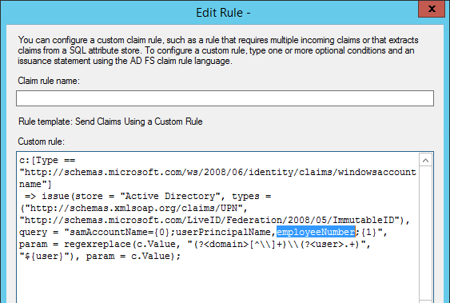

# 配置混合 for Business 的 Skype 的多林环境
 
以下各节提供有关如何配置具有资源/用户林模型，以提供业务功能在混合方案的 Skype 中的多林环境的指南。 
  

  
## 验证林拓扑

支持多个用户林。注意以下几项： 
  
- 为单个用户林或多个用户林部署时，必须有 Skype 业务 server 的单个部署。
    
- 有关受支持版本的 Lync Server 和企业服务器的 Skype 混合配置，请参阅[规划 Skype 业务服务器和 Skype 业务 online 之间的混合连接性](../../skype-for-business-hybrid-solutions/plan-hybrid-connectivity.md)中的[拓扑要求](../../skype-for-business-hybrid-solutions/plan-hybrid-connectivity.md#BKMK_Topology)。
    
- 可以在一个或多个林中，其中可能包含或不包含业务服务器包含 Skype 的林部署 Exchange 服务器。 请确保您应用了最新累积更新。
    
- 有关与 Exchange Server 共存的详细信息（包括在各种本地和联机组合中的支持条件和限制），请参阅[Plan to integrate Skype for Business and Exchange](../../plan-your-deployment/integrate-with-exchange/integrate-with-exchange.md)中的[功能支持](../../plan-your-deployment/integrate-with-exchange/integrate-with-exchange.md#feature_support)。
    
有关详细信息，请参阅 [Environmental requirements for Skype for Business Server 2015](../../plan-your-deployment/requirements-for-your-environment/environmental-requirements.md)。
  
## 用户驻留注意事项

Skype 的企业用户驻留在本地可以具有 Exchange 驻留在本地或联机。 为了获得最佳体验; 应使用 Skype Online 业务用户的 Exchange Online但是，这不是必需的。 本地 Exchange 不需要在任一情况下实现 for Business 的 Skype。
  
## 配置林信任

所需的信任是资源林与每个用户林之间的双向可传递信任。 如果您有多个用户林，则要启用跨林身份验证，必须为这些林中的每个林启用名称前缀路由。 有关说明，请参阅[管理林信任](https://technet.microsoft.com/en-us/library/cc772440.aspx)。 
  
## 到林中承载 Skype for Business 同步帐户

当 Skype 的业务服务器部署在一个林中 （资源林），但功能向用户提供在一个或多个其他林中 （帐户林） 时，必须作为林中已禁用的用户对象表示其他林中的用户其中的 Skype业务服务器部署。 标识管理产品，例如 Microsoft Identity Manager 中，需要部署和配置设置并将从帐户林的用户同步到林中部署 Skype 业务服务器的位置。 用户必须同步到林中承载 Skype 业务服务器作为已禁用的用户对象。 用户无法同步为 Active Directory 联系人对象，因为 Azure Active Directory 连接将不正确同步联系人到用于与 Skype 的 Azure AD。
  
任何多林配置，无论业务服务器承载 Skype 林还可以位于同一林中的任何已启用用户提供功能。
  
若要获得正确的身份同步，需要同步下列属性： 
  
|**用户林**|**资源林**|
|:-----|:-----|
|选择的帐户链接属性    |选择的帐户链接属性    |
|邮件     |邮件     |
|ProxyAddresses    |ProxyAddresses    |
|ObjectSID    |msRTCSIP-OriginatorSID    |
   
[选择的帐户链接属性](https://azure.microsoft.com/documentation/articles/active-directory-aadconnect-design-concepts/)将用作源定位点。 如果你有偏好使用的不同且不变的属性，则可以这样做，只是务必要编辑 AD FS 声明规则并在 AAD Connect 配置期间选择该属性。
  
不同步林之间的 UPN。 在测试期间，我们发现我们需要将唯一的 UPN 用于每个用户林，因为不能在多个林中使用相同的 UPN。 因此，出现了两种可能性：同步 UPN 或不同步。 
  
- 如果未将每个用户林中的唯一 UPN 与资源林中相关联的已禁用对象同步，至少会针对初始登录尝试中断单一登录（假设用户选择了保持密码的选项）。在 SfB 客户端中，我们假设 SIP/UPN 值相同。由于在此情况下 SIP 地址是 user@company.com，但用户林中已启用对象的 UPN 实际上是 user@contoso.company.com，初始登录尝试将会失败，并且系统将提示用户输入凭锯。在输入正确/实际 UPN 时，将会针对用户林中的域控制器完成身份验证请求，并且登录将会成功。
    
- 如果使每个用户林中的唯一 UPN 与资源林中相关联的已禁用对象同步，则 AD FS 身份验证将会失败。匹配的规则可找到资源林中对象的 UPN，但该 UPN 处于禁用状态，无法用于身份验证。 
    
## 创建 Office 365 租户

接下来需要设置要用于部署的 Office 365 租户。 有关详细信息，请参阅 [Office 365 设置步骤](https://social.technet.microsoft.com/wiki/contents/articles/22808.office-365-provisioning-steps.aspx)。 
  
## 配置 AD FS

具有租户之后，接着需要在每个用户林中配置 Active Directory 联合身份验证服务 (AD FS)。这假设您具有每个林的唯一 SIP 及 SMTP 地址和用户主体名称 (UPN)。AD FS 是可选的，在此处用来获取单一登录。DirSync with Password Sync 也受支持，并且还可以替代 AD FS 使用。 
  
只会测试具有匹配的 SIP/SMTP 和 UPN 的部署。不具有匹配的 SIP/SMTP/UPN 可能导致缩减功能，例如 Exchange 集成和单一登入有问题。 
  
除非您使用唯一的 SIP/SMTP/UPN 中每个林的用户时，您仍然可以运行到单一登录 (SSO) 问题-无论部署 AD FS 的位置： 
  
- 对于在每个用户林中部署了 AD FS 服务器场的资源/用户林之间的单向或双向信任，所有用户共享共同的 SIP/SMTP 域，但将唯一 UPN 用于每个用户林。 
    
- 对于仅在资源林中部署了 AD FS 服务器场的资源/用户林之间的双向信任，所有用户共享共同的 SIP/SMTP 域，但将唯一 UPN 用于每个用户林。 
    
通过在每个用户林中放置 AD FS 服务器场并将唯一的 SIP/SMTP/UPN 用于每个林，我们解决了这两个问题。在身份验证期间，将只搜索并匹配特定用户林中的帐户。这将有助于提供更无缝的身份验证流程。 
  
这将是 Windows Server 2012 R2 AD FS 的标准部署，应处于正常工作状态才能继续。 有关说明，请参阅[如何安装适用于 Office 365 的 AD FS 2012 R2](https://blogs.technet.com/b/rmilne/archive/2014/04/28/how-to-install-adfs-2012-r2-for-office-365.aspx)。 
  
部署之后，您必须编辑声明规则以与先前选择的“来源作者”相匹配。在 AD FS MMC 中，在“依赖方信任”下，右键单击 Microsoft Office 365 身份平台，然后单击“编辑声明规则”。编辑第一个规则并将 ObjectSID 更改为 employeeNumber。 
  

  
## 配置 AAD Connect

AAD Connect 将用于在不同林之间以及不同林与 Office 365 之间合并帐户。您应该在资源林中部署 AAD Connect。必须能够在多个林与 Office 365 之间同步，Dirsync 不支持此操作。 
  
AAD Connect 不会在内部部署林之间同步帐户。它使用 AD 连接来读取已在内部部署林之间同步的对象（通过 FIM 或类似产品）。然后，它利用筛选规则创建其元节中相匹配的已启用和已禁用对象的单一表示，然后将该单一已合并对象复制到 Office 365 中。 
  
完成之后并且 AAD Connect 正在合并时，如果您查看元节中的对象，应该看到类似如下的内容： 
  

  
已从 Office 365 中合并绿色突出显示的属性，黄色来自用户林，蓝色来自资源林。 
  
这是一个测试用户，您可以看到 AAD Connect 已识别用户和资源林对象及 Office 365 中的 sourceAnchor 和 cloudSourceAnchor，在我们的案例 1101 中，是先前选择的 employeeNumber。然后，系统能够将此对象合并到您在上方看到的内容中。 
  
有关详细信息，请参阅[将本地身份与 Azure Active Directory 集成](https://azure.microsoft.com/documentation/articles/active-directory-aadconnect/)。 
  
应使用大部分默认值安装 AAD Connect。 以下步骤例外： 
  
1.  单一登录-与已部署的 AD FS 和工作，选择不要配置
    
2. 连接您的目录-添加的所有域 
    
3.  确定本地目录中的用户： 选择**跨多个目录存在用户标识**，然后选择**ObjectSID**和**msExchangeMasterAccountSID**属性
    
4. Azure AD 中标识用户： 源定位-选择您已阅读[选择良好 sourceAnchor 属性](https://azure.microsoft.com/documentation/articles/active-directory-aadconnect-design-concepts/)后选择的属性、 用户主体名称- **userPrincipalName**
    
5.  可选功能-选择是否已部署的 Exchange 混合部署。
    
    > [!NOTE]
    >  如果您只有 Exchange Online，则在自动发现期间，可能会因为 CNAME 重定向而出现 OAuth 失败问题。 若要纠正此问题，您将需要从 Skype 的业务 Server Management Shell 中运行以下 cmdlet 设置 Exchange 自动发现 URL:
  
    Set-csoauthconfiguration ExchangeAutoDiscoverURLhttps://autodiscover-s.outlook.com/autodiscover/autodiscover.svc 
    
6.  AD FS 服务器场：选择**使用现有 Windows Server 2012 R2 AD FS 服务器场**并输入 AD FS 服务器的名称。
    
7.  完成向导并执行必要的验证。
    
## 为 Skype for Business Server 配置混合模式

按照业务混合配置 Skype 的最佳实践。 有关更多规划信息，请参阅[为 Skype for Business Server 2015 规划混合部署](https://technet.microsoft.com/en-us/library/jj205403.aspx)，有关配置信息，请参阅[使用 Skype for Business Online 配置混合部署](https://technet.microsoft.com/en-us/library/jj204669.aspx)。 
  
## 为 Exchange Server 配置混合模式

如有必要，遵循配置 Exchange 混合部署的最佳做法操作。 有关详细信息，请参阅[Exchange Server 混合部署](https://technet.microsoft.com/en-us/library/jj200581%28v=exchg.150%29.aspx)。 
  

