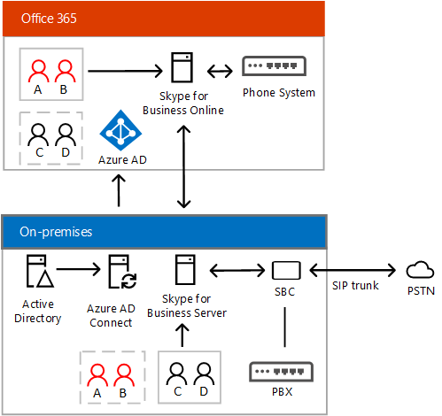

# 规划 Skype for Business Server 与 Skype for Business Online 之间的混合连接
 
**摘要：**阅读本主题可了解如何规划 Skype for Business Server 与 Skype for Business Online 之间的混合连接。 设置混合连接是部署多种 Skype for Business 混合解决方案的第一步。
  
本主题简要介绍，并介绍了基础结构和系统要求您将需要配置之间现有的混合连接内部 Skype 业务服务器部署--与您在部署中创建的用户Active Directory — — 和 Skype 的在线业务。 
  
本主题包括以下部分：
  
- [概述](plan-hybrid-connectivity.md#BKMK_Overview)
    
- [基础结构要求](plan-hybrid-connectivity.md#BKMK_Infrastructure)
    
- [多林支持](plan-hybrid-connectivity.md#BKMK_MultiForest)
    
- [交换共存](plan-hybrid-connectivity.md#BKMK_Exchange)
    
- [管理员凭据](plan-hybrid-connectivity.md#BKMK_Credentials)
    
- [Skype 业务在线 PowerShell 的](plan-hybrid-connectivity.md#BKMK_PowerShell)
    
- [Skype 业务客户端支持](plan-hybrid-connectivity.md#BKMK_ClientSupport)
    
- [拓扑结构要求](plan-hybrid-connectivity.md#BKMK_Topology)
    
- [联盟允许/阻止列表的要求](plan-hybrid-connectivity.md#BKMK_Federation)
    
- [DNS 设置](plan-hybrid-connectivity.md#BKMK_DNS)
    
- [防火墙注意事项](plan-hybrid-connectivity.md#BKMK_Firewall)
    
- [协议和端口要求](plan-hybrid-connectivity.md#BKMK_Ports)
    
- [用户帐户和数据](plan-hybrid-connectivity.md#BKMK_UserAccounts)
    
- [用户策略和功能](plan-hybrid-connectivity.md#BKMK_UserPolicies)
    
在阅读此主题并准备部署信息，请参阅[部署混合业务服务器和 Skype 的在线业务 Skype 之间的连接](deploy-hybrid-connectivity/deploy-hybrid-connectivity.md)。 部署主题提供了设置本地部署与 Skype for Business Online 之间的混合连接的分步指导。
  
（有关配置 Lync Server 2013 或混合的 Lync Server 2010 部署信息，请参见[Lync Server 2013 混合](https://go.microsoft.com/fwlink/p/?LinkId=617360)）。
  
## 概述

混合解决方案使你可以根据自己的计划和业务需求将用户迁移到云。 本主题重点介绍 Skype for Business Server 本地部署与 Skype for Business Online 之间的混合连接。 通过此连接，你可以将一些用户在本地托管，一些用户在线托管。
  
这种类型的部署有时也称为"拆分域"— — 意味着用户的域，如 contoso.com，都分为使用 Skype 业务服务器上部署和 Skype 的在线业务，如下所示：
  
- 在本地托管的用户与本地 Skype for Business 服务器交互
    
- 在线托管的用户与 Skype for Business 在线服务交互
    
- 两个环境的用户可以使用即时消息或通过参与电话会议和 VoIP 通话等方式相互协作
    
- Azure Active Directory Connect 用于将你的本地目录与 Office 365 同步
    
本地 Active Directory 是权威性的，即你必须执行下列操作以确保本地和在线用户可以相互发现：
  
- 应首先创建在内部部署 Active Directory 中，然后到 Azure AD 同步所有用户。 
    
- 如果你的用户托管在本地 Skype for Business 中，你需要为本地 Skype for Business 启用这些用户。
    
- 如果你的用户在本地托管，但想要利用某些在线功能（例如 Skype 会议广播），你需要向其分配 Skype for Business Online 套餐 2 许可证。
    
- 如果你的用户在 Skype for Business Online 中托管，则其帐户同步到 Azure AD 之后，你将需要为其分配 Skype for Business Online 套餐 2 许可证。 
    
- 为 Skype for Business Online 用户分配许可证后，你需要为 Skype for Business 或本地 Enterprise Voice 启用这些用户。 有关详细信息，请参阅[启用用于内部部署的企业语音用户](plan-your-phone-system-cloud-pbx-solution/enable-the-users-for-enterprise-voice-on-premises.md)。 混合语音要求的详细信息，请参阅[计划内部 Skype 业务服务器中的 PSTN 连接与 Office 365 中的电话系统](plan-your-phone-system-cloud-pbx-solution/plan-phone-system-with-on-premises-pstn-connectivity.md)。
    
在下面的部分，你将了解有关 Active Directory 配置的更多信息。 但首先是下图以及众多混合连接主题中使用的术语和缩略词概述：
  
- PSTN - 公用电话交换网
    
- PBX - 专用交换机电话系统
    
- 电话系统 - Microsoft 的云 PBX 电话系统产品
    
- 干线的电话线路连接到 PSTN 的 Pbx — 干线可能使用会话初始协议 (SIP) — — 语音通信 (Voip) — — 或较早的时间时分多路复用技术 (TDM) 技术 
    
- SBC - 会话边界控制器 - 在电话网络中充当防火墙和路由器的设备。 例如，提供安全性、连接性、互操作性和服务质量。 
    
- PSTN 网关 - 在电话网络中充当路由器的设备，能够执行 SBC 可以执行的大部分操作，安全和 NAT 遍历除外。
    
下图显示了 Skype 业务"拆分域"混合配置。 用户 A 和 B 在线托管，但可以被本地用户发现；用户 C 和 D 在本地托管，但可以被在线用户发现。
  

  
你可能也已对“混合语音”一词很熟悉—它是指向在云中托管的用户提供功能的本地语音主干。 通过混合语音，可以在保留本地语音配置的同时迁移到云。 如果你已具有 Skype for Business Server 部署，启用混合语音的第一步是配置拆分域环境。 
  
例如，假定您的公司有大型移动字段需要最少的 PBX 的组织提供支持的声音，但广泛使用的智能手机。 你可以选择将这些用户迁移到云，以利用 Microsoft 的 Office 365 电话系统（云 PBX）。 如果您的公司也有内部部署大型呼叫中心作为内部 PBX 的一部分需要高级、 复杂的联系中心软件，您可以选择在部署上保留这些用户。 在线托管和在本地托管的用户均具有通过本地部署的 PSTN 连接。
  
下图显示了 Skype for Business 混合语音部署：
  

  
有关设置混合语音解决方案与您 Skype 业务服务器部署的详细信息，请参阅[计划内部 Skype 业务服务器中的 PSTN 连接与 Office 365 中的电话系统](plan-your-phone-system-cloud-pbx-solution/plan-phone-system-with-on-premises-pstn-connectivity.md)。 
  
您还可以配置与的集成的混合部署内部交换和 SharePoint，或与 Microsoft Office 365 的应用程序，包括 Exchange 联机和 SharePoint Online。 你还可以使用云连接器版本配置不需要完整 Skype for Business Server 部署的混合语音解决方案。 有关所有 Skype 业务混合解决方案和规划迁移到云环境的详细信息，请参阅[Skype 业务混合解决方案](skype-for-business-hybrid-solutions.md)。
  
## 基础结构要求

要实施和部署 Skype for Business Server 与 Skype for Business Online 之间的混合连接，必须在环境中进行以下配置：
  
- 一个内部的 Skype 业务服务器或部署在受支持的拓扑的 Lync 服务器的部署。 请参阅本主题中的[拓扑要求](plan-hybrid-connectivity.md#BKMK_Topology)。
    
- 与 Skype 业务在线启用 Microsoft Office 365 租户。 
    
    > [!NOTE]
    > 只能将混合配置的单个租户与你的本地部署结合使用。 
  
- Skype 业务服务器 2015年管理工具。 （如果您正在使用 Lync Server 2013 或 Lync Server 2010 中，可以使用 Lync Server 2013 管理工具。 有关详细信息，请参阅[Lync Server 2013 混合](https://go.microsoft.com/fwlink/p/?LinkId=617360)。
    
- Azure Active Directory Connect 用于将你的本地目录与 Office 365 同步。 有关详细信息，请参阅[使用 Azure 活动目录连接 Active Directory](https://docs.microsoft.com/en-us/azure/active-directory/connect/active-directory-aadconnect-accounts-permissions)。
    
    若要支持 Office 365 的单一登录，使用户能使用在本地所用的同一登录凭据，可以使用 Azure Active Directory (AAD) Connect 的密码同步功能。 还可以使用 Active Directory 联合身份验证服务 (AD FS) 来进行 Office 365 单一登录。 
    
- 已在你的本地 Skype for Business 部署与 Office 365 租户之间启用联盟。 联合身份验证允许用户在内部部署的 Office 365 提供组织中的用户进行通信。 有关详细信息，请参阅[配置联合身份验证与 Skype 的在线业务](deploy-hybrid-connectivity/configure-federation-with-skype-for-business-online.md)。
    
- 已启用共享会话初始协议 (SIP) 地址空间。 SIP 地址是网络上每个用户的唯一标识符，类似于电话号码或电子邮件地址。 尝试将用户移动从内部到 Skype 的在线业务之前，您需要配置您的 Office 365 租户在内部部署共享共享会话启动协议 (SIP) 地址空间。 有关详细信息，请参阅[配置联合身份验证与 Skype 的在线业务](deploy-hybrid-connectivity/configure-federation-with-skype-for-business-online.md)。
    
## 多林支持

如果满足下列要求，用户可以访问其他林中的 Skype for Business 功能：
  
- 用户已正确同步到托管 Skype for Business 的林中：在混合配置中，这意味着用户必须作为已禁用的用户对象同步。
    
- 托管 Skype for Business 的林必须信任包含用户的林。
    
混合多目录林方案的详细信息，请参阅[配置多目录林环境中的混合业务的 Skype](deploy-hybrid-connectivity/configure-a-multi-forest-environment-for-hybrid.md)。
  
## Exchange 共存

要支持与 Exchange 共存，请记住下列事项：
  
- 最佳做法是在移动业务的用户的 Skype 家庭之前将用户的邮箱移动到 Exchange 联机。
    
- 支持具有本地 Exchange 邮箱的用户，但存在下列已知限制：
    
  - 客户端登录：在 SfB 客户端登录过程中，用户可能需要登录两次
    
  - 服务器端对话历史记录，存档、 统一联系人存储库、 HighRes 照片需要交换 2013年或更高版本，并且您必须启用 OAuth 服务器到服务器的通信。 有关详细信息，请参阅[管理服务器的身份验证 (OAuth) 和业务服务器 2015年的 Skype 的合作伙伴应用程序](https://technet.microsoft.com/en-us/library/jj204817.aspx)。
    
有关 Exchange Server 与共存的详细信息，包括支持条件和限制的各种组合的内部部署和联机，请参阅[计划集成 Skype 业务和交换](../plan-your-deployment/integrate-with-exchange/integrate-with-exchange.md)中的[支持的功能](../plan-your-deployment/integrate-with-exchange/integrate-with-exchange.md#feature_support)。
  
## 管理员凭据

当询问您要提供管理员凭据时，使用的用户名和密码管理员帐户为 Office 365 租户。 您还将使用这些凭据配置时 Azure Active Directory 联合身份验证、 目录同步、 单一登录，和移动用户 Skype 的在线业务。
  
## Skype for Business Online PowerShell

管理员现在可以使用 Windows PowerShell 管理 Skype 的在线业务和其 Skype 的在线业务的用户帐户。 若要执行此操作，您必须首先下载并安装 Skype 业务在线连接器模块，从 Microsoft 下载中心获取。 有关下载的详细信息，安装和使用 Skype 业务在线连接器模块，并使用 Windows PowerShell 管理 Skype 的在线业务的详细信息，请参阅[使用 Windows PowerShell 管理业务的 Skype联机](https://technet.microsoft.com/library/dn362831.aspx)。 
  
## Skype for Business 客户端支持

客户端中支持的功能与本地和联机环境中提供的功能一样，存在一些差异。 下列客户端支持 Skype 的在线业务中混合部署：
  
- Skype for Business
    
- Lync 2013
    
- Lync 2010
    
- Lync Windows 应用商店应用
    
- Lync Web App
    
- Lync Mobile
    
- Lync for Mac 2011
    
- Lync 空间系统和 Skype 业务空间系统
    
- Lync Basic 2013
    
- Microsoft Surface Hub
    
在决定要给家庭用户组织中之前，应检查[业务 Skype 的桌面客户端功能比较](../plan-your-deployment/clients-and-devices/desktop-feature-comparison.md)确定的 Skype 业务服务器的各种配置的客户端支持。 另请参阅：
  
- [规划客户端和设备](../plan-your-deployment/clients-and-devices/clients-and-devices.md)
    
- [Skype 业务的移动客户端功能比较](../plan-your-deployment/clients-and-devices/mobile-feature-comparison.md)
    
## 拓扑要求

若要配置为混合部署与 Skype 的在线业务时，需要有一个受支持的拓扑：
  
- 与所有服务器运行业务服务器 2015 Skype 业务服务器 2015年部署 Skype。
    
- 与所有服务器运行 Lync Server 2013 Lync Server 2013 部署。
    
    对于混合语音连接，指定为联盟边缘的边缘服务器必须为 Skype for Business 2015，边缘也需要 Skype for Business Server 后端。 你可能有一个池中没有任何用户。 
    
- 通过最新的累积更新运行 Lync Server 2010 中的所有服务器使用 Lync Server 2010 部署。
    
  - 联合身份验证边缘服务器和从联盟边缘服务器的下一个跃点服务器必须运行 Lync Server 2010 通过最新的累积更新。
    
  - Skype 业务服务器 2015年或 Lync Server 2013 管理工具必须安装至少一台服务器或管理工作站上。
    
- 一个混合的 Lync Server 2013 和 Skype 运行业务服务器 2015 Skype 的至少一个站点中的下列服务器角色具有的业务服务器 2015年部署：
    
  - 至少一个企业版池或 Standard Edition 服务器  
    
  - 与 SIP 联盟关联的控制器池（如果存在）
    
  - 与 SIP 联盟关联的边缘池
    
- 一个混合的 Lync Server 2010 和运行业务服务器 2015 Skype 的至少一个站点中的下列服务器角色具有的业务服务器 2015年部署 Skype:
    
  - 至少一个企业版池或 Standard Edition 服务器  
    
  - 与 SIP 联盟关联的控制器池（如果存在）
    
  - 与站点的 SIP 联盟关联的边缘池
    
- 混合的 Lync Server 2010 和 Lync Server 2013 部署与运行 Lync Server 2013 的至少一个站点中的下列服务器角色：
    
  - 站点中至少一个企业版池或 Standard Edition 服务器
    
  - 与 SIP 联盟关联的控制器池（如果站点中存在）
    
  - 与站点的 SIP 联盟关联的边缘池
    
## 联盟允许/阻止列表的要求

允许域列表包括已配置合作伙伴“边缘”完全限定域名 (FQDN) 的域。 这些有时被称为允许的合作伙伴服务器 ordirect 联盟伙伴。 您应该熟悉开放联盟和关闭的联盟，称为伙伴发现 andallowed 合作伙伴域列表，分别在内部部署之间的差异。
  
必须满足以下要求才能成功配置混合部署：
  
- 为您的本地部署和您的 Office 365 租户配置的域匹配必须相同。如果在本地部署中启用了合作伙伴发现，则必须为您的联机租户配置开放联盟。如果未启用合作伙伴发现，则必须为您的联机租户配置封闭联盟。
    
- 本地部署中的阻止域列表必须与您的联机租户的阻止域列表完全匹配。
    
- 本地部署中的允许域列表必须与您的联机租户的允许域列表完全匹配。
    
- 必须为在线组织，通过 Skype 业务在线控制面板配置外部通信启用联盟。
    
## DNS 设置

创建混合部署 DNS 记录时，所有 Skype 业务外部 DNS 记录应都指向内部部署基础结构。 有关所需的 DNS 记录的详细信息，请参阅[DNS 业务服务器 2015年的 Skype 的要求](../plan-your-deployment/network-requirements/dns.md)。
  
此外，您还需要确保下表中所述的 DNS 解析在您的本地部署中正常运行：
  
|DNS 记录    |解析者    |DNS 要求    |
|:-----|:-----|:-----|
|_Sipfederationtls._tcp 的 DNS SRV 记录。\<sipdomain.com\>为所有支持的 SIP 域解析为访问边缘外部 IP(s)    |边缘服务器    |在混合配置中启用联盟通信。边缘服务器需要知道在什么位置为 SIP 域路由分布在本地设备和在线设备上的联盟流量。    必须使用用户名与 SRV 记录中的域之间的严格 DNS 名称匹配。    |
|边缘 Web 会议服务 FQDN 的 DNS A 记录，例如解析为 Web 会议边缘外部 IP 的 webcon.contoso.com    |公司内部网络连接的用户的计算机    |让在线用户能够在本地托管会议中演示或查看内容。内容包括 PowerPoint 文件、白板、轮询和共享笔记。    |
   
根据 DNS 在您的组织中如何配置，您可能需要将这些记录添加到内部托管 DNS 区域，以便相应的 SIP 域能够提供对这些记录的内部 DNS 解析。
  
## 防火墙注意事项

您的网络上的计算机必须能够执行标准 Internet DNS 查找。如果这些计算机可以连接标准 Internet 站点，表明您的网络符合此要求。
  
根据 Microsoft Online Services 数据中心的位置，您还必须配置您的网络防火墙设备以接受连接基于通配符域名 (例如，所有流量从\*。 outlook.com)。 如果您的组织的防火墙不支持通配符名称配置，您需要手动确定您想要允许的 IP 地址范围和指定的端口。
  
有关详细信息，请参阅[Office 365 的 Url 和 IP 地址范围](https://go.microsoft.com/fwlink/p/?LinkId=252942)。
  
## 端口和协议要求

除了内部通信的端口要求，还必须配置以下端口以启用混合连接：
  

|**协议**|**TCP 或 UDP**|**源 IP**|**目标 IP**|**源端口**|**目标端口**|**说明**|
|:-----|:-----|:-----|:-----|:-----|:-----|:-----|
|SIP (MTLS)    |TCP    |访问边缘    |Office 365    |任何    |5061    |信号    |
|SIP (MTLS)    |TCP    |Office 365    |访问边缘    |任何    |5061    |信号    |
|STUN    |TCP    |A/V 边缘    |Office 365    |50000-59999    |443，50000-59999    |为音频、视频、应用程序共享会话打开    |
|STUN    |TCP    |Office 365    |A/V 边缘    |443    |50000-59999    |为音频、视频、应用程序共享会话打开    |
|STUN    |UDP    |A/V 边缘    |Office 365    |3478    |3478    |为音频、视频会话打开    |
|STUN    |UDP    |Office 365    |A/V 边缘    |3478    |3478    |为音频、视频会话打开    |
   
有关端口和防火墙的边缘服务器规划的详细信息，请参阅[在 Skype 业务服务器 2015年的边缘服务器环境的要求](../plan-your-deployment/edge-server-deployments/edge-environmental-requirements.md)。 请参阅[服务器的端口和协议要求](../plan-your-deployment/network-requirements/ports-and-protocols.md)和[协议工作负荷图](http://go.microsoft.com/fwlink/p/?LinkId=550989)。
  
## 用户帐户和数据

在混合部署中，想要在线家庭任何用户必须首先创建在内部部署中，以便在 Active Directory 域服务中创建的用户帐户。 然后可以移动到 Skype 业务在线，它将用户的联系人列表中的用户。
  
在同步到内部部署和联机使用连接 AAD 的租户之间的用户帐户时，您需要同步 AD 帐户为所有对您的组织中的业务或 Lync 用户 Skype 即使用户不在线移动到。 如果未同步所有用户，则组织中本地和联机用户之间的通信可能无法按预期工作。
  
> [!IMPORTANT]
> 所有的用户管理，包括用户内部和 Skype 之间移动的业务联机，必须使用最新安装的管理工具版本。 必须对现有的内部部署和互联网已连接访问的独立服务器上安装管理工具。 从管理工具连接到内部部署必须运行该 cmdlet 将用户从移到内部部署到 Skype 的业务联机，[移动 CsUser](https://docs.microsoft.com/en-us/powershell/module/skype/move-csuser?view=skype-ps)。 有关移动用户的详细信息，请参阅[移动用户 Skype 的在线业务的场所上](deploy-hybrid-connectivity/move-users-from-on-premises-to-skype-for-business-online.md)。 
  
> [!IMPORTANT]
> 如果用户是使用 Office 365 的联机门户创建的，则该用户帐户将不会与本地 Active Directory 同步，并且该用户将不会存在于本地 Active Directory 中。 如果你已在联机租户中创建用户，并且希望配置与本地部署的混合，请参阅“将用户从联机移动到本地”。 
  
> [!NOTE]
> 如果您目前正在为具有未在内部部署中启用的用户 Skype 的在线业务启用联机业务客户 Skype，请参阅[移动用户从 Skype 业务联机到内部部署](deploy-hybrid-connectivity/move-users-from-skype-for-business-online-to-on-premises.md)。 
  
规划混合部署时还应考虑以下用户相关的问题。
  
- **用户的联系人**Lync Online 用户联系人的限制为 250 个字符。 当帐户移至 Lync Online 超过该数字的所有联系人将都从用户的联系人列表。
    
- **即时消息和状态**使用用户帐户迁移联系人列表的用户、 组和访问控制列表 (Acl)。
    
- **会议数据、 会议内容和计划的会议**此内容不会迁移的用户帐户。 用户必须在其帐户迁移到 Lync Online 之后重新安排会议。
    
## 用户策略和功能

- 在混合环境中，可以为本地或联机用户（但不是同时）启用即时消息和会议。
    
- **客户端支持**有些用户可能需要新的客户端版本，当他们移动到 Skype 的在线业务。 对于办公室通信服务器 2007 R2 中，用户必须将移动到 Skype 业务服务器或 Lync Server 2013 池之前迁移到 Skype 的在线业务。
    
- **内部部署策略和配置 （非用户）**联机和本地策略需要单独的配置。 无法设置适用于二者的全局策略。
    

