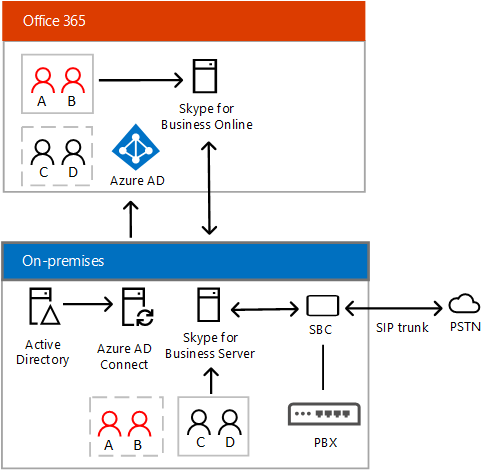

# 规划 Skype for Business Server 与 Skype for Business Online 之间的混合连接
 
**摘要：** 阅读本主题可了解如何规划 Skype for Business Server 与 Skype for Business Online 之间的混合连接。 设置混合连接是部署多种 Skype for Business 混合解决方案的第一步。
  
本主题提供了概述，并描述基础结构和系统要求您需要配置混合连接之间您现有的内部部署 Skype Business Server 部署的 — 与在您的内部部署中创建的用户Active Directory — 和 Skype for Business 联机。 
  
本主题包括以下部分：
  
- [概述](plan-hybrid-connectivity.md#BKMK_Overview)
    
- [基础结构要求](plan-hybrid-connectivity.md#BKMK_Infrastructure)
    
- [多林支持](plan-hybrid-connectivity.md#BKMK_MultiForest)
    
- [Exchange 共存](plan-hybrid-connectivity.md#BKMK_Exchange)
    
- [管理员凭据](plan-hybrid-connectivity.md#BKMK_Credentials)
    
- [Skype for Business Online PowerShell](plan-hybrid-connectivity.md#BKMK_PowerShell)
    
- [Skype for Business 客户端支持](plan-hybrid-connectivity.md#BKMK_ClientSupport)
    
- [拓扑要求](plan-hybrid-connectivity.md#BKMK_Topology)
    
- [联盟允许/阻止列表的要求](plan-hybrid-connectivity.md#BKMK_Federation)
    
- [DNS 设置](plan-hybrid-connectivity.md#BKMK_DNS)
    
- [防火墙注意事项](plan-hybrid-connectivity.md#BKMK_Firewall)
    
- [端口和协议要求](plan-hybrid-connectivity.md#BKMK_Ports)
    
- [用户帐户和数据](plan-hybrid-connectivity.md#BKMK_UserAccounts)
    
- [用户策略和功能](plan-hybrid-connectivity.md#BKMK_UserPolicies)
    
之后，您已阅读本主题和准备部署，请参阅[Deploy Skype 业务服务器和 Skype 业务 online 之间的混合连接性](deploy-hybrid-connectivity/deploy-hybrid-connectivity.md)。 部署主题提供了设置本地部署与 Skype for Business Online 之间的混合连接的分步指导。
  
（有关配置 Lync Server 2013 或 Lync Server 2010 混合部署的信息，请参阅[Lync Server 2013 hybrid](https://go.microsoft.com/fwlink/p/?LinkId=617360)。）
  
## 概述

混合解决方案使你可以根据自己的计划和业务需求将用户迁移到云。 本主题重点介绍 Skype for Business Server 本地部署与 Skype for Business Online 之间的混合连接。 通过此连接，你可以将一些用户在本地托管，一些用户在线托管。
  
这种部署有时称为"拆分域"— 含义用户的域名，例如，contoso.com，分别驻留在使用 Skype 本地 Business Server 和 Skype 业务 online，如下所示：
  
- 在本地托管的用户与本地 Skype for Business 服务器交互
    
- 在线托管的用户与 Skype for Business 在线服务交互
    
- 两个环境的用户可以使用即时消息或通过参与电话会议和 VoIP 通话等方式相互协作
    
- Azure Active Directory Connect 用于将你的本地目录与 Office 365 同步
    
本地 Active Directory 是权威性的，即你必须执行下列操作以确保本地和在线用户可以相互发现：
  
- 所有用户应首先，在内部部署 Active Directory 中创建，然后同步到 Azure AD。 
    
- 如果你的用户托管在本地 Skype for Business 中，你需要为本地 Skype for Business 启用这些用户。
    
- 如果你的用户在本地托管，但想要利用某些在线功能（例如 Skype 会议广播），你需要向其分配 Skype for Business Online 套餐 2 许可证。
    
- 如果你的用户在 Skype for Business Online 中托管，则其帐户同步到 Azure AD 之后，你将需要为其分配 Skype for Business Online 套餐 2 许可证。 
    
- 为 Skype for Business Online 用户分配许可证后，你需要为 Skype for Business 或本地 Enterprise Voice 启用这些用户。 有关详细信息，请参阅[启用本地的企业语音的用户](plan-your-phone-system-cloud-pbx-solution/enable-the-users-for-enterprise-voice-on-premises.md)。 有关混合语音要求的详细信息，请参阅[规划与业务服务器 Skype 中的内部部署 PSTN 连接的 Office 365 中的电话系统](plan-your-phone-system-cloud-pbx-solution/plan-phone-system-with-on-premises-pstn-connectivity.md)。
    
在下面的部分，你将了解有关 Active Directory 配置的更多信息。 但首先是下图以及众多混合连接主题中使用的术语和缩略词概述：
  
- PSTN - 公用电话交换网
    
- PBX - 专用交换机电话系统
    
- 电话系统 - Microsoft 的云 PBX 电话系统产品
    
- 中继-Pbx 连接到 PSTN 的电话线路 — 中继可能使用会话初始协议 (SIP) — A Voice over Internet Protocol (VoIP) — 或较旧的-时分多路复用 (TDM) 技术 
    
- SBC - 会话边界控制器 - 在电话网络中充当防火墙和路由器的设备。 例如，提供安全性、连接性、互操作性和服务质量。 
    
- PSTN 网关 - 在电话网络中充当路由器的设备，能够执行 SBC 可以执行的大部分操作，安全和 NAT 遍历除外。
    
下图显示了业务"拆分域"混合配置 Skype。 用户 A 和 B 在线托管，但可以被本地用户发现；用户 C 和 D 在本地托管，但可以被在线用户发现。
  

  
你可能也已对“混合语音”一词很熟悉—它是指向在云中托管的用户提供功能的本地语音主干。 通过混合语音，可以在保留本地语音配置的同时迁移到云。 如果你已具有 Skype for Business Server 部署，启用混合语音的第一步是配置拆分域环境。 
  
例如，假定您的公司具有大型移动字段支持组织需要最少的 PBX 的语音，但广泛使用的智能手机。 你可以选择将这些用户迁移到云，以利用 Microsoft 的 Office 365 电话系统（云 PBX）。 如果您的公司还具有内部部署 PBX 的一部分需要高级、 复杂联系中心软件大型本地呼叫中心，您可以选择在本地保留这些用户。 在线托管和在本地托管的用户均具有通过本地部署的 PSTN 连接。
  
下图显示了 Skype for Business 混合语音部署：
  

  
有关设置与您 Skype Business Server 部署的混合语音解决方案的详细信息，请参阅[规划与业务服务器 Skype 中的内部部署 PSTN 连接的 Office 365 中的电话系统](plan-your-phone-system-cloud-pbx-solution/plan-phone-system-with-on-premises-pstn-connectivity.md)。 
  
您还可以配置混合部署的与集成本地 Exchange 和 SharePoint，或与 Microsoft Office 365 应用程序，包括 Exchange Online 和 SharePoint Online。 你还可以使用云连接器版本配置不需要完整 Skype for Business Server 部署的混合语音解决方案。 有关用于业务混合解决方案和规划迁移到云中的所有 Skype 的详细信息，请参阅[业务混合解决方案的 Skype](skype-for-business-hybrid-solutions.md)。
  
## 基础结构要求

要实施和部署 Skype for Business Server 与 Skype for Business Online 之间的混合连接，必须在环境中进行以下配置：
  
- 一个本地部署的 Skype 业务服务器或受支持的拓扑中部署 Lync Server。 请参阅本主题中的[拓扑要求](plan-hybrid-connectivity.md#BKMK_Topology)。
    
    > [!NOTE]
    > 存在内部部署环境中每个 SIP 域还必须存在于您的 Office 365 租户，反之亦然。 您不能有一些 SIP 域联机仅某些域在本地和仅。 否则，状态、 IM 和其他功能将无法正常工作。
    
- Skype 业务 Online 启用的 Microsoft Office 365 租户。 
    
    > [!NOTE]
    > 只能将混合配置的单个租户与你的本地部署结合使用。 
  
- Skype 业务服务器 2015年管理工具。 （如果您使用 Lync Server 2013 或 Lync Server 2010，可以使用 Lync Server 2013 管理工具。 有关详细信息，请参阅[Lync Server 2013 hybrid](https://go.microsoft.com/fwlink/p/?LinkId=617360)。）
    
- Azure Active Directory Connect 用于将你的本地目录与 Office 365 同步。 有关详细信息，请参阅[与 Azure Active Directory 连接 Active Directory](https://docs.microsoft.com/en-us/azure/active-directory/connect/active-directory-aadconnect-accounts-permissions)。
    
    若要支持 Office 365 的单一登录，使用户能使用在本地所用的同一登录凭据，可以使用 Azure Active Directory (AAD) Connect 的密码同步功能。 还可以使用 Active Directory 联合身份验证服务 (AD FS) 来进行 Office 365 单一登录。 
    
- 已在你的本地 Skype for Business 部署与 Office 365 租户之间启用联盟。 联合身份验证允许在本地部署与 Office 365 组织中的用户进行通信中的用户。 有关详细信息，请参阅[与业务 online Skype 配置联盟](deploy-hybrid-connectivity/configure-federation-with-skype-for-business-online.md)。
    
- 已启用共享会话初始协议 (SIP) 地址空间。 SIP 地址是网络上每个用户的唯一标识符，类似于电话号码或电子邮件地址。 您尝试移动用户从内部部署到 Skype 业务 online 之前，您需要配置 Office 365 租户共享您的本地部署的共享会话初始协议 (SIP) 地址空间。 有关详细信息，请参阅[与业务 online Skype 配置联盟](deploy-hybrid-connectivity/configure-federation-with-skype-for-business-online.md)。
    
## 多林支持

如果满足下列要求，用户可以访问其他林中的 Skype for Business 功能：
  
- 用户已正确同步到托管 Skype for Business 的林中：在混合配置中，这意味着用户必须作为已禁用的用户对象同步。
    
- 托管 Skype for Business 的林必须信任包含用户的林。
    
有关多林混合方案的详细信息，请参阅[Configure hybrid for Business 的 Skype 的多林环境](deploy-hybrid-connectivity/configure-a-multi-forest-environment-for-hybrid.md)。
  
## Exchange 共存

要支持与 Exchange 共存，请记住下列事项：
  
- 最佳做法是移动主页的用户的 Skype for Business 之前将用户的邮箱移动到 Exchange Online。
    
- 支持具有本地 Exchange 邮箱的用户，但存在下列已知限制：
    
  - 客户端登录：在 SfB 客户端登录过程中，用户可能需要登录两次
    
  - 服务器端对话历史记录，存档、 统一联系人存储库、 HighRes 照片要求具有 Exchange 2013 或更高版本，并且必须启用 OAuth 服务器到服务器通信。 有关详细信息，请参阅[管理服务器到服务器身份验证 (OAuth) 和合作伙伴应用程序中的业务服务器 2015 Skype](https://technet.microsoft.com/en-us/library/jj204817.aspx)。
    
有关与 Exchange Server 的共存的详细信息，包括支持条件和限制各种组合中的内部部署和联机状态，请参阅[计划集成 Skype 商业和 Exchange](../plan-your-deployment/integrate-with-exchange/integrate-with-exchange.md)中的[支持的功能](../plan-your-deployment/integrate-with-exchange/integrate-with-exchange.md#feature_support)。
  
## 管理员凭据

当要求您提供您的管理员凭据时，使用的用户名和密码的管理员帐户为您的 Office 365 租户。 Azure Active Directory 联合身份验证、 目录同步、 单一登录，和将用户迁移到 Skype 配置业务 online 时，您还将使用这些凭据。
  
## Skype for Business Online PowerShell

管理员现在可以使用 Windows PowerShell 管理 Skype 业务联机和其 Skype 业务联机用户帐户。 若要执行此操作，您必须首先下载和安装的业务 Online 连接器模块从 Microsoft 下载中心下载 Skype。 有关下载，安装和使用 Skype 对业务联机连接器模块和 using Windows PowerShell to manage Skype 业务 online 的详细信息，请参阅[使用 Windows PowerShell 管理 for Business 的 Skype联机](https://technet.microsoft.com/library/dn362831.aspx)。 
  
## Skype for Business 客户端支持

客户端中支持的功能与本地和联机环境中提供的功能一样，存在一些差异。 以下客户端支持与 Skype 业务 Online 混合部署中：
  
- Skype for Business
    
- Lync 2013
    
- Lync 2010
    
- Lync Windows 应用商店应用
    
- Lync Web App
    
- Lync Mobile
    
- Lync for Mac 2011
    
- Lync 会议室系统和 Skype 的业务会议室系统
    
- Lync Basic 2013
    
- Microsoft Surface Hub
    
在决定要在其中家庭用户在组织中之前，您应当查看[for Business 的 Skype 的桌面客户端功能比较](../plan-your-deployment/clients-and-devices/desktop-feature-comparison.md)以确定 Business Server Skype 的各种配置客户端支持。 另请参阅：
  
- [规划客户端和设备](../plan-your-deployment/clients-and-devices/clients-and-devices.md)
    
- [Skype for Business 的移动客户端功能比较](../plan-your-deployment/clients-and-devices/mobile-feature-comparison.md)
    
## 拓扑要求

业务 online 与 Skype 配置混合部署，您需要具备以下支持的拓扑结构之一：
  
- 包含业务服务器 2015年运行 Skype 的所有服务器的业务服务器 2015年部署 Skype。
    
- 运行 Lync Server 2013 的所有服务器与 Lync Server 2013 部署。
    
    对于混合语音连接，指定为联盟边缘的边缘服务器必须为 Skype for Business 2015，边缘也需要 Skype for Business Server 后端。 你可能有一个池中没有任何用户。 
    
- 运行 Lync Server 2010 通过最新累积更新的所有服务器与 Lync Server 2010 部署。
    
  - 联合身份验证边缘服务器和从联合身份验证边缘服务器的下一个跃点服务器必须运行 Lync Server 2010 通过最新累积更新。
    
  - 必须至少一台服务器或管理工作站上安装 Skype 业务服务器 2015年或 Lync Server 2013 管理工具。
    
- 混合的 Lync Server 2013 和 Skype 业务服务器 2015年部署与运行业务服务器 2015 Skype 的至少一个站点中的以下服务器角色：
    
  - 至少一个企业版池或 Standard Edition 服务器  
    
  - 与 SIP 联盟关联的控制器池（如果存在）
    
  - 与 SIP 联盟关联的边缘池
    
- 混合的 Lync Server 2010 和 Skype 业务服务器 2015年部署与运行业务服务器 2015 Skype 的至少一个站点中的以下服务器角色：
    
  - 至少一个企业版池或 Standard Edition 服务器  
    
  - 与 SIP 联盟关联的控制器池（如果存在）
    
  - 与站点的 SIP 联盟关联的边缘池
    
- 混合的 Lync Server 2010 和 Lync Server 2013 部署与至少一个站点运行 Lync Server 2013 中的以下服务器角色：
    
  - 站点中至少一个企业版池或 Standard Edition 服务器
    
  - 与 SIP 联盟关联的控制器池（如果站点中存在）
    
  - 与站点的 SIP 联盟关联的边缘池
    
## 联盟允许/阻止列表的要求

允许域列表包括已配置合作伙伴“边缘”完全限定域名 (FQDN) 的域。 这些有时称为允许的伙伴服务器 ordirect 联盟伙伴。 您应熟悉开放联盟和关闭联盟伙伴发现 andallowed 伙伴域列表中，分别中称为本地部署之间的差异。
  
必须满足以下要求才能成功配置混合部署：
  
- 为您的本地部署和您的 Office 365 租户配置的域匹配必须相同。如果在本地部署中启用了合作伙伴发现，则必须为您的联机租户配置开放联盟。如果未启用合作伙伴发现，则必须为您的联机租户配置封闭联盟。
    
- 本地部署中的阻止域列表必须与您的联机租户的阻止域列表完全匹配。
    
- 本地部署中的允许域列表必须与您的联机租户的允许域列表完全匹配。
    
- Online 租户，使用适用于业务 Online 控制面板 Skype 配置的外部通信，必须启用联盟。
    
## DNS 设置

创建混合部署的 DNS 记录时，所有业务外部 DNS 记录的 Skype 应都指向的内部部署基础结构。 有关所需的 DNS 记录的详细信息，请参阅[业务服务器 2015年的 Skype 的 DNS 要求](../plan-your-deployment/network-requirements/dns.md)。
  
此外，您还需要确保下表中所述的 DNS 解析在您的本地部署中正常运行：
  
|DNS 记录    |解析者    |DNS 要求    |
|:-----|:-----|:-----|
|_Sipfederationtls._tcp 的 DNS SRV 记录。\<sipdomain.com\>用于所有支持的 SIP 域解析为访问边缘外部 IP(s)    |边缘服务器    |在混合配置中启用联盟通信。边缘服务器需要知道在什么位置为 SIP 域路由分布在本地设备和在线设备上的联盟流量。    必须使用用户名与 SRV 记录中的域之间的严格 DNS 名称匹配。    |
|边缘 Web 会议服务 FQDN 的 DNS A 记录，例如解析为 Web 会议边缘外部 IP 的 webcon.contoso.com    |内部企业网络连接的用户的计算机    |让在线用户能够在本地托管会议中演示或查看内容。内容包括 PowerPoint 文件、白板、轮询和共享笔记。    |
   
根据 DNS 在您的组织中如何配置，您可能需要将这些记录添加到内部托管 DNS 区域，以便相应的 SIP 域能够提供对这些记录的内部 DNS 解析。

[!NOTE] _sipfederationtls._tcp。\<sipdomain.com\> ，则需要混合配置从边缘服务器的 SRV 记录解析。 如果边缘服务器不能解决这些记录，请在本地用户不能看到的状态或与在线用户进行通信。

## 防火墙注意事项

您的网络上的计算机必须能够执行标准 Internet DNS 查找。如果这些计算机可以连接标准 Internet 站点，表明您的网络符合此要求。
  
根据您的 Microsoft Online Services 数据中心的位置，您还必须配置网络防火墙设备以接受连接基于通配符域名 (例如，来自所有通讯\*。 outlook.com)。 如果贵组织的防火墙不支持通配符名称配置，您将需要手动确定您希望允许的 IP 地址范围和指定的端口。
  
有关详细信息，请参阅[Office 365 Url 和 IP 地址范围](https://go.microsoft.com/fwlink/p/?LinkId=252942)。
  
## 端口和协议要求

除了内部通信的端口要求，还必须配置以下端口以启用混合连接：
  

|**协议**|**TCP 或 UDP**|**源 IP**|**目标 IP**|**源端口**|**目标端口**|**说明**|
|:-----|:-----|:-----|:-----|:-----|:-----|:-----|
|SIP (MTLS)    |TCP    |访问边缘    |Office 365    |任何    |5061    |信号    |
|SIP (MTLS)    |TCP    |Office 365    |访问边缘    |任何    |5061    |信号    |
|STUN    |TCP    |A/V 边缘    |Office 365    |50000-59999    |443    |为音频、视频、应用程序共享会话打开    |
|STUN    |TCP    |Office 365    |A/V 边缘    |50000-59999    |443    |为音频、视频、应用程序共享会话打开    |
|STUN    |UDP    |A/V 边缘    |Office 365    |3478    |3478    |为音频、视频会话打开    |
|STUN    |UDP    |Office 365    |A/V 边缘    |3478    |3478    |为音频、视频会话打开    |
   
有关端口和防火墙的边缘服务器规划的详细信息，请参阅[中的业务服务器 2015 Skype 的边缘服务器环境要求](../plan-your-deployment/edge-server-deployments/edge-environmental-requirements.md)。 请参阅[服务器的端口和协议要求](../plan-your-deployment/network-requirements/ports-and-protocols.md)和[协议工作负荷图表](http://go.microsoft.com/fwlink/p/?LinkId=550989)。
  
## 用户帐户和数据

在混合部署中，您想要联机承载任何用户必须先创建在本地部署中，以便在 Active Directory 域服务中创建的用户帐户。 然后，您可以将用户移动到 Skype 业务 online，其中将移动用户的联系人列表。
  
在同步您的本地部署和使用 AAD 连接的 online 租户之间的用户帐户时，您需要同步的 AD 帐户为在组织中的业务或 Lync 用户的所有 Skype 即使用户未联机移动到。 如果未同步所有用户，则组织中本地和联机用户之间的通信可能无法按预期工作。
  
> [!IMPORTANT]
> 所有用户管理，包括用户的本地和 Skype 之间移动业务 online，都必须使用最新的安装管理工具版本。 必须具有对现有的内部部署和 Internet 连接访问的单独服务器上安装管理工具。 此 cmdlet 将用户从您的本地部署迁移到 Skype 业务 online， [Move-csuser](https://docs.microsoft.com/en-us/powershell/module/skype/move-csuser?view=skype-ps)，必须从管理工具连接到内部部署运行。 有关移动用户的详细信息，请参阅[移动用户从本地到业务 online Skype](deploy-hybrid-connectivity/move-users-from-on-premises-to-skype-for-business-online.md)。 
  
> [!IMPORTANT]
> 如果用户是使用 Office 365 的联机门户创建的，则该用户帐户将不会与本地 Active Directory 同步，并且该用户将不会存在于本地 Active Directory 中。 如果你已在联机租户中创建用户，并且希望配置与本地部署的混合，请参阅“将用户从联机移动到本地”。 
  
> [!NOTE]
> 如果您当前拥有不在本地部署中已启用的用户启用 Skype 业务 online 业务联机客户的 Skype，请参阅[移动用户从 Skype 业务 online 到本地](deploy-hybrid-connectivity/move-users-from-skype-for-business-online-to-on-premises.md)。 
  
规划混合部署时还应考虑以下用户相关的问题。
  
- **用户联系人**为 Lync Online 用户的联系人的限制为 250 个字符。 当帐户移至 Lync Online，超出该号码的任何联系人将从用户的联系人列表中删除。
    
- **即时消息和状态**使用用户帐户都将迁移的用户联系人列表、 组和访问控制列表 (Acl)。
    
- **会议数据、 会议内容和计划的会议**此内容不会迁移用户帐户。 用户必须在其帐户迁移到 Lync Online 之后重新安排会议。
    
## 用户策略和功能

- 在混合环境中，可以为本地或联机用户（但不是同时）启用即时消息和会议。
    
- **客户端支持**他们会移动到 Skype 业务 online 时，某些用户可能需要新的客户端版本。 为 Office Communications Server 2007 R2，用户必须将移动到 Skype 之前迁移到 Skype 业务 online 业务服务器或 Lync Server 2013 的池。
    
- **在本地策略和配置 （非用户）** 联机和本地策略要求单独的配置。 无法设置适用于二者的全局策略。
    

