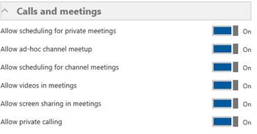

# <a name="configure-direct-routing"></a><span data-ttu-id="7e628-103">配置直接路由</span><span class="sxs-lookup"><span data-stu-id="7e628-103">Configure Direct Routing</span></span>

  > [!NOTE]
  > <span data-ttu-id="7e628-104">这是 Microsoft 电话系统直接路由的 preview 版本。</span><span class="sxs-lookup"><span data-stu-id="7e628-104">This is a preview release of Microsoft Phone System Direct Routing.</span></span>  <span data-ttu-id="7e628-105">产品功能和文档受到更改。</span><span class="sxs-lookup"><span data-stu-id="7e628-105">Product functionality and documentation are subject to change.</span></span>

<span data-ttu-id="7e628-106">如果您未阅读[规划直接路由](plan-direct-routing.md)必备组件并查看其他步骤您需要配置 Microsoft 电话系统网络之前执行。</span><span class="sxs-lookup"><span data-stu-id="7e628-106">If you have not already done so, read [Plan Direct Routing](plan-direct-routing.md) for prerequisites and to review  other steps you’ll need to take before you configure your Microsoft Phone System network.</span></span> 

  > [!NOTE]
  > <span data-ttu-id="7e628-107">本文档旨在为 IT 专业人员。</span><span class="sxs-lookup"><span data-stu-id="7e628-107">This document is intended for IT professionals.</span></span>  

<span data-ttu-id="7e628-108">本文介绍如何配置 Microsoft 电话系统直接路由。</span><span class="sxs-lookup"><span data-stu-id="7e628-108">This article describes how to configure Microsoft Phone System Direct Routing.</span></span> <span data-ttu-id="7e628-109">它详细说明如何配对对直接路由支持会话边界控制器 (SBC) 以及如何配置为使用直接路由连接到公共公用电话交换网 (PSTN) 的 Microsoft 团队用户。</span><span class="sxs-lookup"><span data-stu-id="7e628-109">It details how to pair a supported Session Border Controller (SBC) to Direct Routing and how to configure Microsoft Teams users to use Direct Routing to connect to the Public Switched Telephone Network (PSTN).</span></span> <span data-ttu-id="7e628-110">若要完成本文中介绍的步骤操作，管理员需要某些熟悉 PowerShell cmdlet。</span><span class="sxs-lookup"><span data-stu-id="7e628-110">To complete the steps explained in this article, administrators need some familiarity with PowerShell cmdlets.</span></span> <span data-ttu-id="7e628-111">有关使用 PowerShell 的详细信息，请参阅[Windows PowerShell 将计算机设置](https://technet.microsoft.com/library/dn362831.aspx)。</span><span class="sxs-lookup"><span data-stu-id="7e628-111">For more information about using PowerShell, see [Set up your computer for Windows PowerShell](https://technet.microsoft.com/library/dn362831.aspx).</span></span> 

<span data-ttu-id="7e628-112">我们建议您确认，您的 SBC 已配置为您的 SBC 供应商的推荐：</span><span class="sxs-lookup"><span data-stu-id="7e628-112">We recommend that you confirm that your SBC has already been configured as recommended by your SBC vendor's:</span></span> 

- <span data-ttu-id="7e628-113">AudioCodes 部署文档</span><span class="sxs-lookup"><span data-stu-id="7e628-113">AudioCodes deployment documentation</span></span> 
- <span data-ttu-id="7e628-114">功能区部署文档</span><span class="sxs-lookup"><span data-stu-id="7e628-114">Ribbon deployment documentation</span></span>

<span data-ttu-id="7e628-115">您可以配置 Microsoft 电话系统，并使用户能够使用直接路由，然后通过完成以下过程中设置为首选调用客户端的 Microsoft 团队：</span><span class="sxs-lookup"><span data-stu-id="7e628-115">You can configure your Microsoft Phone System and enable  users to use Direct Routing, then set up Microsoft Teams as the preferred calling client by completing the following procedures:</span></span> 

- [<span data-ttu-id="7e628-116">配对与 Microsoft 电话系统 SBC 和验证配对</span><span class="sxs-lookup"><span data-stu-id="7e628-116">Pair the SBC with a Microsoft Phone System and validate the pairing</span></span>](#pair-the-sbc-to-direct-routing-service-of-phone-system)
- [<span data-ttu-id="7e628-117">为用户启用直接路由服务</span><span class="sxs-lookup"><span data-stu-id="7e628-117">Enable users for Direct Routing Service</span></span>](#enable-users-for-direct-routing-service)
- [<span data-ttu-id="7e628-118">确保 Microsoft 团队是用户的首选呼叫客户端</span><span class="sxs-lookup"><span data-stu-id="7e628-118">Ensure that Microsoft Teams is the preferred calling client for the users</span></span>](#set-microsoft-teams-as-the-preferred-calling-client-for-the-users) 

## <a name="pair-the-sbc-to-direct-routing-service-of-phone-system"></a><span data-ttu-id="7e628-119">配对 SBC 定向电话系统的路由服务</span><span class="sxs-lookup"><span data-stu-id="7e628-119">Pair the SBC to Direct Routing Service of Phone System</span></span> 

<span data-ttu-id="7e628-120">让您连接，或配对，直接路由界面 SBC 的三个高级步骤如下：</span><span class="sxs-lookup"><span data-stu-id="7e628-120">The following are the three high-level steps to let you connect, or pair, the SBC to the Direct Routing interface:</span></span> 

- <span data-ttu-id="7e628-121">连接到使用 PowerShell **Skype 业务 online**管理中心</span><span class="sxs-lookup"><span data-stu-id="7e628-121">Connect to **Skype for Business Online** admin center using PowerShell</span></span> 
- <span data-ttu-id="7e628-122">对 SBC</span><span class="sxs-lookup"><span data-stu-id="7e628-122">Pair the SBC</span></span> 
- <span data-ttu-id="7e628-123">验证配对</span><span class="sxs-lookup"><span data-stu-id="7e628-123">Validate the pairing</span></span> 

### <a name="connect-to--skype-for-business-online-by-using-powershell"></a><span data-ttu-id="7e628-124">使用 PowerShell online 业务连接到 Skype</span><span class="sxs-lookup"><span data-stu-id="7e628-124">Connect to  Skype for Business Online by using PowerShell</span></span> 

<span data-ttu-id="7e628-125">您可以使用连接到租户 PowerShell 会话配对直接路由界面 SBC。</span><span class="sxs-lookup"><span data-stu-id="7e628-125">You can use a PowerShell session connected to the tenant to pair the SBC to the Direct Routing interface.</span></span> <span data-ttu-id="7e628-126">若要打开 PowerShell 会话，请按照中[设置您的计算机的 Windows PowerShell](https://technet.microsoft.com/library/dn362831.aspx)列出的步骤。</span><span class="sxs-lookup"><span data-stu-id="7e628-126">To open a PowerShell session, please follow the steps outlined in [Set up your computer for Windows PowerShell](https://technet.microsoft.com/library/dn362831.aspx).</span></span> 
 
<span data-ttu-id="7e628-127">您建立一个远程 PowerShell 会话后，请验证您可以看到这些命令以管理 SBC。</span><span class="sxs-lookup"><span data-stu-id="7e628-127">After you establish a remote PowerShell session, please validate that you can see the commands to manage the SBC.</span></span> <span data-ttu-id="7e628-128">若要验证命令，键入或复制/粘贴在下面的示例 PowerShell 会话中，按 Enter:</span><span class="sxs-lookup"><span data-stu-id="7e628-128">To validate the commands, type or copy/paste in the following in the PowerShell session and press Enter:</span></span> 

```
gcm *onlinePSTNGateway*
```

<span data-ttu-id="7e628-129">您的命令将返回如下所示，将允许您管理 SBCs 的四个功能。</span><span class="sxs-lookup"><span data-stu-id="7e628-129">Your command will return the four functions shown here that will let you manage the SBCs.</span></span> 

```
CommandType    Name                       Version    Source 
-----------    ----                       -------    ------ 
Function       Get-CsOnlinePSTNGateway    1.0        tmp_v5fiu1no.wxt 
Function       New-CsOnlinePSTNGateway    1.0        tmp_v5fiu1no.wxt 
Function       Remove-CsOnlinePSTNGateway 1.0        tmp_v5fiu1no.wxt 
Function       Set-CsOnlinePSTNGateway    1.0        tmp_v5fiu1no.wxt
```   


### <a name="pair-the-sbc-to-the-tenant"></a><span data-ttu-id="7e628-130">对到租户 SBC</span><span class="sxs-lookup"><span data-stu-id="7e628-130">Pair the SBC to the tenant</span></span> 

<span data-ttu-id="7e628-131">若要对到租户 SBC，PowerShell 会话中键入以下命令，并按 Enter:</span><span class="sxs-lookup"><span data-stu-id="7e628-131">To pair the SBC to the tenant, in the PowerShell session type the following and press Enter:</span></span> 

```
New-CsOnlinePSTNGateway -Fqdn <SBC FQDN> -SipSignallingPort <SBC SIP Port> -MaxConcurrentSessions <Max Concurrent Sessions the SBC can handle> -Enabled $true 
```
  > [!NOTE]
  > 1. <span data-ttu-id="7e628-132">我们强烈建议 SBC，设置限制使用可以找到 SBC 文档中的信息。</span><span class="sxs-lookup"><span data-stu-id="7e628-132">We highly recommend setting a limit for the SBC, using information that can be found in the SBC documentation.</span></span> <span data-ttu-id="7e628-133">如果 SBC 处于容量级别限制将触发通知。</span><span class="sxs-lookup"><span data-stu-id="7e628-133">The limit will trigger a notification if SBC is at the capacity level.</span></span>
  > 2. <span data-ttu-id="7e628-134">您可以仅配对的 FQDN，其中名称的域部分匹配一个除在您的租户中注册的域与 SBC \*。 onmicrosoft.com。使用\*。 omicrosoft.com 域名不支持的 SBC FQDN 名称。</span><span class="sxs-lookup"><span data-stu-id="7e628-134">You can only pair the SBC with FQDN, where the domain portion of the name matches one of the domains registered in your tenant, except \*.onmicrosoft.com. Using \*.omicrosoft.com domain names is not supported for the SBC FQDN names.</span></span> <span data-ttu-id="7e628-135">例如，如果您有两个域名：</span><span class="sxs-lookup"><span data-stu-id="7e628-135">For example, if you have two domain names:</span></span><br/><br/>
  > <span data-ttu-id="7e628-136">**abc**.xyz</span><span class="sxs-lookup"><span data-stu-id="7e628-136">**abc**.xyz</span></span><br/><span data-ttu-id="7e628-137">**abc**。 onmicrosoft.com</span><span class="sxs-lookup"><span data-stu-id="7e628-137">**abc**.onmicrosoft.com</span></span><br/><br/>
  > <span data-ttu-id="7e628-138">SBC 名称，您可以使用名称 sbc.abc.xyz。</span><span class="sxs-lookup"><span data-stu-id="7e628-138">For the SBC name, you can use the name sbc.abc.xyz.</span></span> <span data-ttu-id="7e628-139">如果您尝试配对名称 sbc.xyz.abc 与 SBC，系统将不允许您，如此租户不属于域。</span><span class="sxs-lookup"><span data-stu-id="7e628-139">If you try to pair the SBC with a name sbc.xyz.abc, the system will not let you, as the domain is not owned by this tenant.</span></span>

```
New-CsOnlinePSTNGateway -Identity sbc.contoso.com -Enabled $true -SipSignallingPort 5067 -MaxConcurrentSessions 100 
```
<span data-ttu-id="7e628-140">返回：</span><span class="sxs-lookup"><span data-stu-id="7e628-140">Returns:</span></span>
``` 
Identity              : sbc.contoso.com 
Fqdn                  : sbc.contoso.com 
SipSignallingPort     : 5067 
FailoverTimeSeconds   : 10 
ForwardCallHistory    : False 
ForwardPai            : False 
SendSipOptions        : True 
MaxConcurrentSessions : 100 
Enabled               : True   
```
<span data-ttu-id="7e628-141">还有其他可在配对设置的选项。</span><span class="sxs-lookup"><span data-stu-id="7e628-141">There are additional options that can be set during the pairing.</span></span> <span data-ttu-id="7e628-142">在上面的示例中，但是，仅的最低要求参数所示。</span><span class="sxs-lookup"><span data-stu-id="7e628-142">In the previous example, however, only the minimum required parameters are shown.</span></span> 
 
<span data-ttu-id="7e628-143">下表列出了您可以设置的*新建 CsOnlinePstnGateway*参数中使用的其他参数。</span><span class="sxs-lookup"><span data-stu-id="7e628-143">The following table lists the additional parameters that you can use in setting parameters for *New-CsOnlinePstnGateway*.</span></span> 

|<span data-ttu-id="7e628-144">**必填？**</span><span class="sxs-lookup"><span data-stu-id="7e628-144">**Required?**</span></span>|<span data-ttu-id="7e628-145">**名称** - 按 WAN 链路进行筛选（筛选器位于图形右侧）。</span><span class="sxs-lookup"><span data-stu-id="7e628-145">**Name**</span></span>|<span data-ttu-id="7e628-146">**说明**</span><span class="sxs-lookup"><span data-stu-id="7e628-146">**Description**</span></span>|<span data-ttu-id="7e628-147">**默认**</span><span class="sxs-lookup"><span data-stu-id="7e628-147">**Default**</span></span>|<span data-ttu-id="7e628-148">**可能的值**</span><span class="sxs-lookup"><span data-stu-id="7e628-148">**Possible values**</span></span>|<span data-ttu-id="7e628-149">**类型和限制**</span><span class="sxs-lookup"><span data-stu-id="7e628-149">**Type and restrictions**</span></span>|
|:-----|:-----|:-----|:-----|:-----|:-----|
|<span data-ttu-id="7e628-150">是</span><span class="sxs-lookup"><span data-stu-id="7e628-150">Yes</span></span>|<span data-ttu-id="7e628-151">FQDN</span><span class="sxs-lookup"><span data-stu-id="7e628-151">FQDN</span></span>|<span data-ttu-id="7e628-152">SBC 的 FQDN 名称</span><span class="sxs-lookup"><span data-stu-id="7e628-152">The FQDN name of the SBC</span></span> |<span data-ttu-id="7e628-153">无</span><span class="sxs-lookup"><span data-stu-id="7e628-153">None</span></span>|<span data-ttu-id="7e628-154">NoneFQDN 名称，限制 63 个字符</span><span class="sxs-lookup"><span data-stu-id="7e628-154">NoneFQDN name, limit 63 characters</span></span>|<span data-ttu-id="7e628-155">字符串，在[Active Directory 中的计算机、 域、 站点和 Ou 中的命名约定](https://support.microsoft.com/en-us/help/909264)的允许和禁止字符的列表</span><span class="sxs-lookup"><span data-stu-id="7e628-155">String,  list of allowed and disallowed characters on [Naming conventions in Active Directory for computers, domains, sites, and OUs](https://support.microsoft.com/en-us/help/909264)</span></span>|
|<span data-ttu-id="7e628-156">否</span><span class="sxs-lookup"><span data-stu-id="7e628-156">No</span></span>|<span data-ttu-id="7e628-157">MediaBypass</span><span class="sxs-lookup"><span data-stu-id="7e628-157">MediaBypass</span></span> |<span data-ttu-id="7e628-158">参数留作将来使用。</span><span class="sxs-lookup"><span data-stu-id="7e628-158">The parameter reserved for future use.</span></span> <span data-ttu-id="7e628-159">参数指示的 SBC 支持媒体绕过功能，管理员希望使用它。</span><span class="sxs-lookup"><span data-stu-id="7e628-159">Parameter indicated of the SBC supports Media Bypass and the administrator wants to use it.</span></span>|<span data-ttu-id="7e628-160">无</span><span class="sxs-lookup"><span data-stu-id="7e628-160">None</span></span>|<span data-ttu-id="7e628-161">True</span><span class="sxs-lookup"><span data-stu-id="7e628-161">True</span></span><br/><span data-ttu-id="7e628-162">False</span><span class="sxs-lookup"><span data-stu-id="7e628-162">False</span></span>|<span data-ttu-id="7e628-163">布尔值</span><span class="sxs-lookup"><span data-stu-id="7e628-163">Boolean</span></span>|
|<span data-ttu-id="7e628-164">是</span><span class="sxs-lookup"><span data-stu-id="7e628-164">Yes</span></span>|<span data-ttu-id="7e628-165">SipSignallingPort</span><span class="sxs-lookup"><span data-stu-id="7e628-165">SipSignallingPort</span></span> |<span data-ttu-id="7e628-166">用于与直接路由服务通信使用的传输层安全性 (TLS) 协议的侦听端口。</span><span class="sxs-lookup"><span data-stu-id="7e628-166">Listening port used for communicating with Direct Routing services by using the Transport Layer Security (TLS) protocol.</span></span>|<span data-ttu-id="7e628-167">无</span><span class="sxs-lookup"><span data-stu-id="7e628-167">None</span></span>|<span data-ttu-id="7e628-168">任何端口</span><span class="sxs-lookup"><span data-stu-id="7e628-168">Any port</span></span>|<span data-ttu-id="7e628-169">0 到 65535</span><span class="sxs-lookup"><span data-stu-id="7e628-169">0 to 65535</span></span> |
|<span data-ttu-id="7e628-170">否</span><span class="sxs-lookup"><span data-stu-id="7e628-170">No</span></span>|<span data-ttu-id="7e628-171">FailoverTimeSeconds</span><span class="sxs-lookup"><span data-stu-id="7e628-171">FailoverTimeSeconds</span></span> |<span data-ttu-id="7e628-172">如果设置为 10 （默认值），在 10 秒内未应答，网关的出站呼叫路由至下一个可用中继;如果不有任何其他的中继，则自动丢弃该呼叫。</span><span class="sxs-lookup"><span data-stu-id="7e628-172">When set to 10 (default value), outbound calls that are not answered by the gateway within 10 seconds are routed to the next available trunk; if there are no additional trunks, then the call is automatically dropped.</span></span> <span data-ttu-id="7e628-173">在网络和网关响应缓慢的组织中，这可能导致不必要地丢弃呼叫。</span><span class="sxs-lookup"><span data-stu-id="7e628-173">In an organization with slow networks and gateway responses, that could potentially result in calls being dropped unnecessarily.</span></span> <span data-ttu-id="7e628-174">默认值为 10。</span><span class="sxs-lookup"><span data-stu-id="7e628-174">The default value is 10.</span></span>|<span data-ttu-id="7e628-175">10</span><span class="sxs-lookup"><span data-stu-id="7e628-175">10</span></span>|<span data-ttu-id="7e628-176">数字</span><span class="sxs-lookup"><span data-stu-id="7e628-176">Number</span></span>|<span data-ttu-id="7e628-177">Int</span><span class="sxs-lookup"><span data-stu-id="7e628-177">Int</span></span>|
|<span data-ttu-id="7e628-178">否</span><span class="sxs-lookup"><span data-stu-id="7e628-178">No</span></span>|<span data-ttu-id="7e628-179">ForwardCallHistory</span><span class="sxs-lookup"><span data-stu-id="7e628-179">ForwardCallHistory</span></span> |<span data-ttu-id="7e628-180">指示是否通过中继转移呼叫历史记录信息。</span><span class="sxs-lookup"><span data-stu-id="7e628-180">Indicates whether call history information will be forwarded through the trunk.</span></span> <span data-ttu-id="7e628-181">如果启用，Office 365 PSTN 代理发送两个标头： 历史记录信息和推荐者。</span><span class="sxs-lookup"><span data-stu-id="7e628-181">If enabled, the Office 365 PSTN Proxy sends two headers: History-info and Referred-By.</span></span> <span data-ttu-id="7e628-182">默认值为**False** ($False)。</span><span class="sxs-lookup"><span data-stu-id="7e628-182">The default value is **False** ($False).</span></span> |<span data-ttu-id="7e628-183">False</span><span class="sxs-lookup"><span data-stu-id="7e628-183">False</span></span>|<span data-ttu-id="7e628-184">True</span><span class="sxs-lookup"><span data-stu-id="7e628-184">True</span></span><br/><span data-ttu-id="7e628-185">False</span><span class="sxs-lookup"><span data-stu-id="7e628-185">False</span></span>|<span data-ttu-id="7e628-186">布尔值</span><span class="sxs-lookup"><span data-stu-id="7e628-186">Boolean</span></span>|
|<span data-ttu-id="7e628-187">否</span><span class="sxs-lookup"><span data-stu-id="7e628-187">No</span></span>|<span data-ttu-id="7e628-188">ForwardPAI</span><span class="sxs-lookup"><span data-stu-id="7e628-188">ForwardPAI</span></span>|<span data-ttu-id="7e628-189">指示 P-Asserted-Identity (PAI) 标头是否随呼叫一起转移。</span><span class="sxs-lookup"><span data-stu-id="7e628-189">Indicates whether the P-Asserted-Identity (PAI) header will be forwarded along with the call.</span></span> <span data-ttu-id="7e628-190">PAI 标头提供验证呼叫者身份的方法。</span><span class="sxs-lookup"><span data-stu-id="7e628-190">The PAI header provides a way to verify the identity of the caller.</span></span> <span data-ttu-id="7e628-191">默认值为**False** ($False)。</span><span class="sxs-lookup"><span data-stu-id="7e628-191">The default value is **False** ($False).</span></span>|<span data-ttu-id="7e628-192">False</span><span class="sxs-lookup"><span data-stu-id="7e628-192">False</span></span>|<span data-ttu-id="7e628-193">True</span><span class="sxs-lookup"><span data-stu-id="7e628-193">True</span></span><br/><span data-ttu-id="7e628-194">False</span><span class="sxs-lookup"><span data-stu-id="7e628-194">False</span></span>|<span data-ttu-id="7e628-195">布尔值</span><span class="sxs-lookup"><span data-stu-id="7e628-195">Boolean</span></span>|
|<span data-ttu-id="7e628-196">否</span><span class="sxs-lookup"><span data-stu-id="7e628-196">No</span></span>|<span data-ttu-id="7e628-197">SendSIPOptions</span><span class="sxs-lookup"><span data-stu-id="7e628-197">SendSIPOptions</span></span> |<span data-ttu-id="7e628-198">定义如果 SBC 将或将不会发送 SIP 选项。</span><span class="sxs-lookup"><span data-stu-id="7e628-198">Defines if an SBC will or will not send the SIP options.</span></span> <span data-ttu-id="7e628-199">如果禁用，将从监控和警报系统中排除 SBC。</span><span class="sxs-lookup"><span data-stu-id="7e628-199">If disabled, the SBC will be excluded from Monitoring and Alerting system.</span></span> <span data-ttu-id="7e628-200">我们强烈建议您启用 SIP 选项。</span><span class="sxs-lookup"><span data-stu-id="7e628-200">We highly recommend that you enable SIP options.</span></span> <span data-ttu-id="7e628-201">默认值为**True**。</span><span class="sxs-lookup"><span data-stu-id="7e628-201">Default value is **True**.</span></span> |<span data-ttu-id="7e628-202">True</span><span class="sxs-lookup"><span data-stu-id="7e628-202">True</span></span>|<span data-ttu-id="7e628-203">True</span><span class="sxs-lookup"><span data-stu-id="7e628-203">True</span></span><br/><span data-ttu-id="7e628-204">False</span><span class="sxs-lookup"><span data-stu-id="7e628-204">False</span></span>|<span data-ttu-id="7e628-205">布尔值</span><span class="sxs-lookup"><span data-stu-id="7e628-205">Boolean</span></span>|
|<span data-ttu-id="7e628-206">否</span><span class="sxs-lookup"><span data-stu-id="7e628-206">No</span></span>|<span data-ttu-id="7e628-207">MaxConcurrentSessions</span><span class="sxs-lookup"><span data-stu-id="7e628-207">MaxConcurrentSessions</span></span> |<span data-ttu-id="7e628-208">使用警报系统。</span><span class="sxs-lookup"><span data-stu-id="7e628-208">Used by alerting system.</span></span> <span data-ttu-id="7e628-209">90%的并发会话数时警报系统时设置的任何值，将生成向租户管理员警报或高于此值。</span><span class="sxs-lookup"><span data-stu-id="7e628-209">When any value is set, the alerting system will generate an alert to the tenant administrator when the number of concurrent session is 90% or higher than this value.</span></span> <span data-ttu-id="7e628-210">如果未设置参数，则不会生成通知。</span><span class="sxs-lookup"><span data-stu-id="7e628-210">If parameter is not set, the alerts are not generated.</span></span> <span data-ttu-id="7e628-211">但是，监视系统将报告并发会话每 24 小时的数。</span><span class="sxs-lookup"><span data-stu-id="7e628-211">However, the monitoring system will report number of concurrent session every 24 hours.</span></span> |<span data-ttu-id="7e628-212">Null</span><span class="sxs-lookup"><span data-stu-id="7e628-212">Null</span></span>|<span data-ttu-id="7e628-213">Null</span><span class="sxs-lookup"><span data-stu-id="7e628-213">Null</span></span><br/><span data-ttu-id="7e628-214">1 至 100,000</span><span class="sxs-lookup"><span data-stu-id="7e628-214">1 to 100,000</span></span> ||
|<span data-ttu-id="7e628-215">否</span><span class="sxs-lookup"><span data-stu-id="7e628-215">No</span></span>|<span data-ttu-id="7e628-216">启用 \*</span><span class="sxs-lookup"><span data-stu-id="7e628-216">Enabled\*</span></span>|<span data-ttu-id="7e628-217">用于启用出站呼叫的此 SBC。</span><span class="sxs-lookup"><span data-stu-id="7e628-217">Used to enable this SBC for outbound calls.</span></span> <span data-ttu-id="7e628-218">可用于时正在更新或维护期间中临时删除 SBC。</span><span class="sxs-lookup"><span data-stu-id="7e628-218">Can be used to temporarily remove the SBC, while it is being updated or during maintenance.</span></span> |<span data-ttu-id="7e628-219">False</span><span class="sxs-lookup"><span data-stu-id="7e628-219">False</span></span>|<span data-ttu-id="7e628-220">True</span><span class="sxs-lookup"><span data-stu-id="7e628-220">True</span></span><br/><span data-ttu-id="7e628-221">False</span><span class="sxs-lookup"><span data-stu-id="7e628-221">False</span></span>|<span data-ttu-id="7e628-222">布尔值</span><span class="sxs-lookup"><span data-stu-id="7e628-222">Boolean</span></span>|
 
### <a name="verify-the-sbc-pairing"></a><span data-ttu-id="7e628-223">验证 SBC 配对</span><span class="sxs-lookup"><span data-stu-id="7e628-223">Verify the SBC pairing</span></span> 

<span data-ttu-id="7e628-224">验证连接：</span><span class="sxs-lookup"><span data-stu-id="7e628-224">Verify the connection:</span></span> 
- <span data-ttu-id="7e628-225">检查 SBC 是否在列表中的配对 SBCs。</span><span class="sxs-lookup"><span data-stu-id="7e628-225">Check if the SBC is on the list of paired SBCs.</span></span> 
- <span data-ttu-id="7e628-226">验证 SIP 选项。</span><span class="sxs-lookup"><span data-stu-id="7e628-226">Validate SIP Options.</span></span> 
 
#### <a name="validate-if-sbc-is-on-the-list-of-paired-sbcs"></a><span data-ttu-id="7e628-227">验证 SBC 是否在列表中的配对的 Sbc</span><span class="sxs-lookup"><span data-stu-id="7e628-227">Validate if SBC is on the list of paired SBCs</span></span> 

<span data-ttu-id="7e628-228">对 SBC 后，验证 SBC 存在于列表中的配对 SBCs 通过远程 PowerShell 会话中运行以下命令：`Get-CSOnlinePSTNGateway`</span><span class="sxs-lookup"><span data-stu-id="7e628-228">After you pair the SBC, validate that the SBC is present in the list of paired SBCs by running the following command  in a remote PowerShell session: `Get-CSOnlinePSTNGateway`</span></span>

<span data-ttu-id="7e628-229">配对的网关应显示在列表中，如下面的示例中所示，并验证参数*启用*显示值**True**。</span><span class="sxs-lookup"><span data-stu-id="7e628-229">The paired gateway should appear in the list as shown in the example below, and verify that the parameter *Enabled* displays the value **True**.</span></span> <span data-ttu-id="7e628-230">输入：</span><span class="sxs-lookup"><span data-stu-id="7e628-230">Enter:</span></span>

```
Get-CsOnlinePSTNGateway -Identity sbc.contoso.com  
```
<span data-ttu-id="7e628-231">返回结果：</span><span class="sxs-lookup"><span data-stu-id="7e628-231">Which returns:</span></span>
``` 
Identity              : sbc.contoso.com  
Fqdn                  : sbc.contoso.com 
SipSignallingPort     : 5067 
CodecPriority         : SILKWB,SILKNB,PCMU,PCMA 
ExcludedCodecs        :  
FailoverTimeSeconds   : 10 
ForwardCallHistory    : False 
ForwardPai            : False 
SendSipOptions        : True 
MaxConcurrentSessions : 100 
Enabled               : True 
```

#### <a name="validate-sip-options-flow"></a><span data-ttu-id="7e628-232">验证 SIP Options 流</span><span class="sxs-lookup"><span data-stu-id="7e628-232">Validate SIP Options flow</span></span> 

<span data-ttu-id="7e628-233">要验证配对使用传出 SIP 选项，请使用 SBC 管理接口，并请参阅 SBC 获取 200 OK 响应的传出 OPTIONS。</span><span class="sxs-lookup"><span data-stu-id="7e628-233">To validate the pairing using outgoing SIP Options, use the SBC management interface and see that the SBC get 200 OK responses to the outgoing OPTIONS.</span></span>
  
<span data-ttu-id="7e628-234">当直接路由中看到传入的选项时，则它将启动向传入选项消息中的联系人标头字段中配置的 SBC FQDN 发送传出 options。</span><span class="sxs-lookup"><span data-stu-id="7e628-234">When Direct Routing sees incoming OPTIONS, it will start sending outgoing options to the SBC FQDN configured in the Contact header field in the incoming OPTIONS message.</span></span> 

<span data-ttu-id="7e628-235">要验证配对使用传入 SIP 选项，请使用 SBC 管理接口，并查看 SBC 直接路由从传入 OPTIONS 消息上获取答复和响应代码是 200 确定。</span><span class="sxs-lookup"><span data-stu-id="7e628-235">To validate the pairing using incoming SIP Options, use the SBC management interface and see that the SBC gets reply on the OPTIONS messages coming in from Direct Routing and that the response code is 200 OK.</span></span>  

## <a name="enable-users-for-direct-routing-service"></a><span data-ttu-id="7e628-236">为用户启用直接路由服务</span><span class="sxs-lookup"><span data-stu-id="7e628-236">Enable users for Direct Routing Service</span></span> 

<span data-ttu-id="7e628-237">已准备好启用用户直接路由服务，请按照下列步骤：</span><span class="sxs-lookup"><span data-stu-id="7e628-237">When you are ready to enable users for the Direct Routing Service, follow these steps:</span></span> 

1. <span data-ttu-id="7e628-238">Office 365 中创建用户和分配电话系统许可证。</span><span class="sxs-lookup"><span data-stu-id="7e628-238">Create a user in Office 365 and assign a phone system license.</span></span> 
2. <span data-ttu-id="7e628-239">确保业务 online 用户驻留在 Skype。</span><span class="sxs-lookup"><span data-stu-id="7e628-239">Ensure that the user is homed in Skype for Business Online.</span></span> 
3. <span data-ttu-id="7e628-240">配置的电话号码并启用企业语音和语音邮件。</span><span class="sxs-lookup"><span data-stu-id="7e628-240">Configure the phone number and enable enterprise voice and voicemail.</span></span> 
4. <span data-ttu-id="7e628-241">配置语音路由。</span><span class="sxs-lookup"><span data-stu-id="7e628-241">Configure voice routing.</span></span> <span data-ttu-id="7e628-242">自动验证路由。</span><span class="sxs-lookup"><span data-stu-id="7e628-242">The route is automatically validated.</span></span>  

### <a name="create-a-user-in-office-365-and-assign-the-license"></a><span data-ttu-id="7e628-243">在 Office 365 中创建用户和分配许可证</span><span class="sxs-lookup"><span data-stu-id="7e628-243">Create a user in Office 365 and assign the license</span></span> 

<span data-ttu-id="7e628-244">有两个选项的 Office 365 中创建新用户。</span><span class="sxs-lookup"><span data-stu-id="7e628-244">There are two options for creating a new user in Office 365.</span></span> <span data-ttu-id="7e628-245">但是，我们建议您的组织选择和使用一个选项以避免路由问题：</span><span class="sxs-lookup"><span data-stu-id="7e628-245">However, we recommend that your organization select and use one option to avoid routing issues:</span></span> 

- <span data-ttu-id="7e628-246">内部部署 Active Directory 中创建用户和同步到云用户。</span><span class="sxs-lookup"><span data-stu-id="7e628-246">Create the user in on-premise Active Directory and sync the user to the cloud.</span></span> <span data-ttu-id="7e628-247">请参阅[Azure Active Directory 集成本地目录](https://docs.microsoft.com/en-us/azure/active-directory/connect/active-directory-aadconnect)。</span><span class="sxs-lookup"><span data-stu-id="7e628-247">See [Integrate your on-premises directories with Azure Active Directory](https://docs.microsoft.com/en-us/azure/active-directory/connect/active-directory-aadconnect).</span></span>  
- <span data-ttu-id="7e628-248">直接在 Office 365 管理门户中创建用户。</span><span class="sxs-lookup"><span data-stu-id="7e628-248">Create the user directly in the Office 365 Administrator Portal.</span></span> <span data-ttu-id="7e628-249">请参阅[添加用户单独或到 Office 365-批量管理帮助](https://support.office.com/en-us/article/Add-users-individually-or-in-bulk-to-Office-365-Admin-Help-1970f7d6-03b5-442f-b385-5880b9c256ec)。</span><span class="sxs-lookup"><span data-stu-id="7e628-249">See [Add users individually or in bulk to Office 365 - Admin Help](https://support.office.com/en-us/article/Add-users-individually-or-in-bulk-to-Office-365-Admin-Help-1970f7d6-03b5-442f-b385-5880b9c256ec).</span></span> 

  <span data-ttu-id="7e628-250">如果生成与业务 2015年或 Lync 2010/2013年内部部署的 Skype 共存的系统，仅受支持的选项是在本地 Active Directory 中创建用户并同步到云 (选项 1) 的用户。</span><span class="sxs-lookup"><span data-stu-id="7e628-250">If you build the system that co-exists with Skype for Business 2015 or Lync 2010/2013 on-premises, the only supported option is to create the user in on-premises Active Directory and sync the user to the cloud (Option 1).</span></span> 

<span data-ttu-id="7e628-251">必需的许可证：</span><span class="sxs-lookup"><span data-stu-id="7e628-251">Required licenses:</span></span> 

- <span data-ttu-id="7e628-252">Office 365 企业版 E3 （包括 SfB Plan2、 Exchange Plan2 和团队） + 电话系统</span><span class="sxs-lookup"><span data-stu-id="7e628-252">Office 365 Enterprise E3 (including SfB Plan2, Exchange Plan2, and Teams) + Phone System</span></span>  
- <span data-ttu-id="7e628-253">Office 365 企业 E5 （包括 SfB Plan2、 Exchange Plan2、 团队和电话系统）</span><span class="sxs-lookup"><span data-stu-id="7e628-253">Office 365 Enterprise E5  (including SfB Plan2, Exchange Plan2, Teams, and Phone System)</span></span> 

<span data-ttu-id="7e628-254">可选许可证：</span><span class="sxs-lookup"><span data-stu-id="7e628-254">Optional licenses:</span></span> 

- <span data-ttu-id="7e628-255">调用计划</span><span class="sxs-lookup"><span data-stu-id="7e628-255">Calling Plan</span></span> 
- <span data-ttu-id="7e628-256">音频会议</span><span class="sxs-lookup"><span data-stu-id="7e628-256">Audio Conferencing</span></span> 

### <a name="ensure-that-the-user-is-homed-in-skype-for-business-online"></a><span data-ttu-id="7e628-257">确保业务 online 用户驻留在 Skype</span><span class="sxs-lookup"><span data-stu-id="7e628-257">Ensure that the user is homed in Skype for Business Online</span></span> 

<span data-ttu-id="7e628-258">直接路由，要求用户为业务 Online Skype 托管。</span><span class="sxs-lookup"><span data-stu-id="7e628-258">Direct Routing requires the user to be homed in Skype for Business Online.</span></span> <span data-ttu-id="7e628-259">您可以检查这看 RegistrarPool 参数。</span><span class="sxs-lookup"><span data-stu-id="7e628-259">You can check this by looking at the RegistrarPool parameter.</span></span> <span data-ttu-id="7e628-260">它需要 infra.lync.com 域中有一个值。</span><span class="sxs-lookup"><span data-stu-id="7e628-260">It needs to have a value in the infra.lync.com domain.</span></span>

1. <span data-ttu-id="7e628-261">连接到远程 PowerShell。</span><span class="sxs-lookup"><span data-stu-id="7e628-261">Connect to remote PowerShell.</span></span>
2. <span data-ttu-id="7e628-262">发出命令：</span><span class="sxs-lookup"><span data-stu-id="7e628-262">Issue the command:</span></span> 

```
Get-CsOnlineUser -Identity "<User name>" | fl RegistrarPool
``` 

### <a name="configure-the-phone-number-and-enable-enterprise-voice-and-voicemail"></a><span data-ttu-id="7e628-263">配置的电话号码和启用企业语音和语音邮件</span><span class="sxs-lookup"><span data-stu-id="7e628-263">Configure the phone number and enable enterprise voice and voicemail</span></span> 

<span data-ttu-id="7e628-264">您已创建用户和分配许可证后下, 一步是配置他们的电话号码和语音邮件。</span><span class="sxs-lookup"><span data-stu-id="7e628-264">After you have created the user and assigned a license, the next step is to configure their phone number and voicemail.</span></span> <span data-ttu-id="7e628-265">进行这种一个步骤。</span><span class="sxs-lookup"><span data-stu-id="7e628-265">This can be done in one step.</span></span> 

<span data-ttu-id="7e628-266">若要添加的电话号码，并启用语音邮件：</span><span class="sxs-lookup"><span data-stu-id="7e628-266">To add the phone number and enable for voicemail:</span></span>
 
1. <span data-ttu-id="7e628-267">连接到远程 PowerShell 会话。</span><span class="sxs-lookup"><span data-stu-id="7e628-267">Connect to a remote PowerShell session.</span></span> 
2. <span data-ttu-id="7e628-268">输入命令：</span><span class="sxs-lookup"><span data-stu-id="7e628-268">Enter the command:</span></span> 
    
```
Set-CsUser -Identity "<User name>" -EnterpriseVoiceEnabled $true -HostedVoiceMail $true -OnPremLineURI tel:+ phone number
```

<span data-ttu-id="7e628-269">例如，若要添加的用户"Spencer 低"的电话号码，您可输入下列：</span><span class="sxs-lookup"><span data-stu-id="7e628-269">For example, to add a phone number for user “Spencer Low,” you would enter the following:</span></span> 

```
Set-CsUser - “Spencer Low" -OnPremisLineURI tel:+14255388797 -EnterpriseVoiceEnabled $true -HostedVoiceMail $true
```

<span data-ttu-id="7e628-270">使用的电话号码必须配置为完整的 E.164 电话号码与国家/地区代码。</span><span class="sxs-lookup"><span data-stu-id="7e628-270">The phone number used has to be configured as a full E.164 phone number with country code.</span></span> 

  > [!NOTE]
  > <span data-ttu-id="7e628-271">如果在本地管理用户的电话号码，使用内部部署 Skype 业务命令行管理程序或控制面板配置用户的电话号码。</span><span class="sxs-lookup"><span data-stu-id="7e628-271">If the user’s phone number is managed on premises, use on-premises Skype for Business Management Shell or Control Panel to configure the user's phone number.</span></span> 

### <a name="configure-voice-routing"></a><span data-ttu-id="7e628-272">配置语音路由</span><span class="sxs-lookup"><span data-stu-id="7e628-272">Configure Voice Routing</span></span> 

<span data-ttu-id="7e628-273">Microsoft 电话系统具有可以将呼叫发送给基于特定 SBC 路由机制：</span><span class="sxs-lookup"><span data-stu-id="7e628-273">Microsoft Phone System has a routing mechanism that allows a call to be sent to a specific SBC based on:</span></span> 

- <span data-ttu-id="7e628-274">呼叫的号码模式</span><span class="sxs-lookup"><span data-stu-id="7e628-274">Called number pattern</span></span> 
- <span data-ttu-id="7e628-275">呼叫的号码模式 + 调用的特定用户</span><span class="sxs-lookup"><span data-stu-id="7e628-275">Called number pattern + Specific User who makes the call</span></span>
 
<span data-ttu-id="7e628-276">Sbc 可以被指定为活动状态且备份。</span><span class="sxs-lookup"><span data-stu-id="7e628-276">SBCs can be designated as active and backup.</span></span> <span data-ttu-id="7e628-277">这意味着当配置为此号码模式或号码模式 + 特定用户活动 SBC 不可用，然后呼叫将路由至备份 SBC。</span><span class="sxs-lookup"><span data-stu-id="7e628-277">That means when the SBC that is configured as active for this number pattern, or number pattern + specific user, is not available, then the calls will be routed to a backup SBC.</span></span>
 
<span data-ttu-id="7e628-278">呼叫路由组成的以下元素：</span><span class="sxs-lookup"><span data-stu-id="7e628-278">Call routing is made up of the following elements:</span></span> 
- <span data-ttu-id="7e628-279">语音路由策略 – 容器的 PSTN 用法;可分配给用户或多个用户</span><span class="sxs-lookup"><span data-stu-id="7e628-279">Voice Routing Policy – container for PSTN Usages; can be assigned to a user or to multiple users</span></span> 
- <span data-ttu-id="7e628-280">PSTN 用法 – 语音路由和 PSTN 用法; 容器可以共享在不同的语音路由策略</span><span class="sxs-lookup"><span data-stu-id="7e628-280">PSTN Usages – container for Voice Routes and PSTN Usages; can be shared in different Voice Routing Policies</span></span> 
- <span data-ttu-id="7e628-281">语音路由 – 号码模式和联机 PSTN 网关，以用于呼叫其中号码匹配模式的设置</span><span class="sxs-lookup"><span data-stu-id="7e628-281">Voice Routes – number pattern and set of Online PSTN Gateways to use for calls where calling number matches the pattern</span></span> 
- <span data-ttu-id="7e628-282">联机 PSTN 网关-指针位于 SBC，还会存储通过 SBC，如转发 P 已断言标识 (PAI) 或首选的编解码器; 发出呼叫时应用的配置可以添加到语音路由</span><span class="sxs-lookup"><span data-stu-id="7e628-282">Online PSTN Gateway - pointer at SBC, also stores the configuration that is applied when call is placed via the SBC, such as forward P-Asserted-Identity (PAI) or Preferred Codecs; can be added to Voice Routes</span></span> 

#### <a name="creating-a-voice-routing-policy-with-one-pstn-usage"></a><span data-ttu-id="7e628-283">使用一个 PSTN 用法创建语音路由策略</span><span class="sxs-lookup"><span data-stu-id="7e628-283">Creating a voice routing policy with one PSTN Usage</span></span> 

<span data-ttu-id="7e628-284">下图显示呼叫流中的语音路由策略的两个示例。</span><span class="sxs-lookup"><span data-stu-id="7e628-284">The following diagram shows two examples of voice routing policies in call flow.</span></span>

<span data-ttu-id="7e628-285">**（左侧） 呼叫流 1:** 如果用户选择调用 +1 425 XXX XX XX 或 +1 206 XXX XX XX，将该呼叫路由至 SBC sbc1<span></span>。 contoso.biz 或 sbc2<span></span>。 contoso.biz。</span><span class="sxs-lookup"><span data-stu-id="7e628-285">**Call Flow 1 (on the left):** If a user makes a call to  +1 425 XXX XX XX or +1 206 XXX XX XX, the call is routed  to SBC sbc1<span></span>.contoso.biz or sbc2<span></span>.contoso.biz.</span></span> <span data-ttu-id="7e628-286">如果既 sbc1<span></span>。 contoso.biz 也 sbc2<span></span>。 contoso.biz 可用，将断开呼叫。</span><span class="sxs-lookup"><span data-stu-id="7e628-286">If neither sbc1<span></span>.contoso.biz nor sbc2<span></span>.contoso.biz are available, the call is dropped.</span></span> 

<span data-ttu-id="7e628-287">**（在右侧） 呼叫流 2:** 如果用户选择调用 +1 425 XXX XX XX 或 +1 206 XXX XX XX，呼叫首先路由至 SBC sbc1<span></span>。 contoso.biz 或 sbc2<span></span>。 contoso.biz。</span><span class="sxs-lookup"><span data-stu-id="7e628-287">**Call Flow 2 (on the right):** If a user makes a call to  +1 425 XXX XX XX or +1 206 XXX XX XX, the call is first routed to SBC sbc1<span></span>.contoso.biz or sbc2<span></span>.contoso.biz.</span></span> <span data-ttu-id="7e628-288">如果既 SBC 可用，将尝试使用较低的优先级的路由 (sbc3<span></span>。 contoso.biz 和 sbc4<span></span>。 contoso.biz)。</span><span class="sxs-lookup"><span data-stu-id="7e628-288">If neither SBC is available, the route with lower priority will be tried (sbc3<span></span>.contoso.biz and sbc4<span></span>.contoso.biz).</span></span> <span data-ttu-id="7e628-289">如果 SBCs 均不可用，呼叫将被丢弃。</span><span class="sxs-lookup"><span data-stu-id="7e628-289">If none of the SBCs are available, the call is dropped.</span></span> 


<span data-ttu-id="7e628-291">在这两个示例中，而语音路由分配优先级，在将路由 SBCs 会尝试按随机顺序。</span><span class="sxs-lookup"><span data-stu-id="7e628-291">In both examples, while the Voice Route is assigned priorities, the SBCs in the routes are tried in random order.</span></span>

  > [!NOTE]
  > <span data-ttu-id="7e628-292">除非用户也有 Microsoft 调用规划许可证，除匹配模式 + +1 425 XXX XX XX 或 +1 206 XXX XX XX 示例配置中的号码之外的任何号码的呼叫会被丢弃。</span><span class="sxs-lookup"><span data-stu-id="7e628-292">Unless the user also has a Microsoft Calling Plan license, calls to any number except numbers matching the patterns + +1 425 XXX XX XX or +1 206 XXX XX XX in the example configuration are dropped.</span></span> <span data-ttu-id="7e628-293">如果用户具有调用规划许可证，该呼叫将自动路由根据 Microsoft 调用计划的策略。</span><span class="sxs-lookup"><span data-stu-id="7e628-293">If the user has a Calling Plan license, the call is automatically routed according to the policies of  the Microsoft Calling Plan.</span></span> 

<span data-ttu-id="7e628-294">Microsoft 调用规划自动作为最后一个路由适用于使用 Microsoft 调用规划许可证的所有用户，并且不需要其他呼叫路由配置。</span><span class="sxs-lookup"><span data-stu-id="7e628-294">The Microsoft Calling Plan applies automatically as the last route to all users with the Microsoft Calling Plan license and does not require additional call routing configuration.</span></span>

<span data-ttu-id="7e628-295">在下图中所示的示例中，添加语音路由以将呼叫发送到所有其他美国和加拿大号码 （+ 1 XXX XXX XX XX 转到呼叫的号码模式的呼叫）。</span><span class="sxs-lookup"><span data-stu-id="7e628-295">In the example shown in the following diagram, a voice route is added to send calls to all other US and Canadian number (calls that go to called number pattern +1 XXX XXX XX XX).</span></span>


<span data-ttu-id="7e628-297">对于所有其他呼叫，如果用户具有两个许可证 （Microsoft 电话系统并规划 Microsoft 调用），则使用自动路由。</span><span class="sxs-lookup"><span data-stu-id="7e628-297">For all other calls, if a user has both licenses (Microsoft Phone System and Microsoft Calling Plan), Automatic Route is used.</span></span> <span data-ttu-id="7e628-298">如果 nothing 匹配管理员创建联机语音路由，路由通过 Microsoft 调用规划中的号码模式。</span><span class="sxs-lookup"><span data-stu-id="7e628-298">If nothing matches the number patterns in the administrator-created online voice routes, route via Microsoft Calling Plan.</span></span>

<span data-ttu-id="7e628-299">如果用户具有仅 Microsoft 电话系统，呼叫将被丢弃因为没有匹配的规则时可用。</span><span class="sxs-lookup"><span data-stu-id="7e628-299">If the user has only Microsoft Phone System, the call is dropped because no matching rules are available.</span></span>

  > [!NOTE]
  > <span data-ttu-id="7e628-300">路由"其他 + 1"的优先级值不在这种情况下，重要，因为没有只有一个路由相匹配的模式 + 1 XXX XXX XX XX。</span><span class="sxs-lookup"><span data-stu-id="7e628-300">The Priority value for route “Other +1” doesn’t matter in this case, as there is only one route that matches the pattern +1 XXX XXX XX XX.</span></span> <span data-ttu-id="7e628-301">如果用户调用 + 1 324 567 89 89 并且 sbc5.contoso.biz 和 sbc6.contoso.biz 不可用，呼叫将被丢弃。</span><span class="sxs-lookup"><span data-stu-id="7e628-301">If a user makes a call to +1 324 567 89 89 and both sbc5.contoso.biz and sbc6.contoso.biz are unavailable, the call is dropped.</span></span>

<span data-ttu-id="7e628-302">下表总结了使用三个语音路由配置。</span><span class="sxs-lookup"><span data-stu-id="7e628-302">The following table summarizes the configuration using three voice routes.</span></span> <span data-ttu-id="7e628-303">本示例中，所有三个路由是相同的 PSTN 用法"美国和 Canada"的一部分。</span><span class="sxs-lookup"><span data-stu-id="7e628-303">In this example, all three routes are part of the same PSTN Usage “US and Canada”.</span></span>

|<span data-ttu-id="7e628-304">**PSTN 用法**</span><span class="sxs-lookup"><span data-stu-id="7e628-304">**PSTN usage**</span></span>|<span data-ttu-id="7e628-305">**语音路由**</span><span class="sxs-lookup"><span data-stu-id="7e628-305">**Voice route**</span></span>|<span data-ttu-id="7e628-306">**号码模式**</span><span class="sxs-lookup"><span data-stu-id="7e628-306">**Number pattern**</span></span>|<span data-ttu-id="7e628-307">**优先级**</span><span class="sxs-lookup"><span data-stu-id="7e628-307">**Priority**</span></span>|<span data-ttu-id="7e628-308">**SBC**</span><span class="sxs-lookup"><span data-stu-id="7e628-308">**SBC**</span></span>|<span data-ttu-id="7e628-309">**说明**</span><span class="sxs-lookup"><span data-stu-id="7e628-309">**Description**</span></span>|
|:-----|:-----|:-----|:-----|:-----|:-----|
|<span data-ttu-id="7e628-310">仅限美国</span><span class="sxs-lookup"><span data-stu-id="7e628-310">US only</span></span>|<span data-ttu-id="7e628-311">"Redmond 1"</span><span class="sxs-lookup"><span data-stu-id="7e628-311">“Redmond 1”</span></span>|<span data-ttu-id="7e628-312">^\\+ 1 (425\|206)(\d{7})$</span><span class="sxs-lookup"><span data-stu-id="7e628-312">^\\+1(425\|206)(\d{7})$</span></span>|<span data-ttu-id="7e628-313">1</span><span class="sxs-lookup"><span data-stu-id="7e628-313">1</span></span>|<span data-ttu-id="7e628-314">sbc1<span></span>。 contoso.biz</span><span class="sxs-lookup"><span data-stu-id="7e628-314">sbc1<span></span>.contoso.biz</span></span><br/><span data-ttu-id="7e628-315">sbc2<span></span>。 contoso.biz</span><span class="sxs-lookup"><span data-stu-id="7e628-315">sbc2<span></span>.contoso.biz</span></span>|<span data-ttu-id="7e628-316">活动路由 +1 425 XXX XX XX 或 +1 206 XXX XX XX 拨电话号码</span><span class="sxs-lookup"><span data-stu-id="7e628-316">Active route for called numbers +1 425 XXX XX XX or +1 206 XXX XX XX</span></span>|
|<span data-ttu-id="7e628-317">仅限美国</span><span class="sxs-lookup"><span data-stu-id="7e628-317">US only</span></span>|<span data-ttu-id="7e628-318">"Redmond 2"</span><span class="sxs-lookup"><span data-stu-id="7e628-318">“Redmond 2”</span></span>|<span data-ttu-id="7e628-319">^\\+ 1 (425\|206)(\d{7})$</span><span class="sxs-lookup"><span data-stu-id="7e628-319">^\\+1(425\|206)(\d{7})$</span></span>|<span data-ttu-id="7e628-320">2</span><span class="sxs-lookup"><span data-stu-id="7e628-320">2</span></span>|<span data-ttu-id="7e628-321">sbc3<span></span>。 contoso.biz</span><span class="sxs-lookup"><span data-stu-id="7e628-321">sbc3<span></span>.contoso.biz</span></span><br/><span data-ttu-id="7e628-322">sbc4<span></span>。 contoso.biz</span><span class="sxs-lookup"><span data-stu-id="7e628-322">sbc4<span></span>.contoso.biz</span></span>|<span data-ttu-id="7e628-323">备份路由 +1 425 XXX XX XX 或 +1 206 XXX XX XX 拨电话号码</span><span class="sxs-lookup"><span data-stu-id="7e628-323">Backup route for called numbers +1 425 XXX XX XX or +1 206 XXX XX XX</span></span>|
|<span data-ttu-id="7e628-324">仅限美国</span><span class="sxs-lookup"><span data-stu-id="7e628-324">US only</span></span>|<span data-ttu-id="7e628-325">"其他 + 1"</span><span class="sxs-lookup"><span data-stu-id="7e628-325">"Other +1”</span></span>|<span data-ttu-id="7e628-326">^\\+ 1 (\d{10}) $</span><span class="sxs-lookup"><span data-stu-id="7e628-326">^\\+1(\d{10})$</span></span>|<span data-ttu-id="7e628-327">3</span><span class="sxs-lookup"><span data-stu-id="7e628-327">3</span></span>|<span data-ttu-id="7e628-328">sbc5<span></span>。 contoso.biz</span><span class="sxs-lookup"><span data-stu-id="7e628-328">sbc5<span></span>.contoso.biz</span></span><br/><span data-ttu-id="7e628-329">sbc6<span></span>。 contoso.biz</span><span class="sxs-lookup"><span data-stu-id="7e628-329">sbc6<span></span>.contoso.biz</span></span>|<span data-ttu-id="7e628-330">呼叫的号码的路由 （除 +1 425 XXX XX XX 或 +1 206 XXX XX XX） + 1 XXX XXX XX XX</span><span class="sxs-lookup"><span data-stu-id="7e628-330">Route for called numbers +1 XXX XXX XX XX (except +1 425 XXX XX XX or +1 206 XXX XX XX)</span></span>|
|||||||

<span data-ttu-id="7e628-331">所有路由与 PSTN 用法"美国和加拿大"相关联，PSTN 用法相关联的语音路由策略"仅美国。"</span><span class="sxs-lookup"><span data-stu-id="7e628-331">All routes are associated with the PSTN Usage “US and Canada” and the PSTN Usage is associated with the Voice Routing Policy “US Only.”</span></span> <span data-ttu-id="7e628-332">本示例中，语音路由策略分配给用户 Spencer 低。</span><span class="sxs-lookup"><span data-stu-id="7e628-332">In this example, the voice routing policy is assigned to user Spencer Low.</span></span>

#### <a name="examples-of-call-routes"></a><span data-ttu-id="7e628-333">呼叫路由的示例</span><span class="sxs-lookup"><span data-stu-id="7e628-333">Examples of call routes</span></span>

<span data-ttu-id="7e628-334">在以下示例中，我们将演示如何配置路由、 PSTN 用法和路由策略，并将策略分配给用户。</span><span class="sxs-lookup"><span data-stu-id="7e628-334">In the following example,  we demonstrate how to configure Routes, PSTN Usages, and Routing policies, and we assign the policy to the user.</span></span>

<span data-ttu-id="7e628-335">**步骤 1:** 创建 PSTN 用法"美国和加拿大。"</span><span class="sxs-lookup"><span data-stu-id="7e628-335">**Step 1:** Create the PSTN Usage “US and Canada.”</span></span>

<span data-ttu-id="7e628-336">在业务远程 PowerShell 会话 Skype，键入：</span><span class="sxs-lookup"><span data-stu-id="7e628-336">In a  Skype for Business Remote PowerShell session, type:</span></span>

```
Set-CsOnlinePstnUsage  -Identity Global -Usage @{Add="US and Canada"}
```

<span data-ttu-id="7e628-337">验证通过输入创建的使用情况：</span><span class="sxs-lookup"><span data-stu-id="7e628-337">Validate that the usage was created by entering:</span></span> 
```
Get-CSOnlinePSTNUsage
``` 
<span data-ttu-id="7e628-338">这将返回可能会被截断的名称的列表：</span><span class="sxs-lookup"><span data-stu-id="7e628-338">Which returns a list of names that may be truncated:</span></span>
```
  Identity  : Global
  Usage     : {testusage, US and Canada, International, karlUsage. . .}
```
<span data-ttu-id="7e628-339">在下面的示例中，您可以查看正在运行的结果的 PowerShell 命令*`(Get-CSOnlinePSTNUsage).usage`* 显示 （不会被截断） 的完整名称。</span><span class="sxs-lookup"><span data-stu-id="7e628-339">In the example below, you can see the result of the running the PowerShell command *`(Get-CSOnlinePSTNUsage).usage`* to display full names (not truncated).</span></span>    
```
 testusage
 US and Canada
 International
 karlUsage
 New test env
 Tallinn Lab Sonus
 karlUsage2
 Unrestricted
 Two trunks
  ```

<span data-ttu-id="7e628-340">**步骤 2:** 在 PowerShell 中的业务联机 Skype 会话中创建三个路由： Redmond 1，2 和其他 + 1，Redmond 上表中所述。</span><span class="sxs-lookup"><span data-stu-id="7e628-340">**Step 2:** In a PowerShell session in Skype for Business Online, create three routes: Redmond 1, Redmond 2, and Other+1, as detailed in the previous table.</span></span> 

<span data-ttu-id="7e628-341">若要创建"Redmond 1"路由，请输入：</span><span class="sxs-lookup"><span data-stu-id="7e628-341">To create the “Redmond 1” route, enter:</span></span>

  ```
  New-CsOnlineVoiceRoute -Identity "Redmond 1" -NumberPattern "^+1(425|206)
  (\d{7})$" -OnlinePstnGatewayList sbc1.contoso.biz, sbc2.contoso.biz -Priority 1 -OnlinePstnUsages "US and Canada"
  ```

<span data-ttu-id="7e628-342">返回结果：</span><span class="sxs-lookup"><span data-stu-id="7e628-342">Which returns:</span></span>
```
Identity                : Redmond 1
Priority            : 1
Description         :
NumberPattern       : ^\+1(425|206) (\d{7})$
OnlinePstnUsages    : {US and Canada}
OnlinePstnGatewayList   : {sbc1.contoso.biz, sbc2.contoso.biz}
Name            : Redmond 1
SuppressCallerId    :
AlternateCallerId   :
```
<span data-ttu-id="7e628-343">若要创建 Redmond 2 路由，请输入：</span><span class="sxs-lookup"><span data-stu-id="7e628-343">To create the Redmond 2 route, enter:</span></span>

```
New-CsOnlineVoiceRoute -Identity "Redmond 2" -NumberPattern "^\+1(425|206)
(\d{7})$" -OnlinePstnGatewayList sbc3.contoso.biz, sbc4.contoso.biz -Priority 2 -OnlinePstnUsages "US and Canada"
```

<span data-ttu-id="7e628-344">若要创建的其他 + 1 路由，请输入：</span><span class="sxs-lookup"><span data-stu-id="7e628-344">To create the Other +1 route, enter:</span></span>

```
New-CsOnlineVoiceRoute -Identity "Other +1" -NumberPattern "^\+1(\d{10})$"
-OnlinePstnGatewayList sbc5.contoso.biz, sbc6.contoso.biz -OnlinePstnUsages "US and Canada"
```

  > [!CAUTION]
  > <span data-ttu-id="7e628-345">确保您正则表达式中的 NumberPattern 属性是一个有效的表达式。</span><span class="sxs-lookup"><span data-stu-id="7e628-345">Make sure that your regular expression in the NumberPattern attribute is a valid expression.</span></span> <span data-ttu-id="7e628-346">您可以测试它使用此网站：[https://www.regexpal.com](https://www.regexpal.com)</span><span class="sxs-lookup"><span data-stu-id="7e628-346">You can test it using this website: [https://www.regexpal.com](https://www.regexpal.com)</span></span>

<span data-ttu-id="7e628-347">在某些情况下没有需要所有将呼叫路由到相同的 SBC;请使用-NumberPattern"。 \*"</span><span class="sxs-lookup"><span data-stu-id="7e628-347">In some cases there is a need to route all calls to the same SBC; please use -NumberPattern “.\*”</span></span>

- <span data-ttu-id="7e628-348">所有将呼叫路由到相同的 SBC</span><span class="sxs-lookup"><span data-stu-id="7e628-348">Route all calls to same SBC</span></span>

    ```
    Set-CsOnlineVoiceRoute -id "Redmond 1" -NumberPattern "." 
     -OnlinePstnGatewayList sbc1.contoso.biz
    ```

<span data-ttu-id="7e628-349">验证是否已正确配置路由通过运行`Get-CSOnlineVoiceRoute`Powershell 命令使用选项，如下所示：</span><span class="sxs-lookup"><span data-stu-id="7e628-349">Validate that you’ve correctly configured the route by running the `Get-CSOnlineVoiceRoute` Powershell command using options as shown:</span></span> 

```
New-CsOnlineVoiceRoute | Where-Object {($_.priority -eq 1) -or ($_.priority -eq 2) or ($_.priority -eq 4) -Identity "Redmond 1" -NumberPattern "^\+1(425|206) (\d{7})$" -OnlinePstnGatewayList sbc1.contoso.biz, sbc2.contoso.biz -Priority 1 -OnlinePstnUsages "US and Canada"
```
<span data-ttu-id="7e628-350">应返回其中：</span><span class="sxs-lookup"><span data-stu-id="7e628-350">Which should return:</span></span>
```
Identity            : Redmond 1 
Priority            : 1
Description     : 
NumberPattern       : ^\+1(425|206) (\d{7})$
OnlinePstnUsages    : {US and Canada}    
OnlinePstnGatewayList   : {sbc1.contoso.biz, sbc2.contoso.biz}
Name            : Redmond 1
Identity        : Redmond 2 
Priority            : 2
Description     : 
NumberPattern       : ^\+1(425|206) (\d{7})$
OnlinePstnUsages    : {US and Canada}    
OnlinePstnGatewayList   : {sbc3.contoso.biz, sbc4.contoso.biz}
Name            : Redmond 2
    
Identity        : Other +1 
Priority            : 4
Description     : 
NumberPattern       : ^\+1(425|206) (\d{7})$
OnlinePstnUsages    : {US and Canada}    
OnlinePstnGatewayList   : {sbc5.contoso.biz, sbc6.contoso.biz}
Name            : Other +1
```

<span data-ttu-id="7e628-351">在示例中，该路由"其他 + 1"已自动分配优先级。</span><span class="sxs-lookup"><span data-stu-id="7e628-351">In the example, the route “Other +1” was automatically assigned priority.</span></span> 

<span data-ttu-id="7e628-352">**步骤 3:**"我们仅"创建语音路由策略和向策略中添加 PSTN 用法"美国和加拿大。"</span><span class="sxs-lookup"><span data-stu-id="7e628-352">**Step 3:** Create a Voice Routing Policy  “US Only” and add to the policy the PSTN Usage “US and Canada.”</span></span>

<span data-ttu-id="7e628-353">在 PowerShell 会话中的业务联机 Skype 中，键入：</span><span class="sxs-lookup"><span data-stu-id="7e628-353">In a PowerShell session in Skype for Business Online, type:</span></span>

```
New-CsOnlineVoiceRoutingPolicy "US Only" -OnlinePstnUsages "US and Canada"
```

<span data-ttu-id="7e628-354">在此示例中显示结果：</span><span class="sxs-lookup"><span data-stu-id="7e628-354">The result is shown in this example:</span></span>

```
Identity        : Tag:US only
OnlinePstnUsages    : {US and Canada}
Description         :
RouteType           : BYOT
```

<span data-ttu-id="7e628-355">**步骤 4:** 向用户授予 Spence 低语音路由策略使用 PowerShell。</span><span class="sxs-lookup"><span data-stu-id="7e628-355">**Step 4:** Grant to user Spence Low a voice routing policy by using PowerShell.</span></span>

- <span data-ttu-id="7e628-356">在 Powershell 会话中的业务联机 Skype 中，键入：</span><span class="sxs-lookup"><span data-stu-id="7e628-356">In a Powershell session in Skype for Business Online, type:</span></span>

    ```Grant-CsOnlineVoiceRoutingPolicy -Identity "Spencer Low" -PolicyName "US Only"```

- <span data-ttu-id="7e628-357">通过输入以下命令来验证策略分配：</span><span class="sxs-lookup"><span data-stu-id="7e628-357">Validate the policy assignment by entering this command:</span></span>

```
Get-CsOnlineUser "Spencer Low" | select OnlineVoiceRoutingPolicy
```
<span data-ttu-id="7e628-358">返回结果：</span><span class="sxs-lookup"><span data-stu-id="7e628-358">Which returns:</span></span>
```
OnlineVoiceRoutingPolicy
------------------------
US Only

```

#### <a name="creating-a-voice-routing-policy-with-several-pstn-usages"></a><span data-ttu-id="7e628-359">使用多个 PSTN 用法创建语音路由策略</span><span class="sxs-lookup"><span data-stu-id="7e628-359">Creating a Voice Routing Policy with several PSTN Usages</span></span>

<span data-ttu-id="7e628-360">创建语音路由策略以前只允许对在美国和加拿大-电话号码的呼叫除非 Microsoft 调用规划许可证将同时赋给用户。</span><span class="sxs-lookup"><span data-stu-id="7e628-360">The Voice Routing Policy created previously only allows calls to phone numbers in the US and Canada--unless the Microsoft Calling Plan license is also assigned to the user.</span></span>

<span data-ttu-id="7e628-361">在下面的示例，您可以创建语音路由策略"没有限制。"</span><span class="sxs-lookup"><span data-stu-id="7e628-361">In the example that follows, you can create the Voice Routing Policy “No Restrictions.”</span></span> <span data-ttu-id="7e628-362">策略重复 PSTN 用法"美国和加拿大"创建在上面的示例，以及新的 PSTN 用法"International。"</span><span class="sxs-lookup"><span data-stu-id="7e628-362">The policy reuses the PSTN Usage “US and Canada” created in the previous example, as well as the new PSTN Usage “International.”</span></span> 

<span data-ttu-id="7e628-363">这所有其他将呼叫路由到 SBCs sbc2<span></span>。 contoso.biz 和 sbc5<span></span>。 contoso.biz。</span><span class="sxs-lookup"><span data-stu-id="7e628-363">This routes all other calls to the SBCs sbc2<span></span>.contoso.biz and sbc5<span></span>.contoso.biz.</span></span> <span data-ttu-id="7e628-364">所示的示例将仅美国用户"Spencer 低，"策略和无限制分配给用户"John Woods"。</span><span class="sxs-lookup"><span data-stu-id="7e628-364">The examples that are shown assign US Only policy to user “Spencer Low,” and No Restrictions to the user “John Woods.”</span></span>

<span data-ttu-id="7e628-365">Spencer 低 – 允许仅对美国和加拿大号码的呼叫。</span><span class="sxs-lookup"><span data-stu-id="7e628-365">Spencer Low – Calls allowed only to US and Canadian numbers.</span></span> <span data-ttu-id="7e628-366">当调用雷德蒙德号码范围，必须使用 SBC 的特定集。</span><span class="sxs-lookup"><span data-stu-id="7e628-366">When calling to Redmond number range, the specific set of SBC must be used.</span></span> <span data-ttu-id="7e628-367">除非调用规划许可证分配给用户，将不会路由非美国号码。</span><span class="sxs-lookup"><span data-stu-id="7e628-367">Non-US numbers will not be routed unless the Calling Plan license is assigned to the user.</span></span>

<span data-ttu-id="7e628-368">John Woods – 允许任意数量的呼叫。</span><span class="sxs-lookup"><span data-stu-id="7e628-368">John Woods – Calls allowed to any number.</span></span> <span data-ttu-id="7e628-369">当调用雷德蒙德号码范围，必须使用 SBC 的特定集。</span><span class="sxs-lookup"><span data-stu-id="7e628-369">When calling to Redmond number range, the specific set of SBC must be used.</span></span> <span data-ttu-id="7e628-370">非美国号码将路由通过 sbc2<span></span>。 contoso.biz 和 sbc5<span></span>。 contoso.biz。</span><span class="sxs-lookup"><span data-stu-id="7e628-370">Non-US numbers will be routed via sbc2<span></span>.contoso.biz and sbc5<span></span>.contoso.biz.</span></span>


<span data-ttu-id="7e628-372">对于所有其他呼叫，如果用户具有两个许可证 （Microsoft 电话系统并规划 Microsoft 调用），则使用自动路由。</span><span class="sxs-lookup"><span data-stu-id="7e628-372">For all other calls, if a user has both licenses (Microsoft Phone System and Microsoft Calling Plan), Automatic Route is used.</span></span> <span data-ttu-id="7e628-373">如果 nothing 匹配管理员创建联机语音路由，路由通过 Microsoft 调用规划中的号码模式。</span><span class="sxs-lookup"><span data-stu-id="7e628-373">If nothing matches the number patterns in the administrator-created online voice routes, route via Microsoft Calling Plan.</span></span>

<span data-ttu-id="7e628-374">如果用户具有仅 Microsoft 电话系统，呼叫将被丢弃因为没有匹配的规则时可用。</span><span class="sxs-lookup"><span data-stu-id="7e628-374">If the user has only Microsoft Phone System, the call is dropped because no matching rules are available.</span></span>


<span data-ttu-id="7e628-376">下表总结了路由策略"无限制"使用率标识和语音路由。</span><span class="sxs-lookup"><span data-stu-id="7e628-376">The following table  summarizes routing policy “No Restrictions” usage designations and voice routes.</span></span> 

|<span data-ttu-id="7e628-377">**PSTN 用法**</span><span class="sxs-lookup"><span data-stu-id="7e628-377">**PSTN usage**</span></span>|<span data-ttu-id="7e628-378">**语音路由**</span><span class="sxs-lookup"><span data-stu-id="7e628-378">**Voice route**</span></span>|<span data-ttu-id="7e628-379">**号码模式**</span><span class="sxs-lookup"><span data-stu-id="7e628-379">**Number pattern**</span></span>|<span data-ttu-id="7e628-380">**优先级**</span><span class="sxs-lookup"><span data-stu-id="7e628-380">**Priority**</span></span>|<span data-ttu-id="7e628-381">**SBC**</span><span class="sxs-lookup"><span data-stu-id="7e628-381">**SBC**</span></span>|<span data-ttu-id="7e628-382">**说明**</span><span class="sxs-lookup"><span data-stu-id="7e628-382">**Description**</span></span>|
|:-----|:-----|:-----|:-----|:-----|:-----|
|<span data-ttu-id="7e628-383">仅限美国</span><span class="sxs-lookup"><span data-stu-id="7e628-383">US Only</span></span>|<span data-ttu-id="7e628-384">"Redmond 1"</span><span class="sxs-lookup"><span data-stu-id="7e628-384">“Redmond 1”</span></span>|<span data-ttu-id="7e628-385">^ + 1 (425\|206)(\d{7})$</span><span class="sxs-lookup"><span data-stu-id="7e628-385">^+1(425\|206)(\d{7})$</span></span>|<span data-ttu-id="7e628-386">1</span><span class="sxs-lookup"><span data-stu-id="7e628-386">1</span></span>|<span data-ttu-id="7e628-387">sbc1<span></span>。 contoso.biz</span><span class="sxs-lookup"><span data-stu-id="7e628-387">sbc1<span></span>.contoso.biz</span></span><br/><span data-ttu-id="7e628-388">sbc2<span></span>。 contoso.biz</span><span class="sxs-lookup"><span data-stu-id="7e628-388">sbc2<span></span>.contoso.biz</span></span>|<span data-ttu-id="7e628-389">被叫方号码 +1 425 XXX XX XX 或 +1 206 XXX XX XX 活动路由</span><span class="sxs-lookup"><span data-stu-id="7e628-389">Active route for callee numbers +1 425 XXX XX XX or +1 206 XXX XX XX</span></span>|
|<span data-ttu-id="7e628-390">仅限美国</span><span class="sxs-lookup"><span data-stu-id="7e628-390">US Only</span></span>|<span data-ttu-id="7e628-391">"Redmond 2"</span><span class="sxs-lookup"><span data-stu-id="7e628-391">“Redmond 2”</span></span>|<span data-ttu-id="7e628-392">^ + 1 (425\|206)(\d{7})$</span><span class="sxs-lookup"><span data-stu-id="7e628-392">^+1(425\|206)(\d{7})$</span></span>|<span data-ttu-id="7e628-393">2</span><span class="sxs-lookup"><span data-stu-id="7e628-393">2</span></span>|<span data-ttu-id="7e628-394">sbc3<span></span>。 contoso.biz</span><span class="sxs-lookup"><span data-stu-id="7e628-394">sbc3<span></span>.contoso.biz</span></span><br/><span data-ttu-id="7e628-395">sbc4<span></span>。 contoso.biz</span><span class="sxs-lookup"><span data-stu-id="7e628-395">sbc4<span></span>.contoso.biz</span></span>|<span data-ttu-id="7e628-396">被叫方号码 +1 425 XXX XX XX 或 +1 206 XXX XX XX 备份路由</span><span class="sxs-lookup"><span data-stu-id="7e628-396">Backup route for callee numbers +1 425 XXX XX XX or +1 206 XXX XX XX</span></span>|
|<span data-ttu-id="7e628-397">仅限美国</span><span class="sxs-lookup"><span data-stu-id="7e628-397">US Only</span></span>|<span data-ttu-id="7e628-398">"其他 + 1"</span><span class="sxs-lookup"><span data-stu-id="7e628-398">“Other +1”</span></span>|<span data-ttu-id="7e628-399">^ + 1 (\d{10}) $</span><span class="sxs-lookup"><span data-stu-id="7e628-399">^+1(\d{10})$</span></span>|<span data-ttu-id="7e628-400">3</span><span class="sxs-lookup"><span data-stu-id="7e628-400">3</span></span>|<span data-ttu-id="7e628-401">sbc5<span></span>。 contoso.biz</span><span class="sxs-lookup"><span data-stu-id="7e628-401">sbc5<span></span>.contoso.biz</span></span><br/><span data-ttu-id="7e628-402">sbc6<span></span>。 contoso.biz</span><span class="sxs-lookup"><span data-stu-id="7e628-402">sbc6<span></span>.contoso.biz</span></span>|<span data-ttu-id="7e628-403">被叫方路由号码 + 1 XXX XXX XX XX （除 +1 425 XXX XX XX 或 +1 206 XXX XX XX）</span><span class="sxs-lookup"><span data-stu-id="7e628-403">Route for callee numbers +1 XXX XXX XX XX (except +1 425 XXX XX XX or +1 206 XXX XX XX)</span></span>|
|<span data-ttu-id="7e628-404">International</span><span class="sxs-lookup"><span data-stu-id="7e628-404">International</span></span>|<span data-ttu-id="7e628-405">International</span><span class="sxs-lookup"><span data-stu-id="7e628-405">International</span></span>|<span data-ttu-id="7e628-406">\d+</span><span class="sxs-lookup"><span data-stu-id="7e628-406">\d+</span></span>|<span data-ttu-id="7e628-407">4</span><span class="sxs-lookup"><span data-stu-id="7e628-407">4</span></span>|<span data-ttu-id="7e628-408">sbc2<span></span>。 contoso.biz</span><span class="sxs-lookup"><span data-stu-id="7e628-408">sbc2<span></span>.contoso.biz</span></span><br/><span data-ttu-id="7e628-409">sbc5<span></span>。 contoso.biz</span><span class="sxs-lookup"><span data-stu-id="7e628-409">sbc5<span></span>.contoso.biz</span></span>|<span data-ttu-id="7e628-410">任何号码模式的路由</span><span class="sxs-lookup"><span data-stu-id="7e628-410">Route for any number pattern</span></span> |


  > [!NOTE]
  > - <span data-ttu-id="7e628-411">在语音路由策略中的 PSTN 用法的顺序至关重要。</span><span class="sxs-lookup"><span data-stu-id="7e628-411">The order of PSTN Usages in Voice Routing Policies is critical.</span></span> <span data-ttu-id="7e628-412">用法的顺序，应用，如果找到匹配的中第一个用法，然后其他用法从不计算。</span><span class="sxs-lookup"><span data-stu-id="7e628-412">The usages are applied in order, and if a match is found in the first usage, then other usages are never evaluated.</span></span> <span data-ttu-id="7e628-413">PSTN 用法"International"必须放置后 PSTN 用法"我们仅。"</span><span class="sxs-lookup"><span data-stu-id="7e628-413">The PSTN Usage “International” must be placed after the PSTN Usage “US Only.”</span></span> <span data-ttu-id="7e628-414">若要更改的 PSTN 用法的顺序，请运行`Set-CSOnlineRouteRoutingPolicy`命令。</span><span class="sxs-lookup"><span data-stu-id="7e628-414">To change the order of the PSTN Usages, please run the `Set-CSOnlineRouteRoutingPolicy` command.</span></span> <br/><span data-ttu-id="7e628-415">例如，若要更改的顺序从"美国和加拿大"第一个和"国际"秒到相反的顺序运行：</span><span class="sxs-lookup"><span data-stu-id="7e628-415">For example, to change the order from “US and Canada” first and “International” second to the reverse order run:</span></span><br/>   `Set-CsOnlineVoiceRoutingPolicy -id tag:"no Restrictions" -OnlinePstnUsages @{Replace="International", "US and Canada"}`
 > - <span data-ttu-id="7e628-416">自动分配"其他 + 1"和"International"语音路由的优先级。</span><span class="sxs-lookup"><span data-stu-id="7e628-416">The priority for  “Other +1” and “International” Voice routes are assigned automatically.</span></span> <span data-ttu-id="7e628-417">他们不重要，只要他们具有较低的优先级，比"Redmond 1"和"Redmond 2"。</span><span class="sxs-lookup"><span data-stu-id="7e628-417">They don’t matter as long as they have lower priorities than “Redmond 1” and “Redmond 2.”</span></span>

#### <a name="example-of-voice-routing-policy-for-user-john-woods"></a><span data-ttu-id="7e628-418">为用户 John Woods 的语音路由策略示例</span><span class="sxs-lookup"><span data-stu-id="7e628-418">Example of Voice Routing Policy for user John Woods</span></span>

<span data-ttu-id="7e628-419">步骤创建 PSTN 用法"International"语音路由"International，"语音路由策略"无限制"，然后将其分配给用户"John Woods"，如下所示。</span><span class="sxs-lookup"><span data-stu-id="7e628-419">The steps to create PSTN Usage “International”, voice route “International,” Voice Routing Policy “No Restrictions,” and then assigning it to the user “John Woods” are as follows.</span></span>


1.  <span data-ttu-id="7e628-420">首先，创建 PSTN 用法"International。"</span><span class="sxs-lookup"><span data-stu-id="7e628-420">First, create the PSTN Usage “International."</span></span> <span data-ttu-id="7e628-421">在 Skype 业务 online 中的远程 PowerShell 会话，输入：</span><span class="sxs-lookup"><span data-stu-id="7e628-421">In a remote PowerShell session in Skype for Business Online, enter:</span></span>

  ```
  Set-CsOnlinePstnUsage  -Identity Global -Usage @{Add="International"}
  ```

2.  <span data-ttu-id="7e628-422">接下来，创建新的语音路由"International。"</span><span class="sxs-lookup"><span data-stu-id="7e628-422">Next, create the new voice route “International.”</span></span>

  ```
  New-CsOnlineVoiceRoute -Identity "International" -NumberPattern "\d+" -OnlinePstnGatewayList sbc2.contoso.biz, sbc5.contoso.biz -OnlinePstnUsages "International"
  ```
  <span data-ttu-id="7e628-423">返回结果：</span><span class="sxs-lookup"><span data-stu-id="7e628-423">Which returns:</span></span>

  ```
  Identity                  : International 
  Priority                      : 5
  Description                   : 
  NumberPattern                 : \d+
  OnlinePstnUsages          : {International}    
  OnlinePstnGatewayList           : {sbc2.contoso.biz, sbc5.contoso.biz}
  Name                            : International
  SupressCallerId           :
  AlternateCallerId         :
  ```
3.  <span data-ttu-id="7e628-424">接下来，创建语音路由策略"无限制"。</span><span class="sxs-lookup"><span data-stu-id="7e628-424">Next, create a Voice Routing Policy “No Restrictions”.</span></span> <span data-ttu-id="7e628-425">若要保留的呼叫就可以为本地域或内部呼叫号码"+1 425 XXX XX XX"和"+1 206 XXX XX XX"的特殊处理此语音路由策略中重复使用的 PSTN 用法"Redmond 1"和"Redmond"。</span><span class="sxs-lookup"><span data-stu-id="7e628-425">The PSTN Usage “Redmond 1” and “Redmond “ are reused in this voice routing policy to preserve special handling for calls to number “+1 425 XXX XX XX” and “+1 206 XXX XX XX” as local or on-premise calls.</span></span>

    ```New-CsOnlineVoiceRoutingPolicy "No Restrictions" -OnlinePstnUsages "US and Canada", ”International”```

    <span data-ttu-id="7e628-426">记下顺序 PSTN 用法：</span><span class="sxs-lookup"><span data-stu-id="7e628-426">Take note of the order of PSTN Usages:</span></span>

    <span data-ttu-id="7e628-427">a.</span><span class="sxs-lookup"><span data-stu-id="7e628-427">a.</span></span> <span data-ttu-id="7e628-428">如果号码"+ 1425 XXX XX XX"配置如下所示的用法与发出呼叫，呼叫路由设置中"美国和加拿大"使用情况并应用的特殊的路由逻辑。</span><span class="sxs-lookup"><span data-stu-id="7e628-428">If a call made to number “+1425 XXX XX XX” with the usages configured as in the following example, the call follows the route set in “US and Canada” usage and the special routing logic is applied.</span></span> <span data-ttu-id="7e628-429">即，该呼叫会路由使用 sbc1<span></span>。 contoso.biz 和 sbc2<span></span>。 contoso.biz，然后再 sbc3<span></span>。 contoso.biz 和 sbc4<span></span>。 contoso.biz 作为备份的路由。</span><span class="sxs-lookup"><span data-stu-id="7e628-429">That is, the call is routed using  sbc1<span></span>.contoso.biz and sbc2<span></span>.contoso.biz first, and then  sbc3<span></span>.contoso.biz and sbc4<span></span>.contoso.biz as the backup routes.</span></span> 

    <span data-ttu-id="7e628-430">b.</span><span class="sxs-lookup"><span data-stu-id="7e628-430">b.</span></span>  <span data-ttu-id="7e628-431">如果"国际"PSTN 用法"美国和加拿大"之前，则会将调用 + 1425 XXX XX XX 路由至 sbc2<span></span>。 contoso.biz 和 sbc5<span></span>。 contoso.biz 的路由逻辑的一部分。</span><span class="sxs-lookup"><span data-stu-id="7e628-431">If “International” PSTN usage is before “US and Canada,” calls to + 1425 XXX XX XX are routed to sbc2<span></span>.contoso.biz and sbc5<span></span>.contoso.biz as part of the routing logic.</span></span> <span data-ttu-id="7e628-432">输入命令：</span><span class="sxs-lookup"><span data-stu-id="7e628-432">Enter the command:</span></span>

    ```New-CsOnlineVoiceRoutingPolicy "No Restrictions" -OnlinePstnUsages "US and Canada", ”International”```

   <span data-ttu-id="7e628-433">其返回</span><span class="sxs-lookup"><span data-stu-id="7e628-433">Which returns</span></span>

   ```
   Identity     : International 
   OnlinePstnUsages     : {US and Canada, International}     
   Description      :  
   RouteType        : BYOT
   ```

4.  <span data-ttu-id="7e628-434">将语音路由策略分配给用户"John Woods"使用以下命令。</span><span class="sxs-lookup"><span data-stu-id="7e628-434">Assign the voice routing policy to the user “John Woods” using the following command.</span></span>

  ```
  Grant-CsOnlineVoiceRoutingPolicy -Identity "John Woods" -PolicyName "No Restrictions”
  ```

  <span data-ttu-id="7e628-435">然后验证工作分配使用的命令：</span><span class="sxs-lookup"><span data-stu-id="7e628-435">Then verify the assignment using the command:</span></span>   

  ```
  Get CsOnlineUser “John Woods” | Select OnlineVoiceRoutingPolicy
  ```
  <span data-ttu-id="7e628-436">返回结果：</span><span class="sxs-lookup"><span data-stu-id="7e628-436">Which returns:</span></span>

  ```
  OnlineVoiceRoutingPolicy
  ------------------------
  No Restrictions
  ```

<span data-ttu-id="7e628-437">应用于 John Woods 呼叫的语音策略是不受限制，并将按照适用于美国、 加拿大和国际呼叫的呼叫路由逻辑，结果。</span><span class="sxs-lookup"><span data-stu-id="7e628-437">The result is that the voice policy applied to John Woods’ calls are unrestricted, and will follow the logic of call routing available for US, Canada, and International calling.</span></span>

## <a name="enable-calling-for-microsoft-teams"></a><span data-ttu-id="7e628-438">启用 Microsoft 团队的呼叫</span><span class="sxs-lookup"><span data-stu-id="7e628-438">Enable Calling for Microsoft Teams</span></span>

<span data-ttu-id="7e628-439">用户可以看到呼叫选项卡中的 Microsoft 团队之前，您需要启用租户中的 Microsoft 团队的专用电话。</span><span class="sxs-lookup"><span data-stu-id="7e628-439">Before a user can see the Calls tab in Microsoft Teams, you need to enable private calling for the tenant in Microsoft Teams.</span></span> <span data-ttu-id="7e628-440">若要此操作：</span><span class="sxs-lookup"><span data-stu-id="7e628-440">To do this:</span></span>

1.  <span data-ttu-id="7e628-441">租户管理员在 Office 365 管理中心登录。</span><span class="sxs-lookup"><span data-stu-id="7e628-441">Sign in as tenant administrator on the Office 365 Admin center.</span></span>
2.  <span data-ttu-id="7e628-442">转到**设置和服务和加载项**并选择**Microsoft 团队**。</span><span class="sxs-lookup"><span data-stu-id="7e628-442">Go to **Settings and Services and add-ins** and select **Microsoft Teams**.</span></span> 
3.  <span data-ttu-id="7e628-443">展开**呼叫和会议**并验证****允许专用调用**位于**。</span><span class="sxs-lookup"><span data-stu-id="7e628-443">Expand **Calls and meetings** and verify that **Allow private calling** is **On**.</span></span>

    

## <a name="set-microsoft-teams-as-the-preferred-calling-client-for-the-users"></a><span data-ttu-id="7e628-445">作为首选的呼叫客户端为用户的 Microsoft 团队</span><span class="sxs-lookup"><span data-stu-id="7e628-445">Set Microsoft Teams as the preferred calling client for the users</span></span>

<span data-ttu-id="7e628-446">直接路由将将仅对 Microsoft 团队的呼叫路由，因此您需要确保 Microsoft 团队是首选调用客户端的用户。</span><span class="sxs-lookup"><span data-stu-id="7e628-446">Direct Routing will route calls only to Microsoft Teams, so you need to make sure that Microsoft Teams is the preferred calling client for the users.</span></span> <span data-ttu-id="7e628-447">这是由 TeamsCallingPolicy 和 TeamsInteropPolicy 进行控制。</span><span class="sxs-lookup"><span data-stu-id="7e628-447">This is controlled by the TeamsCallingPolicy and the TeamsInteropPolicy.</span></span> 

1. <span data-ttu-id="7e628-448">首先，使用远程 PowerShell 会话中的业务 Online 管理中心 Skype 中以下 cmdlet 以查看已分配的用户的策略。</span><span class="sxs-lookup"><span data-stu-id="7e628-448">First, use the following cmdlet in a remote PowerShell session in the Skype for Business Online admin center to see which policies the user has been assigned.</span></span> 

  ```
  Get-CsOnlineUser -identity <User Name> | fl *teams*
  ```
 
2. <span data-ttu-id="7e628-449">接下来，查看不同的策略实例。</span><span class="sxs-lookup"><span data-stu-id="7e628-449">Next, review the different policy instances.</span></span> 

  ```
  Get-CsTeamsCallingPolicy
  ``` 
<span data-ttu-id="7e628-450"> 和 </span><span class="sxs-lookup"><span data-stu-id="7e628-450">and</span></span>

  ```
  Get-CsTeamsInteropPolicy
  ``` 

<span data-ttu-id="7e628-451">Microsoft 团队用户可以使用该服务之前，其他一些的步骤可能需要采取应用调用策略，并允许呼叫。</span><span class="sxs-lookup"><span data-stu-id="7e628-451">Before Microsoft Teams users can use the service, there are additional steps you may need to take to apply the calling policy and allow calls.</span></span>

### <a name="teams-calling-policy"></a><span data-ttu-id="7e628-452">团队呼叫策略</span><span class="sxs-lookup"><span data-stu-id="7e628-452">Teams Calling Policy</span></span>

<span data-ttu-id="7e628-453">您需要确保用户具有与 AllowCalling TeamsCallingPolicy = True。</span><span class="sxs-lookup"><span data-stu-id="7e628-453">You need to make sure that the user has a TeamsCallingPolicy with AllowCalling = True.</span></span> <span data-ttu-id="7e628-454">此策略可以是您的租户中的全局策略或向用户授予的特定策略。</span><span class="sxs-lookup"><span data-stu-id="7e628-454">This policy can either be the Global policy in your tenant or a specific policy granted to the user.</span></span> <span data-ttu-id="7e628-455">如果您需要向用户授予的特定策略，您可以使用此 cmdlet:</span><span class="sxs-lookup"><span data-stu-id="7e628-455">If you need to grant a user a specific policy, you can use the cmdlet:</span></span>

```
Grant-CsTeamsCallingPolicy -PolicyName <policy> -Identity <User Name>
```

### <a name="teams-interop-policy"></a><span data-ttu-id="7e628-456">团队互操作性策略</span><span class="sxs-lookup"><span data-stu-id="7e628-456">Teams Interop Policy</span></span>

<span data-ttu-id="7e628-457">请确保用户具有首选的调用客户端，将设置为 Microsoft 团队。</span><span class="sxs-lookup"><span data-stu-id="7e628-457">Make sure that the user has the preferred calling client to set to Microsoft Teams.</span></span> <span data-ttu-id="7e628-458">这可以完成以下两种方式：</span><span class="sxs-lookup"><span data-stu-id="7e628-458">This can be done in two ways:</span></span>

- <span data-ttu-id="7e628-459">用户设置首选调用客户端中的 Microsoft 团队客户端。</span><span class="sxs-lookup"><span data-stu-id="7e628-459">The user sets the preferred calling client in the Microsoft Teams client.</span></span>
- <span data-ttu-id="7e628-460">设置首选调用客户端策略已分配的用户。</span><span class="sxs-lookup"><span data-stu-id="7e628-460">The user has been assigned a policy that sets the preferred calling client.</span></span>

<span data-ttu-id="7e628-461">若要指定将 Microsoft 团队设置为首选调用客户端策略，请确保用户被授予 CallingDefaultClient 策略 = 团队。</span><span class="sxs-lookup"><span data-stu-id="7e628-461">To assign a policy that sets Microsoft Teams as the preferred calling client, make sure that the user is granted a policy with CallingDefaultClient = Teams.</span></span> <span data-ttu-id="7e628-462">示例 cmdlet 如下所示：</span><span class="sxs-lookup"><span data-stu-id="7e628-462">An example cmdlet is shown below:</span></span>

```
Grant-CsTeamsInteropPolicy -PolicyName DisallowOverrideCallingTeamsChatTeams -Identity “<User Name>”
```

## <a name="see-also"></a><span data-ttu-id="7e628-463">另请参阅</span><span class="sxs-lookup"><span data-stu-id="7e628-463">See also</span></span>

[<span data-ttu-id="7e628-464">规划直接路由</span><span class="sxs-lookup"><span data-stu-id="7e628-464">Plan Direct Routing</span></span>](plan-direct-routing.md)
