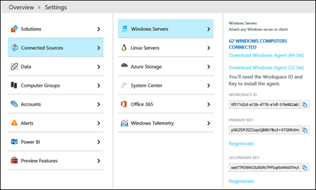

# <a name="monitor-cloud-connector-using-operations-management-suite-oms"></a><span data-ttu-id="15845-103">使用 Operations Management Suite (OMS) 监视云连接器</span><span class="sxs-lookup"><span data-stu-id="15845-103">Monitor Cloud Connector using Operations Management Suite (OMS)</span></span>

<span data-ttu-id="15845-104">阅读本主题，了解如何使用 Microsoft Operations Management Suite （OMS）监视你的云连接器版本2.1 和更高版本的部署。</span><span class="sxs-lookup"><span data-stu-id="15845-104">Read this topic to learn how to monitor your Cloud Connector version 2.1 and later deployment by using Microsoft Operations Management Suite (OMS).</span></span>

<span data-ttu-id="15845-105">现在，你可以使用 Operations Management Suite （OMS）（Microsoft 云 IT 管理解决方案）监视你的云连接器版本2.1 和更高版本的部署。</span><span class="sxs-lookup"><span data-stu-id="15845-105">You can now monitor your Cloud Connector version 2.1 and later deployment by using Operations Management Suite (OMS), a Microsoft cloud IT management solution.</span></span> <span data-ttu-id="15845-106">OMS 日志分析使你能够监视和分析资源（包括物理和虚拟机）的可用性和性能。</span><span class="sxs-lookup"><span data-stu-id="15845-106">OMS Log Analytics enables you to monitor and analyze the availability and performance of resources including physical and virtual machines.</span></span> <span data-ttu-id="15845-107">有关 OMS 和 Log Analytics 的详细信息，请参阅[什么是操作管理套件（OMS）？](https://docs.microsoft.com/azure/operations-management-suite/operations-management-suite-overview)。</span><span class="sxs-lookup"><span data-stu-id="15845-107">For more information about OMS and Log Analytics, see [What is Operations Management Suite (OMS)?](https://docs.microsoft.com/azure/operations-management-suite/operations-management-suite-overview).</span></span>

<span data-ttu-id="15845-108">本主题包括以下部分：</span><span class="sxs-lookup"><span data-stu-id="15845-108">This topic contains the following sections:</span></span>

- <span data-ttu-id="15845-109">先决条件</span><span class="sxs-lookup"><span data-stu-id="15845-109">Prerequisites</span></span>

- <span data-ttu-id="15845-110">将云连接器配置为使用 OMS</span><span class="sxs-lookup"><span data-stu-id="15845-110">Configure Cloud Connector to use OMS</span></span>

- <span data-ttu-id="15845-111">配置 OMS</span><span class="sxs-lookup"><span data-stu-id="15845-111">Configure OMS</span></span>

- <span data-ttu-id="15845-112">分析 Log Analytics 存储库中的警报</span><span class="sxs-lookup"><span data-stu-id="15845-112">Analyze the alerts in your Log Analytics repository</span></span>

- <span data-ttu-id="15845-113">推荐的监视集</span><span class="sxs-lookup"><span data-stu-id="15845-113">Recommended monitoring set</span></span>

## <a name="prerequisites"></a><span data-ttu-id="15845-114">先决条件</span><span class="sxs-lookup"><span data-stu-id="15845-114">Prerequisites</span></span>

<span data-ttu-id="15845-115">在你可以使用 OMS 监视你的云连接器部署之前，你将需要以下内容：</span><span class="sxs-lookup"><span data-stu-id="15845-115">Before you can use OMS to monitor your Cloud Connector deployment, you will need the following:</span></span>

- <span data-ttu-id="15845-116">**Azure 帐户和 OMS 工作区。**</span><span class="sxs-lookup"><span data-stu-id="15845-116">**An Azure account and an OMS workspace.**</span></span> <span data-ttu-id="15845-117">如果你尚没有 Azure 帐户，则需要创建一个才能使用 OMS 日志分析。</span><span class="sxs-lookup"><span data-stu-id="15845-117">If you don't already have an Azure account, you will need to create one to use OMS Log Analytics.</span></span> <span data-ttu-id="15845-118">有关如何创建 Azure 帐户和设置 OMS 工作区的信息，请参阅[Log Analytics 工作区入门](https://docs.microsoft.com/azure/log-analytics/log-analytics-get-started)。</span><span class="sxs-lookup"><span data-stu-id="15845-118">For information about how to create an Azure account and set up an OMS workspace, see [Get started with a Log Analytics workspace](https://docs.microsoft.com/azure/log-analytics/log-analytics-get-started).</span></span>

- <span data-ttu-id="15845-119">**云连接器版本2.1 或更高版本**</span><span class="sxs-lookup"><span data-stu-id="15845-119">**Cloud Connector version 2.1 or later**</span></span>

- <span data-ttu-id="15845-120">对于云连接器监视，需要**日志分析新的日志搜索**。</span><span class="sxs-lookup"><span data-stu-id="15845-120">**Log Analytics new log search** is required for Cloud Connector monitoring.</span></span> <span data-ttu-id="15845-121">有关详细信息，请参阅[将 Azure 日志分析工作区升级到新的日志搜索](https://docs.microsoft.com/azure/log-analytics/log-analytics-log-search-upgrade)。</span><span class="sxs-lookup"><span data-stu-id="15845-121">For more information, see [Upgrade your Azure Log Analytics workspace to new log search](https://docs.microsoft.com/azure/log-analytics/log-analytics-log-search-upgrade).</span></span>

## <a name="configure-cloud-connector-to-use-oms"></a><span data-ttu-id="15845-122">将云连接器配置为使用 OMS</span><span class="sxs-lookup"><span data-stu-id="15845-122">Configure Cloud Connector to use OMS</span></span>

<span data-ttu-id="15845-123">你将需要将云连接器本地环境配置为使用 OMS。</span><span class="sxs-lookup"><span data-stu-id="15845-123">You'll need to configure your Cloud Connector on-premises environment to use OMS.</span></span> <span data-ttu-id="15845-124">若要执行此操作，你需要你的 OMS 工作区 ID 和密钥，你可以使用 OMS 门户找到该工作区 ID 和密钥\>，如下所示\> ：设置--连接的源-Windows 服务器：</span><span class="sxs-lookup"><span data-stu-id="15845-124">To do this, you will need your OMS workspace ID and key, which you can find by using the OMS portal as follows: Settings --\>Connected Sources --\> Windows Servers:</span></span>



<span data-ttu-id="15845-126">将云连接器配置为使用 OMS 的方式取决于你的方案：</span><span class="sxs-lookup"><span data-stu-id="15845-126">How you configure Cloud Connector to use OMS depends on your scenario:</span></span>

- <span data-ttu-id="15845-127">**如果要安装新的云连接器装置或想要重新部署装置**，请在运行 CcAppliance 之前执行以下步骤：</span><span class="sxs-lookup"><span data-stu-id="15845-127">**If you are installing a new Cloud Connector appliance or you want to re-deploy an appliance**, follow these steps before you run Install-CcAppliance:</span></span>

1. <span data-ttu-id="15845-128">在 "CloudConnector file [Common]" 部分中，将 OMSEnabled 参数设置为 True。</span><span class="sxs-lookup"><span data-stu-id="15845-128">In the CloudConnector.ini file [Common] section, set the OMSEnabled parameter to True.</span></span>

    <span data-ttu-id="15845-129">每当部署或升级云连接器时，它都将尝试将 OMS 代理自动安装到 Vm。</span><span class="sxs-lookup"><span data-stu-id="15845-129">Each time Cloud Connector is deployed or upgraded, it will try to install the OMS agent automatically onto the VMs.</span></span> <span data-ttu-id="15845-130">启用此功能，以便 OMS 代理可以在云连接器自动更新后继续使用。</span><span class="sxs-lookup"><span data-stu-id="15845-130">Enable this feature so the OMS agent can survive the Cloud Connector automatic update.</span></span>

2. <span data-ttu-id="15845-131">若要配置 OMS ID 和 key，请运行 CcCredential-AccountType OMSWorkspace。</span><span class="sxs-lookup"><span data-stu-id="15845-131">To configure the OMS ID and key, run Set-CcCredential -AccountType OMSWorkspace.</span></span> 

- <span data-ttu-id="15845-132">**如果要将 OMS 代理安装到现有云连接器设备上**，请执行以下步骤：</span><span class="sxs-lookup"><span data-stu-id="15845-132">**If you are installing an OMS agent onto an existing Cloud Connector appliance**, follow these steps:</span></span>

1. <span data-ttu-id="15845-133">在 "CloudConnector file [Common]" 部分中，设置 OMSEnabled = true。</span><span class="sxs-lookup"><span data-stu-id="15845-133">In the CloudConnector.ini file [Common] section, set OMSEnabled=true.</span></span> 

2. <span data-ttu-id="15845-134">运行导入-CcConfiguration。</span><span class="sxs-lookup"><span data-stu-id="15845-134">Run Import-CcConfiguration.</span></span> 

3. <span data-ttu-id="15845-135">运行安装-CcOMSAgent。</span><span class="sxs-lookup"><span data-stu-id="15845-135">Run Install-CcOMSAgent.</span></span> 

    > [!NOTE]
    > <span data-ttu-id="15845-136">如果从未设置 OMSWorkspace 凭据，则当你运行 install-CcOMSAgent 时，系统会提示你提供凭据。</span><span class="sxs-lookup"><span data-stu-id="15845-136">If the OMSWorkspace credential has never been set, you are prompted for the credential when you run install-CcOMSAgent.</span></span> 

- <span data-ttu-id="15845-137">**如果要在已安装 OMS 代理的云连接器装置中更新 OMS 工作区 ID 或密钥，请执行以下操作：**</span><span class="sxs-lookup"><span data-stu-id="15845-137">**If you want to update the OMS workspace ID or key in a Cloud Connector appliance that has already installed an OMS agent:**</span></span>

1. <span data-ttu-id="15845-138">若要配置 OMS ID 和 key，请运行 CcCredential-AccountType OMSWorkspace。</span><span class="sxs-lookup"><span data-stu-id="15845-138">To configure the OMS ID and key, run Set-CcCredential -AccountType OMSWorkspace.</span></span> 

2. <span data-ttu-id="15845-139">若要应用更新，请运行安装-CcOMSAgent。</span><span class="sxs-lookup"><span data-stu-id="15845-139">To apply the updates, run Install-CcOMSAgent.</span></span> 

- <span data-ttu-id="15845-140">**对于所有方案，请验证代理是否已连接，如下所示：**</span><span class="sxs-lookup"><span data-stu-id="15845-140">**For all scenarios, verify that the agents are connected as follows:**</span></span>

    <span data-ttu-id="15845-141">在 OMS 门户中，转到 "设置\> -已连接\>的源-Windows 服务器"。</span><span class="sxs-lookup"><span data-stu-id="15845-141">In the OMS portal, go to Settings -\> Connected Sources -\> Windows Servers.</span></span> <span data-ttu-id="15845-142">您将看到已连接的计算机列表。</span><span class="sxs-lookup"><span data-stu-id="15845-142">You will see a list of connected machines.</span></span> 

## <a name="configure-oms"></a><span data-ttu-id="15845-143">配置 OMS</span><span class="sxs-lookup"><span data-stu-id="15845-143">Configure OMS</span></span>

<span data-ttu-id="15845-144">接下来，你将需要使用 OMS 门户指定你的 OMS 配置。</span><span class="sxs-lookup"><span data-stu-id="15845-144">Next, you will need to specify your OMS configuration by using the OMS portal.</span></span> <span data-ttu-id="15845-145">具体地说，你需要：</span><span class="sxs-lookup"><span data-stu-id="15845-145">Specifically, you will need to:</span></span>

- <span data-ttu-id="15845-146">指定有关事件日志和性能计数器的信息。</span><span class="sxs-lookup"><span data-stu-id="15845-146">Specify information about event logs and performance counters.</span></span>

- <span data-ttu-id="15845-147">创建通知。</span><span class="sxs-lookup"><span data-stu-id="15845-147">Create alerts.</span></span> 

### <a name="specify-information-about-event-logs-and-performance-counters"></a><span data-ttu-id="15845-148">指定有关事件日志和性能计数器的信息</span><span class="sxs-lookup"><span data-stu-id="15845-148">Specify information about event logs and performance counters</span></span>

<span data-ttu-id="15845-149">在 OMS 门户中，你必须指定有关事件日志和性能计数器的信息，如下所示：</span><span class="sxs-lookup"><span data-stu-id="15845-149">In the OMS portal, you must specify information about the event logs and performance counters as follows:</span></span>

1. <span data-ttu-id="15845-150">转到 "设置\>"-\>"数据-Windows 事件日志"，并为以下内容添加事件日志：</span><span class="sxs-lookup"><span data-stu-id="15845-150">Go to Settings-\>Data-\>Windows Event logs, and add event logs for:</span></span> 

   - <span data-ttu-id="15845-151">Lync Server</span><span class="sxs-lookup"><span data-stu-id="15845-151">Lync Server</span></span>

   - <span data-ttu-id="15845-152">应用程序</span><span class="sxs-lookup"><span data-stu-id="15845-152">Application</span></span>

     > [!NOTE]
     > <span data-ttu-id="15845-153">您必须在文本框中手动输入 Lync 服务器。</span><span class="sxs-lookup"><span data-stu-id="15845-153">You must manually enter Lync Server in the text box.</span></span> <span data-ttu-id="15845-154">它不会显示为下拉列表中的一个选项。</span><span class="sxs-lookup"><span data-stu-id="15845-154">It does not appear as an option in the drop-down list.</span></span> 

     <span data-ttu-id="15845-155">有关详细信息，请参阅[日志分析中的 Windows 事件日志数据源](https://docs.microsoft.com/azure/log-analytics/log-analytics-data-sources-windows-events)</span><span class="sxs-lookup"><span data-stu-id="15845-155">For more information, see [Windows event log data sources in Log Analytics](https://docs.microsoft.com/azure/log-analytics/log-analytics-data-sources-windows-events)</span></span>

2. <span data-ttu-id="15845-156">转到 "设置\>"-\> "数据-Windows 性能计数器"，然后为以下内容添加性能计数器：</span><span class="sxs-lookup"><span data-stu-id="15845-156">Go to Settings-\>Data-\> Windows Performance Counters, and add performance counters for:</span></span> 

   - <span data-ttu-id="15845-157">**操作系统级别计数器**。</span><span class="sxs-lookup"><span data-stu-id="15845-157">**OS level counters**.</span></span> <span data-ttu-id="15845-158">你可以添加 OS 级别计数器，如处理器使用率、内存使用情况、网络使用情况，或者你可以使用容量和性能等现有解决方案，而无需显式添加计数器。</span><span class="sxs-lookup"><span data-stu-id="15845-158">You can add OS level counters, such as processor usage, memory usage, network usage, or you can use existing solutions such as Capacity and Performance, Network Performance Monitor without adding counters explicitly.</span></span> <span data-ttu-id="15845-159">无论您决定如何监视它们，Microsoft 建议你监视这些操作系统计数器。</span><span class="sxs-lookup"><span data-stu-id="15845-159">No matter how you decide to monitor them, Microsoft recommends that you monitor these OS counters.</span></span>

   - <span data-ttu-id="15845-160">**Skype For business 计数器**。</span><span class="sxs-lookup"><span data-stu-id="15845-160">**Skype for Business counters**.</span></span> <span data-ttu-id="15845-161">Skype for Business 提供许多计数器。</span><span class="sxs-lookup"><span data-stu-id="15845-161">There are numerous counters provided by Skype for Business.</span></span> <span data-ttu-id="15845-162">你可以通过登录到任何中介服务器并打开性能监视器来查找这些计数器。</span><span class="sxs-lookup"><span data-stu-id="15845-162">You can find these counters by logging on to any Mediation Server and opening the Performance Monitor.</span></span> <span data-ttu-id="15845-163">这些计数器以 "LS：" 开头。</span><span class="sxs-lookup"><span data-stu-id="15845-163">These counters start with "LS:".</span></span> <span data-ttu-id="15845-164">Microsoft 建议你至少从以下容量计数器开始，并添加其他感兴趣的容量计数器：</span><span class="sxs-lookup"><span data-stu-id="15845-164">Microsoft recommends that you start with the following capacity counters at a minimum, and add others that are of interest:</span></span>

     <span data-ttu-id="15845-165">活动呼叫总数：</span><span class="sxs-lookup"><span data-stu-id="15845-165">Total active calls:</span></span>

   - <span data-ttu-id="15845-166">LS： MediationServer-入站通话（_Total\- ）电流</span><span class="sxs-lookup"><span data-stu-id="15845-166">LS:MediationServer - Inbound Calls(_Total)\- Current</span></span> 

   - <span data-ttu-id="15845-167">LS： MediationServer-拨出电话（_Total\- ）电流</span><span class="sxs-lookup"><span data-stu-id="15845-167">LS:MediationServer - Outbound Calls(_Total)\- Current</span></span> 

     <span data-ttu-id="15845-168">总活动媒体绕过通话：</span><span class="sxs-lookup"><span data-stu-id="15845-168">Total active media bypass calls:</span></span>

   - <span data-ttu-id="15845-169">LS： MediationServer-入站呼叫（_Total\- ）主动媒体绕过呼叫</span><span class="sxs-lookup"><span data-stu-id="15845-169">LS:MediationServer - Inbound Calls(_Total)\- Active media bypass calls</span></span> 

   - <span data-ttu-id="15845-170">LS： MediationServer-出站呼叫（_Total\- ）主动媒体绕过呼叫</span><span class="sxs-lookup"><span data-stu-id="15845-170">LS:MediationServer - Outbound Calls(_Total)\- Active media bypass calls</span></span> 

     > [!NOTE]
     > <span data-ttu-id="15845-171">必须在文本框中手动输入性能计数器。</span><span class="sxs-lookup"><span data-stu-id="15845-171">You must manually enter the performance counters in the text box.</span></span> <span data-ttu-id="15845-172">它们不会显示为下拉列表中的选项。</span><span class="sxs-lookup"><span data-stu-id="15845-172">They do not appear as options in the drop-down list.</span></span> 

     <span data-ttu-id="15845-173">有关详细信息，请参阅[Log Analytics 中的 Windows 和 Linux 性能数据源](https://docs.microsoft.com/azure/log-analytics/log-analytics-data-sources-performance-counters)</span><span class="sxs-lookup"><span data-stu-id="15845-173">For more information, see [Windows and Linux performance data sources in Log Analytics](https://docs.microsoft.com/azure/log-analytics/log-analytics-data-sources-performance-counters)</span></span>

### <a name="create-alerts"></a><span data-ttu-id="15845-174">创建通知</span><span class="sxs-lookup"><span data-stu-id="15845-174">Create alerts</span></span>

<span data-ttu-id="15845-175">OMS 中有两种类型的警报： "结果" 警报和 "指标度量" 警报的数量。</span><span class="sxs-lookup"><span data-stu-id="15845-175">There are two types of alerts in OMS: Number of results alerts and Metric measurement alerts.</span></span> <span data-ttu-id="15845-176">有关创建警报的详细信息，请参阅[在日志分析中使用警报规则](https://docs.microsoft.com/azure/log-analytics/log-analytics-alerts-creating)。</span><span class="sxs-lookup"><span data-stu-id="15845-176">For more information about creating alerts, see [Working with alert rules in Log Analytics](https://docs.microsoft.com/azure/log-analytics/log-analytics-alerts-creating).</span></span>

<span data-ttu-id="15845-177">创建通知时应考虑以下事项：</span><span class="sxs-lookup"><span data-stu-id="15845-177">You should consider the following when creating alerts:</span></span>

- <span data-ttu-id="15845-178">确保警报为 "结果数" 警报，这是默认选择。</span><span class="sxs-lookup"><span data-stu-id="15845-178">Make sure the alert is a Number-of-results alert, which is the default selection.</span></span> 

- <span data-ttu-id="15845-179">演示查询要求 "结果数" 设置为 "大于 0"。</span><span class="sxs-lookup"><span data-stu-id="15845-179">The demo queries require that "Number of results" is set to "Greater than 0".</span></span> 

- <span data-ttu-id="15845-180">建议你将时间窗口和警报频率设置为5分钟。</span><span class="sxs-lookup"><span data-stu-id="15845-180">It is recommended that you set both Time window and Alert frequency to 5 minutes.</span></span> 

- <span data-ttu-id="15845-181">建议您不要为演示通知启用 "抑制警报"。</span><span class="sxs-lookup"><span data-stu-id="15845-181">It is recommended that you do not enable "Suppress alerts" for demo alerts.</span></span> 

- <span data-ttu-id="15845-182">对于典型的通知方案，Microsoft 建议创建一对警报：一个错误警告和一个重置警报。</span><span class="sxs-lookup"><span data-stu-id="15845-182">For typical alert scenarios, Microsoft recommends creating a pair of alerts: one error alert and one reset alert.</span></span> <span data-ttu-id="15845-183">对于错误警报，选择严重级别 "严重级别";对于 "重置通知"，选择 "严重级别信息"。</span><span class="sxs-lookup"><span data-stu-id="15845-183">For the error alert, select severity level Critical; for the reset alert, select severity level Informational .</span></span>

<span data-ttu-id="15845-184">以下部分介绍了如何创建示例警报。</span><span class="sxs-lookup"><span data-stu-id="15845-184">The following sections describe how to create sample alerts.</span></span>

 <span data-ttu-id="15845-185">**创建通知对： "RTCMEDSRV 未在中介服务器中运行" 和 "RTCMEDSRV 已重新在中介服务器中运行"**</span><span class="sxs-lookup"><span data-stu-id="15845-185">**Create an alert pair: "RTCMEDSRV is NOT running in Mediation Servers" and "RTCMEDSRV is back in running in Mediation Servers"**</span></span>

<span data-ttu-id="15845-186">要创建此通知对，请执行以下操作：</span><span class="sxs-lookup"><span data-stu-id="15845-186">To create this alert pair:</span></span>

- <span data-ttu-id="15845-187">针对错误警报的查询是：</span><span class="sxs-lookup"><span data-stu-id="15845-187">The query for the error alert is:</span></span>

  ```
  Event | where Computer contains "MediationServer" | where EventLog == "Lync Server" and (EventID == 25002 or EventID == 25003)  | summarize arg_max(TimeGenerated, EventID) by Computer | where EventID == 25003
  ```

    <span data-ttu-id="15845-188">查询使用计算机的计算机筛选器 *，其中包含 "MediationServer"* 。</span><span class="sxs-lookup"><span data-stu-id="15845-188">The query uses the computer filter  *where Computer contains "MediationServer"*  .</span></span> <span data-ttu-id="15845-189">筛选器仅选择其名称包含字符串 "MediationServer" 的计算机。</span><span class="sxs-lookup"><span data-stu-id="15845-189">The filter selects only the computer whose name contains the string "MediationServer".</span></span>

     <span data-ttu-id="15845-190">你可以将筛选器替换为你自己的计算机筛选器，或只是删除它。</span><span class="sxs-lookup"><span data-stu-id="15845-190">You would replace the filter with your own computer filter or simply remove it.</span></span> <span data-ttu-id="15845-191">可以创建不带正则表达式的复杂字符串筛选器。</span><span class="sxs-lookup"><span data-stu-id="15845-191">You can create complex string filters without regular expressions.</span></span> <span data-ttu-id="15845-192">有关详细信息，请参阅[字符串运算符](https://docs.loganalytics.io/docs/Language-Reference/Scalar-operators/String-operators)。</span><span class="sxs-lookup"><span data-stu-id="15845-192">For more information, see [String operators](https://docs.loganalytics.io/docs/Language-Reference/Scalar-operators/String-operators).</span></span> <span data-ttu-id="15845-193">您也可以选择使用正则表达式。</span><span class="sxs-lookup"><span data-stu-id="15845-193">You can also choose to use regular expressions.</span></span> <span data-ttu-id="15845-194">此外，你可以通过保存搜索查询并使用该组作为你的警报查询中的计算机筛选器来创建计算机组。</span><span class="sxs-lookup"><span data-stu-id="15845-194">Moreover, you can create a computer group by saving a search query and using that group as your computer filter in your alert query.</span></span> <span data-ttu-id="15845-195">有关详细信息，请参阅[日志分析日志搜索中的计算机组](https://docs.microsoft.com/azure/log-analytics/log-analytics-computer-groups)。</span><span class="sxs-lookup"><span data-stu-id="15845-195">For more information, see [Computer groups in Log Analytics log searches](https://docs.microsoft.com/azure/log-analytics/log-analytics-computer-groups).</span></span>

    <span data-ttu-id="15845-196">对于每台计算机，错误查询将获取 RTCMEDSRV 服务启动和服务停止的最后一个事件日志。</span><span class="sxs-lookup"><span data-stu-id="15845-196">For each computer, the error query will get the last event log for both the RTCMEDSRV service start and service stop.</span></span> <span data-ttu-id="15845-197">如果最后一个事件是服务停止事件，它将返回一个日志;如果最后一个事件是服务启动事件，它将返回 nothing。</span><span class="sxs-lookup"><span data-stu-id="15845-197">It will return one log if the last event is the service stop event; it will return nothing if the last event is the service start event.</span></span> <span data-ttu-id="15845-198">简言之，该查询将返回 RTCMEDSRV 在时间窗口中停止的服务器的列表。</span><span class="sxs-lookup"><span data-stu-id="15845-198">In short, the query would return a list of servers whose RTCMEDSRV is stopped in the time window.</span></span> 

- <span data-ttu-id="15845-199">重置警报的查询是：</span><span class="sxs-lookup"><span data-stu-id="15845-199">The query for the reset alert is:</span></span>

  ```
  Event | where Computer contains "MediationServer" | where EventLog == "Lync Server" and (EventID == 25002 or EventID == 25003) | summarize arg_max(TimeGenerated, EventID) by Computer  | where EventID == 2500
  ```

    <span data-ttu-id="15845-200">重置查询与错误查询的内容完全相反。</span><span class="sxs-lookup"><span data-stu-id="15845-200">The reset query does exactly the opposite thing of the error query.</span></span> <span data-ttu-id="15845-201">对于每台计算机，如果最后一个事件是服务启动事件，它将返回一个，否则返回如果最后一个事件是服务停止事件，它将返回 nothing。</span><span class="sxs-lookup"><span data-stu-id="15845-201">For each computer, it will return one if the last event is the service start event; it will return nothing if the last event is the service stop event.</span></span>

  <span data-ttu-id="15845-202">**创建通知对： "中介服务器中的并发呼叫过多" 和 "并发呼叫回退到正常负载"**</span><span class="sxs-lookup"><span data-stu-id="15845-202">**Create an alert pair: " Too many concurrent calls in Mediation Servers" and "Concurrent calls fall back to normal load"**</span></span>

<span data-ttu-id="15845-203">要创建此警报，请执行以下操作：</span><span class="sxs-lookup"><span data-stu-id="15845-203">To create this alert:</span></span>

- <span data-ttu-id="15845-204">针对错误警报的查询是：</span><span class="sxs-lookup"><span data-stu-id="15845-204">The query for the error alert is:</span></span>

  ```
  Perf | where Computer contains "MediationServer" | where (ObjectName == "LS:MediationServer - Outbound Calls" or ObjectName == "LS:MediationServer - Inbound Calls") | summarize arg_max(TimeGenerated, CounterValue) by ObjectName, Computer | summarize  TotalCalls = sum(CounterValue) by Computer| where TotalCalls >= 500
  ```

    <span data-ttu-id="15845-205">对于每台计算机，查询将获取入站呼叫和出站呼叫的最后计数器，并对这两个值求和。</span><span class="sxs-lookup"><span data-stu-id="15845-205">For each computer, the query will get the last counters for inbound call and outbound call and sum those two values.</span></span> <span data-ttu-id="15845-206">如果 sum 值超过500，它将返回一个日志;如果不是，它将返回 nothing。</span><span class="sxs-lookup"><span data-stu-id="15845-206">It will return one log if the sum value exceeds 500; it will return nothing if it doesn't.</span></span> <span data-ttu-id="15845-207">简而言之，该查询将返回其并发通话在时间窗口中过多的服务器的列表。</span><span class="sxs-lookup"><span data-stu-id="15845-207">In short, the query would return a list of servers whose concurrent calls are too many in the time window.</span></span>

- <span data-ttu-id="15845-208">重置警报的查询是：</span><span class="sxs-lookup"><span data-stu-id="15845-208">The query for the reset alert is:</span></span>

  ```
  Perf  | where Computer contains "MediationServer" | where (ObjectName == "LS:MediationServer - Outbound Calls" or ObjectName ==  "LS:MediationServer - Inbound Calls") | summarize arg_max(TimeGenerated, CounterValue) by ObjectName, Computer | summarize  TotalCalls = sum(CounterValue) by Computer| where TotalCalls < 500
  ```

    <span data-ttu-id="15845-209">重置查询与错误查询的内容完全相反。</span><span class="sxs-lookup"><span data-stu-id="15845-209">The reset query does exactly the opposite thing of the error query.</span></span> <span data-ttu-id="15845-210">对于每台计算机，查询将获取入站呼叫和出站呼叫的最后计数器，并对这两个值求和。</span><span class="sxs-lookup"><span data-stu-id="15845-210">For each computer, the query will get the last counters for inbound call and outbound call and sum those two values.</span></span> <span data-ttu-id="15845-211">如果 sum 值小于500，它将返回一个日志;否则，它将返回 nothing。</span><span class="sxs-lookup"><span data-stu-id="15845-211">It will return one log if the sum value is less than 500; it will return nothing otherwise.</span></span>

  <span data-ttu-id="15845-212">**创建通知： "CPU 使用率\> 90 或 RTCMEDIARELAY 已停止在服务器中" 警报**</span><span class="sxs-lookup"><span data-stu-id="15845-212">**Create an alert: "CPU usage \> 90 or RTCMEDIARELAY stopped in Servers" alert**</span></span>

<span data-ttu-id="15845-213">若要创建此警报，查询是：</span><span class="sxs-lookup"><span data-stu-id="15845-213">To create this alert, the query is:</span></span>

```
search *| where Computer contains "MediationServer" | where (Type == "Perf" or Type == "Event") | where ((ObjectName ==  "Processor" and CounterName == "% Processor Time") or EventLog == "Lync Server") | where (CounterValue > 90 or EventID == 22003)
```

<span data-ttu-id="15845-214">如果处理器使用率超过90% 或服务被停止，查询将从所有计算机获取所有处理器使用率计数器和服务停止事件，并返回一个日志。</span><span class="sxs-lookup"><span data-stu-id="15845-214">The query will get all processor usage counter and service stop event from all computers and return one log if either processor usage exceeds 90% or service is ever stopped.</span></span> 

## <a name="analyze-the-alerts-in-your-log-analytics-repository"></a><span data-ttu-id="15845-215">分析 Log Analytics 存储库中的警报</span><span class="sxs-lookup"><span data-stu-id="15845-215">Analyze the alerts in your Log Analytics repository</span></span>

<span data-ttu-id="15845-216">若要分析存储库中的警报，请使用警报管理解决方案。</span><span class="sxs-lookup"><span data-stu-id="15845-216">To analyze the alerts in your repository, use the Alert Management solution.</span></span> <span data-ttu-id="15845-217">有关详细信息，请参阅[Operations Management Suite （OMS）中的警报管理解决方案](https://docs.microsoft.com/azure/log-analytics/log-analytics-solution-alert-management)</span><span class="sxs-lookup"><span data-stu-id="15845-217">For more information, see [Alert Management solution in Operations Management Suite (OMS)](https://docs.microsoft.com/azure/log-analytics/log-analytics-solution-alert-management)</span></span>

## <a name="recommended-minimal-monitoring-set"></a><span data-ttu-id="15845-218">建议的最低监视设置</span><span class="sxs-lookup"><span data-stu-id="15845-218">Recommended minimal monitoring set</span></span>

<span data-ttu-id="15845-219">若要识别事件日志和性能计数器的问题，请执行以下操作：</span><span class="sxs-lookup"><span data-stu-id="15845-219">To identify issues with event logs and performance counters:</span></span> 

- <span data-ttu-id="15845-220">**事件日志。**</span><span class="sxs-lookup"><span data-stu-id="15845-220">**Event logs.**</span></span> <span data-ttu-id="15845-221">对于任何问题，应有一个事件对，其中一组事件指示有问题，另一组指示一切正常。</span><span class="sxs-lookup"><span data-stu-id="15845-221">For any issue, there should be an events pair, with one set of events to indicate something is wrong, while the other indicates that everything is well.</span></span> <span data-ttu-id="15845-222">在任何给定时间段内，将显示最后记录的事件，该事件将指示是否 amiss 该时间段的内容。</span><span class="sxs-lookup"><span data-stu-id="15845-222">For any given time period, it is the last event recorded that will indicate whether something is amiss for that time period.</span></span>

- <span data-ttu-id="15845-223">**性能计数器。**</span><span class="sxs-lookup"><span data-stu-id="15845-223">**Performance Counters.**</span></span> <span data-ttu-id="15845-224">监视的计数器应有一个阈值。</span><span class="sxs-lookup"><span data-stu-id="15845-224">There should be a threshold for the monitored counters.</span></span>

<span data-ttu-id="15845-225">下表列出了 Microsoft 建议的通过列出停止和启动事件 Id 进行监视的服务：</span><span class="sxs-lookup"><span data-stu-id="15845-225">The following table lists the services that Microsoft recommends monitoring by listing the stop and start event IDs:</span></span>

|<span data-ttu-id="15845-226">服务名称</span><span class="sxs-lookup"><span data-stu-id="15845-226">Service Name</span></span>  <br/> |<span data-ttu-id="15845-227">目标服务器角色</span><span class="sxs-lookup"><span data-stu-id="15845-227">Target Server Role</span></span>  <br/> |<span data-ttu-id="15845-228">停止事件 ID</span><span class="sxs-lookup"><span data-stu-id="15845-228">Stop Event ID</span></span>  <br/> |<span data-ttu-id="15845-229">开始事件 ID</span><span class="sxs-lookup"><span data-stu-id="15845-229">Start Event ID</span></span>  <br/> |
|:-----|:-----|:-----|:-----|
|<span data-ttu-id="15845-230">RTCMEDSRV</span><span class="sxs-lookup"><span data-stu-id="15845-230">RTCMEDSRV</span></span>  <br/> |<span data-ttu-id="15845-231">中介服务器</span><span class="sxs-lookup"><span data-stu-id="15845-231">Mediation Server</span></span>  <br/> |<span data-ttu-id="15845-232">25003</span><span class="sxs-lookup"><span data-stu-id="15845-232">25003</span></span>  <br/> |<span data-ttu-id="15845-233">25002</span><span class="sxs-lookup"><span data-stu-id="15845-233">25002</span></span>  <br/> |
|<span data-ttu-id="15845-234">RTCSRV</span><span class="sxs-lookup"><span data-stu-id="15845-234">RTCSRV</span></span>  <br/> |<span data-ttu-id="15845-235">边缘服务器</span><span class="sxs-lookup"><span data-stu-id="15845-235">Edge Server</span></span>  <br/> |<span data-ttu-id="15845-236">12289</span><span class="sxs-lookup"><span data-stu-id="15845-236">12289</span></span>  <br/> |<span data-ttu-id="15845-237">12288</span><span class="sxs-lookup"><span data-stu-id="15845-237">12288</span></span>  <br/> |
|<span data-ttu-id="15845-238">RTCMRAUTH</span><span class="sxs-lookup"><span data-stu-id="15845-238">RTCMRAUTH</span></span>  <br/> |<span data-ttu-id="15845-239">边缘服务器</span><span class="sxs-lookup"><span data-stu-id="15845-239">Edge Server</span></span>  <br/> |<span data-ttu-id="15845-240">19003</span><span class="sxs-lookup"><span data-stu-id="15845-240">19003</span></span>  <br/> |<span data-ttu-id="15845-241">19002</span><span class="sxs-lookup"><span data-stu-id="15845-241">19002</span></span>  <br/> |
|<span data-ttu-id="15845-242">RTCMEDIARELAY</span><span class="sxs-lookup"><span data-stu-id="15845-242">RTCMEDIARELAY</span></span>  <br/> |<span data-ttu-id="15845-243">边缘服务器</span><span class="sxs-lookup"><span data-stu-id="15845-243">Edge Server</span></span>  <br/> |<span data-ttu-id="15845-244">22003</span><span class="sxs-lookup"><span data-stu-id="15845-244">22003</span></span>  <br/> |<span data-ttu-id="15845-245">22002</span><span class="sxs-lookup"><span data-stu-id="15845-245">22002</span></span>  <br/> |

<span data-ttu-id="15845-246">下表列出了 Microsoft 建议监视的网络问题：</span><span class="sxs-lookup"><span data-stu-id="15845-246">The following table lists the network issues that Microsoft recommends monitoring:</span></span>


| <span data-ttu-id="15845-247">监视器名称</span><span class="sxs-lookup"><span data-stu-id="15845-247">Monitor Name</span></span>  <br/>                                        | <span data-ttu-id="15845-248">目标服务器角色</span><span class="sxs-lookup"><span data-stu-id="15845-248">Target Server Role</span></span>  <br/> | <span data-ttu-id="15845-249">成功事件 ID 表达式</span><span class="sxs-lookup"><span data-stu-id="15845-249">Success Event ID expression</span></span>  <br/> | <span data-ttu-id="15845-250">错误事件 ID 表达式</span><span class="sxs-lookup"><span data-stu-id="15845-250">Error Event ID expression</span></span>  <br/> | <span data-ttu-id="15845-251">故障示例</span><span class="sxs-lookup"><span data-stu-id="15845-251">Failure example</span></span>  <br/> |
|:-----------------------------------------------------------|:--------------------------|:-----------------------------------|:---------------------------------|:-----------------------|
| <span data-ttu-id="15845-252">中介服务器到网关连接失败</span><span class="sxs-lookup"><span data-stu-id="15845-252">Mediation Server to gateway connectivity failure</span></span>  <br/>    | <span data-ttu-id="15845-253">中介服务器</span><span class="sxs-lookup"><span data-stu-id="15845-253">Mediation Server</span></span>  <br/>   | <span data-ttu-id="15845-254">25062</span><span class="sxs-lookup"><span data-stu-id="15845-254">25062</span></span>                              |                                  | <span data-ttu-id="15845-255">25002</span><span class="sxs-lookup"><span data-stu-id="15845-255">25002</span></span>  <br/>           |
| <span data-ttu-id="15845-256">中介服务器到网关呼叫完成失败</span><span class="sxs-lookup"><span data-stu-id="15845-256">Mediation Server to gateway call completion failure</span></span>  <br/> | <span data-ttu-id="15845-257">中介服务器</span><span class="sxs-lookup"><span data-stu-id="15845-257">Mediation Server</span></span>  <br/>   | <span data-ttu-id="15845-258">25064</span><span class="sxs-lookup"><span data-stu-id="15845-258">25064</span></span>                              |                                  | <span data-ttu-id="15845-259">25002</span><span class="sxs-lookup"><span data-stu-id="15845-259">25002</span></span>  <br/>           |
| <span data-ttu-id="15845-260">关键网络问题</span><span class="sxs-lookup"><span data-stu-id="15845-260">Critical network problems</span></span>  <br/>                           | <span data-ttu-id="15845-261">边缘服务器</span><span class="sxs-lookup"><span data-stu-id="15845-261">Edge Server</span></span>  <br/>        | <span data-ttu-id="15845-262">14353</span><span class="sxs-lookup"><span data-stu-id="15845-262">14353</span></span>                              |                                  | <span data-ttu-id="15845-263">12288</span><span class="sxs-lookup"><span data-stu-id="15845-263">12288</span></span>  <br/>           |

<span data-ttu-id="15845-264">下表列出了应监视的通话容量计数器。</span><span class="sxs-lookup"><span data-stu-id="15845-264">The following lists the call capacity counters that should be monitored.</span></span> <span data-ttu-id="15845-265">对于云连接器标准版，这些号码应少于 500;小于50的云连接器最小版本。</span><span class="sxs-lookup"><span data-stu-id="15845-265">These numbers should be less that 500 for Cloud Connector standard edition; less than 50 for Cloud Connector minimum edition.</span></span>

- <span data-ttu-id="15845-266">LS： MediationServer-入站通话（_Total\- ）电流</span><span class="sxs-lookup"><span data-stu-id="15845-266">LS:MediationServer - Inbound Calls(_Total)\- Current</span></span> 

- <span data-ttu-id="15845-267">LS： MediationServer-拨出电话（_Total\- ）电流</span><span class="sxs-lookup"><span data-stu-id="15845-267">LS:MediationServer - Outbound Calls(_Total)\- Current</span></span> 

- <span data-ttu-id="15845-268">LS： MediationServer-入站呼叫（_Total\- ）主动媒体绕过呼叫</span><span class="sxs-lookup"><span data-stu-id="15845-268">LS:MediationServer - Inbound Calls(_Total)\- Active media bypass calls</span></span>

- <span data-ttu-id="15845-269">LS： MediationServer-出站呼叫（_Total\- ）主动媒体绕过呼叫</span><span class="sxs-lookup"><span data-stu-id="15845-269">LS:MediationServer - Outbound Calls(_Total)\- Active media bypass calls</span></span>

## <a name="see-also"></a><span data-ttu-id="15845-270">另请参阅</span><span class="sxs-lookup"><span data-stu-id="15845-270">See also</span></span>

<span data-ttu-id="15845-271">有关使用 OMS 的详细信息，请参阅以下内容：</span><span class="sxs-lookup"><span data-stu-id="15845-271">For more information about working with OMS, see the following:</span></span>

- [<span data-ttu-id="15845-272">在日志分析中使用日志搜索查找数据</span><span class="sxs-lookup"><span data-stu-id="15845-272">Find data using log searches in Log Analytics</span></span>](https://docs.microsoft.com/azure/log-analytics/log-analytics-log-searches)

- [<span data-ttu-id="15845-273">Azure 日志分析语言参考</span><span class="sxs-lookup"><span data-stu-id="15845-273">Azure Log Analytics Language Reference</span></span>](https://docs.loganalytics.io/docs/Language-Reference)

- [<span data-ttu-id="15845-274">了解日志分析中的警报</span><span class="sxs-lookup"><span data-stu-id="15845-274">Understanding alerts in Log Analytics</span></span>](https://docs.microsoft.com/azure/log-analytics/log-analytics-alerts)

- [<span data-ttu-id="15845-275">将 Windows 计算机连接到 Azure 中的 Log Analytics 服务</span><span class="sxs-lookup"><span data-stu-id="15845-275">Connect Windows computers to the Log Analytics service in Azure</span></span>](https://docs.microsoft.com/azure/log-analytics/log-analytics-windows-agents)


