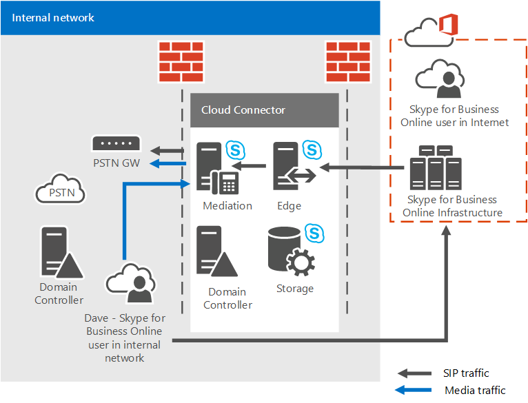

# <a name="plan-for-skype-for-business-cloud-connector-edition"></a>规划 Skype for Business 云连接器版本

查找有关 Skype for Business 云连接器版本的信息，云连接器是一组打包的虚拟机 (Vm)，这些虚拟机负责通过 Office 365 中的电话系统（云 PBX）实施本地 PSTN 连接。

如果您已没有现有的 Lync Server 或 Skype 业务服务器部署，云连接器 Edition 可能适合您的组织的解决方案。 如果您仍调查的 Office 365 解决方案中的电话系统适合您的业务，请参阅[Microsoft 电话服务解决方案](https://docs.microsoft.com/en-us/SkypeForBusiness/hybrid/msft-telephony-solutions)。

本文档介绍云连接器 Edition 要求和支持的拓扑，并帮助您规划云连接器 Edition 部署。 请务必阅读本主题之前配置云连接器环境。 当已准备好部署和配置云连接器 Edition，请参阅[配置和管理业务云连接器 edition Skype](configure-skype-for-business-cloud-connector-edition.md)。

云连接器 Edition 2.1 现已推出。 如果你尚未升级到 2.1，请参阅[Upgrade to a new version of Cloud Connector](upgrade-to-a-new-version-of-cloud-connector.md)。 您可以安装在找到文件[https://aka.ms/CloudConnectorInstaller](https://aka.ms/CloudConnectorInstaller)。

> [!NOTE]
> Microsoft 支持的发行版的新版本后 60 天以前版本的云连接器 Edition。 Microsoft 会在 2.1 版发布后 60 天内继续支持 2.0.1 版，为你预留时间进行升级。 2.0.1 之前的所有版本不再受支持。

云连接器 Edition 就是一的混合提供组成系列打包虚拟机 (Vm) 的 Office 365 中实现与电话系统的内部部署 PSTN 连接。 通过部署虚拟化环境中的企业服务器拓扑最少 Skype，您的组织驻留在云中的用户可以从 Microsoft 云，接收 PBX 服务，但通过现有的内部部署语音提供 PSTN 连接基础结构。


因为云连接器使你可以将 Office 365 电话系统服务与现有电话环境集成—例如，PBX、模拟设备和呼叫中心—你可以实施从现有电话解决方案到 Office 365 电话系统的分阶段迁移。

例如，假设贵公司有一个复杂的呼叫中心，它具有 Office 365 电话系统无法提供的特定功能。 你可以选择将呼叫中心用户保留在现有解决方案中，而将其他用户迁移到 Office 365 电话系统。

云连接器将在本地托管用户和在线托管用户之间提供路由，你可以选择将自己的 PSTN 提供程序与 Office 365 电话系统结合使用。

规划云连接器 Edition 部署时，请考虑以下：

- 若要使用云连接器充分利用云语音解决方案，您将需要注册 Office 365 中包括电话系统的 Office 365 租户。 如果您还没有 Office 365 租户可以了解如何在此处注册： [Office 365 的业务](https://products.office.com/en-us/business/office)。 请注意，您需要注册业务 online 包括 Skype 的计划。

- 若要注册的业务联机服务 Skype 云连接器 appliance 并运行各种 cmdlet，云连接器 2.0 及更高版本要求与 Skype 的专用的 Office 365 帐户进行业务租户管理员权限。 2.0 之前的云连接器版本需要具有专用的 Office 365 帐户以及租户全局管理员权限。

- 云连接器不需要完全内部部署 Skype 业务服务器部署。

    目前，云连接器不能共存 lync 或 for Business 的 Skype 本地服务器。 如果您想要将现有的 Lync 或 Skype 的业务用户移动到 Office 365 并保持使用提供部署到您的用户的电话，请在 Office 365 中的电话系统考虑与业务服务器部署中使用现有的 Skype 的本地连接。 有关详细信息，请参阅[规划 Office 365 (云 PBX) 解决方案中电话系统](plan-your-phone-system-cloud-pbx-solution.md)和[Skype 业务服务器中的内部部署 PSTN 连接的 Office 365 中的规划电话系统](plan-phone-system-with-on-premises-pstn-connectivity.md)。

- 如果您具有业务或 Lync Server 部署，以前 Skype 和扩展架构，您不需要清理云连接器部署的架构，只要您已从您的环境中删除所有 Skype 业务或 Lync Server 组件。

- 您的用户以联机方式驻留。

- 如果贵组织已配置目录同步 (DirSync)，则必须先在本地部署中创建已计划混合语音的所有用户帐户，然后再将其同步至云。

- 如果需要，您可以继续使用当前 PSTN 运营商。

- 如果您希望向云连接器上承载的用户提供拨入式会议，您可以从 Microsoft 购买 PSTN 会议许可证或付费音频会议提供。

- 音频会议许可 （或付费版） 也是必需的呼叫升级。 如果业务用户 Skype 接收来自外部 PSTN 用户的调用，并希望将一个更多参与者添加到该呼叫 （向会议呼叫提升），将通过 Microsoft 音频会议服务执行升级。

- 现在，云连接器 2.0 版和更高版本支持媒体旁路。 媒体绕过允许客户端媒体直接发送到下一个跃点公共公用电话交换网 (PSTN) — 网关或会话边界控制器 (SBC) — 并消除通过的媒体路径中的云连接器 Edition 组件。 有关详细信息，请参阅[规划媒体绕过云连接器版本中](plan-for-media-bypass-in-cloud-connector-edition.md)。

- 云连接器 2.1 及更高版本支持使用 Operations Management Suite (OMS) 监视云连接器。 有关详细信息，请参阅[Monitor Cloud Connector using Operations Management Suite (OMS)](monitor-cloud-connector-using-operations-management-suite-oms.md)

- 云连接器位于 Office 365 企业 E5 位于其中的所有国家/地区。

本主题包括以下部分：

- [云连接器版本组件](plan-skype-for-business-cloud-connector-edition.md#BKMK_Components)

- [云连接器版本拓扑](plan-skype-for-business-cloud-connector-edition.md#BKMK_Topologies)

- [部署要求](plan-skype-for-business-cloud-connector-edition.md#BKMK_Requirements)

- [您需要在部署之前收集的信息](plan-skype-for-business-cloud-connector-edition.md#BKMK_PlanDeployment)

- [拨号计划注意事项](plan-skype-for-business-cloud-connector-edition.md#BKMK_DailPlan)

- [高可用性注意事项](plan-skype-for-business-cloud-connector-edition.md#BKMK_HA)

- [云连接器媒体流](plan-skype-for-business-cloud-connector-edition.md#BKMK_MediaFlow)

- [监视和故障排除](plan-skype-for-business-cloud-connector-edition.md#BKMK_Monitor)

- [有关详细信息](plan-skype-for-business-cloud-connector-edition.md#BKMK_MoreInfo)

## <a name="cloud-connector-edition-components"></a>云连接器版本组件
<a name="BKMK_Components"> </a>

与云连接器 Edition 中部署包含企业服务器拓扑最少 Skype 的打包 Vm 一套 — 边缘组件、 中介组件和中央管理存储 (CMS) 角色组成。 您还将安装的域控制器，需要以内部云连接器能够正常运行它。 为与 Office 365 租户的业务在线服务包含 Skype 的混合配置这些服务。


云连接器组件提供以下功能：

- **边缘组件**的内部部署拓扑结构和在线服务之间的通信经历的边缘组件，其中包括以下组件：

  - **访问边缘**-提供 SIP 业务 online 之间的内部部署和 Skype 的路由。

  - **媒体中继**-提供了媒体的中介组件和其他媒体终结点之间的路由。

  - **媒体中继身份验证 / MRAS** -生成媒体中继访问令牌。

- **出站路由**-提供负载平衡的网关之间的语音流量或 Sbc 连接到云连接器 appliance。 通话将在连接到云连接器设备的所有网关或 SBC 之间平均拆分。

    根据策略实现向网关路由。 仅支持基于目标（出站）PSTN 号码的全局策略。

- **中央管理存储 (CMS) 角色**-包括拓扑组件，包括 CMS 文件传输的配置存储。

- **中央管理存储 (CMS) 副本**的同步全局 CMS DB 从 CMS 角色的服务器上的配置信息。

- **域控制器**-云连接器 Active Directory 域服务来存储所有全局设置和部署云连接器组件所需的组。 将为每个云连接器装置创建一个林中。 域控制器必须不具有任何与生产 Active Directory 的连接。 Active Directory 服务包括：

  - Active Directory 域服务

  - 可颁发内部证书的 Active Directory 证书服务

- **中介组件**-Skype 业务和 PSTN 网关之间实现 SIP 和媒体网关映射协议。 包括同步配置全局 CMS 数据库从 CMS 副本。

## <a name="cloud-connector-edition-topologies"></a>云连接器版本拓扑
<a name="BKMK_Topologies"> </a>

出于讨论目的，我们将提及 PSTN 站点。 PSTN 网站是云连接器 appliance，部署在相同的位置，并与常见连接到他们的 PSTN 网关的组合。 通过 PSTN 站点，你能够：

- 提供到最靠近您的用户的网关的连接。

- 通过部署一个或多个 PSTN 网站内的多个云连接器装置允许为实现可伸缩性。

- 通过部署单个 PSTN 网站内的多个云连接器装置允许高可用性。

本主题介绍了 PSTN 网站。 有关规划 PSTN 网站的详细信息，请参阅[Plan for Cloud Connector Edition PSTN sites](plan-for-cloud-connector-edition-pstn-sites.md)。

您可以部署下列云连接器拓扑：

- 每个 PSTN 网站单个云连接器 Edition 装置。 由于此拓扑不提供高可用性，因此只建议用于评估用途。

- 每个 PSTN 网站，以提供高可用性的多个云连接器 Edition 装置。

- 与多个云连接器 Edition 装置提供高可用性的可伸缩性的多个 PSTN 站点。 最多可部署 200 个站点。

当规划拓扑时，请考虑以下事项：

- 使用云连接器 2.0 及更高版本，一个 PSTN 网站都可以具有最大 16 云连接器 appliance。 在之前版本中，每个站点最多支持 4 台设备。

- 有两种类型的云连接器与测试的硬件配置：

  - 大型版本能够处理大量并发呼叫，在所有类型的生产环境中都受支持。

  - 小型版本旨在低端硬件上运行，可用于评估目的或者用于呼叫量较低的站点。如果你部署云连接器的小型版本，你仍需要注意生产级别的硬件要求（例如，双电源）。

- 如果您拥有云连接器 2.0 或更高版本，并且部署 （具有较大的硬件） 的 16 装置的最大配置，您 PSTN 的网站可以处理达 8000 个并发呼叫。 如果部署小型版本，支持的限制为 800。

    你还需要将某些设备专用于高可用性。 最低建议是应保留一个设备用于高可用性。

  - 使用版本 2，如果部署 15 + 1 的配置，PSTN 站点可以处理多达 7,500 个呼叫。

  - 如果你具有先前版本并且部署最高的 3 + 1 配置（通过较大硬件），你的 PSTN 站点可以处理多达 1500 个并发呼叫。如果你部署小型版本，则支持的限制为 150 个。

-  如果每个 PSTN 网站需要更多呼叫，您可以通过在同一位置部署额外的 PSTN 网站来实现向上扩展。

> [!NOTE]
> 除非另行说明，图表和下面的示例假定使用云连接器的较大版本。

### <a name="single-cloud-connector-appliance-within-a-single-pstn-site"></a>单个 PSTN 站点内单台云连接器设备

下图显示在单个 PSTN 网站内的单个云连接器 Edition 装置。 请注意云连接器包含是为了安全起见外围网络中的一个物理主机计算机上安装的四个 Vm。


### <a name="multiple-cloud-connector-appliances-within-a-single-pstn-site"></a>单个 PSTN 站点内多台云连接器设备

 有关可伸缩性和高可用性目的，您可以选择单个 PSTN 站点内有多个云连接器版本，如下图中所示。 请考虑以下事项：

- 呼叫在一个池中的云连接器之间按随机顺序分配。

- 出于容量规划目的，必须根据以下计算考虑在一个或多个云连接器离线时处理负载的能力：

  - **N+1 配置。** N + 1 框云连接器的较大版本，支持 500\*99.8%可用性与 N 并发呼叫。

    N + 1 框云连接器的较小版本，支持 50\*99.8%可用性与 N 并发呼叫。

  - **N+2 配置。** N + 两个框云连接器的较大版本，支持 500\*提供 99.9%可用性 N 并发呼叫。

    N + 两个框云连接器的较小版本，支持 50\*提供 99.9%可用性 N 并发呼叫。


### <a name="multiple-pstn-sites-with-one-or-more-cloud-connectors-per-site"></a>多个 PSTN 网站，每个网站一个或多个云连接器

你还可以选择配置多个 PSTN 站点，并且每个站点具有一个或多个云连接器版本。 如果 PSTN 站点达到并发呼叫限制，你可以添加另一个 PSTN 站点来处理负载。

多个 PSTN 网站也使你能够提供到最靠近你的用户的网关的连接。 例如，假设你在西雅图和阿姆斯特丹都有 PSTN 网关。 你可以部署两个 PSTN 网站（一个位于西雅图，另一个位于阿姆斯特丹），并指定用户使用最靠近他们的 PSTN 网站。 西雅图的用户将路由到西雅图的 PSTN 网站和网关，而阿姆斯特丹的用户将路由到阿姆斯特丹的 PSTN 网站和网关：


## <a name="requirements-for-deployment"></a>部署要求
<a name="BKMK_Requirements"> </a>

部署云连接器 Edition 之前，请确保您具有以下针对您的环境：

- **为主机计算机-** 云连接器虚拟机必须部署在专用硬件上运行 HYPER-V 角色启用 Windows Server 2012 R2 Datacenter edition （英文）。

    对于版本 2.0 及更高版本，绑定到 Skype for Business Corpnet 交换机的主机计算机网络卡必须在与云连接器公司网络计算机相同的子网中配置 IP 地址。

- 2.1 和更高版本，主机设备必须拥有.NET Framework 4.6.1 或更高版本。

- **为虚拟机-** Windows Server 2012 R2 ISO （英文） 图像 (.iso)。 ISO 将为虚拟机将为商务云连接器版运行 Skype 转换为 Vhd。

- 对于每个云连接器 Edition 部署中支持的 4 个虚拟机安装所需的硬件。 推荐以下配置：

  - 64 位双处理器，六核 （12 实际内核），2.50 千兆赫 (GHz) 或更高版本

  - 64 GB ECC RAM 

  - 四个 600 GB（或更高）10K RPM 128M 缓存 SAS 6Gbps 磁盘，在 RAID 5 配置中进行配置

  - 三个 1 Gbps RJ45 高吞吐量网络适配器

- 如果您选择部署云连接器 Edition 最多为 50 个呼叫支持的较小版本，您将需要以下硬件：

  - Intel i7 4790 四核处理器，采用 Intel 4600 显卡（不需要高端显卡）

  - 32 GB DDR3-1600 非 ECC

  - 2：RAID 0 中的 1TB 7200RPM SATA III (6 Gbps)

  - 2：1 Gbps 以太网 (RJ45)

- 如果在主机上需要代理服务器来浏览 Internet，则必须进行下列配置更改：

  - 若要绕过代理服务器，指定 WinHTTP 代理设置，设置您的代理服务器和绕过列表包括"192.168.213。\*"用于您的云连接器管理服务和 Skype 业务企业网络子网 CloudConnector.ini 文件中定义的网络。 否则，管理连接将失败，并将阻止部署和自动恢复 CloudConnector_shortest。 下面是示例 winhttp 配置命令： netsh winhttp 设置代理"10.10.10.175:8080"绕过列表 ="\*.local; 1。\*; 172.20。\*; 192.168.218。\*\<本地\>"。

  - 指定每台计算机，而不是每个用户的代理设置。 否则将失败云连接器下载。 使用注册表更改或组策略设置，如下所示，可以指定每台计算机的代理设置：

  - **注册表：** HKEY_LOCAL_MACHINE\SOFTWARE\Policies\Microsoft\Windows\CurrentVersion\Internet 设置] ProxySettingsPerUser dword: 00000000

  - **组策略：** 计算机\>管理模板\>Windows 组件\>Internet Explorer： 使代理设置每台计算机 （而不是每个用户）

- 合格的 PBX/Trunk 或合格的 SBC/网络（建议至少使用两个网关）。

    云连接器支持经过认证适用于 Skype for Business 的相同会话边界控制器 (SBC)。 有关详细信息，请参阅[for Business 的 Skype 的电话基础结构](https://docs.microsoft.com/SkypeForBusiness/certification/infra-gateways)。

- 安装和配置 HYPER-V 主机服务器上的权限与本地服务器管理员帐户。 帐户必须在安装和配置了 Hyper-V 的本地服务器上具有管理员权限。

- 部署过程中，需要创建有权限在云连接器域中创建和发布拓扑的域管理员帐户。

- 外部 DNS 记录，这些记录是在安装程序包附带的 CloudConnector.ini 文件中定义的：

  - 边缘组件; 的访问边缘服务的外部 DNS 记录例如，ap.\<域名\>。 每个 PSTN 站点都需要一个记录。 此记录必须包含该网站所有边缘的 IP 地址。

- 创建所有必需的 DNS 和 SRV 记录与 Office 365 租户。

    > [!IMPORTANT]
    > 当您将您的租户集成与云连接器 Edition，使用默认域后缀，。 onmicrosoft.com，作为您的组织的 SIP 域不受支持。 不能使用 sip 的 >。\<域名\>为您云连接器边缘访问的名称代理接口因为 Office 365 使用此 DNS 记录。

- 从公共证书颁发机构 (CA) 获得的用于外部边缘的证书。

- 允许通过所需的端口传输流量的防火墙规则已完成。

- 主机计算机和虚拟机的 Internet 连接。 云连接器从 Internet; 下载一些软件因此，您必须提供网关和 DNS 服务器的信息，以便云连接器主机和虚拟机可以连接到 Internet 并下载所需的软件。

- 主机计算机上安装了租户远程 PowerShell 模块。

- 运行远程 PowerShell 的 Office 365 Skype for Business 管理员凭据。

    > [!IMPORTANT]
    > 管理员帐户不得启用多因素身份验证。

> [!NOTE]
> Microsoft HYPER-V 虚拟化平台上仅支持云连接器部署。 其他平台（如 Vmware 和 Amazon Web Services）不受支持。

> [!NOTE]
> 若要运行云连接器的最低硬件指南基于基本硬件容量 （内核、 MHz、 千兆字节，等） 带一些缓冲区以适应无形性能障碍隐藏在任何计算机的体系结构。 Microsoft 已对市场上出售的满足最低指导要求的硬件运行了最坏情况下的负载测试。 介质质量和系统性能都经过验证。 Microsoft 官方云连接器装置伙伴有特定云连接器硬件实现在其他们独立地进行测试性能及其代表通过其满足负载和质量要求的硬件的适用性。

> [!NOTE]
> AudioCodes 和 Sonus 生产的设备已修改了代码，并在 Windows Server Standard Edition 的服务器上运行。 这些设备受支持。

## <a name="information-you-need-to-gather-before-deployment"></a>您需要在部署之前收集的信息
<a name="BKMK_PlanDeployment"> </a>

在开始部署之前，您需要确定部署的规模、服务于的 SIP 域以及您计划部署的每个 PSTN 网站的配置信息。若要开始，您将执行以下操作：

- 确定将由基于您的公司中使用的 SIP Uri 此部署中的所有 SIP 域。

- 确定需要部署的 PSTN 网站数。

- 确保您有支持四个 Vm 您将为每个云连接器 Edition 安装所必需的硬件。

对于您打算部署的每个 PSTN 网站，您需要：

- 在每台云连接器装置中创建的所有组件的名称 （请参阅[Determine 部署参数](plan-skype-for-business-cloud-connector-edition.md#BKMK_SiteParams)）。

- 确定端口范围（请参阅[端口和协议](plan-skype-for-business-cloud-connector-edition.md#BKMB_Ports)）。

- 为边缘组件创建外部 DNS 记录（请参阅[部署要求](plan-skype-for-business-cloud-connector-edition.md#BKMK_Requirements)）。

- 确定边缘组件的证书要求（请参阅[证书要求](plan-skype-for-business-cloud-connector-edition.md#BKMK_Certs)）。

### <a name="ports-and-protocols"></a>端口和协议
<a name="BKMB_Ports"> </a>

当确定媒体端口范围时，请注意以下事项：

- 客户端始终使用媒体流量的端口范围 50000 到 50019 — 此范围中 Skype 预定义的业务联机，因而不能更改。

- 默认情况下，中介组件将使用端口范围 49 152 至 57 500 传输媒体流量。 但是，通过内部防火墙，建立连接，并且您可以出于安全考虑，限制拓扑中的此端口范围。 每个呼叫最多需要 4 个端口。 如果需要限制中介组件和 PSTN 网关之间的端口数，你还需要在网关上配置对应的端口范围。

- 您必须在外围网络中部署云连接器。 这意味着你将有两个防火墙：

  - 第一个防火墙是 Internet 和您的外围网络之间的外部防火墙。

  - 外围网络与内部网络之间的内部防火墙的第二个。

    您的客户端可以位于 Internet 也可以位于内部网络内：

  - Internet 内的客户端将通过外部防火墙使用边缘组件连接到你的 PSTN。

  - 内部网络中的客户端将连接通过内部防火墙到中介组件在外围网络中，将连接到的 SBC 或 PSTN 网关的流量。

    这意味着您需要在两个防火墙中都打开端口。

下表介绍了外部和内部防火墙的端口和端口范围。

此表显示了支持在内部网络中的客户端和中介组件之间进行通信的端口和端口范围：

**内部防火墙**


|**源 IP**|**目标 IP**|**源端口**|**目标端口**|
|:-----|:-----|:-----|:-----|
|云连接器中介组件  <br/> |SBC/PSTN 网关  <br/> |任意  <br/> |TCP 5060\*\*  <br/> |
|SBC/PSTN 网关  <br/> |云连接器中介组件  <br/> |任意  <br/> |TCP 5068/ TLS 5067  <br/> |
|云连接器中介组件  <br/> |SBC/PSTN 网关  <br/> |UDP 49 152 57 500  <br/> |任何\*\*\*  <br/> |
|SBC/PSTN 网关  <br/> |云连接器中介组件  <br/> |任何\*\*\*  <br/> |UDP 49 152 57 500  <br/> |
|云连接器中介组件  <br/> |内部客户端  <br/> |TCP 49 152 57 500\*  <br/> |TCP 50,000-50,019  <br/> （可选）  <br/> |
|云连接器中介组件  <br/> |内部客户端  <br/> |UDP 49 152 57 500\*  <br/> |UDP 50,000-50,019  <br/> |
|内部客户端  <br/> |云连接器中介组件  <br/> |TCP 50,000-50,019  <br/> |TCP 49 152 57 500\*  <br/> |
|内部客户端  <br/> |云连接器中介组件  <br/> |UDP 50,000-50,019  <br/> |UDP 49 152-57 500\*  <br/> |

\*这是中介组件上的默认端口范围。 为获得最佳呼叫流，每个呼叫需要四个端口。

\*\*此端口必须配置 SBC/PSTN 网关;5060 是一个示例。 你可以在 SBC/PSTN 网关上配置其他端口。

\*\*\*请注意，您还可以限制的端口范围 SBC/网关是否允许 SBC/网关制造商。

为安全起见，您可以使用[集 CsMediationServer](https://docs.microsoft.com/powershell/module/skype/set-csmediationserver?view=skype-ps) cmdlet 限制中介组件的端口范围。

例如，以下命令会中介组件将 （入和签出） 用于 50 000-51 000 音频媒体流量的端口数限制。 中介组件使用此配置能够处理 250 个并发呼叫。 请注意，您可能还需要在 SBC/PSTN 网关上限制此范围：

```
Set-CSMediationServer -Identity MediationServer:mspool.contoso.com -AudioPortStart 50000 - AudioPortCount 1000
```

若要检索中介组件的名称，请参阅默认端口，您可以如下所示使用[Get-csservice](https://docs.microsoft.com/powershell/module/skype/get-csservice?view=skype-ps) cmdlet:

```
Get-CsService -MediationServer | Select-Object Identity, AudioPortStart, AudioPortCount
```

下表显示端口和启用外部防火墙的云连接器边缘组件之间的通信的端口范围。 此表显示了建议的最低配置。

在这种情况下，到 internet 的所有媒体流量将都流通过联机边缘，如下所示： 用户终结点-\>联机边缘-\>云连接器边缘：

**外部防火墙 - 最低配置**


|**源 IP**|**目标 IP**|**源端口**|**目标端口**|
|:-----|:-----|:-----|:-----|
|任意  <br/> |云连接器边缘外部接口  <br/> |任意  <br/> |TCP(MTLS) 5061  <br/> |
|云连接器边缘外部接口  <br/> |任意  <br/> |任意  <br/> |TCP(MTLS) 5061  <br/> |
|云连接器边缘外部接口  <br/> |任意  <br/> |任意  <br/> |TCP 80  <br/> |
|云连接器边缘外部接口  <br/> |任意  <br/> |任意  <br/> |UDP 53  <br/> |
|云连接器边缘外部接口  <br/> |任意  <br/> |任意  <br/> |TCP 53  <br/> |
|云连接器边缘外部接口  <br/> |任何  <br/> |UDP 3478  <br/> |UDP 3478  <br/> |
|任意  <br/> |云连接器边缘外部接口  <br/> |TCP 50,000-59,999  <br/> |TCP 443  <br/> |
|任何  <br/> |云连接器边缘外部接口  <br/> |UDP 3478  <br/> |UDP 3478  <br/> |
|云连接器边缘外部接口  <br/> |任意  <br/> |TCP 50,000-59,999  <br/> |TCP 443  <br/> |

下表显示了端口和启用外部防火墙的云连接器边缘组件之间的通信的端口范围。 此表显示了推荐的解决方案。

在这种情况下对 internet 的结束点的所有媒体流量可以直接向云连接器边缘组件都流动。 媒体路径将用户终结点-\>云连接器边缘。

> [!NOTE]
> 如果用户终结点在对称 NAT 后面，此解决方案不适用。

**外部防火墙 - 推荐的配置**


|**源 IP**|**目标 IP**|**源端口**|**目标端口**|
|:-----|:-----|:-----|:-----|
|任意  <br/> |云连接器边缘外部接口  <br/> |任意  <br/> |TCP(MTLS) 5061  <br/> |
|云连接器边缘外部接口  <br/> |任意  <br/> |任意  <br/> |TCP(MTLS) 5061  <br/> |
|云连接器边缘外部接口  <br/> |任意  <br/> |任意  <br/> |TCP 80  <br/> |
|云连接器边缘外部接口  <br/> |任意  <br/> |任意  <br/> |UDP 53  <br/> |
|云连接器边缘外部接口  <br/> |任意  <br/> |任意  <br/> |TCP 53  <br/> |
|云连接器边缘外部接口  <br/> |任意  <br/> |TCP 50,000-59,999  <br/> |任意  <br/> |
|云连接器边缘外部接口  <br/> |任意  <br/> |UDP 3478；UDP 50,000-59,999  <br/> |任意  <br/> |
|任意  <br/> |云连接器边缘外部接口  <br/> |任意  <br/> |TCP 443；TCP 50,000-59,999  <br/> |
|任何  <br/> |云连接器边缘外部接口  <br/> |任何  <br/> |UDP 3478；UDP 50,000 - 59,999  <br/> |

### <a name="host-internet-connectivity-requirements"></a>主机 Internet 连接要求
<a name="BKMB_Ports"> </a>

主机计算机必须能够访问外部的资源，若要成功安装、 更新和管理云 Connector。 下表显示了主机计算机与外部资源之间所需的目标和端口。

|方向  <br/> |源 IP  <br/> |目标 IP  <br/> |源端口  <br/> |目标端口  <br/> |协议  <br/> |用途  <br/> |
|:-----|:-----|:-----|:-----|:-----|:-----|:-----|
|出站  <br/> |云连接器主机 Ip  <br/> |任何  <br/> |任何  <br/> |53  <br/> |TCP/UDP  <br/> |DNS  <br/> |
|出站  <br/> |云连接器主机 Ip  <br/> |任何  <br/> |任何  <br/> |80, 443  <br/> |TCP  <br/> |证书吊销列表 (CRL)  <br/> |
|出站  <br/> |云 Connectorr 主机 Ip  <br/> |任何  <br/> |任何  <br/> |80, 443  <br/> |TCP  <br/> |云连接器更新  <br/> Skype for Business Online  <br/> 管理 PowerShell  <br/> Windows 更新  <br/> |

如果需要限制性更强的规则，请参阅以下白名单 URL：

- [Office 365 Url 和 IP 地址范围](https://support.office.com/en-us/article/Office-365-URLs-and-IP-address-ranges-8548a211-3fe7-47cb-abb1-355ea5aa88a2?ui=en-US&amp;rs=en-US&amp;ad=US)中的[证书吊销列表 Url](https://support.office.com/en-us/article/Office-365-URLs-and-IP-address-ranges-8548a211-3fe7-47cb-abb1-355ea5aa88a2)

- Windows 更新：[如何配置软件更新的防火墙](https://technet.microsoft.com/en-us/library/bb693717.aspx)

- Skype 业务 Online 管理员 powershell: \*。 online.lync.com

    如果需要为此目标设置代理排除，需要将其添加到 WinHTTP 绕过列表中。

- 云连接器更新：[下载中心](https://aka.ms/CloudConnectorInstaller)， [https://go.microsoft.com](https://go.microsoft.com)，和[https://download.microsoft.com](https://download.microsoft.com)

### <a name="dns-name-resolution-for-the-edge-component"></a>边缘组件的 DNS 名称解析
<a name="BKMB_Ports"> </a>

边缘组件需要解决 Office 365 服务的外部名称和其他云连接器组件的内部名称。

每个边缘组件都是具有面向外部和内部的接口的多宿主计算机。 云连接器部署外围网络中的域控制器组件上的 DNS 服务器。 您可以将边缘服务器指向内的所有名称解析，外围 DNS 服务器，但您需要启用云连接器 DNS 服务器解析外部名称设置 DNS 区域包含一个或多个 DNS A 记录的名称，请参阅外部查询查找其他公共 DNS 服务器。

在 .ini 文件中，如果将相同域空间中网关的 FQDN 名称设置为你的 SIP 域，则将在外围网络内的 DNS 服务器中创建此 SIP 域的权威区域。 边缘服务器指向此 DNS 服务器来解析名称，如果边缘将从不解决 _sipfederationtls。\<yourdomain\>的呼叫流需要的 DNS 记录。 在这种情况下，Microsoft 建议您在边缘外部接口解析 Internet 名称查找提供 DNS 服务器和每个边缘组件必须使用主机文件其他云连接器组件名称解析为 IP 地址。

> [!NOTE]
> 出于安全原因，我们建议，不指向云连接器 DNS 服务器对内部服务器名称解析的生产域中。

### <a name="determine-deployment-parameters"></a>确定部署参数
<a name="BKMK_SiteParams"> </a>

首先需要定义以下常见部署参数：


|**项目**|**说明**|**注释**|
|:-----|:-----|:-----|
|SIP 域  <br/> |SIP URI 的公司用户使用。 提供此部署将服务于的所有 SIP 域。 你可以有多个 SIP 域。  <br/> ||
|PSTN 网站数  <br/> |将部署的 PSTN 网站数。  <br/> ||

对要计划部署的每个 PSTN 网站，你需要在开始部署之前收集以下信息。 当更新 CloudConnector.ini 文件时，你需要提供此信息。

当配置网关信息时，请记住以下事项：

- 如果你只有一个网关，请在 .ini 文件中删除第二个网关的该部分。 如果网关超过两个，请按照现有格式添加新网关。

- 请确保网关的 IP 地址和端口正确。

- 要支持 PSTN 网关级别 HA，请保留辅助网关或添加其他网关。

（可选）要限制出站呼叫号码，请更新 LocalRoute 值。


|**网站参数**|**说明**|**备注**|
|:-----|:-----|:-----|
|虚拟机域名  <br/> |云连接器的内部组件的域名。 此域应不同于生产域。 该名称必须在所有云连接器设备上都是相同的。  <br/> .Ini 文件中的名称:"VirtualMachineDomain"  <br/> |.local 域为首选。  <br/> |
|云连接器域控制器名称  <br/> |域控制器的名称。  <br/> .Ini 文件中的名称:"服务器名称"  <br/> |必须为 15 个字符或更少。 请仅输入 Netbios 名称。  <br/> |
|云连接器域控制器 IP/子网掩码  <br/> |域控制器的 IP 地址。  <br/> .Ini 文件中的名称:"IP"  <br/> ||
|O365 联机服务 FQDN  <br/> |必须在世界各地的 O365 实例的大多数情况下默认值。  <br/> .Ini 文件中的名称:"OnlineSipFederationFqdn"  <br/> ||
|SiteName  <br/> |Skype 业务网站名称;例如，西雅图。  <br/> .Ini 文件中的名称:"SiteName"  <br/> 对于 1.4.1 版及更高版本，各个站点的站点名称不能相同，并且名称必须与 Office 365 中定义的 PSTN 站点（如果存在）匹配。 请注意，在站点中注册第一台设备时，将会自动创建 PSTN 站点。  <br/> ||
|HardwareType  <br/> 1.4.1 版及更高版本  <br/> |硬件类型。 默认值为“Normal”。 你也可以设置为“Minimum”。  <br/> ||
|国家/地区代码  <br/> |用于拨号的国家/地区代码。  <br/> .Ini 文件中的名称:"国家/地区代码"  <br/> ||
|城市  <br/> |城市（可选）。  <br/> .Ini 文件中的名称:"City"  <br/> ||
|省/市/自治区  <br/> |省/市/自治区（可选）。  <br/> .Ini 文件中的名称:"State"  <br/> ||
|基本虚拟机 IP 地址  <br/> |将用于创建的所有云连接器虚拟机 VHDX 临时基虚拟机的 IP 地址。 此 IP 应位于下一步中定义的相同企业外围网络子网内，需要 Internet 访问。 请务必定义企业默认网关和可路由到 Internet 的 DNS。  <br/> .Ini 文件中的名称:"BaseVMIP"  <br/> ||
|WSUSServer  <br/> WSUSStatusServer  <br/> 1.4.1 版及更高版本  <br/> |Windows Server 更新服务 (WSUS) 的地址 — 用于托管 Microsoft 更新所提供的更新的 Intranet 服务器。  <br/> 如果不需要 WSUS，可以留空。  <br/> ||
|内部网络的子网掩码  <br/> |云连接器配置 IP 网络进行云连接器组件之间的内部通信。 边缘也应连接到允许 Internet 连接的另一子网。  <br/> .Ini 文件中的名称:"池的虚拟机网络参数"下的"CorpnetIPPrefixLength"  <br/> ||
|外部网络的子网掩码   <br/> |对于边缘组件的外部网络。  <br/> .Ini 文件中的名称:"池的虚拟机网络参数"下的"InternetIPPrefix"  <br/> ||
|内部网络的交换机名称  <br/> |用于内部云连接器网络的开关的名称。  <br/> 在大多数情况下，可以使用建议的值。  <br/> .Ini 文件中的名称:"CorpnetSwitchName"下"参数池的虚拟网络  <br/> ||
|外部网络的交换机名称  <br/> |用于外部云连接器网络的开关的名称。  <br/> 在大多数情况下，可以使用建议的值。  <br/> .Ini 文件中的名称:"InternetSwitchName"下"参数池的虚拟网络  <br/> ||
|内部网络的默认网关  <br/> |此网关必须提供 Internet 访问 （Internet 还需要设置 DNS 服务器） 并将云连接器组件的内部接口上配置。  <br/> .Ini 文件中的名称:"CorpnetDefaultGateway"下"参数池的虚拟网络  <br/> ||
|边缘组件的外部接口的默认网关  <br/> |将在边缘组件的外部接口上配置。  <br/> .Ini 文件中的名称:"InternetDefaultGateway"下"参数池的虚拟网络  <br/> ||
|内部网络的 DNS 服务器  <br/> |将在临时虚拟机的内部接口上配置。 必须为 Internet 名称提供名称解析。 如果不提供 DNS 服务器，Internet 连接将失败，部署无法完成。  <br/> .Ini 文件中的名称:"CorpnetDNSIPAddress"下"参数池的虚拟网络  <br/> ||
|边缘组件的外部接口的 DNS 服务器  <br/> |将在边缘的外部接口上配置。  <br/> .Ini 文件中的名称:"InternetDNSIPAddress"下"参数池的虚拟网络  <br/> ||
|管理交换机名称。  <br/> |管理开关是临时的开关将自动创建，并的将用于在部署期间云连接器的配置。 部署之后将自动断开连接。 它必须是云连接器中使用的任何其他网络不同的子网。  <br/> 在大多数情况下，可以使用建议的值。  <br/> .Ini 文件中的名称:"ManagementSwitchName"下"参数池的虚拟网络  <br/> ||
|管理子网地址/子网掩码  <br/> |管理子网是临时子网将自动创建，并的将用于在部署期间云连接器的配置。 部署之后将自动删除。 它必须是云连接器中使用的任何其他网络不同的子网。  <br/> .Ini 文件中的名称:"ManagementIPPrefix"和"ManagementIPPrefixLength"下"参数池的虚拟网络  <br/> ||
|中央管理存储 (CMS) 计算机  <br/> |用于中央管理存储 (CMS) 的单个 FQDN。 AD 域名将用于生成 FQDN。  <br/> .Ini 文件中的名称:"服务器名称"下"参数的主中央管理服务  <br/> |必须为 15 个字符或更少。 请仅输入 Netbios 名称。  <br/> （CMS 池名称 = 服务器名称）  <br/> |
|CMS 计算机 IP 地址  <br/> |CMS 服务器 （内部外围网络中） 的 IP 地址。  <br/> INI 文件中的名称:"IP"下"参数的主中央管理服务  <br/> ||
|文件共享名称   <br/> |要在服务器上创建 CMS 的 Skype 业务复制数据 (例如，CmsFileStore) 的文件共享名称。  <br/> 在大多数情况下，可以使用建议的值。  <br/> .Ini 文件中的名称:"CmsFileStore"下"参数的主中央管理服务  <br/> ||
|中介组件池名称  <br/> |中介组件的池名称。 请仅输入 Netbios 名称。 AD 域名将用于生成 FQDN。  <br/> .Ini 文件中的名称:"参数的中介服务器池的"下的"PoolName"  <br/> |必须为 15 个字符或更少。 请仅输入 Netbios 名称。  <br/> |
|中介组件名称  <br/> |中介组件 1 的组件名称。 请仅输入 Netbios 名称。 AD 域名将用于生成 FQDN。  <br/> .Ini 文件中的名称:"参数的中介服务器池的"下的"服务器名称"  <br/> |必须为 15 个字符或更少。 请仅输入 Netbios 名称。  <br/> |
|中介组件计算机 IP 地址  <br/> |内部企业网络 IP 中介组件 （内部外围网络中）。  <br/> .Ini 文件中的名称:"参数的中介服务器池的"下的"IP"  <br/> ||
|边缘池内部名称  <br/> |边缘组件的池名称。 请仅输入 Netbios 名称。 AD 域名将用于生成 FQDN。  <br/> .Ini 文件中的名称:"参数池的边缘服务器"下的"InternalPoolName"  <br/> |必须为 15 个字符或更少。 请仅输入 Netbios 名称。  <br/> |
|边缘服务器内部名称  <br/> |边缘组件的组件名称。请仅输入 Netbios 名称。AD 域名将用于生成 FQDN。  <br/> .Ini 文件中的名称:"参数池的边缘服务器"下的"InternalServerName"  <br/> |必须为 15 个字符或更少。请仅输入 Netbios 名称。  <br/> |
|边缘服务器内部 IP   <br/> |内部外围网络边缘的 IP 组件与云连接器的其他组件进行通信。  <br/> .Ini 文件中的名称:"参数池的边缘服务器"下的"InternalServerIPs"  <br/> ||
|访问池外部名称  <br/> |访问边缘的名称；例如，AP。 此名称必须与为 SSL 证书提供的名称相匹配。 请仅输入 Netbios 名称。 SIP 域名将用于生成 FQDN。 一个外部池名称将用于在池中的所有边缘组件。 每个 PSTN 网站需要安装一个边缘访问池。  <br/> .Ini 文件中的名称:"参数池的边缘服务器"下的"ExternalSIPPoolName"  <br/> |必须为 15 个字符或更少。 请仅输入 Netbios 名称。  <br/> "sip"保留，因此不能用作名称。  <br/> 生成的 FQDN 名称必须与为 SSL 证书提供的名称相匹配。  <br/> |
|访问边缘的外部 IP  <br/> |外部 IP 的边缘组件-如果没有 NAT 可用，或者是公共 IP 或转换 IP （请为指定这两个地址如果映射）。  <br/> .Ini 文件中的名称:"参数池的边缘服务器"下的"ExternalSIPIPs"  <br/> ||
|媒体中继名称  <br/> |音频视频媒体中继边缘的名称；例如 MR。 一个外部池名称将用于池中的所有边缘组件。 每个 PSTN 网站需要安装一个边缘媒体中继池。  <br/> .Ini 文件中的名称:"参数池的边缘服务器"下的"ExternalMRFQDNPoolName"  <br/> |必须为 15 个字符或更少。 请仅输入 Netbios 名称。  <br/> |
|媒体中继边缘的外部 IP  <br/> |当前仅支持一个 IP，因此这将是与访问边缘相同的 IP，为公用 IP 或映射的 IP（如果映射，请同时指定两个地址）。 可以是与访问边缘的边缘组件外部 IP 相同的地址。 请注意，如果边缘服务器位于 NAT 后面，你还需要指定下一个参数的值。  <br/> .Ini 文件中的名称:"参数池的边缘服务器"下的"ExternalMRIPs"  <br/> ||
|外部 IP 的媒体中继边缘 （如果 NAT 后面是边缘）  <br/> |如果你的边缘位于 NAT 后面，你还可以指定 NAT 设备的公共地址。  <br/> .Ini 文件中的名称:"参数池的边缘服务器"下的"ExternalMRPublicIPs"  <br/> ||
|语音网关 1 品牌和型号  <br/> |指定 SBC/语音网关的品牌和型号。 请注意，您可以从在测试设备的列表连接的设备或 SIP 中继[https://technet.Microsoft.com/UCOIP](https://technet.Microsoft.com/UCOIP)。  <br/> ||
|语音网关 2 使和模型 （如果您有多个 2 个网关，请复制此行）  <br/> |指定语音网关的品牌和型号。 请注意，您可以将设备连接从在测试设备的列表[https://technet.Microsoft.com/UCOIP](https://technet.Microsoft.com/UCOIP)。  <br/> ||
|语音网关 1 名称  <br/> |用于使用 AD 域生成计算机 FQDN。 如果将在中介组件和语音网关之间使用 TLS，则是必需的。 如果您不打算使用的 FQDN — 例如，TLS，则不需要或语音网关不支持使用 FQDN (仅 IP) 的连接，请指定。  <br/> ||
|语音网关 2 名称 （如果您有多个 2 个网关这行的副本）  <br/> |用于使用 AD 域生成计算机 FQDN。 如果将在中介组件和语音网关之间使用 TLS，则是必需的。 如果您不打算使用的 FQDN — 例如，TLS，则不需要或语音网关不支持使用 FQDN (仅 IP) 的连接，请指定。  <br/> ||
|语音网关 1 IP 地址  <br/> |语音网关的 IP 地址。  <br/> ||
|语音网关 2 IP 地址 （如果您有多个 2 个网关这行的副本）  <br/> |语音网关的 IP 地址。  <br/> ||
|语音网关 1 端口 # （如果您有多个 2 个网关这行的副本）  <br/> |语音网关 SIP 中继将侦听的端口，例如 5060。  <br/> ||
|语音网关 2 端口号  <br/> |语音网关 SIP 中继将侦听的端口，例如 5060。  <br/> ||
|语音网关 1 协议，用于 SIP 通信  <br/> |TCP 或 TLS。  <br/> ||
|语音网关 2 协议的 SIP 流量 （如果您有多个 2 个网关这行的副本）  <br/> |TCP 或 TLS。  <br/> ||
|与边缘组件之间传输的流量的外部媒体端口范围  <br/> |与边缘的外部接口之间传输的媒体流量的 TCP/UDP 端口范围。 必须始终从 50 000 开始。 有关详细信息，请参阅"端口和协议"。  <br/> |50000 - 59 999  <br/> |
|媒体端口范围为从通过内部防火墙的中介组件进行通信  <br/> |UDP 中介组件将用来向客户端和网关 （每个呼叫的建议 4 端口） 通信的端口范围。  <br/> ||
|媒体端口范围进行通信到从 Skype 业务客户端通过内部防火墙  <br/> |出于规划目的，不可更改。 需要 Skype 业务客户端在内部网络内的中介组件及之间进行通信的内部防火墙中打开端口。  <br/> |50 000 - 50 019  <br/> |
|公用证书密码  <br/> |必须通过脚本提供。  <br/> ||
|安全模式管理员密码  <br/> 仅限于版本 1.4.2  <br/> |内部 CC 域的安全模式管理员密码。  <br/> ||
|云连接器域管理员密码  <br/> 仅限于版本 1.4.2  <br/> |密码为云连接器域管理员 （不同于您的生产域）。 用户名是 Administrator。 你不能更改用户名。  <br/> ||
|虚拟机管理员密码  <br/> 仅限于版本 1.4.2  <br/> |用于在部署过程中配置管理网络。  <br/> 用户名是 Administrator。你不能更改用户名。  <br/> ||
|CABackupFile  <br/> 2.0 版及更高版本  <br/> |用于保存证书颁发机构服务从 Active Directory 服务器到文件部署云连接器网站中的多个设备时。 请务必对一个云连接器内的所有设备使用相同密码，以确保成功地将 CA 备份文件导入到新添加的设备。  <br/> ||
|CCEService  <br/> 2.0 版及更高版本  <br/> |用于云连接器管理服务；需要访问云连接器站点目录。务必对一个云连接器站点内的所有设备使用相同密码。  <br/> ||
|Office 365 租户管理员  <br/> | 云连接器使用该帐户来更新和管理云连接器的租户设置： <br/>  2.0 及更高版本： 专用的 Office 365 凭据帐户与 Skype 的业务管理员权限。 <br/>  2.0 之前的版本：具有全局租户管理员权限的专用 Office 365 帐户的凭据。 <br/> ||
|启用 Refer 支持  <br/> |这将定义在你的 IP/PBX 的中继配置上启用还是禁用 SIP REFER 支持。 默认值为 True。 如果你的 IP/PBX 网关提供 REFER 支持，请将此值保留为 true。 否则，需要将此值更改为 False。 如果您不能确定如果网关支持引用，请参阅[限定 IP Pbx 和网关](https://docs.microsoft.com/SkypeForBusiness/certification/infra-gateways)。   <br/> ||
|EnableFastFailoverTimer  <br/> 2.0 版及更高版本  <br/> |默认值"True"，如果出站呼叫未应答，网关在 10 秒内他们将路由到下一个可用网关;如果不有任何其他中继然后将自动丢弃该呼叫。  <br/> 但是，在网络和网关响应较慢的组织中，或者当建立呼叫的过程超过 10 秒时，这可能会导致不必要的呼叫丢弃。  <br/> 拨打某些国家/地区（例如阿联酋或阿富汗）的电话时，呼叫建立过程可能需要 10 秒以上。 如果遇到类似问题，则需将值更改为 False。 记得在连接的 SBC 或网关上更改相应的设置。  <br/> 值可以为 True 或 False。默认值为 True。  <br/> ||
|ForwardCallHistory  <br/> 2.0 版及更高版本  <br/> | 此参数用于启用报告同时响铃、呼叫转接和呼叫转移场景中的初始呼叫方的 SIP 头。将此参数设置为 True 将启用两个 SIP 头：<br/>  History-Info <br/>  Referred-By <br/>  历史信息头用于重新设定 SIP 请求和"provide(s) 标准的机制来捕获请求历史记录信息以启用多的网络和最终用户的服务"([RFC 4244-部分 1.1](http://www.ietf.org/rfc/rfc4244.txt))。 对于云连接器中继接口，此头用于同时响铃和呼叫转接场景。  <br/>  值可以为 True 或 False。默认值为 False。<br/> ||
|转发 PAI  <br/> 2.0 版及更高版本  <br/> |PAI 是 SIP 的专用扩展，使 SIP 服务器可以断定已经过身份验证的用户的身份。 对于 SIP 中继提供程序，PAI 可用于 History-Info 和 Referred-By 头不存在的事件中的计费目的。 在配置启用转接 P-所宣称-Identity 时，中介服务器将转发 PAI 标头包含 SIP &amp; Tel URI 来自 SIP 中继到云连接器。 中介服务器将转发 PAI 标头包含 tel URI&amp;仅接收的 SIP 中继到云连接器的 E.164 号码。 中介服务器还会转发在任一方向收到的任何 Privacy 头。 如果 SIP 请求中介服务器发送包含窗体的隐私标头"隐私： id"结合 PAI 标头，然后已断言的标识应保留为私有外部网络信任域。  <br/> 值可以为 True 或 False。默认值为 False。  <br/> ||

### <a name="certificate-requirements"></a>证书要求
<a name="BKMK_Certs"> </a>

每个边缘组件都需要来自公共证书颁发机构的证书。 证书必须具有可在边缘组件之间复制的可导出私钥。 要满足证书要求，你需要在以下选项之间做出选择并为证书提供使用者名称 (SN) 和使用者可选名称 (SAN)。

 **如果你有单个 SIP 域：**

- **选项 1.** 使用者名称应包含你为边缘组件分配的池名称。 请注意，使用者名称不能 sip.sipdomain.com，因为此名称以供业务边缘组件联机 Skype。 SAN 应包含 sip.sipdomain.com 和访问边缘池名称：

  ```
  SN = accessedgepoolnameforsite1.sipdomain.com, SAN = sip.sipdomain.com,
  acessedgepoolnameforsite1.sipdomain.com
  ```

- **选项 2.** 如果您想要部署时，所有的边缘池服务器上使用一个通配符证书，然后您可以使用通配符 SAN 项的\*。 sipdomain.com 而不是证书中的边缘池名称。 使用者名称可以是你部署的任何一个边缘池的访问边缘池名称：

  ```
  SN = accessedgepoolnameforsite1.sipdomain.com, SAN = sip.sipdomain.com, SAN = *.sipdomain.com
  ```

> [!NOTE]
> 您必须创建外部 DNS 条目 sip。\<sipdomain\>.com 因为此名称属于 Office 365 部署。

> [!NOTE]
> 如果你要为你的组织中部署的所有边缘池使用单个证书且不能使用选项 2 中定义的通配符证书，那么你需要在证书的 SAN 名称中包括用于所有部署边缘池的 FQDN。

 **如果你有多个 SIP 域：**

你需要为每个 SIP 域添加 sip.sipdomain.com，以及添加每个域的访问边缘池的名称（它可以是一个物理池，但是名称不同）。 下面是多个 sip 域方案中的 SN 和 SAN 条目示例：

- **选项 1.** 使用者名称必须包含边缘组件的分配的池名称。 请注意，使用者名称不能 sip.sipdomain.com，因为此名称以供业务边缘组件联机 Skype。 SAN 应包含 sip.sipdomain.com 和访问边缘池名称：

  ```
  SN = accessedgepoolnameforsite1.sipdomain1.com, SAN = sip.sipdomain1.com, sip.sipdomain2.com,
  acessedgepoolnameforsite1.sipdomain1.com
  ```

- <strong>选项 2。</strong>如果您想要部署时，所有的边缘池服务器上使用一个通配符证书，然后您可以使用通配符 SAN 项的\*。 sipdomain.com 而不是证书中的边缘池名称。 使用者名称可以是你部署的任何一个边缘池的访问边缘池名称：

  ```
  SN = accessedgepoolnameforsite1.sipdomain.com, SAN = sip.sipdomain1.com, sip.sipdomain2.com,
  SAN = *.sipdomain1.com
  ```

> [!NOTE]
> 您必须创建外部 DNS 条目 sip。\<sipdomain\>.com 因为此名称属于 Office 365 部署。

出于部署目的，您可以使用下表：

|**选项**|**说明**|**备注**|
|:-----|:-----|:-----|
|将对您的部署使用哪个选项？  <br/> |选项 1 或 2  <br/> ||
|SN  <br/> |为您的证书提供 SN  <br/> ||
|SAN  <br/> |为您的证书提供 SAN  <br/> ||

如果你要在网关与中介服务器之间使用 TLS，则需要获取分配给网关的证书的根证书或完整证书链。

## <a name="dial-plan-considerations"></a>拨号计划注意事项
<a name="BKMK_DailPlan"> </a>

云连接器需要使用在线拨号计划。 有关如何配置联机拨号计划的详细信息，请参阅[拨号计划是什么？](/microsoftteams/what-are-dial-plans) 
  
## <a name="high-availability-considerations"></a>高可用性注意事项
<a name="BKMK_HA"> </a>

高可用性部署云连接器 Edition 时，您将部署至少两个 appliance 相互充当备份。 每个装置的四个组件组成： 边缘、 中介、 中央管理存储 (CMS) 和域控制器。

一般情况下，如果在装置内的一个组件不可用，云连接器 Edition 可以继续处理呼叫，但您必须考虑以下：

- **中介、CMS 和域控制器组件注意事项**

    假设一台设备中的 CMS 或域控制器组件关闭。 该设备仍可以处理入站和出站呼叫，但是如果你在域控制器或 CMS 组件不可访问时重新启动中介组件，中介组件将无法正常工作。 在域控制器关闭时重新启动 CMS 组件，同样存在此问题。

    **建议：** 重新启动组件之前, 检查设备中的其他组件的可用性。

- **边缘组件注意事项**

    如果一台设备中的边缘组件不可用，则入站和出站呼叫的行为将有所不同，如下所示：

  - **出站呼叫**— 从 Internet 中用户呼叫 PSTN 网络。

    云中的呼叫分配机制将确定一个边缘组件已关闭，并将所有呼叫都路由到另一台设备，因此出站呼叫将会成功。

  - **入站呼叫**— 呼叫来自 PSTN 网络是在本地网络或 Internet 中的用户。

     如果接收呼叫的设备的边缘组件未正常工作，则发往此设备的入站呼叫不会成功，因为中介组件无法将该呼叫重定向到其他设备中的边缘组件。

    **建议：** 具有现成监控系统。 确定边缘组件的故障后，关闭设备中的所有组件的边缘组件不可用。

## <a name="cloud-connector-media-flow"></a>云连接器媒体流
<a name="BKMK_MediaFlow"> </a>

下图概述了通过云连接器 Edition 出站和入站调用的流。 此信息有助于理解连接的建立方式。

在第一个图中，内部用户拨打出站呼叫，如下所示：

1. Dave 是一个以联机方式驻留的用户，但是现在位于内部网络中，他向外部 PSTN 用户发出呼叫。

2. 为业务 Online SIP 流量路由到 Skype。

3. Skype 业务 online 执行反向号码查找的数量。 反向号码查找失败，因为此号码不属于业务组织 Skype 中的任何人。

4. 呼叫将路由到边缘组件（SIP 和媒体流首先通过联机边缘；媒体将通过内部防火墙转到中介组件）。

5. 如果路由存在，边缘组件会将流量中继到外围网络中的中介组件。

6. 中介组件将流量发送到 PSTN 网关。



在下个图中，内部用户接收入站呼叫，如下所示：

1. PSTN 网关为以联机方式驻留但现在位于内部网络中的用户 Dave 接收呼叫。

2. SIP 流量将路由到中介组件。

3. 中介组件将 SIP 流量发送到边缘组件，然后将转到 Skype 业务 online。

4. Skype 业务 online 执行反向号码查找的数量，并查找这是用户 Dave。

5. SIP 信号将转到 Dave 的所有状态点。

6. 将在网关和中介组件之间以及中介组件和终结点之间建立媒体流量。


## <a name="monitoring-and-troubleshooting"></a>监视和故障排除
<a name="BKMK_Monitor"> </a>

每台云连接器设备都会自动安装监视和故障排除机制。该机制会检测下列事件：

- 云连接器设备的一个或多个虚拟机未连接到内部或 Internet 虚拟交换机。

- 云连接器设备的一个或多个虚拟机处于已保存或已停止状态。

- 未运行的服务。

  如果检测到下列事件之一时，整个云连接器然后装置的排空带标记为脱机，以防止尝试建立到告知装置的呼叫。 随后，云连接器自动恢复功能将还原服务并将设备标记为在线。 如果自动恢复由于某些原因失败，请参阅[Troubleshoot your Cloud Connector deployment](troubleshoot-your-cloud-connector-deployment.md)。

  - 在中央管理存储虚拟机上：

     - Skype for Business 主复制器代理

     -  Skype for Business 备份复制器代理

  - 在中介服务器虚拟机上：

     -  Skype for Business 备份复制器代理

     - Skype for Business Server 中介

  - 在边缘服务器虚拟机上：

     -  Skype for Business 备份复制器代理

     -  Skype for Business Server 访问边缘

     - Skype for Business Server 音频/视频边缘

     - Skype for Business Server 音频/视频验证

     - Skype for Business Server Web 会议边缘

- 边缘服务器上“CS RTCSRV”的 Windows 防火墙和中介服务器上的“CS RTCMEDSRV”的入站规则已禁用。

云连接器 2.1 及更高版本支持使用 Operations Management Suite (OMS) 监视云连接器。 有关详细信息，请参阅[Monitor Cloud Connector using Operations Management Suite (OMS)](monitor-cloud-connector-using-operations-management-suite-oms.md)

## <a name="for-more-information"></a>有关详细信息
<a name="BKMK_MoreInfo"> </a>

有关详细信息，请参阅：

- [Microsoft 电话解决方案](https://docs.microsoft.com/en-us/SkypeForBusiness/hybrid/msft-telephony-solutions)

- [配置和管理 Skype for Business 云连接器版本](configure-skype-for-business-cloud-connector-edition.md)

- [云连接器版本中的媒体旁路规划](plan-for-media-bypass-in-cloud-connector-edition.md)

- [在云连接器版本中部署媒体旁路](deploy-media-bypass-in-cloud-connector.md)


