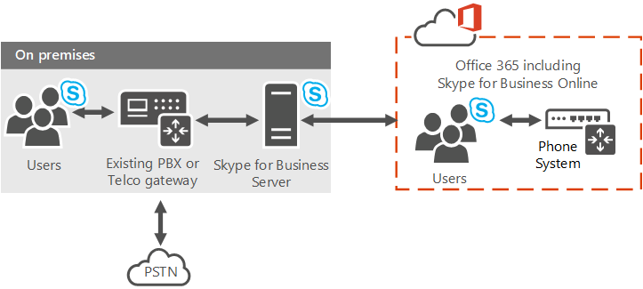

# 规划 Office 365 中的电话系统（云 PBX）解决方案
 
启用呼叫控制和 Office 365 云中的专用分组交换机 (PBX) 功能在 Office 365 (云 PBX) 解决方案中找到有关 Microsoft 的电话系统。
  
Microsoft 提供了多种选项，使您的用户调用 landlines 和手机通过公共的交换电话网络 (PSTN) — — 是否他们的帐户存在于在 Skype 上的 Office 365 业务联机或在您的内部部署 Skype 业务服务器或 Lync Server 2013 部署。
  
这篇文章概括介绍了不同 Microsoft 语音产品，然后提供的指导依据的选择可能最适合您，这取决于您的组织的当前状态和未来的计划。 可以使用业务在线语音解决方案海报可在[Visio](https://download.microsoft.com/download/2/E/E/2EE5C4DE-7F12-475C-A507-37870020F0D3/Plan Voice Solution poster - Final.vsdx)和[PDF](https://download.microsoft.com/download/2/E/E/2EE5C4DE-7F12-475C-A507-37870020F0D3/Plan Voice Solution poster - Final.pdf)格式下载 Skype 以及这篇文章。
  
## 企业语音

 **企业语音**是 Microsoft 的世界一流软件打开语音 (Voip) 解决方案，包括在内部部署的 Skype 业务服务器相比。 企业语音提供了一组丰富的功能和特性，包括响应组、 调用公园、 增强 9-1-1 和更多。 企业语音是适合你的组织的完整专用交换机 (PBX) 系统，包括通过你的当地运营商提供 PSTN 连接。
  

  
有关 Microsoft 的企业语音解决方案的详细信息，请参见：[企业语音业务服务器 2015年的 Skype 在规划](../../plan-your-deployment/enterprise-voice-solution/enterprise-voice.md)、[部署在企业服务器 2015年的 Skype 的企业语音](../../deploy/deploy-enterprise-voice/deploy-enterprise-voice.md)、[规划 Lync Server 中的企业语音2013](https://technet.microsoft.com/library/gg413081%28v=ocs.15%29.aspx)，和[部署在 Lync Server 2013 企业语音](https://technet.microsoft.com/EN-US/library/gg412876%28v=ocs.15%29.aspx)。
  
## Office 365 中的电话系统（云 PBX）

 **Office 365 中的电话系统**是微软在线业务启用呼叫控制和 Skype 与 Office 365 云中的 PBX 功能技术。 电话系统允许您使用一套功能从 Office 365 提供并紧密集成到该公司的云生产力体验替换现有的 PBX 系统。
  
Office 365 中的电话系统，用户可以使用 Skype 的在线业务的关照基本呼叫控制任务，如下订单和接收调用，调用以及静音和 unmuting 呼叫转移。 电话系统用户可以单击它们的通讯簿中的名称和业务的 Skype 发出呼叫到此人。 发出和接收呼叫，电话系统用户可以使用他们的移动设备，便携式计算机或 PC，或与 Skype 业务合作的许多 IP 电话的一个头戴式耳机。 对于管理员来说，电话系统提供了管理内同一租户管理控制台使用的消息服务、 协作、 电话等的能力。
  
作为与传统的 PBX 系统和企业语音您组织中的用户之间的调用处理内部电话系统，到 PSTN 永远不会。 这适用于位于不同的地理区域，您组织中的用户删除这些内部调用的远距离成本之间的调用。
  
若要启用对 landlines 和移动电话，电话系统可以连接到 PSTN 中两种方法之一：
  
- 购买呼叫计划 - Office 365 附加的 PSTN 呼叫计划。
    
- 通过使用内部 PSTN 连接，其中软件内部连接与您的现有电话基础架构。 
    
## 在 Office 365 提供解决方案的电话系统

您选择利用 Office 365 提供 Microsoft 的电话系统的解决方案取决于您当前和未来的需要，例如是否 — — 或所需 — — 是否需要保留由内部部署，提供的功能目前仅与内部企业语音解决方案，以及您的计划是什么的人迁移到云的功能。 
  
您可以选择一种完全的中--云产品，也可以选择混合部署，利用 Office 365 中的电话系统，同时还保持内部部署的某些功能。 根据需要，您可以选择具有 PSTN Office 365 提供服务或内部软件提供的功能 — — 像下图所示和后面几节中所述：
  

  
- **电话系统调用计划与 Office 365 中**的此选项使用 Office 365 中调用计划附加到电话系统启用 landlines 和 （取决于服务获得许可的级别） 在世界各地移动电话呼叫 PSTN 连接。 你的用户驻留在云中，并且启用了 Microsoft 提供的具有呼叫计划附加设备的电话系统。 呼叫计划服务不需要本地服务器部署。 调用计划只适用于 Office 365 中的电话系统，不能与另一个 PBX 系统中使用它。 有关详细信息，请参阅[在 Office 365 中调用计划](plan-your-phone-system-cloud-pbx-solution.md#BKMK_PSTNCalling)。
    
- **与 Office 365 中的电话系统内部的 PSTN 连接性**-此选项使用上部署软件 Office 365 中与您现有的 PSTN 承运人、 电路和合同。 您的用户群中穴和启用 Office 365 中的电话系统，但是其调用处理通过内部部署的软件。
    
    您可以继续为迁移到云的用户使用至源 PSTN 的现有 PSTN 连接（通过 PBX、网关、会话边界控制器或 SIP 中继连接）。 一旦将用户移动到 Skype 的在线业务和 Office 365 中的电话系统，他们的电话号码将路由到任何 Skype 业务客户端为个人电脑或智能手机，以及台电话认证，为公司 Skype。 一旦移植，云和传统 PBX 用户可以互相通常调用，以及拨打和接听 PSTN 使用他们的完整的电话号码。
    
    如果想要实施本地 PSTN 连接，您可以从以下选项中选择：
    
  - **商务云连接器版的 Skype**的云连接器是混合解决方案，包含一套封装虚拟机 (Vm) 实现内部的 PSTN 连接性。 通过是否驻留在云中部署最少的 Skype 业务服务器的虚拟环境中的拓扑结构，您组织中的用户将在场所、 将能够发送和接收与 landlines 和通过现有内部部署的移动电话呼叫语音的基础结构。 有关详细信息，请参阅[规划业务云连接器版 Skype](plan-skype-for-business-cloud-connector-edition.md)和[配置和管理商务云连接器版 Skype](configure-skype-for-business-cloud-connector-edition.md)。
    
  - **Skype 业务服务器的现有部署**的业务服务器或 Lync Server 部署现有 Skype 可以实现内部的 PSTN 连接性也。 这是提供业务服务器修改了混合 PSTN 的内部部署 Skype 组成的混合。 您组织中的用户是否驻留在云上部署，将能够发送和接收与 landlines 和现有内部语音基础架构通过手机电话。 有关详细信息，请参阅[规划与 Office 365 中的电话系统部署 Skype 业务服务器中的 PSTN 连接](plan-phone-system-with-on-premises-pstn-connectivity.md)并[使用户具有内部 Skype 业务服务器中的 PSTN 连接与 Office 365 中的电话系统](enable-users-for-phone-system.md)。
    
### Office 365 中调用计划

 **在 Office 365 中调用计划**是在 Office 365 提供允许用户拨打 landlines 和手机可用于电话系统的服务。 因为此 PSTN 呼叫计划从 Office 365 的操作，这是一种完全-中--云服务，不需要内部服务器部署。
  
此选项的用户为业务在线 Office 365 中托管在 Skype，Skype 业务在线语音服务的访问。 Microsoft 是核心呼叫和 PSTN 服务的提供商，甚至可以提供或移植您的用户的电话号码。 
  
Office 365 中调用计划允许您搜索、 获取，并指派到您组织中的用户的电话号码，以便用户可以进行并与组织内外的人接听电话。
  
在各种类型的企业中，拥有允许用户拨打和接听语音呼叫的电话号码是开展业务的一个重要要求，因为使用电话号码可辨别用户的身份并能够实现跨组织通信。 分配有电话号码的用户将能够在所有 Skype for Business 设备（包括 VoIP 电话、电脑和移动设备）上进行语音呼叫。 
  

  
有关详细信息，请参阅[是 PSTN 调用什么？](https://support.office.com/en-us/article/What-is-PSTN-calling-3dc773b9-95e0-4448-b2f1-887c54022429?ui=en-US&amp;rs=en-US&amp;ad=US)
  
Office 365 中调用计划中提供了特定但不断增长的地理位置。 请与您的 Microsoft 代表确认该服务在您的区域是否可用。 
  
### 具有云连接器版本的本地 PSTN 连接

 **云接头**是一组封装虚拟机 (Vm) 在 Office 365 中实现内部 PSTN 与电话系统的连接性。 此混合产品设计的组织，想要使其 Skype 的在线业务用户使用其现有的内部 PSTN 连接，与 Skype 的业务呼叫控制下的云。
  
使用此选项，您将部署一套包含业务服务器拓扑结构的最小 Skype 的打包 Vm — 边缘组件、 中介组件和一个中央管理存储 (CMS) 角色组成。 这些服务被配置为与您的商业在线服务包括 Skype 的 Office 365 租户的混合。 
  

  
有关此选项的详细信息，请参阅[规划业务云连接器版 Skype](plan-skype-for-business-cloud-connector-edition.md)和[配置和管理商务云连接器版 Skype](configure-skype-for-business-cloud-connector-edition.md)。
  
### 部署与现有部署的 PSTN 连接性

您可以实现业务服务器部署和 PSTN 连接使用您现有的 Skype 的混合解决方案。 在此拓扑中，用户托管在 Skype 上云的在线业务而不是被穴内部部署。 如果您当前有用户驻留在云中或者您希望开始将用户迁移到云中，则可以选择此选项。 
  
使用此选项，您的在线业务用户的 Skype 业务服务器部署在云环境中的业务呼叫控制的 Skype 与您内部 Skype 上得到企业语音通过其 PSTN 连接。 
  

  
有关此选项的详细信息请参阅[计划与 Office 365 中的电话系统部署 Skype 业务服务器中的 PSTN 连接](plan-phone-system-with-on-premises-pstn-connectivity.md)和[允许用户使用 Office 365 中的电话系统内部在 Skype 的 PSTN 连接业务服务器](enable-users-for-phone-system.md).
  
## 选择最佳解决方案

要确定最适合您的组织的解决方案，请确保您知道以下问题的答案，然后查看有助于您选择解决方案的流程图：
  
- 您有现有的内部部署 Skype 业务服务器部署吗？ 
    
- 您的用户托管在 Skype 业务内部，云在 Skype 的在线业务，或者两者同时进行？ 您是否想要将本地用户迁移到云？
    
- Microsoft 的调用计划在 Office 365 提供了在您所在地区。 
    
- 您是否想要继续使用当前的电话运营商？ 由于现有合同，您是否需要继续使用当前的电话运营商？
    
- 您是否有期望使用或需要继续使用的现有本地传统 PBX？ 
    
- 您当前的传统 PBX 能否提供对您的企业至关重要的独特功能？
    
- 任何或所有用户是否都需要 Office 365 中的电话系统中当前未提供的功能？
    
使您的解决方案最适合您的组织的决定之前 — — Office 365 中的电话系统内部企业语音或组合的解决方案--您需要确定哪些功能需要现在和将来。 某些功能 — 如响应组、 组调用装货和调用公园 — — 只为内部用户提供。 在 Office 365 功能供您电话系统的完整列表，请参阅[下面是云 PBX 与获取的内容](https://go.microsoft.com/fwlink/p/?LinkId=715517)。
  
**选择解决方案**

  
|**您的情况**   |**在 Office 365 提供解决方案的电话系统**   |
|:-----|:-----|
|PBX 系统提供了您需要保留的唯一功能。    |**调查将您的 PBX 替换为 Skype for Business Server。** 可用于 Skype 业务服务器企业语音作为一个完整的 PBX 系统为您的组织，包括通过您当地的操作员的 PSTN 连接。 如果您对 PBX 的需要在未来功能更改，可以重新考虑在 Office 365 的电话系统。   有关 Microsoft 的企业语音解决方案的详细信息，请参阅[规划业务服务器 2015年的 Skype 在企业语音解决方案](../../plan-your-deployment/enterprise-voice-solution/enterprise-voice-solution.md)。    如果不是所有用户都要求您当前的 PBX，则可以考虑转向那些用户 Skype 的在线业务提供的独特功能。    |
|您 PBX 不提供独特的功能，您需要保留、 Office 365 中调用计划中提供了您的地区，并且希望使用 Microsoft 提供的 PSTN 服务。    |**Office 365 中调用计划订阅。** 您的所有用户可以位于 Skype for Business Online 上的云中，并且您的组织可以从 Microsoft 接收 PBX 和 PSTN 服务。 如果您的用户已从当前运营商的电话号码，电话号码可以移植到 Office 365 中的电话系统。 根据需要，您可以从 Microsoft 获取额外的电话号码。   有关详细信息，请参阅[是 PSTN 调用什么？](https://support.office.com/en-us/article/What-is-PSTN-calling-3dc773b9-95e0-4448-b2f1-887c54022429?ui=en-US&amp;rs=en-US&amp;ad=US)   |
|您 PBX 不提供独特的功能，您需要保留、 Office 365 中调用计划不可用在您的地区和业务服务器部署具有现有 Lync 或 Skype。    在此方案中，也有可能你的所有用户都位于美国，但是由于其他原因（例如，与现有运营商的合同义务），你不考虑迁移到 Microsoft 提供的 PSTN。    |**您现有的业务服务器部署 Skype 与 Office 365 中的电话系统。** PSTN 连接通过内部部署 Skype 上的企业语音提供的业务服务器部署中，但您的组织能够接收来自 Microsoft 云的 PBX 服务。 当您开始将其移至 Skype 的在线业务，您可以保留用户的语音功能。 您可以按照您自己的进度迁移用户，请注意，无论他们驻留在哪里，其语音功能都将继续工作。   将来，如果您决定您可以保留您当前的运营商，可以移植到 Microsoft 的完整的电话系统，而与调用计划，提供了所有的 PBX 和 PSTN 功能的 microsoft Office 365 中云用户。    有关此选项的详细信息请参阅[计划与 Office 365 中的电话系统部署 Skype 业务服务器中的 PSTN 连接](plan-phone-system-with-on-premises-pstn-connectivity.md)和[允许用户使用 Office 365 中的电话系统内部在 Skype 的 PSTN 连接业务服务器](enable-users-for-phone-system.md).    |
|您 PBX 不提供独特的功能，您需要保留、 Office 365 中调用计划不可用在您的地区和业务服务器部署不具有现有 Lync 或 Skype。    在这种情况下，也可能是，Office 365 中调用计划中提供了您的地区，但不是能认为将移至 Microsoft 提供的 PSTN 出于其他原因 — — 例如与您现有的运营商的合同义务。    |**部署云连接器。** 您可以继续使用您的当前 PSTN 运营商，但是您的组织可以从 Microsoft 云接收 PBX 服务。 云中连接器可以提供给您的用户 Skype 业务的呼叫控制功能。 无论您的用户的地理位置如何，此解决方案都有效，因为每个用户都会连接到其本地网站来获得 PSTN 连接。   将来，如果您决定您可以保留您当前的运营商，可以移植到 Microsoft 的完整的电话系统，而与调用计划，提供了所有的 PBX 和 PSTN 功能的 microsoft Office 365 中云用户。    有关此选项的详细信息，请参阅[规划业务云连接器版 Skype](plan-skype-for-business-cloud-connector-edition.md)和[配置和管理商务云连接器版 Skype](configure-skype-for-business-cloud-connector-edition.md)。    |
   
### 选择组合解决方案

当然，您不必非得为您的整个组织就选择一个解决方案。 以下是只是一些示例位置组合的解决方案可能是您的组织的最佳策略：
  
- **我组织具有的业务服务器部署现有 Skype，Office 365 中调用计划可用在我地区，我只需要的基本呼叫控制功能，并不需要保留我的 PSTN 树干或 PBX 在场所。** 可用于电话系统在 Office 365 的 PSTN 连接内部开始在线移动它们，请记住用户的语音功能。 最终，可以联机移动所有用户、 否决内部部署服务器，并使用在调用计划与 Office 365 的电话系统。
    
- **我的组织有多个地理位置。较大的站点有业务服务器部署的企业语音与内部部署 Skype，而较小的站点的用户根本不具有任何 Skype 业务语音功能。** 如果这些较小的网站在提供调用计划 Office 365 中的区域，可以将这些用户移动到 Skype，进行在线业务，允许它们通过调用计划与 Office 365 中的电话系统的语音功能。 同时，在较大的站点中的用户可以保持在场所，或您无法将它们移动到 Skype 的在线业务以自己的速度通过利用电话系统 Office 365 中与内部的 PSTN 连接性。
    
- **我组织具有的业务服务器部署现有 Skype，在 Office 365 中调用计划中提供了我的地区，但一些我的用户需要响应组和组调用拾取等高级呼叫功能。** 那些不需要使用高级呼叫功能的用户可以移动到云现在，Office 365 中的电话系统使用内部的 PSTN 连接性。 以后，当 Skype 业务在线添加必需的功能，您可以移到云以及其余的您的用户。
    
- **我组织具有的业务服务器部署现有 Skype，我想将我的所有用户都移动到云，但在 Office 365 中调用计划在中不可用的所有地区。** 您可以移动您的所有用户到云同时保留其本地站点干线和 PBX 的功能，在 Office 365 的电话系统使用内部部署的 PSTN 连接性。 为这些用户提供 Office 365 中调用计划的地区驻留 — — 谁不需要高级呼叫功能 — 可以选择移动他们呼叫控制到云中，在 Office 365 的调用计划使用电话系统。 当您这样做时，您可以选择移植其现有的电话号码。
    
- **我的部门有现有的 Skype 业务服务器，但不通过企业语音部署。** 请参阅流程图，确定最适合您的组织的解决方案。
    

