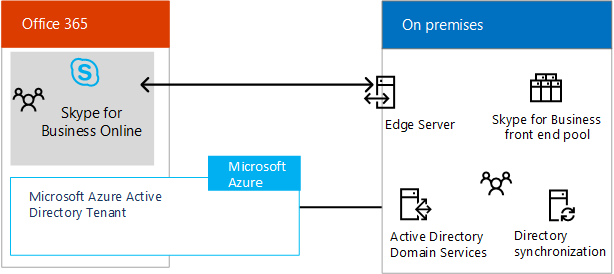
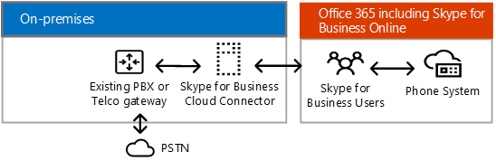

# 业务混合解决方案的 Skype
 
查找有关规划业务混合部署的 Skype 的信息。 
  
本主题介绍几种混合配置，以帮助确定哪种配置最适合你的企业。 然后，你可以通过使用本主题中的链接阅读有关感兴趣的配置的详细信息。 本主题包含以下部分：
  
- [Skype for Business 混合配置](skype-for-business-hybrid-solutions.md#BKMK_HybridConfigurations)
    
- [添加到现有业务 online Skype 本地 Skype 业务环境](skype-for-business-hybrid-solutions.md#BKMK_HybridConnectivity)
    
- [利用 Office 365 中的电话系统（云 PBX）](skype-for-business-hybrid-solutions.md#BKMK_CloudPBX)
    
- [与 Exchange 和 SharePoint 集成](skype-for-business-hybrid-solutions.md#BKMK_IntegratewExchangeSharePoint)
    
- [规划和配置混合环境的任务](skype-for-business-hybrid-solutions.md#BKMK_Tasks)
    
- [有关详细信息](skype-for-business-hybrid-solutions.md#BKMK_MoreInfo)
    
## Skype for Business 混合配置

Skype for Business 支持多个混合配置。 您可以添加 Skype 中的业务 Online 到现有的本地业务环境的 Skype、 集成业务部署与 Exchange Online 和 SharePoint Online，您 Skype 和充分利用 Office 365 (云 PBX) 中的电话系统 — Microsoft 的业务 online 启用呼叫控制和 Office 365 云中与 Skype 的专用交换机 (PBX) 功能的技术。 
  
与业务混合部署的 Skype，您将业务 Online 订阅与您的业务产品的内部部署 Skype Skype。 可以开始构建您的组织中的软件作为服务管理技能和业务用户您 Skype 移到云中，以您自己的速度。 您在云中托管的用户可以利用电话系统的 Office 365 中同时保留您的内部部署公用公用电话交换网 (PSTN) 连接。
  
与业务混合配置 Skype，记住以下：
  
- 部分用户可能驻留在本地，而其他用户可能驻留在线上，但这些用户共享同一个会话初始协议 (Session Initiation Protocol, SIP) 域（例如 contoso.com）。
    
- 您可以将用户迁移从本地业务的 Skype 到 Skype 业务 online 随时间推移，在您的日程安排。
    
- 可以与其他 Microsoft Office 365 应用程序集成，包括 Exchange Online 和 SharePoint Online。
    
- 可以与 Exchange 和 SharePoint 集成。
    
- 可以利用 Skype 会议直播。
    
- 可以利用 PSTN 会议。
    
## 添加到现有业务 online Skype 本地 Skype 业务环境

Skype 业务服务器和 Skype 业务 online 之间的混合连接意味着用户的域名，例如，contoso.com，分别使用 Skype 本地 Business Server 和 Skype 业务 online 之间。 部分域用户驻留在本地，而另一部分用户驻留在线上。 您可以配置您的本地部署中的混合与 Skype 的业务联机和使用 Active Directory 同步以保留您的内部部署和同步的联机用户。 
  
下图显示如何添加 Skype 业务 online 从而使您可以将用户移至您自己的步调云您现有的业务环境中，在本地 Skype 到：
  

  
有关详细信息，请参阅[规划 Skype 业务服务器和 Skype 业务 online 之间的混合连接性](plan-hybrid-connectivity.md)和[部署业务服务器和 Skype 业务 online Skype 之间的混合连接性](deploy-hybrid-connectivity/deploy-hybrid-connectivity.md)。
  
## 利用 Office 365 中的电话系统（云 PBX）

 在 Office 365 (云 PBX) 电话系统是 Microsoft 的技术业务 online 启用呼叫控制和 Office 365 云中与 Skype 的专用交换机 (PBX) 功能。 Office 365 中的电话系统允许您现有的 PBX 系统替换为一组从 Office 365 中发送和紧密集成到 Microsoft 云生产力体验的功能。
  
Microsoft Office 365 混合产品中的两个电话系统，除了提供与调用规划 Office 365 中的电话系统 — PSTN 调用服务 — 一云解决方案不需要在本地服务器部署。 若要决定是否与调用规划 Office 365 中的电话系统可能适合您的组织的解决方案，请参阅[Office 365 解决方案中的电话系统](plan-your-phone-system-cloud-pbx-solution/plan-your-phone-system-cloud-pbx-solution.md#BKMK_PBXOfferings)。
  
Office 365 混合产品中有两个电话系统： 
  
- [由 Skype for Business Server 部署提供本地连接的 Office 365 电话系统](skype-for-business-hybrid-solutions.md#BKMK_Server)
    
- [由 Skype for Business Server 云连接器版本提供本地连接的 Office 365 电话系统](skype-for-business-hybrid-solutions.md#BKMK_CCE)
    
### 由 Skype for Business Server 部署提供本地连接的 Office 365 电话系统

此配置包含 Business Server 内部部署混合 PSTN 修改 Skype。 您的组织驻留在云中的用户可以从 Microsoft 云，接收 PBX 服务，但通过在您的本地 Skype 的企业语音业务服务器部署提供 PSTN 连接。 
  

  
此配置最适用于以下情况： 
  
- PBX 未提供你需要保留的独特功能。
    
- 呼叫计划即 Office 365 PSTN 呼叫服务在你的区域中不可用。
    
- 您具有现有的 Lync 或 Skype 业务服务器部署。
    
有关详细信息，请参阅[规划与 Office 365 中的电话系统本地 Skype 业务服务器中的 PSTN 连接](plan-your-phone-system-cloud-pbx-solution/plan-phone-system-with-on-premises-pstn-connectivity.md)和[启用用户与内部部署中的业务服务器 Skype 的 PSTN 连接的 Office 365 中的电话系统](plan-your-phone-system-cloud-pbx-solution/enable-users-for-phone-system.md)。
  
### 由 Skype for Business Server 云连接器版本提供本地连接的 Office 365 电话系统

此配置包含一组实施本地 PSTN 连接的已打包虚拟机 (VM)。 通过部署虚拟化环境中的企业服务器拓扑最少 Skype，您的组织驻留在云中的用户可以从 Microsoft 云，接收 PBX 服务，但通过现有的内部部署语音提供 PSTN 连接基础结构。 
  

  
此配置最适用于以下情况：
  
- PBX 未提供你需要保留的独特功能。
    
- 呼叫计划即 Office 365 PSTN 呼叫服务在你的区域中不可用。
    
- 对于业务服务器部署没有现有 Lync 或 Skype。
    
有关详细信息，请参阅[规划商务云连接器版的 Skype](plan-your-phone-system-cloud-pbx-solution/plan-skype-for-business-cloud-connector-edition.md)。
  
## 与 Exchange 和 SharePoint 集成

业务混合配置 Skype 可以与其他 Microsoft Office 365 应用程序，包括 Exchange Online 和 SharePoint Online 集成。
  
### Skype for Business Server 与 Exchange Online 和 SharePoint Online

下图中所示，您可以将 Skype 集成业务 server 与 Exchange Online 和 SharePoint Online:
  

  
为业务 Server 与 Exchange Online 和 SharePoint Online 集成 Skype 有诸多优点。 您可以：
  
- 为业务服务器使用 Skype 的完整功能的集。
    
- 利用现有的本地电话设备，例如 PBX。
    
- 使用 Exchange Online 来处理电子邮件，从而卸载本地电子邮件服务器和存储的负担。
    
- 使用 SharePoint Online 进行协作，从而卸载维护本地 SharePoint 服务器的负担。
    
- 使用 Skype 业务、 Exchange 和 SharePoint 集成功能，包括统一消息 (UM) 在 Office 365 中。
    
有关详细信息，请参阅[计划集成业务和 Exchange Skype](../plan-your-deployment/integrate-with-exchange/integrate-with-exchange.md)。
  
### Exchange Server 与 Skype for Business Online

您可以将集成 Exchange Server 与 Skype 的业务联机下图中所示：
  

  
将与 Skype 的 Exchange Server 集成业务 online 具有以下优点：
  
- 利用现有的 Exchange 基础结构。
    
- 使用 Skype 业务联机状态、 IM 和会议功能的。 
    
有关详细信息，请参阅[计划集成业务和 Exchange Skype](../plan-your-deployment/integrate-with-exchange/integrate-with-exchange.md)。
  
## 规划和配置混合环境的任务

Skype for Business 提供了一组丰富的功能，无论您如何构建您的部署。 所选架构将决定你应承担的 IT 职责，以及你通过订阅雇用 Microsoft 为哪些职责提供支持。 无论哪个架构最适合你的组织，你始终都应承担以下五项核心职责：
  
- **网络和连接**-确保网络容量和可用性通过防火墙、 代理服务器、 网关，以及跨 WAN 链接，通过执行网络评估或与合作伙伴进行评估。
    
- **数据调控&amp;权限管理**-划分敏感数据，并确保它是受保护并监视和不管其存储在传输过程中时。
    
- **客户端终结点**-制定、 测量，并实施用于访问数据和资产的设备上的现代安全标准。
    
- **帐户&amp;访问管理**-建立"普通"帐户活动配置文件和发出警报异常活动。
    
- **标识** - 对所有标识使用受硬件保护的凭据或多重身份验证 (Multi-Factor Authentication, MFA)。
    
除了为本地环境执行的架构任务之外，你还需要执行以下任务：
  
- 规划和设计标识管理要求，包括将本地标识与 Office 365 集成。
    
- 确保网络容量和可用性。
    
- 获取第三方 SSL 证书，以便为 Office 365 服务产品提供企业安全。
    
- 确定是否要使用 Internet 协议版本 6 (IPv6) 连接到 Office 365。
    
- 确定需要多少功能集成在一起在本地和 Skype 的联机版本业务、 Exchange 和 SharePoint。 
    
- 确定哪个代理服务器设备将用于处理来自 Office 365 的请求。
    
您还需要执行关注 IT 专业人员的任务，以实现您 Skype 业务混合环境：
  
- 确保您有业务 online 启用 Skype 的 Microsoft Office 365 租户。
    
- 实施标识管理计划。 
    
- 规划并实施内部和外部 DNS 记录与路由。
    
- 针对 Office 365 IP 地址和 URL 要求对代理或防火墙进行配置。
    
- 管理用户帐户和 Skype 的业务联机设置。 
    
- 根据需要配置代理服务器服务。 
    
- 配置与 Exchange Server 和 SharePoint 的本地版本和联机版本的功能集成。
    
## 有关详细信息

有关详细信息，请参阅以下资源：
  
- [Microsoft 云 IT 体系结构资源](https://aka.ms/clouditarch)
    
- [企业架构师 Microsoft 云标识](https://docs.microsoft.com/en-us/office365/enterprise/microsoft-cloud-it-architecture-resources#identity)
    
- [获取您的组织准备 Office 365 企业版](https://aka.ms/O365EntPrep)
    
- [计划 Skype for Business Server 与 Skype for Business Online 之间的混合连接](plan-hybrid-connectivity.md)
    
- [部署 Skype for Business Server 与 Skype for Business Online 之间的混合连接](deploy-hybrid-connectivity/deploy-hybrid-connectivity.md)
    
- [Office 365 解决方案中的电话系统](plan-your-phone-system-cloud-pbx-solution/plan-your-phone-system-cloud-pbx-solution.md#BKMK_PBXOfferings)
    
- [计划集成 Skype for Business 和 Exchange](../plan-your-deployment/integrate-with-exchange/integrate-with-exchange.md)
    
如果要下载本主题的海报版本，请访问以下网址：
  
- [Skype 的业务体系结构模型 (pdf)](https://download.microsoft.com/download/7/7/4/7741262C-A60D-41F7-863B-99BF5964FBFE/Skype%20for%20Business%20Architectural%20Models.pdf)
    
- [Skype 的业务体系结构模型 (Visio)](https://download.microsoft.com/download/7/7/4/7741262C-A60D-41F7-863B-99BF5964FBFE/Skype%20for%20Business%20Architectural%20Models.vsd)
    

