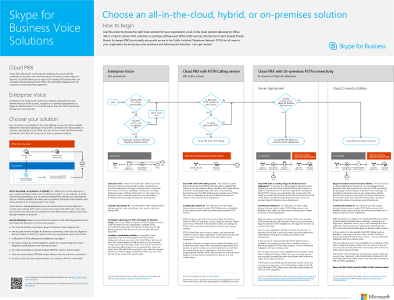
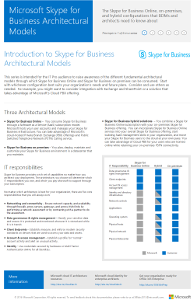

# Skype for Business Server 2015 的技术图示

**摘要：**在规划、 实施或管理的业务服务器 2015年的 Skype 时查看所需的这些海报。
  
这些资源采用 Visio (.vsdx) 格式 (Visio 2015) 和 PDF 格式。 有关如何打印文档的信息，请参阅[打印大型格式海报的技巧](technical-diagrams.md#tips)。
  
您可能需要使用其他软件才能查看这些文件。有关详细信息，请参见下表。
  
|**文件类型**|**软件**|
|:--- |:--- |
|.vsd    |Visio 2010、 Visio 2013 或[可用 Visio viewer](https://go.microsoft.com/fwlink/p/?LinkId=393676)   如果您使用 Visio viewer，请右键单击 VSD 链接，单击“**目标另存为**”，将文件保存到您的计算机，然后从您的计算机打开文件。    |
|.pdf    |任何 PDF 查看器中，如[Adobe Reader](https://go.microsoft.com/fwlink/p/?LinkId=393675)   |
|.zip    |任何文件压缩工具。Windows 7 及更高版本本身可以打开这些文件。    |
   
## 招贴

这些招贴详细描绘了特定的技术领域，旨在与 TechNet 上的相应文章或下载中心提供的内容配合使用。 
  
|**标题**|**说明**|
|:-----|:-----|
|**Skype for Business Server 2015 协议工作负载**   [PDF 版本](https://go.microsoft.com/fwlink/p/?LinkId=550989)（适合 tablet 计算机或移动设备）   [Visio 版本](https://go.microsoft.com/fwlink/p/?LinkId=550991)（适合使用 Visio 的用户）   |下载此招贴以更好地理解 Skype for Business 2015 服务器和客户端在各种服务复杂等级下的要求。     大小：11 x 17 英寸（多张，尺寸便于在大多数办公室打印机上打印）      此招贴是使用 Visio 2015 创建的。应该无需针对特定环境进行修改。    |
|**Skype for Business 呼叫质量方法**   [PDF 版本](https://go.microsoft.com/fwlink/p/?LinkId=617899)（适合 tablet 计算机或移动设备） 的缩略图   [Visio 版本](https://go.microsoft.com/fwlink/p/?LinkId=617900)（适合使用 Visio 的用户）   |下载此招贴了解 CQM，即适用于 Skype for Business 的呼叫质量方法 (Call Quality Methodology)，对于包含企业语音功能的实现，此方法有助于发现和消除影响其呼叫质量和用户体验的问题。      使用[下载的详细信息页面](https://go.microsoft.com/fwlink/p/?LinkId=617898)获取可打印卡和规则，如果您想要作为棋盘游戏播放它。 本宣传海报中使用[CQM 记分卡](https://go.microsoft.com/fwlink/p/?LinkId=617904)。     大小：34 × 44 英寸      此招贴是使用 Visio 2015 创建的。应该无需针对特定环境进行修改。  |
|**Skype 业务语音解决方案**      [PDF 版本](https://go.microsoft.com/fwlink/?linkid=869123)（适合 tablet 计算机或移动设备）   [Visio 版本](https://go.microsoft.com/fwlink/?linkid=869124)（适合使用 Visio 的用户）   |Microsoft 提供了各种各样的选项来让用户能够通过公用电话交换网 (PSTN) 拨打座机和手机 -- 无论他们的帐户存在于 Skype for Business Online 上的 Office 365 中还是本地 Skype for Business Server 部署中。此招贴概括介绍了不同的 Microsoft 语音服务，并根据组织的当前状态和未来计划提供了有关可能最适合您的选项的指导。     大小：34 × 44 英寸     此招贴是使用 Visio 2015 创建的。应该无需针对特定环境进行修改。    |
|**Skype for Business 架构模型**      [PDF 版本](https://go.microsoft.com/fwlink/?linkid=869125)（适合 tablet 计算机或移动设备）   [Visio 版本](https://go.microsoft.com/fwlink/?linkid=869126)（适合使用 Visio 的用户）   |此招贴系列面向 IT 专业受众，旨在提高受众对使用 Skype for Business Online 和 Skype for Business 本地部署可以借助的不同基础架构模型的认识。 首先取决于哪种配置最适合您组织的需要和将来的计划。 根据需要考虑并使用其他配置。 例如，您可能需要考虑与 Exchange 和 SharePoint 或一个解决方案，它利用微软云 PBX 解决方案的集成。     大小：11 × 17 英寸     此招贴使用 Visio 2010 创建。应该无需针对特定环境进行修改。    |
   
## 可视资源

如果您想要使自己的商业符号，[下载模具](https://go.microsoft.com/fwlink/p/?LinkId=550985)使用新的 Skype 的 Visio 拓扑图。
  
## 打印大幅面招贴的提示

如果您拥有绘图仪，则能够以全尺寸打印大幅面招贴。如果您没有绘图仪，请使用以下步骤在较小的纸张上（比如 11"x17"）上打印。在较小的纸张上打印大幅面招贴可能导致文本难以或无法阅读。
  
### 在较小纸张上打印招贴

1. 在 Visio 中打开招贴。
    
2. 在“**文件**”菜单上，单击“**页面设置**”。
    
3. 在“**打印设置**”选项卡上，在“**打印机纸张**”部分中选择要使用的打印纸张大小。
    
4. 在“**打印设置**”选项卡上，在“**打印缩放比例**”部分中单击“**调整为**”，然后输入“**1 张长乘 1 张宽**”。
    
5. 在“**页面大小**”选项卡上，单击“**调整大小以适应绘图内容**”，然后单击“**确定**”。 
    
6. 在“**文件**”菜单上，单击“**打印**”。 
    

