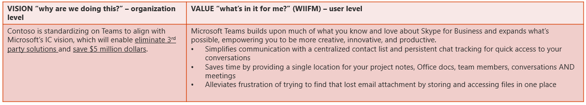
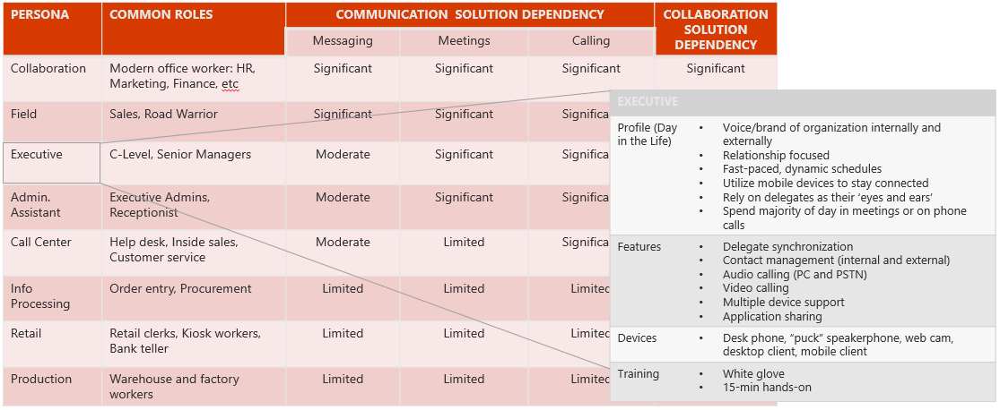

# 准备用户Prepare my users

本文概述了准备您的用户使用云语音服务的要求。This article gives an overview of the requirements for preparing your users for using cloud voice services. 通过正确准备您的用户，您将确保您为组织提供最大价值。By properly preparing your users, you’ll make sure you’re delivering the most value for your organization.

<!--ENDOFSECTION-->

## 准备用户应用Preparing for user adoption

在已保护您的项目工作组和定义的范围和您的项目的目标后下, 一步确保组织和用户准备情况、 活动完成您的技术做好准备工作的并行。After you’ve secured your project team and defined the scope and goals of your project, the next step is ensuring organizational and user readiness, an activity you complete in parallel with your technical readiness. 若要实现与部署的价值，用户必须实际使用并采用它。To realize value from your deployment, users must actually use and adopt it. 只需启用解决方案并不保证，您将实现目标。Simply enabling a solution doesn’t guarantee that you’ll achieve your goals. 此外，用户具有不同用例和不同学习样式，并且他们适应新技术在不同的速度。Further, users have different use cases and varying learning styles, and they adapt to new technology at different speeds. 管理更改不是所有的复杂，但是会占用多少精力，好的消息。The good news is that managing change isn’t all that complicated, but it does take a focused effort. 指导性的讨论下方包含旨在帮助您了解您的用户群和准备的教育以加快并加快用户应用适当的级别。The guided discussions included below are designed to help you understand your user base and prepare the right level of education to facilitate and accelerate user adoption.

活动所有者： 应用更改管理器作为主管，项目负责人，Executive 发起人、 市场营销培训/支持经理Activity Owner: Adoption Change Manager as Lead, Project Lead, Executive Sponsor, Marketing/Training/Support Managers

> [!NOTE] 
> 下面提供了评估活动是适应组织中任何更改计划。The assessment activities provided below are adaptable to any change initiative in your organization. 只需地址根据您的项目的范围的问题。Simply address the questions based on the scope of your project. 中的这些活动讨论，"新解决方案"可从业务向工作组的 Skype 适用于音频呼叫、 音频会议或您的升级。In the discussion of these activities, “new solution” can apply to Audio Calling, Audio Conferencing, or your upgrade from Skype for Business to Teams.

<!--ENDOFSECTION-->

## 创建远景--值语句Create your vision-to-value statement

设置项目构想可让主要利益干系人查看大图片。Setting your project vision enables your key stakeholders to see the big picture. 这通常等同于业务驱动因素&mdash;如成本节约、 运营效率，并提高工作效率&mdash;和设置项目中前面的目标与对齐。This typically equates to business drivers&mdash;such as cost savings, operational efficiencies, and increased productivity&mdash;and aligns with the goals you set earlier in the project. 给用户，该相同的项目可能为离开采用熟悉的工具、 生产力中断和缺乏爱心查看由管理。To a user, that same project might be viewed as taking away familiar tools, productivity disruption, and lack of compassion by management. 需要时间才能自己置于用户鞋，并将项目构想翻译为于它们的值语句。Take time to put yourself in your users’ shoes, and translate your project vision into a value statement that will appeal to them. 使用此值语句 in 您通信和培训活动来授权用户，请参阅团队可以为他们的工作方式。Employ this value statement in your communications and training activities to empower users to see how Teams can work for them.

下图是客户从 for Business 的 Skype 升级到团队的远景--值语句的示例。The following image is an example of a vision-to-value statement for a customer upgrading from Skype for Business to Teams.

 on the left, and Value - what's in it for me? (user level) on the right")

<table>
<tr><td>  决策点Decision points</td><td><ul><li>您明确的好处和价值向用户获得其购买-在此新的解决方案的方式？Have you articulated the benefit and value to your users in a way that gains their buy-in for this new solution?</li></ul></td></tr>
<tr><td> 后续步骤Next steps</td><td><ul><li>创建当前项目范围，确保它们与您的目标对齐您构想和值的语句。Create your vision and value statements for your current project scope, ensuring they align with your goals.</li></ul></td></tr>
</table>

<!--ENDOFSECTION-->

## 确定组织更改准备Determine organizational change readiness

组织准备情况可帮助确定如何乐于接受 （或不） 用户可能会对不断变化的工作的方式。Organizational readiness helps determine how receptive (or not) your users might be to changing the way they work. 了解如何响应用户可能更改使您的组织主动解决问题，调整为最佳接收推出计划和确定用户可以成为拥护者或大使可帮助加快更改。Knowing how users might react to change empowers your organization to proactively address concerns, adjust your rollout plan for optimal reception, and identify users who can become your champions or ambassadors to help facilitate the change.

<table>
<tr><td>  决策点Decision points</td><td><ul><li>？ 用户做好准备，愿意更改到新的解决方案Are users ready and willing to change to the new solution?</li><li>用户是否有要加快更改的功能或 1&competency？Do users have the ability or competency to facilitate the change?</li></ul></td></tr>
<tr><td> 后续步骤Next steps</td><td><ul><li>使用下面的对话启动器了解您的组织的区域性设置时更改。Use the following conversation starters to understand the culture of your organization when it comes to change. 此信息可帮助通知的知晓和培训，您可能需要多少实现您的项目。This information can help inform how much awareness and training you might need to implement for your project.
</li></ul></td></tr>
</table>

> [!TIP]
> 为了帮助指导讨论，评估过去推出;这可以帮助您预计如何响应用户可能会更改，并帮助您主动地解决您预期的反应。To help guide the discussion, evaluate a past rollout; this can help you anticipate how users might react to change and help you proactively address the reactions you expect.

### 每个地址散列表元属于哪些 %的用户？What percent of users fall into each bucket?

| **用户的类型****Type of user**                                                             | **%** |
|------------------------------------------------------------------------------|-------|
| *前期应用*请求解决方案才可以它。*Early adopters* request the solution before it’s available.                  |       |
| *告知用户*接受解决方案，只要其值所述。*Informed users* accept the solution as soon as its value is demonstrated.    |       |
| *滞后*拒绝解决方案，即使推入更改。*Laggards* reject the solution, even when pushed into change.                 |       |

> [!TIP]
> 前期应用是非常适合您的试验部署，也拥护者的计划。Early adopters are great candidates for your pilot deployment and also champions’ initiatives. 如果您有滞后很大一部分，需要时间才能重点关注有关可帮助进行此更改使其在主板这些用户和 handholding 消息的值。If you have a large percentage of laggards, take time to focus on value messaging for those users and handholding to help get them on board with the change.

### 哪些 %的用户分为以下每个 1&competency？What percent of users fall into each competency?

| **学员的类型****Type of learner**                                                        | **%** |
|----------------------------------------------------------------------------|-------|
| *自运用*学员查找出资源，了解通过执行。*Self-motivated* learners seek out resources, learn by doing.                         |       |
| *团队播放器*享受组和交互式培训;将获得以及同事。*Team players* enjoy group and interactive training; they’ll go along with coworkers. |       |
| *Handholding* seekers 预期"手套白色"或一对一帮助。*Handholding* seekers expect “white glove” or one-on-one assistance.                   |       |

 
> [!TIP]
> 学习不是通用的。Learning is not one-size-fits-all. 通过了解如何您的用户了解最佳，可以创建可帮助加快其学习稳固的培训计划。By understanding how your users learn best, you can create a robust training program to help accelerate their learning. 如果自运用多个用户，都链接到视频和用户指南可能只需要。If many users are self-motivated, linking to videos and user guides might suffice. 对于需要专用的关注的人，请务必安排一些一对一时间&mdash;或登记您拥护者可通过学习帮助这些用户。For those who need specialized attention, be sure to schedule some one-on-one time&mdash;or enlist your champions to help those users over the learning curve.

<!--ENDOFSECTION-->

## 评估您的用户群Assess your user base

人员级分析提供了您了解您的用户角色、 群体，以及使用情况。People-level analysis gives you understanding of your user personas, cohorts, and use cases. 按照时间了解您的用户是谁和它们的工作方式，您可以确保拥有所需实现更改时才能成功。By taking time to understand who your users are and how they work, you can ensure they have what they need to be successful as you implement the change. 这可能包括目标消息、 培训或偶数的设备，例如耳麦和网络摄像机。This can include targeted messaging, training, or even devices such as headsets and webcams. 例如，主管预想一对一培训，而旅行字段代表可能受益视频他们可以在其有空观看培训。For example, an executive might expect one-on-one training, whereas traveling field reps might benefit from a training video they can watch at their leisure. 此外，人员级分析可帮助确定谁应开始使用立即与谁可能最佳由等待的新功能。In addition, your people-level analysis can help identify who should start using the new functionality today versus who might be best served by waiting.

<table>
<tr><td>  决策点Decision points</td><td><ul><li>特定用户或群体具有核心依赖关系有效地完成其作业此解决方案？Do certain users or cohorts have a core dependency on this solution to do their job effectively?</li><li>是否有特定的使用情况下，可以使用此新的解决方案可简化？Are there specific use cases that can be facilitated by using this new solution?</li></ul></td></tr>
<tr><td> 后续步骤Next steps</td><td><ul><li>映射用户角色。Map user personas. 首先，将基本用户划分群体个人/组 （Executives、 旅途战士、 协作工作者、 零售，等等）。First, segment your user base into persona/cohort groups (Executives, Road Warriors, Collaboration Workers, Retail, and so on). 对于可管理性，列出不能超过八组。For manageability, list no more than eight groups. （示例对话启动器 （英文），请参阅下面。）使用您的发现进一步设计您的用户准备情况市场活动和分隔试生产用户从那些从更高版本上升级中获益。(For sample conversation starters, see below.) Use your findings to further design your user readiness campaigns and to segment pilot users from those who might benefit from upgrading later on.
</li><li>映射用例。Map use cases. 您已确定将受益于这项新技术核心用户组后，请考虑您的常规用户群。After you’ve identified core user groups who will benefit from this new technology, consider your general user population. 了解跨团队使用情况和方案，您可以可视化组织使用这项新技术。By understanding cross-team use cases and scenarios, you can visualize your organization working with this new technology. 此外，添加使用案例示例向您的通信和培训计划真正帮助使您的用户相关。In addition, adding use case examples to your communication and training plans really help make them relevant for your users.</li></ul></td></tr>
</table>

对于每个角色组，讨论项目工作组使用以下：For each persona group, discuss the following with your project team:

-   此组 （即，什么是普通"一天的生命周期"） 的核心特征有哪些？What are the core characteristics of this group (that is, what’s a typical “day in the life”)?

-   如何将此组受益于新解决方案？How will this group benefit from the new solution? 哪些特性和功能将他们需要可以取得高效率？What features and functionality will they need to be effective?

-   哪些设备将它们需要 （例如耳机或扬声器），以及他们是否已有它们？What devices will they need (for example, headsets or speakers), and do they already have them?

-   哪些其他值消息，如果有，是必需的此组开始使用新的解决方案中创建想法？What additional value messaging, if any, is required to create desire in this group to start using the new solution?

-   什么是对此组接收的最佳途径：What’s the best way for this group to receive:

    -   认知 （例如，电子邮件、 海报、 部门经理）？Awareness (for example, email, posters, department managers)?

    -   培训 （例如，联机培训、 用户指南、 手套白色）？Training (for example, online training, user guide, white glove)?

    -   支持 （自助，帮助台拥护者）？Support (self-serve, helpdesk, champions)?  

-   是此组试点或早期使用程序的一个不错的候选？Is this group a good candidate for a pilot or early adopter program? 如果是这样，请规划，以获得购买中这些用户可以参与试用。If so, make a plan to get buy-in from these users to participate in the pilot. 有关实现成功试用计划的详细信息，请参阅[旁 for Business 的 Skype 试点团队](pilot-essentials.md)。For more information about implementing a successful pilot program, see [Pilot Teams alongside Skype for Business](pilot-essentials.md).

下图是个人表的示例。The following image is an example of a persona table.

, and the features, devices, and training an executive needs.")

为每个用例，讨论项目工作组使用以下：For each use case, discuss the following with your project team:

-   此使用案例/方案的核心特征有哪些？What are the core characteristics for this use case/scenario?

-   什么是好有关当前解决方案？What’s good about the current solution?

-   哪些，如果有，您面临的挑战与当前解决方案？What challenges, if any, do you face with your current solution?

-   新解决方案将如何优化的用户体验？How will the new solution optimize the user experience?

有关使用情况的示例，请访问[FastTrack 生产力库](https://fasttrack.microsoft.com/microsoft365/productivitylibrary)。For examples of use cases, visit the [FastTrack Productivity Library](https://fasttrack.microsoft.com/microsoft365/productivitylibrary).

<!--ENDOFSECTION-->

## 优化您的准备工作计划Optimize your readiness plan
了解您的用户是谁以及它们将如何在新的解决方案后，您可以设计的准备工作计划。After you understand who your users are and how they’ll work within the new solution, you can design your readiness plan. 您的用户的准备工作计划了如何将通信、 培训，并为您试验加载，支持您的用户和运行新解决方案。Your user readiness plan incorporates how you’ll communicate, train, and support your users as you pilot, onboard, and operate the new solution. 根据您在本文前面的步骤中发现，准备不是通用的。As you discovered in the previous steps in this article, readiness is not one-size-fits-all. 开始使用广泛的认知度并培训计划，合并消息在此过程的开头定义的值。Begin with a broad-reach awareness and training plan, incorporating the value messaging you defined at the beginning of this process. 然后定制您消息，培训，并支持的角色或已定义的群体根据。Then tailor your messaging, training, and support to the personas or cohorts you’ve defined, as appropriate. 您的个性化的规划将使用户能够更快地相关时演示您了解他们的需求，可帮助缩短其过渡到新的解决方案。Your personalized plan will enable users to more quickly relate to the new solution while demonstrating that you understand their needs, which will help facilitate their transition.

<table>
<tr><td>  决策点Decision points</td><td><ul><li>您可以提供哪些准备工作计划来帮助加快并加快采用新解决方案？What readiness plan can you offer to help facilitate and accelerate adoption of the new solution?</li><li>您必须右认知、 培训和支持资源，分别用户能够更改和已定义的用户角色？Do you have the right awareness, training, and support resources that align with your users’ ability to deal with change and the user personas you’ve defined?</li></ul></td></tr>
<tr><td> 后续步骤Next steps</td><td><ul><li>使用下节中列表生成的准备工作计划的想法。Use the list in the following section to generate ideas for your readiness plan. 选择最相关的&mdash;或添加您自己&mdash;设计优化您的组织的准备工作计划。Select the most relevant ones&mdash;or add your own&mdash;to design a readiness plan optimized for your organization.</li></ul></td></tr>
</table>

### 准备计划想法Readiness plan ideas

<table>
<tr><th>通信Communication</th><th>培训Training</th><th>支持Support</th></tr>
<tr><td><ul><li>电子邮件&mdash;个性化我们<a href="prepare-my-users-email-templates.md" data-raw-source="[voice email templates](prepare-my-users-email-templates.md)">语音电子邮件模板</a>Email&mdash;personalize our <a href="prepare-my-users-email-templates.md" data-raw-source="[voice email templates](prepare-my-users-email-templates.md)">voice email templates</a></li><li>海报和数字签名Posters and digital signage </li><li>启动事件Launch events</li><li>部门经理Department managers</li><li>支持者Champions</li><li>团队和频道Teams and channels</li><li>GamificationGamification</li></ul></td><td><ul><li>文章和来自 Microsoft 的视频：Articles and videos from Microsoft:<ul><li><a href="https://support.office.com/article/Switch-to-Teams-from-Skype-for-Business-6295a0ae-4e8e-4bba-a100-64cc951cc964" data-raw-source="[Switch to Teams from Skype for Business](https://support.office.com/article/Switch-to-Teams-from-Skype-for-Business-6295a0ae-4e8e-4bba-a100-64cc951cc964)">切换到团队从 Skype for Business</a><a href="https://support.office.com/article/Switch-to-Teams-from-Skype-for-Business-6295a0ae-4e8e-4bba-a100-64cc951cc964" data-raw-source="[Switch to Teams from Skype for Business](https://support.office.com/article/Switch-to-Teams-from-Skype-for-Business-6295a0ae-4e8e-4bba-a100-64cc951cc964)">Switch to Teams from Skype for Business</a></li><li><a href="https://support.office.com/article/microsoft-teams-video-training-4f108e54-240b-4351-8084-b1089f0d21d7" data-raw-source="[Teams video training](https://support.office.com/article/microsoft-teams-video-training-4f108e54-240b-4351-8084-b1089f0d21d7)">团队视频培训</a><a href="https://support.office.com/article/microsoft-teams-video-training-4f108e54-240b-4351-8084-b1089f0d21d7" data-raw-source="[Teams video training](https://support.office.com/article/microsoft-teams-video-training-4f108e54-240b-4351-8084-b1089f0d21d7)">Teams video training</a></li><li><a href="https://support.office.com/article/meetings-and-calls-d92432d5-dd0f-4d17-8f69-06096b6b48a8" data-raw-source="[Meetings and calls](https://support.office.com/article/meetings-and-calls-d92432d5-dd0f-4d17-8f69-06096b6b48a8)">会议和呼叫</a><a href="https://support.office.com/article/meetings-and-calls-d92432d5-dd0f-4d17-8f69-06096b6b48a8" data-raw-source="[Meetings and calls](https://support.office.com/article/meetings-and-calls-d92432d5-dd0f-4d17-8f69-06096b6b48a8)">Meetings and calls</a></li></li></ul><li>内部帮助 （帮助）In-house assistance (Help)</li><li>内部培训团队In-house training team</li><li>合作伙伴培训团队Partner training team</li></ul></td><td><ul><li>内部帮助台In-house helpdesk</li><li>外包的支持桌面Outsourced support desk</li><li>自助 （intranet 网站）Self-help (intranet site)</li><li><a href="https://support.office.com/teams" data-raw-source="[Online Help and how-to](https://support.office.com/teams)">联机帮助和操作方法</a><a href="https://support.office.com/teams" data-raw-source="[Online Help and how-to](https://support.office.com/teams)">Online Help and how-to</a></li><li>Floor walkers 和拥护者Floor-walkers and champions</li><li>反馈循环&mdash;，请参阅<a href="prepare-my-users-feedback-templates.md" data-raw-source="[sample user feedback surveys](prepare-my-users-feedback-templates.md)">示例用户反馈调查</a>Feedback loop&mdash;see the <a href="prepare-my-users-feedback-templates.md" data-raw-source="[sample user feedback surveys](prepare-my-users-feedback-templates.md)">sample user feedback surveys</a></li></td></tr>
</table>
