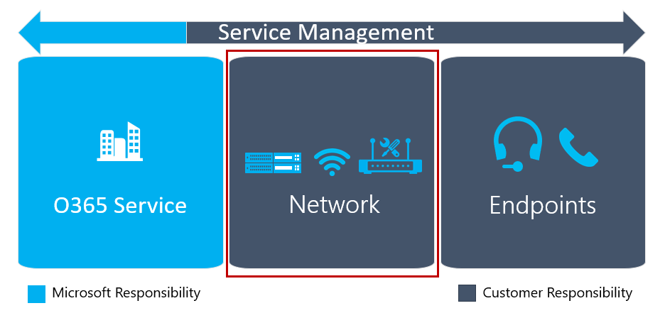

# 评估环境Evaluate my environment

## 评估您的环境简介Introduction to evaluating your environment 

为了实现目标搜索结果 (OKRs)，以前做关键服务的决策。To achieve your objective key results (OKRs), you previously made key service decisions. 下一步是执行环境研究，以评估与您的 IT 的所有方面和电话基础架构、 网络和操作，以确认您的组织已准备好实施解决方案。The next step is to perform environmental discovery to evaluate all aspects relating to your IT and telephony infrastructure, networking, and operations to confirm that your organization is ready to implement the solution.

环境的发现过程必须包括网络就绪性评估，以确保您的网络可以支持音频会议或电话系统调用计划服务的实现。Environmental discovery must include network readiness assessment to ensure your network can support the implementation of the Audio Conferencing or Phone System with Calling Plan services.

作为一个环境评估和采用准备情况评估，识别技术风险并制定每个确定的风险的缓解计划。You identify technical risks as part of an environmental assessment and adoption readiness evaluation, and develop a mitigation plan for each identified risk.
应该采用风险登记簿中的此信息。You should incorporate this information in the risk register.

<!--ENDOFSECTION-->

## 当前环境Current environment

作为您环境的发现，包括最终用户计算，如 Pc 和移动设备与调用计划的业务用例，从硬件要求支持音频会议和电话系统准备情况评估相关的所有事宜软件要求。As part of your environmental discovery, include all matters related to end-user computing, such as a readiness assessment of PCs and mobile devices to support Audio Conferencing and Phone System with Calling Plan business use cases, from hardware requirements to software requirements.

是否需要[传送到 Microsoft 的电话号码](https://docs.microsoft.com/SkypeForBusiness/what-are-calling-plans-in-office-365/transfer-phone-numbers-to-office-365)，还可以揭示环境的发现。Environmental discovery can also uncover whether you need to [transfer phone numbers to Microsoft](https://docs.microsoft.com/SkypeForBusiness/what-are-calling-plans-in-office-365/transfer-phone-numbers-to-office-365).
了解这将有助于您的组织，其项目计划进行相应的调整和准备的数字移植所需的信息。Knowing this will help your organization adjust its project plan accordingly and prepare the necessary information for number porting. 可以使用[Microsoft 小组范围内部署环境发现](https://docs.microsoft.com/MicrosoftTeams/environmental-discovery-for-microsoft-teams-rollout)从 MyAdvisor 执行环境的发现。You can use the [Environmental discovery for Microsoft Teams rollout](https://docs.microsoft.com/MicrosoftTeams/environmental-discovery-for-microsoft-teams-rollout) from MyAdvisor to perform environmental discovery.

<table>
<tr><td>  决策点Decision points</td><td><ul><li>谁将负责完成环境评估？Who will be responsible for completing an environment assessment?</li></ol></td></tr>
<tr><td> 后续步骤Next steps</td><td><ul><li>文档环境评估的结果。Document the results of the environment assessment.</li></ol></td></tr>
</table>

<!--ENDOFSECTION-->

## 采用和更改管理评估功能Adoption and change management assessment capabilities 

您可以通过执行角色分析，提出针对调用计划服务实现的音频会议和电话系统的角色的列表评估贵组织采用的准备工作。You can evaluate your organization’s adoption readiness by executing persona analysis to come up with a list of personas who can be targeted for the implementation of the Audio Conferencing and Phone System with Calling Plan services. 角色分析包括识别附加外围设备或其他设备需要来实现预期的业务成果。Persona analysis includes identifying additional peripheral devices or other devices required to realize the intended business outcomes.

若要执行角色分析，可以通过涉及相关的项目风险承担者，使用[角色协调](https://myadvisor.fasttrack.microsoft.com/CloudVoice/Downloads?SelectedIDs=4_2_0_7)研讨会牌和[角色特征矩阵](https://myadvisor.fasttrack.microsoft.com/CloudVoice/Downloads?SelectedIDs=4_2_0_8)进行研讨会。To perform persona analysis, you can conduct a workshop by involving relevant project stakeholders, using the [Persona Alignment](https://myadvisor.fasttrack.microsoft.com/CloudVoice/Downloads?SelectedIDs=4_2_0_7) workshop deck and [Persona Feature Matrix](https://myadvisor.fasttrack.microsoft.com/CloudVoice/Downloads?SelectedIDs=4_2_0_8).
可以使用[角色分析报表](https://myadvisor.fasttrack.microsoft.com/CloudVoice/Downloads?SelectedIDs=4_2_0_9)模板汇总报表中的角色分析研讨会的结果。You can summarize the results of the persona analysis workshop in a report by using the [Persona Analysis Report](https://myadvisor.fasttrack.microsoft.com/CloudVoice/Downloads?SelectedIDs=4_2_0_9) template.

>[!NOTE]
>尽管角色资产最初编写的 Skype 的在线业务，是与团队相关的大部分内容。Although the persona assets were initially written for Skype for Business Online, most of the content is relevant to Teams. 随意修改和删除不相关的项目目标的项目。Feel free to modify and remove items that aren’t relevant to your project goals.

<table>
<tr><td>  决策点Decision points</td><td><ul><li> 谁将负责完成角色的对齐方式和功能评估？Who will be responsible for completing a persona alignment and feature assessment?</li><li>评估执行采用和更改为您的组织管理能力。Evaluate your ability to perform adoption and change management for your organization.</li></ol></td></tr>

<tr><td> 后续步骤Next steps</td><td><ul><li>文档角色的对齐方式和功能评估的结果。Document the results of the persona alignment and feature assessment.</li><li>如有必要，与外部的资源来协助推动采用并更改为您的组织的管理。If required, engage outside resources to assist with driving adoption and change management for your organization.</li></ol></td></tr>
</table>

<!--ENDOFSECTION-->

## 网络就绪Network readiness

团队使用可适应于音频和视频技术 （编码解码器） — — 因此下更好地执行 — — 大多数的网络条件。Teams uses audio and video technology (codecs) that can adapt to—and therefore perform better under—most network conditions. 为了确保一致的最佳性能，应为团队准备您的网络。To ensure optimal and consistent performance, you should prepare your network for Teams.

## 记住的要点Key takeaways

这些都是从本指南的主要优点。These are the main takeaways from this guidance. 您必须：You must:

-   打开 TCP 端口 80 和 443 将使用团队的客户端的传出。Open TCP ports 80 and 443 outgoing from clients that will use Teams.

-   打开 UDP 端口 3478 通过从客户端将使用团队 3481 传出。Open UDP ports 3478 through 3481 outgoing from clients that will use Teams.

-   确保您有足够的带宽，通过完成[网络规划人员](https://myadvisor.fasttrack.microsoft.com/CloudVoice/NetworkPlanner)部署团队。Ensure that you have sufficient bandwidth for deploying Teams by completing the [Network Planner](https://myadvisor.fasttrack.microsoft.com/CloudVoice/NetworkPlanner).

-   运行[网络评估工具](https://www.microsoft.com/download/details.aspx?id=53885)，并确保您满足从边段和客户端网段中[媒体质量和网络连接的性能](https://docs.microsoft.com/SkypeForBusiness/optimizing-your-network/media-quality-and-network-connectivity-performance)描述的要求。Run the [Network Assessment Tool](https://www.microsoft.com/download/details.aspx?id=53885) and ensure that you meet the requirements described in [Media quality and network connectivity performance](https://docs.microsoft.com/SkypeForBusiness/optimizing-your-network/media-quality-and-network-connectivity-performance) from both the edge segment and the client segment.

## 为什么您应该准备您的网络？Why should you prepare your network?

我们看一看所采取的步骤之前，请务必了解什么可以影响性能的团队，从而用户幸福和满意度。Before we look at the steps to be taken, it’s important to understand what can affect the performance of Teams and thereby user happiness and satisfaction.
三个主要风险方面会影响用户如何感知网络质量：Three major risk areas can affect how users perceive network quality:

-   没有足够的可用带宽Insufficient bandwidth available

-   防火墙和代理服务器的阻止程序Firewall and proxy blockers

-   如抖动和数据包丢失的网络障碍Network impairments such as jitter and packet loss

下面介绍的步骤将帮助您确定您是否您的部署的所有这些因素可能会影响并有助于移向分辨率。The steps described below will help you determine whether your deployment might be affected by any of these factors and will help you move toward a resolution.
未能准备您的网络可能会导致用户不满，成本高昂，临时解决了。Failing to prepare your network will likely lead to dissatisfied users and costly, ad-hoc fixes. 准备您的网络，和您的组织 — — 团队，可以极大地提高成功的机会。By preparing your network—and your organization—for Teams, you can dramatically increase your chance of success.

<!--ENDOFSECTION-->

## 带宽规划Bandwidth planning

网络准备工作的第一步确保您的网络有足够的带宽供团队将提供给用户的情态。The first step toward network readiness is ensuring your network has enough bandwidth available for the modalities Teams will provide to users. 规划足够的带宽是一个相当简单的任务，门槛非常低开始，以确保您的用户将获得高质量的团队体验。Planning for sufficient bandwidth is a fairly straightforward task and a very low-barrier start to ensure your users will have a high-quality Teams experience.

您开始您的带宽规划旅行团队[我审查网站](https://myadvisor.fasttrack.microsoft.com/)上通过网络规划人员。You start your bandwidth planning journey for Teams on the [My Advisor website](https://myadvisor.fasttrack.microsoft.com/) by using the Network Planner. 网络规划人员提供每网站带宽规划团队，并提供了优化网络性能的建议。The Network Planner provides per-site bandwidth planning for Teams and offers recommendations for optimizing network performance.

### 本地互联网出口Local internet egress

在设计许多网络使用一个集线器和分支拓扑。Many networks were designed to use a hub and spoke topology. 在此拓扑中，互联网通信量通常通过 WAN 到中央数据中心之前它出现 （出口） 到互联网。In this topology, internet traffic typically traverses the WAN to a central datacenter before it emerges (egresses) to the internet. 通常情况下，这样做是为了集中网络安全设备，以降低整体成本的目标。Often, this is done to centralize network security devices with the goal of reducing overall cost.

跨广域网后拖拉流量增加延迟，对质量和用户体验的负面影响。Back-hauling traffic across the WAN increases latency and has a negative impact on quality and the user experience. 因为 Microsoft 的大型全球网络上运行 Microsoft 小组，是通常接近用户的网络对等位置。Because Microsoft Teams runs on Microsoft’s large global network, there’s often a network peering location close to the user. 用户通过尽快 egressing 出本地 internet 点靠近它们的位置和我们的声音进行了优化的网络到最有可能获得更好的性能。A user will most likely get better performance by egressing out of a local internet point close to their location and on to our voice-optimized network as soon as possible. 对于某些工作负载，使用 DNS 请求以便向发送通讯最近的前端服务器。For some workloads, DNS requests are used to send traffic to the nearest front-end server. 在这种情况下，非常重要，当使用本地出口点，则已配对使用本地 DNS 解析。In such cases, it’s important that when using a local egress point, it’s paired with local DNS resolution.

优化网络路径与 Microsoft 的全球网络将提高性能，并最终为用户提供最好的体验。Optimizing the network path to Microsoft’s global network will improve performance and ultimately provide the best experience for users. 有关详细信息，请参阅博客文章[获得最佳的连接和 Office 365 中的性能](https://techcommunity.microsoft.com/t5/Office-365-Blog/Getting-the-best-connectivity-and-performance-in-Office-365/ba-p/124694)。For more detail, see the blog post [Getting the best connectivity and performance in Office 365](https://techcommunity.microsoft.com/t5/Office-365-Blog/Getting-the-best-connectivity-and-performance-in-Office-365/ba-p/124694).

### VPNVPN

Vpn 将提供许多组织有价值服务。VPNs provide a valuable service to many organizations. 遗憾的是，通常不设计或配置为支持实时媒体。Unfortunately, they’re typically not designed or configured to support real-time media. 某些 Vpn 可能也不支持 UDP。Some VPNs might also not support UDP. Vpn 还引入了额外的顶部已被加密的介质流量加密。VPNs also introduce an extra layer of encryption on top of media traffic that’s already encrypted. 另外，为团队服务的连接可能不是由于头发固定通过 VPN 设备的通信效率高。In addition, connectivity to the Teams service might not be efficient due to hair-pinning traffic through a VPN device.
此外，他们不一定能够从产能角度来看适应团队将需要的预期的负载。Furthermore, they aren’t necessarily designed from a capacity perspective to accommodate the anticipated loads that Teams will require.

建议是提供备选路径绕过团队通信 VPN。The recommendation is to provide an alternate path that bypasses the VPN for Teams traffic. 这通常被称为*拆分隧道 VPN*。This is commonly known as *split-tunnel VPN*. 分拆隧道 Office 365 的通讯不通过 VPN，但将直接转到 Office 365 的手段。Split tunneling means that traffic for Office 365 won’t traverse the VPN but will go directly to Office 365. 此更改对质量，将产生积极影响，而且还提供辅助福利减少从 VPN 设备和组织的网络负载。This change will have a positive impact on quality, but also provides the secondary benefit of reducing load from the VPN devices and the organization’s network.

实现拆分隧道，请咨询您的 VPN 供应商的配置的详细信息。To implement a split-tunnel, consult with your VPN vendor for the configuration details.

### Wi-FiWi-Fi

如 VPN、 Wi-Fi 网络并不一定能设计或配置为支持实时媒体。Like VPN, Wi-Fi networks aren’t necessarily designed or configured to support real-time media. 规划，或优化，Wi-Fi 网络来支持团队，是优质部署的一个重要考虑。Planning for, or optimizing, a Wi-Fi network to support Teams is an important consideration for a high-quality deployment.

榜上有名的 Wi-Fi 网络优化的若干因素有：There are several factors that come into play for optimizing a Wi-Fi network:

-   实现 QoS 或 Wi-fi 多媒体 (WMM)，以确保该媒体通信获取相应地优先顺序通过 Wi-fi 网络。Implementing QoS or Wi-Fi Multimedia (WMM) to ensure that media traffic is getting prioritized accordingly over the Wi-Fi networks.

-   规划和优化的 Wi-Fi 区段和访问点的位置。Planning and optimizing the Wi-Fi bands and access point placement. 2.4 GHz 范围可能会提供足够的经验，根据接入点放置，但接入点通常受到运行在该范围内其他消费型设备。The 2.4 GHz range may provide an adequate experience depending on access point placement, but access points are often affected by other consumer devices that operate in that range. 5 GHz 范围更适合于实时媒体由于其密集的范围，但是需要更多的接入点以获得足够的覆盖范围。The 5 GHz range is better suited to real-time media due to their dense range but requires more access points to get sufficient coverage. 终结点还需要支持该范围和配置，以便相应地利用这些频带。Endpoints also need to support that range and be configured to leverage those bands accordingly.

-   如果部署双模 Wi-fi 网络，考虑实现带控制。If dual-band Wi-Fi networks are deployed, consider implementing band steering. 带控制是影响双波段客户端使用 5 GHz 范围的 Wi-Fi 供应商实现的技术。Band steering is a technique implemented by Wi-Fi vendors to influence dual-band clients to use the 5 GHz range.

-   当接入点的相同的通道太近时他们可以引起信号重叠并无意中竞争，从而导致糟糕的用户体验。When access points of the same channel are too close together they can cause signal overlap and unintentionally compete, resulting in a bad experience for the user. 确保在不重叠的通道上彼此相邻的接入点。Ensure that access points that are next to each other are on channels that don’t overlap.

每个无线供应商已部署其无线解决方案的建议。Each wireless vendor has its own recommendations for deploying its wireless solution. 我们建议您咨询您的供应商进行具体指导。We recommend that you consult your vendor for specific guidance.

<!--ENDOFSECTION-->

## 防火墙和代理服务器要求Firewall and proxy requirements

Microsoft 小组连接到 Microsoft Online Services，并为此需要互联网连接。Microsoft Teams connects to Microsoft Online Services and needs internet connectivity for this. 为团队才能正常工作，您必须打开 TCP 端口 80 和 443 从客户端到互联网，并通过从客户端到 internet 3481 3478 的 UDP 端口。For Teams to function correctly, you must open TCP ports 80 and 443 from the clients to the internet, and UDP ports 3478 through 3481 from the clients to the internet. TCP 端口用于连接到基于 web 的内容，如 SharePoint Online，Exchange 在线学习，以及团队聊天服务。The TCP ports are used to connect to web-based content such as SharePoint Online, Exchange Online, and the Teams Chat services.
通过这些 TCP 端口还连接的插件和连接器。Plug-ins and connectors also connect over these TCP ports. 四个 UDP 端口用于介质，例如，音频和视频，以确保它们正确流动。The four UDP ports are used for media such as audio and video, to ensure they flow correctly.

打开这些端口对于可靠的团队部署至关重要。Opening these ports is essential for a reliable Teams deployment. 封堵这些端口不支持和媒体质量的影响。Blocking these ports is unsupported and will have an effect on media quality.

如果您的组织要求您指定确切的 IP 地址范围和域都应该向其打开这些端口，您可以限制的目标 IP 地址范围和域为这些端口。If your organization requires that you specify the exact IP address ranges and domains to which these ports should be opened, you can restrict the target IP ranges and domains for these ports. 确切的端口的列表，协议和 IP 地址范围，请参阅[Office 365 的 Url 和 IP 地址范围](https://support.office.com/article/Office-365-URLs-and-IP-address-ranges-8548a211-3fe7-47cb-abb1-355ea5aa88a2#bkmk_teams)。For a list of exact ports, protocols, and IP ranges, see [Office 365 URLs and IP address ranges](https://support.office.com/article/Office-365-URLs-and-IP-address-ranges-8548a211-3fe7-47cb-abb1-355ea5aa88a2#bkmk_teams).
如果您选择限制的目标 IP 地址范围和域，您必须确保您保留的端口和范围列表最新因为它们可能会更改。If you choose to restrict the target IP address ranges and domains, you must ensure that you keep the list of ports and ranges up to date because they might change. 您可以订阅[该 RSS 源](https://go.microsoft.com/fwlink/p/?linkid=236301)发生更改时进行更新。You can subscribe to [this RSS feed](https://go.microsoft.com/fwlink/p/?linkid=236301) to be updated when changes occur. 它也是很好的做法，以测试是否通过定期运行[Skype 业务网络评估工具](https://www.microsoft.com/download/details.aspx?id=53885)打开所有端口。It’s also a good practice to test whether all ports are opened by running the [Skype for Business Network Assessment Tool](https://www.microsoft.com/download/details.aspx?id=53885) on a regular basis. 您可以了解有关此工具的功能的详细信息在下一节中。You can find out more about the functionality of this tool in the next section.

在要部署的代理服务器，我们建议您绕过代理服务器的所有团队服务。In the event of a proxy server being deployed, we recommend that you bypass the proxy server for all Teams services. 虽然使用代理可能起作用，就极有可能的质量将会降低由于强制媒体的使用而不是 UDP TCP。Although using a proxy might work, it’s very likely that quality will be reduced due to media’s being forced to use TCP instead of UDP. 代理服务器，绕过有关的详细信息，请参阅[Office 365 的 Url 和 IP 地址范围](https://docs.microsoft.com/MicrosoftTeams/office-365-urls-ip-address-ranges)。For more information about proxy servers and bypassing, see [Office 365 URLs and IP address ranges](https://docs.microsoft.com/MicrosoftTeams/office-365-urls-ip-address-ranges).

<!--ENDOFSECTION-->

## 测试网络Test the network

已经完成规划和网络准备之后 — — 包括升级的带宽和在防火墙中的打开端口 — 您应测试您的网络性能。After you’ve completed your planning and network preparation—including upgrading bandwidth and opening ports in the firewall—you should test your network’s performance. 该测试将结果绘制清楚任何网络优化或补救所需的音频会议或电话系统调用计划实施的成功。The results of this testing will paint a clearer picture of any network optimization or remediation required for the success of your Audio Conferencing or Phone System with Calling Plan implementation.

您可以下载[Skype 业务网络评估工具](https://www.microsoft.com/download/details.aspx?id=53885)来测试您的网络是否准备好团队。You can download the [Skype for Business Network Assessment Tool](https://www.microsoft.com/download/details.aspx?id=53885) to test whether your network is ready for Teams. 该工具提供了双重的功能： 它可以测试是否已打开正确的端口，并且它可以测试网络障碍。The tool offers dual functionality: it can test whether all the correct ports have been opened, and it can test for network impairments.

下载并安装该工具之后，您可以找到它在 c:\\程序文件\\Microsoft Skype 业务网络评估工具。After you download and install the tool, you can find it in C:\\Program Files\\Microsoft Skype for Business Network Assessment Tool. 该目录中包含有关如何使用该工具，Usage.docx 的详细的指导。A detailed guide for how to use the tool, Usage.docx, is included in that directory.

### 打开端口的测试Test for opened ports

打开一个命令提示符窗口并定位到网络评估工具目录输入**cd c:\\程序文件\\Microsoft Skype 业务网络评估工具**。Open a Command prompt window and navigate to the Network Assessment Tool directory by entering **cd C:\\Program Files\\Microsoft Skype for Business Network Assessment Tool**. 在命令提示符下，输入**networkassessmenttool.exe /connectivitycheck**开始打开端口测试At the command prompt, start the test for opened ports by entering **networkassessmenttool.exe /connectivitycheck**

运行后检查，该工具将显示消息"验证成功完成"或报告已阻止的端口上。After running the checks, the tool will either display the message “Verifications Completed Successfully” or report on the ports that were blocked.
它还生成一个文件，该文件命名为 Connectivity_results.txt，其中包含该工具的输出并将其存储在 %userprofile%\\应用程序数据\\本地\\microsoft Skype 业务网络评估工具\\目录。It also generates a file named Connectivity_results.txt, which contains the output from the tool and stores it in the %userprofile%\\appdata\\local\\microsoft skype for business network assessment tool\\ directory.

我们建议您运行定期以确保端口已打开，并且可以正常连接检查。We recommend that you run the connectivity checks on a regular basis to ensure the ports have been opened and are functioning correctly.

### 测试网络障碍Test for network impairments

为了提高用户满意度，应该限制网络上任何障碍。To increase user satisfaction, you should limit any impairments on your network.
最常见的网络障碍被延迟 （等待时间）、 数据包丢失，并且抖动：The most common network impairments are delay (latency), packet loss, and jitter:

-   **延迟时间：**这是获得点 A 到点 B 网络 IP 数据包所需的时间。**Latency:** This is the time it takes to get an IP packet from point A to point B on the network. 这种网络传播延迟实质上限制到两个点光源，包括额外的系统开销之间采取的各种路由器的速度之间的物理距离。This network propagation delay is essentially tied to physical distance between the two points and the speed of light, including additional overhead taken by the various routers in between.
    单向或往返时间延迟的衡量标准。Latency is measured as one-way or round-trip time.

-   **数据包丢失**： 这通常指在给定的时间窗口中丢失的数据包的百分比。**Packet loss**: This is often defined as a percentage of packets that are lost in a given window of time. 数据包丢失率直接影响语音质量 — — 小，从单个丢失几乎没有影响到背对背突发包丢失的数据包导致音频来完全切除。Packet loss directly affects audio quality—from small, individual lost packets having almost no impact to back-to-back burst losses that cause audio to cut out completely.

-   **间数据包到达时抖动或只是抖动：**这是连续数据包之间的延迟的平均变化。**Inter-packet arrival jitter, or simply jitter:** This is the average change in delay between successive packets. 大多数现代 VoIP 软件，包括 Skype 业务，可以适应抖动缓冲通过某些级别。Most modern VoIP software, including Skype for Business, can adapt to some levels of jitter through buffering. 它是抖动的只有当抖动超过缓冲参与者会注意到的影响。It's only when the jitter exceeds the buffering that a participant will notice the effects of jitter.

这些障碍中的最大值所述[介质质量和网络连接的性能](https://docs.microsoft.com/SkypeForBusiness/optimizing-your-network/media-quality-and-network-connectivity-performance)。The maximum values for these impairments are described in [Media quality and network connectivity performance](https://docs.microsoft.com/SkypeForBusiness/optimizing-your-network/media-quality-and-network-connectivity-performance).
当测试有这些障碍，我们来区分两个独立的网段：When testing for these impairments, we distinguish between two separate segments:

-   *边缘线段*是路由器居住在其中的段。The *edge segment* is the segment in which your router lives. 这是最接近的逻辑网络段连接到互联网在每个位置。This is the closest logical network segment connected to the internet at each of your locations. 在大多数情况下，这是路由器，或可能是一个外围网络 （也称为*DMZ*、*非军事区*和*屏蔽子网*） 的连接点。In most cases, this is the connection point of the router, or possibly a perimeter network (also known as *DMZ*, *demilitarized zone*, and *screened subnet*). 这一段和 internet 之间发生影响路由器的设备没有进一步通信。No further traffic that affects devices other than the router should occur between this segment and the internet.

-   *客户端网段*是客户机驻留在其中的逻辑网络段。The *client segment* is the logical network segment in which your clients reside.

应通过网络评估工具来测试这两个领域。You should test both segments by using the Network Assessment Tool. 若要测试此段，定位到的目录并输入**networkassessmenttool.exe**命令提示符处。To test the segment, navigate to the directory and enter **networkassessmenttool.exe** at the command prompt. 结果写入一个名为 Results.tsv，文件，则可以为每个段的[要求](https://docs.microsoft.com/en-us/SkypeForBusiness/optimizing-your-network/media-quality-and-network-connectivity-performance?ui=en-US&rs=en-US&ad=US)进行比较。The results are written to a file named Results.tsv, and you can compare them to the [requirements](https://docs.microsoft.com/en-us/SkypeForBusiness/optimizing-your-network/media-quality-and-network-connectivity-performance?ui=en-US&rs=en-US&ad=US) for each segment.

请注意这两个领域，必须满足高质量部署的要求。Note that both segments must meet the requirements for a high-quality deployment. 我们建议您运行该工具的一个小时内多次直才能清楚地表明您的网络性能。We recommend that you run the tool multiple times for one hour straight to get a good indication of your network’s performance.

<!--ENDOFSECTION-->

## 网络更新Network remediation

如果带宽规划、 端口测试或网络要求测试的结果显示您当前的网络部署团队之前，需要对其进行修正，可以通过多种方法完成此操作：If the results of bandwidth planning, port testing, or network requirements testing show that your current network needs remediation before you deploy Teams, you can accomplish this in several ways:

-   没有足够的带宽，升级连接以便可以排到 Office 365 的通信而没有影响。For insufficient bandwidth, upgrade connections so that traffic to Office 365 can flow unhindered.

-   有关被阻止的端口更改防火墙规则并重新测试端口。For blocked ports, change firewall rules and retest the ports.

-   对于网络障碍始终执行根本原因分析。For network impairments, always perform a root-cause analysis.

服务质量 (QoS) 可用于通过的优先排序和分隔的通信来战役障碍。Quality of service (QoS) can be used to battle impairments by prioritizing and separating traffic. 有些组织选择部署 QoS 来克服带宽问题或限制流的流量的量。Some organizations choose to deploy QoS to overcome bandwidth issues or restrict the amount of traffic flowing. 这将不会提高质量，并将导致新的问题。This won’t improve quality and will lead to new problems. 网络障碍超过要求时，应始终执行根本原因分析。A root-cause analysis should always be performed when network impairments exceed requirements. QoS 是解决方案。QoS can be a solution.
有关详细信息，请参阅[Microsoft 小组中的服务质量](https://docs.microsoft.com/MicrosoftTeams/qos-in-teams)。For more information, see [Quality of Service in Microsoft Teams](https://docs.microsoft.com/MicrosoftTeams/qos-in-teams).

>[!NOTE]
>很多网络随由于升级、 扩展或其他业务要求的时间。Many networks evolve over time due to upgrades, expansion, or other business requirements. 确保让您的操作过程来维护这些区域作为服务管理计划的一部分。Ensure that you have operational processes in place to maintain these areas as part of your service management planning.

<table>
<tr><td>  决策点Decision points</td><td><ul><li>谁将负责完成正确的网络评估跨所有网络段和组织位置？Who will be responsible for completing proper network assessments across all network segments and organization locations?</li></ol></td></tr>
<tr><td> 后续步骤Next steps</td><td><ul><li>您可以执行详细的网络评估，以帮助确保您的网络是 Microsoft 小组部署准备工作就绪。You can perform a detailed network assessment to help ensure your network is ready for your Microsoft Teams deployment. 有关详细信息，请参阅[网络就绪性评估](https://myadvisor.fasttrack.microsoft.com/CloudVoice/Offers?pageState=NetworkReadiness)。For more information, see [Network Readiness Assessment](https://myadvisor.fasttrack.microsoft.com/CloudVoice/Offers?pageState=NetworkReadiness).</li><li>执行网络修正根据每个网段的网络就绪状态评估的结果。Perform network remediation based on the results of the Network Readiness Assessment for every network segment.</li></ol></td></tr>
</table>

<!--ENDOFSECTION-->