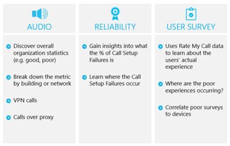

# 规划我服务管理

本文概述了所需提供和维护高质量的 Microsoft 团队部署的要求。 在首次试点或生产部署之前，可以通过在展望阶段规划服务管理和质量来帮助确保部署得以成功。

## 服务管理团队

服务管理是一个非常广泛的主题，涵盖了部署 Microsoft Teams 服务并为用户启用该服务后该服务的日常操作。 Teams 服务包括 Microsoft Office 365 和在本地部署的基础结构组件（例如网络）。

对于大多数组织而言，服务管理概念很可能不是一个新概念。 你可能已经实施了与现有服务关联的流程和任务。 尽管如此，当你现在规划服务管理以在将来支持 Microsoft Teams 时，你可能会扩大已实施的方面。

服务管理包含管理 Microsoft Teams 端到端时涉及的所有活动和流程。 服务管理的某些组件 — 包含 Office 365 服务本身的基础结构组件 — 是 Microsoft 的责任，而客户负责为其用户管理团队，网络的各个方面和它们提供的终结点。
团队服务管理和它与支持的用户体验质量的关键组件的客户责任的完整讨论，请参阅[规划服务管理和质量](https://docs.microsoft.com/MicrosoftTeams/envision-planning-for-service-management-and-quality-complete-guide)。

<!--ENDOFSECTION-->

## 《操作指南》简介 

**什么内容**、**什么人**和**什么方式**是在讨论服务质量时需要回答的三个重要问题。

你可以使用《[操作指南](https://docs.microsoft.com/MicrosoftTeams/1-drive-value-operate-my-service)》帮助你解决所有这三个问题。 该指南提供了每天、每周、每月及按需执行的活动列表。 这些活动和任务对于维护高质量 Teams 部署至关重要。 确定谁将负责在服务管理中执行特定活动是在展望阶段早期需要执行以确保部署得以成功的规划的关键方面。 在确定了任务和活动后，需要你将其分配到的小组或个人了解并遵循这些任务和活动。 《操作指南》提供了有关如何执行每个任务的知识和指导，以及/或外部内容的参考。

## 规划操作的角色映射

早期规划服务管理是一个关键的里程碑，因为在启用首批试点用户时即开始操作阶段。 项目团队必须审阅并同意所需的任务和活动，确定负责每个可操作任务的团队，以及得到各个团队的承诺和签字认可。

在完成签字认可后，负责团队必须开始执行这些角色和职责。 这可能包括培训和就绪工作、更新人员配置模型或确保外部合作伙伴已准备好交付。

在构想阶段的早期映射操作的角色使所有团队试验和掌握操作过程中启动其操作任务，并确保一切就绪后部署启动。

《操作指南》提供了映射到在大多数方案中应该会有效的典型角色的常见任务列表。 你需要自定义这些职责以适用于你的组织。

>[!TIP]
>下面是模板文档的操作的角色映射练习执行以支持此项目的结果的示例。

|运营角色 |说明 |团队 |联系详细信息 |
|---------|---------|---------|---------|
|服务所有者|服务所有者、与业务部门的接口、策略|TBA|TBA|
|音频会议运营|日常运营、用户和设备帐户移动/添加/更改、监控|TBA| TBA| 
|租户管理员|更改租户范围的设置、启用新功能|TBA|TBA|
|支持|若要获取支持的用户界面|TBA|TBA|
|网络运营|运行 LAN、 WAN、 Wi-fi 和 internet 访问|TBA|TBA|
|客户端和终结点团队|管理桌面部署|TBA|TBA|
|标识运营|管理 Active Directory、 Active Directory 联合身份验证服务 （Azure AD） 的标识基础结构|TBA|TBA|
|采用/变更管理|管理认知、 培训和解决方案的采用|TBA|TBA|
|Exchange 运营|管理 Exchange 环境|TBA|TBA|
|电话服务操作|管理 SBC 和电话号码|TBA|TBA|

加快更详细的操作的角色映射，包括任务与每个操作的角色相关联，则可以使用[操作的角色映射工作簿](https://myadvisor.fasttrack.microsoft.com/CloudVoice/Downloads?SelectedIDs=4_4_0_16)捕获将提供周围的角色及职责清楚的详细信息支持云语音工作负荷。

<!--ENDOFSECTION-->

## 质量支持者角色

在所有组织中，都需要小组或个人为质量负责。
这是服务管理中最重要的角色。 客户角色分配给用户或用户组属于热心有关其用户体验质量冠军。 此角色要求具有识别环境中的趋势的技能，以及能够支持与其他团队合作以推动修正。
最适合进行质量冠军通常是客户服务所有者，人员 — 取决于组织的规模和复杂性 — 可以是任何人或团队致力于用户体验。

质量冠军利用现有的工具和记录操作过程中，如呼叫质量仪表板 (CQD) 和质量体验审阅指南要监视的用户体验，请确定质量趋势和驱动器修正在需要时。 质量冠军处理驱动器修正操作，各个团队报告给调控委员会其进度和解决问题。

任务和与角色相关联的活动均编档在操作指南 》。 应在展望阶段早期分配此角色。 执行质量支持者角色时的一个主要步骤是获取该角色所需的知识，以及确保在执行任务时满足先决条件。 此角色的一个主要任务是运行定期质量体验评审。

<!--ENDOFSECTION-->

## 《体验质量评审指南》简介

质量体验审阅指南有一组活动的评估，并提供对改善用户体验的影响最大，如下图所示的主要区域中的补救指南。

通过持续评估并修正本文档中所述的方面，你可以降低其对用户体验的潜在负面影响。 在部署中遇到的大多数用户体验问题可以分为以下类别：

-   防火墙或代理配置不完整

-   Wi-Fi 覆盖范围较小

-   带宽不足

-   VPN

-   使用了未优化或内置的音频设备

-   子网或网络设备存在问题

《体验质量评审指南》主要指导如何将通话质量仪表板 (CQD) 作为主要工具进行在线使用来报告和调查所述的每个方面，且重点在音频方面，以最大限度地提高采用率和作用。 为了改进音频体验而对网络所做的任何优化也将会直接带来视频和桌面共享的改进。

我们强烈建议您在早期提名质量冠军。 正在提名之后, 他们应开始熟悉[质量体验审阅指南](https://aka.ms/qerguide)中的内容。

<table>
<tr><td>  决策点</td><td><ul><li>决定由谁来负责在组织中的云语音操作。</li></ol></td></tr>
<tr><td> 后续步骤</td><td><ul><li>下载规划服务管理完整指南。</li><li>下载质量体验审阅指南。</li><li>查看全文操作指南。</li><li>提供所有指南以查看并熟悉操作要求每个操作工作组成员。</li></ol></td></tr>
</table>

<!--ENDOFSECTION-->