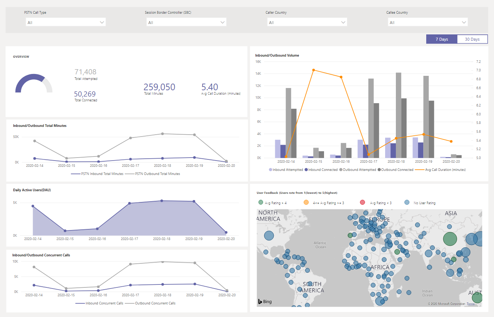

# 使用 CQD PSTN 直接路由报告

2020年3月新增，我们已将 CQD PSTN 直接路由报告添加到可下载[的 POWER BI 查询模板 FOR CQD](https://github.com/MicrosoftDocs/OfficeDocs-SkypeForBusiness/blob/live/Teams/downloads/CQD-Power-BI-query-templates.zip?raw=true)。 

CQD PSTN 直接路由报告可帮助客户了解其 PSTN 服务的使用模式和质量。有关 SBC、电话服务、网络参数和网络有效性比率的详细信息和用法的信息业务. 此信息可帮助你识别问题，包括断开呼叫的原因。 例如，你将能够知道何时丢弃卷，多少通话受到了原因的影响。

CQD PSTN 直接路由报告包含四个部分：

  - [PSTN 概述](#pstn-overview)

  - [服务详细信息](#service-details)

  - [网络有效性比率](#network-effectiveness-ratio)

  - [网络参数](#network-parameters)

## PSTN 概述

CQD PSTN 直接路由报告提供有关过去180天内服务的整体运行状况的以下信息。

例如，如果你对通过 SBC abc.bca.adatum.biz 进行的所有入站呼叫的整体使用和运行状况感兴趣，我们作为内部国家/地区：

| **拨出** | **说明**                                                                                                                                                 |
| ------------ | --------------------------------------------------------------------------------------------------------------------------------------------------------------- |
| 1            | 你可以使用顶部的筛选器向下钻取，并选择 "ByotIn" 作为 "呼叫类型"、"abc.bca.contoso.com" 作为 "会话 Boarder" 控制器和 "美国内部国家"。 |
| ppls-2            | 过去180天的使用趋势。 你可以在服务详细信息页面上找到使用率详细信息报表。                                                                     |
| 3            | 过去180天后的拨号延迟、延迟、抖动和数据包损失趋势。 你可以在 "网络参数" 页面上找到详细报告。                           |
| 4            | 过去180天内的同时通话和每日活动用户趋势。 此图可帮助你了解服务的最大数量。                            |
| 5            | 最大通话结束原因过去180天受影响的服务质量。 你可以在 "网络有效比率（NER）" 页面上找到服务运行状况详细信息。                    |

## 服务详细信息

此页面提供每天的服务使用趋势和用户反馈按地理位置划分。

  - **总尝试通话–** 总尝试在该时间范围内调用，包括成功和失败的调用

  - **已连接的通话总数-** 该时间范围内已连接的通话总数

  - **总分钟数-** 该时间范围内的总分钟使用率

  - **每日活动用户（DAU）-** 一天内至少进行一次连接通话的每日活动用户计数

  - **同时拨打-** 一分钟内最多同时进行活动通话

  - **用户反馈-**"评价我的通话" 分数来自用户。 3-5 被视为一种良好的通话。 1-2 被视为错误调用。

例如：

1.  如果在02/14/2020 中看到 "平均呼叫持续时间" 为0，则可以首先检查呼叫音量是否正常，并查看总连接呼叫和总尝试呼叫之间是否存在重大差异。 然后转到 "网络有效性比率" 页面以投资于呼叫失败原因。

2.  如果看到用户反馈图上增加了红色点，则可以转到 "网络有效性比率" 页面和 "网络" 参数以查看是否存在任何异常，并且你可以使用 MS 服务台提升票证。

## 网络有效性比率

这是 "整体运行状况" 仪表板上显示的相同指标。 您可以在每小时的网络有效性比率下查看具有受影响的通话方向（入站/出站）的每小时 NER 号码和通话结束原因图表。

  - **NER** -功能（%）通过测量发送的呼叫数与发送给收件人的呼叫次数进行通话的网络。

  - **SIP 响应代码**-一个三位整数响应代码显示呼叫状态。

  - **Microsoft 响应代码**-从 Microsoft 组件发出的响应代码。

  - **说明**-对应于 SIP 响应代码和 Microsoft 响应代码的 "原因" 阶段。

  - **受影响的通话数**-在所选时间范围内，通话总次数受到影响。

> 
> 
例如：

如果每日 NER 在02/05/2020 上有一个 dip，则可以单击日期，其他图表将缩放到该特定日期。

根据每小时 NER 的有效百分比，你可以发现在21:00 附近发生了 dip。 然后再次单击以缩放到小时21并查看受影响的通话详细信息，查看该小时内的通话失败的次数以及呼叫结束原因。 如果问题与 SBC 无关，则可以在任何 SBC 问题或向服务台报告时开始进行自我诊断。

## 网络参数

所有网络参数都通过直接路由接口测量到会话边界控制器。 有关推荐值的信息，请参阅为[Microsoft 团队准备组织的网络](prepare-network.md)，并查看客户边缘到 microsoft Edge 推荐值。

  - **抖动**——使用 RTCP （RTP 控制协议）在两个终结点之间计算的网络传播延迟时间变化的毫秒度量。

  - **数据包丢失**-这是一种无法送达数据包的指标;它在两个终结点之间进行计算。

  - **滞后**时间（也称为往返行程时间）是发送信号所需的时间长度加上接收该信号所需的时间长度。 此时间延迟由信号的两个点之间的传播时间组成。

> 

例如：

如果在四个图表（延迟、抖动、程序包丢失率、Post 延迟）上看到一个峰值，例如，在02/14/2020 上的延迟，请单击日期点。 并且底部的每小时趋势图将刷新以显示小时数。 你可以检查 SBCs 或使用 MS 服务台提升票证。

## 相关主题

[使用 Power BI 分析 Microsoft 团队的 CQD 数据](CQD-PSTN-report.md)