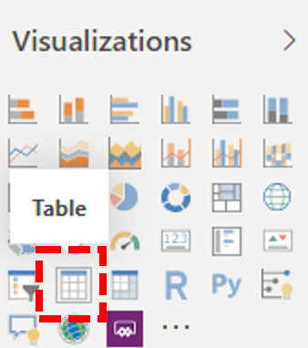

# 安装 Power BI Connector 以使用 CQD 查询模板Install Power BI Connector to use CQD query templates

在你可以对 CQD （.PBIX 文件）使用 Power BI 查询模板之前，你需要使用[下载](https://github.com/MicrosoftDocs/OfficeDocs-SkypeForBusiness/blob/live/Teams/downloads/CQD-Power-BI-query-templates.zip?raw=true)中包含的*MicrosoftCallQuality*文件来安装 MICROSOFT CQD 的 power bi 连接器。Before you can use the Power BI query templates for CQD (PBIX files), you'll need to install the Power BI Connector for Microsoft CQD, using the *MicrosoftCallQuality.pqx* file included in the [download](https://github.com/MicrosoftDocs/OfficeDocs-SkypeForBusiness/blob/live/Teams/downloads/CQD-Power-BI-query-templates.zip?raw=true). 

已阅读 "[使用 POWER BI" 来分析 CQD 数据，以供团队](CQD-Power-BI-query-templates.md)了解有关这些模板的信息。Read [Use Power BI to analyze CQD data for Teams](CQD-Power-BI-query-templates.md) to learn about these templates.

请确保你拥有访问 Power BI 报表的正确[CQD 访问角色](https://docs.microsoft.com/microsoftteams/turning-on-and-using-call-quality-dashboard#assign-roles-for-accessing-cqd)。Make sure you have the right [CQD access role](https://docs.microsoft.com/microsoftteams/turning-on-and-using-call-quality-dashboard#assign-roles-for-accessing-cqd) to access the Power BI reports. 

## 安装Installation

[POWER BI 文档](https://docs.microsoft.com/power-bi/desktop-connector-extensibility)中详细介绍了安装自定义连接线和调整安全性以启用连接器使用的过程。The process for installing a custom connector and adjusting security to enable use of the connector is described in detail in the [Power BI documentation](https://docs.microsoft.com/power-bi/desktop-connector-extensibility). 为了简便起见，下面是一个快速说明：For the sake of simplicity, here's a quick explanation:

1.  检查您的计算机是否已有 " \* \[ \] \\ Power BI desktop \\ 自定义连接线\*"   文件夹。Check to see if your computer already has a *\[Documents\]\\Power BI Desktop\\Custom Connectors* folder. 如果不是，请创建此文件夹。1If not, create this folder.1

2.  下载连接器文件（即\* \* mez*或* \* pqx*文件），并将其放在 "*自定义连接器\*" 目录中。Download the connector file (either a *\*.mez* or *\*.pqx* file) and place it in the *Custom Connectors* directory.

3.  **如果连接器文件是* \* mez*文件，\*\* 则还需要调整您的安全设置，如[自定义连接器设置文档](https://docs.microsoft.com/power-bi/desktop-connector-extensibility#data-extension-security)中所述。**If the connector file is a *\*.mez* file,** you will also need to adjust your security settings as described in the [custom connector setup documentation](https://docs.microsoft.com/power-bi/desktop-connector-extensibility#data-extension-security).

如果已释放此 Power BI Connector for Microsoft 团队的新版本，只需将*自定义连接器*目录中的旧的连接线文件替换为新文件。If a new version of this Power BI Connector for Microsoft Teams is released, simply replace the old connector file in the *Custom Connectors* directory with the new file.

## 设置Setup

为了生成报表并运行查询，首先需要连接到 CQD 数据源。In order to build a report and run queries, you will first need to connect to the CQD data source. 请按照以下步骤进行连接：Follow the steps below in order to connect:

1.  在 Power BI Desktop 的 "开始" 选项卡中，单击 "*获取数据*"。In the Home tab of Power BI Desktop, click on *Get Data*.

    

2.  此时应显示 "*获取数据*" 窗口。The *Get Data* window should appear at this point. 导航到 "*联机服务*"，然后选择 " *Microsoft 通话质量（Beta）* " 和 "点击*连接*"。Navigate to *Online Services*, then select *Microsoft Call Quality (Beta)* and hit *Connect*.

    

3.  系统将提示您登录下一步。You will be prompted to login next. 使用与用于 CQD 的凭据相同的凭据。2Use the same credentials that you use for CQD.2

4.  下一条提示将为你提供两种*数据连接模式*之间的选项。The next prompt will give you the option between two *Data Connectivity modes*. 选择 " *DirectQuery* "，然后点击 *"确定"*。Select *DirectQuery* and hit *OK*.

5.  最后，你将获得最终提示，显示 CQD 的整个数据模型。Finally, you will be given a final prompt showing you the entire data model for CQD. 在此情况下，将仅显示数据，CQD 的数据模型。No data will be visible at this point, only the data model for CQD. 选择 "*加载*" 以完成设置过程。Select *Load* to complete the setup process.

6.  此时，Power BI 会将数据模型加载到窗口右侧。At this point, Power BI will load the data model onto the right side of the window. 该页将保留为空，并且默认情况下不会加载任何查询。The page will remain otherwise blank, and no queries will be loaded by default. 继续**构建以下查询**，以便构建查询并返回数据。Proceed to **Building Queries** below in order to build a query and return data.

如果此设置过程中的任何步骤不完全明确，可在[此处](https://docs.microsoft.com/power-bi/desktop-quickstart-connect-to-data)找到更详细的流程说明。If any of the steps during this setup process were not completely clear, a more detailed explanation of the process can be found [here](https://docs.microsoft.com/power-bi/desktop-quickstart-connect-to-data).

## 构建查询Building Queries

安装完成后，应在 "*字段*" 窗格中看到几百个维度的名称和度量值的加载。Once setup is complete, you should see the names of several hundred dimensions and measures load in the *Fields* pane. 从此处构建实际查询非常简单，只需选择所需的查询的维度和度量值，然后将其拖放到页面上。Constructing actual queries from here is simple, just select the dimensions and measures you want for your query, then drag and drop them onto the page. 下面是更详细的说明，有一个简单的示例：Here's a more detailed explanation, with a simple example:

1.  从 "*可视化*" 窗格中选择要使用的可视化效果。Select the visualization you want to use from the *Visualizations* pane. 该可视化对象的空白版本应显示在页面上。A blank version of that visualization should appear on the page. 对于此示例，我们将使用*表格*可视化效果。For the purposes of this example, we will be using the *Table* visualization.

    

2.  确定要用于查询的维度和度量值（由聚合符号表示），然后手动选择它们并将其拖动到黑色可视化效果中。Determine which dimensions and measures (denoted by an aggregation symbol by their name) you wish to use for your query, then manually select them and drag them onto the black visualization. 或者，将其拖动到 "可视化" 选项下方的 "*值*" 字段。Alternately, drag them onto the *Values* field beneath the visualization options.

    

    > [!IMPORTANT] 
    > 通话质量仪表板要求运行任何查询的度量值。Call Quality Dashboard requires a measure for any query to run. 无法将度量值添加到查询将导致该查询失败。Failure to add a measure to a query will cause that query to fail.

3.  接下来，选择要筛选的任何维度，并将其拖动到 "*筛选器*" 窗格中*此视觉字段上的筛选器*。Next, select any dimensions you want to filter on and drag them to the *Filters on this visual* field in the *Filters* pane. CQD Power BI 连接器当前支持*基本筛选*（从可能的维度值列表中选择值）、*高级筛选*（手动指定值和要筛选的操作数，类似于高级 CQD），以及*相对日期筛选*（仅适用于 "*结束时间*" 和 "*开始时间*" 维度）。The CQD Power BI Connector currently supports *Basic filtering* (select values from a list of possible dimension values), *Advanced filtering* (manually specify values and operands to filter on, similar to Advanced CQD), and *Relative date filtering* (only available for the *End Time* and *Start Time* dimensions). CQD 不支持按*Top N*进行筛选。Filtering according to *Top N* is not supported by CQD.

    

4.  最后，选择 "*可视化*" 窗格中的 "*格式*" 选项卡以设置查询样式并设置其格式。Finally, select the *Format* tab within the *Visualizations* pane to style and format your query.

    > [!NOTE]
    > CQD 查询至少需要一个度量值才能运行。CQD queries require at least one measure in order to run. 如果查询未加载，请仔细检查查询中是否已包含度量值。If your query does not load, double check that you have included a measure in the query.

## 创建钻取报表Creating a Drillthrough Report

[POWER BI 中的钻取](https://docs.microsoft.com/power-bi/desktop-drillthrough)允许你创建具有焦点的报表，你可以使用其他报表的值作为上下文快速筛选。[Drillthrough in Power BI](https://docs.microsoft.com/power-bi/desktop-drillthrough) allows you to create focused reports that you can quickly filter using the values of other reports as context. 了解如何使用 CQD 连接器创建你的第一个查询后，创建钻取变得更简单。Once you know how to create your first query with the CQD Connector, creating a drillthrough is even simpler.

1.  为焦点报表创建另一页，然后将查询添加到该页面。Create another page for the focused report, and then add your queries to that page.

2.  选择要用作钻取筛选器的维度，并将其拖到 "*可视化*" 窗格上的 "*钻取*" 字段中。Select the dimension you want to use as a drillthrough filter and drag them onto the *Drillthrough* field under on the *Visualizations* pane.

    

3.  **就是这样\!****That's it\!** 其他使用该维度的页面上的任何其他查询现在都可以钻取到该页面，并自动将钻取维度的值应用为筛选器。Any other query on another page that uses that dimension can now drillthrough to that page, automatically applying the drillthrough dimension's value as a filter.

    

与高级 CQD 不同，Power BI 支持非顺序钻取。Unlike Advanced CQD, Power BI supports non-sequential drillthrough. 只要查询包含必要的维度，它就可以钻取到任何其他页面。So long as a query includes the necessary dimension, it can drillthrough to any other page.

### 最佳做法Best practice

通话质量连接器查询的设计应考虑钻取功能。Call Quality connector queries should be designed with drillthrough functionality in mind. 不要尝试一次加载所有数据，然后再通过筛选器进行切片，从更广泛、低基数的查询开始，然后向下钻取到高基数查询。Instead of trying to load all the data at once, and then slicing down with filters, start with broader, low-cardinality queries and drill down to high-cardinality queries. 例如，当尝试诊断哪些子网最大程度地影响了最高质量的问题时，首先确定导致问题的那些地区和国家，然后向下钻取到该地区或国家/地区的子网。For instance, when attempting to diagnose which subnets contribute most to quality issues, it's helpful to first identify those regions and countries which contribute to the problem, then drill down to the subnets in that region or country. 通话质量连接器模板已采用这种方式进行设计，以便充当示例。The Call Quality connector templates have been designed in this manner in order to act as an example.

## 优缺点Limitations

尽管使用 Power BI，但并非所有 Power BI 功能都是由 CQD 连接器支持的，这是由于 CQD 数据模型或对 DirectQuery 连接器的限制。Despite making use of Power BI, not all Power BI functionality is support by the CQD Connector, either as a result of limitations on CQD data model or on DirectQuery connectors in general. 下面的列表显示了其他连接线的一些更值得注意的限制，但此列表不应被认为是详尽的：The list below notes some of the Connector's more noteworthy limitations, but this list should not be considered exhaustive:

1.  **计算列-** DirectQuery 连接器通常对 Power BI 中的计算列有有限支持。**Calculated Columns –** DirectQuery connectors in general have limited support for calculated columns in Power BI. 虽然某些计算列可能与连接线一起使用，但这些计算列应视为异常。While some calculated columns may work with the Connector, these should be considered exceptions. 作为一般规则，计算列将不起作用。As a general rule, calculated columns will not function.

2.  **聚合-** CQD 数据模型基于多维数据集模型构建，这意味着聚合在度量形式中已受支持。**Aggregations –** The CQD data model is built on a cube model, meaning that aggregations are already supported in the form of measures. 尝试手动将聚合添加到不同的维度或更改度量值的聚合类型将不会与连接器一起使用，并且通常会导致错误。Attempting to manually add aggregations to different dimensions or changing the aggregation type of a measure will not work with the Connector, and it will generally result in an error.

3.  **自定义视觉对象-** 虽然 CQD 连接器与一系列自定义视觉对象一起工作，但我们无法保证与所有自定义视觉对象的兼容性。**Custom Visuals –** While the CQD Connector does work with a range of custom visuals, we are unable to guarantee compatibility with all custom visuals. 许多自定义视觉对象依赖于使用计算列或导入的数据，而不受 DirectQuery 连接线支持。Many custom visuals rely on the use of calculated columns or imported data, neither or which are supported by DirectQuery connectors.

4.  **引用缓存的数据-** Power BI 目前不支持以任何方式引用 DirectQuery 连接器中的缓存数据。**Referencing Cached Data –** Power BI currently does not support referencing cached data from a DirectQuery connector in any way. 任何引用查询结果的尝试都将导致新查询。Any attempt to reference the results of a query will result in a new query. 

5.  **相对数据筛选-** 在 CQD 连接器中受支持，但仅限 "*开始时间*" 和 "*结束时间*" 维度。**Relative Data Filtering –** Is supported in the CQD Connector, but only with the *Start Time* and *End Time* dimensions. 虽然*日期*维度可能是相对日期筛选的明显选择，但*日期*不会存储为日期时间对象，因此不支持 Power BI 中的相对日期筛选。Although the *Date* dimension may be the obvious choice for relative date filtering, *Date* is not stored as a date time object and thus does not support relative date filtering in Power BI.

6. **政府社区云（GCC）支持-** 对于 GCC 环境中的客户，使用 Power BI Desktop 时，CQD Power BI 连接器将正常工作。**Government Community Cloud (GCC) Support –** For customers in the GCC environment, the CQD Power BI Connector will work when using Power BI Desktop. CQD Power BI 连接器当前与适用于 GCC 客户的 Power BI 服务不兼容。The CQD Power BI connector is not currently compatible with the Power BI service for GCC customers.

请注意，虽然连接线在预览中，但这些限制不太可能与连接器的最终版本一起更改。Please note, although the Connector is in preview, these limitations are unlikely to change with the final release of the Connector. 大多数问题都是对 CQD 数据模型设计而言，Power BI 或基础中的 DirectQuery 连接器设计的限制。Most of these issues are either restrictions to DirectQuery connector design in Power BI or fundamental to the design of the CQD data model.

## 故障排除Troubleshooting

### 我正在尝试将 "日期" 列用作日期切片器。I'm trying to use the Date column as a Date slicer. 当我将此列的数据类型转换为 "日期" 时，我就会收到此错误：As soon as I convert the data type of this column to Date, I get this error:

> **无法加载此视觉对象的数据**： OLE DB 或 ODBC 错误： [Expression 错误] 无法将表达式折叠到数据源。**Couldn't load the data for this visual**: OLE DB or ODBC error: [Expression.Error] We couldn't fold the expression to the data source. 请尝试更简单的表达式。Please try a simpler expression. 

Power BI 连接器不支持日期切片器。Date slicers aren't supported with the Power BI Connector. 若要指定日期范围，请将两个筛选器应用于报表，并指定小于和大于日期。To specify a date range, apply two filters to the report, specifying a less than and greater than date.

或者，如果您想要查看的日期是最新的，请应用相对日期筛选器，以便仅显示过去 N 天/周/月的数据。Alternatively, if the dates you want to view are recent, apply a relative date filter to show only data for the last N days/weeks/months.

## 错误代码Error Codes

由于 CQD Power BI 连接器的限制与你可以构造的查询种类的浏览器应用的限制更小，因此在构建查询时可能偶尔会遇到许多错误。Because the CQD Power BI Connector is less restricted than the browser app in terms of kinds of queries you can construct, you may occasionally encounter a number of errors while building your queries. 在收到类型为 "CQDError" 的错误消息的情况中。In the event that you receive an error message of the type "CQDError. RunQuery-查询执行错误 "，请在下面的列表中引用所提供的 ErrorType 数字，以便对查询可能存在的问题进行故障排除。RunQuery – Query Execution Error", reference the list below with the ErrorType number provided in order to troubleshoot the possible issue with the query. 以下是你可能遇到的 CQD Power BI 连接器最常见的错误类型代码：The following are the most common Error Type codes you may encounter with the CQD Power BI Connector:

  - **ErrorType 1-查询结构错误：** 查询结构错误通常是由连接器无法生成格式正确的查询导致的。**ErrorType 1 - Query Structure Error:** A query structure error is typically caused by the Connector failing to build a properly formatted query. 这种情况最常发生于使用不受支持的功能时，如以上限制中所述。This happens most often when using unsupported functionality, as specified in the Limitations above. 仔细检查你没有为该查询使用任何计算列或自定义视觉对象。Double check that you are not using any calculated columns or custom visuals for that query.

  - **ErrorType 2-查询构建错误：** 查询生成错误是由 CQD 连接器无法正确分析你试图构建的查询所导致的。**ErrorType 2 - Query Building Error:** A query building error is caused by the CQD Connector being unable to properly parse the query you are attempting to build. 这种情况最常发生于使用不受支持的功能时，如以上限制中所述。This happens most often when using unsupported functionality, as specified in the Limitations above. 仔细检查你没有为该查询使用任何计算列或自定义视觉对象。Double check that you are not using any calculated columns or custom visuals for that query.

  - **ErrorType 5-执行超时：** 查询在超时之前已达到最大可能的运行时。尝试向查询添加更多筛选器，以便限制其范围。**ErrorType 5 - Execution Timeout:** The query has reached the maximum possible runtime before timing out. Try adding more filters to the query in order to limit its scope. 缩小数据区域通常是实现此目的的最有效方式。Narrowing the data range is often the most effective way to achieve this.

  - **ErrorType 7-无测量错误：** CQD 查询需要一个度量单位才能正常工作。**ErrorType 7 - No Measurements Error:** CQD queries require a measure in order to function. 仔细检查查询是否包含度量值。Double check that your query includes measure. CQD 连接器中的度量值在其名称前由聚合（sum）符号表示。Measures in the CQD Connector are denoted by the aggregation (sum) symbol before their name.

如果您在此范围外遇到任何其他错误，请通知 CQD 团队，以便我们能够帮助您解决问题，并根据需要更新文档。If you encounter any additional errors outside of this scope, please notify the CQD team so that we can help troubleshoot the issue and update the documentation as appropriate.

## 页脚Footnotes

**1** 某些流程和应用（例如，OneDrive）可能会导致您的文档根文件夹发生更改;请确保*POWER BI 桌面 \\ 自定义连接器*目录位于当前根文件夹 "文档" 文件夹内。**1** Certain processes and apps (e.g., OneDrive) may cause your Documents root folder to change; make sure that the *Power BI Desktop\\Custom Connectors* directory is placed inside of the current root folder Documents folder.

**2** 用于 CQD 的登录凭据*不*需要与用于登录到 power BI 桌面应用本身的凭据相同。**2** The login credentials you use for CQD *do not* need to be the same credentials you use for logging into the Power BI Desktop app itself.

## 常见问题解答Frequently asked questions

### 何时将 Power BI Connector 从 "Beta" 状态更新？When will the Power BI Connector be updated from "Beta" status?

尽管有 Beta 标记，Power BI 的通话质量连接器是连接器的发行版本，由 Power BI 团队正式进行安全签名以反映此情况。Despite the Beta tag, the Call Quality Connector for Power BI is the release version of the connector and has been officially security signed by the Power BI team to reflect this. 要删除该 Beta 标记的认证过程非常广泛，并且需要来自 Power BI 团队的承诺，才能向连接器提供直接支持。The certification process to remove that Beta tag is an extensive one and requires a commitment from the Power BI team to provide direct support to the connector as well. 由于时间限制，Power BI 团队目前无法提供该支持和更广泛的认证，但仍准备证明 Microsoft 通话质量连接器的安全、真实性和常规功能。Due to time constraints, the Power BI team is currently unable to provide that support and broader certification, but is still prepared to attest to the security, authenticity, and general functionality of the Microsoft Call Quality connector.

### 与浏览器中的高级 CQD 相比，连接线看起来的速度慢吗？Why does the connector seem slower compared to Advanced CQD in the browser? 我可以采取哪些措施来提高性能？What can I do to improve performance?

浏览器和连接器中的各种模板的查询性能实际上是相同的。Query performance for the various templates is actually the same in both the browser and in the connector.  与任何其他独立应用一样，Power BI 还会将其身份验证和呈现时间添加到我们的性能。Just like any other standalone app, Power BI adds its authentication and rendering time to our performance. 此外，二者之间的差异在于正在运行的并发查询的数量。In addition, the difference comes in the number of concurrent queries being run. 由于 CQD 的浏览器版本具有不太好开发和信息密集的可视化选项，因此我们的大部分报表限制为每次加载2-3 查询。Because the in-browser version of CQD had less well-developed and information-dense visualization options, most of our reports were limited to loading 2-3 queries at a time. 另一方面，连接线模板通常显示20个并发查询。On the other hand, the connector templates often display 20+ concurrent queries. 如果你希望生成的报表与你以前使用过的旧报表保持响应，请尝试在每个选项卡上创建不超过2-3 个查询的报表。If you wish to build reports that are just as responsive as the older ones you were used to, try creating reports with no more than 2-3 queries per tab.

有关详细信息，请参阅以下文章：For more information, see the following articles: 
- [Power BI 的优化指南Optimization guide for Power BI](https://docs.microsoft.com/power-bi/guidance/power-bi-optimization)
- [DirectQuery 模型指南DirectQuery model guidance](https://docs.microsoft.com/power-bi/guidance/directquery-model-guidance)

### 我发现运行查询时经常遇到10000行限制。I find that I routinely run into the 10,000-row limit when running queries. 如何使连接线返回超过10000行？How can I get the connector to return more than 10,000 rows?

10000行限制实际上是在 API end 上指定的，它旨在帮助显著提高性能并减少因内存不足而导致的查询执行错误的风险。The 10,000-row limit is actually specified on the API end, and it is designed to help significantly improve performance and reduce the risk of query execution errors resulting from low memory conditions.

最好根据连接器最佳做法重新组织报表，而不是尝试增加结果行计数。Instead of attempting to increase the result row count, it is best to restructure your reports according to connector best practices. 我们包含的模板旨在演示这些最佳做法。The templates we have included are designed to demonstrate these best practices. 在可能的情况下，首先使用较广的较低基数维度（如月、年、日期、地区、国家等）查看 Kpi。从这里，您可以向下钻取到逐渐更高的基数维度。Where possible, start by looking at your KPIs using broader, lower-cardinality dimensions, such as Month, Year, Date, Region, Country, etc. From there, you can drill down into increasingly higher-cardinality dimensions. 帮助台和位置增强的报表都提供了此深入查询工作流的良好示例。The Helpdesk and Location-Enhanced Reports both provide good examples of this drill down workflow.

## 相关主题Related topics

[使用 Power BI 分析团队的 CQD 数据Use Power BI to analyze CQD data for Teams](CQD-Power-BI-query-templates.md)
