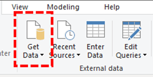

# 安装适用于 Power BI 的 Microsoft 通话质量连接器以使用通话质量仪表板查询模板

在使用适用于 Microsoft Teams 通话质量仪表板 (CQD) )  (PBIX 文件的 Power BI 查询模板之前，需要使用 [下载](https://www.microsoft.com/download/details.aspx?id=102291)中包含的 *MicrosoftCallQuality.pqx* 文件安装适用于 Power BI 的 Microsoft 通话质量连接器。

阅读 [使用 Power BI 分析 Teams 的 CQD 数据](CQD-Power-BI-query-templates.md) ，了解这些模板。

请确保具有适当的 [CQD 访问角色](./turning-on-and-using-call-quality-dashboard.md#assign-admin-roles-for-access-to-cqd) 来访问 Power BI 报表。

> [!NOTE]
> Microsoft 通话质量连接器仅支持 Power BI 中的 DirectQuery;不支持导入模式。 

## 安装

[Power BI 文档中](/power-bi/desktop-connector-extensibility)详细介绍了安装自定义连接器和调整安全性以允许使用连接器的过程。 为简单起见，下面是一个快速说明：

1. 检查计算机是否已具有 *\[Documents\]\\ Power BI Desktop\\ Custom Connectors* 文件夹。 如果没有，请创建此文件夹。1

2.  (*.\*mez* 或 *\*.pqx* 文件) 下载连接器文件，并将其置于 *自定义连接器* 目录中。

3. **如果连接器文件是 *\*.mez* 文件，** 则还需要按照 [自定义连接器设置文档中](/power-bi/desktop-connector-extensibility#data-extension-security)的说明调整安全设置。

如果发布了新版本的 Microsoft 通话质量连接器，请将自定义连接器目录中的旧 *连接器* 文件替换为新文件。

## 设置

若要生成报表并运行查询，首先需要连接到 CQD 数据源。 请按照以下步骤进行连接：

1. 在Power BI Desktop的“主页”选项卡中，单击“*获取数据*”。

    

2. 此时应显示 *“获取数据”* 窗口。 导航到 *“联机服务”*，然后选择“ *Microsoft 通话质量 (Beta)* ”，然后点击“ *连接*”。

    

3. 系统将提示你接下来登录。 使用用于通话质量仪表板的相同凭据。2

4. 下一个提示将提供两种 *数据连接模式* 之间的选项。 选择“ *DirectQuery”* 并点击“ *确定*”。

5. 最后，系统会向你显示通话质量仪表板的整个数据模型的最终提示。 此时不会显示任何数据，只有 CQD 的数据模型。 选择“ *加载* ”以完成设置过程。

6. 此时，Power BI 会将数据模型加载到窗口右侧。 否则，页面将保持空白，默认情况下不会加载任何查询。 继续执行下面的 **“生成查询** ”，以生成查询并返回数据。

如果此设置过程中的任何步骤都不清楚，可以在[快速入门：连接到Power BI Desktop中的数据](/power-bi/desktop-quickstart-connect-to-data)中找到该过程的更详细说明。

## 生成查询

设置完成后，应在“ *字段* ”窗格中看到数百个维度和度量值的名称。 从此处构造实际查询非常简单，只需为查询选择所需的维度和度量值，然后将其拖放到页面上即可。 下面是更详细的说明，其中包含一个简单的示例：

1. 从“可视化效果”窗格中选择要使用的 *可视化效果* 。 页面上应显示该可视化效果的空白版本。 就此示例而言，我们将使用 *表* 可视化效果。

    

2. 确定要用于查询的聚合符号 (名称) 表示的维度和度量值，然后手动选择它们并将其拖动到黑色可视化效果上。 或者，将它们拖动到可视化选项下的 *“值”* 字段。

    !Power BI 连接器中的可视化效果查询。] (媒体/CQD-power-bi-connector4-resize2.png) 

    > [!IMPORTANT]
    > 通话质量仪表板需要度量值才能运行任何查询。 未能向查询添加度量值将导致该查询失败。

3. 接下来，选择要筛选的任何维度，并将其拖动到“筛选器”窗格中 *的“此视觉对象上的**筛选器*”字段。 Microsoft 通话质量连接器目前支持 *基本筛选* (从可能的维度值列表中选择值，) ，*高级筛选* (手动指定要筛选的值和操作数，类似于通话质量仪表板) ，*相对日期筛选* (仅适用于 *) 结束时间和**开始时间* 维度。 通话质量仪表板不支持按 *前 N* 进行筛选。

    

    > [!IMPORTANT]
    > 仅当应用于维度时，才支持筛选器。 通话质量仪表板不支持对度量值进行筛选。

4. 最后，选择“*可视化效果*”窗格中的“*格式*”选项卡，设置查询的样式和格式。

    > [!NOTE]
    > 通话质量仪表板查询至少需要一个度量值才能运行。 如果查询未加载，请仔细检查是否已在查询中包含度量值。

## 创建钻取报表

[通过 Power BI 中的钻取](/power-bi/desktop-drillthrough) ，可以创建重点报表，可以使用其他报表的值作为上下文快速筛选这些报表。 了解如何使用 Microsoft 通话质量连接器创建第一个查询后，创建钻取就更简单了。

1. 为重点报表创建另一页，然后将查询添加到该页。

2. 选择要用作钻取筛选器的维度，并将其拖动到 *“可视化效果*”窗格下的 *“钻取*”字段。

    

3. **就是这样\!** 使用该维度的另一页上的任何其他查询现在都可以钻取到该页面，从而自动将钻取维度的值作为筛选器应用。

    

与通话质量仪表板不同，Power BI 支持非顺序钻取。 如果查询包含必要的维度，它可以钻取到任何其他页面。

### 最佳做法

Microsoft 通话质量连接器查询在设计时应考虑到钻取功能。 从更广泛的低基数查询开始，并向下钻取到高基数查询，而不是尝试一次加载所有数据，然后使用筛选器向下切片。 例如，在尝试诊断哪些子网对质量问题的贡献最大时，首先确定导致该问题的区域和国家/地区，然后向下钻取到该区域或国家/地区的子网会很有帮助。 呼叫质量连接器模板以这种方式设计，以充当示例。

## 限制

尽管使用 Power BI，但并非所有 Power BI 功能都受 Microsoft 通话质量连接器支持，因为通话质量仪表板的数据模型或 DirectQuery 连接器一般存在限制。 下面的列表指出了连接器的一些更值得注意的限制，但此列表不应被视为详尽：

1. **计算列 -** DirectQuery 连接器通常对 Power BI 中的计算列的支持有限。 某些计算列可能适用于连接器，这些列是例外。 一般情况下，计算列不起作用。

2. **聚合–** 通话质量仪表板数据模型基于多维数据集模型构建，这意味着已以度量值的形式支持聚合。 尝试将聚合手动添加到不同维度或更改度量值的聚合类型不适用于连接器，并且通常会导致错误。

3. **自定义视觉对象 -** 虽然 Microsoft 通话质量连接器确实适用于一系列自定义视觉对象，但我们无法保证与所有自定义视觉对象的兼容性。 许多自定义视觉对象依赖于使用计算列或导入的数据，DirectQuery 连接器都不支持这两个列。

4. **引用缓存数据 –** Power BI 目前不支持以任何方式引用 DirectQuery 连接器中的缓存数据。 任何引用查询结果的尝试都将产生新的查询。

5. **相对数据筛选 -** 在 Microsoft 通话质量连接器中受支持，但仅支持 *“开始时间和**结束时间*”维度。 尽管 *“日期”* 维度可能是相对日期筛选的明显选择，但 *Date* 不存储为日期时间对象，因此不支持 Power BI 中的相对日期筛选。

6. **仅度量查询 -** 目前在 Microsoft 通话质量连接器中不受支持。 创建具有三个或更多度量值且没有维度的可视化效果时，将转置列数据。 若要避免这种情况，请始终在可视化效果中至少包括一个维度 (例如：月份年) 。 此问题将在即将发布的适用于 Power BI 的 Microsoft 通话质量连接器版本中解决。

7. **政府社区云 (GCC) 支持 -** 对于 GCC 环境中的客户，Microsoft 通话质量连接器仅在使用 Power BI Desktop 时工作。 Microsoft 通话质量连接器目前与 GCC 客户的Power BI 服务不兼容。

其中大多数问题要么是 Power BI 中 DirectQuery 连接器设计的限制，要么是 CQD 数据模型设计的基础。

## 疑难解答

### 我尝试使用 Date 列作为日期切片器。 将此列的数据类型转换为 Date 后，我收到此错误

> **无法加载此视觉对象的数据**：OLE DB 或 ODBC 错误： [Expression.Error] 无法将表达式折叠到数据源。 请尝试使用更简单的表达式。

Microsoft 通话质量连接器不支持日期切片器。 若要指定日期范围，请对报表应用两个筛选器，指定小于和大于日期。

或者，如果要查看的日期是最近日期，请应用相对日期筛选器，仅显示过去 N 天/周/月的数据。

### 向报表添加某些维度时，视觉对象会立即返回 **“无法加载此视觉对象的数据”。** 删除维度可修复视觉对象 - 发生了什么情况？

这是 Microsoft 通话质量连接器中的已知问题;以整数公开的任何维度都将在 Power BI 中显示为“聚合”列，其中 Power BI 将尝试默认汇总操作， (通常为“总和”) 。 在某些情况下，即使结果没有用，此行为也会成功求和值，因为第二个 WiFi 通道等维度的“和”是毫无意义的。 在其他情况下，此汇总操作将失败并导致视觉对象中的错误。

若要解决此问题，请首先从视觉对象中删除维度。 从“字段”列表中选择维度，浏览到功能区中的“列工具”选项卡，单击“汇总”下拉菜单，然后选择“ **不汇总**”。 现在可以再次将维度添加到视觉对象。

## 错误代码

由于在可以构造的查询类型方面，适用于 Power BI 的 Microsoft 呼叫质量连接器的限制小于浏览器应用，因此在生成查询时偶尔可能会遇到许多错误。 如果收到类型为“CQDError”的错误消息。 RunQuery – 查询执行错误“，使用提供的 ErrorType 编号引用下面的列表，以便排查查询的可能问题。 以下是 CQD Power BI 连接器可能会遇到的最常见错误类型代码：

- **ErrorType 1 - 查询结构错误：** 查询结构错误通常是由连接器无法生成格式正确的查询引起的。 使用不受支持的功能时，这种情况最常发生，如上述限制中所述。 仔细检查是否未对该查询使用任何计算列或自定义视觉对象。

  - **ErrorType 2 - 查询生成错误：** 查询生成错误是由 Microsoft 通话质量连接器无法正确分析你尝试生成的查询引起的。 使用不受支持的功能时，这种情况最常发生，如上述限制中所述。 仔细检查是否未对该查询使用任何计算列或自定义视觉对象。

  - **ErrorType 5 - 执行超时：** 在超时之前，查询已达到最大可能运行时。尝试向查询添加更多筛选器，以限制其范围。 缩小数据范围通常是实现此目的的最有效方法。

  - **ErrorType 7 - 无度量错误：** 调用质量仪表板查询需要度量值才能正常运行。 仔细检查查询是否包含度量值。 Microsoft 通话质量连接器中的度量值由名称前的聚合 (总和) 符号表示。

如果在此范围之外遇到任何其他错误，请通知通话质量仪表板团队，以便我们帮助解决问题并根据需要更新文档。

## 脚注

**1** 某些进程和应用 (例如 OneDrive) 可能会导致文档根文件夹发生更改;确保 *Power BI Desktop\\ Custom Connectors* 目录位于当前根文件夹 Documents 文件夹内。

**2** 用于通话质量仪表板的登录凭据 *不需要* 是用于登录到 Power BI Desktop 应用本身的相同凭据。

## 常见问题解答

### Power BI 连接器何时会从“Beta”状态更新？

尽管有 Beta 标记，但适用于 Power BI 的 Microsoft 通话质量 (Beta) 连接器是连接器的第一个“发布”版本，并且已由 Power BI 团队正式签署安全协议以反映这一点。 在连接器最初发布时，Power BI 团队无法提供支持和更广泛的认证，但仍准备证明 Microsoft 呼叫质量连接器的安全性、真实性和常规功能。 展望未来，我们计划在不久的将来投资用于 Power BI 的 Microsoft 通话质量连接器。

### 与浏览器中的通话质量仪表板相比，连接器为何显得较慢？ 如何提高性能？

在浏览器和连接器中，各种模板的查询性能实际上相同。  与任何其他独立应用一样，Power BI 会将其身份验证和呈现时间添加到我们的性能中。 此外，差异在于运行的并发查询数。 由于通话质量仪表板的浏览器内版本具有不太发达且信息密集的可视化选项，因此我们的大多数报表限制为一次加载 2-3 个查询。 另一方面，连接器模板通常显示 20 多个并发查询。 如果想要生成与以前使用的报表一样响应的报表，请尝试创建每个选项卡不超过 2-3 个查询的报表。

有关详细信息，请参阅以下文章：

- [Power BI 优化指南](/power-bi/guidance/power-bi-optimization)
- [DirectQuery 模型指南](/power-bi/guidance/directquery-model-guidance)

### 我发现运行查询时，我经常遇到 10，000 行的限制。 如何让连接器返回超过 10，000 行？

10，000 行限制实际上是在 API 端指定的，它旨在帮助显著提高性能并降低内存不足导致查询执行错误的风险。

最好根据连接器最佳做法重构报表，而不是尝试增加结果行计数。 我们包含的模板旨在演示这些最佳做法。 如果可能，请首先使用更广泛的较低基数维度（例如月份、年份、日期、区域、国家/地区等）查看 KPI。从那里，可以向下钻取到越来越高的基数维度。 支持人员和Location-Enhanced报告都提供了此向下钻取工作流的良好示例。

## 相关主题

[使用 Power BI 分析 Teams 的 CQD 数据](CQD-Power-BI-query-templates.md)
