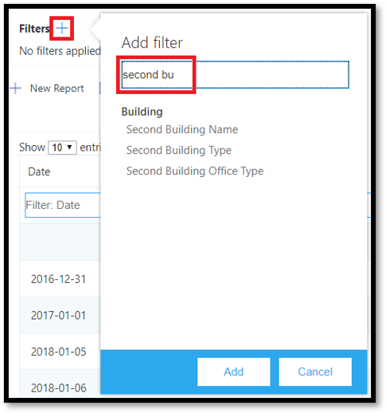
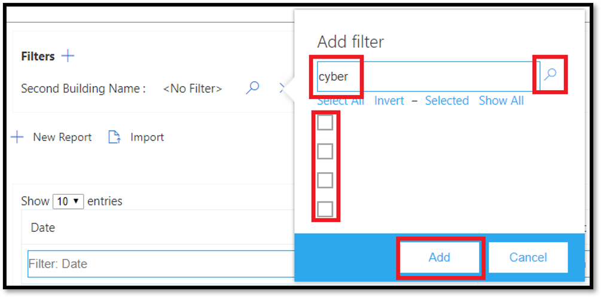

# <a name="data-and-reports-in-call-quality-dashboard-cqd"></a>CQD 呼叫质量仪表板 (数据和) 

Microsoft 呼叫质量仪表板 (CQD) 使用近实时的 NRT (NRT) 数据源。 呼叫记录在通话结束后 30 分钟内在 CQD 中可用。 NRT 管道中的呼叫记录仅在从数据集中删除前几个月才可用。 


## <a name="many-ways-to-access-cqd-data"></a>访问 CQD 数据的多种方式

可以通过几种不同的途径访问 CQD 数据。 选择最能满足你需求的一个：

|  |  |
|---------|---------|
|Teams管理中心[ (https://admin.teams.microsoft.com) ](https://admin.teams.microsoft.com)    | CQD 数据包含在 Teams管理中心的"用户"页面上，以易于阅读的格式显示所需的最常见数据。 不能自定义在"用户"下找到的 CQD **数据**。  |
|CQD 门户[ (https://cqd.teams.microsoft.com) ](https://cqd.teams.microsoft.com)     | 使用钻取筛选功能，提供满足大多数需求的可靠的摘要和详细报表。 还可以在 CQD 门户中自定义报表。 <br><br>获取两 [个 CQD 报表](#import-the-cqd-report-templates) 模板，以帮助在 CQD 门户中分析数据。       |
|Power BI     | 使用直接查询，使用可自定义的自定义Power BI在 Power BI[中查看 CQD 数据](CQD-Power-BI-query-templates.md)。 [下载Power BI CQD 的查询模板](https://github.com/MicrosoftDocs/OfficeDocs-SkypeForBusiness/blob/live/Teams/downloads/CQD-Power-BI-query-templates.zip?raw=true)。<br><br>也可使用[REST API 通过数据库访问 CQD](/skypeforbusiness/management-tools/call-quality-dashboard/data-api) Power BI。 如果要下载 CQD 数据以便脱机处理，请使用此方法。 使用此方法的好处是性能更好，对于联机时陷入Power BI的大型数据集尤其有用。       |
|Graph API     | 使用 Graph [API 自己Graph质量数据](/graph/api/resources/callrecords-api-overview?view=graph-rest-beta)。 这是最复杂的方法，但它在分析呼叫质量数据方面提供了最大的控制和灵活性。 例如，如果需要将其与组织的其他数据联接，可以使用 Graph API 创建数据模型并合并调用质量数据。        |

## <a name="import-the-cqd-report-templates"></a>导入 CQD 报表模板

从 ["所有网络和](https://aka.ms/qertemplates) 托管网络 (下载两个特) CQD 报表模板，以帮助你快速了解 CQD。 "所有网络"模板尽管经过优化，可用于处理建筑物数据文件，但可在收集建筑物信息并将其上传到 CQD 时使用，如下一部分所述。

**若要导入模板， (。CQDX) into CQD**

1. 在 CQD 中 **，从** 页面顶部的菜单中选择"详细报告"。

2. 在左侧面板中，选择"导入 **"。** 浏览到第一个 CQDX 模板，然后选择"打开 **"。**

3. 上传模板后，弹出窗口将显示消息"报告导入成功"。 

4. 为第二个 CQD 模板重复步骤 2 和 3。

   > [!NOTE]
   > 每个用户必须将 CQD 模板导入其 CQD 实例。 


## <a name="euii-data"></a>EUII 数据

出于合规性原因，EUII (标识) 数据 (也称为个人身份信息或 PII) 仅保留 28 天。 当 NRT 数据超过 28 天标记时，将清除包含 EUII 的字段，从而生成无 EUII 的 NRT 数据。 包含 EUII 数据的字段为：

- 完整的 IP 地址
- MAC 媒体访问控制 (MAC) 地址
- 基本服务集标识符 (BSSID) 
- 会话启动协议 (SIP) URI (Skype for Business仅) 
- 用户主体名称 (UPN)
- 计算机终结点名称
- 用户详细反馈
- 对象 ID (终结点的用户帐户的 Active Directory 对象 ID) 

### <a name="admin-roles-with-and-without-euii-access"></a>具有和没有 EUII 访问权限的管理员角色

这些 [RBAC](/azure/role-based-access-control/overview) 角色 **具有** EUII 访问权限：
- 全局管理员
- Teams服务管理员
- Teams通信管理员
- Teams 通信支持工程师
- 全局阅读器
- Skype for Business管理员

这些 RBAC **角色没有** EUII 访问权限：
- 报表读者
- Teams通信支持专家


## <a name="date-controls"></a>日期控件

CQD 支持以下滚动趋势类型：

- 5 天
- 7 天
- 30 天
- 60 天
- 90 天

URL Date 参数接受"天"字段。 滚动日期报表使用以 YYYY-MM-DD 格式指定的日期作为趋势的最后一天。 URL Date 参数"00"指示"today"。

|URL| 滚动日期趋势的结束日期|
|:---|:---|
|<span>https:// <cqdv3> /spd/#/Dashboard/ <reportid> /2019-02/</span>   |2019 年 2 月的当前日|
|<span>https:// <cqdv3> /spd/#/Dashboard/ <reportid> /2019-02-15/</span>|2019 年 2 月 15 日|
|<span>https:// <cqdv3> /spd/#/Dashboard/ <reportid> /00/</span>        |当天|
|||

默认情况下，当月的当前天用作滚动日趋势的最后一天。


## <a name="data-available-in-cqd-reports"></a>CQD 报告中提供的数据

管理组织通话质量时，可能需要使用默认摘要和详细的 CQD 报告。如果需要，可以 [创建自定义报表](#create-custom-detailed-reports)。 

如果要使用 Power BI分析 CQD 数据，请阅读使用 Power BI 分析[CQD 数据Teams。](CQD-Power-BI-query-templates.md)

|功能|摘要报告|详细报告|
|:--- |:--- |:--- |
|应用程序共享指标 | 否 | 是 |
|客户构建信息支持 | 是 | 是 |
|客户终结点信息支持 | 仅在 <span> cqd.teams.microsoft.com<span/> | 仅在 <span> cqd.teams.microsoft.com<span/> |
|向下钻取分析支持   | 否   | 是   |
|媒体可靠性指标   | 否   | 是   |
|开箱后报表   | 是   | 是   |
|概述报告   | 是   | 是   |
|每用户报表集   | 否   | 是   |
|报表集自定义 (添加、删除、修改报表)    | 否   | 是   |
|基于视频的屏幕共享指标   | 否   | 是   |
|视频指标   | 否   | 是   |
|可用数据量   | 过去 12 个月   | 过去 12 个月   |
|Microsoft Teams数据   | 是   | 是   |
| | | |


 
### <a name="select-product-data-to-see-in-reports"></a>选择要在报告中查看的产品数据

在"摘要Location-Enhanced报表"中，可以使用"产品筛选器"下拉列表显示所有产品数据、仅Microsoft Teams数据，或仅Skype for Business联机数据。

> [!div class="mx-imgBorder"]
> 
  
在"详细报表"中，可以使用"Is **Teams"** 维度筛选数据以Microsoft Teams或Skype for Business联机数据。

## <a name="summary-reports"></a>摘要报告

这些报表是首次登录 CQD 时在 CQD 仪表板上看到的报表。 它们提供每日、每月和表报表的质量趋势概览，以帮助识别质量不佳的子网。 

| Tab | 说明 |
|---------|---------|
|总体呼叫质量     | 其他 3 个选项卡的聚合。       |
|服务器 - 客户端     |服务器和客户端终结点之间的流的详细信息。        |
|客户端 - 客户端     |两个客户端终结点之间的流的详细信息。        |
|语音质量 SLA     |有关语音质量 SLA Skype for Business呼叫[的信息](https://go.microsoft.com/fwlink/p/?linkid=846252)。        |

### <a name="overall-call-quality-tab"></a>"总体呼叫质量"选项卡

使用此选项卡上的数据，根据流计数和较差百分比评估呼叫质量状态和趋势。 右上角的图例显示哪些颜色和可视元素表示这些指标。

> [!div class="mx-imgBorder"]
> 
  
流分为三组：良好、较差和未分类。 此外，还有计算  *得出的 Poor %*  值，这些值提供分类为 *"*  差"的流与已分类流总数的比率。 由于 Poor % = 差流/ (差流+ 良好流) ** 100，**因此 Poor %* 不受存在多个未 *分类* 流的影响。 若要了解将流分类为差或好什么，请参阅呼叫 [质量仪表板中的流分类](stream-classification-in-call-quality-dashboard.md)。
  
使用左侧的刻度测量流计数值。

> [!div class="mx-imgBorder"]
> 
  
使用右侧比例度量差 % 值。

> [!div class="mx-imgBorder"]
> 
  
通过将鼠标悬停在条形图上，还可以获取实际数值。
  
> [!NOTE]
> 以下示例来自一个很小的示例数据集，实际部署不真实值。

> [!div class="mx-imgBorder"]
> 
  
总体流音量有助于确定计算较差百分比的相关性。 总体流的数量越小，报告的较差百分比值越不可靠。
  
### <a name="server-client-tab-and-client-client-tabs"></a>Server-Client选项卡和Client-Client选项卡

这两个选项卡提供其终结点到终结点方案中发生流的详细信息。 "Server-Client"选项卡包含四个可折叠的节，这些部分表示媒体流将流动的四种方案。
  
- 内部有线
- 外部有线
- WiFi 内部
- 外部 WiFi

同样，"Client-Client选项卡包含五个可折叠的部分：

- 内部有线 - 内部有线
- 内部有线 - 外部有线
- 在外部有线 - 在外部有线
- 在内部有线 - WiFi 内部
- 内部有线 - 外部 WiFi

#### <a name="inside-versus-outside"></a>内部与外部

CQD 使用建筑物信息将流分类为"内部"或"外部"（如果存在）。 每个流的终结点与子网地址相关联。 如果子网位于上传的建筑物信息中标记为 InsideCorp 的子网列表中，则它被视为"内部 *"。* 如果尚未上传生成信息，则"内部测试"始终将流分类为"外部 *"。* 

应用场景的内部Server-Client仅考虑客户端终结点。 由于从用户的角度来看，服务器始终位于外部，因此在测试中未考虑到这一点。
  
#### <a name="wired-versus-wifi"></a>有线与 WiFi

如名称所指示，分类条件基于客户端连接的类型。 服务器始终是有线的，并且计算中不包括服务器。 在给定的流中，如果两个终结点之一连接到 WiFi 网络，则 CQD 会分类为 WiFi。

> [!NOTE]
> 给定流后，如果两个终结点之一连接到 WiFi 网络，则它在 CQD 中归类为 WiFi。
  
  
## <a name="tenant-data-information"></a>租户数据信息

"CQD 摘要报表 **"** 仪表板包括租户数据Upload页，该页面通过从右上角的设置菜单中选择"租户数据"Upload访问。 此页用于管理员上传其自己的信息，例如：

- IP 地址和地理信息的地图。
- 每个无线 AP 及其 MAC 地址的地图。
- 终结点到终结点制造/模型/类型等的地图。
  
建议上传租户、建筑物和位置数据，以便 CQD 可以在报告中包含此信息。 如果尚未上传此数据，请阅读Upload[和生成数据](CQD-upload-tenant-building-data.md)。 


## <a name="detailed-reports"></a>详细报告

| 名称 | 描述 |
|---------|---------|
|Location-Enhanced报表     |显示基于位置信息的质量趋势。 只有在上传了租户数据 [时，才显示此报告](CQD-upload-tenant-building-data.md)。        |
|可靠性报告     |包括音频、视频、基于视频的屏幕共享 (VBSS) 以及应用共享报告。        |
|体验质量报告     |所有客户端和设备（包括会议室）的音频质量和可靠性。 这些报告是可下载 [CQD](https://aka.ms/QERtemplates)模板的"精简"版本，侧重于分析音频质量和可靠性的关键问题。         |
|质量向下钻取报表     | 向下钻取：按区域、位置、子网、小时和用户划分的日期。        |
|故障向下钻取报表     | 向下钻取：按区域、位置、子网、小时和用户划分的日期。        |
|评价我的通话报告     |按区域、位置或用户分析用户通话分级。 包括逐字反馈。         |
|技术支持报表     |技术支持报告查看单个用户、用户组或所有人的呼叫和会议数据。 这些报告合并了建筑物和 EUII 数据，可帮助根据网络位置、会议详细信息、设备或固件确定可能的系统问题。         |
|客户端版本报告     |客户端版本摘要：查看每个客户端应用版本的会话和用户计数<br><br>按用户表示的客户端版本：查看每个客户端应用版本的用户名 <br><br>针对"产品"和"客户端类型"预构建的筛选器可帮助将版本侧重于特定客户端。         |
|终结点报告     |按计算机终结点显示呼叫质量 (计算机制造商和型号) 。 这些报表包括建筑物数据（如果已上传）。         |


## <a name="create-custom-detailed-reports"></a>创建自定义详细报表

如果默认 CQD 报表不能满足需求，请使用这些说明创建自定义报表。 或者 (2020 年 1 月) [对 CQD ](cqd-power-bi-query-templates.md)Power BI使用资源。

从在登录时显示的屏幕顶部的报表的下拉列表中，选择"摘要报表"屏幕，选择"详细报表"，然后选择 \(  \) "**新建"。**  单击 **报告中** 的"编辑"，查看查询编辑器。 每个报告都可以通过对多维数据集进行查询得到。 报告是其查询返回的数据的可视化形式。 查询编辑器可帮助编辑这些查询和报表的显示选项。

> [!IMPORTANT]
> 网络范围可用于表示具有单个路由前缀的 (子网的超网络) 。 所有新建筑物上载都将检查是否有重叠的范围。 如果以前上传过一个建筑物文件，应下载当前文件，然后重新上传该文件，以识别任何重叠，并修复问题，然后再重新上传。 以前上传的文件的任何重叠都可能导致报告中子网与建筑物之间的映射错误。 某些 VPN 实现无法准确报告子网信息。 建议在将 VPN 子网添加到生成文件时，不要为子网添加一个条目，而是将 VPN 子网中每个地址的单独条目添加为单独的 32 位网络。 每行可以具有相同的建筑物元数据。 例如，对于 172.16.18.0/24，应该有 256 行，每个地址各有一行，介于 172.16.18.0/32 和 172.16.18.255/32 之间（含）。
>
> VPN 列是可选的，默认为 0。  如果 VPN 列的值设置为 1，则该行表示的子网将完全展开，以匹配子网内的所有 IP 地址。  请尽量少用，仅对 VPN 子网使用，因为完全扩展这些子网会对涉及生成数据的查询的查询时间产生负面影响。

指向报告中的条形图和趋势线以显示详细值。 具有焦点的报表将显示操作菜单："编辑、克隆、**删除**、**下载** 和 **导出报表树"。**


## <a name="query-filters"></a>查询筛选器

查询筛选器是使用 CQD 中的查询编辑器实现的。 这些筛选器用于减少 CQD 返回的记录数，从而最大程度地减少报表的总体大小和查询时间。 这尤其适用于筛选出非托管网络。 下表中列出的筛选器使用正则表达式 (RegEx) 。


| 筛选器         | 说明          | CQD 查询筛选器示例      |
|----------------|----------------------|-------------------------------|
| 无空值   | 某些筛选器没有用于筛选空值的选项。 若要手动筛选空值，请使用空白表达式，并根据需要将筛选器设置为"等于"或"不等于"。      | Second Building Name \<\> \^ \\ s\*\$                       |
| 排除常见子网 | 如果没有有效的建筑物文件来将托管网络与非托管网络分开，则报告中将包含家庭网络。 这些主子网不在 IT 控制的范围之内，可以快速从报告中排除。 本指南中定义的常见子网为 10.0.0.0、192.168.1.0 和 192.168.0.0。 | Second Subnet \<\> 10.0.0.0 \| 192.168.0.0 \| 192.168.1.0 |
| 仅在内部查看  | 用于筛选报表，以在外部 (托管) 托管 (托管) 。 托管的 CQD 模板已预配置了这些筛选器。       | Second Inside Corp = Inside        |

## <a name="report-filters"></a>报表筛选器

使用 CQD 报表筛选器缩小调查范围。 通过使用报表筛选器，在查询编辑器中或直接在报表内向呈现的报表添加筛选器。 以下报告筛选器用于整个 [CQD 模板](https://aka.ms/QERtemplates)。


| 筛选器     | 说明                            | CQD 报表筛选器示例         |
|------------|----------------------------------------|-----------------------------------|
| Month      | 首先从年份开始，然后从月份开始。 | 2017-10                           |
| 字母 | 筛选任何字母字符。 | [a-z]                             |
| 数字    | 筛选任何数字字符。    | [0-9]                             |
| 百分比 | 筛选百分比。              |  ([3-9] \\ .) \| ([3-9]) \| ([1-9][0-9])  |


### <a name="drill-down-filters"></a>向下钻取筛选器

CQD 报表具有多个向下钻取筛选器，这些筛选器是缩小通话质量调查重点的强大工具。 如果选择向下钻取字段，则报表会自动打开相应的选项卡，并筛选所选值。 如果该选项卡具有其自己的向下钻取字段并且选择了一个字段，则应用这两组筛选器，从而逐渐缩小生成的数据集。


#### <a name="adding-and-editing-drill-down-fields"></a>添加和编辑向下钻取字段

编辑报表时，可以选择使用查询编辑器指定自己的向下钻取字段。

首先单击 **"...** 选择要编辑的报表，然后选择"编辑 **"。**


从查询编辑器左侧的列表中选择"维度"。 然后单击"导航到"标签下方的下拉列表，然后选择希望维度要导航到的选项卡钻取组。 注意：目前，向下钻取功能仅通过导航到不同的选项卡来工作。 稍后将添加对钻取到特定扩展器的支持。 最后，单击 **"关闭**"将更改保存到"维度"，然后单击"保存"以保存并关闭查询编辑器。


### <a name="multi-select-filters"></a>多选筛选器

除了向下钻取功能，CQD 还支持指定具有多个值的筛选器 (或筛选器) 。

若要选择多个筛选器值，请首先向报表添加新筛选器。 在 **+** "**筛选器"标签** 旁边单击，输入想要使用的维度的名称，然后单击"添加 **"。**



然后 **，单击** " (筛选器"旁边的放大镜图标) 。 你将看到一个文本字段和一些选项，包括 **"全选**"和 **"反转"。** 输入值，然后单击 **该字段旁边的"** 搜索"进行搜索。 或者，将文本字段留空，然后单击"搜索"查看最多前 100 个选项。

```powershell
/filter/[AllStreams].[Second Tenant Id]\|[YOUR TENANT ID HERE]
```

示例：  



### <a name="dashboard-level-filters"></a>仪表板级别筛选器
某些 CQD 报表添加了仪表板级筛选器，因此可以轻松按常用参数进行筛选。 这些筛选器显示在常规报表选项卡外部和产品筛选器正下方，并应用于仪表板中的所有筛选器。


```powershell
/filter/[AllStreams].[Is Teams]|[TRUE | FALSE]
```

### <a name="url-filters"></a>URL 筛选器

CQD 支持向 URL 添加筛选器。 这样，可以轻松共享 CQD 查询或为查询添加书签。 可以在 URL 中定义参数，例如趋势月份、租户 ID 或语言。 还可以向 URL 添加"产品"或"仪表板"级别筛选器。
从 CQD 报告中排除联合数据在修正托管建筑物或联合终结点可能会影响报表的网络时非常有用。

若要添加筛选器，将以下内容追加到 URL 的末尾：

```console
/filter/[AllStreams].[Second Tenant Id]\|[YOUR TENANT ID HERE]
```

示例：  

`https://cqd.teams.microsoft.com/cqd/#/1234567/2018-08/filter/[AllStreams].[Second Tenant Id]|[TENANTID]`

若要将仪表板级筛选器添加到 URL，该筛选器必须作为"产品"或"仪表板"级别筛选器存在于 CQD 中。 在"趋势月份"之后和 URL 参数之前，将以下筛选器添加到 URL：

`filter/DATA_MODEL_NAME|VALUE`

例如，若要应用产品筛选器值 Microsoft Teams，需要添加以下内容：

`filter/[AllStreams].[Is%20Teams]|[True]`

整个 URL 如下所示：

`https://cqd.teams.microsoft.com/spd/#/Dashboard/2624085/2018-9/filter/[AllStreams].[Is%20Teams]|[True]`

若要应用包含多选值的 URL 筛选器，请用管道将每个值 ( |) 字符。 例如：

`filter/[AllStreams].[Media%20Type]|[Video]|[Audio]|[VBSS]`

如果指定无效的名称或值，将不会应用 URL 筛选器。


可以使用 URL 筛选器筛选每个报表的特定维度。 最常见的 URL 筛选器用于筛选报告以排除联合参与者遥测数据，或仅关注 Teams 或 Skype for Business Online。 从 CQD 报告中排除联合数据在修正托管建筑物或联合终结点可能会影响报表的网络时非常有用。

| 筛选器         | 说明          | CQD 查询筛选器示例      |
|----------------|----------------------|-------------------------------|
| 无空值   | 某些筛选器没有用于筛选空值的选项。 若要手动筛选空值，请使用空白表达式，并根据需要将筛选器设置为"等于"或"不等于"。      | Second Building Name \<\> \^ \\ s\*\$                       |
| 排除常见子网 | 如果没有有效的建筑物文件来将托管网络与非托管网络分开，则报告中将包含家庭网络。 这些主子网不在 IT 控制的范围之内，可以快速从报告中排除。 本文中定义的常见子网为 10.0.0.0、192.168.1.0 和 192.168.0.0。 | Second Subnet \<\> 10.0.0.0 \| 192.168.0.0 \| 192.168.1.0 |
| 仅在内部查看  | 用于筛选报表，以在外部 (托管) 托管 (托管) 。 托管的 CQD 模板已预配置了这些筛选器。       | Second Inside Corp = Inside        |


#### <a name="how-to-find-your-tenant-id"></a>如何查找租户 ID

CQD 中的租户 ID 对应于 Azure 中的目录 ID。 如果不知道目录 ID，可以在 Azure 门户中找到它：

1.  登录到 Microsoft Azure 门户：<https://portal.azure.com>

2.  选择 **"Azure Active Directory"。**

3.  在 **"管理"** 下，选择"**属性"。** 租户 ID 位于" **目录 ID"** 框中。

也可使用 PowerShell 查找租户 ID： 

```powershell
Login-AzureRmAccount
```

## <a name="comparing-teams-and-skype-for-business-cqd-data"></a>比较 Teams Skype for Business CQD 数据

查看数据时，可能会发现数据与数据Teams Skype for Business。 一些原因：
- 确保性能和可靠性的机制差异：
  - Teams自动重新连接和快速漫游。 Skype for Business不会。
  - Teams具有动态带宽管理。 Skype for Business不会。
- IP 地址[范围在](Office-365-URLs-IP-address-ranges.md)Teams 和 Skype for Business。 TEAMS IP 范围较新，这可能会导致防火墙出现连接问题。


## <a name="related-topics"></a>相关主题

[改进和监视呼叫质量Teams](monitor-call-quality-qos.md)

[什么是 CQD？](CQD-what-is-call-quality-dashboard.md)

[设置 CQD (呼叫质量) ](turning-on-and-using-call-quality-dashboard.md)

[Upload租户和建筑物数据](CQD-upload-tenant-building-data.md)

[使用 CQD 管理呼叫和会议质量](quality-of-experience-review-guide.md)

[CQD 中可用的维度和度量值](dimensions-and-measures-available-in-call-quality-dashboard.md)

[CQD 中的流分类](stream-classification-in-call-quality-dashboard.md)

[使用Power BI分析 CQD 数据](CQD-Power-BI-query-templates.md)
