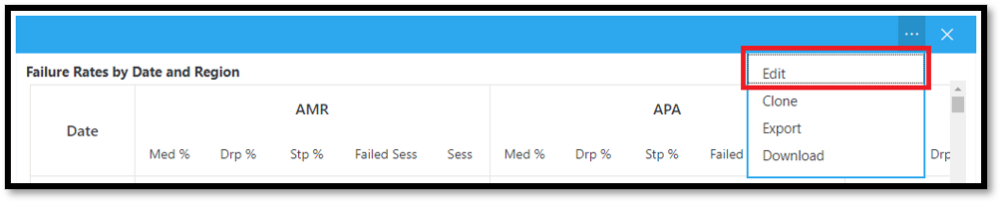

# <a name="data-and-reports-in-call-quality-dashboard-cqd"></a>调用质量仪表板中的数据和报表 (CQD) 

Microsoft 呼叫质量仪表板 (CQD) 使用近实时 (NRT) 数据馈送。 通话记录在呼叫结束后的 30 分钟内在 CQD 中可用。 从 NRT 管道调用记录在从数据集中删除之前仅可用几个月。

## <a name="many-ways-to-access-cqd-data"></a>访问 CQD 数据的许多方法

可以通过多个不同的途径访问 CQD 数据。 选择最能满足你的需求的一个：

|&nbsp;|&nbsp;|
|---|---|
|Teams管理中心[ (https://admin.teams.microsoft.com)](https://admin.teams.microsoft.com)|CQD 数据包含在Teams管理中心的 **“用户**”页上，以易于阅读的格式显示所需的最常见数据。 无法自定义在 **“用户**”下找到的 CQD 数据。|
|CQD 门户 [ (https://cqd.teams.microsoft.com)](https://cqd.teams.microsoft.com)|可靠的摘要和满足大多数需求的详细报表，以及钻取筛选。 还可以在 CQD 门户中自定义报表。 <br><br>获取两个 [CQD 报表模板](#import-the-cqd-report-templates) ，以帮助分析 CQD 门户中的数据。|
|Power BI|使用直接查询，使用[可自定义的Power BI模板](CQD-Power-BI-query-templates.md)查看Power BI中的 CQD 数据。 [下载 CQD 的Power BI查询模板](https://github.com/MicrosoftDocs/OfficeDocs-SkypeForBusiness/blob/live/Teams/downloads/CQD-Power-BI-query-templates.zip?raw=true)。<br><br>还可以[使用 REST API 通过Power BI访问 CQD 数据](/skypeforbusiness/management-tools/call-quality-dashboard/data-api)。 如果要下载 CQD 数据以便脱机处理，请使用此方法。 使用此方法的好处是性能更好，尤其是对于在联机时陷入Power BI的大型数据集非常有用。|
|Graph API|使用[图形 API](/graph/api/resources/callrecords-api-overview)自行访问调用质量数据。 这是最复杂的方法，但它为你分析通话质量数据提供了最大的控制和灵活性。 例如，如果需要将其与组织的其他数据联接，则可以使用图形 API创建数据模型并合并调用质量数据。|

## <a name="import-the-cqd-report-templates"></a>导入 CQD 报表模板

下载 [两个精选的 CQD 报表模板](https://aka.ms/qertemplates) (所有网络和托管网络) ，以帮助你快速掌握 CQD。 “所有网络”模板虽然经过优化，可在收集生成信息并将其上传到 CQD 时使用，如下一部分所述。

**导入模板 (。CQDX) 到 CQD**：

1. 在 CQD 中，从页面顶部的菜单中选择 **详细报** 表。

2. 在左侧面板中，选择 **“导入**”。 浏览到第一个 CQDX 模板，然后选择 **“打开**”。

3. 上传模板后，弹出窗口将显示消息“报表导入成功”。

4. 对第二个 CQD 模板重复步骤 2 和步骤 3。

   > [!NOTE]
   > 每个用户必须将 CQD 模板导入到其 CQD 实例中。

## <a name="euii-data"></a>EUII 数据

出于符合性原因，最终用户标识信息 (EUII) 数据 (也称为个人身份信息或 PII) 仅保留 28 天。 当 NRT 数据超过 28 天标记时，将清除包含 EUII 的字段，从而生成无 EUII 的 NRT 数据。 包含 EUII 数据的字段包括：

- 完整 IP 地址
- 媒体访问控制 (MAC) 地址
- BSSID)  (基本服务集标识符
- 会话启动协议 (SIP) URI 仅 (Skype for Business) 
- 用户主体名称 (UPN)
- 计算机终结点名称
- 用户逐字反馈
- 对象 ID (终结点用户的 Active Directory 对象 ID) 
- 电话编号

### <a name="admin-roles-with-and-without-euii-access"></a>管理员具有或无 EUII 访问权限的角色

这些 [RBAC](/azure/role-based-access-control/overview) 角色 **确实** 具有 EUII 访问权限：

- 全局管理员
- Teams服务管理员
- Teams通信管理员
- Teams 通信支持工程师
- 全局阅读器
- Skype for Business 管理员

这些 RBAC 角色 **没有** EUII 访问权限：

- 报表读取器
- Teams通信支持专家

## <a name="date-controls"></a>日期控件

CQD 支持以下滚动趋势类型：

- 5 天
- 7 天
- 30 天
- 60 天
- 90 天

URL Date 参数接受 Day 字段。 滚动日报表使用 YYYY-MM-DD 格式指定的日期作为趋势的最后一天。 URL Date 参数“00”表示“today”。

|URL|滚动日趋势的结束日期|
|:---|:---|
|<span>\<cqdv3>https:///spd/#/Dashboard//\<reportid>2019-02/</span>|2019 年 2 月当前日|
|<span>\<cqdv3>https:///spd/#/Dashboard//\<reportid>2019-02-15/</span>|2019 年 2 月 15 日|
|<span>\<cqdv3>https:///spd/#/Dashboard//\<reportid>00/</span>|当前日|

默认情况下，月中的当前日期用作滚动日趋势的最后一天。

## <a name="data-available-in-cqd-reports"></a>CQD 报表中提供的数据

默认摘要和详细的 CQD 报告可能是管理组织呼叫质量所需的一切。如果需要，可以 [创建自定义报表](#create-custom-detailed-reports)。

如果要使用Power BI来分析 CQD 数据，请阅读[“使用Power BI分析 CQD 数据以进行Teams](CQD-Power-BI-query-templates.md)。

|功能|摘要报表|详细报告|
|:---|:---|:---|
|应用程序共享指标|否|是|
|客户生成信息支持|是|是|
|客户终结点信息支持|仅在 <span>cqd.teams.microsoft.com<span/>|仅在 <span>cqd.teams.microsoft.com<span/>|
|向下钻取分析支持|否|是|
|媒体可靠性指标|否|是|
|现新报表|是|是|
|概述报表|是|是|
|按用户报表集|否|是|
|报表集自定义 (添加、删除、修改报表) |否|是|
|基于视频的屏幕共享指标|否|是|
|视频指标|否|是|
|可用数据量|过去 12 个月|过去 12 个月|
|Microsoft Teams数据|是|是|

### <a name="select-product-data-to-see-in-reports"></a>选择要在报表中查看的产品数据

在摘要和Location-Enhanced报表中，可以使用 **产品筛选器** 下拉列表来显示所有产品数据、仅Microsoft Teams数据或仅Skype for Business联机数据。

> [!div class="mx-imgBorder"]
> 

在详细报表中，可以使用 **Is Teams** 维度筛选数据以Microsoft Teams或Skype for Business联机数据。

## <a name="summary-reports"></a>摘要报表

这些是首次登录到 CQD 时将在 CQD 仪表板上看到的报表。 它们可让你通过每日、每月和表格报表来概览质量趋势，以帮助识别质量较差的子网。

|选项 卡|说明|
|---|---|
|整体通话质量|其他 3 个选项卡的聚合。|
|服务器 - 客户端|服务器和客户端终结点之间的流的详细信息。|
|客户端 - 客户端|两个客户端终结点之间的流的详细信息。|
|语音质量 SLA|有关Skype for Business语音质量 [SLA](https://go.microsoft.com/fwlink/p/?linkid=846252) 中包含的呼叫的信息。|

### <a name="overall-call-quality-tab"></a>“整体通话质量”选项卡

使用此选项卡上的数据根据流计数和差百分比来评估调用质量状态和趋势。 右上角的图例显示哪些颜色和视觉元素表示这些指标。

> [!div class="mx-imgBorder"]
> 

流分为三个组：“好”、“差”和“未分类”。 此外，还计算了  *“差百分比*  ”值，可让你获得分类为 *“差*  ”的流与总分类流计数的比率。 由于 *Poor % = Poor streams/ (Poor streams+ Good streams) \* 100*， *Poor%* 不受多个 *未分类*  流的存在的影响。 若要查看将流分类为差或好的内容，请参阅 [调用质量仪表板中的流分类](stream-classification-in-call-quality-dashboard.md)。

使用左侧的刻度来度量流计数值。

> [!div class="mx-imgBorder"]
> 

使用右侧的缩放度度量差百分比值。

> [!div class="mx-imgBorder"]
> 

还可以通过将鼠标悬停在条上来获取实际数值。

> [!NOTE]
> 下面的示例来自非常小的示例数据集，对于实际部署，这些值并不现实。

> [!div class="mx-imgBorder"]
> 

总体流卷有助于确定计算的差百分比的相关性。 总体流的量越小，报告的差百分比值就越不可靠。

### <a name="server-client-tab-and-client-client-tabs"></a>Server-Client选项卡和Client-Client选项卡

这两个选项卡提供其终结点到终结点方案中发生的流的详细信息。 Server-Client选项卡有四个可折叠的部分，这些部分表示媒体流在其中流动的四个方案。

- 内线
- 外部有线
- 内部 WiFi
- 外部 WiFi

同样，Client-Client选项卡有五个可折叠的部分：

- 有线内部 - 内有线
- 内部有线 - 外部有线
- 外部有线 - 外部有线
- 内部有线 - 内部 WiFi
- 内部有线 - 外部 WiFi

#### <a name="inside-versus-outside"></a>内部和外部

CQD 使用生成信息将流分类为  *内部*  或 *外部*  （如果存在）。 每个流的终结点都与子网地址相关联。 如果子网位于上传的“生成”信息中标记为 InsideCorp 的子网列表中，则该子网被视为 *“内部*”。 如果尚未上传生成信息，则内部测试始终将流分类为 *外部*。

Server-Client方案的内部测试仅考虑客户端终结点。 由于从用户的角度来看，服务器始终处于外部，因此在测试中不会考虑这一点。

#### <a name="wired-versus-wifi"></a>有线与 WiFi

如名称所示，分类条件基于客户端连接的类型。 服务器始终有线，且不包含在计算中。 在给定流中，如果两个终结点之一连接到 WiFi 网络，则 CQD 将其分类为 WiFi。

> [!NOTE]
> 给定流时，如果两个终结点之一已连接到 WiFi 网络，则在 CQD 中将其分类为 WiFi。

## <a name="tenant-data-information"></a>租户数据信息

CQD 摘要报表仪表板包括租户 **数据Upload** 页，通过从右上角的设置菜单中选择 **租户数据Upload** 进行访问。 此页面用于管理员上传自己的信息，例如：

- IP 地址和地理信息的地图。
- 每个无线 AP 及其 MAC 地址的地图。
- 终结点到终结点生成/模型/类型等的映射。

建议上传租户、生成和位置数据，以便 CQD 可以在报表中包含此信息。 如果尚未上传此数据，请读[取Upload租户和生成数据](CQD-upload-tenant-building-data.md)。

## <a name="detailed-reports"></a>详细报告

|名称|描述|
|---|---|
|Location-Enhanced报表|根据位置信息显示质量趋势。 仅当已 [上传租户数据](CQD-upload-tenant-building-data.md)时，才会显示此报表。|
|可靠性报告|包括音频、视频、基于视频的屏幕共享 (VBSS) 和应用共享报表。|
|体验质量报告|所有客户端和设备（包括会议室）的音频质量和可靠性。 这些报表是可下载 [CQD 模板](https://aka.ms/QERtemplates)的“精简”版本，重点是用于分析音频质量和可靠性的关键领域。|
|质量向下钻取报表|向下钻取：日期（按区域、位置、子网、小时和用户）。|
|故障向下钻取报表|向下钻取：日期（按区域、位置、子网、小时和用户）。|
|对我的呼叫报告进行评分|按区域、位置或用户分析用户呼叫分级。 包括逐字反馈。|
|Help Desk 报表|“技术支持”报表查看单个用户、用户组或每个人的电话和会议数据。 这些报告合并了生成和 EUII 数据，有助于根据网络位置、会议详细信息、设备或固件确定可能的系统问题。|
|客户端版本报表|客户端版本摘要：查看每个客户端应用版本的会话和用户计数<br><br>按用户分组的客户端版本：查看每个客户端应用版本的用户名 <br><br>产品和客户端类型的预生成筛选器可帮助将版本集中到特定客户端。|
|终结点报表|按计算机生成的计算机终结点和模型)  (显示调用质量。 这些报表包括生成数据（如果已上传）。|

## <a name="create-custom-detailed-reports"></a>创建自定义详细报表

如果默认 CQD 报表不能满足你的需求，请使用这些说明创建自定义报表。 或 (自 2020 年 1 月起) [改用 CQD 报表的Power BI](cqd-power-bi-query-templates.md)。

在登录 \(时显示的屏幕顶部的报表下拉列表中，“ **摘要报表** ”屏幕\) 选择 **“详细报表**  ”，然后选择 **“新建**”。 单击报表中的 **“编辑**”以查看查询编辑器。 每个报告都可以通过对多维数据集进行查询得到。 报告是其查询返回的数据的可视化形式。 查询编辑器可帮助你编辑报表的这些查询和显示选项。

> [!IMPORTANT]
> 网络范围可用于表示具有单个路由前缀) 的多个子网的超级网 (组合。 将检查所有新建筑物上传是否存在任何重叠的范围。 如果之前已上传生成文件，则应下载当前文件并重新上传该文件，以识别任何重叠，并在再次上传之前修复问题。 以前上传的文件中的任何重叠都可能导致子网与报表中的建筑物的映射错误。 某些 VPN 实现无法准确报告子网信息。 建议在将 VPN 子网添加到生成文件时，为 VPN 子网中的每个地址添加单独的条目（而不是子网的一个条目）作为单独的 32 位网络。 每行可以具有相同的生成元数据。 例如，对于 172.16.18.0/24，应有 256 行，每个地址在 172.16.18.0/32 和 172.16.18.255/32 之间各有一行，包括。
>
> VPN 列是可选的，默认为 0。  如果 VPN 列的值设置为 1，则该行表示的子网将完全展开，以匹配子网中的所有 IP 地址。  请谨慎使用此功能，并且仅用于 VPN 子网，因为完全扩展这些子网将对涉及生成数据的查询的查询时间产生负面影响。

指向报表中的条形图和趋势线以显示详细值。 具有焦点的报表将显示操作菜单： **编辑**、 **克隆**、 **删除**、 **下载** 和 **导出报表树**。

## <a name="query-filters"></a>查询筛选器

查询筛选器是使用 CQD 中的查询编辑器实现的。 这些筛选器用于减少 CQD 返回的记录数，从而最大程度地减少报表的总体大小和查询时间。 这对于筛选掉非托管网络特别有用。 下表中列出的筛选器使用正则表达式 (RegEx) 。

|筛选器|说明|CQD 查询筛选器示例|
|---|---|---|
|无空白值|某些筛选器没有用于筛选空白值的选项。 若要手动筛选空白值，请使用空白表达式，并根据需要将筛选器设置为等于或不等于。|第二个生成名称 \<\> \^\\s\*\$|
|排除常见子网|如果没有用于将托管网络与非托管网络分开的有效生成文件，则主网络将包含在报表中。 这些主机子网不在 IT 控制范围之外，可以快速从报表中排除。 本指南中定义的常见子网为 10.0.0.0、192.168.1.0 和 192.168.0.0。|第二个子网 \<\> 10.0.0.0 \|192.168.0.0 \|192.168.1.0|
|仅在内部查看|用于筛选) 外部) 或非托管 (中托管 (的报表。 托管 CQD 模板已预配置了这些筛选器。|Second Inside Corp = Inside|

## <a name="report-filters"></a>报表筛选器

使用 CQD 报表筛选器缩小调查的重点。 通过在查询编辑器中或直接在报表中向呈现的报表添加筛选器来使用报表筛选器。 以下报表筛选器在整个 [CQD 模板](https://aka.ms/QERtemplates)中使用。

|筛选器|说明|CQD 报表筛选器示例|
|---|---|---|
|Month|"开始"菜单第一年，然后是月份。|2017-10|
|字母|筛选任何字母字符。|[a-z]|
|数字|筛选任何数值字符。|[0-9]|
|百分比|百分比的筛选器。| ([3-9]\\.) \| ([3-9]) \| ([1-9][0-9]) |

### <a name="drill-down-filters"></a>向下钻取筛选器

CQD 报告具有多个向下钻取筛选器，这些筛选器是缩小呼叫质量调查重点的强大工具。 如果选择向下钻取字段，则报表会自动打开相应的选项卡，并筛选所选值。 如果该选项卡有自己的向下钻取字段，并且选中了一个，则会应用这两组筛选器，从而逐步缩小生成的数据集。


#### <a name="adding-and-editing-drill-down-fields"></a>添加和编辑向下钻取字段

编辑报表时，可以选择使用查询编辑器指定自己的向下钻取字段。

"开始"菜单单击 **...** 对于要编辑的报表，请选择 **“编辑**”。



从查询编辑器左侧的列表中选择维度。 然后单击 **“导航到** ”标签下方的下拉列表，然后选择要将“维度”钻取到的选项卡和展开器组。 注意：目前，向下钻取功能仅可通过导航到不同的选项卡来工作。 稍后将添加对钻取到特定扩展器的支持。 最后，单击 **“关闭**”以保存对维度的更改，然后单击 **“保存**”以保存并关闭查询编辑器。


### <a name="multi-select-filters"></a>多选筛选器

除了向下钻取功能，CQD 还支持指定具有多个值的筛选器 (OR 筛选器) 。

若要选择多个筛选器值，首先向报表添加新筛选器。 单击 **+****“筛选器**”标签旁边，输入要使用的维度的名称，然后单击 **“添加**”。


然后，单击新筛选器) 旁边的放大镜图标 (**搜索** 。 你将看到一个文本字段和多个选项，包括 **“全部选择** ”和“ **反转**”。 输入一个值，然后单击该字段旁边的 **“搜索** ”进行搜索。 或者，将文本字段留空，然后单击 **“搜索** ”以查看前 100 个选项。

```powershell
/filter/[AllStreams].[Second Tenant Id]\|[YOUR TENANT ID HERE]
```

示例：


### <a name="dashboard-level-filters"></a>仪表板级别筛选器

某些 CQD 报表已向其添加仪表板级筛选器，因此可以轻松地按常用参数进行筛选。 这些筛选器显示在常规报表选项卡外部，直接显示在“产品”筛选器下方，并应用于仪表板中的所有筛选器。


```powershell
/filter/[AllStreams].[Is Teams]|[TRUE | FALSE]
```

### <a name="url-filters"></a>URL 筛选器

CQD 支持将筛选器添加到 URL。 这样便可以轻松地共享或书签 CQD 查询。 可以在 URL 中定义参数，例如趋势月、租户 ID 或语言。 还可以将产品或仪表板级别筛选器添加到 URL。
在修正联合终结点可能会影响报表的托管建筑物或网络时，从 CQD 报表中排除联合数据非常有用。

若要添加筛选器，请将以下内容追加到 URL 的末尾：

```console
/filter/[AllStreams].[Second Tenant Id]\|[YOUR TENANT ID HERE]
```

示例：

`https://cqd.teams.microsoft.com/cqd/#/1234567/2018-08/filter/[AllStreams].[Second Tenant Id]|[TENANTID]`

若要将仪表板级筛选器添加到 URL，该筛选器必须作为产品或仪表板级别筛选器存在于 CQD 中。 在趋势月之后和 URL 参数之前将这些筛选器添加到 URL：

`filter/DATA_MODEL_NAME|VALUE`

例如，若要应用Microsoft Teams的产品筛选器值，请添加以下内容：

`filter/[AllStreams].[Is%20Teams]|[True]`

整个 URL 如下所示：

`https://cqd.teams.microsoft.com/spd/#/Dashboard/2624085/2018-9/filter/[AllStreams].[Is%20Teams]|[True]`

若要使用多选值应用 URL 筛选器，请使用管道分隔每个值 ( |) 字符。 例如：

`filter/[AllStreams].[Media%20Type]|[Video]|[Audio]|[VBSS]`

如果指定无效的名称或值，则不会应用 URL 筛选器。

可以使用 URL 筛选器筛选特定维度的每个报表。 最常见的 URL 筛选器用于筛选报表以排除联合参与者遥测，或仅关注Teams或Skype for Business联机。 在修正联合终结点可能会影响报表的托管建筑物或网络时，从 CQD 报表中排除联合数据非常有用。

|筛选器|说明|CQD 查询筛选器示例|
|---|---|---|
|无空白值|某些筛选器没有用于筛选空白值的选项。 若要手动筛选空白值，请使用空白表达式，并根据需要将筛选器设置为等于或不等于。|第二个生成名称 \<\> \^\\s\*\$|
|排除常见子网|如果没有用于将托管网络与非托管网络分开的有效生成文件，则主网络将包含在报表中。 这些主机子网不在 IT 控制范围之外，可以快速从报表中排除。 本文定义的常见子网为 10.0.0.0、192.168.1.0 和 192.168.0.0。|第二个子网 \<\> 10.0.0.0 \|192.168.0.0 \|192.168.1.0|
|仅在内部查看|用于筛选) 外部) 或非托管 (中托管 (的报表。 托管 CQD 模板已预配置了这些筛选器。|Second Inside Corp = Inside|

#### <a name="how-to-find-your-tenant-id"></a>如何查找租户 ID

CQD 中的租户 ID 对应于 Azure 中的目录 ID。 如果不知道目录 ID，可以在Azure 门户中找到它：

1. 登录到Microsoft Azure门户：<https://portal.azure.com>

2. 选择 **Azure Active Directory**。

3. 在 **“管理”** 下，选择 **“属性**”。 租户 ID 位于 **“目录 ID** ”框中。

还可以使用 PowerShell 查找租户 ID：

```powershell
Login-AzureRmAccount
```

## <a name="comparing-teams-and-skype-for-business-cqd-data"></a>比较Teams和Skype for Business CQD 数据

查看数据时，可能会看到Teams和Skype for Business之间的数据差异。 一些原因：

- 确保性能和可靠性的机制差异：
  - Teams具有自动重新连接和快速漫游。 Skype for Business不会。
  - Teams具有动态带宽管理。 Skype for Business不会。
- Teams和Skype for Business之间的 [IP 地址范围](Office-365-URLs-IP-address-ranges.md)差异。 Teams IP 范围较新，这可能会导致防火墙的连接问题。

## <a name="related-topics"></a>相关主题

[改进和监视Teams的呼叫质量](monitor-call-quality-qos.md)

[什么是 CQD？](CQD-what-is-call-quality-dashboard.md)

[设置呼叫质量仪表板 (CQD) ](turning-on-and-using-call-quality-dashboard.md)

[Upload租户和生成数据](CQD-upload-tenant-building-data.md)

[使用 CQD 管理呼叫和会议质量](quality-of-experience-review-guide.md)

[CQD 中可用的维度和度量值](dimensions-and-measures-available-in-call-quality-dashboard.md)

[CQD 中的流分类](stream-classification-in-call-quality-dashboard.md)

[使用Power BI分析 CQD 数据](CQD-Power-BI-query-templates.md)
