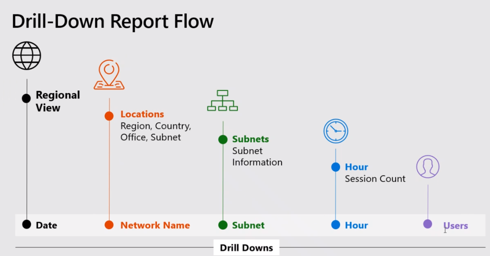

# <a name="data-and-reports-in-call-quality-dashboard-cqd"></a>通话质量仪表板（CQD）中的数据和报表

Microsoft 通话质量仪表板（CQD）使用近乎实时（NRT）的数据馈送。 通话记录在通话结束后的30分钟内 CQD 可用。 从 NRT 管道中调用记录仅在从数据集内删除几个月后才可用。 


> [!NOTE]
> 高级 CQD （11月2019中的新增功能）将较旧的 CQD 管道（使呼叫记录在大约24小时内可用）与高级 CQD 管道中的 NRT 数据合并。 来自存档周期中的数据的旧门户和高级门户的查询将产生相同的结果。 NRT 数据的任何门户上的查询和 NRT 数据 + EUII 期的查询将有所不同。

## <a name="many-ways-to-access-cqd-data"></a>访问 CQD 数据的多种方法

你可以通过多种不同的途径访问 CQD 数据。 选择最能满足你的需求的一个：

|  |  |
|---------|---------|
|团队管理中心[（ https://admin.teams.microsoft.com) ](https://admin.teams.microsoft.com)    | CQD 数据包含在团队管理中心的 "**用户**" 页面上，以易于阅读的格式显示所需的最常见数据。 您不能自定义在 "**用户**" 下找到的 CQD 数据。  |
|CQD portal [（ https://cqd.teams.microsoft.com) ](https://cqd.teams.microsoft.com)     | 具有钻取筛选功能的强大摘要和详细报表，可满足大多数需求。 你还可以在 CQD 门户中自定义报表。 <br><br>获取两个[CQD 报表模板](#import-the-cqd-report-templates)以帮助你分析 CQD 门户中的数据。       |
|Power BI     | 使用直接查询在 Power BI 中使用[可自定义的 POWER bi 模板](CQD-Power-BI-query-templates.md)查看你的 CQD 数据。 [下载 CQD 的 POWER BI 查询模板](https://github.com/MicrosoftDocs/OfficeDocs-SkypeForBusiness/blob/live/Teams/downloads/CQD-Power-BI-query-templates.zip?raw=true)。<br><br>你还可以[使用 REST API 通过 POWER BI 访问 CQD 数据](https://docs.microsoft.com/skypeforbusiness/management-tools/call-quality-dashboard/data-api)。 如果想要下载 CQD 数据以便可以脱机处理它，请使用此方法。 使用此方法的好处是提高了性能，当您在线时，在 Power BI 中 bog 的大型数据集尤其有用。       |
|图形 API     | 使用[图形 API](https://docs.microsoft.com/graph/api/resources/callrecords-api-overview?view=graph-rest-beta)访问呼叫质量数据。 这是最复杂的方法，但它为你提供了分析通话质量数据的最大控制和灵活性。 例如，如果你需要将其与你的组织的其他数据结合使用，则可以使用 Graph API 创建数据模型并合并通话质量数据。        |

## <a name="import-the-cqd-report-templates"></a>导入 CQD 报表模板

下载[两个特选 CQD 报表模板](https://aka.ms/qertemplates)（所有网络和托管网络），帮助你快速快速掌握 CQD。 "所有网络" 模板（虽然已优化为使用生成数据文件）可用于在 CQD 中收集和上载构建信息，如下一节中所述。

**若要导入模板（。CQDX）转换为 CQD**

1. 在 CQD 中，从页面顶部的菜单中选择 "**详细报告**"。

2. 在左面板中，选择 "**导入**"。 浏览到第一个 CQDX 模板，然后选择 "**打开**"。

3. 上载模板后，将显示一个弹出窗口，显示 "报表导入成功" 消息。 

4. 对第二个 CQD 模板重复步骤2和步骤3。

> [!NOTE]
> 每个用户都必须将 CQD 模板导入其 CQD 实例。 


## <a name="euii-data"></a>EUII 数据

出于合规性原因，最终用户身份信息（EUII）数据（也称为个人身份信息或 PII）仅保留30天。 由于 NRT 数据与30天的标记相比较，包含 EUII 的字段将被清除，从而导致 EUII 无 NRT 数据。 包含 EUII 数据的字段是：

- 完整 IP 地址
- 媒体访问控制（MAC）地址
- 基本服务集标识符（BSSID）
- 会话初始协议（SIP） URI （仅 Skype for business）
- 用户主体名称 (UPN)
- 计算机终结点名称
- 用户逐字反馈
- 对象 ID （终结点用户的 Active Directory 对象 ID）

### <a name="admin-roles-with-and-without-euii-access"></a>具有和不具有 EUII 访问权限的管理员角色

这些[RBAC](https://docs.microsoft.com/azure/role-based-access-control/overview)角色**确实**具有 EUII 访问权限：
- 全局管理员
- 团队服务管理员
- 团队通信管理员
- Teams 通信支持工程师
- 全局阅读器
- Skype for Business 管理员

这些 RBAC 角色**没有**EUII 访问权限：
- 报表读者
- 团队沟通支持专家


## <a name="date-controls"></a>日期控件

CQD 支持以下滚动趋势类型：

- 5天
- 7天
- 30天
- 60-day
- 90-day

URL 日期参数接受 Day 字段。 "滚动日期" 报告将 "YYYY-MM-DD 格式" 中指定的日期用作趋势的最后一天。 URL 日期参数 "00" 表示 "今日"。

|URL| 滚动日趋势的结束日期|
|:---|:---|
|<span>https:// <cqdv3> /spd/#/Dashboard/ <reportid> /2019-02/</span>   |2019年2月的当前日期|
|<span>https:// <cqdv3> /spd/#/Dashboard/ <reportid> /2019-02-15/</span>|2019年2月15日|
|<span>https:// <cqdv3> /spd/#/Dashboard/ <reportid> /00/</span>        |当前日期|
|||

默认情况下，该月的当前日期用作滚动日期趋势的最后一天。


## <a name="data-available-in-cqd-reports"></a>CQD 报表中的可用数据

默认摘要和详细 CQD 报表可能是管理组织的通话质量所需的全部信息。如果需要，您可以[创建自定义报表](#create-custom-detailed-reports)。 

如果你想要使用 Power BI 分析你的 CQD 数据，请参阅[使用 POWER bi 分析团队的 CQD 数据](CQD-Power-BI-query-templates.md)。

|功能|摘要报告|详细报告|
|:--- |:--- |:--- |
|应用程序共享跃点数 | 否 | 是 |
|客户构建信息支持 | 是 | 是  |
|客户终结点信息支持 | 仅在 <span> cqd.teams.microsoft.com 中<span/> | 仅在 <span> cqd.teams.microsoft.com 中<span/> |
|向下钻取分析支持   | 否   | 是   |
|媒体可靠性指标   | 否   | 是   |
|现成的报表   | 是   | 是    |
|概述报表   | 是   | 是    |
|每用户报告集   | 否   | 是   |
|报表集自定义（添加、删除、修改报表）   | 否   | 是   |
|基于视频的屏幕共享指标   | 否   | 是   |
|视频指标   | 否   | 是   |
|可用数据量   | 过去12个月   | 过去12个月   |
|Microsoft 团队数据   | 是   | 是    |
| | | |


 
### <a name="select-product-data-to-see-in-reports"></a>选择要在报表中查看的产品数据

在摘要和位置增强的报表中，你可以使用 "**产品筛选器**" 下拉列表显示所有产品数据、仅 Microsoft 团队数据或仅 Skype For business Online 数据。
  

  
在 "详细报表" 中，可以使用 "**属于团队**" 维度将数据筛选到 Microsoft 团队或 Skype For business Online 数据。

## <a name="summary-reports"></a>摘要报告

这些是你首次登录 CQD 时将在 CQD 仪表板上看到的报表。 它们通过 "每天"、"每月" 和 "表" 报表为您提供概览的质量趋势，以帮助识别质量较差的子网。 

|选项卡  |  |
|---------|---------|
|整体通话质量     | 聚合其他3个选项卡        |
|服务器-客户端     |服务器和客户端终结点之间的流的详细信息         |
|客户端-客户端     |两个客户端终结点之间的流的详细信息         |
|语音质量 SLA     |有关 Skype for Business 语音质量[SLA](https://go.microsoft.com/fwlink/p/?linkid=846252)中包含的通话的信息         |

### <a name="overall-call-quality-tab"></a>"整体通话质量" 选项卡

使用此选项卡上的数据根据流计数和不良百分比评估通话质量状态和趋势。 右上角的图例将显示哪些颜色和视觉元素表示这些指标。
  

  
流分为三个组： "完好"、"差" 和 "未分类"。 还计算出的*百分比*值太差，可让你将流的比率划分为*较差*的分类流计数。 由于*较差的% = 不良流/（差流 + 正常流） * 100*，*差%* 不受多个未*分类*流的存在的影响。 若要查看将流分类为差或好的内容，请参阅["呼叫质量" 仪表板中的 "流分类](stream-classification-in-call-quality-dashboard.md)"。
  
使用左侧的刻度测量流计数值。
  

  
使用右侧的刻度测量差的百分比值。
  

  
也可以通过将鼠标悬停在条上来获取实际数值。
  
> [!NOTE]
> 下面的示例来自非常小的示例数据集，并且值对于实际部署不切合实际。
  

  
整个流卷可帮助确定计算出的较差百分比的相关程度。 总体流的数量越小，报告的百分比值越低越可靠。
  
### <a name="server-client-tab-and-client-client-tabs"></a>服务器-客户端选项卡和客户端-客户端选项卡

这两个选项卡提供了在其终结点到终结点应用场景中发生的流的详细信息。 "服务器-客户端" 选项卡具有四个可折叠的部分，表示媒体流将流经的四个方案。
  
- 内部有线
- 外部有线
- 内部 WiFi
- 外部 WiFi

同样，"客户端-客户端" 选项卡具有五个可折叠部分：

- 有线内部-有线内部
- 有线内部-有线外部
- 有线外部-有线外部
- 内部有线-内部 WiFi
- 内部有线-外部 WiFi

#### <a name="inside-versus-outside"></a>内部和外部

CQD 使用建筑物信息将流分类为*内部*或*外部*流（如果存在）。 每个流的终结点与子网地址相关联。 如果子网位于上载的生成信息中标记为 "InsideCorp" 的子网列表中，则将其视为*内部*。 如果尚未上载生成信息，则内部测试始终会将流分类为*外部*流。 

服务器客户端方案的内部测试仅考虑客户端终结点。 由于服务器始终来自用户的视角，因此不会在测试中考虑。
  
#### <a name="wired-versus-wifi"></a>有线与 WiFi

根据名称指示，分类标准基于客户端连接的类型。 服务器始终处于有线，并且不会包含在计算中。 在给定流中，如果两个终结点之一连接到 WiFi 网络，则 CQD 将其分类为 WiFi。
> [!NOTE]
> 如果有一个流，则如果两个终结点中的一个终结点连接到 WiFi 网络，则会在 CQD 中将其分类为 WiFi。
  
  
## <a name="tenant-data-information"></a>租户数据信息

CQD 摘要报告仪表板包括**租户数据上载**页面，该页面从右上角的 "设置" 菜单中选择 "**租户数据上载**"。 此页面用于管理员上载其自己的信息，例如：

- IP 地址和地理信息的地图
- 每个无线 AP 及其 MAC 地址的地图
- 终结点到终结点的映射/模型/类型等。
  
我们建议你上载租户、构建和位置数据，以便 CQD 可以将此信息包含在你的报表中。 如果尚未上载此数据，请阅读[上载租户和生成数据](CQD-upload-tenant-building-data.md)。 


## <a name="detailed-reports"></a>详细报告

|名称  |  |
|---------|---------|
|位置增强的报表     |基于位置信息显示质量趋势。 仅当你[上载了租户数据](CQD-upload-tenant-building-data.md)时，才会显示此报告。        |
|可靠性报告     |包括音频、视频、基于视频的屏幕共享（VBSS）和应用共享报告         |
|体验报告质量     |所有客户端和设备（包括会议室）的音频质量和可靠性。 这些报表是可下载的[CQD 模板](https://aka.ms/QERtemplates)的 "slimmed" 版本，侧重于分析音频质量和可靠性的关键区域。         |
|质量向下钻取报表     | 钻取：按区域、位置、子网、小时和用户的日期         |
|故障深化报告     | 钻取：按区域、位置、子网、小时和用户的日期        |
|评价我的呼叫报告     |按区域、位置或用户分析用户呼叫分级。 包括逐字反馈。         |
|技术支持报表     |技术支持报告查看单个用户、用户组或每个人的呼叫和会议数据。 通过结合构建和 EUII 数据，这些报告可帮助识别基于网络位置、会议详细信息、设备或固件的可能的系统问题。         |
|客户端版本报告     |客户端版本摘要：查看每个客户端应用版本的会话和用户计数<br><br>客户端版本（按用户）：查看每个客户端应用版本的用户名称 <br><br>产品和客户端类型的预生成筛选器帮助将版本集中到特定客户端。         |
|终结点报表     |按计算机终结点（计算机和型号）显示呼叫质量。 这些报表包括生成数据（如果已上载）。         |


## <a name="create-custom-detailed-reports"></a>创建自定义详细报告

如果默认 CQD 报表不能满足您的需要，请按照以下说明创建自定义报表。 或者（从2020年1月起）[使用 POWER BI FOR CQD 报表](cqd-power-bi-query-templates.md)。

从 "登录摘要报告" 屏幕上显示的屏幕顶部显示的报告下拉列表中， \( **Summary Reports**选择 " \) **详细报告**"，然后选择 "**新建**"。 单击报表中的 "**编辑**" 以查看查询编辑器。 每个报告都可以通过对多维数据集进行查询得到。 报告是其查询返回的数据的可视化形式。 查询编辑器可帮助您编辑报表的这些查询和显示选项。
> [!IMPORTANT]
> 网络范围可用于表示 supernet （具有单个路由前缀的若干子网的组合）。 将检查所有新的生成上载，查找任何重叠区域。 如果你以前上载了一个生成文件，则应下载当前文件，然后重新上载它以标识任何重叠，并在再次上载之前修复该问题。 以前上载的文件中的任何重叠都可能会导致向报表中的建筑物进行错误的子网映射。 某些 VPN 实现不能准确报告子网信息。 建议将 VPN 子网添加到生成文件，而不是子网的一个条目时，将 VPN 子网中每个地址的单独条目添加为单独的32位网络。 每一行可以有相同的建筑物元数据。 例如，对于 172.16.18.0/24，而不是一行，您应该有256行，每个地址对应于 172.16.18.0/32 和 172.16.18.255/32 之间（包括这两个地址）的一行。
>
> "VPN" 列是可选的，默认值为0。  如果 VPN 列的值设置为1，则该行表示的子网将完全展开，以匹配子网内的所有 IP 地址。  请谨慎使用，并且仅针对 VPN 子网，因为完全展开这些子网将对涉及生成数据的查询的查询时间产生负面影响。

指向报表中的 "条形图" 和 "趋势线" 以显示详细值。 具有焦点的报表将显示 "操作" 菜单： "**编辑**"、"**复制**"、"**删除**"、"**下载**" 和 "**导出" 报表树**。


## <a name="query-filters"></a>查询筛选器

查询筛选器通过在 CQD 中使用查询编辑器实现。 这些筛选器用于减少 CQD 返回的记录数，从而最大程度减少报表的总体大小和查询时间。 这对于筛选出非托管网络尤其有用。 下表中列出的筛选器使用正则表达式（RegEx）。


| 筛选器         | 说明          | CQD 查询筛选器示例      |
|----------------|----------------------|-------------------------------|
| 无空值   | 某些筛选器没有用于筛选空值的选项。 若要手动筛选空值，请使用空白表达式，并将筛选器设置为等于或不等于，具体取决于你的需求。      | 第二建筑物名称 \<\> \^ \\ s\*\$                       |
| 排除公共子网 | 如果没有有效的生成文件以从非托管网络单独托管，则报告中将包含家庭网络。 这些主子网位于其控制范围之外，可以从报表中快速排除。 本指南中定义的常用子网是10.0.0.0、192.168.1.0 和192.168.0.0。 | 第二子网 \<\> 10.0.0.0 \| 192.168.0.0 \| 192.168.1。0 |
| 仅限内部查看  | 用于筛选托管（内部）或非托管（外部）的报表。 托管 CQD 模板已预配置了这些筛选器。       | 第二内部公司内部公司 = 内部        |

## <a name="report-filters"></a>报表筛选器

使用 CQD 报表筛选器缩小调查的重点。 通过在查询编辑器或直接在报表中向呈现的报表添加筛选器，可以使用报表筛选器。 以下报表筛选器在整个[CQD 模板](https://aka.ms/QERtemplates)中使用。


| 筛选器     | 说明                            | CQD 报表筛选器示例         |
|------------|----------------------------------------|-----------------------------------|
| Month      | 首先从年开始，然后是 "月"。 | 2017-10                           |
| 字母 | 筛选任何字母字符。 | [a-z]                             |
| 整数    | 筛选任何数字字符。    | [0-9]                             |
| 百分比 | 按百分比筛选。              | （[3-9] \\ 。） \|（[3-9]） \|（[1-9] [0-9]） |


### <a name="drill-down-filters"></a>向下钻取筛选器

CQD 报表功能有多种分级式筛选器，这些筛选器是用于缩小通话质量调查重点的强大工具。 如果选择 "向下钻取" 字段，报表将自动打开相应的选项卡并筛选所选值。 如果该选项卡具有自己的向下钻取字段，并且选择了一个，则会同时应用两组筛选器，从而逐渐缩小生成的数据集。




#### <a name="adding-and-editing-drill-down-fields"></a>添加和编辑向下钻取字段

编辑报表时，你可以选择使用查询编辑器指定你自己的向下钻取字段。

首先单击 " **...** " 对于要编辑的报表，然后选择 "**编辑**"。


从查询编辑器左侧的列表中选择一个维度。 然后单击 "**导航到**标签" 下方的下拉列表，然后选择要该维度钻取到的选项卡和展开器组。 注意：目前，向下钻取功能仅通过导航到不同的选项卡来工作。 稍后将添加对特定展开器的钻取支持。 最后，单击 "**关闭**" 以保存对维度所做的更改，然后单击 "**保存**" 以保存并关闭 "查询编辑器"。


### <a name="multi-select-filters"></a>多选筛选器

除了向下钻取功能之外，CQD 还支持指定具有多个值（或筛选器）的筛选器。

若要选择多个筛选值，请首先向报表添加新筛选器。 单击 **+** "**筛选器**" 标签旁边的 "输入要使用的维度名称"，然后单击 "**添加**"。


然后，单击 "**搜索**" （新筛选器旁边的放大镜图标）。 你将看到一个文本字段和多个选项，包括 "全**选**" 和 "**反转**"。 输入一个值，然后单击要搜索的字段旁边的 "**搜索**"。 或者，将文本字段保留为空，然后单击 "**搜索**" 以查看到最多第一个100选项。

```PowerShell
/filter/[AllStreams].[Second Tenant Id]\|[YOUR TENANT ID HERE]
```

上例  


### <a name="dashboard-level-filters"></a>仪表板级别筛选器
某些 CQD 报表将向其添加仪表板级筛选器，以便轻松按常用参数进行筛选。 这些筛选器显示在常规报表选项卡之外和产品筛选器的正下方，它们应用于仪表板中的所有筛选器。


```PowerShell
/filter/[AllStreams].[Is Teams]|[TRUE | FALSE]
```

### <a name="url-filters"></a>URL 筛选器

CQD 支持将筛选器添加到 URL。 这使你可以轻松地共享或书签 CQD 查询。 可以在 URL 中定义参数，如 "趋势月份"、"租户 ID" 或 "语言"。 您还可以将产品或仪表板级别的筛选器添加到 URL。
当修正托管建筑物或网络（其中联合终结点可能会影响你的报表）时，从 CQD 报告中排除联合数据将非常有用。

若要添加筛选器，请将以下内容附加到 URL 的末尾：

```
/filter/[AllStreams].[Second Tenant Id]\|[YOUR TENANT ID HERE]
```

上例  

```https://cqd.teams.microsoft.com/cqd/#/1234567/2018-08/filter/[AllStreams].[Second Tenant Id]|[TENANTID]```

若要将仪表板级别的筛选器添加到 URL，该筛选器必须作为产品或仪表板级别的筛选器存在于 CQD 中。 将这些筛选器添加到趋势月份后和 URL 参数之前的 URL：

```filter/DATA_MODEL_NAME|VALUE```

例如，若要应用 Microsoft 团队的产品筛选器值，请添加以下内容：

```filter/[AllStreams].[Is%20Teams]|[True]```

整个 URL 将如下所示：

```https://cqd.teams.microsoft.com/spd/#/Dashboard/2624085/2018-9/filter/[AllStreams].[Is%20Teams]|[True]```

若要将 URL 筛选器应用于多选值，请使用管道（|）字符分隔每个值。 例如：

```filter/[AllStreams].[Media%20Type]|[Video]|[Audio]|[VBSS]```

如果指定了无效的名称或值，则不会应用 URL 筛选器。


可以使用 URL 筛选器筛选特定维度的每个报表。 最常用的 URL 筛选器用于筛选报表以排除联合参与者遥测，或者仅关注团队或 Skype for business Online。 当修正托管建筑物或网络（其中联合终结点可能会影响你的报表）时，从 CQD 报告中排除联合数据将非常有用。

| 筛选器         | 说明          | CQD 查询筛选器示例      |
|----------------|----------------------|-------------------------------|
| 无空值   | 某些筛选器没有用于筛选空值的选项。 若要手动筛选空值，请使用空白表达式，并将筛选器设置为等于或不等于，具体取决于你的需求。      | 第二建筑物名称 \<\> \^ \\ s\*\$                       |
| 排除公共子网 | 如果没有有效的生成文件以从非托管网络单独托管，则报告中将包含家庭网络。 这些主子网位于其控制范围之外，可以从报表中快速排除。 如本文中所述，常见子网是10.0.0.0、192.168.1.0 和192.168.0.0。 | 第二子网 \<\> 10.0.0.0 \| 192.168.0.0 \| 192.168.1。0 |
| 仅限内部查看  | 用于筛选托管（内部）或非托管（外部）的报表。 托管 CQD 模板已预配置了这些筛选器。       | 第二内部公司内部公司 = 内部        |


#### <a name="how-to-find-your-tenant-id"></a>如何查找你的租户 ID

CQD 中的租户 ID 对应于 Azure 中的目录 ID。 如果你不知道你的目录 ID，可以在 Azure 门户中找到它：

1.  登录到 Microsoft Azure 门户：<https://portal.azure.com>

2.  选择 " **Azure Active Directory**"。

3.  在 "**管理**" 下，选择 "**属性**"。 你的租户 ID 位于 "**目录 id** " 框中。

你还可以使用 PowerShell 查找租户 ID： 
  ```
  Login-AzureRmAccount
  ```


## <a name="comparing-teams-and-skype-for-business-cqd-data"></a>比较团队和 Skype for Business CQD 数据

即使在最新的 CQD （cqd.teams.microsoft.com）内，你也可以看到团队和 Skype for business 之间的数据差异。 原因如下：
- 确保性能和可靠性的机制的差异
  - 团队已自动重新连接和快速漫游。 Skype for Business 不支持。
  - 团队拥有动态带宽管理。 Skype for Business 不支持。
- 团队和 Skype for business 之间[IP 地址范围](Office-365-URLs-IP-address-ranges.md)的差异。 团队 IP 范围较新，这可能会导致防火墙出现连接问题。

## <a name="open-cqd-from-the-skype-for-business-legacy-portal"></a>从 Skype for Business 旧版门户打开 CQD

**使用 skype for business 旧版门户**的 skype for business 徽标的图标

1. 使用管理员帐户登录到您的 Office 365 组织，然后选择 "**管理员**" 磁贴以打开管理中心。
2. 在左窗格中的 "**管理中心**" 下，选择 " **Microsoft 团队**" 以打开 "团队管理中心"。
3. 在 "团队管理中心" 中，选择左窗格中的 "**旧版门户**"，选择 "**工具**"，然后选择 " **Skype for Business Online 呼叫质量" 仪表板**。

     

4. 在打开的页面上，用全局管理员帐户登录，然后在出现提示时提供帐户的凭据。

第一次登录后，CQD 将开始收集和处理数据。 

> [!IMPORTANT]
> 从2019年12月到，您仍然可以访问旧版本的 CQD （cqd.lync.com），尽管旧版门户提供了指向最新 CQD （cqd.teams.microsoft.com）的链接。 最终，旧版本的 CQD 将会停止。 从2020年7月1日起，较早版本的 CQD 将访问新 CQD 中的数据（ https://CQD.teams.microsoft.com) ，不能再导出生成和报告数据。 在后期2020中，我们将关闭旧的 CQD，您将无法再访问它。


## <a name="related-topics"></a>相关主题

[改善和监控团队的通话质量](monitor-call-quality-qos.md)

[什么是 CQD？](CQD-what-is-call-quality-dashboard.md)

[设置通话质量仪表板（CQD）](turning-on-and-using-call-quality-dashboard.md)

[上载租户和生成数据](CQD-upload-tenant-building-data.md)

[使用 CQD 管理通话和会议质量](quality-of-experience-review-guide.md)

[CQD 中可用的维度和度量值](dimensions-and-measures-available-in-call-quality-dashboard.md)

[CQD 中的流分类](stream-classification-in-call-quality-dashboard.md)

[使用 Power BI 分析 CQD 数据](CQD-Power-BI-query-templates.md)
