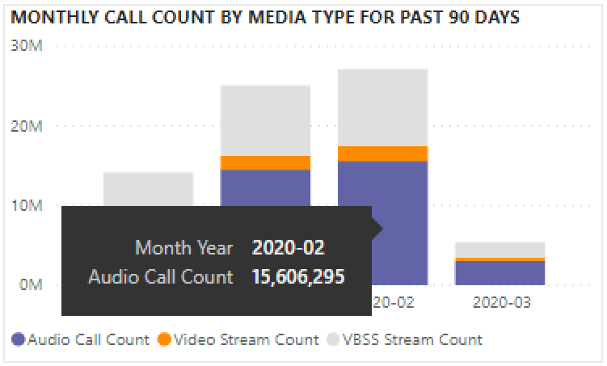
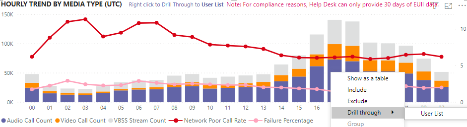

# 使用 CQD 数据查看 Power BI 中的 Microsoft Teams 利用率View Microsoft Teams utilization in Power BI using CQD data

2020 年 3 月新增功能，我们已将 Teams 使用率报告添加到 [CQD](https://github.com/MicrosoftDocs/OfficeDocs-SkypeForBusiness/blob/live/Teams/downloads/CQD-Power-BI-query-templates.zip?raw=true)的可下载 Power BI 查询模板。New in March 2020, we've added a Teams Utilization report to our downloadable [Power BI query templates for CQD](https://github.com/MicrosoftDocs/OfficeDocs-SkypeForBusiness/blob/live/Teams/downloads/CQD-Power-BI-query-templates.zip?raw=true). 

通过此新的 Teams 使用率报告， (访问 Teams 呼叫质量仪表板) CQD (使用 Microsoft Teams) 多少。This new Teams Utilization reports lets you see how (and how much) your users are using Microsoft Teams by accessing Teams Call Quality Dashboard (CQD) data. 这些报告旨在成为管理员和业务领导都可以快速转到此数据的集中位置。These reports are intended to be a centralized location that both administrators and business leaders can quickly go to for this data.

Teams 使用率 Power BI 报告由两个主要报告组成： **[通话计数摘要](#call-count-summary-report)** 和 **[音频分钟数摘要](#audio-minutes-summary-report)**。The Teams Utilization Power BI report consists of two primary reports: **[Call Count Summary](#call-count-summary-report)** and **[Audio Minutes Summary](#audio-minutes-summary-report)**. 当用户[利用下面](#daily-usage)说明中记下的向下钻取报表时，"每日使用情况、区域音频详细信息、会议详细信息和用户列表"报告将发挥作用。 The [Daily Usage](#daily-usage), [Regional Audio Details](#regional-audio-details), [Conference Details](#conference-details) and [User List](#user-list) reports come into play when a user takes advantage of the drill-down reports, noted in the descriptions below.

> [!NOTE]
> 必须填充生成和子网数据，以提供区域和网络筛选功能。Building and subnet data must be populated to provide regional and network filtering capabilities.

## 呼叫计数摘要报告Call Count Summary Report

呼叫 (摘要) 主页立即提供过去 30 天和 90 天内的音频、视频和屏幕共享会话数，如部分标题所述。The main page (Call Count Summary) immediately provides the number of audio, video and screen sharing sessions over the last 30 and 90 days as noted in the section title. 最初显示的数据适用于整个组织，可以使用页面左侧的切片器下拉选项进行筛选。The data initially displayed is for the organization as a whole and can be filtered using the slicer dropdown options on the left side of the page.

1. 切片器下拉列表右侧按媒体类型细分为过去 30 天内的内部/外部视图。To the right of the slicer dropdowns, the number of calls by media type is broken down to an internal/external view over the past thirty days. 通过上面的屏幕截图，可以看到，从组织外部位置发生的调用越来越多，考虑到当前的全局环境，这很有意义。We can see through the above screenshot that there are more calls happening from outside organizational locations, which makes sense considering the current global environment.
  

1. 在媒体类型计数框的右侧，我们按媒体类型显示过去 90 天的每月呼叫计数。To the right of the media type count box, we have the Monthly Call Count by Media Type for the last 90 days. 可以将每个列和媒体类型悬停在上方以显示上个月或当前月份到目前为止的计数，从而提供使用趋势信息。Each column and media type can be hovered over to display the count for a previous month or the current month to date, providing usage trend information.
  
 

1. 中间图的作用与 90 天图一样，但它提供过去 30 天的每日使用情况视图，允许用户右键单击并向下钻取特定日期的详细信息。The middle graph functions as the 90-day graph does, however it provides a daily usage view for the past 30 days and allows a user to right click and drill down into details for a specific day.
  

在页面左下角，可找到一个表，其中提供了过去一年每种媒体类型的总计值。On the bottom left section of the page, you'll find a table providing total values for each media type over the past year. 
         

在表格右侧，条形图显示过去 30 天内 (通话/流) 的客户端。To the right of the table, a bar chart shows clients with the most use (calls/streams) for the past 30 days.
   

此页面的最后一组图表分别显示每种媒体类型，其中显示了会议的细目和 P2P 使用情况。The last set of charts for this page show each media type individually, with a breakdown showing conference and P2P usage. 下面的图表显示，与 P2P 相比，会议使用量要高得多。The charts below show that there is a significantly higher number of conference usage as compared to P2P.
  

## 音频分钟数摘要报告Audio Minutes Summary Report

在"音频分钟数使用情况"报表上，通过几个不同的视图提供总分钟数使用情况。On the Audio Minutes usage report, the total minute usage is provided through a few different views. 

切片器旁边显示了易于使用的文本框的 30 天使用情况摘要。We have the thirty-day usage summary shown next to the slicers as easy to consume text boxes. 顶部数字显示 30 天总计，内部和外部细目低于该数字。The top number shows the thirty-day total, with internal and external breakdowns below that.

右上方的条形图提供会议音频使用情况的一年视图。The top right bar graph provides a yearlong view of conference audio usage. 将鼠标悬停在一个月内以显示会议音频分钟数。Hover over the month to show the conference audio minutes.

为了显示 P2P 和会议音频的差异，左下角的图表采用过去一年的所有音频，并在这两种类型之间进行分解。To show the difference in P2P and conference audio, the bottom left chart takes all audio for the past year and breaks it up between the two types.

"音频分钟数"页的最后一个图表显示全局地图覆盖层上的音频分钟数使用情况。The last chart for the Audio minutes page shows audio minute usage on a global map overlay. 只有在将生成和子网数据上传到租户时，此图表才工作。This chart will only work if building and subnet data is uploaded to the tenant. 可以钻取地图上的饼图覆盖层，随后提供区域音频使用情况。The pie chart overlay on the map can be drilled into, subsequently providing regional audio usage.

## 钻取功能Drill-through capabilities

如前所述，用户可以深入了解每日和区域使用情况报告。As previously noted, users can drill into the daily and regional usage reports.

### 每日使用情况Daily Usage

"每日使用情况"报表允许管理员确定一天中的高峰使用时段。The Daily Usage report allows an administrator to identify peak consumption periods through the course of a day. 除了使用情况，我们还能够捕获当天的总体用户情绪和反馈。In addition to usage, we are also able to capture overall user sentiment and feedback for that day.

"每日使用情况"报表显示所选天的音频、视频和屏幕共享数，添加了区分内部和外部连接的能力。The Daily usage report displays the number of Audio, Video and Screen shares for the selected day with the added ability to differentiate between internal and external connectivity. "会议"和"对等"细分位于"形式总计"框的右下角。A Conference and Peer to Peer breakdown is to the immediate right of the modality total box. 报表的右上方提供了一个会议列表，其中列出了当天的关联 ID 和参与者。The top right of the report provides a list of conferences with their associated ID and participants for the day. 会议列表还提供对"会议详细信息"报告的其他向下钻取。The conference list provides an additional drill down to the Conference Details report as well. 替换图形REPLACE GRAPHIC

中心区域中的条形图允许用户确定一天中的高峰使用时段。The bar graph in the center area allows the user to identify peak consumption periods through the course of a day. 用户可以向下钻取图表上表示的小时，该小时将显示"用户列表"报告。Users may drill down into the hour represented on the graph which will present the User List report for the hour.

在条形图右侧，以可视格式显示用户反馈。To the right of the bar graph, User Feedback is presented in a visual format. 虽然用户情绪可能是主观的，但它确实提供可用于识别潜在问题的见解。While user sentiment can be subjective, it does provide insight that can be used to identify potential issues.

底部表提供当天的指标范围。The bottom table provides a range of metrics for the day. 较差的百分比和失败率可为管理员提供潜在的改进领域。Poor percentages along with failure rates can provide an administrator with potential areas of improvement. 也可以单独选择每小时，如下所示。Each hour can also be selected individually as shown below.

此数据可用于识别在高峰使用时段出现问题的区域。This data can be used to identify regions having problems during peak consumption times.

单击该天的列以显示该小时的指标。Click on the column for that day to display metrics for that hour.

  
  1.  图表下方的表格将显示该小时的指标。The table below the chart will display the metrics for that hour. 这可以通过任何列标题进行排序;但是，我们希望找到有问题的领域。This can be sorted by any column header; however, we would be interested in finding problematic areas.  
    
    
  2.  在此时间帧内，我们看到 IND 区域在会议中遇到较差的视频性能。We see that the IND region is experiencing poor video performance in conferences during this time frame. 随后，可以使用 CQD QER Microsoft 报告缩小有问题的位置范围，因为已识别到该区域和时间范围。Subsequently, the CQD QER Microsoft reports can be used to narrow down the problematic location as the region and time frame has been identified.

### 会议详细信息Conference Details

"会议详细信息"报告提供会议的其他见解，从与会者列表到会话期间使用的媒体类型。The Conference Details report provides additional insight for meetings, from an attendee list, to the media types used during the session.

右键单击"每日使用状况"页面上会议 ID 图表中的参与者栏，向下钻取会议详细信息。Right click a conference the participant bar in the conference ID chart on the Daily usage page to drill down into the conference details.

  

我们可以看到会议参与者以及数据包丢失和抖动的所有相关信息，以帮助在底部表格中进行潜在的故障排除工作。We can see the participants in the conference as well as all the pertinent information down to packet loss and jitter to assist with potential troubleshooting efforts in the bottom table.

### 区域音频详细信息Regional Audio Details

"区域音频详细信息"向下钻取专门显示所选区域的音频分钟数使用情况。The Regional Audio Details drill down specifically shows the audio minute usage for the selected region. 有权访问 CQD 的用户可以在所选区域查看 P2P 和会议音频的使用趋势。Users with access to CQD can see usage trends for both P2P and conference audio within the selected region.

1.  在"呼叫计数摘要"页上，通过表钻取到作为特定区域。On the Call Count Summary page, drill-through to as specific region through the table.
  

2.  选择包含区域的其他信息的行。Select the row with the region additional information is needed for.
  

3.  数据趋势显示内部网络上使用大量分钟数，会议远超 P2P 使用。The data trends show a significant number of minutes being used on the internal network, with conferencing far surpassing P2P use.
  

区域音频趋势可用于显示用户受到世界外部影响的影响。The regional audio trend can be used to show how users are impacted by external influences in the world. 具体而言，目前我们预期 EMEA 和 APAC 区域的外部使用量会随着要求远程工作的人的增加而增加。Specifically, right now, we would expect to see the external usage for the EMEA and APAC regions to increase with people being asked to work remotely.

### 用户列表User List

按预期，"用户列表"向下钻取提供查看报告的用户选择的特定小时的用户特定信息。The User List drill down provides, as one might expect, user specific information for a specific hour selected by the person viewing the report. 可以通过每日使用情况报表上"每小时趋势"图中的向下钻取来访问用户列表报表。The User List report is accessible through a drill down in the Hourly Trends graph on the Daily Usage report. 右键单击所需的小时其他信息，然后选择"钻取"和"用户列表"，如下所示。Right click on the hour additional information is needed for and select Drill through and User List, as shown below.

"用户列表"报表通过页面顶部中心的圆环图显示内部/外部连接。The User List report shows internal/external connectivity through the doughnut chart in the top center of the page. 如下图所示，企业网络外部存在大量参与活动。We can see that there is a large amount of participation from Outside the corporate network in the below image.

图的右上方显示每个用户在这一小时内进行调用的数量。The top right of the graph shows the number of calls made by each user within that hour.

底部表提供每个用户在这一小时内参与的会话的详细信息。The bottom table provides detailed information for the sessions each user participated in during that hour. "失败类型"列可用于确定导致调用删除的原因。The Failure Type column is useful in determining what caused a call to drop. "捕获"和"呈现设备"列可用于识别报告通话质量差的原因。The Capture and Render Device columns are useful in identifying why a call was reported having poor quality.

## 相关主题Related topics

[通话质量仪表板中可用的维度和衡量指标Dimensions and measures available in Call Quality Dashboard](dimensions-and-measures-available-in-call-quality-dashboard.md)

[通话质量仪表板中的流分类Stream Classification in Call Quality Dashboard](stream-classification-in-call-quality-dashboard.md)

[设置 Skype for Business 通话分析Set up Skype for Business Call Analytics](set-up-call-analytics.md)

[使用通话分析来排查通话质量不良问题Use Call Analytics to troubleshoot poor call quality](use-call-analytics-to-troubleshoot-poor-call-quality.md)

[通话分析和通话质量仪表板Call Analytics and Call Quality Dashboard](./monitor-call-quality-qos.md)

[Teams 疑难解答Teams Troubleshooting](/MicrosoftTeams/troubleshoot/teams)
