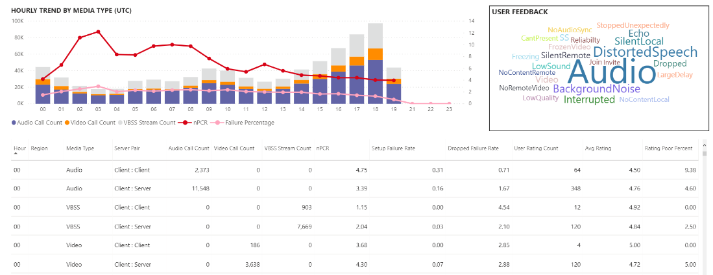

# 使用 CQD 数据在 Power BI 中查看 Microsoft 团队的利用率

2020年3月新增功能，我们已将团队使用情况报告添加到可下载[的 POWER BI 查询模板 FOR CQD](https://github.com/MicrosoftDocs/OfficeDocs-SkypeForBusiness/blob/live/Teams/downloads/CQD-Power-BI-query-templates.zip?raw=true)。 

此新团队使用情况报表使你可以查看你的用户使用 Microsoft 团队的方式（以及多少）。 这些报表旨在作为中心位置，供管理员和业务负责人快速访问此数据。

"团队利用率 Power BI" 报表包含两个主要报表： "**[通话计数摘要](#call-count-summary-report)**" 和 "**[音频分钟摘要](#audio-minutes-summary-report)**"。 [每日使用情况](#daily-usage)、[区域音频详细信息](#regional-audio-details)、[会议详细信息](#conference-details)和[用户列表](#user-list)报告在用户利用分级式报告（如下所述的说明）中时，将会播放。

> [!NOTE]
> 必须填充构建和子网数据才能提供区域和网络筛选功能。

## 通话计数摘要报告

主页面（"呼叫计数摘要"）立即提供最近30日和90天内的音频、视频和屏幕共享会话数，如部分标题中所述。 最初显示的数据适用于整个组织，并且可以使用页面左侧的切片器下拉选项进行筛选。

1. 在切片器下拉的右侧，媒体类型的调用次数将在过去30天内分解为内部/外部视图。 通过上面的屏幕截图，我们可以看到来自外部组织位置的更多通话，这对考虑当前的全球环境很有意义。
  

1. 在 "媒体类型计数" 框的右侧，我们有 "每月通话计数"，"媒体类型" 是过去90天的媒体类型。 每个列和媒体类型都可以悬停在上方，以显示上个月或当前月份的计数，从而提供使用趋势信息。
  
 

1. 中间图按90天的图表运行，但它提供过去30天的 "每日使用状况" 视图，并允许用户右键单击并向下钻取特定日期的详细信息。
  

在页面的左下部分，你将找到一个表，其中提供了过去一年的每种媒体类型的总值。 
        

在表右侧，条形图显示过去30天内最常用的客户端（"调用/流"）。
   

此页面的最后一组图表分别显示每种媒体类型，并显示 "会议和 P2P 使用情况" 细目。 下面的图表显示，与 P2P 相比，有明显更高的会议使用次数。
  

## 音频分钟摘要报告

在 "音频分钟使用情况" 报表上，通过几种不同的视图提供总分钟使用率。 

我们在切片器的旁边显示了三十天的使用摘要，很容易使用文本框。 顶部数字显示三十天的合计，其中包含内部和外部细目。

顶部右上条图提供了一个 yearlong 的会议音频使用视图。 将鼠标悬停在月份上可显示会议音频分钟数。

为了显示 P2P 和会议音频的差异，底部左图获取过去一年的所有音频，并将其在两种类型之间分隔。

"音频分钟" 页面的最后一个图表显示全局地图覆盖上的音频分钟使用率。 只有在将生成和子网数据上载到租户时，此图表才起作用。 可以深化地图上的饼图覆盖层，然后提供区域音频使用。

## 钻取功能

如前面所述，用户可以深入查看每日和地区使用情况报告。

### 每日使用

"每日使用情况" 报表允许管理员通过一天的时间标识高峰期。 除了使用，我们还能够捕获整个用户情绪和该天的反馈。

"每日使用情况" 报表显示选定日期的音频、视频和屏幕共享的数量，并添加了在内部和外部连接之间进行区分的功能。 会议和对等细分位于 "分类汇总" 框的紧右侧。 报表的右上角提供一组会议及其关联的 ID 和参与者。 "会议列表" 还提供了进一步的向下钻取到 "会议详细信息" 报表的详细信息。 替换图形

中心区域中的条形图允许用户通过一天内标识高峰期使用期。 用户可以向下钻取到显示在该小时的 "用户列表" 报表的图表上的小时。

在条形图的右侧，用户反馈以可视格式显示。 尽管用户情绪可以进行主观，但它提供了可用于识别潜在问题的洞察力。

下表提供了一系列指标。 较差的百分比与故障率一起可为管理员提供潜在改进领域。 还可以单独选择每个小时，如下所示。

此数据可用于识别在高峰使用期间出现问题的区域。

单击该日期的列以显示该小时的度量值。

  
  1.  图表下方的表将显示该小时的度量值。 这可以按任何列标题进行排序;但是，我们会对查找有问题的区域感兴趣。  
    
    
  2.  我们看到，在此时间范围内，IND 区域在会议中的视频性能很差。 随后，CQD QER Microsoft 报表可用于缩小有问题的位置，因为区域和时间框架已确定。

### 会议详细信息

"会议详细信息" 报表向会话期间使用的媒体类型提供对会议（来自与会者列表）的其他见解。

右键单击会议 "日常使用" 页面上的 "会议 ID" 图表中的参与者栏可向下钻取到会议详细信息。

  

我们可以查看会议中的参与者，并向下表中的所有相关信息减少数据包丢失和抖动，以帮助在下表中进行潜在的疑难解答工作。

### 区域音频详细信息

区域音频详细信息 "向下钻取" 特别显示所选区域的音频分钟用量。 具有 CQD 访问权限的用户可以查看所选区域内的 P2P 和会议音频的使用趋势。

1.  在 "通话计数摘要" 页面上，通过表格钻取到 "特定区域"。
  

2.  选择需要其他区域信息的行。
  

3.  数据趋势显示在内部网络上使用了很长的分钟数，并且会议的 P2P 使用远达超越 P2P。
  

区域音频趋势可用于显示世界上的外部影响对用户有何影响。 具体地说，我们将看到 EMEA 地区和 APAC 地区的外部使用情况，以便与要求远程工作的人一起增加。

### 用户列表

用户列表向下钻取提供了一个特定时间的用户特定信息，这些信息由查看报表的人员选择。 用户列表报表可通过 "每日使用情况" 报表上的 "每小时趋势" 图形中的向下钻取。 右键单击需要的附加信息，然后选择 "钻取" 和 "用户列表"，如下所示。

"用户列表" 报表通过页面顶部中心的圆环图显示内部/外部连接。 我们可以看到下面的图像中有大量参与公司网络外部的参与。

图表的右上角显示该小时内每个用户所做的通话次数。

下表提供了每个用户在该时间内参与的会话的详细信息。 "失败类型" 列可用于确定导致调用丢弃的原因。 "捕获" 和 "呈现设备" 列用于识别为什么报告通话质量较差的原因。

## 相关主题

[通话质量仪表板中可用的维度和衡量指标](dimensions-and-measures-available-in-call-quality-dashboard.md)

[通话质量仪表板中的流分类](stream-classification-in-call-quality-dashboard.md)

[设置 Skype for Business 通话分析](set-up-call-analytics.md)

[使用通话分析来排查通话质量不良问题](use-call-analytics-to-troubleshoot-poor-call-quality.md)

[通话分析和通话质量仪表板](difference-between-call-analytics-and-call-quality-dashboard.md)
 