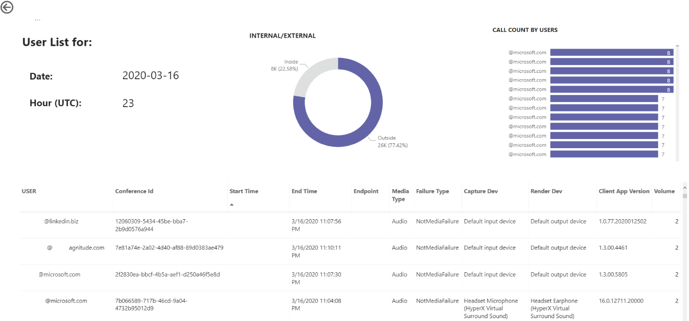

# 使用 CQD 数据在 Power BI 中查看 Microsoft 团队的利用率View Microsoft Teams utilization in Power BI using CQD data

2020年3月新增功能，我们已将团队使用情况报告添加到可下载[的 POWER BI 查询模板 FOR CQD](https://github.com/MicrosoftDocs/OfficeDocs-SkypeForBusiness/blob/live/Teams/downloads/CQD-Power-BI-query-templates.zip?raw=true)。New in March 2020, we've added a Teams Utilization report to our downloadable [Power BI query templates for CQD](https://github.com/MicrosoftDocs/OfficeDocs-SkypeForBusiness/blob/live/Teams/downloads/CQD-Power-BI-query-templates.zip?raw=true). 

这一新的团队使用情况报告让你可以通过访问团队通话质量仪表板 (CQD) 数据，了解 (和你的用户使用 Microsoft 团队) 的程度。This new Teams Utilization reports lets you see how (and how much) your users are using Microsoft Teams by accessing Teams Call Quality Dashboard (CQD) data. 这些报表旨在作为中心位置，供管理员和业务负责人快速访问此数据。These reports are intended to be a centralized location that both administrators and business leaders can quickly go to for this data.

"团队利用率 Power BI" 报表包含两个主要报表： "**[通话计数摘要](#call-count-summary-report)**" 和 "**[音频分钟摘要](#audio-minutes-summary-report)**"。The Teams Utilization Power BI report consists of two primary reports: **[Call Count Summary](#call-count-summary-report)** and **[Audio Minutes Summary](#audio-minutes-summary-report)**. [每日使用情况](#daily-usage)、[区域音频详细信息](#regional-audio-details)、[会议详细信息](#conference-details)和[用户列表](#user-list)报告在用户利用分级式报告（如下所述的说明）中时，将会播放。The [Daily Usage](#daily-usage), [Regional Audio Details](#regional-audio-details), [Conference Details](#conference-details) and [User List](#user-list) reports come into play when a user takes advantage of the drill-down reports, noted in the descriptions below.

> [!NOTE]
> 必须填充构建和子网数据才能提供区域和网络筛选功能。Building and subnet data must be populated to provide regional and network filtering capabilities.

## 通话计数摘要报告Call Count Summary Report

主页面 ("呼叫计数摘要") 立即提供最近30日和90天内的音频、视频和屏幕共享会话数（如节标题中所述）。The main page (Call Count Summary) immediately provides the number of audio, video and screen sharing sessions over the last 30 and 90 days as noted in the section title. 最初显示的数据适用于整个组织，并且可以使用页面左侧的切片器下拉选项进行筛选。The data initially displayed is for the organization as a whole and can be filtered using the slicer dropdown options on the left side of the page.

1. 在切片器下拉的右侧，媒体类型的调用次数将在过去30天内分解为内部/外部视图。To the right of the slicer dropdowns, the number of calls by media type is broken down to an internal/external view over the past thirty days. 通过上面的屏幕截图，我们可以看到来自外部组织位置的更多通话，这对考虑当前的全球环境很有意义。We can see through the above screenshot that there are more calls happening from outside organizational locations, which makes sense considering the current global environment.
  

1. 在 "媒体类型计数" 框的右侧，我们有 "每月通话计数"，"媒体类型" 是过去90天的媒体类型。To the right of the media type count box, we have the Monthly Call Count by Media Type for the last 90 days. 每个列和媒体类型都可以悬停在上方，以显示上个月或当前月份的计数，从而提供使用趋势信息。Each column and media type can be hovered over to display the count for a previous month or the current month to date, providing usage trend information.
  
 

1. 中间图按90天的图表运行，但它提供过去30天的 "每日使用状况" 视图，并允许用户右键单击并向下钻取特定日期的详细信息。The middle graph functions as the 90-day graph does, however it provides a daily usage view for the past 30 days and allows a user to right click and drill down into details for a specific day.
  

在页面的左下部分，你将找到一个表，其中提供了过去一年的每种媒体类型的总值。On the bottom left section of the page, you'll find a table providing total values for each media type over the past year. 
         

在表的右侧，条形图显示过去30天内最常使用 (通话/流) 的客户。To the right of the table, a bar chart shows clients with the most use (calls/streams) for the past 30 days.
   

此页面的最后一组图表分别显示每种媒体类型，并显示 "会议和 P2P 使用情况" 细目。The last set of charts for this page show each media type individually, with a breakdown showing conference and P2P usage. 下面的图表显示，与 P2P 相比，有明显更高的会议使用次数。The charts below show that there is a significantly higher number of conference usage as compared to P2P.
  

## 音频分钟摘要报告Audio Minutes Summary Report

在 "音频分钟使用情况" 报表上，通过几种不同的视图提供总分钟使用率。On the Audio Minutes usage report, the total minute usage is provided through a few different views. 

我们在切片器的旁边显示了三十天的使用摘要，很容易使用文本框。We have the thirty-day usage summary shown next to the slicers as easy to consume text boxes. 顶部数字显示三十天的合计，其中包含内部和外部细目。The top number shows the thirty-day total, with internal and external breakdowns below that.

顶部右上条图提供了一个 yearlong 的会议音频使用视图。The top right bar graph provides a yearlong view of conference audio usage. 将鼠标悬停在月份上可显示会议音频分钟数。Hover over the month to show the conference audio minutes.

为了显示 P2P 和会议音频的差异，底部左图获取过去一年的所有音频，并将其在两种类型之间分隔。To show the difference in P2P and conference audio, the bottom left chart takes all audio for the past year and breaks it up between the two types.

"音频分钟" 页面的最后一个图表显示全局地图覆盖上的音频分钟使用率。The last chart for the Audio minutes page shows audio minute usage on a global map overlay. 只有在将生成和子网数据上载到租户时，此图表才起作用。This chart will only work if building and subnet data is uploaded to the tenant. 可以深化地图上的饼图覆盖层，然后提供区域音频使用。The pie chart overlay on the map can be drilled into, subsequently providing regional audio usage.

## 钻取功能Drill-through capabilities

如前面所述，用户可以深入查看每日和地区使用情况报告。As previously noted, users can drill into the daily and regional usage reports.

### 每日使用Daily Usage

"每日使用情况" 报表允许管理员通过一天的时间标识高峰期。The Daily Usage report allows an administrator to identify peak consumption periods through the course of a day. 除了使用，我们还能够捕获整个用户情绪和该天的反馈。In addition to usage, we are also able to capture overall user sentiment and feedback for that day.

"每日使用情况" 报表显示选定日期的音频、视频和屏幕共享的数量，并添加了在内部和外部连接之间进行区分的功能。The Daily usage report displays the number of Audio, Video and Screen shares for the selected day with the added ability to differentiate between internal and external connectivity. 会议和对等细分位于 "分类汇总" 框的紧右侧。A Conference and Peer to Peer breakdown is to the immediate right of the modality total box. 报表的右上角提供一组会议及其关联的 ID 和参与者。The top right of the report provides a list of conferences with their associated ID and participants for the day. "会议列表" 还提供了进一步的向下钻取到 "会议详细信息" 报表的详细信息。The conference list provides an additional drill down to the Conference Details report as well. 替换图形REPLACE GRAPHIC

中心区域中的条形图允许用户通过一天内标识高峰期使用期。The bar graph in the center area allows the user to identify peak consumption periods through the course of a day. 用户可以向下钻取到显示在该小时的 "用户列表" 报表的图表上的小时。Users may drill down into the hour represented on the graph which will present the User List report for the hour.

在条形图的右侧，用户反馈以可视格式显示。To the right of the bar graph, User Feedback is presented in a visual format. 尽管用户情绪可以进行主观，但它提供了可用于识别潜在问题的洞察力。While user sentiment can be subjective, it does provide insight that can be used to identify potential issues.

下表提供了一系列指标。The bottom table provides a range of metrics for the day. 较差的百分比与故障率一起可为管理员提供潜在改进领域。Poor percentages along with failure rates can provide an administrator with potential areas of improvement. 还可以单独选择每个小时，如下所示。Each hour can also be selected individually as shown below.

此数据可用于识别在高峰使用期间出现问题的区域。This data can be used to identify regions having problems during peak consumption times.

单击该日期的列以显示该小时的度量值。Click on the column for that day to display metrics for that hour.

  
  1.  图表下方的表将显示该小时的度量值。The table below the chart will display the metrics for that hour. 这可以按任何列标题进行排序;但是，我们会对查找有问题的区域感兴趣。This can be sorted by any column header; however, we would be interested in finding problematic areas.  
    
    
  2.  我们看到，在此时间范围内，IND 区域在会议中的视频性能很差。We see that the IND region is experiencing poor video performance in conferences during this time frame. 随后，CQD QER Microsoft 报表可用于缩小有问题的位置，因为区域和时间框架已确定。Subsequently, the CQD QER Microsoft reports can be used to narrow down the problematic location as the region and time frame has been identified.

### 会议详细信息Conference Details

"会议详细信息" 报表向会话期间使用的媒体类型提供对会议（来自与会者列表）的其他见解。The Conference Details report provides additional insight for meetings, from an attendee list, to the media types used during the session.

右键单击会议 "日常使用" 页面上的 "会议 ID" 图表中的参与者栏可向下钻取到会议详细信息。Right click a conference the participant bar in the conference ID chart on the Daily usage page to drill down into the conference details.

  

我们可以查看会议中的参与者，并向下表中的所有相关信息减少数据包丢失和抖动，以帮助在下表中进行潜在的疑难解答工作。We can see the participants in the conference as well as all the pertinent information down to packet loss and jitter to assist with potential troubleshooting efforts in the bottom table.

### 区域音频详细信息Regional Audio Details

区域音频详细信息 "向下钻取" 特别显示所选区域的音频分钟用量。The Regional Audio Details drill down specifically shows the audio minute usage for the selected region. 具有 CQD 访问权限的用户可以查看所选区域内的 P2P 和会议音频的使用趋势。Users with access to CQD can see usage trends for both P2P and conference audio within the selected region.

1.  在 "通话计数摘要" 页面上，通过表格钻取到 "特定区域"。On the Call Count Summary page, drill-through to as specific region through the table.
  

2.  选择需要其他区域信息的行。Select the row with the region additional information is needed for.
  

3.  数据趋势显示在内部网络上使用了很长的分钟数，并且会议的 P2P 使用远达超越 P2P。The data trends show a significant number of minutes being used on the internal network, with conferencing far surpassing P2P use.
  

区域音频趋势可用于显示世界上的外部影响对用户有何影响。The regional audio trend can be used to show how users are impacted by external influences in the world. 具体地说，我们将看到 EMEA 地区和 APAC 地区的外部使用情况，以便与要求远程工作的人一起增加。Specifically, right now, we would expect to see the external usage for the EMEA and APAC regions to increase with people being asked to work remotely.

### 用户列表User List

用户列表向下钻取提供了一个特定时间的用户特定信息，这些信息由查看报表的人员选择。The User List drill down provides, as one might expect, user specific information for a specific hour selected by the person viewing the report. 用户列表报表可通过 "每日使用情况" 报表上的 "每小时趋势" 图形中的向下钻取。The User List report is accessible through a drill down in the Hourly Trends graph on the Daily Usage report. 右键单击需要的附加信息，然后选择 "钻取" 和 "用户列表"，如下所示。Right click on the hour additional information is needed for and select Drill through and User List, as shown below.

"用户列表" 报表通过页面顶部中心的圆环图显示内部/外部连接。The User List report shows internal/external connectivity through the doughnut chart in the top center of the page. 我们可以看到下面的图像中有大量参与公司网络外部的参与。We can see that there is a large amount of participation from Outside the corporate network in the below image.

图表的右上角显示该小时内每个用户所做的通话次数。The top right of the graph shows the number of calls made by each user within that hour.

下表提供了每个用户在该时间内参与的会话的详细信息。The bottom table provides detailed information for the sessions each user participated in during that hour. "失败类型" 列可用于确定导致调用丢弃的原因。The Failure Type column is useful in determining what caused a call to drop. "捕获" 和 "呈现设备" 列用于识别为什么报告通话质量较差的原因。The Capture and Render Device columns are useful in identifying why a call was reported having poor quality.

## 相关主题Related topics

[通话质量仪表板中可用的维度和衡量指标Dimensions and measures available in Call Quality Dashboard](dimensions-and-measures-available-in-call-quality-dashboard.md)

[通话质量仪表板中的流分类Stream Classification in Call Quality Dashboard](stream-classification-in-call-quality-dashboard.md)

[设置 Skype for Business 通话分析Set up Skype for Business Call Analytics](set-up-call-analytics.md)

[使用通话分析来排查通话质量不良问题Use Call Analytics to troubleshoot poor call quality](use-call-analytics-to-troubleshoot-poor-call-quality.md)

[通话分析和通话质量仪表板Call Analytics and Call Quality Dashboard](difference-between-call-analytics-and-call-quality-dashboard.md)

[Teams 疑难解答Teams Troubleshooting](https://docs.microsoft.com/MicrosoftTeams/troubleshoot/teams)
 