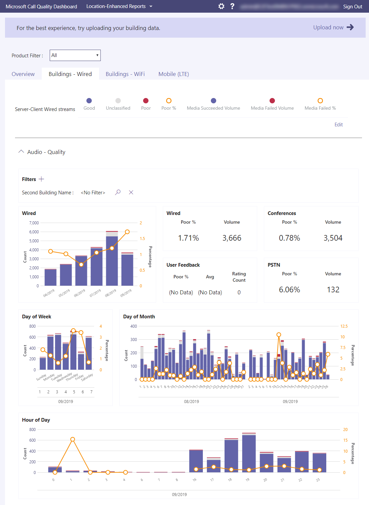

# 什么是调用质量仪表板 (CQD) ？

Microsoft 呼叫质量仪表板 (CQD) [https://cqd.teams.microsoft.com](https://cqd.teams.microsoft.com) - 显示 2019 年Microsoft Teams、Skype for Business Online 和 Skype for Business Server 级别的呼叫和会议质量。 

  
最新版本的 CQD 具有近实时 [ (NRT) ](CQD-data-and-reports.md)数据源，这意味着呼叫记录在通话结束后 30 分钟内在 CQD 中可用。

只要 CQD 包含来自[EUII](CQD-data-and-reports.md#euii-data) (标识) 信息，它在整个过程中以与[EUII](/office365/Enterprise/office-365-data-retention-deletion-and-destruction-overview)相同的方式进行管理Microsoft 365。

CQD 旨在帮助管理员Teams管理员、Skype for Business管理员和网络工程师在组织范围内监视呼叫和会议质量。 你将使用 CQD 来帮助优化 **网络，** 以提升性能质量。 当需要查看特定用户的呼叫和会议信息 **时**，将 CQD 数据与按用户的呼叫 [分析结合使用](use-call-analytics-to-troubleshoot-poor-call-quality.md)。

例如，使用 CQD，可以确定用户使用每用户调用分析 () 观察到的用户通话质量差) 是由于网络问题也影响许多其他用户。 CQD 捕获单个呼叫体验和使用 Teams 或 Skype for Business。 使用 CQD 时，总体模式可能会变得明显，因此网络工程师可以就呼叫质量进行明智的评估。 CQD 提供呼叫质量指标报告，让你深入了解总体呼叫质量、服务器-客户端流、客户端流和语音质量[SLA。](https://go.microsoft.com/fwlink/p/?linkid=846252) 
  

在 CQD 中，建议上传建筑物和终结点信息，这样Location-Enhanced报表来分析用户建筑物内的呼叫质量和可靠性。 可以评估数据，以确定问题是隔离给单个用户，还是影响较大用户段。 若要在 CQD 中启用建筑物或终结点特定的视图，管理员必须在"CQD 租户数据"页上上传Upload信息。

不要错过我们的["管理](quality-of-experience-review-guide.md)呼叫和会议质量"一文，其中为负责管理会议服务质量的Teams管理员或支持工程师提供了深入Teams。

## 旧版 CQD (CQD.lync.com) 

当前版本的 CQD (https://CQD.Teams.microsoft.com) 已替换旧版 CQD https://CQD.lync.com) (。 你仍可以使用 CQD.lync.com (管理中心 Skype for Business 提供) ，但截至 2020 年 7 月 1 日，它使用的是 CQD 的数据。Teams.microsoft.com，你无法再查看或修改旧 CQD 模板中的建筑物或查询 (CQD.lync.com) 。 如果尚未从数据库迁移此数据 CQD.lync.com，请记录支持票证。

> [!IMPORTANT]
> 自 2021 年 7 月 31 日起，我们将停用旧版 CQD (CQD.lync.com) 。 该日期之后，会自动重定向到 CQD。Teams.microsoft.com 访问任何 CQD.lync.com，任何未分配建筑物或查询数据都将丢失。

## 使用Power BI分析 CQD 数据

2020 年 1 月新增功能[：Power BI CQD 的查询模板](https://github.com/MicrosoftDocs/OfficeDocs-SkypeForBusiness/blob/live/Teams/downloads/CQD-Power-BI-query-templates.zip?raw=true)。 可Power BI模板，可用于分析和报告 CQD 数据。

请参阅[使用Power BI分析 CQD 数据](CQD-Power-BI-query-templates.md)以了解更多信息。

## 相关主题

[改进和监视呼叫质量Teams](monitor-call-quality-qos.md)

[使用 CQD (设置呼叫质量) ](turning-on-and-using-call-quality-dashboard.md)

[Upload租户和建筑物数据](CQD-upload-tenant-building-data.md)

[CQD 数据和报表](CQD-data-and-reports.md)

[使用 CQD 管理呼叫和会议质量](quality-of-experience-review-guide.md)

[CQD 中可用的维度和度量值](dimensions-and-measures-available-in-call-quality-dashboard.md)

[CQD 中的流分类](stream-classification-in-call-quality-dashboard.md)

[使用Power BI分析 CQD 数据](CQD-Power-BI-query-templates.md)

[Teams 疑难解答](/MicrosoftTeams/troubleshoot/teams)
