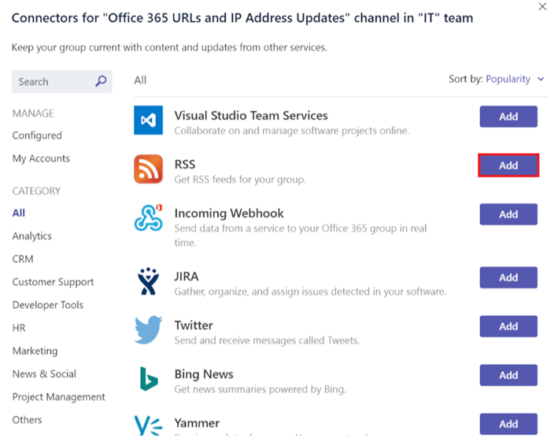
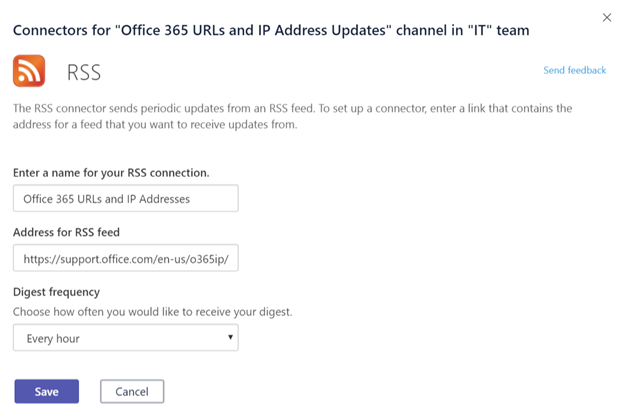

在 Microsoft Teams 中使用 Office 365 和自定义连接器
=======================================================

连接器将经常使用的内容和服务更新直接提供给频道, 从而使你的团队保持最新。 通过连接器, 你的 Microsoft 团队用户可以从其团队中的聊天流内的受欢迎的服务 (如 Twitter、Trello、奇妙清单、GitHub 和 Azure DevOps 服务) 中接收更新。

如果团队权限允许, 团队的任何成员都可以将其团队与常用云服务连接起来, 并且所有团队成员都将收到来自该服务的活动的通知。 即使最初设置连接器的成员已离开, 连接器仍可继续运行。 具有 add\remove 权限的任何团队成员都可以修改其他成员的连接器设置。

Office 365 连接器可以与 Microsoft Teams 和 Office 365 组配合使用，这样，可以更轻松地让所有成员保持同步并快速收到相关信息。 Microsoft Teams 和 Exchange 使用相同的连接器模型，这样，你可以在两个平台中使用相同的连接器。 但值得注意的是, 禁用团队所依赖的 Office 365 组的连接器将禁用为该团队创建连接器的功能。

向通道添加连接线
----------------------------

当前, 你可以使用 Microsoft 团队桌面和 web 客户端添加连接器。 但是, 可以在包括手机在内的**所有客户端**中查看由这些连接器发布的信息。

1. 若要向通道添加连接线, 请单击通道名称右侧的**省略号 (...)** , 然后单击 "**连接线**"。

    

2. 您可以从各种可用的连接线中进行选择, 然后单击 "**添加**"。

    

3. 填充选定连接器的所需信息，然后单击 **“保存”**。 每个连接器都需要一组不同的信息才能正常运行，有些连接器可能会要求你使用连接器配置页面上提供的链接登录服务。

    

4. 连接器提供的数据会自动发布到频道。

    

开发自定义连接器
-----------------------------

开发可与业务线 (LOB) 应用程序集成的自定义连接线非常简单。 你可以使用内置的**传入 Webhook**连接器为通道创建终结点, 该终结点从使用 HTTP post 方法的任何应用程序提取数据。

1. 像任何其他连接器一样添加**传入 Webhook**。

    

2. 要创建 Webhook，请指定**名称**、更新 Webhook 图片（如果需要），然后单击 **“创建”**。

    

3. 将数据推送到此通道的应用程序需要 Webhook 连接器 URL。 创建 Webhook 时会创建唯一的 URL。 与你的开发人员共享此 URL, 以便他们可以根据需要将其应用程序配置为推送数据。

    

4. 外部应用向连接器推送数据时，将在频道对话列表中显示消息，这是名为**连接器卡**消息的特殊消息。

    

     开发人员可以通过将具有简单 JSON 负载的 HTTP 请求发送到团队的 Webhook 地址 (该终结点是由向导提供的唯一 URL), 将其应用程序配置为创建这些卡。 让你的开发人员参考 microsoft 开发人员网络上[Office 365 连接器的](https://docs.microsoft.com/en-us/microsoftteams/platform/concepts/connectors/connectors)入门, 其中详细说明和连接器示例。 其他资源包括[在 Outlook 中将应用连接到你的组](https://support.office.com/article/Connect-apps-to-your-groups-in-Outlook-ed0ce547-038f-4902-b9b3-9e518ae6fbab)和 [Office 开发人员中心 - Microsoft Teams](https://go.microsoft.com/fwlink/?linkid=855784)。
