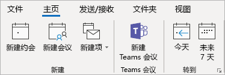

在 Outlook 中使用 Teams 会议外接程序Use the Teams Meeting add-in in Outlook
=======================================
> [!IMPORTANT]
> [!INCLUDE [new-teams-sfb-admin-center-notice](includes/new-teams-sfb-admin-center-notice.md)]

对于在其 Windows PC 上安装了 Microsoft Teams 和 Office 2013 或 Office 2016 的用户，会自动安装 Teams 会议外接程序。The Teams Meeting add-in is automatically installed for users who have Microsoft Teams and either Office 2013 or Office 2016 installed on their Windows PC. 用户将在其 Outlook 日历功能区中看到 Teams 会议外接程序。Users will see the Teams Meeting add-in on the Outlook Calendar ribbon. 

如果用户未看到 Teams 会议外接程序，请指示他们关闭 Outlook 和 Teams，然后按以下顺序执行操作：先重新启动 Teams 客户端，然后登录 Teams，再重新启动 Outlook 客户端。If users do not see the Teams Meeting add-in, instruct them to close Outlook and Teams, then restart the Teams client first, then sign in to Teams, and then restart the Outlook client, in that specific order.

> [!NOTE]
> 当前未面向 Mac 用户提供 Outlook 的 Teams 会议外接程序。The Teams Meeting add-in for Outlook is currently not available for Mac users.

## 身份验证要求Authentication requirements

Teams 会议外接程序要求用户使用新式身份验证登录 Teams。The Teams Meeting add-in requires users to sign in to Teams using Modern Authentication. 如果用户未使用此方法登录，他们仍可使用 Teams 客户端，但无法使用 Outlook 外接程序安排 Teams 在线会议。If users do not use this method to sign in, they’ll still be able to use the Teams client, but will be unable to schedule Teams online meetings using the Outlook add-in. 可以通过以下方式之一解决此问题：You can fix this by doing one of the following:

- 如果贵组织未配置新式身份验证，则应配置新式身份验证。If Modern Authentication is not configured for your organization, you should configure Modern Authentication.
- 如果配置了新式身份验证，但他们在对话框中取消了，则应该指示用户使用多重身份验证重新登录。If Modern Authentication is configured, but they cancelled out on the dialog box, you should instruct users to sign in again using multi-factor authentication.

要了解关于如何配置身份验证的详细信息，请参阅 [Microsoft Teams 中的标识模式和身份验证](identify-models-authentication.md)。To learn more about how to configure authentication, see [Identity models and authentication in Microsoft Teams](identify-models-authentication.md).

## 启用私人会议Enable private meetings

必须在 [Office 365 管理中心](https://portal.office.com/adminportal/home)中启用“允许安排私人会议”，才能部署该插件。Allow scheduling for private meetings must be enabled from the [Office 365 admin center](https://portal.office.com/adminportal/home) for the plug-in to get deployed.

Teams 客户端通过确定用户需要 32 位还是 64 位版本来安装正确的外接程序。The Teams client installs the correct add-in by determining if users need the 32-bit or 64-bit version.

> [!NOTE]
> 在安装或升级 Teams 后，用户可能需要重新启动 Outlook 才能获得最新的外接程序。Users might need to restart Outlook after an installation or upgrade of Teams to get the latest add-in.

## 其他考虑事项Other considerations

Teams 会议外接程序仍是正在构建的功能，因此请注意以下事项：The Teams Meeting add-in is still building functionality, so be aware of the following:
- 一些在线会议功能（例如，录制、投票和白板）还不可用。Some online meeting features, such as recording, polling, and whiteboarding are not yet available.
- 会议选项当前不可用。Meeting options are currently not available.
- 当前只能邀请公司内部的人员，因为外部用户还不能加入会议。Currently, you can only invite people from within your company, as it is not yet possible for external users to join meetings.
- 此外接程序用于特定参与者的安排会议，而非用于频道中的会议。The add-in is for scheduled meetings with specific participants, not for meetings in a channel. 频道会议必须从 Teams 中安排。Channel meetings must be scheduled from within Teams. 当前，仅面向 Windows 用户提供 Outlook 中的 Teams 会议外接程序，但即将面向 Mac 用户提供。Currently, the Teams Meeting add-in in Outlook is only available for Windows users, but support for Mac is coming.
- 如果用户的 PC 和 Teams 服务的网络路径中存在身份验证代理，则此外接程序将无法工作。The add-in will not work if an Authentication Proxy is in the network path of user's PC and Teams Services.

有关如何禁用外接程序的一般指导，请参阅[在 Office 程序中查看、管理和安装外接程序](https://support.office.com/article/View-manage-and-install-add-ins-in-Office-programs-16278816-1948-4028-91E5-76DCA5380F8D)。For general guidance about how to disable add-ins, see [View, manage, and install add-ins in Office programs](https://support.office.com/article/View-manage-and-install-add-ins-in-Office-programs-16278816-1948-4028-91E5-76DCA5380F8D).

详细了解 [Microsoft Teams 中的会议和通话](https://support.office.com/article/Meetings-and-calls-d92432d5-dd0f-4d17-8f69-06096b6b48a8)。Learn more about [meetings and calling in Microsoft Teams](https://support.office.com/article/Meetings-and-calls-d92432d5-dd0f-4d17-8f69-06096b6b48a8).

