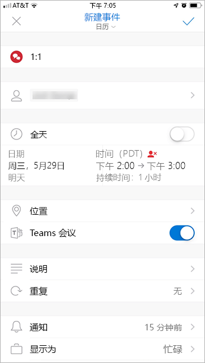

在 Outlook 中使用 Teams 会议外接程序
=======================================

借助 Teams 会议加载项，用户可以从 Outlook 安排 Teams 会议。 此加载项适用于 Windows 版 Outlook、Mac 版 Outlook、Outlook 网页版以及 Outlook 移动版。

## Windows 版 Outlook 中的 Teams 会议加载项

将为在 Windows 电脑上安装了 Microsoft 团队和 office 2013、Office 2016 或 Office 2019 的用户自动安装团队会议加载项。 用户将在 Outlook 日历功能区看到 Teams 会议加载项。

> [!NOTE]
> - 没有链接到团队外接程序的**直接 URL** 。
> - 如果你的组织同时运行团队和 Skype for business，则有其他注意事项。 在某些情况下，"团队外接程序" 在 Outlook 中不可用。 有关详细信息，请参阅[从 Skype For Business 升级到团队](https://docs.microsoft.com/microsoftteams/upgrade-to-teams-on-prem-overview#meetings)。
> - 执行 Regsvr32.exe 文件的用户权限是将 Teams 会议加载项安装在计算机上的最低要求。
> - 如果用户未看到 Teams 会议外接程序，请指示他们关闭 Outlook 和 Teams，然后按以下顺序执行操作：先重新启动 Teams 客户端，然后登录 Teams，再重新启动 Outlook 客户端。
> - 如果使用的是来自 Microsoft Store 的 Office Outlook 安装，则不支持 Teams 会议加载项。 建议需要此加载项的用户安装 Office 的即点即用版本，如[在 Windows 10 S 模式中的 Office](https://support.office.com/article/faq-office-on-windows-10-in-s-mode-717193b5-ff9f-4388-84c0-277ddf07fe3f) 一文中所述。

## Outlook for Mac 中的 Teams 会议加载项

Outlook for Mac 中的 "团队会议" 按钮将在 outlook for Mac 功能区中显示，前提是 Outlook 正在运行生产内部版本16.24.414.0 和更高版本，并且已使用 Microsoft 365 或 Office 365 客户端订阅激活。

用户单击“发送”后，会议协调（Teams 联接链接和拨入号码）将添加到会议邀请。****  

## Outlook Web App 中的 Teams 会议加载项

若用户在使用新 Outlook 网页版的早期版本，Outlook Web App 中的“Teams 会议”按钮将作为新事件创建的一部分显示。 若要了解用户如何试用新 Outlook 网页版的早期版本，请参阅 [Outlook 博客](https://techcommunity.microsoft.com/t5/Outlook-Blog/Designed-to-be-fast-The-Outlook-on-the-web-user-experience-gets/ba-p/234909?utm_source=t.co&utm_medium=referral)。

用户单击“发送”后，会议协调（Teams 联接链接和拨入号码）将添加到会议邀请。****  

## Outlook 移动版（iOS 和 Android）中的 Teams 会议加载项

“Teams 会议”按钮会在 Outlook iOS 和 Android 应用的最新版本中显示。

用户单击“发送”后，会议协调（Teams 联接链接和拨入号码）将添加到会议邀请。****  

## 适用于 Outlook 的团队会议加载项和 FindTime

FindTime 是 Outlook 的加载项，可帮助用户在各公司的会议时间达成共识。 会议受邀者提供首选时间后，FindTime 将代表用户发出会议邀请。 若在 FindTime 中选择了“联机会议”选项，FindTime 将安排 Skype for Business 或 Microsoft Teams 会议。**** （FindTime 会将组织设置的内容用作默认的联机会议频道。）

> [!NOTE]  
> 若在 [Findtime 仪表板](https://findtime.microsoft.com/UserDashboard)中保存了 Skype for Business 设置，FindTime 将使用此设置，而不使用 Microsoft Teams。 若想要使用 Microsoft Teams，请在仪表板中删除 Skype for Business 设置。

有关详细信息，请参阅[通过 FindTime 安排会议](https://support.office.com/article/scheduling-meetings-with-findtime-4dc806ed-fde3-4ea7-8c5e-b5d1fddab4a6)。

## 身份验证要求

Teams 会议外接程序要求用户使用新式身份验证登录 Teams。 如果用户不使用此方法登录，他们仍然能够使用团队客户端，但无法使用 Outlook 加载项安排团队联机会议。 可以通过以下方式之一解决此问题：

- 如果贵组织未配置新式身份验证，则应配置新式身份验证。
- 如果配置了新式身份验证，但他们在对话框中取消了，则应该指示用户使用多重身份验证重新登录。

要了解关于如何配置身份验证的详细信息，请参阅 [Microsoft Teams 中的标识模式和身份验证](identify-models-authentication.md)。

## 启用私人会议

必须在 Microsoft Teams 管理中心中启用“允许安排私人会议”，才能部署该加载项。**** 在管理中心中，转到“会议” > “会议策略”，然后在“常规”部分中将“允许安排私人会议”切换为“启用”。****************

Teams 客户端通过确定用户需要 32 位还是 64 位版本来安装正确的外接程序。

> [!NOTE]
> 在安装或升级 Teams 后，用户可能需要重新启动 Outlook 才能获得最新的外接程序。

## Teams 升级策略和适用于 Outlook 的 Teams 会议加载项

客户可以[选择从 Skype for Business 到 Teams 的升级过程](upgrade-and-coexistence-of-skypeforbusiness-and-teams.md)。 租户管理员可以使用 Teams 共存模式来定义用户的这一过程。 租户管理员可以选择允许用户并行使用 Teams 和 Skype for Business（孤岛模式）。 

处于孤岛模式的用户在 Outlook 中安排会议时，这些用户通常希望能够选择是安排 Skype for Business 还是 Teams 会议。 在 Outlook 网页版、Outlook 窗口和 Outlook Mac 版中，用户在默认情况下以 "孤岛" 模式查看 Skype for business 和团队外接程序。 你可以配置团队会议策略设置，以控制孤岛模式中的用户是否只能使用团队会议加载项或同时使用团队会议外接程序和 Skype for business 会议加载项。

由于初始版本中的某些限制，Outlook 移动版仅可以支持创建 Skype for Business **或** Teams 会议。 有关详细信息，请参阅下表。

| Teams 管理中心中的共存模式 | Outlook 移动版中的默认会议提供商 |
| --------------------------------------|---------------------------------------------|
| 孤岛 | Skype for Business |
| 仅 Skype for Business | Skype for Business |
| Skype for Business 和 Teams 协作 | Skype for Business |
| Skype for Business 和 Teams 协作及会议 | Teams |
| 仅 Teams | Teams |

### 设置 "孤岛" 模式中的用户是否只能使用团队会议加载项或同时使用团队会议和 Skype for business 会议加载项

作为管理员，你可以配置团队会议策略设置，以控制将哪些 Outlook 会议加载项用于使用*孤岛模式的用户*。 你可以指定用户是否只能使用团队会议加载项或团队会议和 Skype for business 会议加载项在 Outlook 中安排会议。

你只能将此策略应用到处于孤岛模式的用户，并在其团队会议策略中将**AllowOutlookAddIn**参数设置为**True** 。 有关如何设置此策略的步骤，请参阅为[用户在 "孤岛" 模式下设置会议提供商](meeting-policies-in-teams.md#meeting-policy-settings---meeting-provider-for-islands-mode)。

## 其他注意事项

Teams 会议外接程序仍是正在构建的功能，因此请注意以下事项：

- 此外接程序用于特定参与者的安排会议，而非用于频道中的会议。 频道会议必须从 Teams 中安排。
- 如果身份验证代理位于用户的 PC 和团队服务的网络路径中，加载项将不起作用。
- 用户无法在 Outlook 中安排直播活动。 若要安排直播活动，请转到 Teams。 有关详细信息，请参阅[什么是 Microsoft Teams 直播活动？](teams-live-events/what-are-teams-live-events.md)。

详细了解 [Microsoft Teams 中的会议和通话](https://support.office.com/article/Meetings-and-calls-d92432d5-dd0f-4d17-8f69-06096b6b48a8)。

## 故障排除

使用以下步骤解决团队会议外接程序的问题。

### Outlook for Windows 中的团队会议外接程序不会显示

若无法安装 Outlook 的 Teams 会议加载项，请尝试下列故障排除步骤。

- Windows 7 用户必须安装[windows 中通用 C 运行时的更新](https://support.microsoft.com/help/2999226/update-for-universal-c-runtime-in-windows)，团队会议外接程序才能正常工作。
- 检查用户是否具有团队升级策略，该策略允许在团队中安排会议。 有关详细信息，请参阅[从 Skype For Business 升级到团队](https://docs.microsoft.com/microsoftteams/upgrade-to-teams-on-prem-overview#meetings)。
- 检查用户是否具有允许 Outlook 加载项使用的团队会议策略。 有关详细信息，请参阅[管理团队中的会议策略](https://docs.microsoft.com/microsoftteams/meeting-policies-in-teams#allow-the-outlook-add-in)。
- 确保用户安装了团队桌面客户端。 如果仅使用团队 web 客户端，则不会安装会议外接程序。
- 确保用户安装了 Outlook 2013 或更高版本。
- 请确保用户具有执行 regsvr32 的权限。
- 确保已应用 Outlook 桌面客户端的所有可用更新。
- 请按以下步骤操作：
  - 重启 Teams 桌面客户端。
  - 注销，然后重新登录到 Teams 桌面客户端。
  - 重启 Outlook 桌面客户端。 （请确保 Outlook 未在管理员模式下运行。）

如果您仍然看不到该加载项，请确保它在 Outlook 中未被禁用。

- 在 Outlook 中，依次选择 "**文件**" 和 "**选项**"。
- 选择 " **Outlook 选项**" 对话框的 "**加载项**" 选项卡。
- 确认 "**活动应用程序加载项**" 列表中是否列出了 microsoft **Office 的 Microsoft 团队会议加载**项
- 如果 "团队会议加载项" 列在 "**已禁用的应用程序加载项**" 列表中，请在 "**管理**" 中选择 " **COM 加载项**"，然后选择 "**转到**" .。。
- 将 microsoft **Office 的 "Microsoft 团队会议加载项**" 旁边的复选框设置为 "microsoft Office"。
- 在所有对话框上选择 **"确定"** ，然后重新启动 Outlook。

有关如何管理加载项的一般指南，请参阅[在 Office 程序中查看、管理和安装加载项](https://support.office.com/article/View-manage-and-install-add-ins-in-Office-programs-16278816-1948-4028-91E5-76DCA5380F8D)。

如果外接程序仍未显示，请使用以下步骤验证注册表设置。

> [!NOTE]
> 错误地编辑注册表可能会严重损坏你的系统。 在对注册表进行更改之前，应备份计算机上的任何重要数据。
- 启动 RegEdit
- 导航到 HKEY_CURRENT_USER \Software\Microsoft\Office\Outlook\Addins
- 验证 TeamsAddin 是否存在。
- 在 TeamsAddin 内，验证 LoadBehavior 是否存在并设置为3。
  - 如果 LoadBehavior 具有3之外的值，请将其更改为3，然后重新启动 Outlook。

### 代理人计划不起作用

若管理员已配置 Microsoft Exchange 来[控制对 Exchange Web Server (EWS) 的访问](https://docs.microsoft.com/exchange/client-developer/exchange-web-services/how-to-control-access-to-ews-in-exchange)，则代理无法代表上级安排 Teams 会议。 此配置的解决方案正在开发中，未来将予以发布。 
