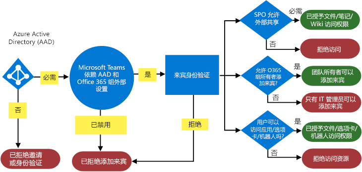
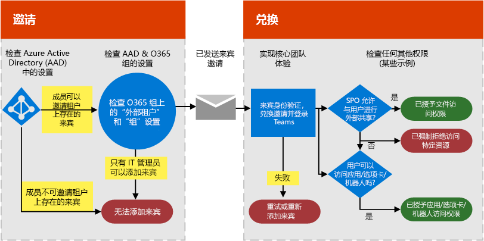
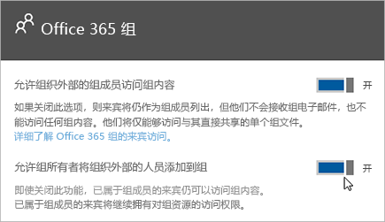

在 Microsoft Teams 中授权来宾访问
===========================================

为满足贵组织的要求，你可以通过四种不同级别的授权来管理 Microsoft Teams 来宾访问功能。 所有这些授权级别都适用于你的 Office 365 租户。 每个授权级别按如下所示控制来宾体验：

- **Azure Active Directory**：Microsoft Teams 中的来宾体验依赖于 Azure AD 企业到企业 (B2B) 平台。 控制目录、租户和应用程序级别的来宾体验。 
- **Microsoft Teams**：仅控制 Microsoft Teams。 
- **Office 365 组**：控制 Office 365 组和 Microsoft Teams 中的来宾体验。
- **SharePoint Online 和 OneDrive for Business**：控制 SharePoint Online、OneDrive for Business、Office 365 组和 Microsoft Teams 中的来宾体验。

这些不同的授权级别可让你灵活选择为组织设置来宾访问的方式。 例如，如果您不想要允许您的 Microsoft 团队的来宾用户，但希望允许整个组织中，只需关闭来宾访问中的 Microsoft 团队。 其他示例：你可以在 AAD、Teams 和组级别启用来宾访问，然后对匹配一个或多个条件（如数据分类为机密）的选定团队禁用添加来宾用户的功能。 SharePoint Online 和 OneDrive for Business 具有自己的不依赖 Office 365 组的来宾访问设置。 

> [!NOTE]
> 来宾受 [Office 365](https://go.microsoft.com/fwlink/p/?linkid=282347) 和 [Azure Active Directory](https://go.microsoft.com/fwlink/p/?linkid=853019) 服务限制约束。 

下面的示意图显示了如何授予并在 Azure Active Directory、Microsoft Teams 和 Office 365 之间集成来宾访问授权相关性。

下图的高级别显示的用户体验具有此权限模型通过典型来宾访问邀请和 redemption 流程的工作方式。

请务必注意下面的应用程序、 自动程序，和连接器可能需要其自己的权限集和/或 consent 特定于用户帐户。 这些可能需要单独授予。 同样，SharePoint 可能施加额外外部共享边界为某个特定用户的用户组，或甚至在网站级别。

## Azure Active Directory 中的控件来宾访问

使用 Azure AD 以确定是否外部协作者可以邀请进入您的租户为来宾，并以何种方式。 关于 Azure B2B 来宾访问的详细信息，请参阅[什么是在 Azure Active Directory B2B 来宾用户访问](https://docs.microsoft.com/en-us/azure/active-directory/b2b/what-is-b2b)。 关于 Azure AD 角色的信息，请参阅[Azure Active Directory 租户中的合作伙伴组织的用户授予权限](https://docs.microsoft.com/en-us/azure/active-directory/b2b/add-guest-to-role)。

用于邀请的设置在租户级别应用，并在目录、租户和应用程序级别控制来宾体验。 

Azure AD 包括以下设置来配置外部用户：

- **来宾用户权限被限制**:**是**意味着来宾不具有某些目录任务权限，如枚举用户、 组或其他目录资源。 此外，来宾无法分配给您的目录中的管理角色。 携带**无**意味着具有对目录数据的正则用户在您的目录中具有相同的访问。
- **管理员和来宾邀请者角色中的用户可以邀请**:**是**意味着管理员和"来宾邀请者"角色中的用户将能够邀请到租户的来宾。 **无**意味着管理员和用户不能邀请到租户的来宾。
- **成员可以邀请**:**是**意味着您的目录的非管理员成员可以邀请来宾进行协作的 Azure AD，如 SharePoint 站点或 Azure 资源安全的资源。 到您的目录携带**无**意味着只有管理员可以邀请。 
      
    > [!NOTE]
    > 目前，团队不支持的来宾邀请者角色。 **成员可以邀请**至少切换必须设置为**是**为来宾访问以在团队。
- **来宾可以邀请**:**是**意味着，您的目录中的来宾本身也可以邀请其他来宾进行协作的 Azure AD，如 SharePoint 站点或 Azure 资源安全的资源。 携带**无**方法不能邀请其他来宾与您的组织进行协作。
 
有关控制谁可以邀请来宾的详细信息，请参阅[Azure Active Directory B2B 协作的委托邀请](https://docs.microsoft.com/en-us/azure/active-directory/b2b/delegate-invitations)

> [!NOTE]
> 您还可以管理哪些域可以作为来宾邀请到您的租户。 请参阅[Office 365 组允许/阻止来宾访问](https://docs.microsoft.com/exchange/recipients-in-exchange-online/manage-group-access-to-office-365-groups)。 

手动将用户来宾帐户添加到 Azure AD B2B 不是必需的该帐户将添加到目录自动添加到团队来宾时。 

Azure AD 许可允许您要添加每个许可证的最多 5 来宾。 有关 Azure AD 许可的详细信息，请参阅[Azure Active Directory B2B 协作许可指南](https://docs.microsoft.com/en-us/azure/active-directory/b2b/licensing-guidance)。

## 团队中的控件来宾访问

在团队中，您可以控制是否启用或禁用组织的来宾体验。 设置默认情况下禁用，并且在租户级别的团队仅适用。

您可以从 Microsoft 团队管理中心管理团队来宾访问设置。 有关更多信息，请参阅[开启或关闭 Microsoft Teams 的来宾访问](set-up-guests.md)。 

## Office 365 组中的控件来宾访问

从 Office 365 组中，你可以控制向组织中的所有 Office 365 组和 Microsoft Teams 添加来宾用户和来宾访问。

1. 使用 Office 365 全局管理员帐户登录 [https://portal.office.com/adminportal/home](https://portal.office.com/adminportal/home)。
    
2. 在导航菜单中，依次选择 **“设置”** 和 **“服务&amp;和外接程序”**。
    
3. 选择 **“Office 365 组”**。
    
     
  
4. 在 Office 365 组页中，设置切换到**打开**或**关闭**，具体取决于是否要让您组织的 Office 365 的访问组之外的团队和组的所有者。 单击或点击 **“允许组所有者将组织外部的人员添加到组”** 旁边的切换将其设置为 **“开启”**。 如果您启用此切换到**上**，您将看到另一个控件选项是否希望让组和团队所有者将您的组织外部的人员添加到 Office 365 组和 Microsoft 团队。 如果您想让组和团队所有者添加来宾用户，请将此切换设置为**上**。 
 
   

这些设置适用于租户级别，并控制 Office 365 组和 Microsoft 团队中的来宾体验。

有关在组中，包括来宾访问的工作原理、 如何管理来宾访问和常见问题的解答来宾访问的详细信息，请参阅[来宾访问 Office 365 组中](https://support.office.com/en-us/article/Guest-access-in-Office-365-Groups-bfc7a840-868f-4fd6-a390-f347bf51aff6)。

## SharePoint Online 和 OneDrive for Business 的控件来宾访问

Teams 依赖 SharePoint Online 和 OneDrive for Business 存储频道和聊天对话的文件和文档。  
   
为了实现完整的 Teams 来宾访问体验，Office 365 管理员需要对以下设置选择 **“开启”**：

- 在 SharePoint Online 中：**仅允许与已在目录中的外部用户共享**
    
    有关详细信息，请参阅[为你的 SharePoint Online 环境管理外部共享](https://docs.microsoft.com/sharepoint/external-sharing-overview)。
    
- 在 Office 365 组中：**允许组所有者将组织外部的人员添加到组**
    
    有关详细信息，请参阅上方的[Office 365 组中的控件来宾访问](#control-guest-access-in-office-365-groups)。
  
这些设置适用于租户级别，并控制在 SharePoint Online、 OneDrive for Business、 Office 365 组和团队的来宾体验。

你可以管理 Teams 连接的团队网站的 SharePoint Online 外部用户设置。 有关更多详细信息，请参阅[管理 SharePoint 团队网站设置](https://support.office.com/article/Manage-your-SharePoint-team-site-settings-8376034d-d0c7-446e-9178-6ab51c58df42)。

## 来宾访问与外部访问 （联合身份验证）

[!INCLUDE [guest-vs-external-access](includes/guest-vs-external-access.md)]