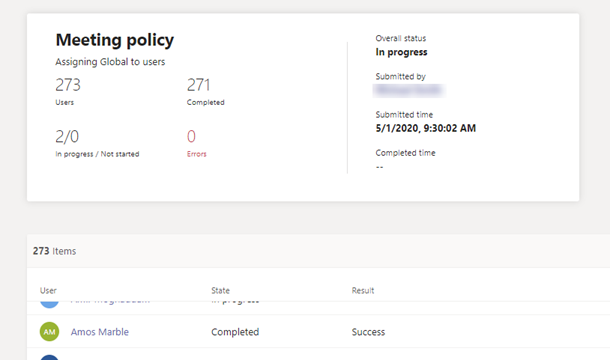

# 在活动日志中查看策略分配

在管理中心向Microsoft Teams分配策略时，可以在活动日志中查看这些策略分配的状态。 "活动日志"显示过去 30 天内通过 Microsoft Teams管理中心向超过 20 名用户的批次分配策略。 请记住，活动日志不会显示策略包分配、通过 Microsoft Teams 管理中心向少于 20 名用户的批次显示策略分配，或者通过 PowerShell 显示策略分配。

## 在活动日志中查看策略分配活动

在活动日志中查看策略分配：

1. 在管理中心的左侧导航Microsoft Teams，转到"主页 **"，然后在**"活动日志"**下选择"** 查看 **详细信息"。**
2. 可以查看所有策略分配或按状态筛选列表，以只显示未启动、正在进行或 **已完成的分配**。  你将看到有关每个作业的以下信息：
    - **名称**：策略分配的名称。 单击该链接可查看更多详细信息。 这包括策略分配到的用户数，以及已完成、进行中和未启动的分配数。 还将看到批处理中的用户列表，以及每个用户的状态和结果。 下面是一个示例：

        

    - **已提交**：提交策略分配的日期和时间。
    - **完成时间**：完成策略分配的日期和时间。
    - **影响：** 批中的用户数。
    - **总体状态**：策略分配的状态。

> [!NOTE]
> 还可以从"用户"页 **访问活动日志** 。 单击" **应用** "提交批量策略分配后，页面顶部显示一个横幅。 单击 **横幅中的** "活动日志"链接。

## 相关主题

- [向用户分配策略](policy-assignment-overview.md)
