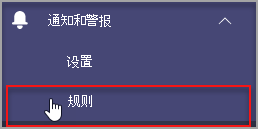

# Microsoft Teams 设备运行状况监视

通过 Microsoft Teams 管理中心中的设备运行状况监视，可以主动监视各种 Teams 设备的运行状况。 监视设备的脱机状态，并实时接收警报（如果组织中受监视的设备处于脱机状态）。  

在启动之前，需要租户中的团队/频道创建权限。 [了解更多](/microsoft-365/solutions/manage-creation-of-groups?view=o365-worldwide)。

## 配置设备状态规则

1. 在 Microsoft Teams 管理中心的左侧导航栏中，选择"通知&**警报**  >  **规则"。**

   

2. 在"**规则"** 页中，选择 **"设备状态规则"。**

3. 选择设备以配置用于启用警报的状态规则。

    

## 解释规则配置

|字段 |说明  |
|--------|-------------|
|**规则类型**   |设备状态规则可帮助你进行有效的管理。 Teams 设备和 被分类为设备管理类型。 将来，更多设备管理类型的规则可用于监视其他相关功能 (例如：不正常的设备和设备登录状态) 。|
|**条件**   |如果设备脱机，可以监视其运行状况。 [详细了解 Teams](../devices/device-management.md) 管理中心中的设备管理。 |
|**范围**   |可以通过提及规则评估频率来指定监视设备运行状况的频率。 默认情况下，团队设备在脱机时将进行近实时监视。 |
|**设备用户**   |可以通过根据已登录的用户选择设备来指定哪些设备需要主动脱机监视。 有关更多详细信息 [，请参阅选择](#select-devices-for-configuration) 设备进行配置。 |
|**操作**  > **通道警报**   |在"操作"部分中，可以指定要获取其警报的团队频道。 目前，将创建名为 **"管理员** 警报和通知"的默认团队以及名为 **MonitoringAlerts** 的频道，通知将传递到其中。     租户中的全局管理员和 Teams 管理员将自动添加到此默认团队。|
|**操作**  > **Webhook**   |还可使用外部 Webhook 和可选 (接收) 。 在将发送 JSON 通知有效负载的 webhook 部分中指定外部公共 Webhook URL。      通知有效负载（通过 Webhook）可以与组织的其他系统集成，以创建自定义工作流。   

**Webhook 的 JSON 有效负载架构：**   
<pre lang="json">{      "type": "object",     "properties": {        "AlertTitle": { "type": "string "} ,       "DeviceLoggedInUserId": { "type": "string" } ,       "DeviceId": { "type": "string" } ,        "MetricValues": {              "type": "object",             "properties": {                   "DeviceHealthStatus": { "type": "string"}              }         } ,        "RuleName": { "type": "string"} ,        "RuleDescription": { "type": "string"} ,        "RuleFrequency": { "type": "string"} ,        "RuleType": { "type": "string"} ,        "TenantId": { "type": "string"} ,         "RuleCondition": { "type": "string"} ,         "AlertRaisedAt": { "type": "string"}      }  } </pre>   

  **示例 JSON 有效负载**：    <pre lang="JSON">    {        "AlertTitle":"*sample_device_name* of *User_Name* has become offline",       "DeviceLoggedInUserId": *User_GUID* ,       "DeviceId": *Device_GUID* ,        "MetricValues": {           DeviceHealthStatus": "offline"              },                  "RuleName": "Device state rule" ,        "RuleDescription": ":"Alerts when device health status is detected as offline" ,        "RuleFrequency": "Real-time" ,        "RuleType": "Device Management" ,        "TenantId": *Tenant_GUID* ,         "RuleCondition": "DeviceHealthStatus = Offline" ,         "AlertRaisedAt": "2020-02-28T12:49:06Z"      }  </pre>   

## 选择要配置的设备

1. 可以通过选择登录到这些设备的用户来选择要监视的 Teams 设备。 从 **"设备** 用户" **部分选择"添加** "。

2. 选择要监视其设备运行状况的一个或多个用户

   

   所选用户列表显示在"设备用户 **"** 部分。 可以通过添加或删除用户来修改此列表。

将监视所选用户列表使用的所有登录设备是否处于脱机运行状况。

## Teams 客户端中的通知

通知在管理员警报和通知团队的自动创建的 **MonitoringAlerts** 通道 **中** 传递。

设备脱机通知可以包含以下信息：

- 处于脱机状态的设备名称。
- 脱机设备的用户。
- 设备脱机的时间。  (目前，时间以 UTC.) 
- 引发警报的规则类型。
- 引发警报的原因。