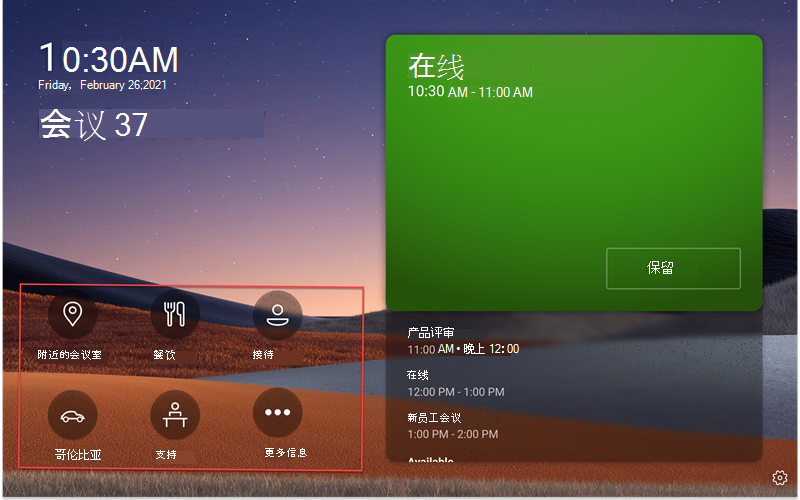
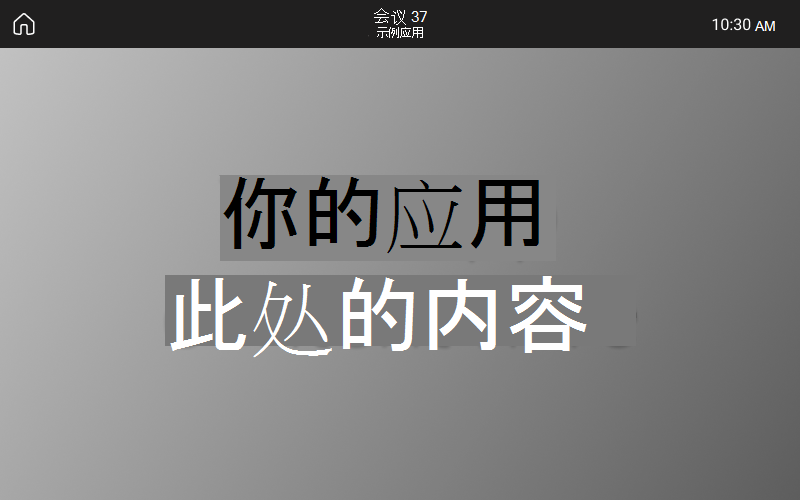
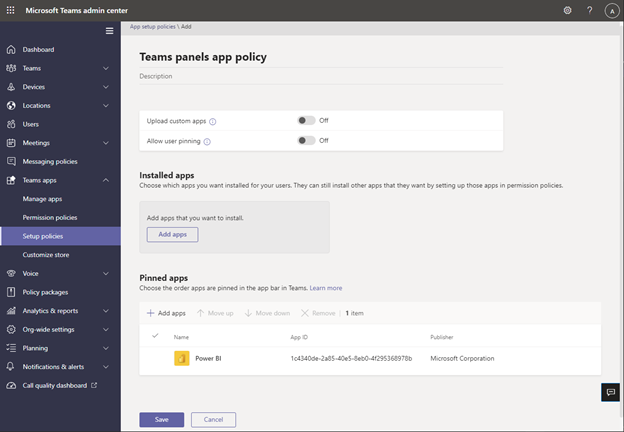

# Microsoft Teams面板上显示应用/业务 (LOB) 应用Teams支持

Teams面板添加了对 Teams 应用/业务线 ([LOB) 的支持](/microsoftteams/platform/overview)。 这将使企业能够添加面板上的其他体验以满足组织的需求。 此版本支持静态 Web 内容。

> [!IMPORTANT]
> 只有在将设备更新到 Teams 面板后 (此功能) 。 你需要拥有 Teams 应用版本 1449/1.0.97.2021070601 或更高版本，以在 Teams 面板中提供应用支持。

## Teams面板上的Teams体验

 

*仪表板Teams包括应用导航选项，屏幕截图中用红色概述了这些选项。请注意，这些图标是示例图标，可能无法使用。*

*当最终用户点击其中一个应用图标时，他们将看到Teams屏幕截图中显示的应用屏幕。屏幕截图中的灰色矩形是应用在屏幕面板Teams的位置。应用栏是固定的，属于Teams应用的一部分。*

## 在管理中心Teams和管理Teams面板应用 

Microsoft Teams应用将关键信息、常用工具和受信任的流程带到人们收集、学习和工作的地方。 Teams应用[通过集成功能 运行](/microsoftteams/platform/concepts/capabilities-overview)。 现在，作为 IT 管理员，可以选择在组织的 Teams 面板设备中包括哪些应用，然后通过 Teams[管理中心自定义权限](https://admin.teams.microsoft.com/)。

现在，可以在Teams面板Teams应用，并基于组织的需求自定义用户体验。 你可以决定用户可以访问和使用哪个 Web 应用，并设置应用视图的优先级。 目前不支持某些选项，例如机器人和消息传送功能。 详细了解 Teams[应用](/microsoftteams/platform/overview)以及如何在 Microsoft Teams[中管理设备](/microsoftteams/devices/device-management)。

## 在管理中心Teams面板Teams应用

**注意**：必须是全局管理员或 Teams 服务管理员才能访问 Teams [管理中心](https://admin.teams.microsoft.com/)。

最终用户可以在面板上查看应用，但不能Teams应用。 作为管理员，可以通过 Teams 管理中心查看和管理组织Teams应用。 详细了解如何通过"管理应用"Microsoft Teams [管理](/microsoftteams/manage-apps)中心 **管理** 应用。 管理 **中心内的**"Teams"页面也是可以上传自定义 [应用的地方](/microsoftteams/manage-apps#publish-a-custom-app-to-your-organizations-app-store)。

设置应用后，可以使用 [应用权限策略](/microsoftteams/teams-app-permission-policies) 和应用设置 [策略](/microsoftteams/teams-app-setup-policies) 为组织的特定会议室帐户配置应用体验。

## 使用应用设置Teams将应用固定到面板上

由于 Teams 提供显示各种应用的功能，因此管理员可以决定哪些应用对于组织来说最为重要，并仅将其固定到 Teams 面板主屏幕以便快速访问。  如果超过五个固定的应用或任何未固定的应用，它们将显示在"更多" **屏幕** 下。 Microsoft 建议为面板专门创建自定义应用Teams策略。

 

若要管理显示在 Teams 面板上的固定应用，请登录到组织的 Teams 管理中心并 **导航到"Teams 应用** 设置策略选择或创建新策略已固定应用 \>  \>  \> "。

 

*此映像中包含的应用只是示例，可能无法使用。*

Microsoft 建议关闭自定义 **Upload** 和"允许用户固定"，以便Teams面板上获得最佳Teams体验。

有关固定应用的信息，请参阅 [管理应用设置策略](/microsoftteams/teams-app-setup-policies)。

## 在面板中管理Teams顺序 

*此映像中包含的应用只是示例，可能无法使用。*

若要管理应用在 Teams 面板上的显示顺序，请登录到组织的 Teams 管理中心并导航到 **Teams 应用** 设置策略 选择策略固定应用 \>  \>  \> **：** 上 **移/下移**。

## 将设置策略分配到会议室资源帐户

创建设置策略后，管理员需要将此策略分配给将登录到仪表板面板Teams帐户。 有关详细信息，请参阅向 [用户和组分配策略](/microsoftteams/assign-policies-users-and-groups)。

## 常见问题

### 获取新的或更新的应用设置Teams面板需要多久？

在管理中心内编辑或分配Teams策略后，更改可能需要 24 小时才能生效。 管理员可以尝试从面板注销/登录，点击设置图标，然后返回到主屏幕以尝试刷新策略。 

### "更多"屏幕上的应用顺序是什么？

在" **更多** 应用"页上，将首先显示固定的应用。 然后，任何其他已安装的应用将按字母顺序显示。

### 为什么机器人应用未显示在Teams上？

目前仅支持静态选项卡 Web 内容。

### 为什么本机Teams应用（如日历和任务）未显示在Teams面板中？

本机Teams应用（如日历和任务）不会显示在Teams面板上。

### 在Teams管理中心的"设置策略"部分下，已安装的应用与固定应用之间有什么区别？

对于Teams，Microsoft 建议使用固定应用，以便管理员能够选择所需的应用并重新排列其顺序。

**注意：** 某些应用不支持应用固定。 请联系应用开发人员以启用应用固定功能。

### 为什么其他应用显示在"更多"屏幕中，即使它们不是应用设置策略部分中已安装或Teams应用的一部分？

如果之前通过其他应用策略或者手动在 Teams 桌面/Web 客户端中为 Teams 面板中使用的会议室资源帐户安装了应用，管理员可能需要登录到 Teams 中的会议室资源帐户，然后通过右键单击应用，然后选择"卸载"来手动卸载应用。 

### 为什么在"添加固定应用"窗格中找不到应用？

并非所有应用都可以通过应用设置Teams固定到其他应用。 某些应用可能不支持此功能。 若要查找可固定的应用，请搜索"添加固定的应用" **窗格中的应用** 。 有关详细信息，请参阅使用 [应用设置策略 中的常见问题](/microsoftteams/teams-app-setup-policies#why-cant-i-find-an-app-in-the-add-pinned-apps-pane)解答。

### 关闭"允许用户固定"后，为什么在设置策略面板中出现"允许用户固定"弹出窗口？

*此映像中包含的应用只是示例，可能无法使用。* 

此行为适用于共享空间中的设备，有助于防止意外的应用固定。
