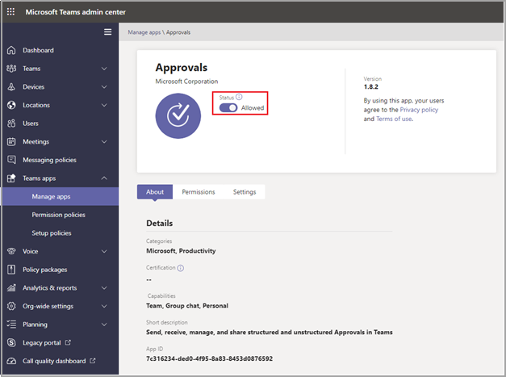

# Teams“审批”应用可用性Teams Approvals app availability

“审批”应用可作为个人应用提供给所有 Microsoft Teams 用户。The Approvals app is available as a personal app for all Microsoft Teams users.
“审批”应用提供了一种在 Teams 中将审核、合规性、责任和工作流引入结构化审批和非结构化审批的简单方法。The Approvals app provides a simple way to bring auditing, compliance, accountability, and workflows to both structured and unstructured Approvals in Teams.

 

用户可以固定“审批”应用以将其保存到菜单栏。Users can pin the Approvals app to save it to the menu bar.

 

从“审批”应用创建的第一个审批将触发在默认 Common Data Service (CDS) 环境中设置审批解决方案。The first approval created from the Approvals app will trigger the provisioning of the Approval Solution in the default Common Data Service (CDS) environment. 从“审批”应用创建的审批将存储在默认 CDS 环境中。Approvals created from the Approvals app will be stored in the default CDS environment.

本文介绍了“审批”应用要求和角色。This article describes the Approvals app requirements and roles.

> [!NOTE]
> 此功能尚未向 政府社区云 (GCC) 、政府社区云 高 (GCCH) 和国防部 (DOD) 发布。This feature hasn't been released to Government Community Cloud (GCC), Government Community Cloud High (GCCH), and Department of Defense (DOD) users yet.

## 所需权限和许可证Required permissions and licenses

若要使用“审批”应用，你需要以下项目的权限：To use the Approvals app, you need permission for the following items:

- 创建 Microsoft CDS 数据库的权限。Permissions to create a Microsoft CDS database.

- [flow.microsoft.com](https://flow.microsoft.com/) 上的帐户An account on [flow.microsoft.com](https://flow.microsoft.com/)

- 目标环境中的管理员角色。Administrator Role in the target environment.

- [Power Automate](/power-automate/get-started-approvals)、Office 365 或 Dynamics 365 的许可证。License for a [Power Automate](/power-automate/get-started-approvals), an Office 365, or a Dynamics 365.

- 用户需要 Microsoft Forms 许可证才能设置新的审批模板。License for Microsoft Forms is required for users to set up new approval templates.

## 通过 CDS 进行存储Storage with CDS

Common Data Model (CDM) 是业务和分析应用程序在 CDS 中使用的共享数据语言。The Common Data Model (CDM) is the shared data language used by business and analytical applications in the CDS. 它包括由 Microsoft 和我们的合作伙伴发布的一组标准化的可扩展数据架构，可使数据及其含义在应用程序和业务流程之间保持一致。It consists of a set of a standardized, extensible data schemas published by Microsoft and our partners that enables consistency of data and its meaning across applications and business processes. 了解有关 [Microsoft Power Platform 的 Common Data Model](/power-automate/get-started-approvals) 的详细信息。Learn more about the [Common Data Model of the Microsoft Power Platform](/power-automate/get-started-approvals).

了解有关[审批工作流](/power-automate/modern-approvals)的详细信息。Learn more about the [Approval workflow](/power-automate/modern-approvals).

从模板创建的审批仍将数据存储在 CDS 中，例如其标题、详细信息、模板 ID 等。Approvals that are created from a template still store data in CDS, such as their title, details, template ID, and more. 在审批请求中提交的响应存储在 Forms 中。Responses that are submitted on the approval request are stored in Forms. 详细了解 Microsoft  [Forms 的数据存储](https://support.microsoft.com/office/data-storage-for-microsoft-forms-97a34e2e-98e1-4dc2-b6b4-7a8444cb1dc3#:~:text=Where%20data%20is%20stored%20for%20Microsoft%20Forms.%20Microsoft,European-based%20tenants%20is%20stored%20on%20servers%20in%20Europe)。Learn more about  [Data storage for Microsoft Forms](https://support.microsoft.com/office/data-storage-for-microsoft-forms-97a34e2e-98e1-4dc2-b6b4-7a8444cb1dc3#:~:text=Where%20data%20is%20stored%20for%20Microsoft%20Forms.%20Microsoft,European-based%20tenants%20is%20stored%20on%20servers%20in%20Europe).

>[!Note]
>如果删除 Microsoft Forms 网站的表单模板，将中断审批模板，用户将无法启动请求。If you delete the Form template on the Microsoft Forms site, it will break your Approval template and users will not be able to start the request. 尝试打开 Microsoft Forms 上已删除的审批模板时，用户收到错误"CDB TableNotFound"。Users will get an error "CDB TableNotFound" when trying to open an Approval template that has been deleted on Microsoft Forms.

审批模板存储在"云数据"存储 (SDS) 中，这是一个仅在 Microsoft 内部使用的合规存储平台。The approval templates are stored in Substrate Data Storage (SDS), which is a compliant storage platform used internally only inside Microsoft. 组织范围的模板存储在 SDS 的"租户分片"中，团队范围的模板存储在 SDS 的"组分片"中。The organization-scoped templates are stored in “tenant shard” of SDS, and team-scoped templates are stored in “group shards” of SDS. 这意味着组织范围的模板共享租户的相同生存期，团队范围的模板共享团队的相同生存期。This means that the org-scoped templates share the same lifetime of the tenant and team-scoped templates share the same lifetime of the team. 因此，永久删除团队会删除相关的模板。So, permanently deleting the team deletes the related templates.

## “审批”Teams 应用权限Approvals Teams app permissions

通过“审批”Teams 应用，你能够访问以下功能：The Approvals Teams app lets you access the following features:

- 接收你向其提供的消息和数据。Receive messages and data that you provide to it.

- 向你发送消息和通知。Send you messages and notifications.

- 呈现个人应用和对话框，但不显示 Teams 提供的标题。Render personal apps and dialogs without a Teams-provided header.

- 访问你的个人资料信息，如姓名、电子邮件地址、公司名称和首选语言。Access your profile information such as your name, email address, company name, and preferred language.

- 在频道中接收团队成员向其提供的消息和数据。Receive messages and data that team members provide to it in a channel.

- 在频道中发送消息和通知。Send messages and notifications in a channel.

- 访问团队的信息：Access your team's information:
  - 团队名称team name
  - 频道列表channel list
  - 名单（团队成员的姓名和电子邮件地址）。roster (team member's names and email addresses).

- 使用团队的信息联系他们。Use the team's information to contact them.

审批模板权限Approval Template Permissions

- 所有团队所有者都可以为他们拥有的团队创建审批模板。All team owners can create an approval template for teams that they own.

- 当管理员首次为整个组织创建模板时，它会自动为租户的所有管理员（包括全局管理员和团队服务管理员）创建新的 Teams 团队。When an Admin creates a template for their entire organization for the first time, it will automatically create a new Teams team for all admins of the tenant, including the global and Team’s service admins. 这些管理员将被添加为团队的所有者，以便他们可以共同管理组织模板。These admins will be added as owners of the team, so they can co-manage organizational templates. 创建团队后，组织中新增的管理员需要手动添加为团队所有者，以便他们具有相同的权限来管理组织范围的模板。Admins that are new to the organization after the team has been created need to be manually added as team owners so they have the same permissions to manage organization-wide templates.

> [!Note]
> 如果管理员删除了团队，则你有一个月时间在 AAD 门户Azure Active Directory (还原) 还原所有相关的数据。If an admin deletes the team, you have one month to restore it within the Azure Active Directory (AAD) portal to restore all related data. 一个月后，或者如果管理员在回收站中删除此团队，您将丢失所有相关的数据。After one month, or if the admin deletes this team within the recycle bin, you will lose all the related data.

## 禁用“审批”应用Disable the Approvals app

默认情况下，“审批”应用可用。The Approvals app is available by default. 可在 Teams 管理中心中禁用该应用。You can disable the app in the Teams admin center.

  1. 登录到 Teams 管理中心。Sign in to the Teams admin center.

  2. 展开“**Teams 应用**”，选择“**管理应用**”。Expand **Teams apps** and select **Manage apps**.

  3. 搜索“审批”应用。Search for the Approvals app.

     

  4. 选择“审批”。Select Approvals.

  5. 选择切换开关以为你的组织禁用该应用。Select the toggle to disable the app for your organization.

     

## 保留策略Retention policy

从“审批”应用创建的审批存储在默认 CDS 环境中，该环境目前不支持备份。Approvals created from the Approvals App are stored in the default CDS environment, which doesn’t support backups at this time. 详细了解如何[备份和还原环境 - Power Platform\| Microsoft Docs](/power-platform/admin/backup-restore-environments)。Learn more about how to [Back up and restore environments - Power Platform \| Microsoft Docs](/power-platform/admin/backup-restore-environments).

在团队所有者从 Microsoft Forms Web 应用中的"已删除的表单"选项卡中清除之前，不会删除存储在 Forms 中的数据。Data stored in Forms will not be deleted until the team owners clean it up from the **deleted forms** tab in the Microsoft Forms web app.

## 数据限制Data limitations

每个团队最多可以包含 400 个审批模板，每个模板根据 Microsoft Forms 中的当前功能最多可收集 50，000 个请求。Each team can contain at most 400 approvals templates, and each template can collect a maximum of 50,000 requests based on the current capability in Microsoft Forms.

## 审核Auditing

“审批”应用将在 Microsoft 365 安全与合规中心中记录审核事件。The Approvals App logs audit events within the Microsoft 365 Security and Compliance Center. 你可查看审核日志。You can view the audit log.

1. 转到 Microsoft 365 合规中心网站。Go to the Microsoft 365 Compliance Site.

2. 选择“**审核**”部分。Select the **Audit** section.

3. 在 **Microsoft Teams 审批活动** 下搜索活动。Search for activities under **Microsoft Teams approvals activities**.

可搜索以下活动：You can search for the following activities:

- 新建审批请求Create new approval request

- 查看审批请求详细信息View approval request details

- 已批准审批请求Approved approval request

- 已拒绝审批请求Rejected approval request

- 已取消审批请求Canceled approval request

- 已共享审批请求Shared approval request

- 已将文件附加到审批请求File attached to approval request

- 已重新分配审批请求Reassigned approval request

- 已向审批请求添加了电子签名Added e-signature to approval request

- 查看了电子签名请求详细信息Viewed e-signature request details

- 已审阅电子签名请求Reviewed e-signature request

- 已取消电子签名请求Canceled e-signature request

- 创建新模板Create a new template

- 编辑现有模板Edit an existing template

- 启用/禁用模板Enable/disable a template

- 查看的模板Viewed template

若要访问 Flow 中的更多审核审批，请为主审批实体“审批”、“审批请求”和“审批响应”在默认环境中启用和配置审核。For access to more auditing approvals within Flow, enable and configure auditing in the default environment for the primary approval entities Approval, Approval Request, and Approval Response. 创建、更新和删除操作是审批记录的可审核事件。Create, update, and delete operations are auditable events for Approval records. 详细了解[安全性和合规性的审核数据和用户活动 - Power Platform\| Microsoft Docs](/power-platform/admin/audit-data-user-activity)。Learn more about [Audit data and user activity for security and compliance - Power Platform \| Microsoft Docs](/power-platform/admin/audit-data-user-activity).

可在 [Microsoft 365 安全与合规中心](https://support.office.com/article/go-to-the-office-365-security-compliance-center-7e696a40-b86b-4a20-afcc-559218b7b1b8?ui=en-US&rs=en-US&ad=US)中进一步自定义。Auditing can be customized further in the [Microsoft 365 Security and Compliance Center](https://support.office.com/article/go-to-the-office-365-security-compliance-center-7e696a40-b86b-4a20-afcc-559218b7b1b8?ui=en-US&rs=en-US&ad=US).

1. 若要使用预配置的报告，请登录到 Microsoft 365 安全与合规中心。To use the preconfigured reports, sign in to Microsoft 365 Security and Compliance.

2. 选择“**搜索和调查**”。Select **Search & investigation**.

3. 搜索审核日志，然后选择“**Dynamics 365 活动**”选项卡。Search the Audit log and select the **Dynamics 365 activities** tab.

详细了解 [Microsoft Dataverse 和模型驱动的应用活动日志记录 - Power Platform](/power-platform/admin/enable-use-comprehensive-auditing)。Learn more about [Microsoft Dataverse and model-driven apps activity logging - Power Platform](/power-platform/admin/enable-use-comprehensive-auditing).

## 安全性Security

在 Teams“审批”应用中，用户能够创建新的审批并查看其已发送和接收的审批。From the Teams Approvals app, users have access to create new Approvals and view Approvals that they have sent and received. 用户无法访问其他人创建的审批，除非他们是请求的回应者或查看者。Users won't have access to Approvals that are created by others unless they're either a responder or a viewer of the request.

> [!Note]
> 如果用户属于创建审批的聊天或频道的一部分，则他们将被赋予请求的查看者角色。A user will be given a viewer role of a request if they are part of the chat or channel where the approval was created. 如果在创建审批时他们未获得该角色，则他们无法对请求执行操作。They won't have the ability to take action on the request if they weren't given that role when the approval was created.

## 审批电子签名集成Approvals e-signature integration

从"审批"应用创建的电子签名审批存储在所选提供商的云环境中。E-signature approvals created from the Approvals app are stored in the selected provider's cloud environment. 有关有关电子签名协议存储的进一步信息，请参阅所选提供商的存储文档。For further information about storage around the e-signature agreement, view the selected provider's storage documentation.

若要使用"审批"应用电子签名功能，需要以下项：To use the Approvals app e-signature feature, you need the following items:

- 你选择使用的特定电子签名提供商的许可证。License for the specific e-signature provider you're choosing to use. 若要获取组织的许可证，您需要转到提供商的网站。In order to obtain a license for your organization, you'll need to go to the provider’s site.

对于"审批"电子签名功能，默认情况下，第三方签名合作伙伴Teams"审批"应用中。For the Approvals e-signature functionality, third-party signature partners will appear in the Teams Approvals app by default. 可以通过访问管理中心中的应用设置来禁用Teams签名提供程序。You can disable specific e-signature providers by accessing app settings in the Teams admin center.

1. 在Teams管理中心的"**管理应用"下**，选择"审批 **"** 应用并选择 **"设置"。**In the Teams admin center, under **Manage apps**, select the **Approvals app** and choose **Settings**.

2. 默认情况下，每个电子签名提供商旁边都有一个开关，该开关位于 (位置) 右侧。Each e-signature provider has a toggle next to it that is in the on position (right) by default. 向左滑动切换开关以禁用特定的电子签名提供程序。Slide the toggle to the left to disable a specific e-signature provider. 如果Teams管理员禁用提供商，则最终用户在创建审批时不会看到提供商。If a Teams admin disables a provider, end users won't see the provider when creating an approval. 最终用户也无法查看通过该提供商提出的任何电子签名请求。End users will also be unable to view any e-signature requests that were made with that provider.

从"审批"应用创建的电子签名审批存储在所选提供商的云中。E-signature Approvals created from the Approvals App are stored in the selected provider’s cloud. 因此，您需要转到提供商的网站才能导出有关电子签名的任何数据。You will therefore need to go to the provider's site in order to export any data about e-signatures. 请参阅提供商的文档，了解这些协议的导出和保留。Refer to the provider's documentation about export and retention of these agreements.
