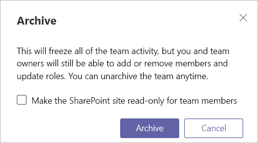

<a name="archive-or-delete-a-team-in-microsoft-teams"></a>在 Microsoft Teams 中存档或删除团队
===========================================

随着时间的推移，在 Microsoft Teams 中创建的团队可能不再使用，或者你可能希望在项目结束时存档或删除团队。 如果你是 Microsoft Teams 的管理员，请按照本文中的步骤进行操作，以存档或删除不再需要的团队。

将团队存档时，该团队的所有活动都会停止。 存档团队还会存档团队中的专用频道及其关联的网站集。  但是，你仍然可以添加或删除成员以及更新角色，而且仍可查看标准和专用通道、文件和聊天中的所有团队活动。

删除团队时，也将删除标准和专用频道（及关联的网站集）、文件和聊天中的团队活动。

> [!IMPORTANT]
> 你可以重新激活已存档的团队，但无法直接还原已删除的团队。 应先考虑将团队存档并推迟删除，直至确定不再需要团队再进行删除操作。

## <a name="archive-a-team"></a>存档团队

请按照以下步骤将团队存档。

1. 在 Microsoft Teams 管理中心，选择“**Teams**”。
2. 通过单击团队名称选择团队。
3. 选择“**存档**”。 此时将显示以下消息。

    

4. 如果想要将团队的 SharePoint 网站设置为只读，请选中该复选框。
5. 选择“**存档**”以存档团队。 团队的状态将更改为“**已存档**”。

## <a name="make-an-archived-team-active"></a>激活已存档的团队

请按照以下步骤使已存档的团队再次处于活动状态。

1. 在 Microsoft Teams 管理中心，选择“**Teams**”。
2. 通过单击团队名称选择团队。
3. 选择“**取消存档**”。 团队的状态将更改为“**活动**”。

## <a name="delete-a-team"></a>删除团队

如果将来不再需要该团队，则可将其删除，而不是将其存档。 请按照以下步骤删除团队。

1.  在 Microsoft Teams 管理中心，选择“**Teams**”。
2.  通过单击团队名称选择团队。
3.  选择“**删除**”。 此时将显示一条确认消息。
4.  选择“**删除**”以永久删除团队。

## <a name="restore-a-deleted-team"></a>还原已删除的团队

请按照以下步骤还原与已删除的团队相关联的 Office 365 组，从而还原该团队。 还原团队的 Office 365 组时将还原团队内容，包括选项卡、标准频道和专用频道及其关联的网站集。

默认情况下，已删除的 Office 365 组将保留 30 天。 这 30 天时间被称为“软删除”，因为还可以对组进行还原。 若要了解详细信息，请参阅[还原已删除的 Office 365 组](https://docs.microsoft.com/office365/admin/create-groups/restore-deleted-group)。

### <a name="install-the-azureadpreview-module"></a>安装 AzureADPreview 模块

1. 以管理员身份打开 Windows PowerShell。
2. 如果安装了早期版本的 AzureADPreview 模块或安装了 AzureAD 模块，请通过运行以下命令之一将其卸载：

    ```PowerShell 
    Uninstall-Module AzureADPreview
    ```

    ```PowerShell
    Uninstall-Module AzureAD
    ```
3. 通过运行以下命令安装最新版本的 AzureADPreview 模块：

    ```PowerShell
    Install-Module AzureADPreview
    ```    

### <a name="restore-the-deleted-office-365-group"></a>还原已删除的 Office 365 组

1. 通过运行以下命令连接到 Azure AD：
    ```PowerShell
    Connect-AzureAD
    ```
    提示登录时，请使用管理员帐户和密码登录。  
2. 运行以下操作以显示仍在30天保留期内的所有软删除的 Microsoft 365 组的列表。 如果有大量组，请使用 **-All $True** 参数。
    ```PowerShell
    Get-AzureADMSDeletedGroup
    ``` 
3. 找到要还原的组，然后记下 ID。
4. 运行以下命令以还原该组，其中 [Id] 是组 ID。
    ```PowerShell
    Restore-AzureADMSDeletedDirectoryObject -Id [Id]
    ```
5.  运行以下命令以验证是否已成功还原组，其中 [Id] 是组 ID。
    ```PowerShell
    Get-AzureADGroup -ObjectId [Id]
    ```

    完成还原过程可能需要长达 24 小时，此后在 Teams 中将显示团队以及与团队关联的内容（包括选项卡和频道）。
