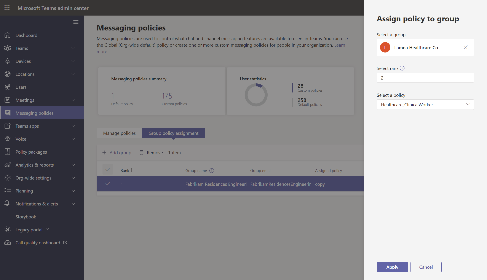

# <a name="assign-policies-to-users-and-groups"></a><span data-ttu-id="d6458-103">将策略分配给用户和组</span><span class="sxs-lookup"><span data-stu-id="d6458-103">Assign policies to users and groups</span></span>

<span data-ttu-id="d6458-104">本文介绍在 Microsoft Teams 中向用户和组分配策略的不同方法。</span><span class="sxs-lookup"><span data-stu-id="d6458-104">This article reviews the different ways to assign policies to users and groups in Microsoft Teams.</span></span> <span data-ttu-id="d6458-105">阅读之前，请确保已阅读 Teams [中的分配](policy-assignment-overview.md)策略 - 入门。</span><span class="sxs-lookup"><span data-stu-id="d6458-105">Before reading, be sure you've read [Assign policies in Teams - getting started](policy-assignment-overview.md).</span></span>

## <a name="assign-a-policy-to-individual-users"></a><span data-ttu-id="d6458-106">向单个用户分配策略</span><span class="sxs-lookup"><span data-stu-id="d6458-106">Assign a policy to individual users</span></span>

<span data-ttu-id="d6458-107">按照以下步骤将策略分配给单个用户或一次向少量用户分配策略。</span><span class="sxs-lookup"><span data-stu-id="d6458-107">Follow these steps to assign a policy to an individual user or to a small number of users at a time.</span></span>

### <a name="use-the-microsoft-teams-admin-center"></a><span data-ttu-id="d6458-108">使用 Microsoft Teams 管理中心</span><span class="sxs-lookup"><span data-stu-id="d6458-108">Use the Microsoft Teams admin center</span></span>

<span data-ttu-id="d6458-109">将策略分配给用户：</span><span class="sxs-lookup"><span data-stu-id="d6458-109">To assign a policy to a user:</span></span>

1. <span data-ttu-id="d6458-110">在 Microsoft Teams 管理中心的左侧导航栏中，转到" **用户"，** 然后选择该用户。</span><span class="sxs-lookup"><span data-stu-id="d6458-110">In the left navigation of the Microsoft Teams admin center, go to **Users**, and then select the user.</span></span>
2. <span data-ttu-id="d6458-111">单击用户名左侧选择用户，然后选择"编辑 **设置"。**</span><span class="sxs-lookup"><span data-stu-id="d6458-111">Select the user by clicking to the left of the user name, and then select **Edit settings**.</span></span>
3. <span data-ttu-id="d6458-112">选择要分配的策略，然后选择"应用 **"。**</span><span class="sxs-lookup"><span data-stu-id="d6458-112">Select the policy you want to assign, and then select **Apply**.</span></span>


<span data-ttu-id="d6458-114">或者，也可以执行以下操作：</span><span class="sxs-lookup"><span data-stu-id="d6458-114">Or, you can also do the following:</span></span>

1. <span data-ttu-id="d6458-115">在 Microsoft Teams 管理中心的左侧导航栏中，转到策略页。</span><span class="sxs-lookup"><span data-stu-id="d6458-115">In the left navigation of the Microsoft Teams admin center, go to the policy page.</span></span>
2. <span data-ttu-id="d6458-116">单击策略名称左侧，选择要分配的策略。</span><span class="sxs-lookup"><span data-stu-id="d6458-116">Select the policy you want to assign by clicking to the left of the policy name.</span></span>
3. <span data-ttu-id="d6458-117">选择“管理用户”。</span><span class="sxs-lookup"><span data-stu-id="d6458-117">Select **Manage users**.</span></span>
4. <span data-ttu-id="d6458-118">在“**管理用户**”窗格中，按显示名称或用户名搜索用户，选择用户名，然后选择“**添加**”。</span><span class="sxs-lookup"><span data-stu-id="d6458-118">In the **Manage users** pane, search for the user by display name or by user name, select the name, and then select **Add**.</span></span> <span data-ttu-id="d6458-119">对想要添加的每一个用户重复此步骤。</span><span class="sxs-lookup"><span data-stu-id="d6458-119">Repeat this step for each user that you want to add.</span></span>
5. <span data-ttu-id="d6458-120">添加完用户后，选择"应用 **"。**</span><span class="sxs-lookup"><span data-stu-id="d6458-120">When you're finished adding users, select **Apply**.</span></span>


### <a name="use-powershell"></a><span data-ttu-id="d6458-122">使用 PowerShell</span><span class="sxs-lookup"><span data-stu-id="d6458-122">Use PowerShell</span></span>

<span data-ttu-id="d6458-123">每个策略类型都有其自己的一组 cmdlet 用于管理它。</span><span class="sxs-lookup"><span data-stu-id="d6458-123">Each policy type has its own set of cmdlets for managing it.</span></span> <span data-ttu-id="d6458-124">使用 ```Grant-``` 给定策略类型的 cmdlet 分配策略。</span><span class="sxs-lookup"><span data-stu-id="d6458-124">Use the ```Grant-``` cmdlet for a given policy type to assign the policy.</span></span> <span data-ttu-id="d6458-125">例如，使用 ```Grant-CsTeamsMeetingPolicy``` cmdlet 将 Teams 会议策略分配给用户。</span><span class="sxs-lookup"><span data-stu-id="d6458-125">For example, use the ```Grant-CsTeamsMeetingPolicy``` cmdlet to assign a Teams meeting policy to users.</span></span> <span data-ttu-id="d6458-126">这些 cmdlet 包含在 Teams PowerShell 模块中，并记录在 [Skype for Business cmdlet 参考 中](https://docs.microsoft.com/powershell/skype)。</span><span class="sxs-lookup"><span data-stu-id="d6458-126">These cmdlets are included in the Teams PowerShell module and are documented in the [Skype for Business cmdlet reference](https://docs.microsoft.com/powershell/skype).</span></span>

 <span data-ttu-id="d6458-127">下载并安装 [Teams PowerShell](https://www.powershellgallery.com/packages/MicrosoftTeams/) (（如果尚未安装) ，然后运行以下代码进行连接。</span><span class="sxs-lookup"><span data-stu-id="d6458-127">Download and install the [Teams PowerShell public release](https://www.powershellgallery.com/packages/MicrosoftTeams/) (if you haven't already), and then run the following to connect.</span></span>

> [!NOTE]
> <span data-ttu-id="d6458-128">Skype for Business Online 连接器当前是最新 Teams PowerShell 模块的一部分。</span><span class="sxs-lookup"><span data-stu-id="d6458-128">Skype for Business Online Connector is currently part of the latest Teams PowerShell module.</span></span>
>
> <span data-ttu-id="d6458-129">如果你使用的是最新的 [Teams PowerShell 公共版本](https://www.powershellgallery.com/packages/MicrosoftTeams/)，则不需要安装 Skype for Business Online 连接器。</span><span class="sxs-lookup"><span data-stu-id="d6458-129">If you're using the latest [Teams PowerShell public release](https://www.powershellgallery.com/packages/MicrosoftTeams/), you don't need to install the Skype for Business Online Connector.</span></span>

```powershell
  # When using Teams PowerShell Module

   Import-Module MicrosoftTeams
   $credential = Get-Credential
   Connect-MicrosoftTeams -Credential $credential
```

<span data-ttu-id="d6458-130">本示例将名为"学生会议策略"的 Teams 会议策略分配给名为 Reda 的用户。</span><span class="sxs-lookup"><span data-stu-id="d6458-130">In this example, we assign a Teams meeting policy named Student Meeting Policy to a user named Reda.</span></span>

```powershell
Grant-CsTeamsMeetingPolicy -Identity reda@contoso.com -PolicyName "Student Meeting Policy"
```

<span data-ttu-id="d6458-131">有关详细信息，请阅读通过 [PowerShell 管理策略](teams-powershell-managing-teams.md#manage-policies-via-powershell)。</span><span class="sxs-lookup"><span data-stu-id="d6458-131">To learn more, read [Manage policies via PowerShell](teams-powershell-managing-teams.md#manage-policies-via-powershell).</span></span>

## <a name="assign-a-policy-to-a-group"></a><span data-ttu-id="d6458-132">向组分配策略</span><span class="sxs-lookup"><span data-stu-id="d6458-132">Assign a policy to a group</span></span>

<span data-ttu-id="d6458-133">通过向组分配策略，可以将策略分配给一组用户，例如安全组或通讯组列表。</span><span class="sxs-lookup"><span data-stu-id="d6458-133">Policy assignment to groups lets you assign a policy to a group of users, such as a security group or distribution list.</span></span> <span data-ttu-id="d6458-134">根据优先级规则，将策略分配传播到组中的成员。</span><span class="sxs-lookup"><span data-stu-id="d6458-134">The policy assignment is propagated to members of the group according to precedence rules.</span></span> <span data-ttu-id="d6458-135">将成员添加到组或从组中删除成员时，将相应更新其继承的策略分配。</span><span class="sxs-lookup"><span data-stu-id="d6458-135">As members are added to or removed from a group, their inherited policy assignments are updated accordingly.</span></span>

<span data-ttu-id="d6458-136">建议对最多 50，000 名用户的组分配组的策略分配，但也适用于较大的组。</span><span class="sxs-lookup"><span data-stu-id="d6458-136">Policy assignment to groups is recommended for groups of up to 50,000 users but it will also work with larger groups.</span></span>

<span data-ttu-id="d6458-137">分配策略时，会立即将其分配给组。</span><span class="sxs-lookup"><span data-stu-id="d6458-137">When you assign the policy, it's immediately assigned to the group.</span></span> <span data-ttu-id="d6458-138">但是，将策略分配传播到组的成员以后台操作方式执行，可能需要一些时间，具体取决于组的大小。</span><span class="sxs-lookup"><span data-stu-id="d6458-138">However, the propagation of the policy assignment to members of the group is performed as a background operation and might take some time, depending on the size of the group.</span></span> <span data-ttu-id="d6458-139">从组取消分配策略时，或者将成员添加到组或从组中删除成员时，也是如此。</span><span class="sxs-lookup"><span data-stu-id="d6458-139">The same is true when a policy is unassigned from a group, or when members are added to or removed from a group.</span></span>

<span data-ttu-id="d6458-140">组策略分配仅传播给作为组的直接成员的用户。</span><span class="sxs-lookup"><span data-stu-id="d6458-140">Group policy assignments are only propagated to users who are direct members of the group.</span></span> <span data-ttu-id="d6458-141">分配不会传播到嵌套组的成员。</span><span class="sxs-lookup"><span data-stu-id="d6458-141">The assignments aren't propagated to members of nested groups.</span></span>

### <a name="what-you-need-to-know-about-policy-assignment-to-groups"></a><span data-ttu-id="d6458-142">有关向组分配策略的需知信息</span><span class="sxs-lookup"><span data-stu-id="d6458-142">What you need to know about policy assignment to groups</span></span>

<span data-ttu-id="d6458-143">在开始使用之前，必须了解优先级规则和组分配排名。</span><span class="sxs-lookup"><span data-stu-id="d6458-143">Before you get started, it's important to understand precedence rules and group assignment ranking.</span></span>

#### <a name="precedence-rules"></a><span data-ttu-id="d6458-144">优先级规则</span><span class="sxs-lookup"><span data-stu-id="d6458-144">Precedence rules</span></span>

<span data-ttu-id="d6458-145">对于给定的策略类型，根据以下条件确定用户的有效策略：</span><span class="sxs-lookup"><span data-stu-id="d6458-145">For a given policy type, a user's effective policy is determined according to the following:</span></span>

- <span data-ttu-id="d6458-146">直接分配给用户的策略优先于分配给组的相同类型的其他任何策略。</span><span class="sxs-lookup"><span data-stu-id="d6458-146">A policy that's directly assigned to a user takes precedence over any other policy of the same type that's assigned to a group.</span></span> <span data-ttu-id="d6458-147">换言之，如果直接为用户分配了给定类型的策略，该用户将不会从组继承相同类型的策略。</span><span class="sxs-lookup"><span data-stu-id="d6458-147">In other words, if a user is directly assigned a policy of a given type, that user won't inherit a policy of the same type from a group.</span></span> <span data-ttu-id="d6458-148">这也意味着，如果用户具有直接分配给他们的给定类型的策略，则你必须从该用户中删除该策略，然后才能从组继承相同类型的策略。</span><span class="sxs-lookup"><span data-stu-id="d6458-148">This also means that if a user has a policy of a given type that was directly assigned to them, you have to remove that policy from the user before they can inherit a policy of the same type from a group.</span></span>
- <span data-ttu-id="d6458-149">如果用户没有直接分配的策略，并且是两个或多个组的成员，并且每个组分配了相同类型的策略，则用户将继承具有最高排名的组分配策略。</span><span class="sxs-lookup"><span data-stu-id="d6458-149">If a user doesn't have a policy directly assigned to them and is a member of two or more groups and each group has a policy of the same type assigned to it, the user inherits the policy of the group assignment that has the highest ranking.</span></span>
- <span data-ttu-id="d6458-150">如果用户不是任何分配了策略的组的成员，则适用于该策略类型的全局 (组织范围默认) 策略适用于该用户。</span><span class="sxs-lookup"><span data-stu-id="d6458-150">If a user isn't a member of any groups that are assigned a policy, the global (Org-wide default) policy for that policy type applies to the user.</span></span>

<span data-ttu-id="d6458-151">根据以下规则更新用户的有效策略：</span><span class="sxs-lookup"><span data-stu-id="d6458-151">A user's effective policy is updated according to these rules:</span></span>

- <span data-ttu-id="d6458-152">向分配了策略的组添加或删除用户时。</span><span class="sxs-lookup"><span data-stu-id="d6458-152">when a user is added to or removed from a group that's assigned a policy.</span></span>
- <span data-ttu-id="d6458-153">策略未从组分配。</span><span class="sxs-lookup"><span data-stu-id="d6458-153">a policy is unassigned from a group.</span></span>
- <span data-ttu-id="d6458-154">将删除直接分配给用户的策略。</span><span class="sxs-lookup"><span data-stu-id="d6458-154">a policy that's directly assigned to the user is removed.</span></span>

#### <a name="group-assignment-ranking"></a><span data-ttu-id="d6458-155">组分配排名</span><span class="sxs-lookup"><span data-stu-id="d6458-155">Group assignment ranking</span></span>

<span data-ttu-id="d6458-156">将策略分配给组时，请为组分配指定排名。</span><span class="sxs-lookup"><span data-stu-id="d6458-156">When you assign a policy to a group, you specify a ranking for the group assignment.</span></span> <span data-ttu-id="d6458-157">这用于确定如果用户是两个或多个组的成员，并且为每个组分配了相同类型的策略，则该用户应继承哪个策略作为有效策略。</span><span class="sxs-lookup"><span data-stu-id="d6458-157">This is used to determine which policy a user should inherit as their effective policy if the user is a member of two or more groups and each group is assigned a policy of the same type.</span></span>

<span data-ttu-id="d6458-158">组分配排名相对于相同类型的其他组分配。</span><span class="sxs-lookup"><span data-stu-id="d6458-158">The group assignment ranking is relative to other group assignments of the same type.</span></span> <span data-ttu-id="d6458-159">例如，如果将一个调用策略分配给两个组，则将一个作业的排名设置为 1，将另一个分配设置为 2，其中 1 是最高排名。</span><span class="sxs-lookup"><span data-stu-id="d6458-159">For example, if you're assigning a calling policy to two groups, set the ranking of one assignment to 1 and the other to 2, with 1 being the highest ranking.</span></span> <span data-ttu-id="d6458-160">组分配排名指示哪个组成员身份在继承方面比其他组成员身份更重要或更相关。</span><span class="sxs-lookup"><span data-stu-id="d6458-160">The group assignment ranking indicates which group membership is more important or more relevant than other group memberships with regards to inheritance.</span></span>

<span data-ttu-id="d6458-161">例如，你有两个组："应用商店员工"和"应用商店经理"。</span><span class="sxs-lookup"><span data-stu-id="d6458-161">Say, for example, you have two groups, Store Employees and Store Managers.</span></span> <span data-ttu-id="d6458-162">这两个组分别分配有 Teams 呼叫策略、应用商店员工呼叫策略和应用商店经理呼叫策略。</span><span class="sxs-lookup"><span data-stu-id="d6458-162">Both groups are assigned a Teams calling policy, Store Employees Calling Policy and Store Managers Calling Policy, respectively.</span></span> <span data-ttu-id="d6458-163">对于这两个组的应用商店经理，其经理角色比其员工角色更相关，因此分配给"应用商店经理"组的呼叫策略应具有更高的排名。</span><span class="sxs-lookup"><span data-stu-id="d6458-163">For a store manager who is in both groups, their role as a manager is more relevant than their role as an employee, so the calling policy that's assigned to the Store Managers group should have a higher ranking.</span></span>

|<span data-ttu-id="d6458-164">组</span><span class="sxs-lookup"><span data-stu-id="d6458-164">Group</span></span> |<span data-ttu-id="d6458-165">Teams 调用策略名称</span><span class="sxs-lookup"><span data-stu-id="d6458-165">Teams calling policy name</span></span>  |<span data-ttu-id="d6458-166">等级</span><span class="sxs-lookup"><span data-stu-id="d6458-166">Rank</span></span>|
|---------|---------|---|
|<span data-ttu-id="d6458-167">应用商店管理员</span><span class="sxs-lookup"><span data-stu-id="d6458-167">Store Managers</span></span>   |<span data-ttu-id="d6458-168">应用商店管理员呼叫策略</span><span class="sxs-lookup"><span data-stu-id="d6458-168">Store Managers Calling Policy</span></span>         |<span data-ttu-id="d6458-169">1</span><span class="sxs-lookup"><span data-stu-id="d6458-169">1</span></span>|
|<span data-ttu-id="d6458-170">应用商店员工</span><span class="sxs-lookup"><span data-stu-id="d6458-170">Store Employees</span></span>    |<span data-ttu-id="d6458-171">存储员工呼叫策略</span><span class="sxs-lookup"><span data-stu-id="d6458-171">Store Employees Calling Policy</span></span>      |<span data-ttu-id="d6458-172">2</span><span class="sxs-lookup"><span data-stu-id="d6458-172">2</span></span>|

<span data-ttu-id="d6458-173">如果未指定排名，则策略分配会获得最低排名。</span><span class="sxs-lookup"><span data-stu-id="d6458-173">If you don't specify a ranking, the policy assignment is given the lowest ranking.</span></span>

### <a name="in-the-teams-admin-center"></a><span data-ttu-id="d6458-174">在 Teams 管理中心</span><span class="sxs-lookup"><span data-stu-id="d6458-174">In the Teams admin center</span></span>

> [!NOTE]
> <span data-ttu-id="d6458-175">目前，使用 Microsoft Teams 管理中心向组分配策略仅适用于 Teams 呼叫策略、Teams 呼叫公园策略、Teams 策略、Teams 实时事件策略、Teams 会议策略和 Teams 消息传送策略。</span><span class="sxs-lookup"><span data-stu-id="d6458-175">Currently, policy assignment to groups using the Microsoft Teams admin center is only available for Teams calling policy, Teams call park policy, Teams policy, Teams live events policy, Teams meeting policy, and Teams messaging policy.</span></span> <span data-ttu-id="d6458-176">对于其他策略类型，请使用 PowerShell。</span><span class="sxs-lookup"><span data-stu-id="d6458-176">For other policy types, use PowerShell.</span></span>

1. <span data-ttu-id="d6458-177">在 Microsoft Teams 管理中心的左侧导航栏中，转到策略类型页面。</span><span class="sxs-lookup"><span data-stu-id="d6458-177">In the left navigation of the Microsoft Teams admin center, go to the policy type page.</span></span> <span data-ttu-id="d6458-178">例如，转到"**会议**  >  **会议策略"。**</span><span class="sxs-lookup"><span data-stu-id="d6458-178">For example, go to **Meetings** > **Meeting policies**.</span></span>
2. <span data-ttu-id="d6458-179">选择" **组策略分配"** 选项卡。</span><span class="sxs-lookup"><span data-stu-id="d6458-179">Select the **Group policy assignment** tab.</span></span>
3. <span data-ttu-id="d6458-180">选择 **"添加组**"，然后在" **将策略分配到组"窗格中** 执行以下操作：</span><span class="sxs-lookup"><span data-stu-id="d6458-180">Select **Add group**, and then in the **Assign policy to group** pane, do the following:</span></span>
    1. <span data-ttu-id="d6458-181">搜索并添加要为其分配策略的组。</span><span class="sxs-lookup"><span data-stu-id="d6458-181">Search for and add the group you want to assign the policy to.</span></span>
    2. <span data-ttu-id="d6458-182">设置组分配的排名。</span><span class="sxs-lookup"><span data-stu-id="d6458-182">Set the ranking for the group assignment.</span></span>
    3. <span data-ttu-id="d6458-183">选择要分配的策略。</span><span class="sxs-lookup"><span data-stu-id="d6458-183">Select the policy that you want to assign.</span></span>
    4. <span data-ttu-id="d6458-184">选择"**应用"。**</span><span class="sxs-lookup"><span data-stu-id="d6458-184">Select **Apply**.</span></span>
    


<span data-ttu-id="d6458-186">若要删除组策略分配，请在策略页的"组 **策略** 分配"选项卡上，选择组分配，然后选择"删除 **"。**</span><span class="sxs-lookup"><span data-stu-id="d6458-186">To remove a group policy assignment, on the **Group policy assignment** tab of the policy page, select the group assignment, and then select **Remove**.</span></span>

<span data-ttu-id="d6458-187">若要更改组分配的排名，首先必须删除组策略分配。</span><span class="sxs-lookup"><span data-stu-id="d6458-187">To change the ranking of a group assignment, you have to first remove the group policy assignment.</span></span> <span data-ttu-id="d6458-188">然后，按照上述步骤将策略分配给组。</span><span class="sxs-lookup"><span data-stu-id="d6458-188">Then, follow the steps above to assign the policy to a group.</span></span>

### <a name="use-the-powershell-option"></a><span data-ttu-id="d6458-189">使用 PowerShell 选项</span><span class="sxs-lookup"><span data-stu-id="d6458-189">Use the PowerShell option</span></span>

> [!NOTE]
> <span data-ttu-id="d6458-190">目前，并非所有 Teams 策略类型都支持使用 PowerShell 向组分配策略。</span><span class="sxs-lookup"><span data-stu-id="d6458-190">Currently, policy assignment to groups using PowerShell isn't available for all Teams policy types.</span></span> <span data-ttu-id="d6458-191">有关[支持的策略类型列表，请参阅 New-CsGroupPolicyAssignment。](https://docs.microsoft.com/powershell/module/teams/new-csgrouppolicyassignment)</span><span class="sxs-lookup"><span data-stu-id="d6458-191">See [New-CsGroupPolicyAssignment](https://docs.microsoft.com/powershell/module/teams/new-csgrouppolicyassignment) for the list of supported policy types.</span></span>

#### <a name="install-and-connect-to-the-microsoft-teams-powershell-module"></a><span data-ttu-id="d6458-192">安装并连接到 Microsoft Teams PowerShell 模块</span><span class="sxs-lookup"><span data-stu-id="d6458-192">Install and connect to the Microsoft Teams PowerShell module</span></span>

<span data-ttu-id="d6458-193">有关分步指南，请参阅[安装 Teams PowerShell。](teams-powershell-install.md)</span><span class="sxs-lookup"><span data-stu-id="d6458-193">For step-by-step guidance, see [Install Teams PowerShell](teams-powershell-install.md).</span></span>

#### <a name="assign-a-policy-to-a-group-of-users"></a><span data-ttu-id="d6458-194">向一组用户分配策略</span><span class="sxs-lookup"><span data-stu-id="d6458-194">Assign a policy to a group of users</span></span>

<span data-ttu-id="d6458-195">使用 [New-CsGroupPolicyAssignment cmdlet](https://docs.microsoft.com/powershell/module/teams/new-csgrouppolicyassignment) 将策略分配给组。</span><span class="sxs-lookup"><span data-stu-id="d6458-195">Use the [New-CsGroupPolicyAssignment](https://docs.microsoft.com/powershell/module/teams/new-csgrouppolicyassignment) cmdlet to assign a policy to a group.</span></span> <span data-ttu-id="d6458-196">可以使用对象 ID、SIP 地址或电子邮件地址指定组。</span><span class="sxs-lookup"><span data-stu-id="d6458-196">You can specify a group by using the object ID, SIP address, or email address.</span></span>

<span data-ttu-id="d6458-197">本示例将名为零售经理会议策略的 Teams 会议策略分配给作业排名为 1 的组。</span><span class="sxs-lookup"><span data-stu-id="d6458-197">In this example, we assign a Teams meeting policy named Retail Managers Meeting Policy to a group with an assignment ranking of 1.</span></span>

```powershell
New-CsGroupPolicyAssignment -GroupId d8ebfa45-0f28-4d2d-9bcc-b158a49e2d17 -PolicyType TeamsMeetingPolicy -PolicyName "Retail Managers Meeting Policy" -Rank 1
```

#### <a name="get-policy-assignments-for-a-group"></a><span data-ttu-id="d6458-198">获取组的策略分配</span><span class="sxs-lookup"><span data-stu-id="d6458-198">Get policy assignments for a group</span></span>

<span data-ttu-id="d6458-199">使用 [Get-CsGroupPolicyAssignment cmdlet](https://docs.microsoft.com/powershell/module/teams/get-csgrouppolicyassignment) 获取分配给组的所有策略。</span><span class="sxs-lookup"><span data-stu-id="d6458-199">Use the [Get-CsGroupPolicyAssignment](https://docs.microsoft.com/powershell/module/teams/get-csgrouppolicyassignment) cmdlet to get all policies assigned to a group.</span></span> <span data-ttu-id="d6458-200">请注意，组始终按组 ID 列出，即使其 SIP 地址或电子邮件地址用于分配策略。</span><span class="sxs-lookup"><span data-stu-id="d6458-200">Note that groups are always listed by their group ID even if its SIP address or email address was used to assign the policy.</span></span>

<span data-ttu-id="d6458-201">本示例检索分配给特定组的所有策略。</span><span class="sxs-lookup"><span data-stu-id="d6458-201">In this example, we retrieve all policies assigned to a specific group.</span></span>

```powershell
Get-CsGroupPolicyAssignment -GroupId e050ce51-54bc-45b7-b3e6-c00343d31274
```

<span data-ttu-id="d6458-202">本示例返回分配有 Teams 会议策略的所有组。</span><span class="sxs-lookup"><span data-stu-id="d6458-202">In this example, we return all groups that are assigned a Teams meeting policy.</span></span>

```powershell
Get-CsGroupPolicyAssignment -PolicyType TeamsMeetingPolicy
```

#### <a name="remove-a-policy-from-a-group"></a><span data-ttu-id="d6458-203">从组中删除策略</span><span class="sxs-lookup"><span data-stu-id="d6458-203">Remove a policy from a group</span></span>

<span data-ttu-id="d6458-204">使用 [Remove-CsGroupPolicyAssignment cmdlet](https://docs.microsoft.com/powershell/module/teams/remove-csgrouppolicyassignment) 从组中删除策略。</span><span class="sxs-lookup"><span data-stu-id="d6458-204">Use the [Remove-CsGroupPolicyAssignment](https://docs.microsoft.com/powershell/module/teams/remove-csgrouppolicyassignment) cmdlet to remove a policy from a group.</span></span> <span data-ttu-id="d6458-205">从组中删除策略时，会更新分配给该组且排名较低的相同类型其他策略的优先级。</span><span class="sxs-lookup"><span data-stu-id="d6458-205">When you remove a policy from a group, the priorities of other policies of the same type assigned to that group, and that have a lower ranking, are updated.</span></span> <span data-ttu-id="d6458-206">例如，如果删除排名为 2 的策略，则排名为 3 和 4 的策略会更新以反映其新排名。</span><span class="sxs-lookup"><span data-stu-id="d6458-206">For example, if you remove a policy that has a ranking of 2, policies that have a ranking of 3 and 4 are updated to reflect their new ranking.</span></span> <span data-ttu-id="d6458-207">以下两个表显示了此示例。</span><span class="sxs-lookup"><span data-stu-id="d6458-207">The following two tables show this example.</span></span>

<span data-ttu-id="d6458-208">下面是 Teams 会议策略的策略分配和优先级列表。</span><span class="sxs-lookup"><span data-stu-id="d6458-208">Here's a list of the policy assignments and priorities for a Teams meeting policy.</span></span>

|<span data-ttu-id="d6458-209">组名称</span><span class="sxs-lookup"><span data-stu-id="d6458-209">Group name</span></span>  |<span data-ttu-id="d6458-210">策略名称</span><span class="sxs-lookup"><span data-stu-id="d6458-210">Policy name</span></span>  |<span data-ttu-id="d6458-211">等级</span><span class="sxs-lookup"><span data-stu-id="d6458-211">Rank</span></span>|
|---------|---------|---------|
|<span data-ttu-id="d6458-212">销售</span><span class="sxs-lookup"><span data-stu-id="d6458-212">Sales</span></span>    |<span data-ttu-id="d6458-213">销售策略</span><span class="sxs-lookup"><span data-stu-id="d6458-213">Sales policy</span></span>       | <span data-ttu-id="d6458-214">1</span><span class="sxs-lookup"><span data-stu-id="d6458-214">1</span></span>        |
|<span data-ttu-id="d6458-215">西部区域</span><span class="sxs-lookup"><span data-stu-id="d6458-215">West Region</span></span>     |<span data-ttu-id="d6458-216">西部区域策略</span><span class="sxs-lookup"><span data-stu-id="d6458-216">West Region policy</span></span>         |<span data-ttu-id="d6458-217">2</span><span class="sxs-lookup"><span data-stu-id="d6458-217">2</span></span>         |
|<span data-ttu-id="d6458-218">除法</span><span class="sxs-lookup"><span data-stu-id="d6458-218">Division</span></span>    |<span data-ttu-id="d6458-219">部门策略</span><span class="sxs-lookup"><span data-stu-id="d6458-219">Division policy</span></span>         |<span data-ttu-id="d6458-220">3</span><span class="sxs-lookup"><span data-stu-id="d6458-220">3</span></span>         |
|<span data-ttu-id="d6458-221">子公司</span><span class="sxs-lookup"><span data-stu-id="d6458-221">Subsidiary</span></span>   |<span data-ttu-id="d6458-222">子公司策略</span><span class="sxs-lookup"><span data-stu-id="d6458-222">Subsidiary policy</span></span>        |<span data-ttu-id="d6458-223">4</span><span class="sxs-lookup"><span data-stu-id="d6458-223">4</span></span>         |

<span data-ttu-id="d6458-224">如果从"西部区域"组中删除"西部区域"策略，策略分配和优先级将更新如下。</span><span class="sxs-lookup"><span data-stu-id="d6458-224">If we remove the West Region policy from the West Region group, the policy assignments and priorities are updated as follows.</span></span>

|<span data-ttu-id="d6458-225">组名称</span><span class="sxs-lookup"><span data-stu-id="d6458-225">Group name</span></span>  |<span data-ttu-id="d6458-226">策略名称</span><span class="sxs-lookup"><span data-stu-id="d6458-226">Policy name</span></span>  |<span data-ttu-id="d6458-227">等级</span><span class="sxs-lookup"><span data-stu-id="d6458-227">Rank</span></span>|
|---------|---------|---------|
|<span data-ttu-id="d6458-228">销售</span><span class="sxs-lookup"><span data-stu-id="d6458-228">Sales</span></span>    |<span data-ttu-id="d6458-229">销售策略</span><span class="sxs-lookup"><span data-stu-id="d6458-229">Sales policy</span></span>       | <span data-ttu-id="d6458-230">1</span><span class="sxs-lookup"><span data-stu-id="d6458-230">1</span></span>        |
|<span data-ttu-id="d6458-231">除法</span><span class="sxs-lookup"><span data-stu-id="d6458-231">Division</span></span>    |<span data-ttu-id="d6458-232">部门策略</span><span class="sxs-lookup"><span data-stu-id="d6458-232">Division policy</span></span>         |<span data-ttu-id="d6458-233">2</span><span class="sxs-lookup"><span data-stu-id="d6458-233">2</span></span>         |
|<span data-ttu-id="d6458-234">子公司</span><span class="sxs-lookup"><span data-stu-id="d6458-234">Subsidiary</span></span>   |<span data-ttu-id="d6458-235">子公司策略</span><span class="sxs-lookup"><span data-stu-id="d6458-235">Subsidiary policy</span></span>        |<span data-ttu-id="d6458-236">3</span><span class="sxs-lookup"><span data-stu-id="d6458-236">3</span></span>        |

<span data-ttu-id="d6458-237">本示例从组中删除 Teams 会议策略。</span><span class="sxs-lookup"><span data-stu-id="d6458-237">In this example, we remove the Teams meeting policy from a group.</span></span>

```powershell
Remove-CsGroupPolicyAssignment -PolicyType TeamsMeetingPolicy -GroupId f985e013-0826-40bb-8c94-e5f367076044
```

#### <a name="change-a-policy-assignment-for-a-group"></a><span data-ttu-id="d6458-238">更改组的策略分配</span><span class="sxs-lookup"><span data-stu-id="d6458-238">Change a policy assignment for a group</span></span>

> [!NOTE]
> <span data-ttu-id="d6458-239">[即将推出 Set-CsGroupPolicyAssignment](https://docs.microsoft.com/powershell/module/teams/set-csgrouppolicyassignment) cmdlet。</span><span class="sxs-lookup"><span data-stu-id="d6458-239">The [Set-CsGroupPolicyAssignment](https://docs.microsoft.com/powershell/module/teams/set-csgrouppolicyassignment) cmdlet will be available soon.</span></span> <span data-ttu-id="d6458-240">在此期间，若要更改组策略分配，可以从组中删除当前策略分配，然后添加新的策略分配。</span><span class="sxs-lookup"><span data-stu-id="d6458-240">In the meantime, to change a group policy assignment, you can remove the current policy assignment from the group, and then add a new policy assignment.</span></span>

<span data-ttu-id="d6458-241">将策略分配到组后，可以使用 [Set-CsGroupPolicyAssignment](https://docs.microsoft.com/powershell/module/teams/set-csgrouppolicyassignment) cmdlet 更改该组的策略分配，如下所示：</span><span class="sxs-lookup"><span data-stu-id="d6458-241">After you assign a policy to a group, you can use the [Set-CsGroupPolicyAssignment](https://docs.microsoft.com/powershell/module/teams/set-csgrouppolicyassignment) cmdlet to change that group's policy assignment as follows:</span></span>

- <span data-ttu-id="d6458-242">更改排名</span><span class="sxs-lookup"><span data-stu-id="d6458-242">Change the ranking</span></span>
- <span data-ttu-id="d6458-243">更改给定策略类型的策略</span><span class="sxs-lookup"><span data-stu-id="d6458-243">Change the policy of a given policy type</span></span>
- <span data-ttu-id="d6458-244">更改给定策略类型和排名的策略</span><span class="sxs-lookup"><span data-stu-id="d6458-244">Change the policy of a given policy type and the ranking</span></span>

<span data-ttu-id="d6458-245">本示例将组的 Teams 呼叫公园策略更改为名为 SupportCallPark 的策略，将分配排名更改为 3。</span><span class="sxs-lookup"><span data-stu-id="d6458-245">In this example, we change a group's Teams call park policy to a policy named SupportCallPark and the assignment ranking to 3.</span></span>

```powershell
Set-CsGroupPolicyAssignment -GroupId 566b8d39-5c5c-4aaa-bc07-4f36278a1b38 -PolicyType TeamsMeetingPolicy -PolicyName SupportCallPark -Rank 3
```

#### <a name="change-the-effective-policy-for-a-user"></a><span data-ttu-id="d6458-246">更改用户的有效策略</span><span class="sxs-lookup"><span data-stu-id="d6458-246">Change the effective policy for a user</span></span>

<span data-ttu-id="d6458-247">以下示例演示了如何更改直接分配了策略的用户的有效策略。</span><span class="sxs-lookup"><span data-stu-id="d6458-247">Here's an example of how to change the effective policy for a user who is directly assigned a policy.</span></span>

<span data-ttu-id="d6458-248">首先，我们将 [Get-CsUserPolicyAssignment cmdlet](https://docs.microsoft.com/powershell/module/teams/get-csuserpolicyassignment) 与 参数一起用于获取与用户关联的 Teams 会议直播 ```PolicySource``` 策略的详细信息。</span><span class="sxs-lookup"><span data-stu-id="d6458-248">First, we use the [Get-CsUserPolicyAssignment](https://docs.microsoft.com/powershell/module/teams/get-csuserpolicyassignment) cmdlet together with the ```PolicySource``` parameter to get details of the Teams meeting broadcast policies associated with the user.</span></span>

```powershell
Get-CsUserPolicyAssignment -Identity daniel@contoso.com -PolicyType TeamsMeetingBroadcastPolicy | select -ExpandProperty PolicySource
```

<span data-ttu-id="d6458-249">输出显示，直接为用户分配了名为"员工事件"的 Teams 会议直播策略，该策略优先于分配给用户所属组的名为"供应商实时事件"的策略。</span><span class="sxs-lookup"><span data-stu-id="d6458-249">The output shows that the user was directly assigned a Teams meeting broadcast policy named Employee Events, which takes precedence over the policy named Vendor Live Events that's assigned to a group the user belongs to.</span></span>

```console
AssignmentType PolicyName         Reference
-------------- ----------         ---------
Direct         Employee Events
Group          Vendor Live Events 566b8d39-5c5c-4aaa-bc07-4f36278a1b38
```

<span data-ttu-id="d6458-250">现在，我们从用户中删除"员工事件"策略。</span><span class="sxs-lookup"><span data-stu-id="d6458-250">Now, we remove the Employee Events policy from the user.</span></span> <span data-ttu-id="d6458-251">这意味着用户不再直接分配 Teams 会议直播策略，并将继承分配给用户所属组的供应商实时事件策略。</span><span class="sxs-lookup"><span data-stu-id="d6458-251">This means that the user no longer has a Teams meeting broadcast policy directly assigned to them and will inherit the Vendor Live Events policy that's assigned to the group the user belongs to.</span></span>

<span data-ttu-id="d6458-252">在 Skype for Business PowerShell 模块中使用以下 cmdlet 完成此操作。</span><span class="sxs-lookup"><span data-stu-id="d6458-252">Use the following cmdlet in the Skype for Business PowerShell module to do this.</span></span>

```powershell
Grant-CsTeamsMeetingBroadcastPolicy -Identity daniel@contoso.com -PolicyName $null
```

<span data-ttu-id="d6458-253">在 Teams PowerShell 模块中使用以下 cmdlet，通过批处理策略分配（其中$users指定用户列表）大规模地执行此操作。</span><span class="sxs-lookup"><span data-stu-id="d6458-253">Use following cmdlet in the Teams PowerShell module to do this at scale though a batch policy assignment, where $users is a list of users that you specify.</span></span>

```powershell
New-CsBatchPolicyAssignmentOperation -OperationName "Assigning null at bulk" -PolicyType TeamsMeetingBroadcastPolicy -PolicyName $null -Identity $users  
```

## <a name="assign-a-policy-to-a-batch-of-users"></a><span data-ttu-id="d6458-254">向一批用户分配策略</span><span class="sxs-lookup"><span data-stu-id="d6458-254">Assign a policy to a batch of users</span></span>

### <a name="use-the-admin-center"></a><span data-ttu-id="d6458-255">使用管理中心</span><span class="sxs-lookup"><span data-stu-id="d6458-255">Use the admin center</span></span>

<span data-ttu-id="d6458-256">将策略批量分配给用户：</span><span class="sxs-lookup"><span data-stu-id="d6458-256">To assign a policy to users in bulk:</span></span>

1. <span data-ttu-id="d6458-257">在 Microsoft Teams 管理中心的左侧导航栏中，选择"用户 **"。**</span><span class="sxs-lookup"><span data-stu-id="d6458-257">In the left navigation of the Microsoft Teams admin center, select **Users**.</span></span>
2. <span data-ttu-id="d6458-258">搜索要为其分配策略的用户，或筛选视图以显示想要的用户。</span><span class="sxs-lookup"><span data-stu-id="d6458-258">Search for the users you want to assign the policy to or filter the view to show the users you want.</span></span>
3. <span data-ttu-id="d6458-259">在 **&#x2713;**（复选标记）列，选择用户。</span><span class="sxs-lookup"><span data-stu-id="d6458-259">In the **&#x2713;** (check mark) column, select the users.</span></span> <span data-ttu-id="d6458-260">若要选择所有用户，请单击表格顶部的 &#x2713;（复选标记）。</span><span class="sxs-lookup"><span data-stu-id="d6458-260">To select all users, click the &#x2713; (check mark) at the top of the table.</span></span>
4. <span data-ttu-id="d6458-261">选择 **"编辑** 设置"，进行您需要的更改，然后选择"应用 **"。**</span><span class="sxs-lookup"><span data-stu-id="d6458-261">Select **Edit settings**, make the changes that you want, and then select **Apply**.</span></span>

<span data-ttu-id="d6458-262">若要查看策略分配的状态，请在选择"应用"以提交策略分配后，在"用户"页面顶部出现的横幅中，选择"活动 **日志"。**</span><span class="sxs-lookup"><span data-stu-id="d6458-262">To view the status of your policy assignment, in the banner that appears at the top of the **Users** page after you select **Apply** to submit your policy assignment, select **Activity log**.</span></span> <span data-ttu-id="d6458-263">或者，在 Microsoft Teams 管理中心的左侧导航栏中，转到"仪表板 **"，然后在**"活动 **日志**"下选择"**查看详细信息"。**</span><span class="sxs-lookup"><span data-stu-id="d6458-263">Or, in the left navigation of the Microsoft Teams admin center, go to **Dashboard**, and then under **Activity log**, select **View details**.</span></span> <span data-ttu-id="d6458-264">"活动日志"显示过去 30 天内通过 Microsoft Teams 管理中心向超过 20 个用户批量分配的策略。</span><span class="sxs-lookup"><span data-stu-id="d6458-264">The Activity log shows policy assignments to batches of more than 20 users through the Microsoft Teams admin center from the last 30 days.</span></span> <span data-ttu-id="d6458-265">有关详细信息，请参阅 [在活动日志中查看策略分配](activity-log.md)。</span><span class="sxs-lookup"><span data-stu-id="d6458-265">To learn more, see [View your policy assignments in the Activity log](activity-log.md).</span></span>

### <a name="use-powershell-method"></a><span data-ttu-id="d6458-266">使用 PowerShell 方法</span><span class="sxs-lookup"><span data-stu-id="d6458-266">Use PowerShell method</span></span>

> [!NOTE]
> <span data-ttu-id="d6458-267">目前，并非所有 Teams 策略类型都支持使用 PowerShell 的批处理策略分配。</span><span class="sxs-lookup"><span data-stu-id="d6458-267">Currently, batch policy assignment using PowerShell isn't available for all Teams policy types.</span></span> <span data-ttu-id="d6458-268">有关[支持的策略类型列表，请参阅 New-CsBatchPolicyAssignmentOperation。](https://docs.microsoft.com/powershell/module/teams/new-csbatchpolicyassignmentoperation)</span><span class="sxs-lookup"><span data-stu-id="d6458-268">See [New-CsBatchPolicyAssignmentOperation](https://docs.microsoft.com/powershell/module/teams/new-csbatchpolicyassignmentoperation) for the list of supported policy types.</span></span>

<span data-ttu-id="d6458-269">使用批处理策略分配，可以一次向大量用户分配策略，而无需使用脚本。</span><span class="sxs-lookup"><span data-stu-id="d6458-269">With batch policy assignment, you can assign a policy to large sets of users at a time without having to use a script.</span></span> <span data-ttu-id="d6458-270">使用 [New-CsBatchPolicyAssignmentOperation](https://docs.microsoft.com/powershell/module/teams/new-csbatchpolicyassignmentoperation) cmdlet 提交一批用户和要分配的策略。</span><span class="sxs-lookup"><span data-stu-id="d6458-270">You use the [New-CsBatchPolicyAssignmentOperation](https://docs.microsoft.com/powershell/module/teams/new-csbatchpolicyassignmentoperation) cmdlet to submit a batch of users and the policy that you want to assign.</span></span> <span data-ttu-id="d6458-271">作业将作为后台操作处理，并为每个批处理生成操作 ID。</span><span class="sxs-lookup"><span data-stu-id="d6458-271">The assignments are processed as a background operation and an operation ID is generated for each batch.</span></span> <span data-ttu-id="d6458-272">然后，可以使用 [Get-CsBatchPolicyAssignmentOperation](https://docs.microsoft.com/powershell/module/teams/get-csbatchpolicyassignmentoperation) cmdlet 跟踪批处理中分配的进度和状态。</span><span class="sxs-lookup"><span data-stu-id="d6458-272">You can then use the [Get-CsBatchPolicyAssignmentOperation](https://docs.microsoft.com/powershell/module/teams/get-csbatchpolicyassignmentoperation) cmdlet to track the progress and status of the assignments in a batch.</span></span>

<span data-ttu-id="d6458-273">根据用户的对象 ID 或会话启动协议 (SIP) 地址。</span><span class="sxs-lookup"><span data-stu-id="d6458-273">Specify users by their object ID or Session Initiation Protocol (SIP) address.</span></span> <span data-ttu-id="d6458-274">用户的 SIP 地址通常具有与 UPN (或电子邮件地址) "用户主体名称"相同的值，但这不是必需的。</span><span class="sxs-lookup"><span data-stu-id="d6458-274">A user's SIP address often has the same value as the User Principal Name (UPN) or email address, but this is not required.</span></span> <span data-ttu-id="d6458-275">如果用户是使用其 UPN 或电子邮件指定的，但其值不同于其 SIP 地址，则策略分配将失败。</span><span class="sxs-lookup"><span data-stu-id="d6458-275">If a user is specified using their UPN or email, but it has a different value than their SIP address, then policy assignment will fail for the user.</span></span> <span data-ttu-id="d6458-276">如果批处理包含重复用户，则在处理之前将从批处理中删除重复项，并且只会为批中剩余的唯一用户提供状态。</span><span class="sxs-lookup"><span data-stu-id="d6458-276">If a batch includes duplicate users, the duplicates will be removed from the batch before processing and status will only be provided for the unique users remaining in the batch.</span></span>

<span data-ttu-id="d6458-277">批处理最多可包含 5,000 个用户。</span><span class="sxs-lookup"><span data-stu-id="d6458-277">A batch can contain up to 5,000 users.</span></span> <span data-ttu-id="d6458-278">为获得最佳结果，不要一次提交多个批次。</span><span class="sxs-lookup"><span data-stu-id="d6458-278">For best results, don't submit more than a few batches at a time.</span></span> <span data-ttu-id="d6458-279">允许批处理在提交更多批之前完成处理。</span><span class="sxs-lookup"><span data-stu-id="d6458-279">Allow batches to complete processing before submitting more batches.</span></span>

#### <a name="install-and-connect-to-the-teams-powershell-module"></a><span data-ttu-id="d6458-280">安装并连接到 Teams PowerShell 模块</span><span class="sxs-lookup"><span data-stu-id="d6458-280">Install and connect to the Teams PowerShell module</span></span>

<span data-ttu-id="d6458-281">运行以下代码以安装 [Microsoft Teams PowerShell 模块](https://www.powershellgallery.com/packages/MicrosoftTeams)。</span><span class="sxs-lookup"><span data-stu-id="d6458-281">Run the following to install the [Microsoft Teams PowerShell module](https://www.powershellgallery.com/packages/MicrosoftTeams).</span></span> <span data-ttu-id="d6458-282">请确保安装版本 1.0.5 或更高版本。</span><span class="sxs-lookup"><span data-stu-id="d6458-282">Make sure you install version 1.0.5 or later.</span></span>

```powershell
Install-Module -Name MicrosoftTeams
```

<span data-ttu-id="d6458-283">运行以下代码以连接到 Teams 并启动会话。</span><span class="sxs-lookup"><span data-stu-id="d6458-283">Run the following to connect to Teams and start a session.</span></span>

```powershell
Connect-MicrosoftTeams
```

<span data-ttu-id="d6458-284">系统提示时，使用管理员凭据登录。</span><span class="sxs-lookup"><span data-stu-id="d6458-284">When you're prompted, sign in using your admin credentials.</span></span>

#### <a name="install-and-connect-to-the-azure-ad-powershell-for-graph-module-optional"></a><span data-ttu-id="d6458-285">安装并连接到 Azure AD PowerShell for Graph 模块 (可选) </span><span class="sxs-lookup"><span data-stu-id="d6458-285">Install and connect to the Azure AD PowerShell for Graph module (optional)</span></span>

<span data-ttu-id="d6458-286">可能还需要下载并安装 [Azure AD PowerShell for Graph](https://docs.microsoft.com/powershell/azure/active-directory/install-adv2) 模块 (（如果尚未) 并连接到 Azure AD，以便可以检索组织中用户的列表。</span><span class="sxs-lookup"><span data-stu-id="d6458-286">You might also want to [download and install the Azure AD PowerShell for Graph module](https://docs.microsoft.com/powershell/azure/active-directory/install-adv2) (if you haven't already) and connect to Azure AD so that you can retrieve a list of users in your organization.</span></span>

<span data-ttu-id="d6458-287">运行以下代码以连接到 Azure AD。</span><span class="sxs-lookup"><span data-stu-id="d6458-287">Run the following to connect to Azure AD.</span></span>

```powershell
Connect-AzureAD
```

<span data-ttu-id="d6458-288">系统提示时，使用用于连接到 Teams 的相同管理员凭据登录。</span><span class="sxs-lookup"><span data-stu-id="d6458-288">When you're prompted, sign in using the same admin credentials that you used to connect to Teams.</span></span>

#### <a name="assign-a-setup-policy-to-a-batch-of-users"></a><span data-ttu-id="d6458-289">向一批用户分配设置策略</span><span class="sxs-lookup"><span data-stu-id="d6458-289">Assign a setup policy to a batch of users</span></span>

<span data-ttu-id="d6458-290">本示例使用 [New-CsBatchPolicyAssignmentOperation](https://docs.microsoft.com/powershell/module/teams/new-csbatchpolicyassignmentoperation) cmdlet 将名为 HR 应用设置策略的应用设置策略分配给 Users_ids.text 文件中列出的一批用户。</span><span class="sxs-lookup"><span data-stu-id="d6458-290">In this example, we use the [New-CsBatchPolicyAssignmentOperation](https://docs.microsoft.com/powershell/module/teams/new-csbatchpolicyassignmentoperation) cmdlet to assign an app setup policy named HR App Setup Policy to a batch of users listed in the Users_ids.text file.</span></span>

```powershell
$user_ids = Get-Content .\users_ids.txt
New-CsBatchPolicyAssignmentOperation -PolicyType TeamsAppSetupPolicy -PolicyName "HR App Setup Policy" -Identity $users_ids -OperationName "Example 1 batch"
```

<span data-ttu-id="d6458-291">本示例连接到 Azure AD 以检索用户的集合，然后将名为"新员工消息策略"的消息传送策略分配给使用其 SIP 地址指定的一批用户。</span><span class="sxs-lookup"><span data-stu-id="d6458-291">In this example, we connect to Azure AD to retrieve a collection of users and then assign a messaging policy named New Hire Messaging Policy to a batch of users specified by using their SIP address.</span></span>

```powershell
Connect-AzureAD
$users = Get-AzureADUser
New-CsBatchPolicyAssignmentOperation -PolicyType TeamsMessagingPolicy -PolicyName "New Hire Messaging Policy" -Identity $users.SipProxyAddress -OperationName "Example 2 batch"
```

#### <a name="get-the-status-of-a-batch-assignment"></a><span data-ttu-id="d6458-292">获取批处理分配的状态</span><span class="sxs-lookup"><span data-stu-id="d6458-292">Get the status of a batch assignment</span></span>

<span data-ttu-id="d6458-293">运行以下代码获取批处理分配的状态，其中 OperationId 是 cmdlet 为给定批返回的操作 ```New-CsBatchPolicyAssignmentOperation``` ID。</span><span class="sxs-lookup"><span data-stu-id="d6458-293">Run the following to get the status of a batch assignment, where OperationId is the operation ID that's returned by the ```New-CsBatchPolicyAssignmentOperation``` cmdlet for a given batch.</span></span>

```powershell
$Get-CsBatchPolicyAssignmentOperation -OperationId f985e013-0826-40bb-8c94-e5f367076044 | fl
```

<span data-ttu-id="d6458-294">如果输出显示发生错误，请运行以下命令，获取有关 属性中的错误 ```UserState``` 的详细信息。</span><span class="sxs-lookup"><span data-stu-id="d6458-294">If the output shows that an error occurred, run the following to get more information about errors, which are in the ```UserState``` property.</span></span>

```powershell
Get-CsBatchPolicyAssignmentOperation -OperationId f985e013-0826-40bb-8c94-e5f367076044 | Select -ExpandProperty UserState
```

<span data-ttu-id="d6458-295">有关详细信息，请参阅[Get-CsBatchPolicyAssignmentOperation。](https://docs.microsoft.com/powershell/module/teams/get-csbatchpolicyassignmentoperation)</span><span class="sxs-lookup"><span data-stu-id="d6458-295">To learn more, see [Get-CsBatchPolicyAssignmentOperation](https://docs.microsoft.com/powershell/module/teams/get-csbatchpolicyassignmentoperation).</span></span>

## <a name="related-topics"></a><span data-ttu-id="d6458-296">相关主题</span><span class="sxs-lookup"><span data-stu-id="d6458-296">Related topics</span></span>

- [<span data-ttu-id="d6458-297">使用策略管理 Teams</span><span class="sxs-lookup"><span data-stu-id="d6458-297">Manage Teams with policies</span></span>](manage-teams-with-policies.md)
- [<span data-ttu-id="d6458-298">Teams PowerShell 概览</span><span class="sxs-lookup"><span data-stu-id="d6458-298">Teams PowerShell Overview</span></span>](teams-powershell-overview.md)
- [<span data-ttu-id="d6458-299">在 Teams 中分配策略 - 入门</span><span class="sxs-lookup"><span data-stu-id="d6458-299">Assign policies in Teams - getting started</span></span>](policy-assignment-overview.md)
