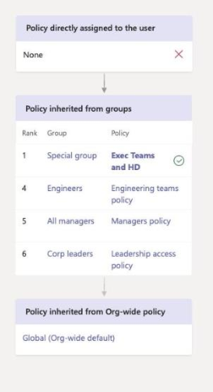
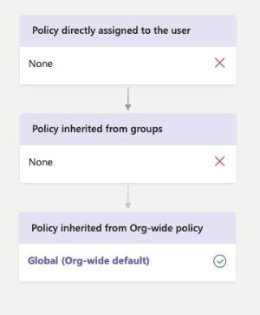

# <a name="assign-policies-to-your-users-in-microsoft-teams"></a>向 Microsoft Teams 中的用户分配策略

> [!NOTE]
> **本文中讨论的 Microsoft 团队功能之一，目前仅在私人预览版中提供了[对组的策略分配](#assign-a-policy-to-a-group)。此功能的 Powershell cmdlet 位于预发布团队 PowerShell 模块中。** 若要保持在此功能的 "发布" 状态的顶部，请查看[Microsoft 365 路线图](https://www.microsoft.com/microsoft-365/roadmap?filters=&searchterms=61185)。

作为管理员，你可以使用策略来控制你的组织中的用户可以使用的团队功能。 例如，有一些通话策略、会议策略和邮件策略，只需命名。

组织具有不同类型的具有独特需求的用户和你创建和分配的自定义策略，让你可以根据这些需求将策略设置自定义给不同的用户集。

为了便于管理组织中的策略，团队提供了多种方法来为用户分配策略。 你可以将策略直接分配给用户，无论是单独的还是通过批处理作业进行缩放，或是用户所属的组。 你还可以使用策略程序包向组织中具有类似角色的用户分配策略的预设集合。 你选择的选项取决于你正在管理的策略的数量以及你要分配到的用户数。

本文介绍为用户分配策略的不同方法以及用于何时使用的建议方案。

## <a name="which-policy-takes-precedence"></a>哪种策略优先？

用户对每个策略类型都有一个有效策略。 用户可以直接分配策略，也可以是分配了相同类型策略的一个或多个组的成员。 在这种情况下，哪些策略优先？  根据优先级规则确定用户的有效策略，如下所示。

如果用户直接分配策略（单独或通过批处理作业），则该策略优先。 在以下示例中，用户的有效策略是 Lincoln 方形会议策略，该策略直接分配给用户。


如果用户未直接分配给定类型的策略，则分配给用户所属组的策略优先。 如果用户是多个组的成员，则具有给定策略类型的最高[组分配级别](#group-assignment-ranking)的策略优先。

在此示例中，用户的有效策略是 Exec 团队和 HD 策略，该策略具有相对于用户所属的其他组的最高工作分配级别，并且还分配有相同策略类型的策略。  



如果用户未直接分配策略或不是分配了策略的任何组的成员，则用户将获取该策略类型的全局（组织范围默认）策略。 下面是一个示例。



若要了解详细信息，请参阅[优先规则](#precedence-rules)。

## <a name="ways-to-assign-policies"></a>分配策略的方法

下面概述了为用户分配策略的方法和建议的每种方案。 单击链接以了解详细信息。

|要执行的操作  |If .。。  | 使用 .。。
|---------|---------|----|
|[为单个用户分配策略](#assign-a-policy-to-individual-users)    | 您是新的团队新手，只需将一个或几个策略分配给少数几个用户。 |Skype for Business Online PowerShell 模块中的 Microsoft 团队管理中心或 PowerShell cmdlet
| [分配策略包](#assign-a-policy-package)   | 您需要将多个策略分配给组织中具有相同或类似角色的特定用户组。 例如，将教育版（教师）策略包分配给你的学校教师，让他们能够完全访问聊天、通话和会议以及教育（次要学校学生）策略包，以限制某些功能，如私人通话。  |团队 PowerShell 模块中的 Microsoft 团队管理中心或 PowerShell cmdlet|
|[为一批用户分配策略](#assign-a-policy-to-a-batch-of-users)   | 您需要为大型用户组分配策略。 例如，你希望一次为组织中的成百上千个用户分配策略。  |团队 PowerShell 模块中的 PowerShell cmdlet|
|为[组分配策略](#assign-a-policy-to-a-group)（在预览中）   |您需要根据用户的组成员身份分配策略。 例如，你想要向安全组或组织单位中的所有用户分配策略。| 团队 PowerShell 模块中的 PowerShell cmdlet|
| [将策略包分配给一批用户](#assign-a-policy-package-to-a-batch-of-users)|您需要为组织中具有相同或类似角色的一批用户分配多个策略。 例如，使用批处理作业将教育版（教师）策略包分配给你的学校中的所有教师，让他们能够完全访问聊天、通话和会议，并将教育（次要学校学生）策略包分配给一批次要学生，以限制某些功能（如私人通话）。|团队 PowerShell 模块中的 PowerShell cmdlet|
| 将策略包分配给组（即将推出）   | ||

## <a name="assign-a-policy-to-individual-users"></a>为单个用户分配策略

请按照以下步骤将策略分配给单个用户或一次分配给少数几个用户。

### <a name="using-the-microsoft-teams-admin-center"></a>使用 Microsoft 团队管理中心

若要为用户分配策略，请执行以下操作：

1. 在 Microsoft Teams 管理员中心的左侧导航中，转到“用户”，然后单击相应的用户。****
2. 单击用户名的左侧以选择用户，然后单击“编辑设置”。****
3. 选择要分配的策略，然后单击 "**应用**"。

若要一次为多达20名用户分配策略，请参阅[批量编辑团队用户设置](edit-user-settings-in-bulk.md)。

或者，您也可以执行以下操作：

1. 在 Microsoft 团队管理中心的左侧导航中，转到 "策略" 页面。
2. 通过单击策略名称的左侧，选择要分配的策略。
3. 选择“管理用户”****。
4. 在 "**管理用户**" 窗格中，按 "显示名称" 或 "按用户名搜索用户"，选择名称，然后选择 "**添加**"。 对想要添加的每一个用户重复此步骤。
5. 添加完用户后，请选择 "**保存**"。

### <a name="using-powershell"></a>使用 PowerShell

每个策略类型都有自己的一组用于管理它的 cmdlet。 使用给定```Grant-```策略类型的 cmdlet 分配策略。 例如，使用```Grant-CsTeamsMeetingPolicy``` cmdlet 向用户分配团队会议策略。 这些 cmdlet 包含在 Skype for Business Online PowerShell 模块中，并记录在[skype for business cmdlet 参考](https://docs.microsoft.com/powershell/skype/intro?view=skype-ps)中。

 下载并安装[Skype For Business Online PowerShell 模块](https://www.microsoft.com/en-us/download/details.aspx?id=39366)（如果尚未安装），然后运行以下操作以连接到 Skype For business online 并启动会话。

```powershell
Import-Module SkypeOnlineConnector
$Cred = Get-Credential
$CSSession = New-CsOnlineSession -Credential $Cred
Import-PSSession -Session $CSSession
```

在此示例中，我们将名为 "学生会议策略" 的团队会议策略分配给名为 Reda 的用户。

```powershell
Grant-CsTeamsMeetingPolicy -Identity reda@contoso.com -PolicyName "Student Meeting Policy"
```

若要了解详细信息，请参阅[通过 PowerShell 管理策略](teams-powershell-overview.md#managing-policies-via-powershell)。

## <a name="assign-a-policy-package"></a>分配策略包

团队中的策略包是预定义策略和策略设置的集合，你可以分配给在你的组织中具有相同或类似角色的用户。 每个策略程序包均围绕用户角色进行设计，其中包含支持该角色的典型活动的预定义策略和策略设置。 策略包的一些示例是教育版（教师）包和医疗保健（临床工作者）程序包。

向用户分配策略包时，将创建程序包中的策略，然后你可以自定义程序包中每个策略的设置以满足用户需求。

若要了解有关策略程序包的详细信息，包括如何分配和管理它们的分步指导，请参阅[管理团队中的策略程序包](manage-policy-packages.md)。

## <a name="assign-a-policy-to-a-batch-of-users"></a>为一批用户分配策略
 
通过批处理策略分配，您可以一次性为大型用户分配策略，而无需使用脚本。 使用```New-CsBatchPolicyAssignmentOperationd``` cmdlet 提交要分配的一批用户和策略。 作业作为后台操作处理，并为每个批处理生成操作 ID。 然后，你可以使用```Get-CsBatchPolicyAssignmentOperation```该 cmdlet 跟踪批处理中作业的进度和状态。

批处理最多可包含20000个用户。 你可以按对象 Id、用户主体名称（UPN）、会话初始协议（SIP）地址或电子邮件地址指定用户。

> [!IMPORTANT]
> 我们当前建议你一次为每批5000用户分配策略。 在增加需求的这些时间内，你可能会遇到处理时间方面的延迟。 为了将这些增加的处理时间的影响降到最低，我们建议你向5000用户提交较小的批处理大小，并且仅在上一个批处理完成后再提交。 在正常工作时间内提交批还会有所帮助。

> [!NOTE]
> 当前，批策略分配不适用于所有团队策略类型。 有关受支持的策略类型列表，请参阅[CsBatchPolicyAssignmentOperation](https://docs.microsoft.com/powershell/module/teams/new-csbatchpolicyassignmentoperation) 。

### <a name="install-and-connect-to-the-microsoft-teams-powershell-module"></a>安装并连接到 Microsoft 团队 PowerShell 模块

运行以下操作以安装[Microsoft 团队 PowerShell 模块](https://www.powershellgallery.com/packages/MicrosoftTeams)。 请确保安装1.0.5 或更高版本。

```powershell
Install-Module -Name MicrosoftTeams
```

运行以下操作以连接到团队并启动会话。

```powershell
Connect-MicrosoftTeams
```

出现提示时，请使用管理员凭据登录。

### <a name="install-and-connect-to-the-azure-ad-powershell-for-graph-module-optional"></a>安装并连接到 Azure AD PowerShell for Graph 模块（可选）

你可能还希望[下载并安装适用于 Graph 模块的 AZURE Ad PowerShell](https://docs.microsoft.com/powershell/azure/active-directory/install-adv2) （如果尚未这样做），并连接到 Azure ad，以便你可以检索组织中的用户列表。

运行以下操作以连接到 Azure AD。

```powershell
Connect-AzureAD
```

出现提示时，请使用您用于连接到团队的相同管理员凭据登录。

### <a name="assign-a-policy-to-a-batch-of-users"></a>为一批用户分配策略

在此示例中，我们使用```New-CsBatchPolicyAssignmentOperation``` cmdlet 将名为 HR App 设置策略的应用设置策略分配给 Users_ids 文本文件中列出的一批用户。

```powershell
$user_ids = Get-Content .\users_ids.txt
New-CsBatchPolicyAssignmentOperation -PolicyType TeamsAppSetupPolicy -PolicyName "HR App Setup Policy" -Identity $users_ids -OperationName "Example 1 batch"
```

在此示例中，我们连接到 Azure AD 以检索用户集合，然后将名为 "新员工消息传递策略" 的消息策略分配给使用其 Upn 指定的批用户。

```powershell
Connect-AzureAD
$users = Get-AzureADUser
New-CsBatchPolicyAssignmentOperation -PolicyType TeamsMessagingPolicy -PolicyName "New Hire Messaging Policy" -Identity $users.UserPrincipalName -OperationName "Example 2 batch"
```

若要了解详细信息，请参阅[CsBatchPolicyAssignmentOperation](https://docs.microsoft.com/powershell/module/teams/new-csbatchpolicyassignmentoperation)。

### <a name="get-the-status-of-a-batch-assignment"></a>获取批处理作业的状态

运行以下操作以获取批处理作业的状态，其中 OperationId 是由给定批处理的```New-CsBatchPolicyAssignmentOperation``` cmdlet 返回的操作 ID。

```powershell
$Get-CsBatchPolicyAssignmentOperation -OperationId f985e013-0826-40bb-8c94-e5f367076044 | fl
```

如果输出显示发生了错误，请运行以下内容以获取有关```UserState```属性中的错误的详细信息。

```powershell
Get-CsBatchPolicyAssignmentOperation -OperationId f985e013-0826-40bb-8c94-e5f367076044 | Select -ExpandProperty UserState
```

若要了解详细信息，请参阅[CsBatchPolicyAssignmentOperation](https://docs.microsoft.com/powershell/module/teams/get-csbatchpolicyassignmentoperation)。

## <a name="assign-a-policy-to-a-group"></a>为组分配策略

**对组的策略分配当前仅在专用预览中可用。此功能的 cmdlet 位于预发布团队 PowerShell 模块中。**

通过向组分配策略，你可以为一组用户（如安全组或组织单位）分配策略。 根据优先级规则，策略分配将传播到组的成员。 将成员添加到组或从组中删除成员后，将相应地更新其继承的策略分配。

你可以使用```New-CsGroupPolicyAssignment``` cmdlet 向组分配策略。 您可以通过使用对象 Id、SIP 地址或电子邮件地址来指定组。

分配策略时，它将立即分配给组。 但是，请注意，对组成员的策略分配的传播是作为后台操作执行的，可能需要一些时间，具体取决于组的大小。 当从组中取消分配策略时，或者在组中添加或删除成员时，也是如此。

> [!NOTE]
> 目前，对组的策略分配对所有团队策略类型不可用。 有关受支持的策略类型列表，请参阅[CsGroupPolicyAssignment](https://docs.microsoft.com/powershell/module/teams/new-csgrouppolicyassignment) 。

### <a name="what-you-need-to-know-about-policy-assignment-to-groups"></a>对组的策略分配需要了解的内容

在开始之前，了解优先级规则和组分配的排名非常重要。

#### <a name="precedence-rules"></a>优先规则

对于给定的策略类型，根据以下情况确定用户的有效策略：

- 直接分配给用户的策略优先于分配给组的任何其他相同类型的策略。 换言之，如果用户直接分配给某一给定类型的策略，则该用户不会从组中继承同一类型的策略。 这还意味着，如果用户具有直接分配给他们的给定类型的策略，则必须从用户处删除该策略，然后才能从组继承同一类型的策略。
- 如果用户没有直接分配给他们的策略，并且是两个或更多组的成员，并且每个组都分配有相同类型的策略，则用户将继承具有最高级别的组分配的策略。
- 如果用户不是分配了策略的任何组的成员，则该策略类型的全局（组织范围默认）策略将应用于该用户。

当用户在分配了策略的组中添加或删除时，用户的有效策略将根据这些规则进行更新，从组中取消分配策略，或者删除直接分配给用户的策略。

#### <a name="group-assignment-ranking"></a>组分配排名
 
向组分配策略时，为组分配指定排名。 如果用户是两个或更多组的成员，并且每个组都分配有同一类型的策略，则使用此功能确定用户应继承为其有效策略的策略。

组分配排名与同一类型的其他组分配相关。 例如，如果您正在向两个组分配呼叫策略，则将一个作业的等级设置为1，另一个设置为2，1为最高排名。 组分配排名指明哪些组成员身份比继承的其他组成员更重要或更密切。
 
例如，你有两个组，存储员工和商店经理。 这两个组都分配有一个团队调用策略，分别存储员工调用策略和存储管理器调用策略。 对于位于两个组中的商店经理，其角色作为经理，其角色与员工的角色更相关，因此分配给应用商店管理员组的呼叫策略应具有更高的排名。

|团队 |团队调用策略名称  |等级|
|---------|---------|---|
|商店经理   |应用商店经理通话政策         |1|
|存储员工    |存储员工通话政策      |ppls-2|

如果未指定排名，则将为策略分配授予最低级别。

### <a name="install-and-connect-to-the-microsoft-teams-powershell-module"></a>安装并连接到 Microsoft 团队 PowerShell 模块

> [!NOTE]
> 这些 cmdlet 位于团队 PowerShell 模块的预发布版本中。 按照以下步骤，首先卸载团队 PowerShell 模块的通用版本（如果已安装），然后从 PowerShell 测试库安装该模块的最新预发布版本。

如果尚未执行此操作，请运行以下操作以将 PowerShell 测试库注册为受信任的来源。

```powershell
Register-PSRepository -SourceLocation https://www.poshtestgallery.com/api/v2 -Name PsTestGallery -InstallationPolicy Trusted
```

如果你安装了通用版本的团队 PowerShell 模块，请运行以下程序将其卸载。

```powershell
Uninstall-Module MicrosoftTeams -AllVersions
```

运行以下操作，从 PowerShell 测试库中安装最新的 Microsoft 团队 PowerShell 模块。

```powershell
Install-Module MicrosoftTeams -Repository PSTestGallery
```

运行以下操作以连接到团队并启动会话。

```powershell
Connect-MicrosoftTeams
```

出现提示时，请使用管理员凭据登录。

### <a name="assign-a-policy-to-a-group"></a>为组分配策略

在此示例中，我们使用```New-CsGroupPolicyAssignment``` cmdlet 将名为零售经理会议策略的团队会议策略分配给分配等级为1的组。

```powershell
New-CsGroupPolicyAssignment -GroupId d8ebfa45-0f28-4d2d-9bcc-b158a49e2d17 -PolicyType TeamsMeetingPolicy -PolicyName "Retail Managers Meeting Policy" -Rank 1
```

若要了解详细信息，请参阅[CsGroupPolicyAssignment](https://docs.microsoft.com/powershell/module/teams/new-csgrouppolicyassignment)。

### <a name="get-policy-assignments-for-a-group"></a>获取组的策略分配

使用```Get-CsGroupPolicyAssignment``` cmdlet 获取分配给组的所有策略。 请注意，组始终按组 Id 列出，即使其 SIP 地址或电子邮件地址用于分配策略。

在此示例中，我们将检索分配给特定组的所有策略。

```powershell
Get-CsGroupPolicyAssignment -GroupId e050ce51-54bc-45b7-b3e6-c00343d31274
```

在此示例中，我们将返回分配有团队会议策略的所有组。

```powershell
Get-CsGroupPolicyAssignment -PolicyType TeamsMeetingPolicy
```

若要了解详细信息，请参阅[CsGroupPolicyAssignment](https://docs.microsoft.com/powershell/module/teams/get-csgrouppolicyassignment)。

### <a name="remove-a-policy-from-a-group"></a>从组中删除策略

使用```Remove-CsGroupPolicyAssignment``` cmdlet 从组中删除策略。 从组中删除策略时，将更新分配给该组的相同类型的其他策略的优先级和较低级别的其他策略。 例如，如果删除分级为2的策略，则级别为3和4的策略将更新，以反映其新排名。 下面的两个表显示了此示例。

下面列出了团队会议策略的策略分配和优先级。

|组名称  |策略名称  |等级|
|---------|---------|---------|
|销售    |销售政策       | 1        |
|西部区域     |West 区域策略         |ppls-2         |
|单位    |部门策略         |3         |
|附属   |附属政策        |4         |

如果我们删除 "西部" 区域组中的 "西部" 区域策略，策略分配和优先级将按如下方式更新。

|组名称  |策略名称  |等级|
|---------|---------|---------|
|销售    |销售政策       | 1        |
|单位    |部门策略         |ppls-2         |
|附属   |附属政策        |3        |

在此示例中，我们从组中删除团队会议策略。

```powershell
Remove-CsGroupPolicyAssignment -PolicyType TeamsMeetingPolicy -GroupId f985e013-0826-40bb-8c94-e5f367076044
```

若要了解详细信息，请参阅[删除-CsGroupPolicyAssignment](https://docs.microsoft.com/powershell/module/teams/remove-csgrouppolicyassignment)。

### <a name="change-a-policy-assignment-for-a-group"></a>更改组的策略分配

为组分配策略后，可以使用```Set-CsGroupPolicyAssignmentd``` cmdlet 更改该组的策略分配，如下所示：

- 更改排名
- 更改给定策略类型的策略
- 更改给定策略类型和排名的策略

在此示例中，我们将组的团队更改为名为 SupportCallPark 的策略，并将工作分配排名设置为3。

```powershell
Set-CsGroupPolicyAssignment -GroupId 566b8d39-5c5c-4aaa-bc07-4f36278a1b38 -PolicyType TeamsMeetingPolicy -PolicyName SupportCallPark -Rank 3
```

若要了解详细信息，请参阅[设置 CsGroupPolicyAssignment](https://docs.microsoft.com/powershell/module/teams/set-csgrouppolicyassignment)。

### <a name="change-the-effective-policy-for-a-user"></a>更改用户的有效策略

下面是如何更改直接分配了策略的用户的有效策略的示例。

首先，我们将```Get-CsUserPolicyAssignment``` cmdlet 与```PolicySource```参数结合使用，以获取与用户相关联的团队会议广播策略的详细信息。 若要了解详细信息，请参阅[CsUserPolicyAssignment](https://docs.microsoft.com/powershell/module/teams/get-csuserpolicyassignment)。

```powershell
Get-CsUserPolicyAssignment -Identity daniel@contoso.com -PolicyType TeamsMeetingBroadcastPolicy | select -ExpandProperty PolicySource
```

输出显示用户直接分配有名为员工事件的团队会议广播策略，该策略优先于分配给用户所属组的名为 "供应商实时事件" 的策略。

```
AssignmentType PolicyName         Reference
-------------- ----------         ---------
Direct         Employee Events
Group          Vendor Live Events 566b8d39-5c5c-4aaa-bc07-4f36278a1b38
```

现在，我们将从用户中删除 "员工活动" 策略。 这意味着用户不再有团队会议广播策略直接分配给他们，并且将继承分配给用户所属组的供应商实时事件策略。 

使用 Skype for Business PowerShell 模块中的以下 cmdlet 执行此操作。

```powershell
Grant-CsTeamsMeetingBroadcastPolicy -Identity daniel@contoso.com -PolicyName $null
```

你可以使用团队 Powershell 模块中的以下 cmdlet 通过批处理策略分配以缩放方式执行此操作，其中 $users 是你指定的用户的列表。

```powershell
New-CsBatchPolicyAssignmentOperation -OperationName "Assigning null at bulk" -PolicyType TeamsMeetingBroadcastPolicy -PolicyName $null -Identity $users  
```

## <a name="assign-a-policy-package-to-a-batch-of-users"></a>将策略包分配给一批用户

通过批处理策略程序包分配，您可以一次性为大型用户分配策略包，而无需使用脚本。 使用```New-CsBatchPolicyPackageAssignmentOperation``` cmdlet 提交要分配的一批用户和策略包。 作业作为后台操作处理，并为每个批处理生成操作 ID。 然后，你可以使用```Get-CsBatchPolicyAssignmentOperation```该 cmdlet 跟踪批处理中作业的进度和状态。

批处理最多可包含20000个用户。 你可以按对象 Id、UPN、SIP 地址或电子邮件地址指定用户。

> [!IMPORTANT]
> 我们当前建议你一次为每批5000用户分配策略包。 在增加需求的这些时间内，你可能会遇到处理时间方面的延迟。 为了将这些增加的处理时间的影响降到最低，我们建议你向5000用户提交较小的批处理大小，并且仅在上一个批处理完成后再提交。 在正常工作时间内提交批还会有所帮助。

### <a name="install-and-connect-to-the-microsoft-teams-powershell-module"></a>安装并连接到 Microsoft 团队 PowerShell 模块

运行以下操作以安装[Microsoft 团队 PowerShell 模块](https://www.powershellgallery.com/packages/MicrosoftTeams)（如果尚未安装）。 请确保安装1.0.5 或更高版本。

```powershell
Install-Module -Name MicrosoftTeams
```

运行以下操作以连接到团队并启动会话。

```powershell
Connect-MicrosoftTeams
```

出现提示时，请使用管理员凭据登录。

### <a name="assign-a-policy-package-to-a-batch-of-users"></a>将策略包分配给一批用户

在此示例中，我们使用```New-CsBatchPolicyPackageAssignmentOperation``` cmdlet 将 Education_PrimaryStudent 策略包分配给一批用户。

```powershell
New-CsBatchPolicyPackageAssignmentOperation -Identity 1bc0b35f-095a-4a37-a24c-c4b6049816ab,user1@econtoso.com,user2@contoso.com -PackageName Education_PrimaryStudent
```

若要了解详细信息，请参阅[CsBatchPolicyAssignmentOperation](https://docs.microsoft.com/powershell/module/teams/new-csbatchpolicyassignmentoperation)。

### <a name="get-the-status-of-a-batch-assignment"></a>获取批处理作业的状态

运行以下操作以获取批处理作业的状态，其中 OperationId 是由给定批处理的```New-CsBatchPolicyAssignmentOperation``` cmdlet 返回的操作 ID。

```powershell
$Get-CsBatchPolicyAssignmentOperation -OperationId f985e013-0826-40bb-8c94-e5f367076044 | fl
```

如果输出显示发生了错误，请运行以下内容以获取有关```UserState```属性中的错误的详细信息。

```powershell
Get-CsBatchPolicyAssignmentOperation -OperationId f985e013-0826-40bb-8c94-e5f367076044 | Select -ExpandProperty UserState
```

若要了解详细信息，请参阅[CsBatchPolicyAssignmentOperation](https://docs.microsoft.com/powershell/module/teams/get-csbatchpolicyassignmentoperation)。 

## <a name="related-topics"></a>相关主题

- [Teams PowerShell 概览](teams-powershell-overview.md)