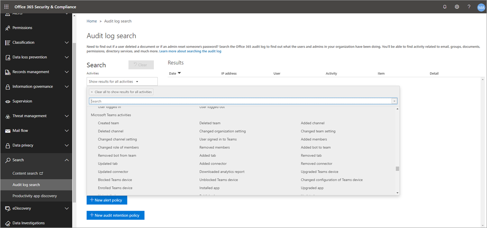
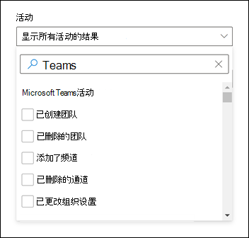

# 在 Microsoft Teams 中搜索事件的审核日志Search the audit log for events in Microsoft Teams

> [!IMPORTANT]
> [!INCLUDE [new-teams-sfb-admin-center-notice](includes/new-teams-sfb-admin-center-notice.md)]

审核日志可帮助你在 Microsoft 365 服务中调查特定活动。The audit log can help you investigate specific activities across Microsoft 365 services. 对于 Microsoft 团队，以下是已审核的一些活动：For Microsoft Teams, here are some of the activities that are audited:

- 团队创建Team creation
- 团队删除Team deletion
- 添加频道Added channel
- 更改设置Changed setting

有关审核的团队活动的完整列表，请参阅预览) 中的 [团队](#teams-activities) 活动和 [团队活动中的倒班 (](#shifts-in-teams-activities)。For a complete list of Teams activities that are audited, see [Teams activities](#teams-activities) and [Shifts in Teams activities (in preview)](#shifts-in-teams-activities).

> [!NOTE]
> 来自专用频道的审核事件也会被记录为团队和标准频道。Audit events from private channels are also logged as they are for teams and standard channels.

## 在 Teams 中启用审核Turn on auditing in Teams

在你可以查看审核数据之前，你必须先在 [安全 & 合规中心](https://protection.office.com)中启用审核。Before you can look at audit data, you have to first turn on auditing in the [Security & Compliance Center](https://protection.office.com). 有关启用审核的帮助，请参阅 [打开或关闭审核日志搜索](https://support.office.com/article/Turn-Office-365-audit-log-search-on-or-off-e893b19a-660c-41f2-9074-d3631c95a014)。For help with turning on auditing, read [Turn audit log search on or off](https://support.office.com/article/Turn-Office-365-audit-log-search-on-or-off-e893b19a-660c-41f2-9074-d3631c95a014).

> [!IMPORTANT]
> 审核数据仅在您打开审核的位置可用。Audit data is only available from the point at which you turned on auditing.

## 从审核日志检索 Teams 数据Retrieve Teams data from the audit log

1. 要检索审核日志，请转到[安全与合规中心](https://go.microsoft.com/fwlink/?linkid=855775)。To retrieve audit logs, go to the [Security & Compliance Center](https://go.microsoft.com/fwlink/?linkid=855775). 在 " **搜索**" 下，选择 " **审核日志搜索**"。Under **Search**, select **Audit log search**.
2. 使用“**搜索**”按活动、日期和你要审核的用户进行筛选。Use **Search** to filter by the activities, dates, and users you want to audit.
3. 将结果导出到 Excel 以供进一步分析。Export your results to Excel for further analysis.

> [!IMPORTANT]
> 仅当启用了审核功能时，审核日志中才会显示审核数据。Audit data is only visible in the audit log if auditing is turned on.

审核记录在审核日志中保留和搜索的时间长度取决于你的 Microsoft 365 或 Office 365 订阅，以及分配给用户的许可证类型。The length of time that an audit record is retained and searchable in the audit log depends on your Microsoft 365 or Office 365 subscription, and specifically the type of license that's assigned to users. 若要了解详细信息，请参阅 [安全 & 合规性中心服务说明](https://docs.microsoft.com/office365/servicedescriptions/office-365-platform-service-description/office-365-securitycompliance-center)。To learn more, see the [Security & Compliance Center service description](https://docs.microsoft.com/office365/servicedescriptions/office-365-platform-service-description/office-365-securitycompliance-center).

## 有关搜索审核日志的提示Tips for searching the audit log

下面是在审核日志中搜索团队活动的提示。Here are tips for searching for Teams activities in the audit log.

- 你可以通过单击活动名称来选择要搜索的特定活动。You can select specific activities to search for by clicking the activity name. 或者，您可以通过单击组名称来搜索组中的所有活动 (例如 **文件和文件夹活动**) 。Or you can search for all activities in a group (such as **File and folder activities**) by clicking the group name. 如果已选择活动，则可以单击它以取消选择。If an activity is selected, you can click it to cancel the selection. 你还可以使用搜索框显示包含你键入的关键字的活动。You can also use the search box to display the activities that contain the keyword that you type. 
    

- 若要显示使用 cmdlet 运行的活动事件，请在 "**活动**" 列表中选择 "**显示所有活动的结果**"。To display events for activities run using cmdlets, select **Show results for all activities** in the **Activities** list. 如果您知道这些活动的操作的名称，请搜索所有活动，然后通过在 " **活动** " 列的框中键入操作的名称来筛选结果。If you know the name of the operation for these activities, search for all activities, and then filter the results by typing the name of the operation in the box in the **Activity** column. 若要了解详细信息，请参阅 [步骤3：筛选搜索结果](https://docs.microsoft.com/microsoft-365/compliance/search-the-audit-log-in-security-and-compliance?view=o365-worldwide#step-3-filter-the-search-results)。To learn more, see [Step 3: Filter the search results](https://docs.microsoft.com/microsoft-365/compliance/search-the-audit-log-in-security-and-compliance?view=o365-worldwide#step-3-filter-the-search-results).

- 若要清除当前搜索条件，请单击 " **清除**"。To clear the current search criteria, click **Clear**. 日期范围将返回到过去七天的默认值。The date range returns to the default of the last seven days. 您也可以单击 "全部 **清除" 以显示所有活动的结果** ，以取消所有选定的活动。You can also click **Clear all to show results for all activities** to cancel all selected activities.

- 如果找到5000结果，则可能假设有超过5000个事件满足搜索条件。If 5,000 results are found, you can probably assume that there are more than 5,000 events that met the search criteria. 你可以优化搜索条件，然后重新运行搜索以返回较少结果，也可以通过选择 "**导出结果**"  >  **下载所有结果**来导出所有搜索结果。You can refine the search criteria and rerun the search to return fewer results, or you can export all the search results by selecting **Export results** > **Download all results**.

查看 [此视频](https://www.youtube.com/embed/UBxaRySAxyE) ，以使用音频日志搜索。Check out [this video](https://www.youtube.com/embed/UBxaRySAxyE) for using audio log search. 加入团队的计划经理 Ansuman Acharya，因为他演示了如何执行审核日志搜索团队。Join Ansuman Acharya, a program manager for Teams, as he demonstrates how to do an audit log search for Teams.

## 使用 Cloud App Security 设置活动策略Use Cloud App Security to set activity policies

使用 [Microsoft Cloud App Security](https://docs.microsoft.com/cloud-app-security/what-is-cloud-app-security) 集成，你可以设置 [活动策略](https://docs.microsoft.com/cloud-app-security/user-activity-policies) ，以使用应用提供程序的 api 强制执行广泛的自动化过程。Using [Microsoft Cloud App Security](https://docs.microsoft.com/cloud-app-security/what-is-cloud-app-security) integration, you can set [activity policies](https://docs.microsoft.com/cloud-app-security/user-activity-policies) to enforce a wide range of automated processes using the app provider's APIs. 通过这些策略，你可以监视由不同用户执行的特定活动，或跟踪特定类型的活动的意外费率。These policies enable you to monitor specific activities carried out by various users, or follow unexpectedly high rates of one certain type of activity.

设置活动检测策略后，它将开始生成警报。After you set an activity detection policy, it starts to generate alerts. 仅在创建策略后发生的活动上生成警报。Alerts are only generated on activities that occur after you create the policy. 下面是有关如何使用 Cloud App Security 中的活动策略监控团队活动的一些示例方案。Here's some example scenarios for how you can use activity policies in Cloud App Security to monitor Teams activities.

### 外部用户方案External user scenario

从业务角度看，您可能想要关注的一种方案是向团队环境添加外部用户。One scenario you might want to keep an eye on, from a business perspective, is the addition of external users to your Teams environment. 如果启用了外部用户，则监视其状态是一个好主意。If external users are enabled, monitoring their presence is a good idea.  你可以使用 [Cloud App Security](https://docs.microsoft.com/cloud-app-security/what-is-cloud-app-security) 来识别潜在威胁。You can use [Cloud App Security](https://docs.microsoft.com/cloud-app-security/what-is-cloud-app-security) to identify potential threats.

此策略的屏幕截图用于监视添加外部用户，使你可以命名策略、根据你的业务需求设置严重性、在此情况下将其设置为 () 单个活动，然后建立仅用于专门监视非内部用户添加的参数，并将此活动限制到团队。The screenshot of this policy to monitor adding external users allows you to name the policy, set the severity according to your business needs, set it as (in this case) a single activity, and then establish the parameters that will specifically monitor only the addition of non-internal users, and limit this activity to Teams.

可在活动日志中查看来自此策略的结果：The results from this policy can be viewed in the activity log:

在此处，你可以查看与你已设置的策略的匹配项，并根据需要进行任何调整，或将结果导出为在其他位置使用。Here you can review matches to the policy you've set, and make any adjustments as needed, or export the results to use elsewhere.

### 批量删除方案Mass delete scenario

正如前面所述，你可以监视删除方案。As mentioned earlier, you can monitor deletion scenarios. 可以创建一个策略来监视团队网站的大量删除。It's possible to create a policy that would monitor mass deletion of Teams sites. 在此示例中，会将基于警报的策略设置为在30分钟跨度内检测团队的批量删除。In this example, an alert-based policy is set up to detect mass deletion of teams in a span of 30 minutes.

如屏幕截图所示，你可以为此策略设置许多不同的参数以监视团队删除，包括严重性、单个或重复操作，以及将此限制为团队和网站删除的参数。As the screenshot shows, you can set many different parameters for this policy to monitor Teams deletions, including severity, single or repeated action, and parameters limiting this to Teams and site deletion. 这可以独立于模板执行，也可以根据组织的需要，创建基于此策略创建的模板。This can be done independently of a template, or you may have a template created to base this policy on, depending on your organizational needs.

建立适用于您的企业的策略后，您可以在触发事件时查看活动日志中的结果：After you establish a policy that works for your business, you can review the results in the activity log as events are triggered:

您可以筛选到已设置的策略，以查看该策略的结果。You can filter down to the policy you've set to see the results of that policy. 如果你在活动日志中获得的结果不满意 (可能会看到大量结果，或者所有) 都没有任何结果，这可能会帮助你微调查询以使其更与你需要的操作相关。If the results you're getting in the activity log are not satisfactory (maybe you're seeing lots of results, or nothing at all), this may help you to fine-tune the query to make it more relevant to what you need it to do.

### 通知和监管方案Alert and governance scenario

当活动策略被触发时，您可以设置通知并向管理员和其他用户发送电子邮件。You can set alerts and send emails to admins and other users when an activity policy is triggered. 你可以设置自动化监管操作，例如挂起用户或让用户以自动方式再次登录。You can set automated governance actions such as suspending a user or making a user to sign in again in an automated way. 此示例显示了当活动策略被触发并确定用户在30分钟内删除了两个或多个团队时，用户帐户可以如何暂停。This example shows how a user account can be suspended when an activity policy is triggered and determines a user deleted two or more teams in 30 minutes.

## 使用 Cloud App Security 设置异常情况检测策略Use Cloud App Security to set anomaly detection policies

Cloud App Security 中的[异常检测策略](https://docs.microsoft.com/cloud-app-security/anomaly-detection-policy)提供全新的用户和实体行为分析 (UEBA) 和计算机学习 (ML) ，以便你可以在云环境中立即运行高级威胁检测。[Anomaly detection policies](https://docs.microsoft.com/cloud-app-security/anomaly-detection-policy) in Cloud App Security provide out-of-the-box user and entity behavioral analytics (UEBA) and machine learning (ML) so that you can immediately run advanced threat detection across your cloud environment. 由于它们会自动启用，因此新的异常检测策略通过提供即时检测来提供即时的结果，它针对你的用户和连接到你的网络的计算机和设备提供了多个行为异常。Because they're automatically enabled, the new anomaly detection policies provide immediate results by providing immediate detections, targeting numerous behavioral anomalies across your users and the machines and devices connected to your network. 此外，新策略会从 Cloud App Security 检测引擎中公开更多数据，以帮助你加快调查过程并包含持续威胁。Additionally, the new policies expose more data from the Cloud App Security detection engine, to help you speed up the investigation process and contain ongoing threats.

我们正在努力将团队事件集成到异常检测策略中。We're working to integrate Teams events into anomaly detection policies. 现在，你可以为其他 Office 产品设置异常情况检测策略，并在与这些策略匹配的用户上执行操作项目。For now, you can set up anomaly detection policies for other Office products and take action items on users who match those policies.

## 团队活动Teams activities

下面列出了 Microsoft 365 审核日志中的团队用户和管理员活动所记录的所有事件。Here's a list of all events that are logged for user and admin activities in Teams in the Microsoft 365 audit log. 该表包括 " **活动** " 列中显示的友好名称，以及导出搜索结果时在审核记录的详细信息和 CSV 文件中显示的相应操作的名称。The table includes the friendly name that's displayed in the **Activities** column and the name of the corresponding operation that appears in the detailed information of an audit record and in the CSV file when you export the search results.

|友好名称Friendly name  |操作Operation|说明Description |
|---------|---------|---------|
|已将机器人添加到团队Added bot to team   |BotAddedToTeamBotAddedToTeam        |用户将机器人添加到团队。A user adds a bot to a team.        |
|添加频道Added channel   |ChannelAddedChannelAdded         |用户向团队添加频道。A user adds a channel to a team.         |
|已添加连接器Added connector  |ConnectorAddedConnectorAdded          |用户向频道添加连接线。A user adds a connector to a channel.        |
|已添加成员Added members    |MemberAddedMemberAdded         |团队所有者将成员添加到团队、频道或群组聊天。A team owner adds members to a team, channel, or group chat.         |
|已添加选项卡Added tab    |TabAddedTabAdded         |用户将选项卡添加到频道。A user adds a tab to a channel.        |
|已更改频道设置Changed channel setting    |ChannelSettingChangedChannelSettingChanged         |当团队成员执行以下活动时，将记录 ChannelSettingChanged 操作。The ChannelSettingChanged operation is logged when the following activities are performed by a team member. 对于这些活动中的每个活动，在审核日志搜索结果的 " **项目** " 列中显示已更改 (括号中所更改设置的说明。For each of these activities, a description of the setting that was changed (shown in parentheses is displayed in the **Item** column in the audit log search results. <ul><li>更改团队频道 (**频道名称** 的名称) Changes name of a team channel (**Channel name**)</li><li> (**频道描述**) 的 "更改团队频道" 说明Changes description of a team channel (**Channel description**)</li> </ul>      |
|已更改的组织设置Changed organization setting   |TeamsTenantSettingChangedTeamsTenantSettingChanged         |当 Microsoft 365 管理中心中的全局管理员执行以下活动时，将记录 TeamsTenantSettingChanged 操作。The TeamsTenantSettingChanged operation is logged when the following activities are performed by a global admin in the Microsoft 365 admin center. 这些活动影响组织范围的团队设置。These activities affect org-wide Teams settings. 若要了解详细信息，请参阅 [管理你的组织的团队设置](enable-features-office-365.md)。To learn more, see [Manage Teams settings for your organization](enable-features-office-365.md).  对于这些活动中的每个活动，在审核日志搜索结果的 " **项目** " 列中显示已更改 () 中显示的设置的说明。For each of these activities, a description of the setting that was changed (shown in parentheses) is displayed in the **Item** column in the audit log search results.<ul><li>启用或禁用 (**Microsoft 团队**) 的组织团队。Enables or disables Teams for the organization (**Microsoft Teams**).</li><li>为组织 (**skype For business 互操作性**) 启用或禁用 Microsoft 团队和 skype for business 之间的互操作性。Enables or disables interoperability between Microsoft Teams and Skype for Business for the organization (**Skype for Business interoperability**).</li><li>启用或禁用 "Microsoft 团队客户" 中的组织结构图视图 (**组织结构图视图** ") 。Enables or disables the organizational chart view in Microsoft Teams clients (**Org chart view**).</li><li>允许或禁止团队成员安排私人会议 (**私人会议安排**) 的功能。Enables or disables the ability for team members to schedule private meetings (**Private meeting scheduling**).</li><li>启用或禁用团队成员 (**频道会议安排**) 安排频道会议的功能。Enables or disables the ability for team members to schedule channel meetings (**Channel meeting scheduling**).</li><li>启用或禁用) **Skype 会议 (视频的** 团队会议中的视频通话。Enables or disables video calling in Teams meetings (**Video for Skype meetings**).</li><li>在 Microsoft 团队聚会中启用或禁用) **Skype 会议 (屏幕共享** 的 "屏幕共享"。Enables or disables screen sharing in Microsoft Teams meetups for the organization (**Screen sharing for Skype meetings**).</li><li>允许或禁止 (名为 Giphy) 的动画图像添加到团队对话 (**动画图像**) 。Enables or disables that ability to add animated images (called Giphys) to Teams conversations (**Animated images**).</li><li>更改组织 (**内容分级**) 的内容评级设置。Changes the content rating setting for the organization (**Content rating**). 内容分级限制可在对话中显示的动画图像的类型。The content rating restricts the type of animated image that can be displayed in conversations.</li><li>允许或禁止团队成员将可自定义的图像添加 (称为自定义 meme) 从 internet 到团队对话 (来自 Internet 的自 **定义图像**) 。Enables or disables the ability for team members to add customizable images (called custom memes) from the internet to team conversations (**Customizable images from the Internet**).</li><li>允许或禁止团队成员将可编辑的图像添加 (称为贴纸) 到团队对话 (**可编辑的图像**) 。Enables or disables the ability for team members to add editable images (called stickers) to team conversations (**Editable images**).</li><li>启用或禁用团队成员在 Microsoft 团队聊天和频道中使用机器人的功能， (\*\*组织范围内的 bot) \*\*。Enables or disables that ability for team members to use bots in Microsoft Teams chats and channels (**Org-wide bots)**.</li><li>为 Microsoft 团队启用特定的 bot。Enables specific bots for Microsoft Teams. 这不包括 T-机器人，在为组织 (**单个 bot**) 中启用了机器人的情况下，这些功能是团队帮助机器人。This doesn't include the T-Bot, which is Teams help bot that's available when bots are enabled for the organization (**Individual bots**).</li><li>启用或禁用团队成员 (**扩展名或选项** 卡添加) 的扩展或选项卡的功能。Enables or disables the ability for team members to add extensions or tabs (**Extensions or tabs**).</li><li>启用或禁用用于 Microsoft 团队的专用 bot 的侧面加载) 的 (**面加载** 。Enables or disables the side-loading of proprietary bots for Microsoft Teams (**Side loading of Bots**).</li><li>启用或禁用用户将电子邮件发送到 Microsoft 团队频道 (**频道电子邮件**) 的功能。Enables or disables the ability for users to send email messages to a Microsoft Teams channel (**Channel email**).</li></ul>|
|已更改团队成员的角色Changed role of members in team    |MemberRoleChangedMemberRoleChanged         |团队所有者更改团队成员的角色。A team owner changes the role of members in a team. 以下值表示分配给用户的角色类型。The following values indicate the role type assigned to the user.   **1** -指示所有者角色。**1** - Indicates the Owner role. **2** -指示成员角色。**2** -  Indicates the Member role. **3** -指示来宾角色。**3** -  Indicates the Guest role.  Members 属性还包括您的组织的名称和成员的电子邮件地址。The Members property also includes the name of your organization and the member's email address.        |
|已更改的团队设置Changed team setting    |TeamSettingChangedTeamSettingChanged        |当团队所有者执行以下活动时，将记录 TeamSettingChanged 操作。The TeamSettingChanged operation is logged when the following activities are performed by a team owner. 对于这些活动中的每个活动，在审核日志搜索结果的 " **项目** " 列中显示已更改 () 中显示的设置的说明。For each of these activities, a description of the setting that was changed (shown in parentheses) is displayed in the **Item** column in the audit log search results.<ul><li>更改团队的访问权限类型。Changes the access type for a team. 团队可以设置为私人或公共 (**团队访问类型**) 。Teams can be set as private or public (**Team access type**). 当团队 (默认设置) 时，用户只能通过邀请访问团队。When a team is private (the default setting), users can access the team only by invitation. 当团队是公共团队时，它会被任何人发现。When a team is public, it's discoverable by anyone.</li><li>更改团队 (**团队分类**) 的信息分类。Changes the information classification of a team (**Team classification**). 例如，可以将团队数据分类为高业务影响、中型企业影响或低业务影响。For example, team data can be classified as high business impact, medium business impact, or low business impact.</li><li>更改团队 (**团队名称**) 的名称。Changes the name of a team (**Team name**).</li><li> (**团队描述**) 更改团队说明。Changes the team description (**Team description**).</li><li>对团队设置所做的更改。Changes made to team settings. 若要访问这些设置，团队所有者可以右键单击团队，选择 " **管理团队**"，然后单击 " **设置** " 选项卡。对于这些活动，已更改的设置的名称将显示在审核日志搜索结果的 " **项目** " 列中。To access these settings,  a team owner can right-click a team, select **Manage team**, and then click the **Settings** tab. For these activities, the name of the setting that was changed is displayed in the **Item** column in the audit log search results.</li></ul>         |
|已创建团队Created team    |TeamCreatedTeamCreated         |用户创建团队。A user creates a team.         |
|已删除所有组织应用Deleted all organization apps|DeletedAllOrganizationAppsDeletedAllOrganizationApps           |已从目录中删除所有组织应用。Deleted all organization apps from the catalog.     |
|已删除应用Deleted app |AppDeletedFromCatalogAppDeletedFromCatalog           |已从目录中删除应用。An app has been deleted from the catalog.     |
|已删除频道Deleted channel     |ChannelDeletedChannelDeleted         |用户从团队中删除频道。A user deletes a channel from a team.         |
|已删除团队Deleted team  |TeamDeletedTeamDeleted            |团队所有者删除团队。A team owner deletes a team.      |
|已安装应用Installed app |AppInstalledAppInstalled         |已安装应用。An app was installed.   |
|已在卡上执行操作Performed action on card|PerformedCardActionPerformedCardAction|用户在聊天中的自适应卡上采取行动。A user took action on an adaptive card within a chat. 自适应卡通常由 bot 用来在聊天中允许信息和交互的丰富显示。Adaptive cards are typically used by bots to allow the rich display of information and interaction in chats.   **注意：** 在审核日志中，仅在聊天中的自适应卡上才可使用内联输入操作。**Note:** Only inline input actions on an adaptive card inside a chat will be available in the audit log. 例如，当用户在由轮询 bot 生成的自适应卡上的频道对话中提交轮询响应时。For example, when a user submits a poll response in a channel conversation on an adaptive card generated by a Poll bot. 用户操作（如 "查看结果"）将打开一个对话框，或对话中的用户操作将不会在审核日志中提供。User actions such as "View result", which will open a dialog, or user actions inside dialogs won't be available in the audit log.|
|已发布应用Published app |AppPublishedToCatalogAppPublishedToCatalog           |已将应用添加到目录中。An app was added to the catalog.     |
|已从团队中删除机器人Removed bot from team   |BotRemovedFromTeamBotRemovedFromTeam         |用户从团队中删除机器人。A user removes a bot from a team.       |
|已删除连接线Removed connector     |ConnectorRemovedConnectorRemoved         |用户从频道中删除连接线。A user removes a connector from a channel.         |
|已删除成员Removed members    |MemberRemovedMemberRemoved        |团队所有者从团队、频道或群组聊天中删除成员。A team owner removes members from a team, channel, or group chat.         |
|已删除选项卡Removed tab    |TabRemovedTabRemoved         |用户从频道中删除选项卡。A user removes a tab from a channel.         |
|已卸载应用Uninstalled app |AppUninstalledAppUninstalled           |已卸载应用。An app was uninstalled.     |
|已更新应用Updated app |AppUpdatedInCatalogAppUpdatedInCatalog           |目录中的应用已更新。An app was updated in the catalog.     |
|已更新连接线Updated connector    |ConnectorUpdatedConnectorUpdated         |用户修改了频道中的连接器。A user modified a connector in a channel.         |
|已更新选项卡Updated tab   |TabUpdatedTabUpdated         |用户修改了频道中的选项卡。A user modified a tab in a channel.         |
|升级的应用Upgraded app |AppUpgradedAppUpgraded           |已将应用升级到目录中的最新版本。An app was upgraded to its latest version in the catalog.     |
|用户已登录到团队User signed in to Teams     |TeamsSessionStartedTeamsSessionStarted         |用户登录到 Microsoft 团队客户端。A user signs in to a Microsoft Teams client. 此事件不会捕获令牌刷新活动。This event doesn't capture token refresh activities.         |

## 团队活动的倒班Shifts in Teams activities

**（处于预览阶段）****(in preview)**

如果你的组织使用团队中的倒班应用，则可以在审核日志中搜索与倒班应用相关的活动。If your organization is using the Shifts app in Teams, you can search the audit log for activities related to the Shifts app. 下面是在 Microsoft 365 审核日志的团队中为倒班活动记录的所有事件的列表。Here's a list of all events that are logged for Shifts activities in Teams in the Microsoft 365 audit log.

|友好名称Friendly name  |操作Operation  |说明Description  |
|---------|---------|---------|
|已添加计划组Added scheduling group      |SchedulingGroupAddedSchedulingGroupAdded          |用户成功将新的计划组添加到计划。A user successfully adds a new scheduling group to the schedule.          |
|已编辑的计划组Edited scheduling group     |SchedulingGroupEditedSchedulingGroupEdited         |用户成功编辑计划组。A user successfully edits a scheduling group.          |
|已删除的日程安排组Deleted scheduling group         |SchedulingGroupDeletedSchedulingGroupDeleted              |用户从计划中成功删除计划组。A user successfully deletes a scheduling group from the schedule.|
|已添加班次Added shift      |ShiftAddedShiftAdded          |用户成功地添加了班次。A user successfully adds a shift.           |
|已编辑班次Edited shift       |ShiftEditedShiftEdited       |用户成功编辑班次。A user successfully edits a shift.        |
|删除的班次Deleted shift          |ShiftDeletedShiftDeleted          | 用户成功删除班次。A user successfully deletes a shift.               |
|已添加下班时间Added time off      |TimeOffAddedTimeOffAdded          |用户成功地为计划添加了时间。A user successfully adds time off on the schedule.          |
|编辑时间Edited time off         |TimeOffEditedTimeOffEdited           |用户成功编辑超时。A user successfully edits time off.          |
|删除的超时Deleted time off     |TimeOffDeletedTimeOffDeleted              |用户成功删除超时。A user successfully deletes time off.           |
|已添加左移位Added open shift     |OpenShiftAddedOpenShiftAdded          |用户成功将打开的班次添加到了计划组。A user successfully adds an open shift to a scheduling group.          |
|已编辑的左移位Edited open shift    |OpenShiftEditedOpenShiftEdited          |用户成功编辑计划组中打开的班次。A user successfully edits an open shift in a scheduling group.          |
|已删除的打开班次Deleted open shift      |OpenShiftDeletedOpenShiftDeleted          |用户成功地从计划组中删除了一个打开的班次。A user successfully deletes an open shift from a scheduling group.         |
|共享计划Shared schedule     |ScheduleSharedScheduleShared                  |用户成功地为日期范围共享团队日程。A user successfully shared a team schedule for a date range.          |
|使用时间时钟上班打卡Clocked in using Time clock         |ClockedInClockedIn          |用户使用时间时钟成功地上班打卡。A user successfully clocks in using Time clock.          |
|使用时间时钟下班打卡Clocked out using Time clock      |ClockedOutClockedOut          |用户使用时间时钟成功地下班打卡。A user successfully clocks out using Time clock.          |
|使用时间时钟启动中断Started break using Time clock      |BreakStartedBreakStarted          |用户在处于活动状态的时间时钟会话期间成功启动了中断。A user successfully starts a break during an active Time clock session.          |
|使用时间时钟结束休息Ended break using Time clock    |BreakEndedBreakEnded          |用户在活动时间时钟会话期间成功结束中断。A user successfully ends a break during an active Time clock session.          |
|已添加时间时钟条目Added Time clock entry     |TimeClockEntryAddedTimeClockEntryAdded          |用户成功地在工时单上添加了新的手动时间时钟条目。A user successfully adds a new manual Time clock entry on Time Sheet.          |
|已编辑的时间时钟条目Edited Time clock entry     | TimeClockEntryEditedTimeClockEntryEdited             |用户成功编辑工时单上的时间时钟条目。A user successfully edits a Time clock entry on Time Sheet.          |
|已删除的时间时钟条目Deleted Time clock entry    |TimeClockEntryDeletedTimeClockEntryDeleted              |用户成功删除工时单上的时间时钟条目。A user successfully deletes a Time clock entry on Time Sheet.          |
|已添加班次请求Added shift request         |RequestAddedRequestAdded              |用户添加了班次请求。A user added a shift request.          |
|已响应班次请求Responded to shift request     |RequestRespondedToRequestRespondedTo                  |用户响应了班次请求。A user responded to a shift request.          |
|已取消班次请求Canceled shift request         |RequestCancelledRequestCancelled               |用户取消了班次请求。A user canceled a shift request.          |
|已更改的日程安排设置Changed schedule setting      |ScheduleSettingChangedScheduleSettingChanged          |用户更改了 "倒班" 设置中的设置。A user changes a setting in Shifts settings.         |
|添加劳动力集成Added workforce integration      |WorkforceIntegrationAddedWorkforceIntegrationAdded                  | 倒班应用与第三方系统集成。The Shifts app is integrated with a third-party system.         |
|已接受的离开班次消息Accepted off shift message         |OffShiftDialogAcceptedOffShiftDialogAccepted          |用户在倒班小时后确认访问团队的非班次消息。A user acknowledges the off-shift message to access Teams after shift hours.           |

## Office 365 管理活动 APIOffice 365 Management Activity API

你可以使用 Office 365 管理活动 API 检索有关团队事件的信息。You can use the Office 365 Management Activity API to retrieve information about Teams events. 若要了解有关团队的管理活动 API 架构的详细信息，请参阅 [团队架构](https://docs.microsoft.com/office/office-365-management-api/office-365-management-activity-api-schema#microsoft-teams-schema)。To learn more about the  Management Activity API schema for Teams, see [Teams schema](https://docs.microsoft.com/office/office-365-management-api/office-365-management-activity-api-schema#microsoft-teams-schema).

## 团队审核日志中的特性Attribution in Teams audit logs

团队中的成员身份更改 (例如，通过 Azure Active Directory (Azure AD) 、Microsoft 365 管理门户或 Microsoft 365 组绘制的) 的成员关系图 API 将显示在团队审核消息中以及与该操作的实际发起者无关的常规频道中。Membership changes to Teams (such as users added or deleted) made through Azure Active Directory (Azure AD), Microsoft 365 admin portal, or Microsoft 365 Groups Graph API will appear in Teams audit messages and in the General channel with an attribution to an existing owner of the team, and not to the actual initiator of the action. 在这些方案中，请咨询 Azure AD 或 [Microsoft 365 组审核日志](https://docs.microsoft.com/microsoft-365/compliance/search-the-audit-log-in-security-and-compliance) 以查看相关信息。In these scenarios, consult Azure AD or [Microsoft 365 Group audit logs](https://docs.microsoft.com/microsoft-365/compliance/search-the-audit-log-in-security-and-compliance) to see the relevant information.

## 相关主题Related topics

- [在 Microsoft 365 合规性中心中搜索审核日志Search the audit log in the Microsoft 365 compliance center](https://docs.microsoft.com/microsoft-365/compliance/search-the-audit-log-in-security-and-compliance)
