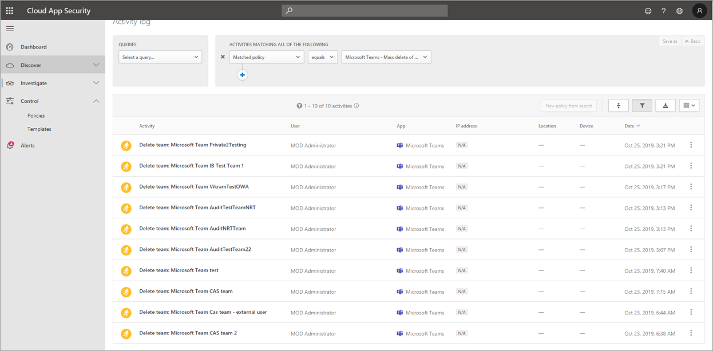

# 在 Microsoft Teams 中搜索事件的审核日志

> [!IMPORTANT]
> [!INCLUDE [new-teams-sfb-admin-center-notice](includes/new-teams-sfb-admin-center-notice.md)]

审核日志可帮助你在 Microsoft 365 服务中调查特定活动。 对于 Microsoft 团队，以下是已审核的一些活动：

- 团队创建
- 团队删除
- 添加频道
- 更改设置

有关审核的团队活动的完整列表，请参阅预览) 中的[团队](#teams-activities)活动和[团队活动中的倒班 (](#shifts-in-teams-activities)。

> [!NOTE]
> 来自专用频道的审核事件也会被记录为团队和标准频道。

## 在 Teams 中启用审核

在你可以查看审核数据之前，你必须先在[安全 & 合规中心](https://protection.office.com)中启用审核。 有关启用审核的帮助，请参阅[打开或关闭审核日志搜索](https://support.office.com/article/Turn-Office-365-audit-log-search-on-or-off-e893b19a-660c-41f2-9074-d3631c95a014)。

> [!IMPORTANT]
> 审核数据仅在您打开审核的位置可用。

## 从审核日志检索 Teams 数据

1. 要检索审核日志，请转到[安全与合规中心](https://go.microsoft.com/fwlink/?linkid=855775)。 在 "**搜索**" 下，选择 "**审核日志搜索**"。
2. 使用“**搜索**”按活动、日期和你要审核的用户进行筛选。
3. 将结果导出到 Excel 以供进一步分析。

> [!IMPORTANT]
> 仅当启用了审核功能时，审核日志中才会显示审核数据。

审核记录在审核日志中保留和搜索的时间长度取决于你的 Microsoft 365 或 Office 365 订阅，以及分配给用户的许可证类型。 若要了解详细信息，请参阅[安全 & 合规性中心服务说明](https://docs.microsoft.com/office365/servicedescriptions/office-365-platform-service-description/office-365-securitycompliance-center)。

## 有关搜索审核日志的提示

下面是在审核日志中搜索团队活动的提示。

- 你可以通过单击活动名称来选择要搜索的特定活动。 或者，您可以通过单击组名称来搜索组中的所有活动 (例如**文件和文件夹活动**) 。 如果已选择活动，则可以单击它以取消选择。 你还可以使用搜索框显示包含你键入的关键字的活动。 
    
- 若要显示使用 cmdlet 运行的活动事件，请在 "**活动**" 列表中选择 "**显示所有活动的结果**"。 如果您知道这些活动的操作的名称，请搜索所有活动，然后通过在 "**活动**" 列的框中键入操作的名称来筛选结果。 若要了解详细信息，请参阅[步骤3：筛选搜索结果](https://docs.microsoft.com/microsoft-365/compliance/search-the-audit-log-in-security-and-compliance?view=o365-worldwide#step-3-filter-the-search-results)。
- 若要清除当前搜索条件，请单击 "**清除**"。 日期范围将返回到过去七天的默认值。 您也可以单击 "全部**清除" 以显示所有活动的结果**，以取消所有选定的活动。
- 如果找到5000结果，则可能假设有超过5000个事件满足搜索条件。 你可以优化搜索条件，然后重新运行搜索以返回较少结果，也可以通过选择 "**导出结果**"  >  **下载所有结果**来导出所有搜索结果。

查看[此视频](https://www.youtube.com/embed/UBxaRySAxyE)，以使用音频日志搜索。 加入团队的计划经理 Ansuman Acharya，因为他演示了如何执行审核日志搜索团队。

## 使用 Cloud App Security 设置活动策略

使用[Microsoft Cloud App Security](https://docs.microsoft.com/cloud-app-security/what-is-cloud-app-security)集成，你可以设置[活动策略](https://docs.microsoft.com/cloud-app-security/user-activity-policies)，以使用应用提供程序的 api 强制执行广泛的自动化过程。 通过这些策略，你可以监视由不同用户执行的特定活动，或跟踪特定类型的活动的意外费率。

设置活动检测策略后，它将开始生成警报。 仅在创建策略后发生的活动上生成警报。 下面是有关如何使用 Cloud App Security 中的活动策略监控团队活动的一些示例方案。

### 外部用户方案

从业务角度看，您可能想要关注的一种方案是向团队环境添加外部用户。 如果启用了外部用户，则监视其状态是一个好主意。  你可以使用[Cloud App Security](https://docs.microsoft.com/cloud-app-security/what-is-cloud-app-security)来识别潜在威胁。

此策略的屏幕截图用于监视添加外部用户，使你可以命名策略、根据你的业务需求设置严重性、在此情况下将其设置为 () 单个活动，然后建立仅用于专门监视非内部用户添加的参数，并将此活动限制到团队。

可在活动日志中查看来自此策略的结果：

在此处，你可以查看与你已设置的策略的匹配项，并根据需要进行任何调整，或将结果导出为在其他位置使用。

### 批量删除方案

正如前面所述，你可以监视删除方案。 可以创建一个策略来监视团队网站的大量删除。 在此示例中，会将基于警报的策略设置为在30分钟跨度内检测团队的批量删除。

如屏幕截图所示，你可以为此策略设置许多不同的参数以监视团队删除，包括严重性、单个或重复操作，以及将此限制为团队和网站删除的参数。 这可以独立于模板执行，也可以根据组织的需要，创建基于此策略创建的模板。

建立适用于您的企业的策略后，您可以在触发事件时查看活动日志中的结果：

您可以筛选到已设置的策略，以查看该策略的结果。 如果你在活动日志中获得的结果不满意 (可能会看到大量结果，或者所有) 都没有任何结果，这可能会帮助你微调查询以使其更与你需要的操作相关。

### 通知和监管方案

当活动策略被触发时，您可以设置通知并向管理员和其他用户发送电子邮件。 你可以设置自动化监管操作，例如挂起用户或让用户以自动方式再次登录。 此示例显示了当活动策略被触发并确定用户在30分钟内删除了两个或多个团队时，用户帐户可以如何暂停。

## 使用 Cloud App Security 设置异常情况检测策略

Cloud App Security 中的[异常检测策略](https://docs.microsoft.com/cloud-app-security/anomaly-detection-policy)提供全新的用户和实体行为分析 (UEBA) 和计算机学习 (ML) ，以便你可以在云环境中立即运行高级威胁检测。 由于它们会自动启用，因此新的异常检测策略通过提供即时检测来提供即时的结果，它针对你的用户和连接到你的网络的计算机和设备提供了多个行为异常。 此外，新策略会从 Cloud App Security 检测引擎中公开更多数据，以帮助你加快调查过程并包含持续威胁。

我们正在努力将团队事件集成到异常检测策略中。 现在，你可以为其他 Office 产品设置异常情况检测策略，并在与这些策略匹配的用户上执行操作项目。

## 团队活动

下面列出了 Microsoft 365 审核日志中的团队用户和管理员活动所记录的所有事件。 该表包括 "**活动**" 列中显示的友好名称，以及导出搜索结果时在审核记录的详细信息和 CSV 文件中显示的相应操作的名称。

|友好名称  |操作|说明 |
|---------|---------|---------|
|已将机器人添加到团队   |BotAddedToTeam        |用户将机器人添加到团队。        |
|添加频道   |ChannelAdded         |用户向团队添加频道。         |
|已添加连接器  |ConnectorAdded          |用户向频道添加连接线。        |
|已添加成员    |MemberAdded         |团队所有者将成员添加到团队、频道或群组聊天。         |
|已添加选项卡    |TabAdded         |用户将选项卡添加到频道。        |
|已更改频道设置    |ChannelSettingChanged         |当团队成员执行以下活动时，将记录 ChannelSettingChanged 操作。 对于这些活动中的每个活动，在审核日志搜索结果的 "**项目**" 列中显示已更改 (括号中所更改设置的说明。 <ul><li>更改团队频道 (**频道名称**的名称) </li><li> (**频道描述**) 的 "更改团队频道" 说明</li> </ul>      |
|已更改的组织设置   |TeamsTenantSettingChanged         |当 Microsoft 365 管理中心中的全局管理员执行以下活动时，将记录 TeamsTenantSettingChanged 操作。 这些活动影响组织范围的团队设置。 若要了解详细信息，请参阅[管理你的组织的团队设置](enable-features-office-365.md)。  对于这些活动中的每个活动，在审核日志搜索结果的 "**项目**" 列中显示已更改 () 中显示的设置的说明。<ul><li>启用或禁用 (**Microsoft 团队**) 的组织团队。</li><li>为组织 (**skype For business 互操作性**) 启用或禁用 Microsoft 团队和 skype for business 之间的互操作性。</li><li>启用或禁用 "Microsoft 团队客户" 中的组织结构图视图 (**组织结构图视图**") 。</li><li>允许或禁止团队成员安排私人会议 (**私人会议安排**) 的功能。</li><li>启用或禁用团队成员 (**频道会议安排**) 安排频道会议的功能。</li><li>启用或禁用) **Skype 会议 (视频的**团队会议中的视频通话。</li><li>在 Microsoft 团队聚会中启用或禁用) **Skype 会议 (屏幕共享**的 "屏幕共享"。</li><li>允许或禁止 (名为 Giphy) 的动画图像添加到团队对话 (**动画图像**) 。</li><li>更改组织 (**内容分级**) 的内容评级设置。 内容分级限制可在对话中显示的动画图像的类型。</li><li>允许或禁止团队成员将可自定义的图像添加 (称为自定义 meme) 从 internet 到团队对话 (来自 Internet 的自**定义图像**) 。</li><li>允许或禁止团队成员将可编辑的图像添加 (称为贴纸) 到团队对话 (**可编辑的图像**) 。</li><li>启用或禁用团队成员在 Microsoft 团队聊天和频道中使用机器人的功能， (**组织范围内的 bot) **。</li><li>为 Microsoft 团队启用特定的 bot。 这不包括 T-机器人，在为组织 (**单个 bot**) 中启用了机器人的情况下，这些功能是团队帮助机器人。</li><li>启用或禁用团队成员 (**扩展名或选项**卡添加) 的扩展或选项卡的功能。</li><li>启用或禁用用于 Microsoft 团队的专用 bot 的侧面加载) 的 (**面加载**。</li><li>启用或禁用用户将电子邮件发送到 Microsoft 团队频道 (**频道电子邮件**) 的功能。</li></ul>|
|已更改团队成员的角色    |MemberRoleChanged         |团队所有者更改团队成员的角色。 以下值表示分配给用户的角色类型。   **1** -指示所有者角色。 **2** -指示成员角色。 **3** -指示来宾角色。  Members 属性还包括您的组织的名称和成员的电子邮件地址。        |
|已更改的团队设置    |TeamSettingChanged        |当团队所有者执行以下活动时，将记录 TeamSettingChanged 操作。 对于这些活动中的每个活动，在审核日志搜索结果的 "**项目**" 列中显示已更改 () 中显示的设置的说明。<ul><li>更改团队的访问权限类型。 团队可以设置为私人或公共 (**团队访问类型**) 。 当团队 (默认设置) 时，用户只能通过邀请访问团队。 当团队是公共团队时，它会被任何人发现。</li><li>更改团队 (**团队分类**) 的信息分类。 例如，可以将团队数据分类为高业务影响、中型企业影响或低业务影响。</li><li>更改团队 (**团队名称**) 的名称。</li><li> (**团队描述**) 更改团队说明。</li><li>对团队设置所做的更改。 若要访问这些设置，团队所有者可以右键单击团队，选择 "**管理团队**"，然后单击 "**设置**" 选项卡。对于这些活动，已更改的设置的名称将显示在审核日志搜索结果的 "**项目**" 列中。</li></ul>         |
|已创建团队    |TeamCreated         |用户创建团队。         |
|已删除所有组织应用|DeletedAllOrganizationApps           |已从目录中删除所有组织应用。     |
|已删除应用 |AppDeletedFromCatalog           |已从目录中删除应用。     |
|已删除频道     |ChannelDeleted         |用户从团队中删除频道。         |
|已删除团队  |TeamDeleted            |团队所有者删除团队。      |
|已安装应用 |AppInstalled         |已安装应用。   |
|已在卡上执行操作|PerformedCardAction|用户在聊天中的自适应卡上采取行动。 自适应卡通常由 bot 用来在聊天中允许信息和交互的丰富显示。   **注意：** 在审核日志中，仅在聊天中的自适应卡上才可使用内联输入操作。 例如，当用户在由轮询 bot 生成的自适应卡上的频道对话中提交轮询响应时。 用户操作（如 "查看结果"）将打开一个对话框，或对话中的用户操作将不会在审核日志中提供。|
|已发布应用 |AppPublishedToCatalog           |已将应用添加到目录中。     |
|已从团队中删除机器人   |BotRemovedFromTeam         |用户从团队中删除机器人。       |
|已删除连接线     |ConnectorRemoved         |用户从频道中删除连接线。         |
|已删除成员    |MemberRemoved        |团队所有者从团队、频道或群组聊天中删除成员。         |
|已删除选项卡    |TabRemoved         |用户从频道中删除选项卡。         |
|已卸载应用 |AppUninstalled           |已卸载应用。     |
|已更新应用 |AppUpdatedInCatalog           |目录中的应用已更新。     |
|已更新连接线    |ConnectorUpdated         |用户修改了频道中的连接器。         |
|已更新选项卡   |TabUpdated         |用户修改了频道中的选项卡。         |
|升级的应用 |AppUpgraded           |已将应用升级到目录中的最新版本。     |
|用户已登录到团队     |TeamsSessionStarted         |用户登录到 Microsoft 团队客户端。 此事件不会捕获令牌刷新活动。         |

## 团队活动的倒班

**（处于预览阶段）**

如果你的组织使用团队中的倒班应用，则可以在审核日志中搜索与倒班应用相关的活动。 下面是在 Microsoft 365 审核日志的团队中为倒班活动记录的所有事件的列表。

|友好名称  |操作  |说明  |
|---------|---------|---------|
|已添加计划组      |SchedulingGroupAdded          |用户成功将新的计划组添加到计划。          |
|已编辑的计划组     |SchedulingGroupEdited         |用户成功编辑计划组。          |
|已删除的日程安排组         |SchedulingGroupDeleted              |用户从计划中成功删除计划组。|
|已添加班次      |ShiftAdded          |用户成功地添加了班次。           |
|已编辑班次       |ShiftEdited       |用户成功编辑班次。        |
|删除的班次          |ShiftDeleted          | 用户成功删除班次。               |
|已添加下班时间      |TimeOffAdded          |用户成功地为计划添加了时间。          |
|编辑时间         |TimeOffEdited           |用户成功编辑超时。          |
|删除的超时     |TimeOffDeleted              |用户成功删除超时。           |
|已添加左移位     |OpenShiftAdded          |用户成功将打开的班次添加到了计划组。          |
|已编辑的左移位    |OpenShiftEdited          |用户成功编辑计划组中打开的班次。          |
|已删除的打开班次      |OpenShiftDeleted          |用户成功地从计划组中删除了一个打开的班次。         |
|共享计划     |ScheduleShared                  |用户成功地为日期范围共享团队日程。          |
|使用时间时钟上班打卡         |ClockedIn          |用户使用时间时钟成功地上班打卡。          |
|使用时间时钟下班打卡      |ClockedOut          |用户使用时间时钟成功地下班打卡。          |
|使用时间时钟启动中断      |BreakStarted          |用户在处于活动状态的时间时钟会话期间成功启动了中断。          |
|使用时间时钟结束休息    |BreakEnded          |用户在活动时间时钟会话期间成功结束中断。          |
|已添加时间时钟条目     |TimeClockEntryAdded          |用户成功地在工时单上添加了新的手动时间时钟条目。          |
|已编辑的时间时钟条目     | TimeClockEntryEdited             |用户成功编辑工时单上的时间时钟条目。          |
|已删除的时间时钟条目    |TimeClockEntryDeleted              |用户成功删除工时单上的时间时钟条目。          |
|已添加班次请求         |RequestAdded              |用户添加了班次请求。          |
|已响应班次请求     |RequestRespondedTo                  |用户响应了班次请求。          |
|已取消班次请求         |RequestCanceled               |用户取消了班次请求。          |
|已更改的日程安排设置      |ScheduleSettingChanged          |用户更改了 "倒班" 设置中的设置。         |
|添加劳动力集成      |WorkforceIntegrationAdded                  | 倒班应用与第三方系统集成。         |
|已接受的离开班次消息         |OffShiftDialogAccepted          |用户在倒班小时后确认访问团队的非班次消息。           |

## Office 365 管理活动 API

你可以使用 Office 365 管理活动 API 检索有关团队事件的信息。 若要了解有关团队的管理活动 API 架构的详细信息，请参阅[团队架构](https://docs.microsoft.com/office/office-365-management-api/office-365-management-activity-api-schema#microsoft-teams-schema)。

## 团队审核日志中的特性

团队中的成员身份更改 (例如，通过 Azure Active Directory (Azure AD) 、Microsoft 365 管理门户或 Microsoft 365 组绘制的) 的成员关系图 API 将显示在团队审核消息中以及与该操作的实际发起者无关的常规频道中。 在这些方案中，请咨询 Azure AD 或[Microsoft 365 组审核日志](https://docs.microsoft.com/microsoft-365/compliance/search-the-audit-log-in-security-and-compliance)以查看相关信息。

## 相关主题

- [在 Microsoft 365 合规性中心中搜索审核日志](https://docs.microsoft.com/microsoft-365/compliance/search-the-audit-log-in-security-and-compliance) 
