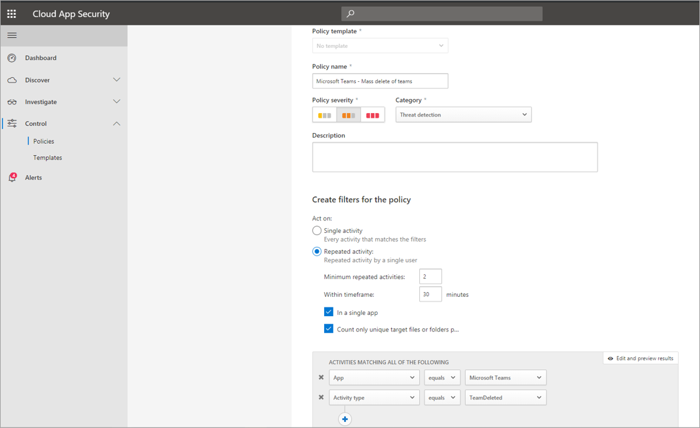

# 在 Microsoft Teams 中搜索事件的审核日志

> [!IMPORTANT]
> [!INCLUDE [new-teams-sfb-admin-center-notice](includes/new-teams-sfb-admin-center-notice.md)]

此审核日志可帮助你调查不同服务Microsoft 365活动。 对于Microsoft Teams，以下是一些已审核的活动：

- 团队创建
- 团队删除
- 添加频道
- 更改设置

有关已审核Teams活动的完整列表，请参阅 Teams 活动以及预览版Teams中的 ([班次) 。 ](#shifts-in-teams-activities)

> [!NOTE]
> 还会记录来自专用频道的审核事件，因为它们适用于团队和标准频道。

## 在 Teams 中启用审核

在查看审核数据之前，您必须首先在安全与合规中心 [&审核](https://protection.office.com)。 有关启用审核的帮助，请阅读 [打开审核日志打开或关闭搜索](https://support.office.com/article/Turn-Office-365-audit-log-search-on-or-off-e893b19a-660c-41f2-9074-d3631c95a014)。

> [!IMPORTANT]
> 只有启用审核时，审核数据才可用。

## 从审核日志检索 Teams 数据

1. 要检索审核日志，请转到[安全与合规中心](https://go.microsoft.com/fwlink/?linkid=855775)。 在"**搜索"** 下，**选择"审核日志搜索"。**

2. 使用“**搜索**”按活动、日期和你要审核的用户进行筛选。

3. 将结果导出到 Excel 以供进一步分析。

> [!IMPORTANT]
> 审核数据仅在启用审核审核日志在审核中可见。

审核记录在 审核日志 中保留和搜索的时间长度取决于 Microsoft 365 或 Office 365 订阅，特别是分配给用户的许可证类型。 有关详细信息，请参阅安全与& [中心服务说明](/office365/servicedescriptions/office-365-platform-service-description/office-365-securitycompliance-center)。

## 使用技巧搜索审核日志

下面是在活动Teams搜索活动审核日志。

- 可以通过单击活动名称选择要搜索的特定活动。 或者，可以通过单击组名称来搜索组 (**活动** ，例如"文件"和) "活动"。 如果选择了某个活动，可以单击它以取消选择。 您也可以使用搜索框显示包含所键入关键字的活动。

  

- 若要显示使用 cmdlet 运行的活动的事件，请在"活动"列表中选择"显示所有活动 **的结果**"。 如果知道这些活动的操作名称，请搜索所有活动，然后在"活动"列中的框中键入操作 **的名称来筛选** 结果。 若要了解有关详细信息，请参阅 [步骤 3：筛选搜索结果](/microsoft-365/compliance/search-the-audit-log-in-security-and-compliance#step-3-filter-the-search-results)。

- 若要清除当前搜索条件，请单击"清除 **"。** 日期范围将返回到过去七天的默认值。 还可以单击"全部 **清除"以显示所有活动的结果，** 以取消所有选定的活动。

- 如果找到 5，000 个结果，可能假设有 5，000 多个事件满足搜索条件。 可以优化搜索条件并重新运行搜索以返回更少的结果，或者可以通过选择"导出下载所有结果"导出  >  **所有搜索结果**。

观看 [此视频，](https://www.youtube.com/embed/UBxaRySAxyE) 了解使用音频日志搜索。 加入 Ansuman Acharya，Teams，他演示如何执行搜索审核日志搜索Teams。

## 使用云应用安全设置活动策略

使用[Microsoft Cloud App Security](/cloud-app-security/what-is-cloud-app-security)集成，可以设置[活动策略](/cloud-app-security/user-activity-policies)，以使用应用提供程序的 API 强制实施各种自动化过程。 使用这些策略可以监视各种用户执行的特定活动，或跟踪某个特定类型活动的意外高速率。

设置活动检测策略后，它会开始生成警报。 只会根据创建策略后发生的活动生成警报。 下面是一些示例方案，演示了如何使用活动策略云应用安全活动Teams活动。

### 外部用户方案

你可能希望从业务角度关注一个方案，就是将外部用户Teams环境中。 如果启用了外部用户，则监视其状态是个不错的主意。  可以使用[云应用安全识别](/cloud-app-security/what-is-cloud-app-security)潜在威胁。

用于监视添加外部用户的此策略的屏幕截图允许您命名策略、根据业务需求设置严重性、将严重性设置为 (（本例中为) 个活动）并创建专门监视非内部用户的添加的参数，然后将此活动限制为 Teams。

可以在活动日志中查看此策略的结果：

可在此处查看已设置的策略的匹配项，根据需要做出任何调整，或导出结果以在其他地方使用。

### 批量删除方案

如前所述，可以监视删除方案。 可以创建一个策略来监视大量删除Teams站点。 本示例设置了基于警报的策略，以在 30 分钟内检测团队的大规模删除。

如屏幕截图所示，您可以为此策略设置许多不同的参数来监视 Teams 删除，包括严重性、单一或重复操作，以及限制此操作以Teams和站点删除的参数。 可以独立于模板完成此操作，或者根据组织需求创建模板，以基于此策略。

建立适用于业务的策略后，可以在触发事件时查看活动日志中的结果：

可以筛选到已设置的策略，以查看该策略的结果。 如果在活动日志中获得的结果不理想 (可能是因为看到的结果很多，或者) 没有任何结果，这可以帮助你微调查询，使其与需要它执行哪些操作更相关。

### 警报和治理方案

可以设置警报，在触发活动策略时向管理员和其他用户发送电子邮件。 可以设置自动化治理操作，例如暂停用户或让用户以自动方式重新登录。 此示例演示触发活动策略时如何暂停用户帐户，并确定用户在 30 分钟内删除了两个或多个团队。

## Teams活动

下面是为用户和管理员活动记录的所有事件的列表，Teams活动Microsoft 365 审核日志。 该表包括"活动"列中显示的友好名称，以及导出搜索结果时在审核记录的详细信息和 CSV 文件中显示的相应操作的名称。

|友好名称  |操作 |说明 |
|:---------|:---------|:---------|
|向团队添加了机器人   |BotAddedToTeam        |用户向团队添加机器人。        |
|添加频道   |ChannelAdded         |用户向团队添加频道。         |
|添加了连接器  |ConnectorAdded          |用户向通道添加连接器。        |
|添加了成员    |MemberAdded         |团队所有者将成员添加到团队、频道或群组聊天。         |
|"已添加"选项卡    |TabAdded         |用户向频道添加选项卡。        |
|更改了频道设置    |ChannelSettingChanged         |当团队成员执行以下活动时，将记录 ChannelSettingChanged 操作。 对于其中每个活动，更改的设置的说明 (显示在搜索结果的"项"列中审核日志显示。  <ul><li>更改团队频道的名称 (**频道名称)**</li><li>更改团队频道的说明 (**频道说明)**</li> </ul>      |
|已更改组织设置   |TeamsTenantSettingChanged         |当团队中的全局管理员执行以下活动时，将记录 TeamsTenantSettingChanged Microsoft 365 管理中心。 这些活动会影响组织范围的Teams设置。 有关详细信息，请参阅[管理Teams组织设置](enable-features-office-365.md)。  对于上述每个活动， (搜索结果中的"项"列中) 审核日志显示已更改的设置的说明。 <ul><li>为组织Teams启用或禁用 **(Microsoft Teams) 。**</li><li>为组织启用或禁用Microsoft Teams Skype for Business之间的互操作性 (Skype for Business **互操作性) 。**</li><li>在"组织结构图"视图中启用或禁用 **Microsoft Teams" ("组织结构图) 。**</li><li>启用或禁用团队成员安排私人会议 (**私人会议计划) 。**</li><li>启用或禁用团队成员在频道会议安排 (**安排频道会议**) 。</li><li>为会议启用或禁用Teams会议 (**视频Skype会议) 。**</li><li>为组织的会议Microsoft Teams启用或禁用 (屏幕共享Skype **会议**) 。</li><li>启用或禁用添加名为 Giphys (动画图像) ，Teams动画 (**对话**) 。</li><li>更改组织的内容分级设置 (**内容分级) 。** 内容分级限制可在对话中显示的动画图像类型。</li><li>启用或禁用团队成员将自定义图像（称为 (meme) 从 Internet 添加到团队对话 (Internet 中的可自定义图像) 。 </li><li>启用或禁用团队成员向团队对话添加可编辑图像 (贴纸)  (**可** 编辑) 。</li><li>启用或禁用团队成员在组织范围内聊天Microsoft Teams和频道中 (**机器人) 。**</li><li>为机器人启用特定Microsoft Teams。 这不包括 T-Bot，这是Teams为组织启用机器人时可用的帮助机器人， (**机器人**) 。</li><li>启用或禁用团队成员在"扩展"或选项卡 (**扩展或选项卡) 。**</li><li>启用或禁用专有机器人的旁加载Microsoft Teams (机器人的旁加载 **) 。**</li><li>启用或禁用用户向频道或频道电子邮件Microsoft Teams发送电子邮件 (**功能) 。**</li></ul>|
|更改了团队成员在团队中的角色    |MemberRoleChanged         |团队所有者更改了团队中成员的角色。 以下值指示分配给用户的角色类型。   **1** - 指示成员角色。 **2** - 指示"所有者"角色。 **3** - 指示来宾角色。  "成员"属性还包括组织名称和成员的电子邮件地址。        |
|已更改团队设置    |TeamSettingChanged        |团队所有者执行以下活动时，将记录 TeamSettingChanged 操作。 对于上述每个活动， (搜索结果中的"项"列中) 审核日志显示已更改的设置的说明。 <ul><li>更改团队的访问类型。 Teams可设置为专用或公用 (**团队访问类型) 。** 当团队是专用 (默认设置) ，用户只能通过邀请访问团队。 当团队公开时，任何人都可以发现它。</li><li>更改团队信息分类 (**团队) 。** 例如，可以将团队数据分类为高业务影响、中等业务影响或低业务影响。</li><li>将团队名称 (**团队名称) 。**</li><li>将团队说明 (**团队说明) 。**</li><li>对团队设置所做的更改。 若要访问这些设置，团队所有者可以右键单击某个团队，选择"**管理团队"，** 然后单击"设置选项卡。 对于这些活动，更改的设置的名称会显示在搜索结果的"项"审核日志列中。 </li></ul>         |
|创建了聊天 1 、2| ChatCreated|    创建了Teams聊天。|
|已创建团队    |TeamCreated         |用户创建团队。         |
|已删除邮件  |MessageDeleted |聊天或频道中的消息已删除。|
|删除所有组织应用|DeletedAllOrganizationApps           |从目录中删除所有组织应用。     |
|已删除的应用 |AppDeletedFromCatalog           |应用已从目录中删除。     |
|已删除的通道     |ChannelDeleted         |用户从团队中删除频道。         |
|已删除的团队  |TeamDeleted            |团队所有者删除团队。      |
|在邮件中编辑了包含 URL 链接Teams     |MessageEditedHasLink         |用户编辑消息，并将 URL 链接添加到消息Teams。         |
|导出的消息1、2  | MessagesExported |已导出聊天或频道消息|.
|提取的聊天  1</sup， 2>    |ChatRetrieved  |检索Microsoft Teams聊天。|
|提取了消息1、2的所有 托管内容  |MessageHostedContentsListed    |检索了消息中所有托管的内容，例如图像或代码片段。|
|已安装的应用 |AppInstalled         |已安装应用。   |
|对卡片执行的操作|PerformedCardAction|用户在聊天中对自适应卡采取措施。 机器人通常使用自适应卡来丰富信息，以及聊天中的交互。   **注意：** 只有聊天内自适应卡上的内联输入操作才能在聊天审核日志。 例如，当用户在轮询机器人生成的自适应卡上的通道聊天中提交轮询响应时。 用户操作（例如"查看结果"）将打开一个对话框，或者对话框中的用户操作在审核日志。|
|发布新消息1、2     |消息发送新消息已发布至聊天或频道。|
|已发布的应用 |AppPublishedToCatalog           |应用程序已添加到目录。     |
|阅读邮件1、2   |MessageRead    |检索了聊天或频道的消息。|
|读取消息 1、2的 托管内容    |MessageHostedContentRead   |检索了消息中的托管内容，例如图像或代码片段。|
|已从团队中删除机器人   |BotRemovedFromTeam         |用户从团队中删除机器人。       |
|删除了连接器     |ConnectorRemoved         |用户从通道中删除连接器。         |
|已删除成员    |MemberRemoved        |团队所有者从团队、频道或群组聊天中删除成员。         |
|"已删除"选项卡    |TabRemoved         |用户从频道中删除选项卡。         |
|检索到的消息1、2   |MessagesListed |检索了来自聊天或频道的消息。|
|在邮件中发送了包含 URL 链接Teams |MessageCreatedHasLink|用户发送一条消息，其中包含一个 URL Teams。|
|发送了消息创建更改通知 1 、2   |MessageCreatedNotification |已发送更改通知，通知订阅的侦听器应用程序收到新消息。|
|已发送消息删除更改通知1、2    |MessageDeletedNotification |已发送更改通知，以通知订阅的侦听器应用程序已删除消息。|
|已发送消息更新1、2更改通知 |MessageUpdatedNotification |已发送更改通知，以通知订阅的侦听器应用程序已更新消息。|
|订阅了消息更改通知1、2   |SubscribedToMessages   |侦听器应用程序创建了一个订阅，用于接收消息更改通知。|
|已卸载的应用 |AppUninstalled           |应用已卸载。     |
|更新的应用 |AppUpdatedInCatalog           |在目录中更新了应用。     |
|更新了聊天1、2   |ChatUpdated    |更新Teams聊天。|
|更新了消息1、2    |MessageUpdated |聊天或频道的消息已更新。|
|更新的连接器    |ConnectorUpdated         |用户修改了通道中的连接器。         |
|"更新"选项卡   |TabUpdated         |用户修改了频道中的选项卡。         |
|升级后的应用 |AppUpgraded           |应用已升级到目录中的最新版本。     |
|用户登录到 Teams     |TeamsSessionStarted         |用户登录 Microsoft Teams 客户端。 此事件不会捕获令牌刷新活动。         |
||||

> [!NOTE]
> 1只有在通过调用 Microsoft Graph API 执行该操作时，才记录此事件的审核记录。 如果在客户端中Teams操作，将不会记录审核记录  2 此事件仅在"高级审核"中可用。 这意味着，必须先为用户分配适当的许可证，然后才能将这些事件记录到审核日志。 有关仅在"高级审核"中提供的活动详细信息，请参阅"高级审核[Microsoft 365"。](/microsoft-365/compliance/advanced-audit#advanced-audit-events) 有关高级审核许可要求，请参阅 Microsoft 365 中的[审核解决方案](/microsoft-365/compliance/auditing-solutions-overview#licensing-requirements)。

## 活动Teams班次

**（处于预览阶段）**

如果你的组织正在使用 Shifts 应用，Teams搜索审核日志 Shifts 应用相关的活动。 下面是在活动记录中为 Shifts 活动记录的所有Teams Microsoft 365 审核日志。

|友好名称  |操作  |说明  |
|---------|---------|---------|
|添加了计划组 |ScheduleGroupAdded          |用户已成功将新的计划组添加到计划。|
|已编辑的计划组     |ScheduleGroupEdited         |用户已成功编辑计划组。          |
|已删除的计划组         |ScheduleGroupDeleted              |用户已成功从计划中删除计划组。|
|With分期计划 |ScheduleWithdrawn              |用户已成功撤消已发布的计划。|
|添加了班次      |ShiftAdded          |用户已成功添加班次。           |
|已编辑的班次       |ShiftEdited       |用户已成功编辑班次。        |
|已删除的班次          |ShiftDeleted          | 用户已成功删除班次。               |
|添加了休息时间      |TimeOffAdded          |用户已成功添加日程安排的假。          |
|编辑的休息时间         |TimeOffEdited           |用户已成功编辑假。          |
|已删除的休息时间     |TimeOffDeleted              |用户已成功删除假。           |
|添加了打开班次     |OpenShiftAdded          |用户已成功将未排班添加到计划组。          |
|编辑的打开班次    |OpenShiftEdited          |用户已成功在计划组中编辑未排班。          |
|已删除的打开班次      |OpenShiftDeleted          |用户已成功从计划组中删除未排班。         |
|共享计划     |ScheduleShared                  |用户已成功共享日期范围的团队计划。          |
|使用时间时钟进行时钟         |ClockedIn          |用户已成功使用时间时钟进行时钟。          |
|使用时间时钟打卡      |ClockedOut          |用户使用时间时钟成功打卡。          |
|使用时间时钟开始中断      |BreakStarted          |用户在活动时间时钟会话期间成功启动中断。          |
|使用时间时钟结束中断    |BreakEnded          |用户在活动时间时钟会话期间成功结束中断。          |
|添加了"时间时钟"条目     |TimeClockEntryAdded          |用户已成功在"时间表"上添加新的手动"时间时钟"条目。          |
|编辑的"时间时钟"条目     | TimeClockEntryEdited             |用户已成功编辑"时间表"上的"时间时钟"条目。          |
|已删除的"时间时钟"条目    |TimeClockEntryDeleted              |用户已成功删除"时间表"上的"时间时钟"条目。          |
|添加了班次请求         |RequestAdded              |用户添加了班次请求。          |
|响应班次请求     |RequestRespondedTo                  |用户响应了调班请求。          |
|取消的班次请求         |RequestCancelled               |用户取消了班次请求。          |
|更改了计划设置      |ScheduleSettingChanged          |用户更改 Shifts 设置中的设置。         |
|添加了员工集成      |WorkforceIntegrationAdded                  | Shifts 应用与第三方系统集成。         |
|接受调班消息         |OffShiftDialogAccepted          |用户确认轮班消息，以在Teams后访问。           |

## Office 365管理活动 API

可以使用管理Office 365 API 检索有关事件Teams的信息。 若要详细了解用于存储的管理活动 API 架构Teams，请参阅Teams[架构](/office/office-365-management-api/office-365-management-activity-api-schema#microsoft-teams-schema)。

## 审核日志中Teams属性

Teams (的成员身份更改（例如，通过 Azure Active Directory (Azure AD) 、Microsoft 365 管理门户或 Microsoft 365 组 Graph API 添加或删除) 的用户）将显示在 Teams 审核消息和"常规"频道中，并归因到团队的现有所有者，而不是操作的实际发起者。 在这些情况下，请查阅 Azure AD 或[Microsoft 365组审核日志](/microsoft-365/compliance/search-the-audit-log-in-security-and-compliance)以查看相关信息。

## 使用云应用安全设置异常情况检测策略

云应用安全 中的异常情况检测策略提供开箱即用的用户和实体行为分析 (UEBA) 和机器学习 (ML) 以便可以跨云环境立即运行高级威胁检测。 由于新异常检测策略是自动启用的，因此通过提供即时检测来提供即时结果，针对用户以及连接到网络的计算机和设备中的大量行为异常。 此外，新策略还会从 云应用安全引擎公开更多数据，以帮助你加快调查过程并包含持续的威胁。

我们正在努力将异常Teams集成到异常检测策略中。 目前，可以针对其他产品设置异常情况检测Office，并针对符合这些策略的用户采取操作项。

## 相关主题

- [在审核日志搜索Microsoft 365 合规中心](/microsoft-365/compliance/search-the-audit-log-in-security-and-compliance)
