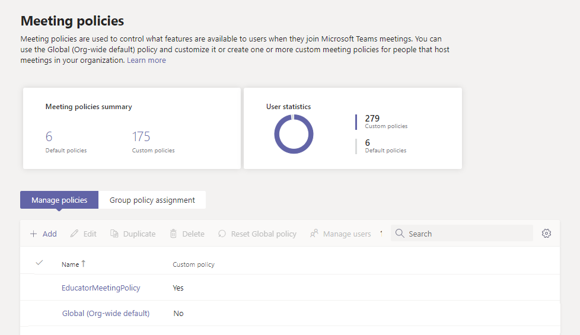

# <a name="assign-policies-to-large-sets-of-users-in-your-school"></a>为学校中的大量用户分配策略

[!INCLUDE [policy-wizard-edu](includes/policy-wizard-edu.md)]

> [!NOTE]
> 有关在服务中分配策略的较大Microsoft Teams，请参阅在 Teams[中分配策略](assign-policies.md)。

## <a name="overview"></a>概述

是否需要为学生和教师提供对应用内不同功能Microsoft Teams？ 可以按许可证类型快速识别组织中用户，然后为其分配适当的策略。 本教程介绍如何向学校中的大量用户分配会议策略。 可以使用管理中心和 PowerShell Microsoft Teams策略，我们将展示这两种方法。

可以将会议策略分配给用户作为成员的安全组，或者直接通过批处理策略分配大规模地将会议策略分配给用户。 你将了解以下内容：

- **使用 [组的策略分配](#assign-a-policy-to-a-group)将会议策略分配给安全组 (建议) 。** 此方法允许基于组成员身份分配策略。 可以将策略分配到安全组或通讯组列表。 将成员添加到组或删除组时，会相应地更新其继承的策略分配。 我们建议使用此方法，因为这样可以减少管理新用户的策略或用户的角色更改的时间。 此方法最适合最多 50，000 名用户的组，但也适用于较大的组。

- **使用 [批处理策略分配](assign-policies.md#assign-a-policy-to-a-batch-of-users) 将会议策略直接批量分配给用户**。 一次最多为 5，000 个用户分配策略。 如果用户数超过 5，000，可以提交多个批次。 使用此方法时，当有新用户时，需要重新运行批处理分配，以将策略分配给这些新用户。

请记住，Teams用户会自动获取 Teams 策略类型的全局 (组织范围默认) 策略，除非创建并分配自定义策略。 由于学生群体通常是最大的一组用户，他们通常会收到限制性最严格的设置，因此建议执行以下操作：

- 创建自定义策略，允许私人聊天和会议计划等核心功能，并将该策略分配给教职员工和教师。
- 将自定义策略分配给教职员工和教师。
- 编辑并应用全局 (组织范围内的默认) 策略，以限制学生的功能。

请记住，在创建自定义策略并将其分配给教职员工和教师之前，全局策略将应用于学校中的所有用户。

在本教程中，学生将获取全局会议策略，我们将为教职员工和教师分配名为"教师""MeetingPolicy"的自定义会议策略。 我们假定你已编辑全局策略，为学生定制会议设置，并创建了一个[](policy-packages-edu.md)自定义策略，用于定义教职员工和教师的会议体验。



## <a name="assign-a-policy-to-a-group"></a>向组分配策略

按照以下步骤为教职员工和教师创建安全组，然后将名为"教师""MeetingPolicy"的自定义会议策略分配给该安全组。

### <a name="before-you-get-started"></a>开始之前

> [!IMPORTANT]
> 将策略分配到组时，策略分配将按照优先级规则传播到该组的成员。 例如，如果直接为用户分配了策略 (单独分配或批处理分配) ，则该策略优先于从组继承的策略。 这也意味着，如果用户具有直接分配给他们的会议策略，则你必须从该用户中删除该会议策略，然后他们才能从安全组继承会议策略。

在开始使用之前，必须了解优先级[规则和](assign-policies.md#precedence-rules)[组分配排名](assign-policies.md#group-assignment-ranking)。 **请确保阅读并了解有关组的策略分配的信息 [中的概念](assign-policies.md#what-you-need-to-know-about-policy-assignment-to-groups)**。

你需要完成所有这些步骤，让教职员工和教师从安全组继承会议策略。

1. [创建安全组](#create-security-groups)。
2. [将策略分配给安全组](#assign-a-policy-to-a-security-group)。
3. [删除直接分配给用户的策略](#remove-a-policy-that-was-directly-assigned-to-users)。

### <a name="create-security-groups"></a>创建安全组

首先，为教职员工和教师创建安全组。

借助[学校数据同步 (](/SchoolDataSync/) SDS) ，可以轻松[创建学校教师和学生](/SchoolDataSync/edu-security-groups)的安全组。 建议使用 SDS 创建管理学校策略所需的安全组。

如果无法在环境中部署 SDS，请使用此 [PowerShell](scripts/powershell-script-security-groups-edu.md) 脚本创建两个安全组，一个安全组用于分配有教职员工许可证的所有教职员工和教师，另一个安全组用于分配有学生许可证的所有学生。 需要定期运行此脚本，使组保持最新状态。

### <a name="assign-a-policy-to-a-security-group"></a>将策略分配给安全组

#### <a name="using-the-microsoft-teams-admin-center"></a>使用 Microsoft Teams 管理中心

> [!NOTE]
> 目前，使用 Microsoft Teams 管理中心向组分配策略仅适用于 Teams 呼叫策略、Teams 呼叫公园策略、Teams 策略、Teams 实时事件策略、Teams 会议策略和 Teams 消息策略。 对于其他策略类型，请使用 PowerShell。

1. 在 Microsoft Teams 管理员中心的左侧导航中，转到 **“会议”** > **“会议策略”**。
2. 选择" **组策略分配"** 选项卡。
3. 选择 **"添加组**"，然后在" **将策略分配到组"窗格中** 执行以下操作：

    
    1. 在 **"选择组"** 框中，搜索并添加包含教职员工和教师的安全组。
    2. 在"**选择排名"** 框中，输入 **1。**
    3. 在"**选择策略"框中**，选择 **"教师""MeetingPolicy"。**
    4. 选择"**应用"。**

若要删除组策略分配，请在策略页的"组 **策略** 分配"选项卡上，选择组分配，然后选择"删除 **"。**

若要更改组分配的排名，首先必须删除组策略分配。 然后，按照上述步骤将策略分配给组。

#### <a name="using-powershell"></a>使用 PowerShell

> [!NOTE]
> 目前，使用 PowerShell 向组分配策略不适用于所有Teams类型。 有关[支持的策略类型列表，请参阅 New-CsGroupPolicyAssignment。](/powershell/module/teams/new-csgrouppolicyassignment)

##### <a name="install-and-connect-to-the-microsoft-teams-powershell-module"></a>安装并连接到 Microsoft Teams PowerShell 模块

运行以下代码，Teams [PowerShell](https://www.powershellgallery.com/packages/MicrosoftTeams)模块 (（如果尚未) ）。 请确保安装版本 1.0.5 或更高版本。

```powershell
Install-Module -Name MicrosoftTeams
```

运行以下代码连接到Teams并启动会话。

```powershell
Connect-MicrosoftTeams
```

系统提示时，使用管理员凭据登录。

##### <a name="assign-a-policy-to-a-group"></a>向组分配策略

运行以下代码，将名为"教师""MeetingPolicy"的会议策略分配给包含教职员工和教师的安全组，并将作业排名设置为 1。 可以使用对象 ID、会话启动协议或 SIP (或电子邮件地址) 安全组。 本示例使用电子邮件地址 (staff-faculty@contoso.com) 。

```powershell
New-CsGroupPolicyAssignment -GroupId staff-faculty@contoso.com -PolicyType TeamsMeetingPolicy -PolicyName "EducatorMeetingPolicy" -Rank 1
```

### <a name="remove-a-policy-that-was-directly-assigned-to-users"></a>删除直接分配给用户的策略

请记住，如果直接为用户分配了策略 (单独分配，或者通过批处理分配) ，该策略优先。 这意味着，如果用户具有直接分配给他们的会议策略，则你必须从该用户中删除该会议策略，然后才能从安全组继承会议策略。

若要了解有关详细信息， [请参阅有关向组分配策略的需知信息](assign-policies.md#what-you-need-to-know-about-policy-assignment-to-groups)。

请按照以下步骤删除直接分配给教职员工和教师的会议策略。

#### <a name="install-and-connect-to-the-microsoft-teams-powershell-module"></a>安装并连接到 Microsoft Teams PowerShell 模块

运行以下代码，Teams [PowerShell](https://www.powershellgallery.com/packages/MicrosoftTeams)模块 (（如果尚未) ）。 请确保安装版本 1.0.5 或更高版本。

```powershell
Install-Module -Name MicrosoftTeams
```

运行以下代码连接到Teams并启动会话。

```powershell
Connect-MicrosoftTeams
```

系统提示时，使用用于连接到 Azure AD 的相同管理员凭据登录。

#### <a name="unassign-a-policy-that-was-directly-assigned-to-users"></a>取消分配直接分配给用户的策略

运行以下操作，从直接分配了该策略的用户中删除会议策略。 可以按电子邮件地址或对象 ID 指定用户。

此示例中，会议策略已从其电子邮件地址指定的用户中删除。

```powershell
$users_ids = @("reda@contoso.com", "nikica@contoso.com", "jamie@contoso.com")
New-CsBatchPolicyAssignmentOperation -PolicyType TeamsMeetingPolicy -PolicyName $null -Identity $users_ids -OperationName "Unassign meeting policy"
```

本示例从名为 user_ids.txt 的文本文件中的用户列表中删除会议user_ids.txt。

```powershell
$user_ids = Get-Content .\users_ids.txt
New-CsBatchPolicyAssignmentOperation -PolicyType TeamsMeetingPolicy -PolicyName $null -Identity $users_ids -OperationName "Unassign meeting policy"
```

##### <a name="get-policy-assignments-for-a-group"></a>获取组的策略分配

运行以下代码，查看分配给特定安全组的所有策略。 请注意，组始终按组 ID 列出，即使其 SIP 地址或电子邮件地址用于分配策略。

```powershell
Get-CsGroupPolicyAssignment -GroupId staff-faculty@contoso.com

```

##### <a name="get-the-policies-assigned-to-a-user"></a>获取分配给用户的策略

运行以下代码，查看分配给特定用户的所有策略。 以下示例演示如何获取分配给 reda@contoso.com。

```powershell
Get-CsUserPolicyAssignment -Identity reda@contoso.com
```

## <a name="assign-a-policy-to-a-batch-of-users"></a>向一批用户分配策略

按照以下步骤将名为"教师""MeetingPolicy"的自定义会议策略直接批量分配给教职员工和教师。

### <a name="using-powershell"></a>使用 PowerShell

#### <a name="connect-to-the-azure-ad-powershell-for-graph-module-and-the-teams-powershell-module"></a>连接 Azure AD PowerShell for Graph 模块和 Teams PowerShell 模块

执行本文中的步骤之前，需要安装并连接到 Azure AD PowerShell for Graph 模块 (，以通过用户分配的许可证) 和 Microsoft Teams PowerShell 模块 (来标识用户，以将策略分配给这些用户) 。

##### <a name="install-and-connect-to-the-azure-ad-powershell-for-graph-module"></a>安装并连接到 Azure AD PowerShell for Graph 模块

打开提升的 Windows PowerShell 命令提示符 (以管理员 Windows PowerShell 运行) ，然后运行以下命令来安装 Azure Active Directory PowerShell for Graph 模块。

```powershell
Install-Module -Name AzureAD
```

运行以下代码以连接到 Azure AD。

```powershell
Connect-AzureAD
```

系统提示时，使用管理员凭据登录。

若要了解有关详细信息，请参阅连接[PowerShell for Azure Active Directory 模块的 Graph。](/office365/enterprise/powershell/connect-to-office-365-powershell#connect-with-the-azure-active-directory-powershell-for-graph-module)

##### <a name="install-and-connect-to-the-microsoft-teams-powershell-module"></a>安装并连接到 Microsoft Teams PowerShell 模块

运行以下代码，Teams [PowerShell](https://www.powershellgallery.com/packages/MicrosoftTeams)模块 (（如果尚未) ）。 请确保安装版本 1.0.5 或更高版本。

```powershell
Install-Module -Name MicrosoftTeams
```

运行以下代码连接到Teams并启动会话。

```powershell
Connect-MicrosoftTeams
```

系统提示时，使用用于连接到 Azure AD 的相同管理员凭据登录。

#### <a name="identify-your-users"></a>标识用户

首先，运行以下代码，按许可证类型标识教职员工和教师。 这可告知组织使用哪些 SKUS。 然后，可以识别分配了教职员工 SKU 的员工和教师。

```powershell
Get-AzureAdSubscribedSku | Select-Object -Property SkuPartNumber,SkuId
```

这将返回：

```
SkuPartNumber      SkuId
-------------      -----
M365EDU_A5_FACULTY e97c048c-37a4-45fb-ab50-922fbf07a370
M365EDU_A5_STUDENT 46c119d4-0379-4a9d-85e4-97c66d3f909e
```

本示例的输出显示教职员工许可证 SkuId 为"e97c048c-37a4-45fb-ab50-922fbf07a370"。

> [!NOTE]
> 若要查看教育 SKU 和 SKU ID 的列表，请参阅 [教育 SKU 参考](sku-reference-edu.md)。

接下来，运行以下代码来标识拥有此许可证的用户，并收集所有这些用户。

```powershell
$faculty = Get-AzureADUser -All $true | Where-Object {($_.assignedLicenses).SkuId -contains "e97c048c-37a4-45fb-ab50-922fbf07a370"}
```

#### <a name="assign-a-policy-in-bulk"></a>批量分配策略

现在，我们将相应的策略批量分配给用户。 可为其分配或更新策略的最大用户数是一次 5，000。 例如，如果教职员工和教师超过 5，000 人，则需要提交多个批次。

运行以下代码，将名为"教师""MeetingPolicy"的自定义会议策略分配给教职员工和教师。

```powershell
New-CsBatchPolicyAssignmentOperation -PolicyType TeamsMeetingPolicy -PolicyName EducatorMeetingPolicy -Identity $faculty.ObjectId
```

> [!NOTE]
> 若要批量分配不同的策略类型（如 TeamsMessagingPolicy），需要更改为要分配的策略和 ```PolicyType``` ```PolicyName``` 策略名称。

#### <a name="get-the-status-of-a-bulk-assignment"></a>获取批量分配的状态

每个批量分配都返回一个操作 ID，可用于跟踪策略分配的进度或识别可能发生的任何失败。 例如，运行以下代码：

```powershell
Get-CsBatchPolicyAssignmentOperation -OperationId 3964004e-caa8-4eb4-b0d2-7dd2c8173c8c | fl
```

若要查看批处理操作中每个用户的分配状态，请运行以下代码。 每个用户的详细信息均在 ```UserState``` 属性中。

```powershell
Get-CsBatchPolicyAssignmentOperation -OperationId 3964004e-caa8-4eb4-b0d2-7dd2c8173c8c | Select -ExpandProperty UserState
```

#### <a name="assign-a-policy-in-bulk-if-you-have-more-than-5000-users"></a>如果用户数超过 5，000，请批量分配策略

首先，运行以下代码，查看有多少教职员工和教师：

```powershell
$faculty.count
```

不是提供完整的用户 ID 列表，而是运行以下代码来指定前 5，000 个，然后指定接下来的 5，000 个，以此类比。

```powershell
New-CsBatchPolicyAssignmentOperation -PolicyType TeamsMeetingPolicy -PolicyName EducatorMeetingPolicy -Identity $faculty[0..19999].ObjectId
```

可以更改用户 ID 范围，直到到达用户的完整列表。 例如，输入 作为第一批，使用 作为第二批，输入 作为第三批， ```$faculty[0..4999``` ```$faculty[5000..9999``` ```$faculty[10000..14999``` 等等。

#### <a name="get-the-policies-assigned-to-a-user"></a>获取分配给用户的策略

运行以下代码，查看分配给特定用户的所有策略。 以下示例演示如何获取分配给 hannah@contoso.com。

```powershell
Get-CsUserPolicyAssignment -Identity hannah@contoso.com
```

## <a name="faq"></a>常见问题

**我不熟悉 PowerShell for Teams。在哪里可以了解更多信息？**

有关使用 PowerShell 管理 Teams 的Teams，请参阅[PowerShell 概述](teams-powershell-overview.md)。 有关本文中使用的 cmdlet 详细信息，请参阅：

- [New-CsGroupPolicyAssignment](/powershell/module/teams/new-csgrouppolicyassignment)
- [Get-CsGroupPolicyAssignment](/powershell/module/teams/get-csgrouppolicyassignment)
- [New-CsBatchPolicyAssignmentOperation](/powershell/module/teams/new-csbatchpolicyassignmentoperation)
- [Get-CsBatchPolicyAssignmentOperation](/powershell/module/teams/get-csbatchpolicyassignmentoperation)
- [Get-CsUserPolicyAssignment](/powershell/module/teams/get-csuserpolicyassignment)

## <a name="related-topics"></a>相关主题

- [将策略分配给用户](assign-policies.md)
- [用于教育的 Teams 策略和策略包](policy-packages-edu.md)
- [管理 Teams 中的会议策略](meeting-policies-in-teams.md)