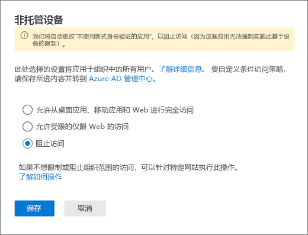

# 阻止特定用户对 SharePoint 的访问

在 Microsoft 365 中对 SharePoint 应用任何条件访问 (CA) 策略也会应用到 Teams。 但是，有些组织希望阻止对 SharePoint 文件的访问（上载、下载、查看、编辑、创建），但允许其员工在非托管设备上使用Teams 桌面、移动设备和 web 客户端。 根据 CA 策略规则，阻止 SharePoint 也会导致阻止 Teams。 本文将解释如何克服这一限制，允许员工继续使用 Teams，同时完全阻止对存储在 SharePoint 中的文件的访问。

> [!Note]
> 阻止或限制对非托管设备的访问取决于 Azure AD 条件访问策略。 了解 [Azure AD 许可](https://azure.microsoft.com/pricing/details/active-directory/)。 有关 Azure AD 中条件访问的概述，请参阅 [Azure Active Directory 中的条件访问](https://docs.microsoft.com/azure/active-directory/conditional-access/overview)。 有关推荐的 SharePoint Online 访问策略的信息，请参阅 [用于保护 SharePoint 网站和文件的策略建议](https://docs.microsoft.com/microsoft-365/enterprise/sharepoint-file-access-policies)。 如果限制非托管设备上的访问，则托管设备上的用户必须使用其中一个[受支持的操作系统和浏览器组合](https://docs.microsoft.com/azure/active-directory/conditional-access/technical-reference#client-apps-condition)，否则他们的访问权限也将受到限制。

可以阻止或限制对以下内容的访问：

- 组织中的用户，或仅部分用户或安全组。

- 组织中的所有网站，或仅部分网站。

访问被阻止时，用户将看到一条错误消息。 阻止访问有助于提供安全性并保护安全数据。 访问被阻止时，用户将看到一条错误消息。

1. 打开 SharePoint 管理中心。

2. 展开“**策略**” > “**访问策略**”。

3. 在“**非托管设备**”部分，选择 **“阻止访问**”，然后选择“**保存**”。

   

4. 打开 [Azure Active Directory](https://portal.azure.com/#blade/Microsoft_AAD_IAM/ConditionalAccessBlade/Policies) 门户并导航到**条件访问策略**。

    您将看到 SharePoint 创建了新策略，与此示例类似：

    

5. 更新策略以仅针对特定用户或组。

    

  > [!Note]
> 设置此策略将切断您对 SharePoint 管理门户的访问权限。 我们建议您配置排除策略并选择全局管理员和 SharePoint 管理员。

6. 验证是否仅选择 SharePoint 作为目标云应用

    

7. 更新**条件**以包括桌面客户端。

    

8. 确保已启用 **授予访问权限**

    

9. 请确保已启用“**使用应用强制限制**”。

10. 启用策略并选择“**保存**”。

    

若要测试您的策略，您需要从任何客户端（如 Teams 桌面应用程序或 OneDrive for Business 同步客户端）注销，然后重新登录以查看策略是否有效。 如果你的访问已被阻止，你将在 Teams 中看到指出该项目可能不存在的消息。

 

在 Sharepoint 中，您将收到拒绝访问的消息。

## 相关主题

[在 SharePoint 中控制对非托管设备的访问](https://docs.microsoft.com/sharepoint/control-access-from-unmanaged-devices)
