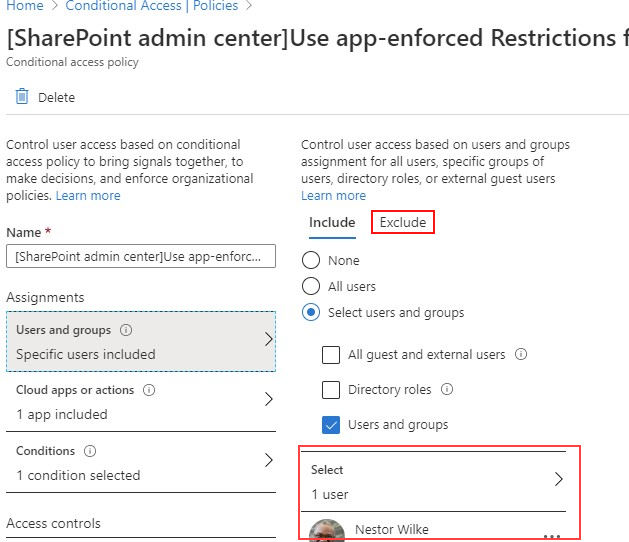

# 阻止特定用户对 SharePoint 的访问

在 Microsoft 365 中的 SharePoint 上 (CA) 策略应用任何条件访问也将应用于团队。 但是，某些组织希望阻止对 SharePoint 文件的访问 (上载、下载、查看、编辑、创建) 但允许其员工在非托管设备上使用团队桌面、移动和 web 客户端。 在 CA 策略规则下，阻止 Sharepoint 也会导致阻止团队。 本文介绍如何解决此限制，并允许员工在完全阻止访问存储在 SharePoint 中的文件的同时继续使用团队。

> [!Note]
> 阻止或限制非托管设备上的访问依赖于 Azure AD 条件访问策略。 了解 [AZURE AD 授权](https://azure.microsoft.com/pricing/details/active-directory/)。 有关 Azure AD 中的条件访问的概述，请参阅 [Azure Active Directory 中的条件访问](https://docs.microsoft.com/azure/active-directory/conditional-access/overview)。 有关推荐的 SharePoint Online 访问策略的信息，请参阅 [保护 sharepoint 网站和文件的策略建议](https://docs.microsoft.com/microsoft-365/enterprise/sharepoint-file-access-policies)。 如果你限制非托管设备上的访问权限，则托管设备上的用户必须使用 [受支持的操作系统和浏览器组合](https://docs.microsoft.com/azure/active-directory/conditional-access/technical-reference#client-apps-condition)之一，否则它们也将具有有限的访问权限。

您可以阻止或限制访问：

- 组织中的用户或仅部分用户或安全组。

- 组织中的所有网站或仅部分网站。

当访问被阻止时，用户将看到一条错误消息。 阻止访问有助于提供安全性和保护安全数据。 当访问被阻止时，用户将看到一条错误消息。

1. 打开 "SharePoint [管理中心](https://admin.microsoft.com/sharepoint?page=accessControl&modern=true)"。

2. 展开 "**策略**  >  **访问策略**"。

3. 在 " **非托管设备** " 部分中，选择 " **阻止访问** "，然后选择 " **保存**"。

   

4. 打开 [Azure Active Directory](https://portal.azure.com/#blade/Microsoft_AAD_IAM/ConditionalAccessBlade/Policies) 门户并导航到 " **条件访问策略**"。

    你将看到 SharePoint 创建了一个类似于此示例的新策略：

    

5. 将策略更新为仅面向特定用户或组。

    

  > [!Note]
> 设置此策略将减少你对 SharePoint 管理门户的访问权限。 我们建议你配置排除策略，并选择全局管理员和 SharePoint 管理员。

6. 验证仅将 SharePoint 选为目标云应用

    

7. 也可更新 **条件** 以包括桌面客户端。

    

8. 确保已启用 " **授权访问** "

    

9. 请确保启用 " **使用应用强制实施限制** "。

10. 启用你的策略，然后选择 " **保存**"。

    

若要测试你的策略，你需要从任何客户端（如团队桌面应用或 OneDrive for business 同步客户端）注销，然后再次登录以查看策略是否正常工作。 如果您的访问已被阻止，则会在团队中看到一条消息，指出该项目可能不存在。

 

在 Sharepoint 中，你将收到 "拒绝访问" 消息。

## 相关主题

[控制 SharePoint 中非托管设备的访问](https://docs.microsoft.com/sharepoint/control-access-from-unmanaged-devices)
