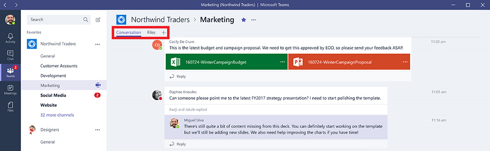

在 Microsoft Teams 中使用内置选项卡和自定义选项卡Use built-in and custom tabs in Microsoft Teams
==================================================

团队成员通过选项卡可以访问频道内专用画布上的服务。Tabs allow team members to access services on a dedicated canvas within a channel. 这样，团队可以在频道的上下文中直接使用你提供的工具和数据，并就它们展开对话。This lets the team work directly with the tools and data you provide, and to have conversations about them, in the channel’s context. 对于每个新频道，默认预配两个选项卡，如下文所列和下图所示：With every new channel, two tabs are provisioned by default, as listed and shown in the image, below:

-   对话Conversations

-   文件Files

1.  所有者和团队成员可以向每个频道添加其他选项卡，以帮助集成其云服务。Owners and team members can add additional tabs, to each channel, to help integrate their cloud services.

2.  Excel、PowerPoint、Word 和 PDF 必须先上载到**“文件”选项卡**，然后才能转换为选项卡。Excel, PowerPoint, Word and PDF files must be uploaded to the **Files tab** before they can be converted to tabs. 此外，只需单击一次即可将已上载的任何现有文件转换为选项卡，如下所示。Alternatively, any existing uploaded, files can be converted into tabs with a single click, as shown below.

    

3.  要添加网站，URL 必须以 **https 前缀**开头，以使交换的任何信息保持安全。To add a website, the URL must start with an **https prefix,** so that any information exchanged remains secure.

4.  团队成员尝试向其频道添加自定义选项卡时，系统会提供详细说明。Detailed instructions are provided when a team member attempts to add a custom tab into their channel.

5.  向频道添加自定义选项卡时，系统会创建一个**选项卡对话**，允许团队成员就内容展开重点讨论。When a Custom tab is added into a channel, a **Tab conversation** is created that allows team members to have focused discussions about the content.

    

6.  可以向频道添加其他选项卡，以帮助用户轻松访问和管理其所需的数据或通过最新方式进行交互。Additional tabs can be added to channels to help users easily access and manage the data they need or interact with the most. 这可以是 Power BI 报表、仪表板，甚至可以是 [Microsoft Stream](https://go.microsoft.com/fwlink/?linkid=855785) 视频频道，你可以在此发布培训视频。This can be a Power BI report, a dashboard, or even a [Microsoft Stream](https://go.microsoft.com/fwlink/?linkid=855785) video channel where you publish training videos.

    

开发自定义选项卡Develop custom tabs
-------------------

除了内置选项卡外，组织可以轻松设计和开发自己的选项卡，这些选项卡可以集成到 Microsoft Teams 中，也可以与社区的其他人共享。In addition to the built-in tabs, organizations can easily design and develop their own tabs, that can be integrated into Microsoft Teams, or shared with the rest of the community.

Microsoft Developer Network 提供了[详细说明](https://go.microsoft.com/fwlink/?linkid=855786)来指导如何设计和构建你自己的选项卡，以及下载和部署 Microsoft 开发的[示例选项卡](https://go.microsoft.com/fwlink/?linkid=855787)。The Microsoft Developer Network provides [detailed instructions](https://go.microsoft.com/fwlink/?linkid=855786) to design and build your own tabs; and download and deploy [sample tabs](https://go.microsoft.com/fwlink/?linkid=855787) developed by Microsoft.

