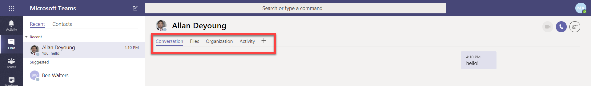

在 Microsoft Teams 中使用内置选项卡和自定义选项卡
==================================================

选项卡允许团队成员在频道内或在聊天中访问服务和内容。 这使团队可以直接使用工具和数据，并在频道或聊天的上下文中提供有关工具和数据的对话。

所有者和团队成员可以向频道、私人聊天和群组聊天中添加选项卡，以帮助集成其云服务。 可添加选项卡以帮助用户轻松访问和管理他们需要的数据或与大多数用户进行交互。 这可以是 Power BI 报表、仪表板，甚至可以是 [Microsoft Stream](https://go.microsoft.com/fwlink/?linkid=855785) 视频频道，你可以在此发布培训视频。

## 使用选项卡

- 在每个新频道中，默认设置两个选项卡： "对话" 和 "文件"。

    
- 通过每个私人聊天，默认设置四个选项卡： "对话"、"文件"、"组织" 和 "活动"。

    

- 所有者和团队成员可以通过单击 "添加选项卡" 按钮的**选项卡**  在频道或聊天的顶部。

- Excel、PowerPoint、Word 和 PDF 文件必须先上载到 "**文件**" 选项卡，然后才能转换为选项卡。 任何现有的上载文件都可以通过单击转换为选项卡，如下所示。

    

- 若要添加网站，URL 必须以**https**前缀开头，以便交换的信息保持安全。

- 当团队成员尝试向其频道或聊天添加自定义选项卡时，将提供详细说明。 将自定义选项卡添加到频道时，将创建一个**选项卡对话**，允许团队成员对内容进行重点讨论。

    

## 开发自定义选项卡

除了内置选项卡，还可以设计和开发自己的选项卡，以便集成到团队或与社区中的其他人共享。 您可以通过配置相应的 Office 365 组来[控制对您的自定义选项卡的访问](https://docs.microsoft.com/microsoftteams/platform/get-started/design#streamline-access)。

Microsoft 开发人员网络提供 Microsoft 开发的[示例选项卡](https://docs.microsoft.com/MicrosoftTeams/platform/samples/code-samples)，您可以下载这些选项卡以及设计和构建自己的选项卡的[详细说明](https://docs.microsoft.com/MicrosoftTeams/platform/tabs/design/tabs)。

---
