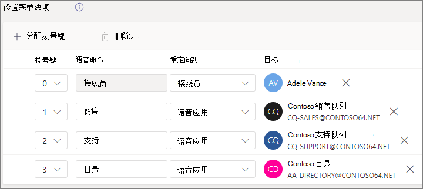
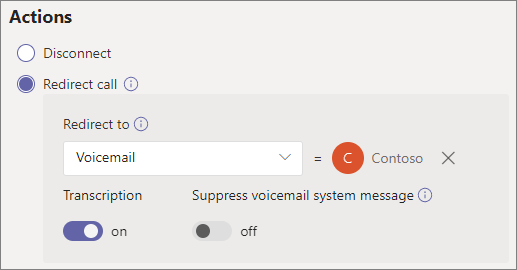
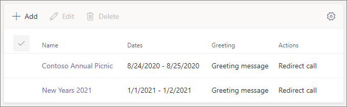

# 设置自动助理 - 小型企业教程

自动助理可让你的人呼叫你的组织并导航菜单系统，以与正确的部门、呼叫队列、人员或接线员通话。 可以使用 Microsoft Teams 管理中心为组织创建自动助理。

#### 开始之前

从组织外部直接拨号，获取自动助理所需的服务号码。 这可能包括 [从另一个提供商转移号码](../phone-number-calling-plans/transfer-phone-numbers-to-teams.md) 或 [请求新的服务号码](../getting-service-phone-numbers.md)。

获取 [计划创建的每个](../teams-add-on-licensing/virtual-user.md) 自动助理的电话系统 - 虚拟用户许可证。 这些许可证是免费的，因此我们建议获取一些额外的许可证，以防你决定在将来对设置进行更改。

如果要让自动助理在假日以不同方式路由呼叫，请创建想要使用的假日，然后再创建自动助理。

#### 按照以下步骤设置自动助理

# [步骤 1   电话号码](#tab/phone-number)

创建的每个自动助理都需要一个资源帐户。 这类似于用户帐户，但该帐户与自动助理或呼叫队列（而不是人员）相关联。 在此步骤中，我们将创建帐户，为其分配 *Microsoft 365 电话系统 - 虚拟用户* 许可证，然后分配服务号码。

### 创建资源帐户

可以在 Teams 管理中心创建资源帐户。

1. 在 Teams 管理中心中，展开 **"组织范围的设置"，** 然后单击"**资源帐户"。**

2. 单击“**添加**”。

3. 在" **添加资源帐户"** 窗格中，填写" **显示** 名称"和" **用户名"，** 然后选择" **自动助理"** 作为"资源帐户 **类型"**

    

4. 单击“**保存**”。

新帐户将显示在帐户列表中。

### 分配许可证

必须将 Microsoft *365 Phone System - 虚拟用户许可证* 分配给资源帐户。

1. 在 Microsoft 365 管理中心中，单击要为其分配许可证的资源帐户。

2. 在"**许可证和应用"选项卡上的**"许可证 **"下**，选择 **"Microsoft 365 手机系统 - 虚拟用户"。**

3. 单击"**保存更改"。**

    

### 分配服务编号

如果需要通过电话号码访问此自动助理，请将其分配给资源帐户。

1. 在 Teams 管理中心的"**资源** 帐户"页上，选择要为其分配服务号码的资源帐户，然后单击"分配 **/取消分配"。**

2. 在 **"电话号码类型** "下拉列表中，选择想要使用的号码类型。

3. 在 **"分配的电话号码"** 框中，搜索想要使用的号码，然后单击"添加 **"。**

    

4. 单击“**保存**”。

> [!div class="nextstepaction"]
> [步骤 2 - 自动助理常规信息>](https://review.docs.microsoft.com/microsoftteams/business-voice/create-a-phone-system-auto-attendant-smb?branch=mikeplum-smb-voice&tabs=general-info#steps)

# [步骤 2   Attendant 常规信息](#tab/general-info)

设置自动助理

1. 在 Teams 管理中心中，展开 **"语音"，** 单击 **"自动助理"，** 然后单击"添加 **"。**

2. 在顶部的框中键入自动助理的名称。

3. 如果要指定操作员，请指定调用操作员的目标。 这是可选的 (，但建议) 。 你可以设置 **"接线员** "选项，允许呼叫者离开菜单，与指定人员通话。

4. 指定此自动助理的时区。 如果为营业时间创建单独的呼叫流，则时区用于计算营业时间。

5. 为此自动助理指定语言。 此语言将用于系统生成的语音提示。

6. 选择是否要启用语音输入。 启用后，每个菜单选项的名称将成为语音识别关键字。 例如，呼叫者可以说"一"来选择映射到键 1 的菜单选项，也可以说"销售"来选择名为"销售"的菜单选项。

    

7. 单击" **下一步**"。

> [!div class="nextstepaction"]
> [步骤 3 - 呼叫流>](https://review.docs.microsoft.com/microsoftteams/business-voice/create-a-phone-system-auto-attendant-smb?branch=mikeplum-smb-voice&tabs=call-flow#steps)

# [步骤 3   呼叫流](#tab/call-flow)

选择呼叫流选项

1. 选择当自动助理应答呼叫时是否要播放问候语。

    如果选择"**播放音频文件"，** 可以使用"上传文件"按钮上传在 中另存为音频的录制问候消息。WAV、 。MP3 或 。WMA 格式。 录制内容不能大于 5 MB。

    如果选择 **"键入** 问候消息"，系统将在自动助理应答呼叫时朗读你键入 (最多 1000 个字符) 文本。

    

2. 选择要如何路由呼叫。

    如果选择" **断开连接"，** 自动助理将挂断呼叫。

    如果选择" **重定向呼叫"，** 可以选择其中一个呼叫路由目标。

    如果选择"**播放菜单选项**"，可以选择"播放音频文件"或"键入问候语"，然后在菜单选项和目录搜索之间选择。

    

3. 如果希望呼叫者使用拨号键进行导航，那么在"设置菜单选项"下，选择当呼叫者按拨号键时要发生的情况。  (如果要以公司目录创建此自动助理，请保留"拨号键"选项为空。) 

    可以将任何拨号键设置为以下目标：

    - **组织中的人** - 组织中能够接收语音呼叫的人。
    - **语音应用** - 另一个自动助理或呼叫队列。
    - **外部电话号码** - 任何电话号码。 使用此格式：+[国家/地区代码][区号][电话号码]
    - **语音邮件** - 与指定的 Microsoft 365 组关联的语音邮箱。
    - **接线** 员 - 为自动助理定义的操作员。 定义运算符是可选的。 运算符可定义为此列表中的任何其他目标。

    建议为运算符设置 0 个键。

    对于每个菜单选项，请指定以下内容：

    - **拨号键** - 电话键盘上的按键，用于访问此选项。

    - **语音** 命令 - 定义如果启用了语音输入，呼叫者可以授予用于访问此选项的语音命令。 它可以包含多个字词，例如"客户服务"或"运营与订单"。 

    - **重定向到** - 当呼叫者选择此选项时希望呼叫转到的地方。 如果要重定向到自动助理或呼叫队列，请选择与其关联的资源帐户。

    

4. 如果要使用此自动助理作为公司目录，请在"目录搜索"下，选择"**按名称拨号"。** 启用此选项后，呼叫者可以说出用户的姓名或在电话键盘上键入用户名。 任何具有电话系统许可证的联机用户都是符合条件的用户，可以使用"按姓名拨叫"找到。 

     (可以选择" **按分机号码拨** 叫"，但必须在 Azure Active Directory.) 

5. 选择目录 **搜索选项后**，单击"下一 **步"。**

> [!div class="nextstepaction"]
> [步骤 4 - 非工作时间呼叫流>](https://review.docs.microsoft.com/microsoftteams/business-voice/create-a-phone-system-auto-attendant-smb?branch=mikeplum-smb-voice&tabs=after-hours#steps)

# [步骤 4   小时之后](#tab/after-hours)

可以针对每个自动助理设置营业时间。 如果没有设置营业时间，所有日期以及每天的所有时间均视为营业时间，因为默认情况下设置为全天候时间表。 营业时间可以设置为一天中的休息时间，所有未设置为营业时间的营业时间均视为非营业时间。 您可以为非工作时间设置不同的传入呼叫处理选项和问候语。

根据自动助理和呼叫队列的配置方式，可能只需为具有直接电话号码的自动助理指定非工作时间呼叫路由。

如果希望为非工作时间呼叫者单独进行呼叫路由，请指定每天的营业时间。 例如 **，单击** "添加新时间"以指定给定一天的多个小时集，以指定午餐休息时间。

指定营业时间后，选择营业时间的呼叫路由选项。 与在步骤 **3**- 呼叫流 中指定的营业时间呼叫路由相同。

完成后 **，** 单击"下一步"。

> [!div class="nextstepaction"]
> [步骤 5 - 假日呼叫流>](https://review.docs.microsoft.com/microsoftteams/business-voice/create-a-phone-system-auto-attendant-smb?branch=mikeplum-smb-voice&tabs=holidays#steps)

# [步骤 5   假日](#tab/holidays)

你可以让自动助理的呼叫在节假日的路由方式与其他日期不同。  (如果不希望对假日使用不同的呼叫流，可以跳过此步骤。) 

你的自动助理可以针对你设置的每个假日设置呼叫流。 可以为每个自动助理添加最多 20 个计划假日。

1. 在"假日呼叫设置"页上，单击"**添加"。**

2. 键入此假日设置的名称。

3. 从 **"假日** "下拉列表中，选择想要使用的假日。

4. 选择想要使用的问候语类型。

    

5. 选择是否要断开连接 **或****重定向** 呼叫。

6. 如果选择重定向，请选择呼叫的呼叫路由目标。

    

7. 单击“**保存**”。

根据需要对每个额外的假日重复该过程。

添加所有假日后，单击"下一 **步"。**

> [!div class="nextstepaction"]
> [步骤 6 - 选择目录中>](https://review.docs.microsoft.com/microsoftteams/business-voice/create-a-phone-system-auto-attendant-smb?branch=mikeplum-smb-voice&tabs=dial-scope#steps)

# [步骤 6   目录成员](#tab/dial-scope)

拨号 *范围* 定义当呼叫者使用按名称拨叫或按分机拨叫时，哪些用户在目录中可用。 "所有 **联机用户"的** 默认值包括组织中具有电话系统许可证的联机用户的所有用户。

可以通过在"包括"或"排除"下选择"自定义用户组"并选择一个或多个 Microsoft 365 组、通讯组列表或安全组来包括或排除特定用户。  例如，你可能希望从拨号目录中排除组织中高层。  (如果用户同时在两个列表中，则他们将被排除在 directory.) 

> [!NOTE]
> 新用户可能需要最多 36 小时才能在目录中列出其名称。

设置完拨号范围后，单击"下一 **步"。**

> [!div class="nextstepaction"]
> [步骤 7 - 分配资源帐户>](https://review.docs.microsoft.com/microsoftteams/business-voice/create-a-phone-system-auto-attendant-smb?branch=mikeplum-smb-voice&tabs=resource-accounts#steps)

# [步骤 7   资源帐户](#tab/resource-accounts)

所有自动助理必须具有关联的资源帐户。  一级自动助理至少需要一个具有关联服务编号的资源帐户。 如果需要，可以将多个资源帐户分配给自动助理，每个帐户都有单独的服务编号。

添加资源帐户

1. 单击 **"添加** 帐户"并搜索要添加的帐户。 单击 **"添加**"，然后单击"**添加"。**

    

2. 添加完服务帐户后，单击"提交 **"。**

    

这会完成自动助理配置。

---

